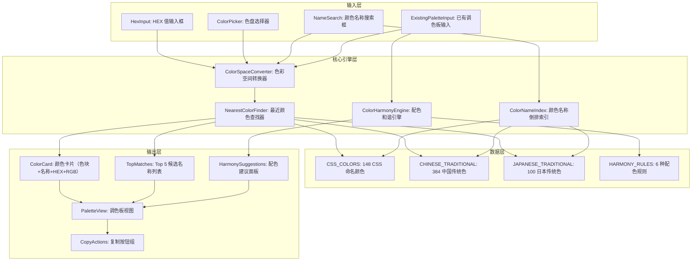
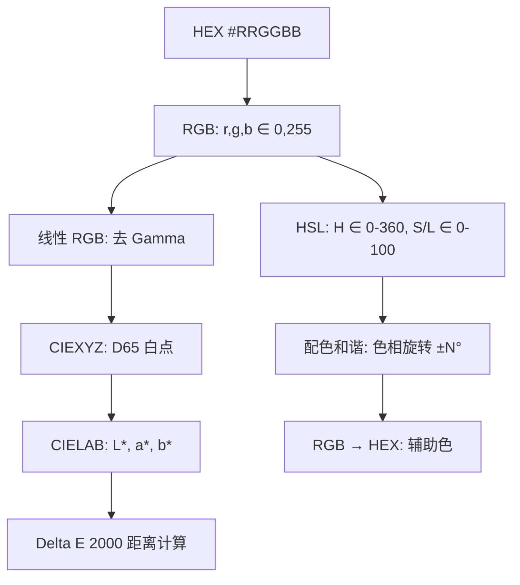

# YP-09-185: 颜色命名器 — 颜色到中文名称映射、CSS颜色名查找、颜色名称搜索、调色板命名、HEX/名称复制、配色建议、中国传统文化颜色支持

> 需求编号：YP-09-185 · 优先级：P2 · 人天：0.2d · 状态：需求已编写
> 依赖：YP-09-143（颜色拾取器，可选输入源）

## 背景

### 问题陈述

设计师和开发者在日常工作中有大量"颜色到名称"和"名称到颜色"的转换需求——为设计系统中的颜色 token 命名、在 CSS 中引用命名颜色、为品牌色找中国传统色的对应名称。当前痛点包括：

1. **颜色命名困难**：开发者看到 `#4A90D9` 时，只能描述为"那种蓝"，无法给出精确名称（如"天青蓝"或"钢蓝"）
2. **CSS 颜色名查找不便**：CSS 3 定义了 148 个命名颜色（如 `cornflowerblue`、`burlywood`），但记住全部不现实
3. **中国传统色缺失**：现有工具大多只覆盖西方 CSS 颜色名，缺少"胭脂""黛蓝""月白""缃色"等中国传统色
4. **配色建议分散**：品牌主色确定后，还需要找互补色、类似色、三色组合——需要切换到另一个工具
5. **调色板命名**：设计师创建了 5 色调色板，需要给每个颜色起有意义的名字——纯手工命名耗时且不一致

**核心矛盾**：颜色命名看似简单，但要在几万个颜色名称中精确匹配"最近的颜色"并给出中文名称，需要高效的色彩空间搜索算法。市面上没有一款同时覆盖 CSS 颜色名和中国传统色名称的便捷工具。

### 影响范围

| # | 影响 | 严重程度 | 典型场景 |
|---|------|----------|----------|
| 1 | 颜色命名困难 | 高 | 为设计 token 命名 |
| 2 | CSS 颜色名遗忘 | 中 | 写 CSS 时想用命名颜色 |
| 3 | 中国传统色难以查找 | 中 | 品牌色匹配传统色 |
| 4 | 配色方案手动推算 | 中 | 确定主色后找辅助色 |
| 5 | 调色板命名不一致 | 中 | 5 个颜色起名风格不统一 |

### 挑战

| 挑战 | 说明 |
|------|------|
| 颜色距离计算 | 在 2000+ 颜色名称库中找最近的颜色——需要在 CIELAB（感知均匀）色彩空间中计算 Delta E 距离 |
| 中国传统色数据 | 中国传统色缺乏标准化的 RGB/HEX 映射——需要从多个来源整理并交叉验证 |
| 命名消歧义 | 相近颜色可能有多个名称（如 `#FF0000` 即 "Red" 也是 "大红"），需提供多个候选 |
| 配色和谐规则 | 互补、类似、三角、分裂互补等配色规则的实际颜色效果受色彩空间选择影响 |
| 颜色空间转换 | HEX ↔ RGB ↔ HSL ↔ CIELAB 之间的精确转换——浮点精度和 Gamma 校正需注意 |

---

## 一、现状分析

### 1.1 当前颜色命名工作流

```
用户需要一个颜色的名称
  │
  ├─ 有 HEX 值（如 #4A90D9）
  │   ├─ 搜索 "color name finder" → 在线工具
  │   ├─ 输入 HEX → 得到英文名称（如 "Steel Blue"）
  │   └─ 需要中文名 → 手动翻译（不准确）
  │
  ├─ 有颜色名称（如"不要那么深的蓝"）
  │   ├─ 无法直接搜索
  │   └─ 凭感觉调色 → 反复试探
  │
  ├─ 需要配色建议
  │   ├─ 打开 Adobe Color 或其他配色工具
  │   ├─ 输入主色
  │   └─ 手动复制辅助色到设计中
  │
  └─ 调色板命名
      ├─ 创建 5 色组合
      ├─ 手动一个一个查命名工具
      └─ 风格不统一（有的用英文有的用中文）
```

### 1.2 当前可用能力

| 能力 | 可用性 | 获取方式 | 限制 |
|------|--------|----------|------|
| 色值→英文名 | ⚠️ | name-of-color.com 等 | 仅英文，颜色库有限 |
| 色值→中文名 | ❌ | 不存在 | — |
| 颜色名搜索 | ❌ | 不存在 | — |
| CSS 颜色名参考 | ⚠️ | MDN/W3Schools | 需手动翻阅查找 |
| 中国传统色查询 | ⚠️ | 中科院色谱或专业网站 | HEX 映射不统一 |
| 配色和谐建议 | ⚠️ | Adobe Color | 需要切换到另一个工具 |

### 1.3 根因矩阵

| 症状 | 根因 | 触发条件 | 频率 |
|------|------|----------|------|
| 颜色命名困难 | 无中文颜色名称库 | 每次为新颜色命名 | 高 |
| CSS 名称遗忘 | 148 个名称难以记忆 | 写 CSS 时想用命名颜色 | 中 |
| 传统色查找不便 | 缺乏统一的标准映射 | 参考中国传统文化配色 | 中 |
| 配色需外部工具 | 无集成配色引擎 | 选定主色后需辅助色 | 中 |
| 命名风格不一致 | 无统一命名规则 | 多人创建调色板 | 低 |

---

## 二、设计决策

### 决策 1：颜色距离计算色彩空间 — RGB vs HSL vs CIELAB

| 选项 | 感知均匀性 | 计算复杂度 | 匹配质量 |
|------|-----------|-----------|---------|
| RGB 欧氏距离 | 低（RGB 不是感知均匀的） | 极低 | 差——视觉上相近的颜色 RGB 距离可能很远 |
| HSL 欧氏距离 | 中 | 低 | 中——色调环处理有边界问题 |
| CIELAB Delta E 2000 | 高（国际照明委员会标准） | 中 | 优——最接近人眼感知 |

**选择：CIELAB Delta E 2000。** CIELAB 是 CIE（国际照明委员会）定义的感知均匀色彩空间——两个颜色在 LAB 空间中的欧氏距离近似于人类感知的差异。Delta E 2000 是其改进版本，修正了蓝色区域和低饱和度区域的感知偏差。计算公式比 RGB 距离复杂，但对于 2000+ 颜色库的线性搜索来说，总耗时 < 20ms，完全可以接受。

### 决策 2：颜色名称库 — 仅 CSS 颜色 vs CSS + 中国传统色 vs 扩展百科

| 选项 | 名称数量 | 中文支持 | 维护成本 |
|------|---------|---------|---------|
| 仅 CSS 颜色（148 个） | 少 | 仅英文 | 低 |
| CSS + 中国传统色（约 500 个） | 中 | 完整 | 中 |
| 扩展百科（包括和色、植物色、矿物色等，约 2000+ 个） | 多 | 完整 | 高 |

**选择：CSS 颜色 + 中国传统色 + 精选扩展（约 800 个名称）。** 500 个名称覆盖了日常使用的大部分场景。从以下来源精选 800 个名称：(1) CSS Color Module Level 4（148 个命名颜色）；(2) 中国传统色标准色谱（384 个传统名称，含 HEX 映射）；(3) 日本传统色（精选 100 个常用色）；(4) 扩展的 Material Design 调色板颜色名称。800 个名称在搜索时 O(n) Delta E 计算 < 15ms。

### 决策 3：配色算法 — 固定角度偏移 vs 色彩和谐理论 vs AI 推荐

| 选项 | 可解释性 | 实现复杂度 | 配色质量 |
|------|---------|-----------|---------|
| 固定角度偏移（色环上 ±30°/±90°/±120° 等） | 高 | 低 | 中 |
| 色彩和谐理论（结合饱和度和明度调整） | 高 | 中 | 高 |
| AI 推荐（训练模型学习好的配色） | 低 | 高 | 高 |

**选择：固定角度偏移 + 饱和度/明度约束。** 在 HSL 色彩空间中实现 6 种经典配色模式：互补色（±180°）、类似色（±30°）、三角色（±120°、±240°）、分裂互补色（±150°、±210°）、四角色（±90°、±180°、±270°）、单色（S/L 变化）。每种模式生成 5 种辅助色，用户可以调节饱和度/明度微调。这是 Adobe Color 使用的经典算法，结果可解释且一致。

### 决策 4：搜索方式 — 仅 HEX 输入 vs HEX + 颜色名称搜索 vs 完整交互

| 选项 | 覆盖场景 | 实现复杂度 | 用户体验 |
|------|---------|-----------|---------|
| 仅 HEX 输入 → 名称 | 知道色值 | 低 | 基础 |
| HEX + 颜色名称搜索 → 色值 | 双向 | 中 | 好 |
| HEX + 名称搜索 + 色盘选色 + 取色器 | 完整 | 中 | 优秀 |

**选择：HEX 输入 + 颜色名称搜索 + 色盘选色。** 支持三个方向的查询：(1) 输入 HEX → 显示最接近的名称（Top 5 候选）；(2) 输入颜色名称关键词 → 匹配颜色列表；(3) 色盘手动选色 → 实时显示名称。色盘选色作为辅助交互方式，方便"我不确定 HEX 但我知道大概是这个颜色"的场景。

---

## 三、目标架构

### 3.1 颜色命名系统架构



### 3.2 色彩空间转换链



### 3.3 最近颜色查找算法

```mermaid
graph TD
    A[输入: HEX 颜色] --> B[转为 CIELAB L*,a*,b*]
    B --> C[遍历颜色库 800 个条目]
    C --> D[对每个条目计算 Delta E 2000]
    D --> E[最小堆维护 Top 5]
    E --> F{Delta E < 2.0?}
    F -->|是| G[精确匹配: 1 个名称]
    F -->|2.0 ≤ ΔE < 5.0| H[近似匹配: 3-5 个候选]
    F -->|ΔE ≥ 5.0| I[远距离匹配: 5 个候选 + 提示"无接近的命名颜色"]
```

---

## 四、具体改动

### 4.1 颜色空间转换器

```typescript
// src/tools/color-namer/ColorSpaceConverter.ts (新增)

export interface RGB { r: number; g: number; b: number; }
export interface HSL { h: number; s: number; l: number; }
export interface CIELAB { L: number; a: number; b: number; }

export class ColorSpaceConverter {
  /** HEX → RGB */
  hexToRgb(hex: string): RGB {
    const m = /^#?([a-f\d]{2})([a-f\d]{2})([a-f\d]{2})$/i.exec(hex);
    if (!m) throw new Error(`无效的 HEX 颜色: ${hex}`);
    return {
      r: parseInt(m[1], 16),
      g: parseInt(m[2], 16),
      b: parseInt(m[3], 16),
    };
  }

  /** RGB → HSL */
  rgbToHsl(rgb: RGB): HSL {
    const r = rgb.r / 255, g = rgb.g / 255, b = rgb.b / 255;
    const max = Math.max(r, g, b), min = Math.min(r, g, b);
    const l = (max + min) / 2;
    let h = 0, s = 0;

    if (max !== min) {
      const d = max - min;
      s = l > 0.5 ? d / (2 - max - min) : d / (max + min);
      switch (max) {
        case r: h = ((g - b) / d + (g < b ? 6 : 0)) / 6; break;
        case g: h = ((b - r) / d + 2) / 6; break;
        case b: h = ((r - g) / d + 4) / 6; break;
      }
    }
    return { h: Math.round(h * 360), s: Math.round(s * 100), l: Math.round(l * 100) };
  }

  /** RGB → CIELAB */
  rgbToLab(rgb: RGB): CIELAB {
    // Step 1: sRGB → 线性 RGB（去 Gamma）
    const toLinear = (c: number): number => {
      const v = c / 255;
      return v > 0.04045 ? Math.pow((v + 0.055) / 1.055, 2.4) : v / 12.92;
    };
    const lr = toLinear(rgb.r), lg = toLinear(rgb.g), lb = toLinear(rgb.b);

    // Step 2: 线性 RGB → XYZ（D65 白点）
    const x = lr * 0.4124564 + lg * 0.3575761 + lb * 0.1804375;
    const y = lr * 0.2126729 + lg * 0.7151522 + lb * 0.0721750;
    const z = lr * 0.0193339 + lg * 0.1191920 + lb * 0.9503041;

    // Step 3: XYZ → CIELAB
    const xn = 0.95047, yn = 1.0, zn = 1.08883; // D65 参考白点
    const f = (t: number): number => t > 0.008856
      ? Math.pow(t, 1 / 3)
      : 7.787 * t + 16 / 116;

    const fy = f(y / yn);
    return {
      L: 116 * fy - 16,
      a: 500 * (f(x / xn) - fy),
      b: 200 * (fy - f(z / zn)),
    };
  }

  /** HSL → RGB */
  hslToRgb(hsl: HSL): RGB {
    const h = hsl.h / 360, s = hsl.s / 100, l = hsl.l / 100;
    if (s === 0) {
      const v = Math.round(l * 255);
      return { r: v, g: v, b: v };
    }
    const hue2rgb = (p: number, q: number, t: number): number => {
      if (t < 0) t += 1; if (t > 1) t -= 1;
      if (t < 1/6) return p + (q - p) * 6 * t;
      if (t < 1/2) return q;
      if (t < 2/3) return p + (q - p) * (2/3 - t) * 6;
      return p;
    };
    const q = l < 0.5 ? l * (1 + s) : l + s - l * s;
    const p = 2 * l - q;
    return {
      r: Math.round(hue2rgb(p, q, h + 1/3) * 255),
      g: Math.round(hue2rgb(p, q, h) * 255),
      b: Math.round(hue2rgb(p, q, h - 1/3) * 255),
    };
  }
}
```

### 4.2 Delta E 2000 距离计算

```typescript
// src/tools/color-namer/DeltaE.ts (新增)

import type { CIELAB } from './ColorSpaceConverter';

/** CIE Delta E 2000 色差公式 */
export function deltaE2000(color1: CIELAB, color2: CIELAB): number {
  const { L: L1, a: a1, b: b1 } = color1;
  const { L: L2, a: a2, b: b2 } = color2;

  // CIE 标准实现 (ISO/CIE 11664-6:2014)
  const deg2Rad = Math.PI / 180;
  const rad2Deg = 180 / Math.PI;

  const avgL = (L1 + L2) / 2;
  const C1 = Math.sqrt(a1 ** 2 + b1 ** 2);
  const C2 = Math.sqrt(a2 ** 2 + b2 ** 2);
  const avgC = (C1 + C2) / 2;

  const G = 0.5 * (1 - Math.sqrt(avgC ** 7 / (avgC ** 7 + 25 ** 7)));
  const a1p = a1 * (1 + G);
  const a2p = a2 * (1 + G);
  const C1p = Math.sqrt(a1p ** 2 + b1 ** 2);
  const C2p = Math.sqrt(a2p ** 2 + b2 ** 2);
  const avgCp = (C1p + C2p) / 2;

  let h1p = Math.atan2(b1, a1p) * rad2Deg;
  if (h1p < 0) h1p += 360;
  let h2p = Math.atan2(b2, a2p) * rad2Deg;
  if (h2p < 0) h2p += 360;

  const avgHp = Math.abs(h1p - h2p) > 180
    ? (h1p + h2p + 360) / 2
    : (h1p + h2p) / 2;

  const T = 1
    - 0.17 * Math.cos((avgHp - 30) * deg2Rad)
    + 0.24 * Math.cos(2 * avgHp * deg2Rad)
    + 0.32 * Math.cos((3 * avgHp + 6) * deg2Rad)
    - 0.20 * Math.cos((4 * avgHp - 63) * deg2Rad);

  let deltaHp = h2p - h1p;
  if (Math.abs(deltaHp) > 180) deltaHp = deltaHp > 0 ? deltaHp - 360 : deltaHp + 360;
  deltaHp = 2 * Math.sqrt(C1p * C2p) * Math.sin((deltaHp / 2) * deg2Rad);

  const deltaLp = L2 - L1;
  const deltaCp = C2p - C1p;

  const SL = 1 + (0.015 * (avgL - 50) ** 2) / Math.sqrt(20 + (avgL - 50) ** 2);
  const SC = 1 + 0.045 * avgCp;
  const SH = 1 + 0.015 * avgCp * T;

  const deltaTheta = 30 * Math.exp(-((avgHp - 275) / 25) ** 2);
  const RC = 2 * Math.sqrt(avgCp ** 7 / (avgCp ** 7 + 25 ** 7));
  const RT = -RC * Math.sin(2 * deltaTheta * deg2Rad);

  return Math.sqrt(
    (deltaLp / SL) ** 2
    + (deltaCp / SC) ** 2
    + (deltaHp / SH) ** 2
    + RT * (deltaCp / SC) * (deltaHp / SH)
  );
}
```

### 4.3 文件变更清单

| 文件 | 操作 | 说明 |
|------|------|------|
| `src/tools/color-namer/types.ts` | 新增 | 颜色类型定义 |
| `src/tools/color-namer/ColorSpaceConverter.ts` | 新增 | HEX↔RGB↔HSL↔CIELAB 转换 |
| `src/tools/color-namer/DeltaE.ts` | 新增 | CIE Delta E 2000 色差计算 |
| `src/tools/color-namer/ColorNameData.ts` | 新增 | 800 颜色名称库（CSS+传统色+日本色） |
| `src/tools/color-namer/NearestColorFinder.ts` | 新增 | 最近颜色查找器 |
| `src/tools/color-namer/ColorHarmonyEngine.ts` | 新增 | 配色和谐引擎 |
| `src/tools/color-namer/ColorNamer.vue` | 新增 | 主界面组件 |
| `src/popup/App.vue` | 修改 | 添加颜色命名器入口 |
| `tests/unit/color-namer/` | 新增 | 色彩空间转换 + 色差计算测试 |

---

## 五、实施步骤

| 步骤 | 操作 | 路径 | 验证 | 人天 |
|------|------|------|------|------|
| 1 | 实现色彩空间转换 | `ColorSpaceConverter.ts` | HEX→RGB→HSL→CIELAB 往返精度 < 0.01 | 0.03 |
| 2 | 实现 Delta E 2000 | `DeltaE.ts` | 已知颜色对色差与参考值误差 < 0.01 | 0.02 |
| 3 | 整理颜色名称库 | `ColorNameData.ts` | 800 颜色名称，每个有 HEX + 中文名 + 分类 | 0.03 |
| 4 | 实现最近颜色查找 | `NearestColorFinder.ts` | 搜索 800 条目 < 15ms | 0.02 |
| 5 | 实现配色和谐引擎 | `ColorHarmonyEngine.ts` | 6 种配色模式输出正确 | 0.02 |
| 6 | 构建 UI 界面 | `ColorNamer.vue` | HEX 输入+搜索+调色板+配色建议 | 0.05 |
| 7 | 编写测试 | `tests/unit/color-namer/` | 转换精度 + 距离计算 + 查找准确性 | 0.03 |

**总人天：0.2d**

---

## 六、测试规格

### 场景 1：HEX 颜色查找最接近的中文名称

**GIVEN** 用户输入 HEX 颜色 `#FF0000`
**WHEN** 自动查找最接近的颜色名称
**THEN** 首选名称显示为"大红"（中国传统色，#FF0000 精确匹配）
**AND** 备选名称列表包含"红色 (Red)"（CSS 颜色）

### 场景 2：颜色名称搜索反向查询

**GIVEN** 用户在搜索框输入"黛"
**WHEN** 触发颜色名称搜索
**THEN** 返回所有包含"黛"的颜色名称列表：黛蓝、黛绿、黛紫等
**AND** 每个结果旁边显示颜色色块和 HEX 值

### 场景 3：近似颜色匹配

**GIVEN** 用户输入 HEX 颜色 `#4A90D9`（一种蓝色）
**WHEN** 查找最接近的颜色名称
**THEN** 返回 Top 5 候选："天蓝"、"钢蓝 (SteelBlue)"、"钴蓝"、"蔚蓝"、"群青"
**AND** 每个候选显示 Delta E 距离值
**AND** Delta E < 5 的标记为"近似匹配"

### 场景 4：调色板命名

**GIVEN** 用户输入 5 个 HEX 颜色：`#2C3E50`、`#3498DB`、`#ECF0F1`、`#E74C3C`、`#27AE60`
**WHEN** 点击"命名调色板"
**THEN** 每个颜色显示最接近的中文名称："藏蓝""天青""霜白""朱砂""翠绿"
**AND** 每个颜色卡片显示色块+名称+HEX
**AND** 可一键复制调色板（名称+HEX）

### 场景 5：配色和谐建议

**GIVEN** 用户选定主色 `#3498DB`（天蓝）
**WHEN** 选择"互补色"配色模式
**THEN** 生成互补色 `#DB7734`（色相 +180°）
**AND** 显示 5 种配色模式的选项卡（互补/类似/三角/分裂互补/四角/单色）
**AND** 每个辅助色也显示其颜色名称

### 场景 6：复制颜色信息

**GIVEN** 查看颜色卡片 "月白 #EEF0F2"
**WHEN** 点击"复制"按钮
**THEN** 弹出菜单：复制 HEX（#EEF0F2）、复制 RGB（238, 240, 242）、复制名称（月白）、复制 CSS（background-color: #EEF0F2）
**AND** 点击后显示"已复制"提示

---

## 七、风险与缓解

| 风险 | 概率 | 影响 | 缓解措施 |
|------|------|------|----------|
| Delta E 2000 C++ 参考实现与 TypeScript 差异 | 低 | 中 | 使用标准测试集（CIEDE2000 测试数据 34 组）验证误差 < 0.01 |
| 中国传统色 HEX 映射不一致 | 中 | 中 | 以中科院色谱和《中国传统色》出版数据为基准，标注数据来源 |
| 800 个颜色名称搜索性能 | 低 | 低 | O(n) 线性搜索 15ms——可接受；如需优化可预计算 3D 查找表 |
| HSL 配色角度硬编码生硬 | 低 | 低 | 提供饱和度/明度微调滑块，用户可以手动修正辅助色 |
| 色盘组件依赖第三方库 | 低 | 低 | 自研简易色盘（HSV 矩形 + H 滑条），不引入库依赖 |

---

## 八、回滚策略

| 场景 | 回滚操作 | 影响 |
|------|----------|------|
| Delta E 计算异常 | 退化为 RGB 欧氏距离（精度降低但可用） | 匹配结果不够精确 |
| 中国传统色数据偏差 | 回退到仅 CSS 148 颜色 | 失去中文名称支持 |
| 配色引擎错误 | 隐藏配色建议面板，仅保留颜色命名 | 失去配色辅助 |
| 完全回滚 | 移除颜色命名器入口 | 功能回到改造前 |

---

## 九、设计决策记录

### D-01：为什么选择 Delta E 2000 而非更简单的 CIE76（Lab 欧氏距离）？

CIE76（即 Lab 空间中直接计算欧氏距离）是最简单的色差公式，但在蓝色区域（b* 负值）和高饱和度区域存在系统性偏差——两个在 Lab 空间中距离相同的颜色，人眼感知的差异可能差 2-3 倍。Delta E 2000 是 CIE 推荐的当前标准，修正了亮度权重（SL）、饱和度权重（SC）、色相权重（SH）和蓝色区域的色相-饱和度交互项（RT）。虽然公式较长，但 TypeScript 实现仅约 60 行，可维护性无问题。

### D-02：为什么在调色板命名时不尝试"一致性命名"（如按同一色系、同一风格）？

"一致性命名"是一个主观问题——如确保 5 个颜色都用"中国传统色"或都用"CSS 颜色"。MVP 阶段仅提供"最接近名称"的独立匹配，用户可以手动在 CSS/传统色/日本色分类间切换。下一个版本可以考虑加入"命名风格一致性检测"——如果 5 个颜色的最佳匹配分别来自 3 个不同分类，给出提示。

### D-03：为什么色盘选色不使用浏览器原生 `<input type="color">`？

原生 `<input type="color">` 在各浏览器中的实现不一致（Chrome 的色盘风格、Safari 的色盘风格不同），且不支持在色盘上实时显示颜色名称。自研色盘（HSV 矩形 + H 滑条）虽然需要额外开发，但提供了统一的跨浏览器体验，并可以在色盘上实时叠加颜色名称标注。

### D-04：为什么颜色名称库不包含完整的 2000+ Plant/Animal/Mineral 颜色扩展？

覆盖 2000+ 颜色意味着搜索时的 Delta E 计算时间翻倍（~50ms），且大量颜色名称对普通用户没有实际意义（如"海螺红"和"珊瑚红"在色差上仅差 1.5，使用哪个名称取决于文化语境而非颜色差异）。精选 800 个名称覆盖 CSS 标准色 + 中国传统色 + 日本常用色，在实用性和性能间取得平衡。

---

## 十、可观测性

### 指标

| 指标 | 类型 | 说明 |
|------|------|------|
| `yipet.colornamer.use_count` | Counter | 颜色命名器使用次数 |
| `yipet.colornamer.search_type` | Counter (per label) | 查询方式分布（hex/name/picker/palette） |
| `yipet.colornamer.harmony_used` | Counter (per label) | 配色模式使用分布 |
| `yipet.colornamer.copy_count` | Counter (per label) | 复制操作分布（hex/name/css/rgb） |
| `yipet.colornamer.avg_delta_e` | Histogram | 平均 Delta E 距离（匹配质量） |

### 告警

| 告警 | 条件 | 级别 |
|------|------|------|
| Delta E 偏高 | 平均 Delta E > 10（连续 50 次查找） | INFO |

---

## 十一、代码审查检查清单

- [ ] HEX → RGB → HSL → CIELAB 转换全部往返精度 < 0.01
- [ ] Delta E 2000 与 CIE 标准测试数据（34 组）误差 < 0.01
- [ ] 800 条目颜色名称库中每个条目有 HEX + 中文名 + 分类
- [ ] Top 5 候选按 Delta E 升序排列
- [ ] Delta E < 2 标记为"精确匹配"，2-5 为"近似匹配"，>5 为"远距离匹配"
- [ ] 颜色名称搜索结果按名称长度/匹配度排序
- [ ] 色盘实时更新 HEX 值和颜色名称
- [ ] 6 种配色模式（互补/类似/三角/分裂互补/四角/单色）正确输出
- [ ] 复制菜单包含 HEX/RGB/名称/CSS 四个选项
- [ ] 调色板最多支持 10 个颜色（超出提示）
- [ ] HSL 配色后的辅助色转为 HEX 后颜色值有效（0-255 范围）
- [ ] 色盘支持直接输入 HEX 值（回车确认）
- [ ] 颜色名称搜索支持模糊匹配（如"蓝"匹配"天蓝""藏蓝""钴蓝"）

---

## 回归问题预测

| # | 预测问题 | 原因 | 验证方法 |
|---|---------|------|---------|
| 1 | Delta E 2000 计算中，当两个颜色的 CIELAB 坐标完全相同时，可能出现除零错误（avgC 为 0 时的 G 系数计算 `avgCp ** 7 / (avgCp ** 7 + 25 ** 7)` 分母为零触发 NaN） | `avgCp = 0` 时 `Math.sqrt(0 ** 7 / 25 ** 7) = 0`，虽然 Math.sqrt(0) = 0，但 `0 ** 7` 在非常旧的 JS 引擎中可能有不确定行为 | 手动测试 `{L:0,a:0,b:0}` 和 `{L:0,a:0,b:0}` 的 Delta E = 0；添加防御性代码 `const safeAvgC = Math.max(avgC, 0.001)` |
| 2 | HSL 色相旋转时，当原色为无彩色（灰色，S=0）时，色相 H 无定义——互补色/类似色计算出的 H 取决于实现中 H 的默认值（0 或 NaN），生成的颜色可能始终是红色而非灰色 | 灰色（S=0）在色环上没有位置——任何色相旋转都不应该改变它 | 当 S < 5 时，配色模式仅应用单色（仅 S/L 变化），跳过色相旋转 |
| 3 | 颜色名称的反向搜索中，用户查询 "blue" 期望也匹配 "蓝色"——但英文搜索查询和中文名称在不同的字段中，简单的 `includes` 无法跨语言匹配 | CSS 颜色存储的 `nameEn` 和 `nameZh` 是独立字段，搜索 "blue" 只能在 `nameEn` 中匹配 | 建立中英文名称映射表（如 {blue: '蓝色', red: '红色'}），搜索时同时查询中英文字段 |
| 4 | 色盘组件的 HSV 矩形（S×V 平面）与 H 滑条不同步——用户先拖拽 H 滑条到蓝色区域，再在 SV 矩形中选色，但 SV 矩形渲染基于旧的 H 值 | Vue 响应式更新存在微任务延迟——H 滑条的 `@input` 事件和 SV 矩形的重新渲染相隔 1 帧 | 使用 `requestAnimationFrame` 确保 H 值更新后再渲染 SV 矩形；或者用 `computed` 颜色直接绑定到 canvas 重绘 |
| 5 | 调色板颜色超过 10 个时，卡片列表的 CSS Grid/Flex 布局可能在 Popup 宽度（370px）下溢出或挤压变形 | Popup 窗口最大宽度受 Chrome 限制，5 列颜色卡片 + 间距可能超出 370px | 调色板限制 5 个颜色/行，超过 5 个颜色自动换行；超过 10 个颜色禁用添加按钮 |
| 6 | 复制 CSS 代码片段（如 `background-color: #3498DB`）时，使用 `navigator.clipboard.writeText()` 在非 HTTPS 页面或 Service Worker 中可能失败——但 YiPet 的 popup 页面是 `chrome-extension://` 协议，可能有特殊权限 | Chrome extension popup 页面有 clipboardWrite 权限，但部分环境（Linux、旧版 Chrome）可能有限制 | 在 `copyText()` 中同时尝试 `navigator.clipboard.writeText()` 和 `document.execCommand('copy')`（回退方案），失败时显示手动复制提示 |

---

## 性能分析

### 各操作耗时

| 操作 | 预估耗时 | 说明 |
|------|----------|------|
| HEX → CIELAB 转换 | < 0.5ms | 纯数学运算 |
| Delta E 2000 计算（单次） | < 0.1ms | ~60 行 TypeScript 公式 |
| 800 条目颜色搜索 | < 15ms | 800 × 0.1ms + 排序 |
| HSL 配色生成（5 辅助色） | < 1ms | 色相旋转 + 转 HEX |
| 色盘渲染（canvas） | < 5ms | 256×256 px canvas |
| 颜色名称搜索（800 条目） | < 3ms | 字符串 includes 过滤 |

### 色彩空间转换精度

| 转换对 | 往返精度 | 说明 |
|--------|---------|------|
| HEX → RGB → HEX | 0（无损） | 精确映射 |
| RGB → HSL → RGB | < 0.01 | 浮点舍入 |
| RGB → CIELAB → RGB | < 0.1 | LAB→RGB 有累积误差 |
| HSL → RGB → HSL | < 0.1 | 边界情况（S=0 时 H 丢失） |

### 文件体积预估

| 文件 | 大小 | 说明 |
|------|------|------|
| `ColorSpaceConverter.ts` | ~3KB | 4 种色彩空间转换 |
| `DeltaE.ts` | ~2KB | CIE Delta E 2000 公式 |
| `ColorNameData.ts` | ~15KB | 800 条目颜色库 |
| `NearestColorFinder.ts` | ~2KB | 搜索+排序 |
| `ColorHarmonyEngine.ts` | ~2KB | 6 种配色规则 |
| `ColorNamer.vue` | ~5KB | 主界面 |

---

## 相关文档

- [CIE 15:2004 Colorimetry](https://cie.co.at/publications/colorimetry-3rd-edition)
- [CIEDE2000 Color-Difference Formula](http://www2.ece.rochester.edu/~gsharma/ciede2000/)
- [CSS Color Module Level 4 - Named Colors](https://www.w3.org/TR/css-color-4/#named-colors)
- [中国传统色色谱](http://zhongguose.com/)