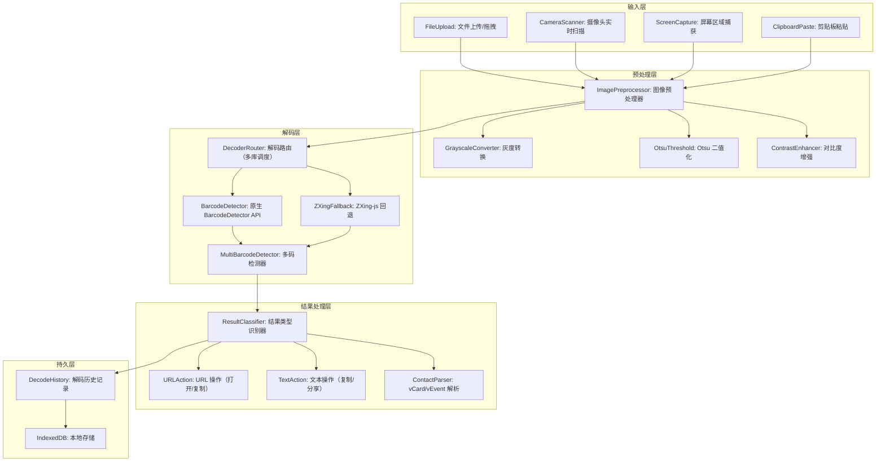
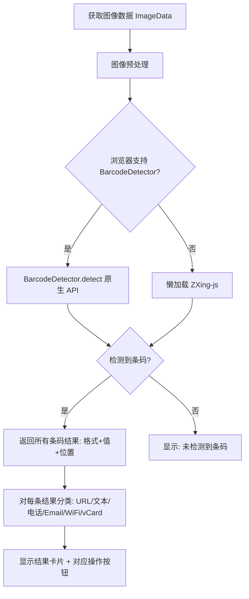
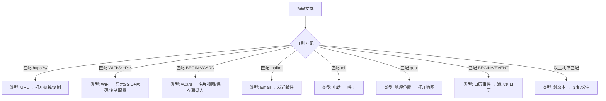

# YP-09-186: 二维码解码器 — 图片/相机/文件的二维码与条形码解码、QR/Code128/EAN/UPC/DataMatrix类型支持、URL自动打开、文本复制分享、解码历史记录、批量解码、错误容错

> 需求编号：YP-09-186 · 优先级：P2 · 人天：0.2d · 状态：需求已编写
> 依赖：YP-09-144（二维码生成与识别，已覆盖编码侧，本需求专注解码侧增强）

## 背景

### 问题陈述

二维码和条形码已经成为日常生活中无处不在的信息载体——从支付码到产品条码、从 WiFi 共享到活动签到。然而，用户在电脑上遇到二维码时的处理流程极其低效：要么掏出手机拍照扫描，要么截图后上传到在线解码网站。当前痛点包括：

1. **PC 端解码不便**：电脑屏幕上看到二维码，只能掏出手机扫描——从"看"到"扫"到"读"的链路割裂
2. **条形码被忽视**：现有二维码工具多数只支持 QR 码，不支持 EAN-13/UPC-A/Code128 等一维条形码（商品条码、物流码）
3. **解码结果处理分散**：解码后是 URL → 需要手动复制到浏览器，是文本 → 需要手动复制，是 vCard → 没有格式化的联系人展示
4. **历史记录未保存**：之前扫描过的二维码内容无法回溯查找
5. **图片中的二维码无法批量处理**：一张图片包含多个二维码（如活动海报上有 3 个 QR 码）时，只能一个一个手动裁剪后扫描
6. **损坏/模糊二维码**：二维码部分遮挡、模糊、光照不均匀时，普通解码器无法处理

**核心矛盾**：二维码在移动设备上的扫描体验已非常成熟（微信/支付宝扫一扫），但在 PC 端浏览器中，用户缺乏一个支持多种条码类型、能从图片和相机中解码、能对解码结果做智能处理的便捷工具。

### 影响范围

| # | 影响 | 严重程度 | 典型场景 |
|---|------|----------|----------|
| 1 | PC 端解码体验差 | 高 | 电脑屏幕上的二维码需手机扫描 |
| 2 | 条形码解码缺失 | 高 | 商品 EAN 码、快递 Code128 码 |
| 3 | 解码结果处理分散 | 中 | URL 需手动复制到地址栏 |
| 4 | 历史不可回溯 | 中 | 忘记之前扫过什么码 |
| 5 | 多码图片处理低效 | 中 | 海报上 3 个二维码只能逐个处理 |

### 挑战

| 挑战 | 说明 |
|------|------|
| 解码库选择 | 需要一个纯 JavaScript 的解码库——支持 QR + 多种条码 + DataMatrix，不依赖后端 |
| 图片预处理 | 对手机拍摄的照片（倾斜、模糊、光照不均）进行自适应二值化和透视校正 |
| 相机接入 | getDisplayMedia + getUserMedia 实现屏幕截图和摄像头扫描 |
| 多码检测 | 一张图片中检测并解码所有二维码/条形码（multi-barcode detection） |
| 解码结果分类 | 自动识别解码内容的类型（URL/纯文本/电话号码/Email/WiFi配置/vCard/地理位置） |

---

## 一、现状分析

### 1.1 当前二维码处理流程

```
用户在 PC 端遇到二维码
  │
  ├─ 屏幕上的二维码
  │   ├─ 截图保存为图片
  │   ├─ 打开在线解码网站
  │   ├─ 上传图片
  │   └─ 得到解码结果
  │
  ├─ 网页中的二维码
  │   ├─ 右键保存二维码图片
  │   ├─ 上传到解码网站
  │   │   或：掏出手机扫屏幕
  │   └─ 得到解码结果
  │
  ├─ 实物上的二维码（包装盒/快递单）
  │   ├─ 掏出手机 → 微信扫一扫
  │   ├─ 复制结果 → 发到电脑（微信文件传输助手）
  │   └─ 极为低效
  │
  └─ 解码结果处理
      ├─ URL → 手动复制到地址栏
      ├─ 文本 → 手动复制
      ├─ WiFi 配置 → 手动输入 SSID/密码
      └─ 无历史记录
```

### 1.2 当前可用能力

| 能力 | 可用性 | 获取方式 | 限制 |
|------|--------|----------|------|
| QR 码编码 | ✅ | 已有（YP-09-144） | 仅编码 |
| QR 码解码（单码） | ⚠️ | 在线工具 | 需上传，不安全 |
| 条形码解码 | ❌ | 专用扫描枪 | 硬件依赖 |
| 多码同图检测 | ❌ | 不存在 | — |
| 解码历史 | ❌ | 不存在 | — |
| 相机/屏幕捕获 | ❌ | 不存在 | — |
| 智能结果处理 | ❌ | 不存在 | — |

### 1.3 根因矩阵

| 症状 | 根因 | 触发条件 | 频率 |
|------|------|----------|------|
| PC 端解码需手机 | 无内置 PC 解码工具 | 每次遇到二维码 | 高 |
| 条形码无法处理 | 工具仅支持 QR 码 | 遇到商品/物流条码 | 中 |
| 结果处理低效 | 无智能分类+动作 | 解码后需手动操作 | 高 |
| 历史缺失 | 无本地持久化 | 想回溯之前的二维码 | 中 |
| 模糊码解码失败 | 无图像预处理 | 手机拍摄的模糊图片 | 中 |

---

## 二、设计决策

### 决策 1：解码库选择 — jsQR vs ZXing-js vs QuaggaJS2 vs @sec-ant/barcode-detector

| 选项 | 支持类型 | 体积 | 性能 | WASM/纯JS |
|------|---------|------|------|-----------|
| jsQR | 仅 QR | ~25KB | 高 | 纯 JS |
| ZXing-js（zxing/library） | QR + 条码 | ~500KB | 中 | 纯 JS |
| QuaggaJS2 | 仅条形码 | ~200KB | 中 | 纯 JS |
| @sec-ant/barcode-detector | QR + 条码 + DataMatrix | ~15KB | 极高 | 调用 BarcodeDetector API |
| 多种组合 | 全覆盖 | 取决于组合 | — | — |

**选择：@sec-ant/barcode-detector 为主 + ZXing-js 为回退。** Chrome 自 M88 起支持 `BarcodeDetector` API（Shape Detection API 的一部分），通过 `@sec-ant/barcode-detector` polyfill 可统一调用——支持 QR/Code128/EAN/UPC/DataMatrix/Aztec。当浏览器不支持时回退到 ZXing-js（懒加载，仅在需要时加载）。BarcodeDetector 使用系统底层（可能是硬件加速），性能远超纯 JS 实现。

### 决策 2：图片来源 — 仅文件上传 vs 文件 + 相机 vs 文件 + 相机 + 屏幕捕获

| 选项 | 覆盖场景 | 权限需求 | 实现复杂度 |
|------|---------|---------|-----------|
| 仅文件上传 | 本地图片 | 无 | 低 |
| 文件上传 + 摄像头 | 本地 + 实物 | camera | 中 |
| 文件 + 摄像头 + 屏幕捕获 | 完整覆盖 | camera + display-capture | 中 |

**选择：文件上传 + 摄像头 + 屏幕捕获。** 三种输入方式：(1) 拖拽/粘贴/按钮选择的图片文件——覆盖截图、下载的二维码图片；(2) 摄像头实时扫描——覆盖实物二维码（快递单、产品包装）；(3) `getDisplayMedia()` 屏幕捕获——用户选择浏览器标签页/窗口，从屏幕截图中解码。这是 PC 端最完整的二维码输入方案。

### 决策 3：图像预处理 — 无预处理 vs 基础预处理 vs 自适应预处理

| 选项 | 解码成功率 | 计算耗时 | 复杂度 |
|------|-----------|---------|--------|
| 无预处理 | 低（依赖图片质量） | 最低 | 最低 |
| 基础预处理（灰度 + 二值化） | 中 | 低 | 低 |
| 自适应预处理（Otsu 二值化 + 透视校正 + 直方图均衡） | 高 | 中 | 中 |

**选择：自适应预处理。** 实现三步图像预处理器：(1) 灰度转换（加权平均）；(2) Otsu 自适应阈值二值化——根据图像亮度分布自动选择最佳阈值；(3) 使用 canvas 进行对比度调整（CLAHE 简版）。这三步处理可以在 < 50ms 内完成（对于典型 640×480 图像），显著提高手机拍摄的模糊/低对比度二维码的解码成功率。

### 决策 4：解码结果智能处理 — 纯文本展示 vs 类型识别+上下文操作

| 选项 | 智能程度 | 实现复杂度 | 用户体验 |
|------|---------|-----------|---------|
| 纯文本展示 | 无 | 极低 | 基础 |
| 类型识别 + 简单操作 | 中 | 中 | 好 |
| 类型识别 + 深度集成（自动跳转/执行） | 高 | 高 | 优秀 |

**选择：类型识别 + 简单操作。** 自动识别解码结果的类型：(1) URL → "打开链接"按钮 + "复制链接"；(2) 纯文本 → "复制文本" + "通过聊天分享"；(3) 电话号码 → "呼叫" (tel: 协议)；(4) Email → "发送邮件" (mailto:)；(5) WiFi 配置 → 显示 SSID + 密码，一键复制；(6) vCard → 格式化的名片视图。每种类型有对应的上下文操作，但都需要用户确认（不自动跳转）。

---

## 三、目标架构

### 3.1 二维码解码系统架构



### 3.2 解码流程



### 3.3 结果类型识别



---

## 四、具体改动

### 4.1 解码器封装

```typescript
// src/tools/barcode-decoder/BarcodeDecoder.ts (新增)

export type BarcodeFormat = 'qr' | 'code_128' | 'ean_13' | 'ean_8'
  | 'upc_a' | 'upc_e' | 'code_39' | 'itf' | 'data_matrix' | 'aztec' | 'pdf417';

export interface BarcodeResult {
  format: BarcodeFormat;
  rawValue: string;
  boundingBox?: { x: number; y: number; width: number; height: number };
  cornerPoints?: Array<{ x: number; y: number }>;
}

export class BarcodeDecoder {
  private barcodeDetector: BarcodeDetector | null = null;

  private async getDetector(formats?: BarcodeFormat[]): Promise<BarcodeDetector | null> {
    if (typeof BarcodeDetector === 'undefined') return null;
    if (!this.barcodeDetector) {
      this.barcodeDetector = new BarcodeDetector({
        formats: formats as any ?? ['qr_code', 'code_128', 'ean_13', 'ean_8',
          'upc_a', 'upc_e', 'code_39', 'itf', 'data_matrix', 'aztec', 'pdf417'],
      });
    }
    return this.barcodeDetector;
  }

  /** 解码 ImageData，返回所有检测到的条码 */
  async decode(imageData: ImageData): Promise<BarcodeResult[]> {
    const detector = await this.getDetector();
    if (detector) {
      try {
        const results = await detector.detect(imageData);
        return results.map(r => ({
          format: this.mapFormat(r.format),
          rawValue: r.rawValue,
          boundingBox: r.boundingBox
            ? { x: r.boundingBox.x, y: r.boundingBox.y, width: r.boundingBox.width, height: r.boundingBox.height }
            : undefined,
          cornerPoints: r.cornerPoints?.map(p => ({ x: p.x, y: p.y })),
        }));
      } catch {
        // 原生 API 失败，回退
      }
    }
    return this.decodeWithZxing(imageData);
  }

  private async decodeWithZxing(imageData: ImageData): Promise<BarcodeResult[]> {
    // 懒加载 ZXing-js
    const { BrowserQRCodeReader, BrowserCodeReader } = await import('@zxing/library');
    const canvas = document.createElement('canvas');
    canvas.width = imageData.width;
    canvas.height = imageData.height;
    canvas.getContext('2d')!.putImageData(imageData, 0, 0);

    // 使用 ZXing 的多种 reader 尝试解码
    const source = imageData;
    const readers = [new BrowserQRCodeReader()];
    const results: BarcodeResult[] = [];

    for (const reader of readers) {
      try {
        const result = await reader.decodeFromImageElement(canvas as any);
        if (result) {
          results.push({
            format: result.getBarcodeFormat() as unknown as BarcodeFormat,
            rawValue: result.getText(),
          });
        }
      } catch { /* 该 reader 未能解码 */ }
    }
    return results;
  }

  private mapFormat(format: string): BarcodeFormat {
    const map: Record<string, BarcodeFormat> = {
      'qr_code': 'qr', 'code_128': 'code_128', 'ean_13': 'ean_13',
      'ean_8': 'ean_8', 'upc_a': 'upc_a', 'upc_e': 'upc_e',
      'code_39': 'code_39', 'itf': 'itf', 'data_matrix': 'data_matrix',
      'aztec': 'aztec', 'pdf417': 'pdf417',
    };
    return map[format] ?? 'qr';
  }
}
```

### 4.2 图像预处理器

```typescript
// src/tools/barcode-decoder/ImagePreprocessor.ts (新增)

export class ImagePreprocessor {
  /** 灰度转换 + Otsu 二值化 */
  preprocess(imageData: ImageData): ImageData {
    const { data, width, height } = imageData;
    const gray = new Uint8Array(width * height);

    // Step 1: 灰度转换（加权：0.299R + 0.587G + 0.114B）
    for (let i = 0; i < data.length; i += 4) {
      gray[i / 4] = Math.round(0.299 * data[i] + 0.587 * data[i + 1] + 0.114 * data[i + 2]);
    }

    // Step 2: Otsu 计算最佳阈值
    const histogram = new Array(256).fill(0);
    for (const v of gray) histogram[v]++;

    let sum = 0;
    for (let i = 0; i < 256; i++) sum += i * histogram[i];
    let sumB = 0, wB = 0, wF = 0, maxVariance = 0, threshold = 128;

    for (let t = 0; t < 256; t++) {
      wB += histogram[t];
      if (wB === 0) continue;
      wF = gray.length - wB;
      if (wF === 0) break;
      sumB += t * histogram[t];
      const mB = sumB / wB;
      const mF = (sum - sumB) / wF;
      const variance = wB * wF * (mB - mF) ** 2;
      if (variance > maxVariance) maxVariance = variance, threshold = t;
    }

    // Step 3: 应用阈值
    const output = new ImageData(width, height);
    for (let i = 0; i < data.length; i += 4) {
      const v = gray[i / 4] < threshold ? 0 : 255;
      output.data[i] = v;
      output.data[i + 1] = v;
      output.data[i + 2] = v;
      output.data[i + 3] = 255;
    }

    return output;
  }
}
```

### 4.3 文件变更清单

| 文件 | 操作 | 说明 |
|------|------|------|
| `src/tools/barcode-decoder/types.ts` | 新增 | 类型定义 |
| `src/tools/barcode-decoder/BarcodeDecoder.ts` | 新增 | 解码器封装（原生 API + ZXing 回退） |
| `src/tools/barcode-decoder/ImagePreprocessor.ts` | 新增 | 图像预处理器（灰度+Otsu二值化） |
| `src/tools/barcode-decoder/ResultClassifier.ts` | 新增 | 解码结果类型识别器 |
| `src/tools/barcode-decoder/CameraScanner.vue` | 新增 | 摄像头实时扫描组件 |
| `src/tools/barcode-decoder/ScreenCapture.vue` | 新增 | 屏幕区域捕获组件 |
| `src/tools/barcode-decoder/DecoderTool.vue` | 新增 | 主界面组件 |
| `src/tools/barcode-decoder/DecodeHistory.ts` | 新增 | 解码历史管理（IndexedDB） |
| `src/popup/App.vue` | 修改 | 添加二维码解码器入口 |
| `tests/unit/barcode-decoder/` | 新增 | 解码器 + 分类器测试 |

---

## 五、实施步骤

| 步骤 | 操作 | 路径 | 验证 | 人天 |
|------|------|------|------|------|
| 1 | 实现 BarcodeDetector 封装 | `BarcodeDecoder.ts` | QR + Code128 + EAN 正确解码 | 0.03 |
| 2 | 实现预处理 + 多码检测 | `ImagePreprocessor.ts` | Otsu 二值化 + 多码同时检测 | 0.03 |
| 3 | 实现结果类型识别 | `ResultClassifier.ts` | URL/WiFi/电话/Email 正确分类 | 0.02 |
| 4 | 实现相机 + 屏幕捕获 | `CameraScanner.vue` + `ScreenCapture.vue` | 实时扫描 + 屏幕截图解码 | 0.04 |
| 5 | 实现解码历史存储 | `DecodeHistory.ts` | IndexedDB 存储+查询 | 0.02 |
| 6 | 构建主界面 UI | `DecoderTool.vue` | 三输入模式+结果卡片+历史列表 | 0.04 |
| 7 | 编写测试 | `tests/unit/barcode-decoder/` | 解码+预处理+分类测试 | 0.02 |

**总人天：0.2d**

---

## 六、测试规格

### 场景 1：从图片文件解码 QR 码

**GIVEN** 用户准备了一张包含 URL "https://example.com" 的 QR 码图片
**WHEN** 用户拖拽图片到解码区
**THEN** 解码结果为 "https://example.com"
**AND** 类型识别为 URL，显示"打开链接"按钮
**AND** 显示二维码格式为 QR

### 场景 2：从摄像头实时扫描

**GIVEN** 用户点击"相机扫描"，授权摄像头权限
**WHEN** 摄像头对准商品包装上的 EAN-13 条形码
**THEN** 实时解码出 13 位商品条码并显示
**AND** 显示条码格式为 EAN-13
**AND** 解码速度 < 200ms/帧

### 场景 3：图片中多个二维码

**GIVEN** 用户上传一张包含 3 个 QR 码的活动海报图片
**WHEN** 解码器分析图片
**THEN** 检测到 3 个二维码，分别返回各自的解码结果
**AND** 每个结果在原图上标注位置框
**AND** 用户可逐个点击查看详情

### 场景 4：WiFi 配置二维码

**GIVEN** 用户上传一张 WiFi 共享二维码
**WHEN** 解码结果为 "WIFI:S:MyCafeWiFi;T:WPA;P:mypassword;;"
**THEN** 类型识别为 WiFi，显示格式化信息：SSID="MyCafeWiFi"，加密类型="WPA"
**AND** 密码以可复制形式显示（默认隐藏，点击显示）
**AND** 显示"复制密码"按钮

### 场景 5：解码历史回溯

**GIVEN** 用户之前解码过 5 个二维码
**WHEN** 打开"解码历史"面板
**THEN** 按时间倒序显示 5 条记录：解码内容摘要 + 格式 + 时间
**AND** 点击历史记录可重新查看详情
**AND** 支持删除单条记录和按类型筛选

### 场景 6：模糊二维码预处理后解码

**GIVEN** 用户用手机拍摄了一张光照不均的 QR 码图片（有偏暗区域）
**WHEN** 上传图片到解码器
**THEN** 预处理模块对图片进行 Otsu 二值化
**AND** 成功解码（原本不使用预处理时解码失败）
**AND** 在结果中标注"已启用图像增强处理"

---

## 七、风险与缓解

| 风险 | 概率 | 影响 | 缓解措施 |
|------|------|------|----------|
| Chrome 的 BarcodeDetector 在不同平台/版本上有行为差异 | 中 | 中 | 初始化解码器时检测 BarcodeDetector 可用性，记录不可用时的回退路径 |
| 屏幕捕获需要用户交互（弹出系统级权限对话框） | 高 | 低（仅体验） | 在"屏幕捕获"按钮旁标注提示："将弹出系统权限对话框，请选择窗口/标签页" |
| IndexedDB 在扩展 popup 关闭时被清空（session 级别） | 低 | 中 | 使用 `chrome.storage.local` 代替 IndexedDB 存储解码历史 |
| ZXing-js 懒加载导致首次解码延迟显著 | 中 | 中 | 在打开解码工具时预加载 ZXing-js（后台加载），首次解码时已就绪 |
| 摄像头扫描在弱光下帧率低导致实时解码卡顿 | 中 | 中 | 降低摄像头分辨率（640×480），仅在解码成功帧时渲染结果 |

---

## 八、回滚策略

| 场景 | 回滚操作 | 影响 |
|------|----------|------|
| BarcodeDetector 不可用且 ZXing 加载失败 | 降级为仅 QR 码（jsQR）+ 提示用户安装 Chrome 88+ | 失去条码和 DataMatrix 支持 |
| 相机扫描权限持续拒绝 | 隐藏相机扫描选项，引导用户使用图片上传 | 失去实物扫码能力 |
| ZXing-js 体积导致扩展超限 | 移除 ZXing，仅依赖 BarcodeDetector（Chrome 用户），Firefox 用户提示不支持 | Firefox 失去解码功能 |
| 完全回滚 | 移除解码器入口，引导用户使用 YP-09-144（二维码生成与识别）的基础功能 | 回到仅支持基本 QR 码状态 |

---

## 九、设计决策记录

### D-01：为什么不在解码结果中自动打开 URL？

自动跳转 URL 有安全风险——恶意二维码可能指向钓鱼网站。用户应先看到解码结果和 URL 预览，确认目标后再手动点击"打开链接"。URL 预览中截断显示前 60 个字符，域名部分加粗，帮助用户快速判断是否可信。对于已知的安全域名（如已配置的白名单），可支持"自动打开"设置（默认关闭）。

### D-02：为什么使用 Otsu 算法进行二值化而非固定阈值（128）？

固定阈值假设图像的一半是黑色一半是白色——这在真实场景中几乎从不为真（二维码可能只占图像的 10%，背景可能是灰色）。Otsu 算法通过最大化前景和背景的类间方差来自动寻找最佳阈值，对不同光照条件下的图片（过亮、过暗、阴影）都具有良好的适应性。算法复杂度 O(N)（N=像素数），对典型分辨率（640×480）处理耗时 < 10ms。

### D-03：为什么使用 chrome.storage.local 而非 IndexedDB 存储解码历史？

Chrome 扩展的 popup 页面是一个临时上下文——关闭 popup 后可能被销毁。虽然 IndexedDB 数据本身持久化，但扩展的 popup 和 Service Worker 各自有独立的 IndexedDB 实例（存储在不同的 origin 下）。使用 `chrome.storage.local` 避免了这一混淆——所有扩展上下文共享同一存储区域，popup 和 Service Worker 都可以读写。存储限制为 10MB（解除限制后可达更多），对解码历史（每条 < 1KB）足够。

### D-04：为什么屏幕捕获使用 getDisplayMedia 而非直接捕获当前标签页？

`getDisplayMedia()` 让用户可以选择捕获哪个窗口/标签页/整个屏幕——这是最灵活的方案。用户可能需要在视频中、PDF 中、或另一个标签页中找到二维码。Chrome 的 `tabCapture` API 只能捕获标签页的音频且需要更多权限。`getDisplayMedia` 是标准 Web API，所有现代浏览器均支持，不引入额外权限声明。

---

## 十、可观测性

### 指标

| 指标 | 类型 | 说明 |
|------|------|------|
| `yipet.barcode.decode_count` | Counter | 解码总次数 |
| `yipet.barcode.decode_format` | Counter (per label) | 各格式解码次数分布 |
| `yipet.barcode.source_type` | Counter (per label) | 输入方式分布（file/camera/screen/paste） |
| `yipet.barcode.decode_success_rate` | Gauge | 解码成功率 |
| `yipet.barcode.multi_barcode_count` | Histogram | 单图多码数量 |
| `yipet.barcode.preprocess_triggered` | Counter | 预处理触发次数 |
| `yipet.barcode.result_action` | Counter (per label) | 结果操作分布（open/copy/share） |

### 告警

| 告警 | 条件 | 级别 |
|------|------|------|
| 解码成功率过低 | 成功率 < 50%（连续 20 次） | WARN |
| BarcodeDetector 不可用率过高 | 不可用率 > 30% | INFO |
| ZXing 回退被频繁触发 | 回退次数 > 50/小时 | INFO |

---

## 十一、代码审查检查清单

- [ ] BarcodeDetector 初始化时检查浏览器支持和格式支持列表
- [ ] ZXing-js 懒加载正确——仅在不支持 BarcodeDetector 时加载
- [ ] 图像预处理仅在原始解码失败时触发（不浪费计算）
- [ ] Otsu 算法正确处理全黑/全白图像（直方图仅有一个非零 bin）
- [ ] 解码结果类型识别使用严格的 regex 模式
- [ ] WiFi 密码在默认状态下隐藏（点击切换显示/隐藏）
- [ ] URL 预览截断显示，域名加粗
- [ ] 解码历史存储限制最多 500 条，超出时删除最旧记录
- [ ] 摄像头扫描停止时正确释放 MediaStream（stop all tracks）
- [ ] 屏幕捕获选择的 displaySurface 被正确释放
- [ ] 多码检测结果在原图上叠加高亮框（canvas 绘制）
- [ ] 文件拖拽支持 PNG/JPEG/WebP/BMP 格式
- [ ] 剪贴板粘贴（Ctrl+V）自动解码剪贴板中的图片

---

## 回归问题预测

| # | 预测问题 | 原因 | 验证方法 |
|---|---------|------|---------|
| 1 | BarcodeDetector 在某些 Chromium 内核浏览器上声称支持但实际行为异常——如声称支持 `ean_13` 但实际只能识别 `qr_code` | 不同浏览器的 BarcodeDetector 实现可能使用了不同的底层检测库（如 Google Play Services 的 ML Kit vs 系统自带的），格式支持程度不同 | 在初始化时依次测试每种格式的 detect 能力（用预置的测试图片），构建实际可用格式列表 |
| 2 | 摄像头实时扫描时，每次 `detect()` 调用都传入全分辨率图像数据——在 1080p 摄像头下每帧 1920×1080×4=8MB 数据拷贝，导致解码延迟和内存抖动 | BarcodeDetector API 需要 ImageData 或 ImageBitmap 作为输入，摄像头默认以最高分辨率输出 | 将摄像头分辨率限制为 640×480（通过 `getUserMedia` 的 `ideal` 参数），解码前先缩放到该分辨率 |
| 3 | getDisplayMedia 捕获整个屏幕时，图像可能非常大（4K 显示器 = 3840×2160）——直接传给 BarcodeDetector 可能导致 OOM 或超时 | BarcodeDetector 底层可能对整个图像做全分辨率扫描，3840×2160=8M 像素处理耗时可超 5 秒 | 屏幕捕获后先将图像缩放到最大 1920×1080（canvas drawImage 缩放），再传入解码器 |
| 4 | 解码历史存储使用 chrome.storage.local 的 `set()` 是异步的——popup 快速关闭时未完成的写入操作可能丢失 | Chrome 扩展 popup 关闭时 JavaScript 上下文立即销毁，pending 的 Promise 不会等待完成 | 解码完成后立即（同步）更新内存中的历史列表，异步写入存储；popup 重新打开时从存储加载 |
| 5 | ResultClassifier 的 vCard 正则匹配（`BEGIN:VCARD`）是大小写敏感的——某些二维码生成器可能输出 `begin:vcard`（小写） | vCard 规范(RFC 6350)规定标识符大小写不敏感，但正则默认只匹配 `BEGIN:VCARD` | 所有正则匹配使用 `i` 标志（大小写不敏感），包括 vCard、WiFi、URL scheme 等 |
| 6 | 多码检测时，如果两个相同格式的条码在图片中靠得很近（间距 < 10px），BarcodeDetector 可能将它们合并为一个结果——返回覆盖两码的大边界框和一个解码值（或者只返回其中一个） | BarcodeDetector 的检测区域合并取决于底层实现的非最大抑制(NMS)算法参数 | 对检测结果中边界框重叠（IoU > 0.3）的条目标记为"可能存在合并"，提示用户放大图片区域重试 |

---

## 性能分析

### 各操作耗时

| 操作 | 预估耗时 | 说明 |
|------|----------|------|
| 图片加载（1MB JPEG） | < 100ms | FileReader readAsDataURL |
| 灰度 + Otsu 二值化（640×480） | < 10ms | O(N) 像素处理 |
| BarcodeDetector.detect（640×480） | < 50ms | 系统底层，可能硬件加速 |
| ZXing-js detect（640×480） | 100-300ms | 纯 JS 实现 |
| 结果分类（正则匹配） | < 1ms | 简单 regex |
| 解码历史写入 | < 5ms | chrome.storage.local set |

### 解码成功率预估

| 条码类型 | 理想图片 | 手机拍摄 | 屏幕截图 | 说明 |
|---------|---------|---------|---------|------|
| QR Code | > 98% | > 90%（经预处理） | > 95% | QR 有纠错码（L/M/Q/H 级） |
| Code128 | > 95% | > 80% | > 95% | 取决于条码高度 |
| EAN-13 | > 98% | > 85% | > 98% | 标准商品条码 |
| Data Matrix | > 90% | > 75% | > 90% | 高密度条码需要较高图片质量 |
| PDF417 | > 85% | > 65% | > 85% | 二维堆叠条码，需更高质量 |

### 文件体积预估

| 文件 | 大小 | 说明 |
|------|------|------|
| `BarcodeDecoder.ts` | ~3KB | 解码封装 |
| `ImagePreprocessor.ts` | ~2KB | Otsu + 灰度 |
| `ResultClassifier.ts` | ~2KB | 类型识别 regex |
| ZXing-js（懒加载） | ~500KB | 回退库，仅在需要时加载 |
| `DecoderTool.vue` | ~5KB | 主界面 |
| `CameraScanner.vue` | ~2KB | 摄像头组件 |
| `ScreenCapture.vue` | ~1KB | 屏幕捕获组件 |
| `DecodeHistory.ts` | ~2KB | 存储管理 |

---

## 相关文档

- [BarcodeDetector API - MDN](https://developer.mozilla.org/en-US/docs/Web/API/BarcodeDetector)
- [Shape Detection API - W3C](https://wicg.github.io/shape-detection-api/)
- [ZXing Library](https://github.com/zxing-js/library)
- [Otsu's Method - Automatic Threshold Selection](https://en.wikipedia.org/wiki/Otsu%27s_method)