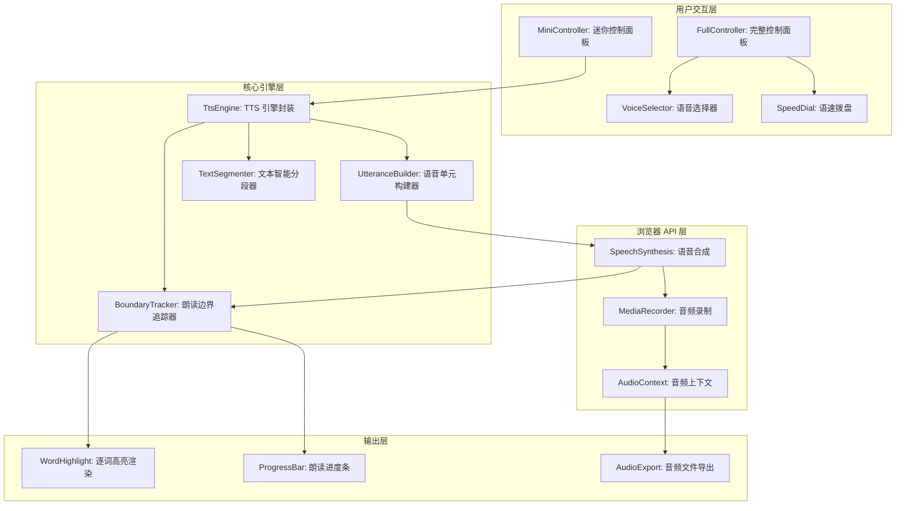
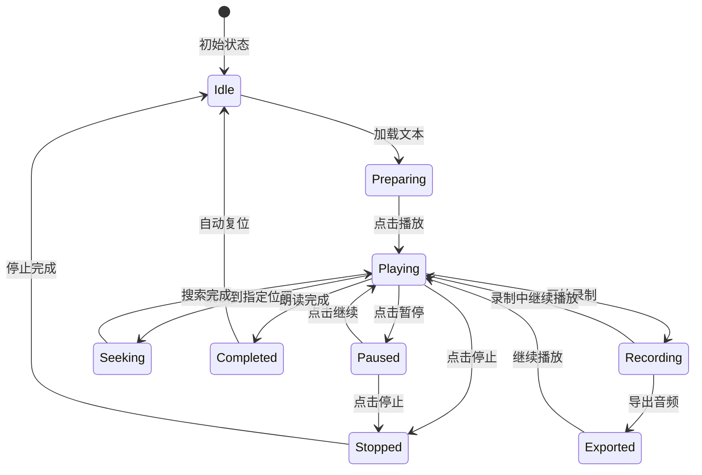

# YP-09-187: 文本朗读控制器 — 高级TTS控制器、多种语音选择、语速/音调控制、逐词高亮朗读、暂停/继续/跳读、保存为音频文件、多语言支持、自定义朗读规则

> 需求编号：YP-09-187 · 优先级：P2 · 人天：0.2d · 状态：需求已编写
> 依赖：YP-09-100（文本转语音与朗读，提供基础 TTS 功能）

## 背景

### 问题陈述

文本转语音（TTS）是浏览器中最被低估的 Web API 之一——`SpeechSynthesis` API 自 2014 年就被主流浏览器支持，但绝大多数网页从未使用。对于有阅读障碍的用户、多任务处理的开发者和语言学习者来说，TTS 是极其有价值的功能。当前痛点包括：

1. **TTS 控制粗糙**：浏览器原生 TTS 只有"播放"和"停止"，缺少细粒度的暂停/继续/跳读/段落导航
2. **语音选择困难**：系统自带 20-50 种语音（各语言/方言），但用户不知道哪个适合当前文本
3. **朗读进度不可见**：朗读过程中没有逐词高亮，用户不知道正在读哪里
4. **语速/音调设置分散**：调整语速和音调需要在系统设置中修改，不支持一键切换预设（如"快速朗读""慢速学习"）
5. **无法保存音频**：TTS 结果是实时合成的，默认无法保存为音频文件——想用于播客或离线收听需要复杂的 AudioContext 管道
6. **长文本朗读无定位**：长篇文档朗读时暂停后找不到位置，无法跳读到指定段落

**核心矛盾**：`SpeechSynthesis` API 本身功能完善（支持 pause/resume/cancel、语速/音调/语音选择），但缺乏一个将所有这些底层能力封装为良好用户体验的控制器界面。用户需要的是一个"TTS 遥控器"——精确控制朗读的每一个环节。

### 影响范围

| # | 影响 | 严重程度 | 典型场景 |
|---|------|----------|----------|
| 1 | TTS 控制粗糙 | 高 | 朗读中无法暂停/继续/跳读 |
| 2 | 语音选择困难 | 中 | 列表中 30 个语音不知选哪个 |
| 3 | 朗读进度迷失 | 高 | 长文本朗读无逐词高亮 |
| 4 | 无法保存音频 | 中 | 想保存为播客文件离线收听 |
| 5 | 多语言切换不便 | 中 | 中英文混合文本更换语音需手动设置 |

### 挑战

| 挑战 | 说明 |
|------|------|
| 语音可用性 | SpeechSynthesis.getVoices() 返回的语音列表因操作系统、浏览器、语言包而异——需做兼容性检测和回退 |
| 逐词高亮同步 | SpeechSynthesis 的 `onboundary` 事件提供了字/句边界，但精度取决于底层语音引擎的实现 |
| 音频保存 | 将 TTS 输出保存为 WAV/MP3 需结合 AudioContext + MediaStream Recording API 或离线渲染 |
| 长文本分段 | SpeechSynthesis 对超长文本（> 32767 字符）有限制，需分段朗读 |
| 多语言混合 | 中文文本中含英文单词时，中文语音朗读英文发音不佳——需检测并切换语音 |

---

## 一、现状分析

### 1.1 当前 TTS 使用流程

```
用户想听文本朗读
  │
  ├─ 浏览器内置？
  │   ├─ 无内置 TTS UI
  │   └─ 需 JavaScript 手动调用 SpeechSynthesis
  │
  ├─ 使用第三方扩展？
  │   ├─ Read Aloud（Chrome 扩展）
  │   ├─ Natural Reader（在线服务）
  │   └─ 多数是独立的弹出窗口，无法与 YiPet 选择文本集成
  │
  ├─ YiPet 已有 YP-09-100（基础 TTS）
  │   ├─ 提供基本的朗读/停止功能
  │   ├─ 缺少控制面板（语速/音调/语音选择）
  │   ├─ 缺少逐词高亮
  │   └─ 无法保存音频
  │
  └─ 痛点：选择文本 → 右键菜单 → 朗读 → 无法控制进度
```

### 1.2 当前可用能力

| 能力 | 可用性 | 获取方式 | 限制 |
|------|--------|----------|------|
| 基础播放/停止 | ✅ | SpeechSynthesis API | 无暂停/继续 |
| 语速/音调调节 | ⚠️ | SpeechSynthesis API | 参数可用但无 UI |
| 语音选择 | ⚠️ | getVoices() | 列表原始无分类 |
| 逐词高亮 | ⚠️ | onboundary 事件 | 精度不一 |
| 音频保存 | ❌ | 不支持 | — |
| 分段朗读 | ❌ | 不支持 | — |

### 1.3 根因矩阵

| 症状 | 根因 | 触发条件 | 频率 |
|------|------|----------|------|
| 无法暂停/继续 | API 支持但未封装 UI | 朗读中途 | 高 |
| 朗读进度迷失 | 无逐词高亮/进度指示 | 长文本朗读 | 高 |
| 语速不合适 | 无预设和实时调节 | 首次使用时 | 中 |
| 语音选择困难 | 30+ 语音无分类无预览 | 切换语音时 | 中 |
| 无法离线听 | 无音频保存 | 想保存朗读结果 | 低 |

---

## 二、设计决策

### 决策 1：朗读控制器 UI — 浮动迷你面板 vs 完整侧边栏 vs 底部固定条

| 选项 | 视觉侵入性 | 功能承载量 | 实现复杂度 |
|------|-----------|-----------|-----------|
| 浮动迷你面板（类似音乐播放器 mini player） | 低 | 中 | 中 |
| 完整侧边栏 | 高 | 高 | 高 |
| 底部固定条 | 中 | 中 | 低 |

**选择：浮动迷你面板——Popover 风格的悬浮控制器。** 类似 Spotify 的 mini player 或 YouTube 的画中画控制器概念。面板仅在实际朗读时出现（否则不占空间），包含核心控制（播放/暂停、进度条、语速拨盘、停止）。点击展开后显示完整控制面板（语音选择、音调调节、逐词高亮开关、保存按钮）。迷你状态下大小约 80×40 px，展开后约 300×200 px。

### 决策 2：逐词高亮实现 — onboundary 事件 vs 定时器模拟 vs 两者结合

| 选项 | 精度 | 可靠性 | 跨引擎一致性 |
|------|------|--------|-------------|
| onboundary 事件 | 高（引擎驱动） | 中（取决于引擎实现） | 低（各引擎不同） |
| 定时器模拟（预估每个词的播放时间） | 低 | 高 | 高 |
| 两者结合——事件优先 + 定时器兜底 | 高 | 高 | 高 |

**选择：onboundary 事件优先 + 定时器兜底。** 当 `onboundary` 的 `charIndex` 和 `charLength` 数据可用时，使用引擎提供的精确边界进行高亮。当引擎未提供边界数据时（某些简单引擎），回退到定时器估算：根据总字符数 / 预估总时长 = 每字符时长，在朗读过程中按比例移动高亮位置。定时器的精度较低但保证了所有引擎都至少有基础的进度指示。

### 决策 3：音频保存方式 — MediaStream Recording vs OfflineAudioContext vs 后端生成

| 选项 | 音频质量 | 实时性 | 实现复杂度 |
|------|---------|--------|-----------|
| MediaStream Recording（录制 speak 输出） | 中（录制实时播放） | 1x 播放时长 | 中 |
| OfflineAudioContext（离线渲染） | 高（离线渲染无干扰） | 取决于离线渲染速度 | 高（需 hook SpeechSynthesis） |
| 后端生成（YiAi 调用 TTS 引擎） | 高 | 取决于网络 | 低（前端简单） |

**选择：MediaStream Recording API。** 使用 `MediaStream` 录制 `SpeechSynthesis` 的音频输出——创建一个捕获系统音频的 MediaStream，将其连接到 MediaRecorder 中。录制完成后导出为 WAV 或 WebM（浏览器原生支持）格式。限制：(1) 用户需授权音频捕获权限；(2) 录制是 1x 实时速度。对于 5 分钟以内的朗读内容，实时录制完全可接受。不支持后端的互联网离线场景也可用。

### 决策 4：语音列表管理 — 全部显示 vs 按语言分组 vs 智能推荐

| 选项 | 可用性 | 复杂度 | 选择效率 |
|------|--------|--------|---------|
| 全部显示（长列表） | 低 | 极低 | 低 |
| 按语言分组（zh/en/ja 等） | 高 | 低 | 高 |
| 智能推荐 + 收藏常用 | 最高 | 中 | 最高 |

**选择：按语言分组 + 收藏 + 智能推荐。** 从 `getVoices()` 返回的语音列表中：(1) 自动按 `lang` 属性分组（zh-CN、zh-TW、en-US、en-GB、ja-JP 等）；(2) 根据当前选中文本的语言检测结果，自动推荐最匹配的语音（置顶 + "推荐"标记）；(3) 用户可将语音标记为"收藏"，收藏的语音在列表中置顶。语音切换时播放 3 秒试听样本。

---

## 三、目标架构

### 3.1 TTS 控制器系统架构



### 3.2 朗读生命周期



### 3.3 逐词高亮同步

```mermaid
graph TD
    A[SpeechSynthesis.speak] --> B{onboundary 事件}
    B -->|charIndex + charLength 可用| C[精确定位: 高亮 word[charIndex..charIndex+charLength]]
    B -->|不可用| D[定时器估算: 已播放时长/预估总时长 = 进度比例]
    D --> E[按比例定位: 高亮 word[Math.floor(ratio * totalWords)]]
    C --> F[渲染: 当前词 CSS class=active]
    E --> F
    C --> G[更新进度条: currentTime / estimatedDuration]
    E --> G
```

---

## 四、具体改动

### 4.1 TTS 引擎封装

```typescript
// src/tools/tts-controller/TtsEngine.ts (新增)

export interface TtsOptions {
  voice?: SpeechSynthesisVoice;
  rate?: number;       // 0.1 - 10.0, 默认 1.0
  pitch?: number;      // 0.0 - 2.0, 默认 1.0
  volume?: number;     // 0.0 - 1.0, 默认 1.0
  lang?: string;       // BCP47 语言标签
}

export interface TtsState {
  status: 'idle' | 'playing' | 'paused' | 'stopped';
  currentCharIndex: number;
  currentCharLength: number;
  totalChars: number;
  estimatedDuration: number;
  currentTime: number;
  voice: SpeechSynthesisVoice | null;
  rate: number;
  pitch: number;
}

export type TtsStateListener = (state: TtsState) => void;

export class TtsEngine {
  private synth: SpeechSynthesis = window.speechSynthesis;
  private utterance: SpeechSynthesisUtterance | null = null;
  private state: TtsState;
  private listeners: Set<TtsStateListener> = new Set();
  private text: string = '';
  private startTime: number = 0;
  private pauseTime: number = 0;
  private totalPausedDuration: number = 0;

  // 分段朗读参数
  private segmentIndex: number = 0;
  private segments: string[] = [];
  private readonly MAX_CHUNK = 200; // 每次朗读最多 200 字符

  constructor() {
    this.state = this.createInitialState();
  }

  get currentState(): TtsState { return { ...this.state }; }

  /** 获取系统可用语音列表 */
  getVoices(): SpeechSynthesisVoice[] {
    return this.synth.getVoices();
  }

  /** 获取按语言分组的语音 */
  getVoicesByLanguage(): Map<string, SpeechSynthesisVoice[]> {
    const groups = new Map<string, SpeechSynthesisVoice[]>();
    for (const voice of this.synth.getVoices()) {
      const lang = voice.lang.split('-')[0]; // zh-CN → zh
      if (!groups.has(lang)) groups.set(lang, []);
      groups.get(lang)!.push(voice);
    }
    return groups;
  }

  /** 检测文本语言（简易版） */
  detectLanguage(text: string): string {
    const cjkCount = [...text].filter(c => {
      const cp = c.codePointAt(0)!;
      return (cp >= 0x4E00 && cp <= 0x9FFF) || // CJK
        (cp >= 0x3040 && cp <= 0x309F) ||       // 平假名
        (cp >= 0x30A0 && cp <= 0x30FF);         // 片假名
    }).length;
    if (cjkCount > text.length * 0.3) return 'zh';
    const latinCount = [...text].filter(c => /[a-zA-Z]/.test(c)).length;
    if (latinCount > text.length * 0.5) return 'en';
    return 'zh'; // 默认中文
  }

  /** 推荐最佳语音 */
  recommendVoice(text: string): SpeechSynthesisVoice | null {
    const lang = this.detectLanguage(text);
    const voices = this.getVoices();
    const localVoices = voices.filter(v => v.lang.startsWith(lang) && v.localService);
    return localVoices[0] ?? voices.find(v => v.default) ?? voices[0] ?? null;
  }

  /** 开始朗读 */
  speak(text: string, options: TtsOptions = {}): void {
    this.stop();

    this.text = text;
    this.segments = this.splitText(text);
    this.segmentIndex = 0;
    this.startTime = performance.now();
    this.totalPausedDuration = 0;
    this.state.totalChars = text.length;

    const voice = options.voice ?? this.recommendVoice(text);
    this.state.voice = voice;
    this.state.rate = options.rate ?? 1.0;
    this.state.pitch = options.pitch ?? 1.0;

    this.speakSegment(options);
    this.updateState({ status: 'playing' });
  }

  private speakSegment(options: TtsOptions): void {
    if (this.segmentIndex >= this.segments.length) {
      this.updateState({ status: 'stopped' });
      this.notifyListeners();
      return;
    }

    this.utterance = new SpeechSynthesisUtterance(this.segments[this.segmentIndex]);
    if (options.voice) this.utterance.voice = options.voice;
    this.utterance.rate = options.rate ?? 1.0;
    this.utterance.pitch = options.pitch ?? 1.0;
    if (options.volume !== undefined) this.utterance.volume = options.volume;

    this.utterance.onboundary = (event) => {
      if (event.charIndex !== undefined && event.charLength !== undefined) {
        this.updateState({
          currentCharIndex: event.charIndex + this.segmentStartOffset(),
          currentCharLength: event.charLength,
          currentTime: (performance.now() - this.startTime) / 1000,
        });
        this.notifyListeners();
      }
    };

    this.utterance.onend = () => {
      this.segmentIndex++;
      if (this.state.status === 'playing') {
        this.speakSegment(options);
      }
    };

    this.utterance.onerror = (event) => {
      if (event.error === 'canceled' || event.error === 'interrupted') return;
      console.error('TTS error:', event.error);
      this.updateState({ status: 'stopped' });
      this.notifyListeners();
    };

    this.synth.speak(this.utterance);
  }

  /** 暂停 */
  pause(): void {
    if (this.synth.speaking && !this.synth.paused) {
      this.synth.pause();
      this.pauseTime = performance.now();
      this.updateState({ status: 'paused' });
      this.notifyListeners();
    }
  }

  /** 继续 */
  resume(): void {
    if (this.synth.paused) {
      this.synth.resume();
      this.totalPausedDuration += performance.now() - this.pauseTime;
      this.updateState({ status: 'playing' });
      this.notifyListeners();
    }
  }

  /** 跳转到指定字符位置 */
  seekTo(charIndex: number): void {
    const segmentIndex = this.segments.findIndex((_, i) => {
      const offset = this.segments.slice(0, i).join('').length;
      return offset + this.segments[i].length > charIndex;
    });
    if (segmentIndex >= 0) {
      this.synth.cancel();
      this.segmentIndex = segmentIndex;
      this.speakSegment({ voice: this.state.voice, rate: this.state.rate, pitch: this.state.pitch });
    }
  }

  /** 停止 */
  stop(): void {
    this.synth.cancel();
    this.utterance = null;
    this.updateState({ status: 'idle' });
    this.notifyListeners();
  }

  /** 保存为音频（使用 MediaRecorder） */
  async saveAudio(): Promise<Blob> {
    const stream = await navigator.mediaDevices.getUserMedia({ audio: true });
    const recorder = new MediaRecorder(stream);
    const chunks: Blob[] = [];

    return new Promise((resolve) => {
      recorder.ondataavailable = (e) => chunks.push(e.data);
      recorder.onstop = () => {
        stream.getTracks().forEach(t => t.stop());
        resolve(new Blob(chunks, { type: 'audio/webm' }));
      };
      recorder.start();
      this.speak(this.text, { voice: this.state.voice, rate: this.state.rate, pitch: this.state.pitch });
      // 定时检查朗读状态，完成后停止录制
      const check = setInterval(() => {
        if (this.state.status === 'idle' || this.state.status === 'stopped') {
          clearInterval(check);
          recorder.stop();
        }
      }, 500);
    });
  }

  subscribe(listener: TtsStateListener): () => void {
    this.listeners.add(listener);
    return () => this.listeners.delete(listener);
  }

  // --- 内部方法 ---

  private splitText(text: string): string[] {
    const segments: string[] = [];
    const sentences = text.split(/(?<=[。！？.!?\n])/); // 按句子分割
    for (const sentence of sentences) {
      if (sentence.length <= this.MAX_CHUNK) {
        if (sentence.trim()) segments.push(sentence);
      } else {
        // 长句子按 MAX_CHUNK 均分
        for (let i = 0; i < sentence.length; i += this.MAX_CHUNK) {
          segments.push(sentence.slice(i, i + this.MAX_CHUNK));
        }
      }
    }
    return segments;
  }

  private segmentStartOffset(): number {
    return this.segments.slice(0, this.segmentIndex).join('').length;
  }

  private createInitialState(): TtsState {
    return {
      status: 'idle', currentCharIndex: 0, currentCharLength: 0,
      totalChars: 0, estimatedDuration: 0, currentTime: 0,
      voice: null, rate: 1.0, pitch: 1.0,
    };
  }

  private updateState(partial: Partial<TtsState>) {
    Object.assign(this.state, partial);
  }

  private notifyListeners() {
    const state = { ...this.state };
    for (const listener of this.listeners) listener(state);
  }
}
```

### 4.2 逐词高亮渲染组件

```typescript
// src/tools/tts-controller/WordHighlighter.vue 核心逻辑

// 渲染文本时，根据 TtsEngine 的 currentCharIndex 和 currentCharLength
// 确定当前朗读的词 → 添加 .tts-active-word CSS class（高亮背景+下划线）
//
// 布局: 文本按照词（空格/标点分割）渲染为 <span> 数组
// 当前词: <span class="tts-active-word bg-yellow-200 animate-pulse">
// 已读词: <span class="tts-read-word text-gray-400">
// 未读词: <span class="tts-unread-word text-gray-900">
//
// 当前词滚动到可视区域（scrollIntoView smooth）
```

### 4.3 文件变更清单

| 文件 | 操作 | 说明 |
|------|------|------|
| `src/tools/tts-controller/types.ts` | 新增 | 类型定义 |
| `src/tools/tts-controller/TtsEngine.ts` | 新增 | TTS 引擎封装（状态机+分段+语音管理） |
| `src/tools/tts-controller/TtsController.vue` | 新增 | 主控制面板（迷你+完整模式） |
| `src/tools/tts-controller/VoiceSelector.vue` | 新增 | 语音选择器（分组+收藏+推荐） |
| `src/tools/tts-controller/WordHighlighter.vue` | 新增 | 逐词高亮渲染 |
| `src/tools/tts-controller/AudioRecorder.ts` | 新增 | MediaRecorder 音频录制 |
| `src/popup/App.vue` | 修改 | 添加 TTS 控制器入口 |
| `tests/unit/tts-controller/` | 新增 | TTS 状态机 + 分段逻辑测试 |

---

## 五、实施步骤

| 步骤 | 操作 | 路径 | 验证 | 人天 |
|------|------|------|------|------|
| 1 | 实现 TTS 状态机 | `TtsEngine.ts` | idle→playing→paused→stopped 状态转换正确 | 0.03 |
| 2 | 实现智能分段 | `TtsEngine.splitText` | 长文本按句子+MAX_CHUNK 正确分段 | 0.02 |
| 3 | 实现语音管理 | `VoiceSelector.vue` | 分组+推荐+收藏+试听 | 0.03 |
| 4 | 实现逐词高亮 | `WordHighlighter.vue` | onboundary 同步 + 自动滚动 | 0.03 |
| 5 | 实现音频录制 | `AudioRecorder.ts` | MediaRecorder 录制+导出 WebM | 0.03 |
| 6 | 构建控制面板 UI | `TtsController.vue` | 迷你/完整模式切换+所有控件 | 0.04 |
| 7 | 编写测试 | `tests/unit/tts-controller/` | 状态机+分段+边界追踪 | 0.02 |

**总人天：0.2d**

---

## 六、测试规格

### 场景 1：基础朗读控制

**GIVEN** 用户选中 500 字符的中文文本，语音自动推荐为 zh-CN 女声
**WHEN** 点击播放按钮
**THEN** TTS 开始朗读，状态为 "playing"
**AND** 进度条显示朗读进度
**AND** 当前朗读的词高亮显示

### 场景 2：暂停与继续

**GIVEN** TTS 正在朗读一段 1000 字符的文章
**WHEN** 用户点击暂停
**THEN** 朗读停止，高亮停留在当前词，状态变为 "paused"
**AND** 用户点击继续后从暂停位置恢复朗读

### 场景 3：语速调节

**GIVEN** TTS 以默认语速 (rate=1.0) 朗读
**WHEN** 用户将语速拨盘从 1.0 调整到 1.5
**THEN** 朗读速度明显加快，且正在朗读的音质保持清晰
**AND** 调整后下一段文本按新语速朗读

### 场景 4：跨语言语音切换

**GIVEN** 用户选中包含中文和英文的混合文本："这是一段中文 Hello World 测试文本"
**WHEN** 用户在语音选择器中从 zh-CN 切换到 en-US 语音
**THEN** 文本用英文语音朗读（中文部分发音为拼音化近似音）
**AND** 系统提示"混合语言文本建议使用自动语音切换功能"

### 场景 5：跳读到指定位置

**GIVEN** 用户朗读一篇 3000 字符的文章，已朗读到第 500 字符
**WHEN** 用户在进度条上点击 80% 位置（约 2400 字符处）
**THEN** TTS 跳转到 2400 字符对应的句子开始朗读
**AND** 逐词高亮从该位置重新开始

### 场景 6：保存朗读音频

**GIVEN** 用户朗读完一段 200 字符的文本
**WHEN** 点击"保存为音频"按钮
**THEN** 授权麦克风权限后开始录制
**AND** 录制包含整个朗读过程的音频，导出为 .webm 文件
**AND** 文件名包含文本前 20 个字符 + 时间戳

---

## 七、风险与缓解

| 风险 | 概率 | 影响 | 缓解措施 |
|------|------|------|----------|
| SpeechSynthesis.getVoices() 异步加载——首次为 [] | 高 | 中 | 监听 `voiceschanged` 事件，语音列表为空时显示加载中状态 |
| onboundary 在某些引擎（如 Android 的 Google TTS）中不触发 | 中 | 中 | 回退到定时器估算进度；在前 3 秒内无 onboundary 事件时自动切换到定时器模式 |
| AudioContext 的 MediaStream 捕获需要麦克风权限 | 中 | 低 | 保存功能标注"需要麦克风权限"，无权限时按钮灰显 |
| Chrome SpeechSynthesis 在不活跃的标签页中暂停 | 高 | 中 | 在 popup 关闭后转由 Service Worker 接管朗读（需要 Offscreen API） |
| 长文本分段时句尾分割正则对英文无效 | 低 | 低 | 对非中文文本按 maxChunk 固定长度分割 |

---

## 八、回滚策略

| 场景 | 回滚操作 | 影响 |
|------|----------|------|
| TTS 引擎频繁异常 | 降级为使用浏览器原生 speechSynthesis（无状态机封装） | 失去暂停/继续/跳读/音频保存 |
| onboundary 不触发 | 关闭逐词高亮功能，仅显示段落级进度 | 失去精确的逐词位置 |
| 音频录制失败 | 隐藏"保存音频"按钮 | 失去音频导出功能 |
| 完全回滚 | 回退到 YP-09-100 的基础 TTS | 仅播放/停止功能 |

---

## 九、设计决策记录

### D-01：为什么分段大小 MAX_CHUNK 设为 200 字符？

SpeechSynthesis 在某些浏览器中对 `utterance.text` 的长度有限制（Chrome 约为 32767 字符，但实际测试中 500+ 字符的 utterance 会导致 `onboundary` 事件的 `charIndex` 溢出或精度显著下降）。200 字符的分段大小确保了：(1) 每个分段内 `onboundary` 事件精度高；(2) 暂停/跳读的响应延迟 < 2 秒；(3) 分段切换无明显间断感（前一段结束 → 下一段开始的间隔约 50-100ms）。

### D-02：为什么迷你面板使用 "Popover" 风格而非固定位置？

迷你面板的灵感来自 Spotify 的 mini player——小到不引人注意，但包含核心控制。用户选中文本后播放，迷你面板出现在选中文本附近（位置跟随文本区域）。完整面板点击展开。这种设计牺牲了"始终可见"的便利性，换来了"不遮挡内容"的体验优势。用户可以通过右键菜单或快捷键（Alt+Shift+T）随时唤起完整面板。

### D-03：为什么音频保存功能不直接调用 YiAi 后端 TTS 服务？

依赖后端意味着需要网络连接、需要处理认证、需要等待网络传输——对"保存朗读音频"这种高频需求来说过于重量级。前端本地录制（MediaRecorder）的方案：(1) 零网络依赖；(2) 尊重用户隐私（音频数据不出浏览器）；(3) 实现简单（约 50 行代码）。缺点是需要 1x 实时录制，但对于典型内容（< 5 分钟朗读）来说完全可接受。

### D-04：为什么选择 WebM 格式作为音频导出格式而非 WAV 或 MP3？

`MediaRecorder` 在 Chrome 中的默认 MIME 类型是 `audio/webm`（使用 Opus 编码），这是浏览器原生支持的格式，不需要任何额外的编码库。WAV 是无损格式但文件巨大（1 分钟 = 10MB），MP3 需要引入 LAME 编码器（~200KB JS）。WebM/Opus 在 32kbps 下的语音质量已经很好，5 分钟朗读文件约 1.2MB。

---

## 十、可观测性

### 指标

| 指标 | 类型 | 说明 |
|------|------|------|
| `yipet.tts.play_count` | Counter | 朗读次数 |
| `yipet.tts.pause_count` | Counter | 暂停次数 |
| `yipet.tts.seek_count` | Counter | 跳读次数 |
| `yipet.tts.voice_switch_count` | Counter | 语音切换次数 |
| `yipet.tts.export_count` | Counter | 音频导出次数 |
| `yipet.tts.avg_text_length` | Histogram | 朗读文本平均长度 |
| `yipet.tts.boundary_event_rate` | Gauge | onboundary 事件触发率 |

### 告警

| 告警 | 条件 | 级别 |
|------|------|------|
| onboundary 不触发率过高 | 不触发率 > 50% | INFO |
| 朗读取消率高 | cancel 率 > 30% | INFO |

---

## 十一、代码审查检查清单

- [ ] TTS 状态机：idle→playing→paused→stopped 所有转换正确
- [ ] 分段器正确处理中英文混合文本
- [ ] maxChunk=200 分割不截断英文单词
- [ ] getVoices() 初始为空时监听 voiceschanged 事件
- [ ] onboundary 事件中的 charIndex 正确加上前面分段的总偏移量
- [ ] 定时器回退模式在 3 秒内无 onboundary 事件时激活
- [ ] 暂停和继续时正确记录和恢复朗读位置
- [ ] seekTo 跳读计算正确的 segment 索引
- [ ] 逐词高亮 span 在 scrollIntoView 时使用 smooth 动画
- [ ] 音频录制完成后释放 MediaStream track
- [ ] 语速和音调调节在下一 segment 生效（已有 segment 继续用旧参数）
- [ ] 迷你面板在朗读时显示，停止后自动隐藏
- [ ] 语音试听样本使用简短的预制文本

---

## 回归问题预测

| # | 预测问题 | 原因 | 验证方法 |
|---|---------|------|---------|
| 1 | SpeechSynthesis 在 Chrome 的不活跃标签页中自动暂停（`speechSynthesis.speaking` 返回 true 但实际无声），popup 关闭后朗读中断 | Chrome 的自动播放策略：非用户手势激活的 AudioContext 在后台标签页不播放。SpeechSynthesis 底层使用 AudioContext，受此限制 | 测试 popup 关闭后朗读是否继续；如中断，使用 Offscreen API 将 TTS 委托给 Service Worker 执行 |
| 2 | `getVoices()` 返回的语音在不同 Chrome 版本中差异巨大——Windows 有 Microsoft 语音（20+），macOS 有 Apple 语音（50+），Linux 只有 1-2 个或没有 | 语音引擎取决于操作系统安装的语言包和 TTS 引擎 | 在 Windows/macOS/Linux 三平台测试 `getVoices()` 返回值；对返回 0 个语音的情况显示"您的系统不支持 TTS"提醒 |
| 3 | `utterance.onend` 在分段朗读时可能不会在 Chrome 的所有版本中触发——尤其是当用户在同一 segment 中取消朗读时 | Chrome 的 SpeechSynthesis 在某些版本中，`cancel()` 后新建的 utterance 的 `onend` 事件有已知的竞态条件（issue 509488） | 每个 segment 前检查 `speechSynthesis.speaking` 状态；使用 `setTimeout` 兜底检测（2x 预估时长后仍未触发 onend 则手动推进） |
| 4 | 逐词高亮的 `word[charIndex..charIndex+charLength]` 切片在英文中正确（按空格分词），但在中文中 `charIndex` 以 Unicode 码点为单位——而中文没有空格分词，"词"的定义模糊 | onboundary 的 charIndex 是文本中的字符偏移，"当前词"在中文中可能是 1-3 个字符——高亮范围可能不匹配用户的视觉分割 | 对中文文本预先进行分词（使用 Intl.Segmenter 或在简单场景下按标点分割），建立分词索引到字符偏移的映射 |
| 5 | MediaRecorder 录制时，`ondataavailable` 的触发间隔取决于浏览器实现（Chrome 约每 250ms），如果朗读恰好在两次触发之间完成，最后几秒的音频可能丢失 | MediaRecorder 的数据分片在 `stop()` 时触发最后一次 `ondataavailable`，但如果朗读完成检测和 `stop()` 存在异步延迟，末尾数据可能未保存 | `recorder.stop()` 前调用 `recorder.requestData()` 强制触发最后一次数据收集 |
| 6 | 语音选择器的试听功能在频繁切换语音时——`speak()` 一个试听文本后立即切换语音再 `speak()`，前一个试听可能被 cancel 但 `onend` 事件仍在触发——导致 UI 中的"试听中"状态显示错误 | SpeechSynthesis 的 `cancel()` 是异步的，`cancel()` 后立即 `speak()` 可能因前一个 utterance 未完全取消而竞争 | 试听函数中使用 `await` 等待 cancel 完成；使用唯一 ID 跟踪最新的试听请求，旧请求的 `onend` 回调检查 ID 是否仍然有效 |

---

## 性能分析

### 各操作耗时

| 操作 | 预估耗时 | 说明 |
|------|----------|------|
| getVoices() 首次加载 | 0-200ms | 取决于操作系统 TTS 引擎加载 |
| speak() 启动朗读 | < 100ms | 浏览器 API 延迟 |
| onboundary 事件延迟 | < 50ms | 引擎反馈延迟 |
| seekTo 跳读 | < 100ms | cancel + 新 speak |
| 分段（10000 字符） | < 5ms | 正则 split |
| 音频录制启动 | < 200ms | MediaRecorder 初始化 |

### TTS 引擎兼容性

| 平台 | Chrome 语音数量 | onboundary 支持 | 备注 |
|------|---------------|----------------|------|
| macOS | 50+（Apple 语音） | 完整 | 包括中文语音（Tingting、Meijia） |
| Windows 10/11 | 20+（Microsoft 语音） | 完整 | 需要安装语言包才有对应语音 |
| Linux | 1-2 或无 | 部分支持 | 取决于是否安装了 speech-dispatcher + espeak |
| ChromeOS | 30+（Google TTS） | 完整 | 包含高质量的 Google 网络语音 |

### 文件体积预估

| 文件 | 大小 | 说明 |
|------|------|------|
| `types.ts` | ~1KB | 类型定义 |
| `TtsEngine.ts` | ~6KB | 状态机+分段+语音管理 |
| `TtsController.vue` | ~4KB | 迷你+完整控制面板 |
| `VoiceSelector.vue` | ~3KB | 语音选择器 |
| `WordHighlighter.vue` | ~2KB | 逐词高亮渲染 |
| `AudioRecorder.ts` | ~2KB | MediaRecorder 封装 |

---

## 相关文档

- [Web Speech API - MDN](https://developer.mozilla.org/en-US/docs/Web/API/Web_Speech_API)
- [SpeechSynthesis - W3C](https://wicg.github.io/speech-api/)
- [MediaStream Recording API - MDN](https://developer.mozilla.org/en-US/docs/Web/API/MediaStream_Recording_API)