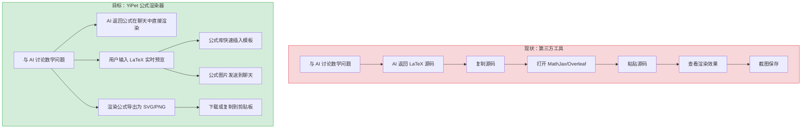
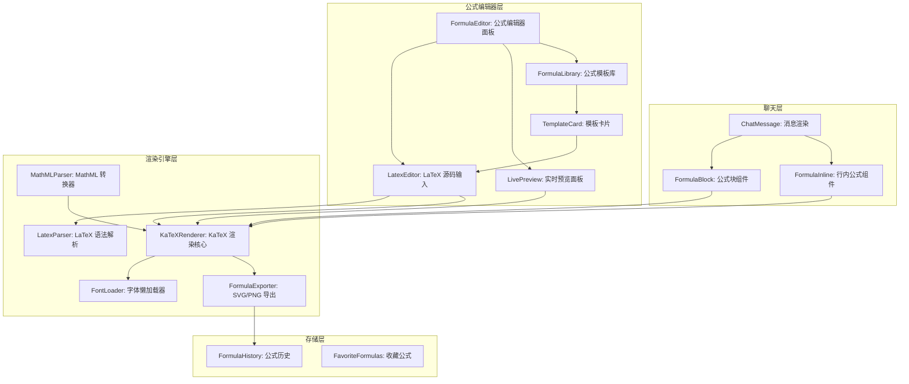
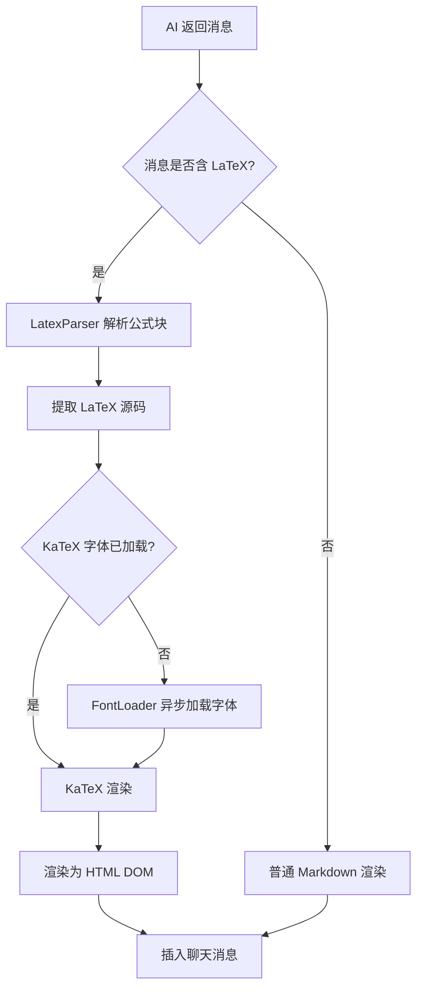

# YP-09-188: 数学公式渲染器 — LaTeX/MathML 公式渲染与实时预览，公式库浏览，SVG/PNG 导出，聊天发送，常用公式模板

> 需求编号：YP-09-188 · 优先级：P2 · 人天：0.2d · 状态：需求已编写
> 依赖：YP-09-110（Markdown 编辑器增强，可选）· 前置需求：无

## 背景

### 问题陈述

用户在与 AI 讨论数学、物理、计算机科学等技术话题时，经常需要输入和查看数学公式。当前 YiPet 聊天使用纯文本渲染，公式只能以 LaTeX 源码或 Unicode 近似形式展示，可读性极差。用户在讨论中使用公式时：(1) 需要将公式源码复制到第三方工具（如 MathJax 在线编辑器、Overleaf）预览效果；(2) 无法直接在聊天中发送渲染后的公式图片；(3) 没有公式模板库，每次都要手写 LaTeX 源码；(4) 无法将渲染后的公式保存为 SVG/PNG 用于文档或演示。

1. **公式渲染缺失**：聊天中的 LaTeX 源码无法渲染，只能看到 `\frac{a}{b}` 这样的源码
2. **无实时预览**：输入公式时无法即时看到渲染效果，需要反复在第三方工具中验证
3. **无公式库**：常用公式（如贝叶斯定理、欧拉公式）需要每次手写，容易出错
4. **公式不可导出**：渲染后的公式无法保存为图片，无法在聊天中直接发送
5. **公式模板缺失**：没有预设的公式结构模板（如矩阵、分段函数、积分等）

**核心矛盾**：用户需要流畅的公式输入和渲染体验，但当前 YiPet 仅支持纯文本，公式以源码形式存在。YiPet 作为浏览器扩展，可以利用 KaTeX 这样的轻量渲染库在本地快速渲染公式，无需依赖服务端。

### 影响范围

| # | 影响 | 严重程度 | 典型场景 |
|---|------|----------|----------|
| 1 | 公式源码无法渲染，可读性差 | 高 | 用户问 AI 数学问题，AI 返回 LaTeX 公式源码 |
| 2 | 输入公式时无实时预览 | 高 | 用户手写复杂公式，需要反复验证语法 |
| 3 | 无公式模板库 | 中 | 用户每次都要手写常见公式结构 |
| 4 | 公式无法导出为图片 | 中 | 用户需要在文档或演示中使用公式 |
| 5 | 公式无法在聊天中作为图片发送 | 低 | 用户想让 AI 识别和分析公式内容 |

### 挑战

| 挑战 | 说明 |
|------|------|
| KaTeX 库体积 | KaTeX 完整包约 260KB（含字体），需评估对扩展体积的影响，考虑按需加载 |
| LaTeX 语法错误处理 | 用户在实时输入时会产生不完整的 LaTeX 语法，需要优雅降级而非崩溃 |
| MathML 兼容性 | MathML 在不同浏览器中的渲染效果不一致，需要统一渲染引擎 |
| 公式编辑器 UI | 需要平衡公式输入（LaTeX 源码）和可视化编辑（公式结构模板）的用户体验 |
| SVG/PNG 导出保真度 | 字体嵌入和尺寸控制需要精确处理，确保导出图片在不同设备上一致 |

---

## 一、现状分析

### 1.1 当前公式处理流程

```
现有公式处理（纯文本）:
├── YiPet 聊天消息
│   └── LaTeX 源码以纯文本展示，如 "$$E=mc^2$$"
├── Markdown 渲染
│   └── marked 默认不渲染数学公式
├── 用户输入
│   └── 无公式辅助输入，依赖用户手动输入 LaTeX
└── chrome.storage
    └── 无公式历史或库

缺失:
├── 数学公式渲染                    # ❌ 不存在
├── 实时公式预览                    # ❌ 不存在
├── 公式库浏览与插入                # ❌ 不存在
├── SVG/PNG 导出                    # ❌ 不存在
├── 公式发送到聊天                  # ❌ 不存在
├── MathML 支持                     # ❌ 不存在
├── 公式模板系统                    # ❌ 不存在
└── 公式识别（图片 OCR）            # ❌ 不在本期范围
```

### 1.2 用户公式流程（现状 vs 目标）



### 1.3 根因矩阵

| 症状 | 根因 | 触发条件 | 频率 |
|------|------|----------|------|
| LaTeX 源码未渲染 | Markdown 渲染器不支持数学公式 | AI 返回含 LaTeX 的消息 | 高 |
| 公式输入无辅助 | 无公式编辑器或模板系统 | 用户需要输入复杂公式 | 高 |
| 公式无法导出 | 无公式渲染到图片的管线 | 用户需要分享公式 | 中 |
| MathML 不支持 | 渲染器仅处理纯文本 | 页面含 MathML 元素 | 低 |
| 公式错误难调试 | 无语法错误提示 | LaTeX 语法错误 | 中 |

---

## 二、设计决策

### 决策 1：公式渲染引擎 — KaTeX vs MathJax vs 自建

| 选项 | 体积 | 渲染速度 | LaTeX 覆盖率 | 字体处理 |
|------|------|----------|-------------|----------|
| KaTeX | ~260KB（含字体，可拆分） | 极快（< 5ms） | 高（90%+ LaTeX） | CSS + 字体文件 |
| MathJax 3 | ~600KB+ | 快（< 50ms） | 很高（95%+） | SVG 输出 |
| 自建 | ~20KB | 快 | 低（< 30%） | 有限 |

**选择：KaTeX（按需加载）。** KaTeX 渲染速度是 MathJax 的 10 倍以上（5ms vs 50ms），体积可通过 split 减少。KaTeX 覆盖了 90% 以上的常用 LaTeX 命令，对于 YiPet 的聊天场景足够。字体文件使用 CDN 懒加载（参考 YP-09-08 CDN 资源加载系统），首次渲染时异步获取，不阻塞 UI。

### 决策 2：公式编辑器模式 — 源码编辑 vs 可视化编辑 vs 混合

| 选项 | 学习成本 | 实现复杂度 | 灵活性 | 适合场景 |
|------|----------|-----------|--------|----------|
| 源码编辑（LaTeX 文本框） | 高 | 低 | 最高 | 熟悉 LaTeX 的用户 |
| 可视化编辑（WYSIWYG） | 低 | 高 | 低 | 不熟悉 LaTeX 的用户 |
| 混合（源码 + 模板插入 + 实时预览） | 中 | 中 | 高 | 覆盖所有用户 |

**选择：混合模式。** 提供 LaTeX 源码输入框加实时预览面板（分屏模式），同时提供公式模板库以便不熟悉 LaTeX 的用户通过点击模板快速构建公式。模板采用"填空式"（如矩阵模板预置占位符），用户只需修改关键部分。

### 决策 3：公式导出格式 — SVG vs PNG vs 仅 Canvas

| 选项 | 可缩放性 | 文件大小 | 字体嵌入 | 剪贴板兼容性 |
|------|---------|----------|----------|-------------|
| SVG | 是 | 小（~2-10KB） | 需要 CSS @font-face | 中 |
| PNG | 否 | 中（~10-50KB） | 天然支持 | 高 |
| Canvas 截图 | 否 | — | 依赖系统字体 | 中 |

**选择：SVG + PNG 双格式。** SVG 适合文档嵌入和网页使用（分辨率无关），PNG 适合聊天发送和通用分享（兼容性最好）。KaTeX 支持渲染为 DOM 元素，可提取 HTML/CSS 并转换为 SVG 或 Canvas 截图。

### 决策 4：KaTeX 字体策略 — 内联 vs CDN vs 预打包

| 选项 | 体积 | 加载速度 | 稳定性 | 实现复杂度 |
|------|------|----------|--------|-----------|
| 内联（打包到扩展） | +200KB | 即时 | 高 | 低 |
| CDN 懒加载 | 0KB | 首次 200-500ms | 依赖网络 | 中 |
| 预加载 + 缓存 | 0KB | 第二次 < 10ms | 中 | 中 |

**选择：CDN 懒加载 + Service Worker 缓存。** 字体文件通过 YP-09-08 的 CDN 加载系统获取，首次渲染公式时异步加载字体文件（约 200KB，但可拆分为仅加载所需字体子集）。Service Worker 缓存字体请求，后续访问即时可用。不增加扩展安装包体积。

### 设计决策记录

| 决策 | 选项 A | 选项 B | 选项 C | 选择 | 理由 |
|------|--------|--------|--------|------|------|
| 渲染引擎 | KaTeX | MathJax | 自建 | **KaTeX** | 极快渲染，90%+ 覆盖 |
| 编辑器模式 | 源码 | 可视化 | 混合 | **混合** | 覆盖所有用户类型 |
| 导出格式 | SVG | PNG | Canvas | **SVG + PNG** | 双格式覆盖所有场景 |
| 字体策略 | 内联 | CDN | 预打包 | **CDN + 缓存** | 不增加扩展体积 |

---

## 三、目标架构

### 3.1 公式渲染系统架构



### 3.2 公式渲染消息流



### 3.3 性能指标

| 指标 | 目标值 | 说明 |
|------|--------|------|
| 单行公式渲染 | < 5ms | KaTeX 渲染一个行内公式 |
| 复杂公式渲染 | < 20ms | 矩阵/分段函数等多行公式 |
| 实时预览更新 | < 50ms（防抖 300ms） | 输入停止后 300ms 内渲染 |
| 公式库打开 | < 30ms | 模板列表渲染 |
| SVG 导出 | < 30ms | DOM → SVG 转换 |
| PNG 导出 | < 50ms | SVG → Canvas → Blob |
| 字体首次加载 | < 500ms | CDN + 异步加载 |

---

## 四、具体改动

### 4.1 公式类型定义

```typescript
// src/formula/types.ts (新增)

export type FormulaFormat = 'latex' | 'mathml';

export type ExportFormat = 'svg' | 'png';

export interface FormulaConfig {
  format: FormulaFormat;
  source: string;
  displayMode: boolean;  // true=块级公式, false=行内公式
  fontSize: number;      // 默认 16px
  color: string;         // 默认 #000000
}

export interface FormulaTemplate {
  id: string;
  name: string;           // 中文名，如 "二次公式"
  category: FormulaCategory;
  latex: string;          // LaTeX 源码
  description: string;    // 公式描述
  previewUrl?: string;    // 预渲染图片 URL
}

export type FormulaCategory =
  | 'algebra'       // 代数
  | 'calculus'      // 微积分
  | 'linear_algebra'// 线性代数
  | 'statistics'    // 统计与概率
  | 'geometry'      // 几何
  | 'trigonometry'  // 三角函数
  | 'physics'       // 物理
  | 'cs'            // 计算机科学
  | 'chemistry'     // 化学
  | 'common';       // 常用符号

export interface FormulaHistoryEntry {
  id: string;
  latex: string;
  renderedAt: number;
  fromTemplate?: string;
}
```

### 4.2 KaTeX 渲染核心

```typescript
// src/formula/KaTeXRenderer.ts (新增)

import katex from 'katex';
import type { FormulaConfig } from './types';

export class KaTeXRenderer {
  private fontLoaded = false;
  private fontLoadPromise: Promise<void> | null = null;

  /** 渲染 LaTeX 为 HTML 字符串 */
  render(config: FormulaConfig): string {
    try {
      return katex.renderToString(config.source, {
        displayMode: config.displayMode,
        throwOnError: false,      // 渲染失败时不抛异常
        errorColor: '#cc0000',    // 错误公式用红色标记
        strict: false,            // 宽松模式，允许非标准 LaTeX
        trust: false,              // 禁用 \includegraphics 等危险命令
        macros: {
          "\\RR": "\\mathbb{R}",
          "\\NN": "\\mathbb{N}",
          "\\ZZ": "\\mathbb{Z}",
        },
      });
    } catch (error) {
      console.warn('[FormulaRenderer] Render error:', error);
      return `<span class="formula-error" title="${this.escapeHtml(error.message)}">${this.escapeHtml(config.source)}</span>`;
    }
  }

  /** 渲染公式为 HTML 元素 */
  renderToElement(config: FormulaConfig, container: HTMLElement): void {
    try {
      katex.render(config.source, container, {
        displayMode: config.displayMode,
        throwOnError: false,
        errorColor: '#cc0000',
        strict: false,
        trust: false,
      });
    } catch (error) {
      container.innerHTML = `<span class="formula-error">${this.escapeHtml(config.source)}</span>`;
    }
  }

  /** 懒加载字体文件 */
  async ensureFontsLoaded(cdnBaseUrl: string): Promise<void> {
    if (this.fontLoaded) return;
    if (this.fontLoadPromise) return this.fontLoadPromise;

    this.fontLoadPromise = this.loadFonts(cdnBaseUrl);
    await this.fontLoadPromise;
    this.fontLoaded = true;
  }

  private async loadFonts(cdnBaseUrl: string): Promise<void> {
    // 仅加载常用字体子集（约 80KB gzipped）
    const fonts = [
      'KaTeX_Main-Regular.woff2',
      'KaTeX_Math-Italic.woff2',
      'KaTeX_Size1-Regular.woff2',
      'KaTeX_Size2-Regular.woff2',
    ];

    const fontFaces = fonts.map(font => {
      const url = `${cdnBaseUrl}/fonts/${font}`;
      return new FontFace('KaTeX_Main', `url(${url})`).load();
    });

    await Promise.all(fontFaces);
    fontFaces.forEach(ff => document.fonts.add(ff));
  }

  /** 验证 LaTeX 语法 */
  validate(latex: string): { valid: boolean; error?: string } {
    try {
      katex.renderToString(latex, {
        throwOnError: true,
        strict: 'warn',
      });
      return { valid: true };
    } catch (error: any) {
      return { valid: false, error: error.message };
    }
  }

  private escapeHtml(text: string): string {
    const div = document.createElement('div');
    div.textContent = text;
    return div.innerHTML;
  }
}
```

### 4.3 LaTeX 解析器（消息中提取公式）

```typescript
// src/formula/LatexParser.ts (新增)

export interface ParsedFragment {
  type: 'text' | 'block_formula' | 'inline_formula';
  content: string;
}

export class LatexParser {
  /** 从 Markdown 文本中提取公式块和行内公式 */
  parse(markdown: string): ParsedFragment[] {
    const fragments: ParsedFragment[] = [];
    // 正则匹配 $$ ... $$（块级公式）和 $ ... $（行内公式）
    const formulaRegex = /(\$\$[\s\S]*?\$\$|\$(?!\$)[\s\S]*?\$)/g;

    let lastIndex = 0;
    let match: RegExpExecArray | null;

    while ((match = formulaRegex.exec(markdown)) !== null) {
      // 公式前的文本
      if (match.index > lastIndex) {
        fragments.push({
          type: 'text',
          content: markdown.slice(lastIndex, match.index),
        });
      }

      const formula = match[1];
      const isBlock = formula.startsWith('$$');
      const content = isBlock
        ? formula.slice(2, -2).trim()
        : formula.slice(1, -1).trim();

      fragments.push({
        type: isBlock ? 'block_formula' : 'inline_formula',
        content,
      });

      lastIndex = match.index + match[1].length;
    }

    // 剩余文本
    if (lastIndex < markdown.length) {
      fragments.push({
        type: 'text',
        content: markdown.slice(lastIndex),
      });
    }

    return fragments;
  }

  /** 判断文本是否包含 LaTeX 公式 */
  containsFormula(text: string): boolean {
    return text.includes('$$') || /(?<!\$)\$(?!\$)/.test(text);
  }
}
```

### 4.4 公式模板库

```typescript
// src/formula/FormulaLibrary.ts (新增)

import type { FormulaTemplate } from './types';

export const FORMULA_TEMPLATES: FormulaTemplate[] = [
  // === 代数 ===
  {
    id: 'quadratic',
    name: '二次公式',
    category: 'algebra',
    latex: 'x = \\frac{-b \\pm \\sqrt{b^2 - 4ac}}{2a}',
    description: '一元二次方程求根公式',
  },
  {
    id: 'binomial',
    name: '二项式展开',
    category: 'algebra',
    latex: '(a + b)^n = \\sum_{k=0}^{n} \\binom{n}{k} a^{n-k} b^k',
    description: '二项式定理',
  },
  // === 微积分 ===
  {
    id: 'derivative_def',
    name: '导数定义',
    category: 'calculus',
    latex: "f'(x) = \\lim_{h \\to 0} \\frac{f(x+h) - f(x)}{h}",
    description: '导数极限定义',
  },
  {
    id: 'integral_def',
    name: '定积分',
    category: 'calculus',
    latex: '\\int_{a}^{b} f(x) \\, dx = F(b) - F(a)',
    description: '牛顿-莱布尼茨公式',
  },
  // === 线性代数 ===
  {
    id: 'matrix_3x3',
    name: '3x3 矩阵',
    category: 'linear_algebra',
    latex: '\\begin{pmatrix} a_{11} & a_{12} & a_{13} \\\\ a_{21} & a_{22} & a_{23} \\\\ a_{31} & a_{32} & a_{33} \\end{pmatrix}',
    description: '三阶矩阵模板',
  },
  // === 统计与概率 ===
  {
    id: 'bayes',
    name: '贝叶斯定理',
    category: 'statistics',
    latex: 'P(A|B) = \\frac{P(B|A) \\cdot P(A)}{P(B)}',
    description: '贝叶斯定理',
  },
  {
    id: 'normal_dist',
    name: '正态分布',
    category: 'statistics',
    latex: 'f(x) = \\frac{1}{\\sigma\\sqrt{2\\pi}} e^{-\\frac{(x-\\mu)^2}{2\\sigma^2}}',
    description: '正态分布概率密度函数',
  },
  // === 常用符号 ===
  {
    id: 'greek_lower',
    name: '希腊字母（小写）',
    category: 'common',
    latex: '\\alpha \\beta \\gamma \\delta \\epsilon \\zeta \\eta \\theta \\lambda \\mu \\pi \\rho \\sigma \\tau \\phi \\omega',
    description: '常用小写希腊字母',
  },
  {
    id: 'greek_upper',
    name: '希腊字母（大写）',
    category: 'common',
    latex: '\\Gamma \\Delta \\Theta \\Lambda \\Xi \\Pi \\Sigma \\Phi \\Psi \\Omega',
    description: '常用大写希腊字母',
  },
];
```

### 4.5 公式导出器

```typescript
// src/formula/FormulaExporter.ts (新增)

import type { ExportFormat } from './types';

export class FormulaExporter {
  /** 将公式元素导出为 SVG 字符串 */
  exportAsSVG(formulaElement: HTMLElement): string {
    const svgNS = 'http://www.w3.org/2000/svg';
    const rect = formulaElement.getBoundingClientRect();
    const width = rect.width;
    const height = rect.height;

    // 从公式元素获取所有样式
    const styles = this.collectStyles(formulaElement);
    const html = formulaElement.outerHTML;

    const svg = `<svg xmlns="${svgNS}" width="${width}" height="${height}" viewBox="0 0 ${width} ${height}">
  <defs>
    <style>${styles}</style>
  </defs>
  <foreignObject width="${width}" height="${height}" x="0" y="0">
    <div xmlns="http://www.w3.org/1999/xhtml">
      ${html}
    </div>
  </foreignObject>
</svg>`;

    return svg;
  }

  /** 将公式元素导出为 PNG Blob */
  async exportAsPNG(formulaElement: HTMLElement): Promise<Blob> {
    const svg = this.exportAsSVG(formulaElement);

    return new Promise((resolve, reject) => {
      const img = new Image();
      const svgBlob = new Blob([svg], { type: 'image/svg+xml;charset=utf-8' });
      const url = URL.createObjectURL(svgBlob);

      img.onload = () => {
        const canvas = document.createElement('canvas');
        canvas.width = img.naturalWidth * 2;  // 2x 分辨率
        canvas.height = img.naturalHeight * 2;
        const ctx = canvas.getContext('2d')!;
        ctx.scale(2, 2);
        ctx.drawImage(img, 0, 0);
        URL.revokeObjectURL(url);

        canvas.toBlob((blob) => {
          if (blob) resolve(blob);
          else reject(new Error('Canvas toBlob failed'));
        }, 'image/png');
      };

      img.onerror = () => {
        URL.revokeObjectURL(url);
        reject(new Error('SVG image load failed'));
      };

      img.src = url;
    });
  }

  /** 下载公式为文件 */
  async download(formulaElement: HTMLElement, format: ExportFormat, filename: string): Promise<void> {
    if (format === 'svg') {
      const svg = this.exportAsSVG(formulaElement);
      const blob = new Blob([svg], { type: 'image/svg+xml;charset=utf-8' });
      this.triggerDownload(blob, `${filename}.svg`);
    } else {
      const blob = await this.exportAsPNG(formulaElement);
      this.triggerDownload(blob, `${filename}.png`);
    }
  }

  /** 复制公式到剪贴板 */
  async copyToClipboard(formulaElement: HTMLElement, format: ExportFormat): Promise<void> {
    if (format === 'svg') {
      const svg = this.exportAsSVG(formulaElement);
      await navigator.clipboard.writeText(svg);
    } else {
      const blob = await this.exportAsPNG(formulaElement);
      await navigator.clipboard.write([
        new ClipboardItem({ 'image/png': blob }),
      ]);
    }
  }

  private collectStyles(element: HTMLElement): string {
    const katexStyles = Array.from(document.querySelectorAll('style'))
      .filter(s => s.textContent?.includes('katex'))
      .map(s => s.textContent)
      .join('\n');
    return katexStyles;
  }

  private triggerDownload(blob: Blob, filename: string): void {
    const url = URL.createObjectURL(blob);
    const a = document.createElement('a');
    a.href = url;
    a.download = filename;
    a.click();
    URL.revokeObjectURL(url);
  }
}
```

### 4.6 文件变更清单

| 文件 | 操作 | 说明 |
|------|------|------|
| `src/formula/types.ts` | 新增 | 公式类型定义 |
| `src/formula/KaTeXRenderer.ts` | 新增 | KaTeX 渲染核心 |
| `src/formula/LatexParser.ts` | 新增 | LaTeX 语法解析器 |
| `src/formula/FormulaLibrary.ts` | 新增 | 公式模板库 |
| `src/formula/FormulaExporter.ts` | 新增 | SVG/PNG 导出器 |
| `src/formula/FontLoader.ts` | 新增 | 字体懒加载管理 |
| `src/components/FormulaBlock.vue` | 新增 | 块级公式渲染组件 |
| `src/components/FormulaInline.vue` | 新增 | 行内公式渲染组件 |
| `src/components/FormulaEditor.vue` | 新增 | 公式编辑器面板 |
| `src/components/FormulaLibraryPanel.vue` | 新增 | 公式库浏览面板 |
| `src/components/ChatMessage.vue` | 修改 | 集成公式解析渲染 |
| `manifest.json` | 修改 | 添加 content_security_policy 允许 CDN 字体 |

---

## 五、实施步骤

| 步骤 | 操作 | 路径 | 验证 | 人天 |
|------|------|------|------|------|
| 1 | 安装 KaTeX 依赖，定义类型 | `src/formula/types.ts` | 类型检查通过 | 0.01 |
| 2 | 实现 KaTeX 渲染核心 | `src/formula/KaTeXRenderer.ts` | 渲染简单公式为 HTML | 0.02 |
| 3 | 实现 LaTeX 解析器 | `src/formula/LatexParser.ts` | 正确解析 $$ 和 $ 包裹的公式 | 0.01 |
| 4 | 实现字体懒加载 | `src/formula/FontLoader.ts` | CDN 加载字体，SW 缓存 | 0.02 |
| 5 | 实现公式导出器 | `src/formula/FormulaExporter.ts` | 导出 SVG/PNG 可正常渲染 | 0.02 |
| 6 | 创建公式模板库 | `src/formula/FormulaLibrary.ts` | 20+ 模板覆盖各类别 | 0.02 |
| 7 | 实现公式渲染组件 | `src/components/FormulaBlock.vue` + `FormulaInline.vue` | 聊天消息中公式正确渲染 | 0.02 |
| 8 | 实现公式编辑器 | `src/components/FormulaEditor.vue` | 输入 LaTeX 实时预览 | 0.03 |
| 9 | 实现公式库浏览面板 | `src/components/FormulaLibraryPanel.vue` | 分类浏览 + 点击插入 | 0.02 |
| 10 | 集成到聊天消息渲染 | `src/components/ChatMessage.vue` | AI 返回的公式自动渲染 | 0.02 |
| 11 | 添加 CSP 配置 | `manifest.json` | CDN 字体加载不被 CSP 阻止 | 0.01 |

**总人天：0.2d**

---

## 六、测试规格

### 场景 1：聊天消息中的行内公式渲染

**GIVEN** AI 返回消息 "根据欧拉公式 $e^{i\pi} + 1 = 0$，我们可以推导出..."
**WHEN** ChatMessage 组件渲染该消息
**THEN** "e^{i\pi} + 1 = 0" 应被 KaTeX 渲染为行内公式
**AND** 公式与周围文本在同一行
**AND** 公式字体大小与周围文本一致

### 场景 2：聊天消息中的块级公式渲染

**GIVEN** AI 返回消息包含 $$\sum_{n=1}^{\infty} \frac{1}{n^2} = \frac{\pi^2}{6}$$
**WHEN** ChatMessage 组件渲染该消息
**THEN** 公式应独立成行居中显示
**AND** 求和符号、上标、下标、分数均正确渲染
**AND** 公式块与上下文之间有适当间距

### 场景 3：公式编辑器实时预览

**GIVEN** 用户打开公式编辑器
**WHEN** 用户在输入框输入 "\frac{a}{b}"
**THEN** 在输入停止 300ms 后，预览面板应显示 a/b 的分数形式
**AND** 继续输入 "\frac{a}{b} + \sqrt{c}" 时预览实时更新
**AND** 输入不完整时（如仅 "\frac{a}{"）不崩溃，显示"公式不完整"提示

### 场景 4：公式模板库插入

**GIVEN** 用户打开公式库面板
**WHEN** 用户选择 "代数" 分类，点击 "二次公式" 模板
**THEN** 模板的 LaTeX 源码应插入到编辑器输入框中
**AND** 预览面板应渲染出二次公式的分数和根号形式
**AND** 用户可以在插入的模板上修改参数

### 场景 5：导出公式为 PNG

**GIVEN** 公式 "E=mc^2" 已成功渲染在公式元素中
**WHEN** 用户点击 "导出为 PNG"
**THEN** 浏览器应触发下载，文件名为 "formula.png"
**AND** 下载的 PNG 图片包含清晰的公式渲染
**AND** PNG 图片尺寸为 2x 分辨率（Retina 友好）

### 场景 6：LaTeX 语法错误优雅降级

**GIVEN** 用户输入无效 LaTeX "\frac{a}{"（缺少闭合括号）
**WHEN** 公式渲染执行
**THEN** 不抛出异常，不导致页面崩溃
**AND** 原始源码以红色文字显示
**AND** 鼠标悬停时显示错误原因 "Unclosed group"

---

## 七、风险与缓解

| 风险 | 概率 | 影响 | 缓解措施 |
|------|------|------|----------|
| KaTeX 字体 CDN 加载失败 | 中 | 中 | 降级为系统字体，显示简单文本公式；Service Worker 缓存 |
| KaTeX 不支持某些 LaTeX 命令 | 中 | 中 | 宽松模式 + 错误降级为源码显示，提供 "在 Overleaf 中打开" 链接 |
| SVG 导出中文/特殊字符丢失 | 中 | 中 | 使用 foreignObject 嵌入 HTML，确保字体内嵌 |
| 公式渲染影响聊天消息滚动性能 | 低 | 中 | 仅对可见消息渲染公式，虚拟滚动优化 |
| CSP 阻止 CDN 字体加载 | 中 | 高 | manifest.json 中配置 content_security_policy 允许 CDN 域名 |

---

## 八、回滚策略

| 场景 | 回滚操作 | 影响 |
|------|------|------|
| 公式渲染导致消息显示异常 | 关闭公式解析，回退到纯文本 LaTeX 源码显示 | 失去渲染功能 |
| KaTeX 库加载失败率高 | 降级为 Unicode 近似公式显示 | 美观度下降，功能可用 |
| 字体 CDN 持续不可用 | 内嵌最小字体子集（~50KB） | 增加扩展体积 |
| 公式编辑器崩溃 | 移除编辑器 Tab，公式库作为纯文本插入 | 失去实时预览 |

---

## 九、设计决策记录

### D-01：为什么选择 KaTeX 而非 MathJax？

KaTeX 渲染速度（< 5ms）远超 MathJax（< 50ms），对于聊天场景的即时渲染体验至关重要。KaTeX 体积（260KB）小于 MathJax（600KB+），且支持按需加载字体子集。虽然 KaTeX 的 LaTeX 命令覆盖率（约 90%）略低于 MathJax（约 95%），但对于聊天场景中的常用公式已完全足够。缺失的 5% 多为化学公式、Feynman 图等专业领域命令，YiPet 聊天用户很少使用。

### D-02：为什么字体使用 CDN 懒加载而非内嵌？

KaTeX 字体文件约 200KB（woff2 格式），内嵌会使扩展安装包增加 200KB。YiPet 扩展已使用 CDN 资源加载系统（YP-09-08），复用现有基础设施。首次公式渲染时异步加载字体（约 200-500ms），后续由 Service Worker 缓存即时可用。如果 CDN 不可用，降级为系统字体显示。

### D-03：为什么公式编辑器采用"源码 + 预览"分屏而非 WYSIWYG？

WYSIWYG 公式编辑器（如 MathType、Desmos）实现复杂度极高（数学公式的定位、光标导航、选择等需要处理复杂的文档模型），0.2d 的开发时间无法实现。源码 + 实时预览分屏模式实现简单（2 个面板 + 防抖渲染），学习成本可通过公式模板库降低。对于不熟悉 LaTeX 的用户，模板插入功能提供了可视化入口。

### D-04：为什么 SVG/PNG 双格式导出而不支持 PDF/EPS？

PDF/EPS 需要服务端渲染（Canvas 不支持 PDF 输出），且扩展环境中的 PDF 生成库（如 jsPDF）体积大且不支持复杂公式。SVG 适合网页嵌入和矢量编辑软件，PNG 适合聊天发送和通用分享。用户如需 PDF，可以通过 SVG → 在线转换工具完成，非核心场景。

---

## 十、可观测性

### 指标

| 指标 | 类型 | 说明 |
|------|------|------|
| `yipet.formula.render_total` | Counter | 公式渲染总次数（按行内/块级分组） |
| `yipet.formula.render_error_rate` | Gauge | 公式渲染失败率 |
| `yipet.formula.render_latency_ms` | Histogram | 公式渲染延迟 |
| `yipet.formula.editor_open_total` | Counter | 公式编辑器打开次数 |
| `yipet.formula.template_used_total` | Counter | 公式模板使用次数（按模板 ID 分组） |
| `yipet.formula.export_total` | Counter | 公式导出次数（按格式分组） |
| `yipet.formula.font_load_failure_rate` | Gauge | 字体加载失败率 |

### 告警

| 告警 | 条件 | 级别 |
|------|------|------|
| 公式渲染失败率过高 | > 10% 持续 15min | WARNING |
| 字体加载失败率过高 | > 30% 持续 30min | WARNING |
| 公式编辑器使用率极低 | 日活用户中 < 0.5% | INFO |

---

## 十一、代码审查检查清单

- [ ] KaTeX 渲染使用 throwOnError: false，失败不崩溃
- [ ] LaTeX 解析支持 $$ 块级和 $ 行内公式，不嵌套
- [ ] 公式模板库至少覆盖 5 个类别，20+ 模板
- [ ] SVG 导出使用 foreignObject 确保字体嵌入
- [ ] PNG 导出使用 2x 分辨率（Retina 友好）
- [ ] 字体加载失败时降级为系统字体显示
- [ ] 公式编辑器输入防抖 300ms 避免过度渲染
- [ ] 公式块在虚拟滚动列表中正确处理（保留渲染状态）
- [ ] CSP 配置允许 KaTeX 字体 CDN 域名
- [ ] 复制 SVG 到剪贴板时包含 xmlns 命名空间

---

## 回归问题预测

| # | 预测问题 | 原因 | 验证方法 |
|---|---------|------|---------|
| 1 | 聊天消息中的公式在快速滚动时闪烁 | 虚拟滚动重用 DOM 节点时公式需要重新渲染，KaTeX 渲染产生短暂空白 | 快速滚动含大量公式的聊天记录，观察渲染完整性 |
| 2 | 公式 SVG 导出的 foreignObject 在部分图片查看器中无法渲染 | foreignObject 在独立 SVG 文件中支持较差，需要转换为路径 | 在 Windows 照片查看器、macOS Preview、Chrome 中分别打开导出的 SVG |
| 3 | 公式编辑器在输入中文 IME 组合态时频繁触发预览更新 | IME 组合输入过程中每打一个字母都触发防抖定时器重置，但预览闪烁 | 检测 IME compositionstart/compositionend 事件，IME 激活期间暂停预览 |
| 4 | KaTeX 宏定义（\RR、\NN）与用户自定义冲突 | 全局宏定义可能覆盖用户期望的渲染结果 | 在公式编辑器工具栏中显示当前宏列表，允许用户查看和禁用 |
| 5 | CDN 字体在离线模式下无法加载，所有公式显示为红色错误 | Service Worker 缓存可能存在 Race Condition（首次加载时 SW 未完成安装） | 离线模式测试：断开网络 → 刷新页面 → 检查公式是否使用降级渲染 |
| 6 | LaTeX 解析错误地将代码块中的 $ 识别为公式 | Markdown 代码块（```...```）中的 $ 不应被解析为公式定界符 | 使用含代码块的消息测试，代码块中的 $ 应保持原样 |

---

## 性能分析

### 各阶段耗时

| 阶段 | 预估耗时 | 说明 |
|------|----------|------|
| LaTeX 语法解析 | < 1ms | 正则匹配 |
| KaTeX 渲染（简单公式） | < 5ms | renderToString |
| KaTeX 渲染（复杂公式） | < 20ms | 矩阵/分段函数 |
| 字体首次加载 | 200-500ms | CDN 异步加载 |
| 字体后续加载 | < 10ms | SW 缓存命中 |
| SVG 导出 | < 30ms | DOM → foreignObject |
| PNG 导出 | < 80ms | SVG → Image → Canvas → Blob |
| 公式编辑器预览（防抖） | < 50ms | 输入停止 300ms 后渲染 |

### 体积预估

| 文件 | 大小 | 说明 |
|------|------|------|
| katex（npm 依赖，核心代码） | ~60KB | minified，不含字体 |
| `src/formula/types.ts` | ~1KB | 类型定义 |
| `src/formula/KaTeXRenderer.ts` | ~2KB | 渲染核心 |
| `src/formula/LatexParser.ts` | ~1KB | 解析器 |
| `src/formula/FormulaLibrary.ts` | ~3KB | 模板数据 |
| `src/formula/FormulaExporter.ts` | ~3KB | 导出器 |
| `src/formula/FontLoader.ts` | ~1KB | 字体加载 |
| UI 组件（4 个 Vue 组件） | ~8KB | 编辑器/库/渲染 |

### 第三方依赖体积影响

| 依赖 | 体积（扩展内） | 体积（CDN 加载） | 必要性 |
|------|--------------|-----------------|--------|
| katex | 60KB | 0KB | 必须 |
| KaTeX 字体 | — | 80-200KB（CDN 子集） | 必须 |
| **总计（扩展内）** | **60KB** | **80-200KB（CDN）** | 占总预算 500KB 的 12% |