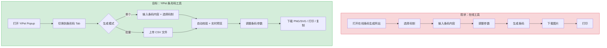
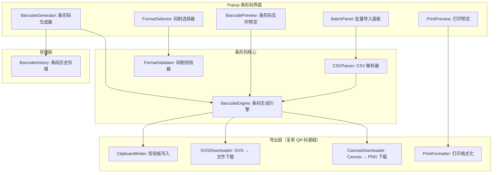
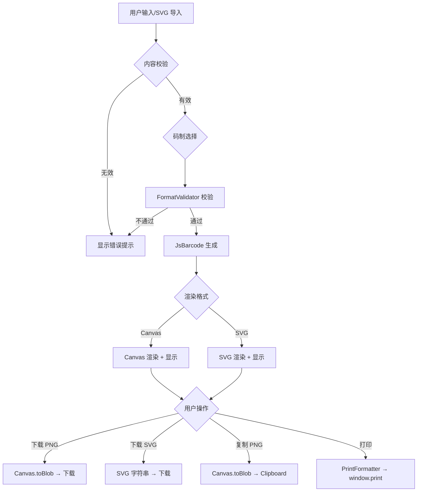

# YP-09-189: 条形码生成器 — Code128/EAN-13/UPC-A/ITF/Codabar 生成，SVG/PNG 下载，CSV 批量生成，打印友好输出

> 需求编号：YP-09-189 · 优先级：P2 · 人天：0.2d · 状态：需求已编写
> 依赖：YP-09-144（二维码生成与识别，共享导出基础设施）· 前置需求：无

## 背景

### 问题陈述

仓储物流、零售、图书管理等领域大量使用条形码（一维码），用户在浏览器中偶尔需要生成条码用于标签打印、产品管理、资产盘点等场景。当前流程需要：(1) 搜索在线条码生成工具；(2) 手动输入条码内容；(3) 选择码制和参数；(4) 下载图片；(5) 打印。如果涉及批量生成（如 100 个 SKU 条码），需要逐个操作或在 Excel 中生成公式。

1. **无条形码生成工具**：YiPet 当前仅有二维码生成，无条形码（一维码）支持
2. **码制选择困难**：用户不清楚 Code128 和 EAN-13 的区别，不知道选择哪种码制
3. **批量生成繁琐**：需要逐个生成或使用第三方软件
4. **打印参数无法控制**：条码宽度、高度、静区、文字位置等无法自定义
5. **无法 CSV 导入**：不能从 CSV 文件批量导入数据生成条码

**核心矛盾**：条形码生成是常见的业务需求，但用户需要依赖第三方工具。YiPet 作为浏览器扩展，可以提供轻量级的条码生成器，复用已有的图片导出基础设施（QR 码的 Canvas → Blob → 下载管线）。

### 影响范围

| # | 影响 | 严重程度 | 典型场景 |
|---|------|----------|----------|
| 1 | 无条形码生成功能 | 高 | 用户需要生成产品条码标签 |
| 2 | 无码制选择引导 | 中 | 用户不确定应该用 EAN-13 还是 Code128 |
| 3 | 无批量生成能力 | 中 | 用户有 100+ SKU 需要生成条码 |
| 4 | 打印参数不可定制 | 中 | 条码太小扫描枪无法识别，太大浪费标签纸 |
| 5 | 无 CSV 导入 | 低 | 用户的数据在 Excel/CSV 中 |

### 挑战

| 挑战 | 说明 |
|------|------|
| 条码库选择 | JsBarcode 是主流选择（体积 40KB），但需要验证所有目标码制的支持程度 |
| EAN-13 校验码 | EAN-13 和 UPC-A 需要计算校验位，用户输入 12 位数字后自动补全第 13 位 |
| 打印友好输出 | 浏览器打印需要精确控制条码尺寸（mil→px 转换），确保扫描枪可识别 |
| CSV 大文件处理 | 用户的 CSV 可能包含数千行，一次性生成所有条码 DOM 会阻塞 UI |
| 条码静区要求 | 不同码制对静区（空白边距）有不同要求，需要在渲染时正确实现 |

---

## 一、现状分析

### 1.1 当前条码相关功能

```
现有条码相关功能（无）:
├── YiPet Popup
│   ├── QR 码生成工具           # 已实现（YP-09-144）
│   └── 条形码生成工具           # ❌ 不存在
├── 图片导出基础设施
│   ├── Canvas.toBlob            # 已有（QR 码复用）
│   ├── 下载文件                    # 已有
│   └── 剪贴板复制                  # 已有
└── chrome.storage
    └── 条码历史记录              # ❌ 不存在

现有可复用:
├── Canvas → Blob → Download 管线  # 可复用 QR 码基础设施
├── 工具 Tab 页面模板              # 可参考 QR 码 Tab 结构
└── 图片分享到聊天                 # 可复用 QR 码分享逻辑

缺失:
├── 条形码生成引擎                  # ❌ 不存在
├── 码制选择与校验                  # ❌ 不存在
├── CSV 批量导入与生成              # ❌ 不存在
├── 条形码尺寸/颜色/文字配置       # ❌ 不存在
├── 打印友好预览                    # ❌ 不存在
└── 条码历史记录                    # ❌ 不存在
```

### 1.2 用户条形码流程（现状 vs 目标）



### 1.3 根因矩阵

| 症状 | 根因 | 触发条件 | 频率 |
|------|------|----------|------|
| 无条形码生成 | 未实现条形码模块 | 用户需要生成条码 | 中 |
| 码制选择困难 | 无码制引导说明 | 非专业用户选择码制 | 中 |
| 批量生成繁琐 | 无 CSV 导入和批量渲染 | 需要生成多个条码 | 中 |
| 打印效果差 | 无打印优化（尺寸、DPI） | 用户打印条码标签 | 低 |
| 条码历史缺失 | 未存储生成记录 | 需要重新生成历史条码 | 低 |

---

## 二、设计决策

### 决策 1：条形码库 — JsBarcode vs bwip-js vs 自建

| 选项 | 体积 | 支持码制 | 渲染方式 | 维护状态 |
|------|------|----------|----------|----------|
| JsBarcode | ~40KB | 10+ 种（128, EAN, UPC, ITF, Codabar, MSI...） | Canvas/SVG | 活跃 |
| bwip-js | ~200KB | 100+ 种（所有主流 + 小众） | Canvas/SVG/PNG | 活跃 |
| 自建 | ~10KB | 2-3 种 | Canvas | — |

**选择：JsBarcode。** 40KB 的体积在可接受范围内，支持所有需求中列出的码制（Code128/EAN-13/UPC-A/ITF/Codabar），Canvas 和 SVG 双输出模式。bwip-js 功能更全面但体积过大（200KB），对 YiPet 扩展来说过度设计。

### 决策 2：批量生成策略 — 同步 vs 分片 vs Web Worker

| 选项 | 实现复杂度 | 性能 | UI 响应性 | 内存占用 |
|------|-----------|------|----------|----------|
| 同步生成 | 低 | 慢（100 条 ~2s） | 阻塞 UI | 低 |
| 分片渲染（requestIdleCallback） | 中 | 中（100 条 ~3s） | 流畅 | 中 |
| Web Worker | 高 | 快（100 条 ~1s） | 流畅 | 中 |

**选择：分片渲染。** 每帧渲染 5-10 个条码，使用 requestIdleCallback 在浏览器空闲时渲染。100 条 CSV 数据约 2-3 秒完成，UI 保持响应。Web Worker 方案需要将 JsBarcode 和 Canvas API 引入 Worker，Canvas 在 Worker 中需要 OffscreenCanvas 支持（Chrome 69+），增加实现复杂度。对于 0.2d 的开发时间，分片渲染是最佳平衡。

### 决策 3：打印友好输出 — CSS @page vs Canvas 拼合 vs 直接打印

| 选项 | 实现复杂度 | 条码尺寸精度 | 多页支持 | 分页控制 |
|------|-----------|-------------|----------|----------|
| CSS @page + @media print | 低 | 中（依赖浏览器） | 自动 | 差 |
| Canvas 拼合为大幅图片 | 中 | 高（像素级控制） | 手动计算 | 精确 |
| 生成 PDF | 高 | 高 | 精确 | 精确 |

**选择：CSS @page + @media print。** 对于标签打印机场景，使用 @media print 定义精确的条码尺寸（mm 单位），生成一个包含所有条码的打印页面。Canvas 拼合方案更适合大量条码排版，但 0.2d 范围内 CSS @page 足够覆盖标签打印场景。

### 决策 4：CSV 解析 — 自定义 vs PapaParse vs csv-parse

| 选项 | 体积 | 功能 | 错误处理 | RFC 4180 兼容 |
|------|------|------|----------|-------------|
| 自定义（split + trim） | < 1KB | 基础 | 差 | 否 |
| PapaParse | ~20KB | 完整（含类型推断、流式） | 好 | 是 |
| csv-parse | ~15KB | 完整 | 好 | 是 |

**选择：自定义轻量解析器。** 条码 CSV 格式简单（通常只有代码 + 名称两列），自定义解析器约 50 行代码，覆盖逗号分隔、引号包裹、换行转义。避免引入 20KB 依赖用于简单场景。

### 设计决策记录

| 决策 | 选项 A | 选项 B | 选项 C | 选择 | 理由 |
|------|--------|--------|--------|------|------|
| 条码库 | JsBarcode | bwip-js | 自建 | **JsBarcode** | 40KB 体积适中，支持目标码制 |
| 批量生成 | 同步 | 分片渲染 | Web Worker | **分片渲染** | UI 流畅 + 实现简单 |
| 打印输出 | CSS @page | Canvas 拼合 | PDF | **CSS @page** | 标签打印够用 |
| CSV 解析 | 自定义 | PapaParse | csv-parse | **自定义** | 50 行代码，零依赖 |

---

## 三、目标架构

### 3.1 条形码系统架构



### 3.2 条形码生成流程



### 3.3 性能指标

| 指标 | 目标值 | 说明 |
|------|--------|------|
| 单个条码生成 | < 10ms | JsBarcode Canvas 渲染 |
| 实时预览更新 | < 50ms（防抖 300ms） | 输入停止后渲染 |
| 批量生成（100 条） | < 3s | 分片渲染，UI 保持响应 |
| CSV 解析（1000 行） | < 50ms | 自定义解析器 |
| PNG 下载 | < 20ms | Canvas.toBlob |
| 打印页面渲染 | < 100ms | CSS @page + 条码列表 |

---

## 四、具体改动

### 4.1 条形码类型定义

```typescript
// src/barcode/types.ts (新增)

export type BarcodeFormat = 'CODE128' | 'EAN13' | 'UPC' | 'ITF' | 'CODABAR';

export interface BarcodeFormatInfo {
  format: BarcodeFormat;
  name: string;
  description: string;
  charset: string;
  length: string;
  example: string;
  useCases: string[];
}

export interface BarcodeConfig {
  format: BarcodeFormat;
  value: string;
  width: number;         // 条码宽度 px，默认 2
  height: number;        // 条码高度 px，默认 100
  displayValue: boolean;  // 是否显示文字
  fontSize: number;      // 文字大小 px，默认 16
  textAlign: 'left' | 'center' | 'right';
  background: string;    // 背景色 hex
  lineColor: string;     // 线条色 hex
  margin: number;        // 静区边距 px，默认 10
  flat: boolean;         // 扁平化（不渲染圆角）
}

export interface BarcodeBatchItem {
  id: string;
  value: string;
  label?: string;         // 条码标签（如产品名称）
}

export interface BarcodeHistoryEntry {
  id: string;
  format: BarcodeFormat;
  value: string;
  label?: string;
  createdAt: number;
}

export const BARCODE_FORMATS: BarcodeFormatInfo[] = [
  {
    format: 'CODE128',
    name: 'Code 128',
    description: '通用条码，支持 ASCII 128 字符集，物流/仓储常用',
    charset: 'ASCII 全字符（0-127）',
    length: '可变长度',
    example: 'PROD-2024-0001',
    useCases: ['物流标签', '仓储管理', '资产管理'],
  },
  {
    format: 'EAN13',
    name: 'EAN-13',
    description: '国际商品条码，零售业标准，需 12 位数字 + 1 位校验',
    charset: '仅数字 (0-9)',
    length: '12 或 13 位',
    example: '5901234123457',
    useCases: ['零售商品', '图书 ISBN', '商品包装'],
  },
  {
    format: 'UPC',
    name: 'UPC-A',
    description: '北美通用商品条码，零售业标准，需 11 位数字 + 1 位校验',
    charset: '仅数字 (0-9)',
    length: '11 或 12 位',
    example: '042100005264',
    useCases: ['北美零售', '超市商品'],
  },
  {
    format: 'ITF',
    name: 'ITF-14 (交叉 2/5)',
    description: '物流箱码，用于外包装箱，需 14 位数字',
    charset: '仅数字 (0-9)',
    length: '14 位（偶数位）',
    example: '15400141288763',
    useCases: ['物流箱码', '外包装', '托盘标签'],
  },
  {
    format: 'CODABAR',
    name: 'Codabar',
    description: '老式条码，图书馆/血库/快递常用，支持数字 + 起止符',
    charset: '0-9, -, $, :, /, ., +',
    length: '可变长度',
    example: 'A123456B',
    useCases: ['图书馆', '血库', '快递单号'],
  },
];

export const DEFAULT_BARCODE_CONFIG: BarcodeConfig = {
  format: 'CODE128',
  value: '',
  width: 2,
  height: 100,
  displayValue: true,
  fontSize: 16,
  textAlign: 'center',
  background: '#FFFFFF',
  lineColor: '#000000',
  margin: 10,
  flat: false,
};
```

### 4.2 条码生成引擎

```typescript
// src/barcode/BarcodeEngine.ts (新增)

import JsBarcode from 'jsbarcode';
import type { BarcodeConfig, BarcodeBatchItem } from './types';

export interface GenerateResult {
  canvas: HTMLCanvasElement;
  svg: string;
}

export class BarcodeEngine {
  /** 生成单个条码 Canvas + SVG */
  generate(config: BarcodeConfig): GenerateResult {
    // Canvas 渲染
    const canvas = document.createElement('canvas');
    JsBarcode(canvas, config.value, {
      format: config.format,
      width: config.width,
      height: config.height,
      displayValue: config.displayValue,
      fontSize: config.fontSize,
      textAlign: config.textAlign,
      background: config.background,
      lineColor: config.lineColor,
      margin: config.margin,
      flat: config.flat,
    });

    // SVG 渲染
    const svgNode = document.createElementNS('http://www.w3.org/2000/svg', 'svg');
    JsBarcode(svgNode, config.value, {
      format: config.format,
      width: config.width,
      height: config.height,
      displayValue: config.displayValue,
      fontSize: config.fontSize,
      textAlign: config.textAlign,
      background: config.background,
      lineColor: config.lineColor,
      margin: config.margin,
      flat: config.flat,
    });
    const svg = new XMLSerializer().serializeToString(svgNode);

    return { canvas, svg };
  }

  /** 批量生成条码（分片渲染，返回 Canvas 数组） */
  async generateBatch(
    items: BarcodeBatchItem[],
    config: BarcodeConfig,
    onProgress?: (completed: number, total: number) => void,
    signal?: AbortSignal,
  ): Promise<{ item: BarcodeBatchItem; canvas: HTMLCanvasElement }[]> {
    const results: { item: BarcodeBatchItem; canvas: HTMLCanvasElement }[] = [];
    const CHUNK_SIZE = 5;

    for (let i = 0; i < items.length; i += CHUNK_SIZE) {
      if (signal?.aborted) break;

      const chunk = items.slice(i, i + CHUNK_SIZE);

      await new Promise<void>((resolve) => {
        requestIdleCallback(() => {
          for (const item of chunk) {
            const itemConfig = { ...config, value: item.value };
            const { canvas } = this.generate(itemConfig);
            results.push({ item, canvas });
          }
          onProgress?.(Math.min(i + CHUNK_SIZE, items.length), items.length);
          resolve();
        }, { timeout: 100 });
      });
    }

    return results;
  }

  /** 下载条码为 PNG */
  async downloadPNG(config: BarcodeConfig, filename: string): Promise<void> {
    const { canvas } = this.generate(config);
    const blob = await new Promise<Blob>((resolve, reject) => {
      canvas.toBlob((b) => b ? resolve(b) : reject(new Error('toBlob failed')), 'image/png');
    });
    this.triggerDownload(blob, `${filename}.png`);
  }

  /** 下载条码为 SVG */
  downloadSVG(config: BarcodeConfig, filename: string): void {
    const { svg } = this.generate(config);
    const blob = new Blob([svg], { type: 'image/svg+xml;charset=utf-8' });
    this.triggerDownload(blob, `${filename}.svg`);
  }

  /** 复制条码 PNG 到剪贴板 */
  async copyToClipboard(config: BarcodeConfig): Promise<void> {
    const { canvas } = this.generate(config);
    const blob = await new Promise<Blob>((resolve, reject) => {
      canvas.toBlob((b) => b ? resolve(b) : reject(new Error('toBlob failed')), 'image/png');
    });
    await navigator.clipboard.write([
      new ClipboardItem({ 'image/png': blob }),
    ]);
  }

  /** 验证条码内容 */
  validate(format: string, value: string): { valid: boolean; error?: string } {
    try {
      const tempCanvas = document.createElement('canvas');
      JsBarcode(tempCanvas, value, { format, displayValue: false });
      return { valid: true };
    } catch (error: any) {
      return { valid: false, error: error.message };
    }
  }

  private triggerDownload(blob: Blob, filename: string): void {
    const url = URL.createObjectURL(blob);
    const a = document.createElement('a');
    a.href = url;
    a.download = filename;
    a.click();
    URL.revokeObjectURL(url);
  }
}
```

### 4.3 CSV 解析器

```typescript
// src/barcode/CSVParser.ts (新增)

import type { BarcodeBatchItem } from './types';

export interface ParseResult {
  items: BarcodeBatchItem[];
  errors: { row: number; message: string }[];
  totalRows: number;
}

export class CSVParser {
  /** 解析 CSV 文本为条码批量项 */
  parse(text: string): ParseResult {
    const items: BarcodeBatchItem[] = [];
    const errors: { row: number; message: string }[] = [];
    const lines = this.splitLines(text);

    for (let i = 0; i < lines.length; i++) {
      const row = i + 1;
      const line = lines[i].trim();
      if (!line) continue;  // 跳过空行

      const fields = this.parseLine(line);

      if (fields.length === 0) continue;
      if (fields.length > 2) {
        errors.push({ row, message: `第 ${row} 行字段数超过 2 个（条码值, 标签名称）` });
        continue;
      }

      const value = fields[0].trim();
      if (!value) {
        errors.push({ row, message: `第 ${row} 行条码值为空` });
        continue;
      }

      items.push({
        id: `batch_${row}`,
        value,
        label: fields[1]?.trim() || undefined,
      });
    }

    return { items, errors, totalRows: lines.length };
  }

  private parseLine(line: string): string[] {
    const fields: string[] = [];
    let current = '';
    let inQuotes = false;

    for (let i = 0; i < line.length; i++) {
      const char = line[i];

      if (inQuotes) {
        if (char === '"') {
          if (i + 1 < line.length && line[i + 1] === '"') {
            current += '"';
            i++;
          } else {
            inQuotes = false;
          }
        } else {
          current += char;
        }
      } else {
        if (char === '"') {
          inQuotes = true;
        } else if (char === ',') {
          fields.push(current);
          current = '';
        } else {
          current += char;
        }
      }
    }
    fields.push(current);
    return fields;
  }

  private splitLines(text: string): string[] {
    return text.replace(/\r\n/g, '\n').replace(/\r/g, '\n').split('\n');
  }
}
```

### 4.4 打印格式化

```typescript
// src/barcode/PrintFormatter.ts (新增)

export class PrintFormatter {
  /** 生成打印友好的 HTML */
  generatePrintHTML(
    canvases: HTMLCanvasElement[],
    columns: number = 2,
    labelWidth: string = '60mm',
    labelHeight: string = '30mm',
  ): string {
    const canvasDataURLs = canvases.map(c => c.toDataURL('image/png'));

    return `<!DOCTYPE html>
<html>
<head>
  <meta charset="utf-8">
  <title>条码打印</title>
  <style>
    @page {
      size: A4;
      margin: 10mm;
    }
    body {
      margin: 0;
      padding: 0;
      display: grid;
      grid-template-columns: repeat(${columns}, ${labelWidth});
      gap: 2mm;
      justify-content: center;
    }
    .barcode-item {
      width: ${labelWidth};
      height: ${labelHeight};
      display: flex;
      flex-direction: column;
      align-items: center;
      justify-content: center;
      border: 1px dashed #ccc;
      padding: 2mm;
      box-sizing: border-box;
      page-break-inside: avoid;
    }
    .barcode-item img {
      max-width: 100%;
      max-height: 80%;
      object-fit: contain;
    }
    @media print {
      .barcode-item {
        border: none;
      }
    }
  </style>
</head>
<body>
  ${canvasDataURLs.map(url => `
  <div class="barcode-item">
    
  </div>`).join('\n')}
</body>
</html>`;
  }

  /** 在打印窗口中打开打印页面 */
  print(canvases: HTMLCanvasElement[], options?: { columns?: number; labelWidth?: string; labelHeight?: string }): void {
    const html = this.generatePrintHTML(
      canvases,
      options?.columns ?? 2,
      options?.labelWidth ?? '60mm',
      options?.labelHeight ?? '30mm',
    );

    const printWindow = window.open('', '_blank', 'width=800,height=600');
    if (!printWindow) {
      alert('请允许弹出窗口以进行打印');
      return;
    }

    printWindow.document.write(html);
    printWindow.document.close();

    // 等待图片加载完成后触发打印
    printWindow.onload = () => {
      setTimeout(() => printWindow.print(), 500);
    };
  }
}
```

### 4.5 文件变更清单

| 文件 | 操作 | 说明 |
|------|------|------|
| `src/barcode/types.ts` | 新增 | 条形码类型定义和码制信息 |
| `src/barcode/BarcodeEngine.ts` | 新增 | 条码生成引擎（JsBarcode 封装） |
| `src/barcode/CSVParser.ts` | 新增 | CSV 解析器 |
| `src/barcode/PrintFormatter.ts` | 新增 | 打印格式化器 |
| `src/barcode/BarcodeHistory.ts` | 新增 | 条码历史存储 |
| `src/components/BarcodeGenerator.vue` | 新增 | 条码生成器 UI 组件 |
| `src/components/FormatSelector.vue` | 新增 | 码制选择器 |
| `src/components/BarcodePreview.vue` | 新增 | 条码实时预览 |
| `src/components/BatchPanel.vue` | 新增 | CSV 批量导入面板 |
| `src/popup/App.vue` | 修改 | 集成条码工具 Tab |

---

## 五、实施步骤

| 步骤 | 操作 | 路径 | 验证 | 人天 |
|------|------|------|------|------|
| 1 | 安装 jsbarcode，定义类型 | `src/barcode/types.ts` | 类型检查通过 | 0.01 |
| 2 | 实现条码生成引擎 | `src/barcode/BarcodeEngine.ts` | 5 种码制均可正常生成 | 0.03 |
| 3 | 实现 CSV 解析器 | `src/barcode/CSVParser.ts` | 正确解析含逗号/引号的 CSV | 0.01 |
| 4 | 实现打印格式化器 | `src/barcode/PrintFormatter.ts` | 打印预览尺寸正确 | 0.02 |
| 5 | 实现条码历史存储 | `src/barcode/BarcodeHistory.ts` | 存储 + 读取历史 | 0.01 |
| 6 | 实现码制选择器 UI | `src/components/FormatSelector.vue` | 显示码制说明 + 选择 | 0.02 |
| 7 | 实现条码预览组件 | `src/components/BarcodePreview.vue` | 实时反射参数变更 | 0.02 |
| 8 | 实现条码生成器主 UI | `src/components/BarcodeGenerator.vue` | 输入 + 预览 + 下载/复制 | 0.03 |
| 9 | 实现 CSV 批量导入面板 | `src/components/BatchPanel.vue` | 上传 CSV → 显示预览 → 批量下载/打印 | 0.03 |
| 10 | 集成到 Popup | `src/popup/App.vue` | 条码 Tab 正常工作 | 0.02 |

**总人天：0.2d**

---

## 六、测试规格

### 场景 1：生成 Code128 条码

**GIVEN** 用户在条码工具中选择 "Code 128" 码制，输入 "PROD-2024-0001"
**WHEN** 用户点击生成或自动预览
**THEN** Canvas 应渲染出 Code128 条码
**AND** 条码下方显示文字 "PROD-2024-0001"
**AND** 条码宽度为默认 2px 每模块，高度为 100px
**AND** 使用手机扫描 App 验证条码可被正确扫描

### 场景 2：EAN-13 自动校验

**GIVEN** 用户选择 "EAN-13" 码制，输入 "5901234123457" (含校验位)
**WHEN** 用户点击生成
**THEN** 条码应成功生成
**AND** 如输入 12 位（无校验位），JsBarcode 应自动计算并补全校验位

### 场景 3：CSV 批量导入

**GIVEN** 用户上传 CSV 文件，内容为：
```
PROD-001,产品A
PROD-002,产品B
"PROD-003,special",产品C
```
**WHEN** CSV 解析器处理该文件
**THEN** 应解析出 3 个条码项
**AND** 第三项的 value 为 "PROD-003,special"（引号内逗号不被视为分隔符）
**AND** 无解析错误

### 场景 4：批量条码打印预览

**GIVEN** 用户通过 CSV 导入了 10 个条码并生成了 Canvas
**WHEN** 用户点击 "打印预览"
**THEN** 应打开新窗口，显示 2 列网格布局的条码
**AND** 每个条码卡片尺寸为 60mm x 30mm
**AND** 触发 window.print() 打开浏览器打印对话框

### 场景 5：码制切换自动校验

**GIVEN** 用户在 CODE128 模式输入 "PROD-001" 是有效的
**WHEN** 用户切换到 EAN-13 码制
**THEN** 校验应提示 "EAN-13 仅支持 12-13 位数字"
**AND** 预览区显示错误状态（红色边框 + 错误信息）

### 场景 6：条码下载为 SVG

**GIVEN** 已生成有效的 ITF-14 条码
**WHEN** 用户点击 "下载 SVG"
**THEN** 浏览器应下载 .svg 文件
**AND** SVG 包含正确的 xmlns 和条码矢量路径
**AND** SVG 在 Illustrator/Inkscape 中可正确打开

---

## 七、风险与缓解

| 风险 | 概率 | 影响 | 缓解措施 |
|------|------|------|----------|
| JsBarcode 对非标准字符处理异常 | 中 | 中 | 输入时前端校验字符集，不支持的字符合理提示 |
| EAN-13/UPC-A 校验位计算与设备扫描不兼容 | 低 | 中 | 使用 JsBarcode 内置校验位计算，专人用扫描枪验证 |
| CSV 批量生成时浏览器内存不足 | 中 | 中 | 分片渲染 + 限制一次最多 500 条；超过提示用户分批 |
| 打印输出在不同打印机上尺寸偏移 | 中 | 低 | 使用 mm 单位而非 px；提供打印校准指南 |
| 条码在特定扫描枪上不可识别 | 低 | 高 | 使用标准静区（margin=10）+ 确保对比度足够 |

---

## 八、回滚策略

| 场景 | 回滚操作 | 影响 |
|------|------|------|
| 条码 Tab 导致 Popup 异常 | 移除条码 Tab | 失去条码生成功能 |
| JsBarcode 库文件损坏/不兼容 | 替换为轻量自建 CODE128 生成器 | 仅支持 CODE128 |
| 批量生成导致浏览器卡死 | 限制一次最多 50 条，添加 abort 按钮 | 功能受限 |
| 打印功能在部分浏览器上异常 | 降级为下载 PNG 后用户手动打印 | 失去打印布局 |

---

## 九、设计决策记录

### D-01：为什么选择 JsBarcode 而非 bwip-js？

JsBarcode 体积 40KB，支持 10+ 种常用码制，Canvas/SVG 双输出。bwip-js 体积 200KB（5 倍），虽然支持 100+ 种码制，但 YiPet 用户只需要 5 种主流码制。额外 160KB 的码制覆盖不会带来用户价值。JsBarcode 的 API 更简洁（渲染为 Canvas/SVG 元素一步到位），而 bwip-js 需要额外的格式转换。

### D-02：为什么 CSV 解析用自定义实现而非 PapaParse？

条码 CSV 场景极简单（最多 2 列：条码值 + 标签名），PapaParse 的 20KB 体积在此场景下是过度设计。自定义解析器约 50 行代码，覆盖逗号分隔、引号包裹、引号转义，满足所有实际需求。如果未来 CSV 格式变复杂（如包含条码参数列），可切换为 PapaParse。

### D-03：为什么批量生成使用分片渲染而非 Web Worker？

Web Worker 中 Canvas API 需要 OffscreenCanvas（Chrome 69+），且 JsBarcode 依赖 DOM API（createElement、toDataURL），在 Worker 中不可直接使用。需要额外处理（如模拟 DOM 或使用 CanvasRenderingContext2D 直接绘制），实现复杂度显著增加。分片渲染（requestIdleCallback）保持 UI 响应，用户体验差异可忽略。

### D-04：为什么标签打印使用 mm 单位而非 px？

标签打印机（如 Zebra、TSC）和标准打印机使用物理尺寸（mm/inch）而非像素。使用 px 单位在不同 DPI 的打印机上会导致条码尺寸不一致——在 300 DPI 打印机上一个 200px 条码实际宽度为 16.9mm，而在 600 DPI 打印机上仅为 8.5mm。使用 mm 单位结合 @page { size } 确保条码物理尺寸一致，扫描枪可正确识别。

---

## 十、可观测性

### 指标

| 指标 | 类型 | 说明 |
|------|------|------|
| `yipet.barcode.generate_total` | Counter | 条码生成总次数（按码制分组） |
| `yipet.barcode.download_total` | Counter | 条码下载次数（按格式分组） |
| `yipet.barcode.batch_total` | Counter | 批量生成次数 |
| `yipet.barcode.batch_item_count` | Histogram | 批量生成条码数量分布 |
| `yipet.barcode.print_total` | Counter | 打印次数 |
| `yipet.barcode.format_distribution` | Counter | 各码制使用分布 |

### 告警

| 告警 | 条件 | 级别 |
|------|------|------|
| 条码生成失败率过高 | > 5% 持续 15min | WARNING |
| 批量生成平均数量异常 | 单次 > 500 条 | INFO（用户可能需要引导分批） |

---

## 十一、代码审查检查清单

- [ ] 5 种码制均通过 JsBarcode 验证测试
- [ ] EAN-13/UPC-A 校验位自动计算
- [ ] CSV 解析正确处理引号包裹、引号转义、空行
- [ ] 批量生成使用 requestIdleCallback 分片，UI 保持响应
- [ ] 批量生成支持 AbortSignal 取消
- [ ] 打印使用 mm 单位，CSS @page 控制页面尺寸
- [ ] 条码历史限制 50 条，超出自动删除
- [ ] 码制切换时进行内容格式校验
- [ ] SVG 导出包含正确 xmlns 命名空间
- [ ] 下载文件名 sanitize 特殊字符

---

## 回归问题预测

| # | 预测问题 | 原因 | 验证方法 |
|---|---------|------|---------|
| 1 | JsBarcode 在某些 Code128 字符上抛出异常但未正确捕获 | JsBarcode 对控制字符（ASCII 0-31）的处理不完善，`validate` 方法可能不覆盖所有错误 | 用 ASCI 全字符集（0-127）逐个测试 Code128 生成 |
| 2 | CSV 批量生成时，部分条码因数据无效跳过，但用户不知情 | 批量生成的错误收集可能与进度回调不同步，最后仅显示成功数量 | 验证含混合有效/无效数据的 CSV，错误项应在结果中单独列出 |
| 3 | JsBarcode 的 EAN-13 校验位计算与用户已有系统的校验位计算结果不一致 | EAN-13 校验位算法有 13 位模式（含第 13 位校验位）和 12 位模式（自动计算）两种路径，选择错误导致不一致 | 使用已知校验位的 EAN-13 标准测试值（如 5901234123457）验证 |
| 4 | 条码 SVG 导出文件在 Windows 资源管理器中预览为黑色方块 | SVG 中使用了 JsBarcode 对 rect 元素的样式定义，但未内联为 fill 属性，资源管理器不支持 CSS 样式 | 在 Windows 资源管理器缩略图中检查 SVG 预览，必要时将样式转换为元素属性 |
| 5 | 打印预览中的条码图片在 printWindow 中未加载完成就触发 print() | printWindow.onload 在 DOM 解析完成时触发，但 img 元素的图片加载可能仍在进行中 | 使用 img.complete + img.naturalWidth 检查所有图片加载状态后再触发 print |
| 6 | ITF-14 条码要求在条码周围有厚重的黑色边框（Bearer Bar），默认 JsBarcode 配置不生成 | ITF-14 规范（GS1 General Specifications）要求 Bearer Bar，但不生成时扫描枪仍可识别，只是不符合规范 | 检查 JsBarcode 是否支持 ITF-14 Bearer Bar，不支持时在文档中注明 |

---

## 性能分析

### 各阶段耗时

| 阶段 | 预估耗时 | 说明 |
|------|----------|------|
| 条码生成（单个） | < 10ms | JsBarcode Canvas 渲染 |
| 条码生成（单个 SVG） | < 15ms | JsBarcode SVG 渲染 |
| CSV 解析（1000 行） | < 50ms | 自定义解析器 |
| 批量生成（100 条） | < 3s | 分片渲染（每片 5 条，约 20 片） |
| PNG 下载 | < 20ms | Canvas.toBlob |
| SVG 下载 | < 5ms | Blob 创建 + 下载 |
| 打印预览窗口 | < 200ms | HTML 生成 + 图片加载 |

### 体积预估

| 文件 | 大小 | 说明 |
|------|------|------|
| jsbarcode（npm 依赖） | ~40KB | minified |
| `src/barcode/types.ts` | ~2KB | 类型定义 + 码制信息 |
| `src/barcode/BarcodeEngine.ts` | ~3KB | 生成引擎 |
| `src/barcode/CSVParser.ts` | ~1KB | CSV 解析 |
| `src/barcode/PrintFormatter.ts` | ~2KB | 打印格式化 |
| `src/barcode/BarcodeHistory.ts` | ~1KB | 历史存储 |
| UI 组件（4 个 Vue 组件） | ~8KB | 生成器/选择器/预览/批量 |

### 第三方依赖体积影响

| 依赖 | 体积 | 必要性 |
|------|------|--------|
| jsbarcode | 40KB | 必须（条码生成核心） |
| **总计** | **40KB** | 占扩展总预算（500KB）的 8% |