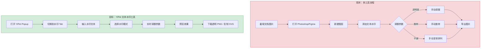
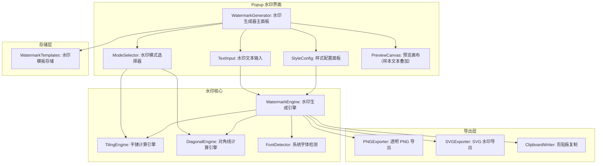
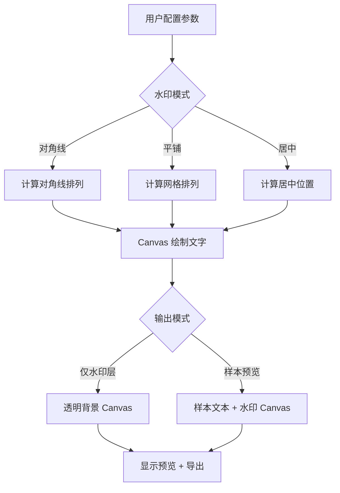

# YP-09-190: 文本水印工具 — 斜向/平铺水印，透明度/字体/颜色/旋转可配，预览样本，SVG 复制，PNG 下载

> 需求编号：YP-09-190 · 优先级：P2 · 人天：0.2d · 状态：需求已编写
> 依赖：无 · 前置需求：无

## 背景

### 问题陈述

用户在分享文档截图、设计稿、内部资料时需要添加文本水印（如"内部资料"、"Confidential"、"草稿"等），以防止信息泄露或标明文档状态。当前流程：(1) 截图后粘贴到 Photoshop/Figma/Canva 中添加水印；(2) 使用在线水印工具上传图片后生成；(3) 使用 Word/PPT 自带的艺术字功能。这些流程对于快速添加水印来说过于繁琐。

1. **无水印工具**：YiPet 无内置水印功能，用户需借助第三方工具
2. **流程复杂**：截图 → 打开编辑器 → 添加文字 → 调整透明度 → 导出，多步操作
3. **水印样式不可控**：在线工具通常固定水印样式，无法自由调整字体/颜色/旋转/透明度
4. **无 SVG 导出**：栅格化后的水印无法在矢量编辑器中无损编辑
5. **无实时预览**：调整参数后无法即时看到效果

**核心矛盾**：用户需要快速、灵活地为文档截图或设计稿添加水印，但当前工具要么启动成本高（Photoshop），要么样式固定（在线工具）。YiPet 作为浏览器扩展，可以利用 Canvas API 和 SVG 在本地生成水印图案，提供即时预览和导出。

### 影响范围

| # | 影响 | 严重程度 | 典型场景 |
|---|------|----------|----------|
| 1 | 无水印工具可用 | 高 | 用户需要为内部文档截图添加水印 |
| 2 | 现有流程繁多 | 高 | 截图 → 编辑器 → 水印 → 导出 |
| 3 | 水印样式自定义受限 | 中 | 需要特定字体/颜色/透明度 |
| 4 | 无 SVG 导出 | 中 | 需要矢量格式的水印图层 |
| 5 | 无水印模板 | 低 | 重复使用相同的水印样式 |

### 挑战

| 挑战 | 说明 |
|------|------|
| 水印平铺算法 | 斜向水印需要在 Canvas 上精确计算文字位置和间距，确保覆盖整个画布 |
| 系统字体可用性 | 不同操作系统和浏览器环境下可用字体不同，需要优雅降级 |
| SVG 导出中文支持 | SVG 中的中文字体在无对应字体的设备上可能显示为方框 |
| 预览文本与真实效果差异 | 预览文本（如"示例文本"）与实际水印文本长度不同时，水印密度会变化 |
| Canvas 大尺寸内存占用 | 生成 A4 尺寸（2480x3508px @ 300dpi）的水印时，Canvas 内存约 35MB |

---

## 一、现状分析

### 1.1 当前水印相关功能

```
现有水印相关功能（无）:
├── YiPet Popup
│   └── 无任何水印工具入口
├── Canvas API
│   └── 已有 Canvas 操作经验（QR 码、条码），可复用部分基础设施
├── SVG 导出
│   └── QR 码和条码已有 SVG 导出管线
└── chrome.storage
    └── 无水印模板或历史记录

缺失:
├── 文本水印生成器                  # ❌ 不存在
├── 水印样式配置系统                # ❌ 不存在
├── 水印模式（平铺/斜向/居中）      # ❌ 不存在
├── 水印预览面板                    # ❌ 不存在
├── SVG 水印导出                    # ❌ 不存在
├── 透明 PNG 水印下载               # ❌ 不存在
└── 水印模板保存                    # ❌ 不存在
```

### 1.2 用户水印流程（现状 vs 目标）



### 1.3 根因矩阵

| 症状 | 根因 | 触发条件 | 频率 |
|------|------|----------|------|
| 无水印功能 | 未实现水印工具模块 | 用户需要添加水印 | 中 |
| 流程复杂 | 需多个工具完成水印添加 | 每次添加水印 | 中 |
| 样式不可控 | 在线工具功能受限 | 需要特定水印样式 | 中 |
| 无 SVG 格式 | 实现在线工具仅输出栅格图 | 需要矢量编辑 | 低 |
| 重复配置低效 | 无水印模板保存 | 每次相同样式重新输入 | 低 |

---

## 二、设计决策

### 决策 1：水印生成方式 — Canvas 2D vs SVG DOM vs CSS

| 选项 | 灵活性 | 导出能力 | 性能 | 实现复杂度 |
|------|--------|----------|------|-----------|
| Canvas 2D | 高（像素级控制） | PNG（天然）+ SVG（需转换） | 高 | 中 |
| SVG DOM | 中 | SVG（天然）+ PNG（需转换） | 中（大量元素时慢） | 低 |
| CSS 伪元素 | 低（仅文字叠加） | 无直接导出 | 高 | 极低 |

**选择：Canvas 2D 主渲染 + SVG 导出。** Canvas 2D 提供像素级控制（精确的文字位置、透明度、旋转），适合生成高质量的 PNG 水印。SVG 导出通过生成对应的 SVG 标记实现（文本元素 + transform 旋转），两套输出管线都通过相同参数驱动，保证一致性。

### 决策 2：水印模式 — 仅对角线 vs 仅平铺 vs 多种模式

| 选项 | 适用场景 | 实现复杂度 | 用户需求覆盖 |
|------|----------|-----------|-------------|
| 仅对角线（单条 45 度斜线） | 文档水印 | 低 | 50% |
| 仅平铺（网格排列） | 背景水印 | 低 | 60% |
| 对角线 + 平铺 + 居中 + 自定义位置 | 全覆盖 | 中 | 95% |

**选择：对角线 + 平铺 + 居中。** 对角线水印是文档防泄露的最常用模式（单条或多条 45 度斜线排列）。平铺水印适合全图覆盖场景（如设计稿版权保护）。居中水印适合 Logo/品牌标识场景。自定义位置（如四角、底部）实现成本低但使用频率不高，暂不实现。

### 决策 3：水印输出格式策略

| 选项 | 背景处理 | 适用场景 |
|------|----------|----------|
| 仅水印图层（透明背景 PNG） | 透明背景，仅含文字 | 用户叠加到现有图片上 |
| 水印 + 样本背景 | 含灰色文本作为背景预览 | 仅预览效果，不用于生产 |
| 两者都提供 | — | 全覆盖 |

**选择：两者都提供。** 默认生成透明背景的纯水印 PNG（方便用户叠加到任意图片），同时提供"预览样本"模式（在灰色样本文本上叠加水印，预览真实效果）。两个模式共享同一套生成逻辑，仅背景处理不同。

### 设计决策记录

| 决策 | 选项 A | 选项 B | 选项 C | 选择 | 理由 |
|------|--------|--------|--------|------|------|
| 生成方式 | Canvas 2D | SVG DOM | CSS | **Canvas + SVG** | 灵活 + 双格式导出 |
| 水印模式 | 仅对角线 | 仅平铺 | 多种 | **对角线 + 平铺 + 居中** | 覆盖 95% 场景 |
| 输出格式 | 仅水印图层 | 水印+样本 | 两者 | **两者** | 生产 + 预览兼顾 |
| 字体处理 | 仅系统字体 | 仅 Web 字体 | 混合 | **系统字体优先** | 无需网络依赖 |

---

## 三、目标架构

### 3.1 水印系统架构



### 3.2 水印生成流程



### 3.3 性能指标

| 指标 | 目标值 | 说明 |
|------|--------|------|
| 水印生成（800x600） | < 20ms | Canvas 平铺/对角线绘制 |
| 水印生成（A4 300DPI） | < 200ms | 2480x3508px Canvas |
| 参数调整实时预览 | < 50ms（防抖 200ms） | 拖动滑块后 200ms 内刷新 |
| SVG 导出 | < 10ms | 字符串构建 |
| PNG 导出 | < 30ms（800x600） | Canvas.toBlob |

---

## 四、具体改动

### 4.1 水印类型定义

```typescript
// src/watermark/types.ts (新增)

export type WatermarkMode = 'diagonal' | 'tiled' | 'centered';

export type WatermarkOutput = 'transparent' | 'preview';

export interface WatermarkConfig {
  text: string;
  mode: WatermarkMode;

  // 文字样式
  fontFamily: string;
  fontSize: number;        // px
  fontWeight: number;      // 100-900
  color: string;           // hex 或 rgba
  opacity: number;         // 0-1

  // 布局参数
  rotation: number;         // 度数，-180 到 180
  density: number;          // 平铺密度 1-10

  // 对角线模式参数
  diagonalCount: number;    // 对角线条数

  // Canvas 尺寸
  canvasWidth: number;      // px
  canvasHeight: number;     // px
}

export interface WatermarkTemplate {
  id: string;
  name: string;
  config: WatermarkConfig;
  createdAt: number;
}

export interface FontOption {
  family: string;
  label: string;
  category: 'sans-serif' | 'serif' | 'monospace' | 'handwriting' | 'display';
  available: boolean;
}

export const DEFAULT_WATERMARK_CONFIG: WatermarkConfig = {
  text: '内部资料',
  mode: 'diagonal',
  fontFamily: 'sans-serif',
  fontSize: 48,
  fontWeight: 400,
  color: '#000000',
  opacity: 0.15,
  rotation: -45,
  density: 5,
  diagonalCount: 5,
  canvasWidth: 800,
  canvasHeight: 600,
};

export const PRESET_FONTS: FontOption[] = [
  { family: 'sans-serif', label: '无衬线 (Sans-serif)', category: 'sans-serif', available: true },
  { family: 'serif', label: '衬线 (Serif)', category: 'serif', available: true },
  { family: 'monospace', label: '等宽 (Monospace)', category: 'monospace', available: true },
  { family: 'Microsoft YaHei', label: '微软雅黑', category: 'sans-serif', available: true },
  { family: 'SimSun', label: '宋體', category: 'serif', available: true },
  { family: 'PingFang SC', label: '苹方', category: 'sans-serif', available: true },
  { family: 'Arial', label: 'Arial', category: 'sans-serif', available: true },
  { family: 'Times New Roman', label: 'Times New Roman', category: 'serif', available: true },
  { family: 'Courier New', label: 'Courier New', category: 'monospace', available: true },
];
```

### 4.2 水印生成引擎

```typescript
// src/watermark/WatermarkEngine.ts (新增)

import type { WatermarkConfig, WatermarkOutput } from './types';

export class WatermarkEngine {
  /** 生成水印 Canvas */
  generate(config: WatermarkConfig, output: WatermarkOutput = 'transparent'): HTMLCanvasElement {
    const canvas = document.createElement('canvas');
    canvas.width = config.canvasWidth;
    canvas.height = config.canvasHeight;
    const ctx = canvas.getContext('2d')!;

    // 背景处理
    if (output === 'preview') {
      this.drawPreviewBackground(ctx, config.canvasWidth, config.canvasHeight);
    }
    // 透明模式不需要绘制背景

    // 设置文字样式
    ctx.font = `${config.fontWeight} ${config.fontSize}px ${config.fontFamily}`;
    ctx.fillStyle = this.applyOpacity(config.color, config.opacity);
    ctx.textAlign = 'center';
    ctx.textBaseline = 'middle';

    // 根据模式绘制水印
    switch (config.mode) {
      case 'diagonal':
        this.drawDiagonal(ctx, config);
        break;
      case 'tiled':
        this.drawTiled(ctx, config);
        break;
      case 'centered':
        this.drawCentered(ctx, config);
        break;
    }

    return canvas;
  }

  /** 对角线水印 */
  private drawDiagonal(ctx: CanvasRenderingContext2D, config: WatermarkConfig): void {
    const { canvasWidth: w, canvasHeight: h, diagonalCount } = config;
    ctx.save();

    // 计算文字度量
    const metrics = ctx.measureText(config.text);
    const textWidth = metrics.width;
    const textHeight = config.fontSize;

    // 对角线等距排列
    const spacing = Math.sqrt(w * w + h * h) / diagonalCount;
    const angleRad = (config.rotation * Math.PI) / 180;

    for (let i = 0; i < diagonalCount; i++) {
      // 计算对角线起点（从左上区域偏移到右下区域）
      const offset = i * spacing - Math.sqrt(w * w + h * h) / 2;
      const startX = offset * Math.cos(angleRad + Math.PI / 4) + w / 2;
      const startY = offset * Math.sin(angleRad + Math.PI / 4) + h / 2;

      // 沿对角线绘制多个水印
      const diagLength = Math.sqrt(w * w + h * h) * 1.5;
      const textSpacing = textWidth * 2.5;
      const steps = Math.floor(diagLength / textSpacing);

      for (let j = 0; j < steps; j++) {
        const t = j * textSpacing;
        const x = startX + t * Math.cos(angleRad);
        const y = startY + t * Math.sin(angleRad);

        // 跳过画布外的点
        if (x < -textWidth || x > w + textWidth || y < -textHeight || y > h + textHeight) continue;

        ctx.save();
        ctx.translate(x, y);
        ctx.rotate(angleRad);
        ctx.fillText(config.text, 0, 0);
        ctx.restore();
      }
    }

    ctx.restore();
  }

  /** 平铺水印 */
  private drawTiled(ctx: CanvasRenderingContext2D, config: WatermarkConfig): void {
    const { canvasWidth: w, canvasHeight: h } = config;
    ctx.save();

    const metrics = ctx.measureText(config.text);
    const textWidth = metrics.width;
    const textHeight = config.fontSize;

    // 密度 → 间距映射
    const baseSpacing = Math.max(textWidth, textHeight) * 2;
    const spacing = baseSpacing / (config.density / 5);
    const angleRad = (config.rotation * Math.PI) / 180;

    // 计算旋转后的包围盒
    const absCos = Math.abs(Math.cos(angleRad));
    const absSin = Math.abs(Math.sin(angleRad));
    const bboxW = textWidth * absCos + textHeight * absSin;
    const bboxH = textWidth * absSin + textHeight * absCos;

    const cols = Math.ceil(w / spacing) + 2;
    const rows = Math.ceil(h / spacing) + 2;

    for (let row = -1; row < rows; row++) {
      for (let col = -1; col < cols; col++) {
        const cx = col * spacing + (row % 2 === 0 ? 0 : spacing / 2);
        const cy = row * spacing;

        if (cx < -bboxW || cx > w + bboxW || cy < -bboxH || cy > h + bboxH) continue;

        ctx.save();
        ctx.translate(cx, cy);
        ctx.rotate(angleRad);
        ctx.fillText(config.text, 0, 0);
        ctx.restore();
      }
    }

    ctx.restore();
  }

  /** 居中水印 */
  private drawCentered(ctx: CanvasRenderingContext2D, config: WatermarkConfig): void {
    const { canvasWidth: w, canvasHeight: h } = config;
    ctx.save();

    ctx.translate(w / 2, h / 2);
    ctx.rotate((config.rotation * Math.PI) / 180);
    ctx.fillText(config.text, 0, 0);

    ctx.restore();
  }

  /** 应用透明度到颜色 */
  private applyOpacity(hexColor: string, opacity: number): string {
    // 支持 hex 和 rgb/rgba 颜色
    if (hexColor.startsWith('#')) {
      const r = parseInt(hexColor.slice(1, 3), 16);
      const g = parseInt(hexColor.slice(3, 5), 16);
      const b = parseInt(hexColor.slice(5, 7), 16);
      return `rgba(${r}, ${g}, ${b}, ${opacity})`;
    }
    return hexColor;  // 已经是 rgba 格式
  }

  /** 绘制预览背景（模拟文档文本） */
  private drawPreviewBackground(ctx: CanvasRenderingContext2D, w: number, h: number): void {
    ctx.fillStyle = '#f8f9fa';
    ctx.fillRect(0, 0, w, h);

    ctx.font = '14px sans-serif';
    ctx.fillStyle = '#6c757d';
    ctx.textAlign = 'left';
    ctx.textBaseline = 'top';

    const sampleTexts = [
      '这是示例文档内容，用于展示水印效果。',
      '水印工具支持多种模式：对角线、平铺、居中。',
      '您可以在右侧面板调整水印参数。',
      '透明度和旋转角度均可自由配置。',
      '生成的 SVG 水印可直接用于设计工具。',
      'PNG 格式带有透明背景，可叠加到任意图片。',
      '',
      '=== 文档标题 ===',
      '',
      '第一节：概述',
      '本文档描述了文本水印工具的使用方法和配置选项。',
      '',
      '第二节：水印模式',
      '对角线水印：沿 45 度角排列，常见于内部文档。',
      '平铺水印：网格状重复排列，适合大面积覆盖。',
      '居中水印：单条水印居中显示，适合品牌标识。',
    ];

    let y = 20;
    for (const text of sampleTexts) {
      ctx.fillText(text, 40, y);
      y += 22;
    }
  }
}
```

### 4.3 SVG 水印导出器

```typescript
// src/watermark/SVGExporter.ts (新增)

import type { WatermarkConfig } from './types';

export class SVGExporter {
  /** 生成水印 SVG 字符串 */
  generate(config: WatermarkConfig): string {
    const { canvasWidth: w, canvasHeight: h } = config;
    const opacityStr = config.opacity.toString();
    const color = this.hexToRGBA(config.color, config.opacity);
    const angleRad = (config.rotation * Math.PI) / 180;

    let elements = '';

    switch (config.mode) {
      case 'diagonal': {
        const diagLength = Math.sqrt(w * w + h * h) * 1.5;
        const metrics = this.estimateTextWidth(config.text, config.fontSize);
        const textSpacing = metrics * 2.5;
        const spacing = Math.sqrt(w * w + h * h) / config.diagonalCount;
        const steps = Math.floor(diagLength / textSpacing);

        for (let i = 0; i < config.diagonalCount; i++) {
          const offset = i * spacing - Math.sqrt(w * w + h * h) / 2;
          const startX = offset * Math.cos(angleRad + Math.PI / 4) + w / 2;
          const startY = offset * Math.sin(angleRad + Math.PI / 4) + h / 2;

          for (let j = 0; j < steps; j++) {
            const x = startX + j * textSpacing * Math.cos(angleRad);
            const y = startY + j * textSpacing * Math.sin(angleRad);
            elements += `<text x="${x.toFixed(1)}" y="${y.toFixed(1)}"
  transform="rotate(${config.rotation}, ${x.toFixed(1)}, ${y.toFixed(1)})"
  font-family="${config.fontFamily}" font-size="${config.fontSize}"
  font-weight="${config.fontWeight}" fill="${color}"
  text-anchor="middle" dominant-baseline="central">${this.escapeXml(config.text)}</text>\n`;
          }
        }
        break;
      }

      case 'tiled': {
        const baseSpacing = Math.max(
          this.estimateTextWidth(config.text, config.fontSize),
          config.fontSize,
        ) * 2;
        const spacing = baseSpacing / (config.density / 5);
        const cols = Math.ceil(w / spacing) + 2;
        const rows = Math.ceil(h / spacing) + 2;

        for (let row = -1; row < rows; row++) {
          for (let col = -1; col < cols; col++) {
            const cx = col * spacing + (row % 2 === 0 ? 0 : spacing / 2);
            const cy = row * spacing;
            elements += `<text x="${cx.toFixed(1)}" y="${cy.toFixed(1)}"
  transform="rotate(${config.rotation}, ${cx.toFixed(1)}, ${cy.toFixed(1)})"
  font-family="${config.fontFamily}" font-size="${config.fontSize}"
  font-weight="${config.fontWeight}" fill="${color}"
  text-anchor="middle" dominant-baseline="central">${this.escapeXml(config.text)}</text>\n`;
          }
        }
        break;
      }

      case 'centered': {
        elements += `<text x="${(w / 2).toFixed(1)}" y="${(h / 2).toFixed(1)}"
  transform="rotate(${config.rotation}, ${(w / 2).toFixed(1)}, ${(h / 2).toFixed(1)})"
  font-family="${config.fontFamily}" font-size="${config.fontSize}"
  font-weight="${config.fontWeight}" fill="${color}"
  text-anchor="middle" dominant-baseline="central">${this.escapeXml(config.text)}</text>\n`;
        break;
      }
    }

    return `<?xml version="1.0" encoding="UTF-8"?>
<svg xmlns="http://www.w3.org/2000/svg" width="${w}" height="${h}" viewBox="0 0 ${w} ${h}">
${elements}</svg>`;
  }

  /** 复制 SVG 到剪贴板 */
  async copyToClipboard(config: WatermarkConfig): Promise<void> {
    const svg = this.generate(config);
    await navigator.clipboard.writeText(svg);
  }

  /** 下载 SVG 文件 */
  download(config: WatermarkConfig, filename: string): void {
    const svg = this.generate(config);
    const blob = new Blob([svg], { type: 'image/svg+xml;charset=utf-8' });
    const url = URL.createObjectURL(blob);
    const a = document.createElement('a');
    a.href = url;
    a.download = `${filename}.svg`;
    a.click();
    URL.revokeObjectURL(url);
  }

  /** 估算文本宽度（保守估计） */
  private estimateTextWidth(text: string, fontSize: number): number {
    // 中文字符约等于 fontSize，英文约 0.6 * fontSize
    let width = 0;
    for (const char of text) {
      width += /[\u4e00-\u9fff\u3000-\u303f\uff00-\uffef]/.test(char)
        ? fontSize : fontSize * 0.6;
    }
    return width;
  }

  private hexToRGBA(hex: string, opacity: number): string {
    const r = parseInt(hex.slice(1, 3), 16);
    const g = parseInt(hex.slice(3, 5), 16);
    const b = parseInt(hex.slice(5, 7), 16);
    return `rgba(${r}, ${g}, ${b}, ${opacity})`;
  }

  private escapeXml(text: string): string {
    return text
      .replace(/&/g, '&amp;')
      .replace(/</g, '&lt;')
      .replace(/>/g, '&gt;')
      .replace(/"/g, '&quot;');
  }
}
```

### 4.4 文件变更清单

| 文件 | 操作 | 说明 |
|------|------|------|
| `src/watermark/types.ts` | 新增 | 水印类型定义和预设字体 |
| `src/watermark/WatermarkEngine.ts` | 新增 | 水印生成引擎（Canvas 渲染） |
| `src/watermark/SVGExporter.ts` | 新增 | SVG 水印导出 |
| `src/watermark/WatermarkTemplates.ts` | 新增 | 水印模板存储 |
| `src/components/WatermarkGenerator.vue` | 新增 | 水印生成器主 UI |
| `src/components/WatermarkPreview.vue` | 新增 | 水印实时预览 |
| `src/components/StyleConfig.vue` | 新增 | 样式配置面板 |
| `src/popup/App.vue` | 修改 | 集成水印工具 Tab |

---

## 五、实施步骤

| 步骤 | 操作 | 路径 | 验证 | 人天 |
|------|------|------|------|------|
| 1 | 定义类型和默认配置 | `src/watermark/types.ts` | 类型检查通过 | 0.01 |
| 2 | 实现水印生成引擎 | `src/watermark/WatermarkEngine.ts` | 三种模式 Canvas 渲染正确 | 0.04 |
| 3 | 实现 SVG 导出器 | `src/watermark/SVGExporter.ts` | SVG 在浏览器/矢量工具中正确渲染 | 0.03 |
| 4 | 实现预览背景绘制 | `src/watermark/WatermarkEngine.ts` | 样本文本 + 水印叠加效果 | 0.01 |
| 5 | 实现水印模板存储 | `src/watermark/WatermarkTemplates.ts` | 保存和读取模板 | 0.01 |
| 6 | 实现水印预览组件 | `src/components/WatermarkPreview.vue` | 参数变更实时反映 | 0.02 |
| 7 | 实现样式配置面板 | `src/components/StyleConfig.vue` | 所有参数可配置 | 0.03 |
| 8 | 实现水印生成器主 UI | `src/components/WatermarkGenerator.vue` | 完整的水印配置 + 导出流程 | 0.03 |
| 9 | 集成到 Popup | `src/popup/App.vue` | 水印 Tab 正常工作 | 0.02 |

**总人天：0.2d**

---

## 六、测试规格

### 场景 1：对角线水印生成

**GIVEN** 用户配置水印文本 "CONFIDENTIAL"，模式=对角线，旋转=-45，对角线数=5
**WHEN** WatermarkEngine.generate 被调用
**THEN** Canvas 上应显示 5 条 -45 度对角线
**AND** 每条对角线上有重复的 "CONFIDENTIAL" 文本
**AND** 水印覆盖整个 800x600 画布
**AND** 透明度为默认 0.15

### 场景 2：平铺水印密度调整

**GIVEN** 用户配置水印文本 "DRAFT"，模式=平铺，密度=8
**WHEN** 密度滑块从 1 拖动到 10
**THEN** 水印文本的间距应随密度增加而减小
**AND** 密度=1 时水印稀疏（约 5-8 个文本在 800x600 画布上）
**AND** 密度=10 时水印密集（约 50+ 个文本）
**AND** 奇数行应有 50% 偏移（交错排列）

### 场景 3：透明 PNG 下载

**GIVEN** 水印已生成，模式=居中，文本="LOGO"，透明度=0.3
**WHEN** 用户点击 "下载透明 PNG"
**THEN** 下载的 PNG 文件背景应为透明（alpha 通道）
**AND** PNG 中仅包含文字 "LOGO"（居中，30% 透明度）
**AND** PNG 尺寸与配置的画布尺寸一致（默认 800x600）

### 场景 4：SVG 水印复制

**GIVEN** 水印已生成，模式=平铺
**WHEN** 用户点击 "复制 SVG"
**THEN** 剪贴板中应包含有效的 SVG 字符串
**AND** SVG 包含正确 xmlns 命名空间
**AND** SVG 中的 text 元素包含正确的字体、颜色和旋转属性
**AND** 粘贴到 Figma/Illustrator 中可正确渲染

### 场景 5：颜色和透明度实时预览

**GIVEN** 水印文本为 "内部资料"
**WHEN** 用户更改颜色为 #FF0000（红色），透明度为 0.5
**THEN** 预览画布中的水印文字应立即变为红色且 50% 透明度
**AND** 参数变更后 200ms 内完成重新渲染
**AND** 其他参数（模式、旋转、密度）保持不变

### 场景 6：水印模板保存和加载

**GIVEN** 用户配置了自定义水印（文本="SECRET"，对角线，旋转=30，颜色=红）
**WHEN** 用户保存为模板 "红色秘密水印"
**THEN** 模板列表应显示 "红色秘密水印"
**WHEN** 用户下次点击该模板
**THEN** 所有参数恢复为保存时的状态

---

## 七、风险与缓解

| 风险 | 概率 | 影响 | 缓解措施 |
|------|------|------|----------|
| Canvas 在大尺寸画布上内存占用高 | 中 | 中 | 默认 800x600，大尺寸时提示用户；使用 OffscreenCanvas 优化 |
| SVG 中文在特定系统上显示异常 | 中 | 中 | 使用通用字体族（sans-serif/serif）兜底 |
| 对角线算法在极端参数下（旋转=0，多对角线）渲染重叠 | 低 | 低 | 旋转=0 时自动调整间距避免完全重叠 |
| 字体加载失败导致水印使用 fallback 字体 | 低 | 低 | 默认使用 sans-serif 作为最通用 fallback |
| 透明度接近 0 时水印难以看见但仍有文件输出 | 低 | 低 | 透明度 < 0.05 时给出提示 |

---

## 八、回滚策略

| 场景 | 回滚操作 | 影响 |
|------|------|------|
| 水印 Tab 导致 Popup 异常 | 移除水印 Tab | 失去水印功能 |
| Canvas 大画布渲染崩溃 | 限制画布最大 1200x900 | 大画布需求需分批 |
| SVG 导出含大量文字导致文件过大 | 增加平铺密度限制 | 导出文件大小可控 |

---

## 九、设计决策记录

### D-01：为什么使用 Canvas 2D 而非纯 SVG DOM 作为主渲染？

Canvas 2D 提供 `measureText` API 可以精确测量文本宽度（用于计算平铺间距），而 SVG DOM 需要渲染后才能获取 `getBBox`（异步且可能有布局闪烁）。Canvas 的 `toBlob` API 天然支持 PNG 导出，而 SVG 的 PNG 转换需要额外的 `foreignObject` → Image → Canvas 步骤。对于 0.2d 的开发时间，Canvas 2D 开发效率更高。

### D-02：为什么对角线水印不使用简单的斜线裁剪算法？

标准的对角线水印算法涉及线的斜率和截距计算，需要在每条对角线上重复绘制文字。简单粗暴的计算方式是：对整个 Canvas 进行旋转 → 绘制 → 旋转回，但这种方法会使 Canvas 边缘出现空白。本方案使用几何计算（点沿方向向量偏移），确保 Canvas 全覆盖且不浪费计算。

### D-03：为什么 SVG 中的文本宽度使用估算而非精确计算？

SVG 在生成时没有被渲染到 DOM 中，无法使用 `getBBox()` 获取精确宽度。Canvas 的 `measureText` 可以提供精确宽度，但需要创建 Canvas 上下文（在 SVG 导出器中有额外依赖）。预估算法（中文字符=fontSize，英文=0.6*fontSize）误差在 10% 以内，对于水印间距计算精度足够。

### D-04：为什么水印模板限制 20 个而非更多？

水印模板存储使用 chrome.storage.local（默认配额 10MB），每个模板约 1KB（配置 JSON），20 个模板仅占 20KB。限制 20 个是为了避免存储膨胀和 UI 列表过长影响操作效率。如果用户需要管理更多模板，建议使用下载/导入配置功能。

---

## 十、可观测性

### 指标

| 指标 | 类型 | 说明 |
|------|------|------|
| `yipet.watermark.generate_total` | Counter | 水印生成总次数（按模式分组） |
| `yipet.watermark.download_total` | Counter | 水印下载次数（按格式 PNG/SVG 分组） |
| `yipet.watermark.copy_svg_total` | Counter | SVG 复制到剪贴板次数 |
| `yipet.watermark.template_saved_total` | Counter | 模板保存次数 |
| `yipet.watermark.mode_distribution` | Counter | 各模式使用分布 |
| `yipet.watermark.density_avg` | Gauge | 平均密度设置 |

### 告警

| 告警 | 条件 | 级别 |
|------|------|------|
| 水印生成平均耗时异常 | 平均 p99 > 500ms | WARNING |
| 水印工具日活使用率极低 | < 0.5% 日活用户 | INFO |

---

## 十一、代码审查检查清单

- [ ] 三种水印模式（对角线/平铺/居中）均正确实现
- [ ] 透明度通过 Canvas globalAlpha 或 rgba 颜色实现
- [ ] 对角线水印覆盖整个画布，无边角遗漏
- [ ] 平铺交错排列（奇数行偏移 50%）
- [ ] SVG 导出使用 text-anchor="middle" 保证对齐一致
- [ ] Canvas → toBlob 使用 image/png MIME 类型
- [ ] 透明 PNG 无需填充背景色
- [ ] 预览模式下的样本文本使用灰色背景和浅色文字
- [ ] 参数变更防抖 200ms 避免过度渲染
- [ ] 模板列表限制 20 个，超出提示用户

---

## 回归问题预测

| # | 预测问题 | 原因 | 验证方法 |
|---|---------|------|---------|
| 1 | 对角线水印在非正方形画布（如 1200x400）上覆盖不均匀 | 对角线起点计算依赖画布宽高，极端宽高比可能导致水印集中在某些区域 | 使用 1200x400 画布测试对角线水印，视觉检查覆盖均匀性 |
| 2 | 透明度极低（< 0.05）时 Canvas 水印文字锯齿明显 | Canvas 在低透明度下 anti-aliasing 效果变差，文字边缘出现像素化 | 透明度 0.03、0.05、0.1 分别测试，确定可读性阈值 |
| 3 | SVG 导出文件中文字符在系统字体缺失时显示为方框 | SVG 中指定的字体（如 Microsoft YaHei）在 macOS 上不可用，渲染为系统 fallback | 在 macOS/Linux/Windows 上分别打开 SVG 文件验证 |
| 4 | Canvas 在 Retina 屏幕上以 1x 分辨率渲染，水印文字模糊 | Canvas 默认以 CSS 像素渲染，需要手动设置 devicePixelRatio 缩放 | 在 Retina 屏幕上检查水印预览清晰度，验证 canvas.width/height = CSS 尺寸 * devicePixelRatio |
| 5 | 水印模板中的 fontFamily 在跨设备恢复时不可用 | 模板中保存了系统特定字体（如 PingFang SC），在 Windows 设备上恢复时字体不可用 | 模板加载时检查字体可用性，不可用时回退到 sans-serif |
| 6 | 平铺水印在大密度（10）+ 长文本的组合下，相邻文字重叠 | 平铺间距计算仅基于字体大小，未考虑实际文本长度，长文本在大密度下会溢出间距 | 使用长文本（如 "CONFIDENTIAL - INTERNAL USE ONLY"）+ 密度 10 测试，检查文本重叠 |

---

## 性能分析

### 各阶段耗时

| 阶段 | 预估耗时 | 说明 |
|------|----------|------|
| 对角线水印计算 | < 5ms | 几何计算 |
| 平铺水印计算 | < 10ms | 网格迭代 |
| Canvas 文本绘制（800x600） | < 20ms | fillText 调用 |
| Canvas 文本绘制（A4 300DPI） | < 200ms | 2480x3508 fillText 调用 |
| SVG 字符串生成 | < 10ms | 字符串拼接 |
| Canvas.toBlob（800x600） | < 20ms | 编码 |
| 剪贴板写入（SVG 文本） | < 5ms | 文本复制 |

### 体积预估

| 文件 | 大小 | 说明 |
|------|------|------|
| `src/watermark/types.ts` | ~2KB | 类型 + 预设数据 |
| `src/watermark/WatermarkEngine.ts` | ~4KB | Canvas 渲染引擎 |
| `src/watermark/SVGExporter.ts` | ~3KB | SVG 导出 |
| `src/watermark/WatermarkTemplates.ts` | ~1KB | 模板存储 |
| UI 组件（3 个 Vue 组件） | ~7KB | 生成器/预览/配置面板 |

**无第三方依赖，总体积约 17KB。**

---

*需求来源: `projects/yipet/requirements/2026-09/190-需求-文本水印工具.md`*