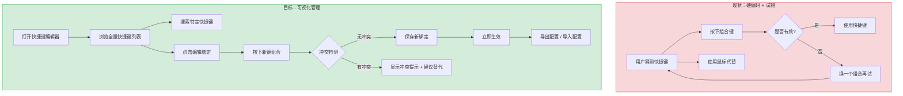
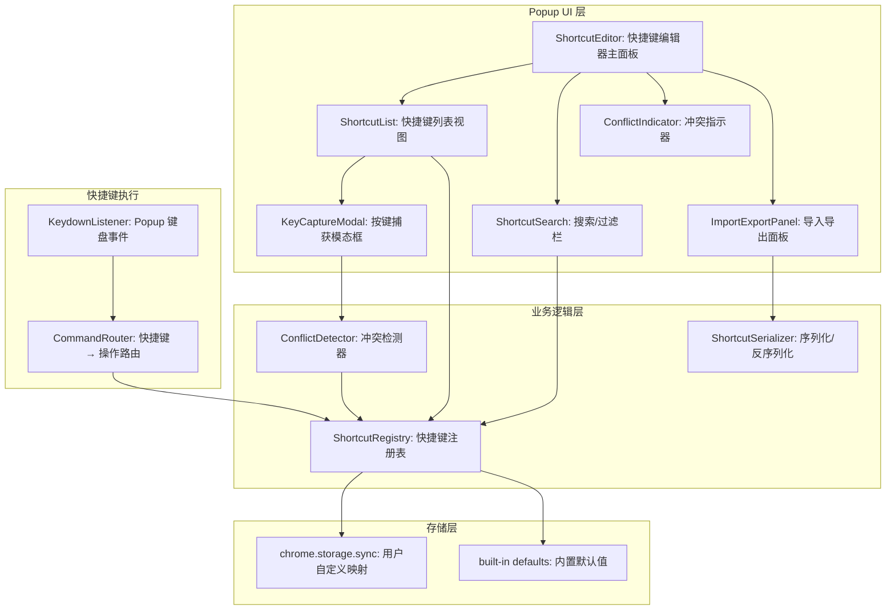

# YP-09-191: 快捷键绑定编辑器 — 可视化管理快捷键，搜索/冲突检测/导入导出/重置默认/按场景分组

> 需求编号：YP-09-191 · 优先级：P2 · 人天：0.2d · 状态：需求已编写
> 依赖：YP-09-29（快捷键系统）· 前置需求：无

## 背景

### 问题陈述

YiPet 已通过 YP-09-29 实现了快捷键系统（Chrome Commands API + Content Script 热键），用户在 Popup 中的操作可以使用键盘快捷键触发。然而当前快捷键的管理方式是硬编码的——用户无法查看已绑定的快捷键列表，无法自定义修改快捷键映射，也无法导入/导出快捷键配置在多台设备间同步。

1. **快捷键不透明**：用户不知道有哪些快捷键可用，需要在 Popup 中逐个尝试或查阅文档
2. **无法自定义**：快捷方式不适合所有用户的键盘布局和使用习惯
3. **冲突不可见**：多个操作绑定到同一快捷键时无冲突提示
4. **无法导出/导入**：换设备时需要重新配置
5. **无搜索功能**：在 50+ 快捷键中查找特定操作困难

**核心矛盾**：YiPet 实现了快捷键功能但没有提供管理界面，用户无法发现、自定义和管理快捷键。需要一个可视化的快捷键绑定编辑器，降低快捷键的学习成本并提供完整的配置管理能力。

### 影响范围

| # | 影响 | 严重程度 | 典型场景 |
|---|------|----------|----------|
| 1 | 用户不知道快捷键 | 高 | 用户用鼠标点击代替快捷操作 |
| 2 | 快捷键不适应键盘布局 | 中 | AZERTY/Dvorak 键盘用户 |
| 3 | 冲突快捷键不提示 | 中 | 两个操作绑定 Ctrl+B 无警告 |
| 4 | 换设备需重新配置 | 中 | 公司/home 电脑快捷键不同步 |
| 5 | 大量快捷键难管理 | 低 | 50+ 快捷键中查找特定绑定 |

### 挑战

| 挑战 | 说明 |
|------|------|
| Chrome Commands API 限制 | Chrome 扩展的键盘快捷键受 `commands` manifest 限制，仅支持建议的键组合 |
| 快捷键冲突检测算法 | 需要检测逻辑冲突（同一键组合绑定多个操作）和物理冲突（系统快捷键） |
| 导入导出兼容性 | 跨版本导入时，如果快捷键 schema 变化，需要迁移逻辑 |
| 键盘事件捕获准确性 | 在可视化编辑器中"按下按键记录"模式需要准确捕获修饰键（Ctrl/Alt/Shift/Meta） |
| 场景分组合理性 | 不同场景（全局/聊天/工具/阅读）的快捷键如何组织才能让用户直观理解 |

---

## 一、现状分析

### 1.1 当前快捷键系统

```
现有快捷键系统（YP-09-29）:
├── Chrome Commands API
│   ├── _execute_action: Ctrl+Shift+Y     # 打开扩展
│   └── 4 个可配置命令          # manifest 中声明
├── Content Script 热键
│   ├── Ctrl+Shift+K → 打开聊天
│   ├── Ctrl+Shift+L → 截图
│   └── 其他热键 (5 个)
└── Popup 内快捷键
    ├── Ctrl+N → 新会话
    ├── Ctrl+Enter → 发送消息
    ├── Escape → 关闭弹窗
    └── 其他 (8 个)

当前状态:
├── 快捷键列表: 硬编码在 src/config/shortcuts.ts
├── 用户可见: ❌ 无快捷键帮助面板
├── 自定义: ❌ 不支持
├── 冲突检测: ❌ 不存在
├── 导入/导出: ❌ 不存在
└── 搜索: ❌ 不支持
```

### 1.2 用户快捷键流程（现状 vs 目标）



### 1.3 根因矩阵

| 症状 | 根因 | 触发条件 | 频率 |
|------|------|----------|------|
| 用户不知道可用快捷键 | 无快捷键可视化列表 | 用户想用快捷键但不知道有哪些 | 高 |
| 快捷键不适合习惯 | 硬编码不可修改 | 用户习惯不同键位布局 | 中 |
| 冲突无感知 | 无冲突检测机制 | 多个操作绑定同一组合键 | 中 |
| 换设备丢失配置 | 无导入导出功能 | 用户更换电脑/重装扩展 | 低 |
| 查找快捷键不便 | 无搜索/过滤功能 | 快捷键数量 > 20 | 低 |

---

## 二、设计决策

### 决策 1：快捷键存储策略 — chrome.storage vs chrome.commands vs 文件导入

| 选项 | 跨设备同步 | 实时生效 | 受 Chrome 限制 | 实现复杂度 |
|------|-----------|----------|---------------|-----------|
| chrome.storage.local | 否（local）/ 是（sync） | 是 | 否 | 低 |
| chrome.commands.update | 是（自动） | 是 | 是（仅 4 个建议的绑定额外 slots） | 中 |
| JSON 文件导入导出 | 手动 | 是 | 否 | 低 |

**选择：混合策略。** chrome.storage.sync 存储用户自定义的快捷键映射（支持跨设备同步），Popup 内快捷键通过 keydown 事件监听优先级实现自定义绑定。Chrome Commands API（manifest 中的全局快捷键）由于 API 限制（仅 4 个 slot）和无法完全自定义修饰键，仅用于建议的全局快捷键。导入导出功能用于备份和迁移。

### 决策 2：快捷键编辑模式 — 按键捕获 vs 下拉选择 vs 文本输入

| 选项 | 用户友好度 | 实现复杂度 | 准确率 | 适用键盘 |
|------|-----------|-----------|--------|----------|
| 按键捕获（按下记录） | 高（直观） | 中 | 高 | 所有 |
| 下拉选择（Ctrl/Alt + 键） | 中 | 低 | 高 | 有限（列表长） |
| 文本输入（"Ctrl+Shift+K"） | 低 | 低 | 低（格式错误多） | 所有 |

**选择：按键捕获。** 用户点击编辑按钮后进入"监听模式"，弹出模态框提示"请按下您要绑定的快捷键"，keydown + keyup 事件捕获键组合（包括 Ctrl/Alt/Shift/Meta + 字母/数字/功能键）。显示捕获的键组合描述（如 "Ctrl + Shift + K"），用户确认后保存。捕获过程中过滤无效组合（如仅修饰键无主键）。

### 决策 3：冲突检测策略 — 仅扩展内 vs 扩展内 + 浏览器级 vs 来源感知

| 选项 | 覆盖率 | 实现复杂度 | 准确性 |
|------|--------|-----------|--------|
| 仅扩展内 | 低 | 低 | 高（已知的快捷键） |
| 扩展内 + Chrome 已知 | 中 | 中 | 中 |
| 来源感知（浏览器/系统） | 高 | 高（需维护冲突列表） | 中 |

**选择：扩展内 + 已知浏览器冲突列表。** 扩展内快捷键由系统管理，冲突检测 100% 准确。已知浏览器/系统冲突维护一个静态列表（如 Ctrl+T 打开新标签页、Ctrl+W 关闭标签页、Ctrl+Shift+T 恢复标签页等 30+ 常见系统快捷键），提示用户"此组合键已被 ${浏览器/系统} 使用，可能会冲突"。

### 决策 4：快捷键场景分组

| 场景 | 示例快捷键 | 数量 | 说明 |
|------|-----------|------|------|
| 全局 | Ctrl+Shift+Y（打开扩展） | 5 | 所有页面可用的快捷键 |
| 聊天 | Ctrl+N（新会话）、Ctrl+Enter（发送） | 12 | 聊天窗口内快捷键 |
| 工具 | Ctrl+Shift+Q（二维码）、Ctrl+Shift+B（条形码） | 8 | 工具 Tab 内快捷键 |
| 阅读 | Ctrl+Shift+R（阅读模式）、Ctrl+Shift+F（专注） | 5 | 阅读/SEO 类快捷键 |

### 设计决策记录

| 决策 | 选项 A | 选项 B | 选项 C | 选择 | 理由 |
|------|--------|--------|--------|------|------|
| 存储策略 | chrome.storage | chrome.commands | JSON 文件 | **混合** | 全场景覆盖 |
| 编辑模式 | 按键捕获 | 下拉选择 | 文本输入 | **按键捕获** | 直观，准确率高 |
| 冲突检测 | 仅扩展内 | +Chrome 已知 | 来源感知 | **扩展内 + Chrome 已知** | 平衡覆盖率和复杂度 |
| 场景分组 | 无分组 | 2 组 | 4 组 | **4 组** | 清晰的认知模型 |

---

## 三、目标架构

### 3.1 快捷键编辑器架构



### 3.2 快捷键编辑流程

```mermaid
graph TD
    A[用户在列表中点击快捷键] --> B[打开按键捕获模态框]
    B --> C["提示: 请按下您要绑定的快捷键"]
    C --> D[用户按下 Ctrl+Shift+K]
    D --> E[捕获 keydown 事件]
    E --> F[解析修饰键 + 主键]
    F --> G{组合键有效?}
    G -->|无效（仅修饰键）| H[显示提示: "请包含一个字母/数字/功能键"]
    G -->|有效| I{冲突检测}
    I -->|无冲突| J[显示组合键描述: Ctrl+Shift+K]
    I -->|扩展内冲突| K[显示冲突警告: "已被'新建会话'使用"]
    I -->|系统级冲突| L[显示冲突警告: "可能与'打开新标签页'冲突"]
    J --> M[用户确认]
    K --> M
    L --> M
    M --> N[保存到 chrome.storage.sync]
    N --> O[立即生效]
```

### 3.3 性能指标

| 指标 | 目标值 | 说明 |
|------|--------|------|
| 快捷键列表渲染（50 条） | < 30ms | Vue 虚拟列表 |
| 搜索过滤响应 | < 16ms（即时） | computed 属性过滤 |
| 按键捕获响应 | < 50ms | keydown → 显示描述 |
| 冲突检测 | < 5ms | 内存中查询 |
| 导入/导出配置 | < 10ms | JSON 序列化/反序列化 |
| chrome.storage 读写 | < 50ms | 异步操作 |

---

## 四、具体改动

### 4.1 快捷键类型定义

```typescript
// src/shortcuts/types.ts (新增)

export type ShortcutScope = 'global' | 'chat' | 'tool' | 'reading';

export interface ShortcutDefinition {
  id: string;                    // 唯一标识，如 "chat.new_session"
  scope: ShortcutScope;
  label: string;                 // 中文名称，如 "新建会话"
  description: string;           // 描述，如 "在聊天窗口中建立新的对话"
  defaultKeys: KeyCombination;   // 默认按键组合
  customKeys?: KeyCombination;   // 用户自定义按键组合
  category: string;              // 分类，如 "会话管理"
  order: number;                 // 列表排序权重
}

export interface KeyCombination {
  ctrlKey: boolean;
  altKey: boolean;
  shiftKey: boolean;
  metaKey: boolean;
  key: string;                   // 主键，如 "k" "Enter" "F1"
  code: string;                  // 物理键码，如 "KeyK" "Enter" "F1"
  keyCode: number;               // 键码（兼容）
}

export interface ConflictResult {
  hasConflict: boolean;
  conflictType: 'none' | 'internal' | 'system' | 'browser';
  conflictWith?: string;         // 冲突的操作名称或系统快捷键描述
  suggestion?: KeyCombination;  // 建议的替代组合
}

export interface ShortcutExport {
  version: string;
  exportedAt: string;
  shortcuts: Record<string, KeyCombination>;
}

export const SCOPE_LABELS: Record<ShortcutScope, string> = {
  global: '全局',
  chat: '聊天',
  tool: '工具',
  reading: '阅读',
};

export const SCOPE_ICONS: Record<ShortcutScope, string> = {
  global: 'globe',
  chat: 'message-circle',
  tool: 'wrench',
  reading: 'book-open',
};
```

### 4.2 快捷键注册表

```typescript
// src/shortcuts/ShortcutRegistry.ts (新增)

import type { ShortcutDefinition, KeyCombination, ShortcutScope, ConflictResult } from './types';
import { DEFAULT_SHORTCUTS } from './defaults';

export class ShortcutRegistry {
  private definitions: Map<string, ShortcutDefinition> = new Map();
  private loaded = false;

  constructor() {
    // 注册内置默认快捷键
    for (const def of DEFAULT_SHORTCUTS) {
      this.definitions.set(def.id, { ...def });
    }
  }

  /** 从存储加载用户自定义快捷键 */
  async load(): Promise<void> {
    const result = await chrome.storage.sync.get('shortcut_overrides');
    const overrides: Record<string, KeyCombination> = result.shortcut_overrides || {};

    for (const [id, customKeys] of Object.entries(overrides)) {
      const def = this.definitions.get(id);
      if (def) {
        def.customKeys = customKeys;
      }
    }

    this.loaded = true;
  }

  /** 获取当前生效的快捷键 */
  getEffectiveKeys(id: string): KeyCombination | null {
    const def = this.definitions.get(id);
    if (!def) return null;
    return def.customKeys || def.defaultKeys;
  }

  /** 获取所有快捷键定义（用于列表显示） */
  getAll(scope?: ShortcutScope): ShortcutDefinition[] {
    const all = Array.from(this.definitions.values());
    if (scope) return all.filter(d => d.scope === scope);
    return all.sort((a, b) => a.order - b.order);
  }

  /** 搜索快捷键 */
  search(query: string): ShortcutDefinition[] {
    const q = query.toLowerCase();
    return this.getAll().filter(d =>
      d.label.toLowerCase().includes(q) ||
      d.description.toLowerCase().includes(q) ||
      d.id.toLowerCase().includes(q) ||
      this.keysToString(d.customKeys || d.defaultKeys).toLowerCase().includes(q),
    );
  }

  /** 更新快捷键绑定 */
  async updateBinding(id: string, keys: KeyCombination): Promise<void> {
    const def = this.definitions.get(id);
    if (!def) throw new Error(`快捷键 ${id} 不存在`);

    def.customKeys = this.keysEqual(keys, def.defaultKeys) ? undefined : keys;

    // 保存到 chrome.storage.sync
    const overrides: Record<string, KeyCombination> = {};
    for (const [dId, dDef] of this.definitions) {
      if (dDef.customKeys) {
        overrides[dId] = dDef.customKeys;
      }
    }
    await chrome.storage.sync.set({ shortcut_overrides: overrides });
  }

  /** 重置单个快捷键为默认值 */
  async resetBinding(id: string): Promise<void> {
    const def = this.definitions.get(id);
    if (!def) return;
    def.customKeys = undefined;
    await this.syncOverrides();
  }

  /** 重置所有快捷键为默认值 */
  async resetAll(): Promise<void> {
    for (const def of this.definitions.values()) {
      def.customKeys = undefined;
    }
    await chrome.storage.sync.remove('shortcut_overrides');
  }

  /** 导出快捷键配置 */
  export(): string {
    const exportData = {
      version: '1.0',
      exportedAt: new Date().toISOString(),
      shortcuts: {} as Record<string, KeyCombination>,
    };

    for (const [id, def] of this.definitions) {
      exportData.shortcuts[id] = def.customKeys || def.defaultKeys;
    }

    return JSON.stringify(exportData, null, 2);
  }

  /** 导入快捷键配置 */
  async import(json: string): Promise<{ success: boolean; imported: number; errors: string[] }> {
    const errors: string[] = [];
    let imported = 0;

    try {
      const data = JSON.parse(json);

      if (!data.version || !data.shortcuts) {
        return { success: false, imported: 0, errors: ['无效的配置文件格式'] };
      }

      for (const [id, keys] of Object.entries(data.shortcuts)) {
        if (this.definitions.has(id)) {
          await this.updateBinding(id, keys as KeyCombination);
          imported++;
        }
      }

      return { success: true, imported, errors };
    } catch (e: any) {
      return { success: false, imported: 0, errors: [e.message] };
    }
  }

  /** 按键组合 → 字符串 */
  keysToString(keys: KeyCombination): string {
    const parts: string[] = [];
    if (keys.ctrlKey || keys.metaKey) parts.push(navigator.platform.includes('Mac') ? 'Cmd' : 'Ctrl');
    if (keys.altKey) parts.push('Alt');
    if (keys.shiftKey) parts.push('Shift');
    parts.push(keys.key.length === 1 ? keys.key.toUpperCase() : keys.key);
    return parts.join(' + ');
  }

  /** 比较两个 KeyCombination 是否相等 */
  keysEqual(a: KeyCombination, b: KeyCombination): boolean {
    return a.key === b.key && a.ctrlKey === b.ctrlKey &&
      a.altKey === b.altKey && a.shiftKey === b.shiftKey && a.metaKey === b.metaKey;
  }

  private async syncOverrides(): Promise<void> {
    const overrides: Record<string, KeyCombination> = {};
    for (const [id, def] of this.definitions) {
      if (def.customKeys) overrides[id] = def.customKeys;
    }
    await chrome.storage.sync.set({ shortcut_overrides: overrides });
  }
}
```

### 4.3 冲突检测器

```typescript
// src/shortcuts/ConflictDetector.ts (新增)

import type { KeyCombination, ConflictResult } from './types';
import type { ShortcutRegistry } from './ShortcutRegistry';

/** 已知浏览器/系统快捷键（可能与扩展快捷键冲突） */
const KNOWN_SYSTEM_SHORTCUTS: { keys: KeyCombination; description: string }[] = [
  { keys: { ctrlKey: true, altKey: false, shiftKey: false, metaKey: false, key: 't', code: 'KeyT', keyCode: 84 }, description: '打开新标签页' },
  { keys: { ctrlKey: true, altKey: false, shiftKey: false, metaKey: false, key: 'w', code: 'KeyW', keyCode: 87 }, description: '关闭标签页' },
  { keys: { ctrlKey: true, altKey: false, shiftKey: true, metaKey: false, key: 't', code: 'KeyT', keyCode: 84 }, description: '恢复关闭的标签页' },
  { keys: { ctrlKey: true, altKey: false, shiftKey: false, metaKey: false, key: 'n', code: 'KeyN', keyCode: 78 }, description: '打开新窗口' },
  { keys: { ctrlKey: true, altKey: false, shiftKey: false, metaKey: false, key: 'd', code: 'KeyD', keyCode: 68 }, description: '添加书签' },
  { keys: { ctrlKey: true, altKey: false, shiftKey: false, metaKey: false, key: 'h', code: 'KeyH', keyCode: 72 }, description: '打开历史记录' },
  { keys: { ctrlKey: true, altKey: false, shiftKey: false, metaKey: false, key: 'j', code: 'KeyJ', keyCode: 74 }, description: '打开下载页' },
  { keys: { ctrlKey: true, altKey: false, shiftKey: false, metaKey: false, key: 'f', code: 'KeyF', keyCode: 70 }, description: '页面内查找' },
  { keys: { ctrlKey: true, altKey: false, shiftKey: false, metaKey: false, key: 'p', code: 'KeyP', keyCode: 80 }, description: '打印页面' },
  { keys: { ctrlKey: true, altKey: false, shiftKey: false, metaKey: false, key: 's', code: 'KeyS', keyCode: 83 }, description: '保存页面' },
  // macOS
  { keys: { ctrlKey: false, altKey: false, shiftKey: false, metaKey: true, key: 't', code: 'KeyT', keyCode: 84 }, description: '打开新标签页 (macOS)' },
  { keys: { ctrlKey: false, altKey: false, shiftKey: false, metaKey: true, key: 'w', code: 'KeyW', keyCode: 87 }, description: '关闭标签页 (macOS)' },
];

export class ConflictDetector {
  constructor(private registry: ShortcutRegistry) {}

  /** 检测快捷键冲突 */
  detect(newKeys: KeyCombination, excludeId?: string): ConflictResult {
    // 1. 扩展内冲突检测
    const allDefs = this.registry.getAll();
    for (const def of allDefs) {
      if (excludeId && def.id === excludeId) continue;
      const currentKeys = def.customKeys || def.defaultKeys;
      if (this.registry.keysEqual(currentKeys, newKeys)) {
        return {
          hasConflict: true,
          conflictType: 'internal',
          conflictWith: `"${def.label}" (${def.scope})`,
        };
      }
    }

    // 2. 系统/浏览器冲突检测
    for (const sys of KNOWN_SYSTEM_SHORTCUTS) {
      if (this.registry.keysEqual(sys.keys, newKeys)) {
        return {
          hasConflict: true,
          conflictType: navigator.platform.includes('Mac') ? 'system' : 'browser',
          conflictWith: `系统快捷键: ${sys.description}`,
        };
      }
    }

    return { hasConflict: false, conflictType: 'none' };
  }

  /** 建议替代快捷键 */
  suggestAlternative(keys: KeyCombination): KeyCombination {
    // 简单策略：切换 Shift 状态
    const alt = { ...keys, shiftKey: !keys.shiftKey };
    const conflict = this.detect(alt);
    if (!conflict.hasConflict) return alt;

    // 尝试添加 Ctrl
    const alt2 = { ...keys, ctrlKey: true };
    const conflict2 = this.detect(alt2);
    if (!conflict2.hasConflict && !keys.ctrlKey) return alt2;

    return keys; // 无替代方案
  }

  /** 验证按键组合有效性 */
  validateCombination(keys: KeyCombination): { valid: boolean; error?: string } {
    // 必须有主键（不能仅修饰键）
    if (!keys.key || keys.key === 'Control' || keys.key === 'Alt' ||
        keys.key === 'Shift' || keys.key === 'Meta') {
      return { valid: false, error: '请包含一个字母、数字或功能键' };
    }

    // 至少一个修饰键（对于全局快捷键）
    const hasModifier = keys.ctrlKey || keys.altKey || keys.metaKey;
    if (!hasModifier && keys.key.length === 1) {
      return { valid: false, error: '请搭配 Ctrl、Alt 或 Cmd 修饰键使用' };
    }

    // 功能键可以没有修饰键
    if (keys.key.startsWith('F') && !isNaN(Number(keys.key.slice(1)))) {
      return { valid: true };
    }

    return { valid: true };
  }
}
```

### 4.4 按键捕获模态框逻辑

```typescript
// src/shortcuts/KeyCaptureModal.ts (vue logic excerpt)

// 按键捕获逻辑
const capturedKeys = ref<KeyCombination | null>(null);
const lastKeyDown = ref<string>('');

function onKeyDown(e: KeyboardEvent) {
  e.preventDefault();
  e.stopPropagation();

  // 忽略仅修饰键的按下
  if (['Control', 'Alt', 'Shift', 'Meta'].includes(e.key)) return;

  capturedKeys.value = {
    ctrlKey: e.ctrlKey,
    altKey: e.altKey,
    shiftKey: e.shiftKey,
    metaKey: e.metaKey,
    key: e.key,
    code: e.code,
    keyCode: e.keyCode,
  };

  lastKeyDown.value = registry.keysToString(capturedKeys.value);
}

function confirmBinding() {
  if (!capturedKeys.value) return;

  const validation = conflictDetector.validateCombination(capturedKeys.value);
  if (!validation.valid) {
    error.value = validation.error!;
    return;
  }

  const conflict = conflictDetector.detect(capturedKeys.value, editingId.value);
  if (conflict.hasConflict && conflict.conflictType === 'internal') {
    // 显示冲突警告，但允许用户覆盖
    showConflictWarning.value = true;
    conflictMessage.value = conflict.conflictWith!;
    // 不自动关闭，等待用户确认
  }

  emit('confirm', capturedKeys.value);
  closeModal();
}
```

### 4.5 文件变更清单

| 文件 | 操作 | 说明 |
|------|------|------|
| `src/shortcuts/types.ts` | 新增 | 快捷键类型定义 |
| `src/shortcuts/ShortcutRegistry.ts` | 新增 | 快捷键注册表 |
| `src/shortcuts/ConflictDetector.ts` | 新增 | 冲突检测器 |
| `src/shortcuts/KeyCaptureModal.ts` | 新增 | 按键捕获逻辑 |
| `src/shortcuts/defaults.ts` | 修改 | 从硬编码改为中心化管理 |
| `src/components/ShortcutEditor.vue` | 新增 | 快捷键编辑器主 UI |
| `src/components/ShortcutList.vue` | 新增 | 快捷键列表视图 |
| `src/components/KeyCaptureModal.vue` | 新增 | 按键捕获模态框 |
| `src/components/ImportExportPanel.vue` | 新增 | 导入导出面板 |
| `src/popup/App.vue` | 修改 | 集成快捷键编辑器 |

---

## 五、实施步骤

| 步骤 | 操作 | 路径 | 验证 | 人天 |
|------|------|------|------|------|
| 1 | 定义类型和默认快捷键 | `src/shortcuts/types.ts` + `defaults.ts` | 30+ 快捷键定义完整 | 0.02 |
| 2 | 实现 ShortcutRegistry | `src/shortcuts/ShortcutRegistry.ts` | 加载/保存/搜索/导入导出 | 0.03 |
| 3 | 实现 ConflictDetector | `src/shortcuts/ConflictDetector.ts` | 冲突检测 + 建议替代 | 0.02 |
| 4 | 实现按键捕获逻辑 | `src/shortcuts/KeyCaptureModal.ts` | 正确捕获修饰键+主键 | 0.02 |
| 5 | 实现快捷键列表 UI | `src/components/ShortcutList.vue` | 分组显示 + 搜索过滤 | 0.03 |
| 6 | 实现按键捕获模态框 UI | `src/components/KeyCaptureModal.vue` | 监听模式 + 确认/取消 | 0.02 |
| 7 | 实现导入导出面板 UI | `src/components/ImportExportPanel.vue` | JSON 导出 + 文件导入 | 0.02 |
| 8 | 实现快捷键编辑器主 UI | `src/components/ShortcutEditor.vue` | 完整编辑器集成 | 0.02 |
| 9 | 集成到 Popup | `src/popup/App.vue` | 快捷键编辑器入口正常 | 0.02 |

**总人天：0.2d**

---

## 六、测试规格

### 场景 1：查看快捷键列表

**GIVEN** 用户打开快捷键编辑器
**WHEN** 页面加载完毕
**THEN** 应显示按场景分组的快捷键列表（全局/聊天/工具/阅读 4 个组）
**AND** 每个快捷键显示名称、描述和当前绑定的键组合
**AND** 自定义过的快捷键应有视觉标识（如蓝色标记）

### 场景 2：修改快捷键绑定

**GIVEN** 用户在快捷键列表中点击 "新建会话 (Ctrl+N)"
**WHEN** 在按键捕获模态框中按下 "Ctrl+Shift+N"
**THEN** 模态框应显示捕获的键组合 "Ctrl + Shift + N"
**WHEN** 用户点击"确认"
**THEN** "新建会话" 的快捷键应更新为 Ctrl+Shift+N
**AND** 列表中显示蓝色标记表示已自定义
**AND** 立即生效（下次按下 Ctrl+Shift+N 触发新建会话）

### 场景 3：冲突检测

**GIVEN** "新建会话" 已绑定 Ctrl+Shift+N
**WHEN** 用户尝试将 "关闭会话" 也绑定为 Ctrl+Shift+N
**THEN** 冲突检测应触发，显示警告 "已被'新建会话 (聊天)' 使用"
**AND** 提供替代建议
**AND** 用户可以选择覆盖（允许相同快捷键）或取消

### 场景 4：搜索快捷键

**GIVEN** 快捷键编辑器已打开，有 30+ 快捷键
**WHEN** 用户在搜索栏输入 "新建"
**THEN** 快捷键列表应过滤为仅包含 "新建" 关键词的项
**AND** 同时搜索名称、描述和键组合字段
**AND** 分组的标题（如 "聊天"）在无匹配项时应隐藏

### 场景 5：导出和导入配置

**GIVEN** 用户自定义了 5 个快捷键
**WHEN** 用户点击 "导出配置"
**THEN** 浏览器应下载一个 JSON 文件，包含版本号、导出时间和所有快捷键映射
**WHEN** 在新设备上点击 "导入配置" 并选择该 JSON 文件
**THEN** 应显示 "成功导入 5 个快捷键"
**AND** 自定义的快捷键在新设备上生效

### 场景 6：重置单个快捷键

**GIVEN** "新建会话" 已自定义为 Ctrl+Shift+X
**WHEN** 用户点击该快捷键行的 "重置" 按钮
**THEN** "新建会话" 的快捷键恢复为默认值 Ctrl+N
**AND** 蓝色自定义标记消失
**AND** 无需刷新即可生效

---

## 七、风险与缓解

| 风险 | 概率 | 影响 | 缓解措施 |
|------|------|------|----------|
| 按键捕获与页面已有关键冲突 | 中 | 中 | 捕获时阻止默认行为和事件传播 |
| chrome.storage.sync 配额不足 | 低 | 中 | 快捷键配置约 2KB，远低于 100KB sync 限制 |
| 导入旧版本配置文件不兼容 | 低 | 中 | 版本号检查 + 迁移映射 + 跳过无效项 |
| 快捷键数量超过 50 条影响列表性能 | 低 | 低 | 使用计算属性筛选，无需虚拟列表 |
| Mac 的 Cmd 键和 Windows 的 Ctrl 键语义差异 | 中 | 中 | 导出的配置中标记平台，导入时做键位映射 |

---

## 八、回滚策略

| 场景 | 回滚操作 | 影响 |
|------|------|------|
| 编辑器导致 Popup 崩溃 | 移除编辑器 Tab，快捷键回退到硬编码值 | 失去自定义功能 |
| chrome.storage.sync 写入冲突 | 降级为 chrome.storage.local | 失去跨设备同步 |
| 冲突检测误报 | 关闭系统快捷键冲突检测，仅保留扩展内检测 | 用户需自行注意系统冲突 |
| 导入功能损坏 | 移除导入入口，保留导出和手动配置 | 无法从文件恢复配置 |

---

## 九、设计决策记录

### D-01：为什么使用 chrome.storage.sync 而非 local？

chrome.storage.sync 自动跨设备同步（使用同一 Google 账户），用户在公司/home 电脑上的快捷键配置自动保持一致。配额为 100KB，快捷键配置约 2KB（30 条 * 60 字节），远未达到限制。如果 sync 写入失败（如未登录 Chrome），降级到 chrome.storage.local。

### D-02：为什么按键捕获使用 key 而非 code？

`KeyboardEvent.key` 反映用户期望的字符（如按下 Shift+2 在美式键盘上是 "@"，在英式键盘上是 '"'），而 `KeyboardEvent.code` 反映物理键位（总是 "Digit2"）。对于快捷键自定义，用户期望的是"按下这个键产生什么效果"，所以使用 `key` 更符合直觉。`code` 作为辅助存储，用于跨键盘布局的兼容性。

### D-03：为什么允许用户将多个操作绑定到同一快捷键？

在某些工作流中，用户可能希望一个快捷键触发多个操作（如"新建会话 + 聚焦输入框"）。但更重要的原因是：用户界面的冲突警告已足够清楚地传达了冲突信息，阻止用户绑定会降低编辑器的灵活性。用户有能力判断他们是否真的需要唯一绑定。

### D-04：为什么导入时跳过无效的快捷键 ID 而非拒绝整个文件？

配置文件可能来自旧版本（包含已废弃的快捷键 ID）或不同环境（包含此版本不存在的快捷键）。跳过无效 ID 可以让导入尽量成功，只丢弃不匹配的部分。导入结果中报告跳过的数量，用户可据此判断配置质量。

---

## 十、可观测性

### 指标

| 指标 | 类型 | 说明 |
|------|------|------|
| `yipet.shortcuts.editor_open_total` | Counter | 快捷键编辑器打开次数 |
| `yipet.shortcuts.binding_change_total` | Counter | 快捷键绑定修改次数 |
| `yipet.shortcuts.reset_total` | Counter | 重置快捷键次数（单个/全部） |
| `yipet.shortcuts.export_total` | Counter | 导出配置次数 |
| `yipet.shortcuts.import_total` | Counter | 导入配置次数 |
| `yipet.shortcuts.search_total` | Counter | 搜索使用次数 |
| `yipet.shortcuts.custom_count_avg` | Gauge | 每人平均自定义快捷键数 |

### 告警

| 告警 | 条件 | 级别 |
|------|------|------|
| chrome.storage.sync 写入失败率 > 10% | 持续 30min | WARNING |
| 导入失败率 > 50% | 持续 1h | INFO |

---

## 十一、代码审查检查清单

- [ ] 快捷键定义 30+ 条，覆盖 4 个场景
- [ ] 快捷键 ID 使用 kebab-case 命名（如 chat.new_session）
- [ ] chrome.storage.sync 写入有错误处理
- [ ] 按键捕获模态框阻止事件冒泡和默认行为
- [ ] 冲突检测包含扩展内和已知系统快捷键
- [ ] 导入配置文件有版本号检查
- [ ] 导出 JSON 格式化（indent: 2）
- [ ] 自定义过的快捷键有视觉标识
- [ ] 搜索同步搜索名称、描述、键组合三个字段
- [ ] 重置全部快捷键前有确认对话框

---

## 回归问题预测

| # | 预测问题 | 原因 | 验证方法 |
|---|---------|------|---------|
| 1 | 导入配置后，chrome.storage.sync 的变更事件未触发，Popup 中快捷键旧值仍生效 | 快捷键执行监听器在初始化时读取配置，导入后未通知监听器重新加载 | 导入配置后立即按下修改后的快捷键，验证新绑定生效 |
| 2 | Mac 和 Windows 导入相同的配置文件后，Ctrl/Meta 键映射错误 | Mac 上用户习惯 Cmd 键，Windows 上使用 Ctrl 键，但导出文件未区分平台 | 在 macOS 导出 → Windows 导入，检查修饰键是否按预期工作 |
| 3 | 按键捕获模态框中，中文输入法激活时按键被 IME 消费，无法捕获 | IME 的 compositionstart 事件拦截键盘事件，keydown 事件触发但 key 值为 "Process" | 在中文输入法激活状态下测试按键捕获，确保先显示提示"请关闭输入法" |
| 4 | 自定义快捷键后，Chrome Commands API 的 _execute_action 扩展快捷键与之冲突 | chrome.commands 的快捷键在 manifest 中声明，优先级高于 Popup 内的 keydown 事件 | 将自定义快捷键与 manifest 中的 commands 对比，冲突时给出提示 |
| 5 | 快捷键列表中的 "重置全部" 没有 undo 机制，误操作后无法恢复 | 重置全部直接清空 chrome.storage.sync 中的 overrides，无备份 | 在重置全部前自动导出当前配置到下载文件，提示用户 |
| 6 | 快捷键编辑器中显示的键名与操作系统键盘布局不一致 | 美式键盘上的 Shift+2 显示为 "@"，德式键盘上显示为 """，用户期望看到自己键盘上的字符 | 在多种键盘布局下测试按键显示，考虑使用 code 回退到可读描述 |

---

## 性能分析

### 各阶段耗时

| 阶段 | 预估耗时 | 说明 |
|------|----------|------|
| 快捷键列表渲染 | < 30ms | Vue computed 属性 |
| 搜索过滤（30 条） | < 5ms | 内存中字符串匹配 |
| 按键捕获响应 | < 50ms | keydown → UI 更新 |
| 冲突检测 | < 5ms | 内存中遍历 |
| chrome.storage.sync 读取 | < 50ms | 异步 API |
| chrome.storage.sync 写入 | < 50ms | 异步 API |
| 导入/导出 JSON | < 10ms | JSON.parse/stringify |

### 体积预估

| 文件 | 大小 | 说明 |
|------|------|------|
| `src/shortcuts/types.ts` | ~2KB | 类型定义 |
| `src/shortcuts/ShortcutRegistry.ts` | ~4KB | 注册表 |
| `src/shortcuts/ConflictDetector.ts` | ~3KB | 冲突检测 |
| `src/shortcuts/KeyCaptureModal.ts` | ~2KB | 按键捕获逻辑 |
| `src/shortcuts/defaults.ts` | ~2KB | 默认快捷键定义 |
| UI 组件（4 个 Vue 组件） | ~8KB | 编辑器/列表/模态框/导入导出 |

**无第三方依赖，总体积约 21KB。**

---

*需求来源: `projects/yipet/requirements/2026-09/191-需求-快捷键绑定编辑器.md`*