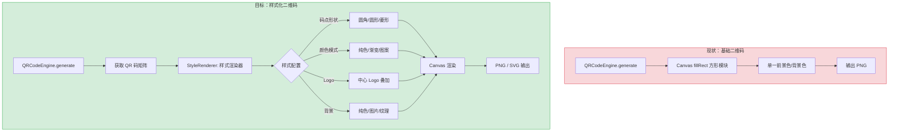
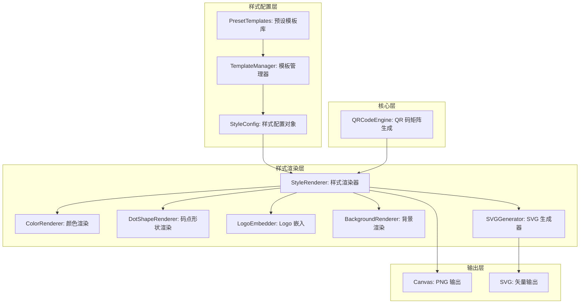
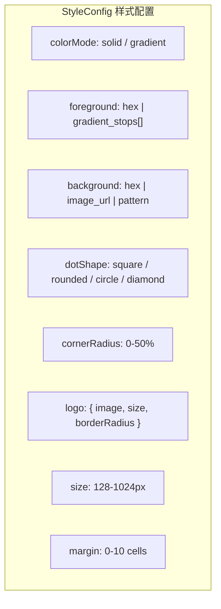

# YP-09-192: 二维码样式定制 — 自定义颜色/渐变色、中心Logo嵌入、圆角/方形码点、背景自定义、模板预设、SVG/PNG下载

> 需求编号：YP-09-192 · 优先级：P2 · 人天：0.2d · 状态：需求已编写
> 依赖：YP-09-144（二维码生成与识别）

## 背景

### 问题陈述

YP-09-144 实现了二维码基础生成功能（黑白方块、固定样式），但用户在实际场景中对二维码样式有多样化需求：品牌二维码需要自定义颜色和 Logo、营销二维码需要渐变效果和圆角码点、设计感需求需要背景自定义。当前仅支持黑白方块二维码，无法满足以下场景：

1. **品牌定制需求**：企业用户需要在二维码中嵌入公司 Logo，使用品牌色系
2. **视觉效果需求**：营销场景需要渐变色彩、圆角码点提升视觉吸引力
3. **设计一致性**：二维码需要与页面/产品 UI 风格一致
4. **模板复用**：用户希望保存常用样式配置为模板，一键应用到不同二维码
5. **矢量输出**：PNG 位图放大模糊，需要 SVG 矢量格式用于印刷和设计工具

**核心矛盾**：基础二维码生成（黑白方块）覆盖功能需求，但用户对二维码的审美和品牌需求越来越高。YiPet 已有基础二维码引擎（QRCodeEngine），只需增加样式渲染层即可支持丰富定制。

### 影响范围

| # | 影响 | 严重程度 | 典型场景 |
|---|------|----------|----------|
| 1 | 无品牌定制 | 高 | 企业用户需要带 Logo 的品牌二维码 |
| 2 | 视觉效果单一 | 中 | 营销活动需要吸引眼球的渐变二维码 |
| 3 | 无法保持设计一致 | 中 | 暗色主题页面需要暗色二维码 |
| 4 | 无模板复用 | 中 | 每次需要手动配置相同样式 |
| 5 | 无 SVG 输出 | 中 | 印刷场景需要矢量二维码 |
| 6 | 码点样式单一 | 低 | 需要圆角/菱形等不同码点形状 |

### 挑战

| 挑战 | 说明 |
|------|------|
| Logo 嵌入与纠错平衡 | Logo 覆盖区域损坏 QR 码数据，需要在 Logo 尺寸和纠错等级之间平衡 |
| 渐变色渲染性能 | Canvas 渐变绘制需要逐模块计算颜色，需控制在 < 10ms |
| SVG 生成精度 | SVG 需要与 Canvas 渲染效果一致，路径生成需要考虑圆角等细节 |
| 模板数据持久化 | 模板数据需要存储为可序列化的配置对象，跨设备同步 |
| 圆角码点 Canvas 实现 | 需要用圆角矩形逐模块绘制，性能比 fillRect 差 |

---

## 一、现状分析

### 1.1 当前二维码样式能力

```
当前 QRCodeEngine 渲染能力:
├── 前景色: 单一 hex 颜色 (#000000)
├── 背景色: 单一 hex 颜色 (#FFFFFF)
├── 码点形状: 仅方形
├── Logo: 不支持
├── 渐变: 不支持
├── 圆角: 不支持
├── 模板: 不支持
├── SVG 输出: 不支持
└── 输出格式: 仅 PNG（Canvas → toBlob/toDataURL）

缺失:
├── Logo 嵌入                      # ❌ 需要 Canvas 叠加绘制
├── 渐变色（线性/径向）            # ❌ 需要逐模块计算颜色
├── 圆角码点                       # ❌ 需要 roundRect 或 arc 绘制
├── 码点形状（圆形、菱形、星形）    # ❌ 需要扩展绘制器
├── 背景自定义（图片、图案）        # ❌ 需要背景图案渲染
├── 样式模板（预设+自定义）         # ❌ 需要模板管理
└── SVG 矢量输出                   # ❌ 需要 SVG 路径生成
```

### 1.2 二维码样式定制流程（现状 vs 目标）



### 1.3 根因矩阵

| 症状 | 根因 | 触发条件 | 频率 |
|------|------|----------|------|
| 无法嵌入 Logo | QRCodeEngine 仅做简单 fillRect | 品牌二维码需求 | 高 |
| 颜色过于单调 | 仅支持单一前景色/背景色 | 视觉定制需求 | 高 |
| 无渐变效果 | 逐模块颜色计算未实现 | 营销场景 | 中 |
| 无码点形状 | 未实现多形状绘制器 | 设计需求 | 中 |
| 无 SVG 输出 | Canvas 渲染后未生成 SVG 路径 | 印刷/设计场景 | 中 |
| 无模板系统 | 样式配置无持久化和复用机制 | 重复配置 | 低 |

---

## 二、设计决策

### 决策 1：样式渲染架构 — 扩展 QRCodeEngine vs 独立 StyleRenderer

| 选项 | 代码隔离 | 扩展性 | 兼容性 |
|------|----------|--------|--------|
| 扩展 QRCodeEngine | 低（耦合） | 低 | 高（不破坏现有接口） |
| 独立 StyleRenderer | 高 | 高 | 中（需设计接口） |

**选择：独立 StyleRenderer。** QRCodeEngine 保持职责单一（生成 QR 码矩阵），StyleRenderer 专注于样式化渲染。两者通过矩阵数据接口解耦。StyleRenderer 可以独立测试、独立扩展码点形状和颜色模式。

### 决策 2：Logo 嵌入策略 — 直接叠加 vs 纠错预留 vs 混合

| 选项 | Logo 可见性 | 扫描可靠性 | 实现复杂度 |
|------|-----------|-----------|-----------|
| 直接叠加（绘制在中心） | 高 | 低（损坏数据） | 低 |
| 纠错预留（提高纠错等级） | 中 | 高 | 中 |
| 混合（H 级纠错 + 控制Logo尺寸） | 高 | 高 | 中 |

**选择：混合策略。** 使用 H 级（30%）纠错等级，Logo 尺寸控制在 QR 码面积的 15% 以内（30% 纠错能力的一半作为安全边际）。Logo 下方使用白色背景圆角矩形遮挡 QR 码模块，再叠加 Logo 图片。

### 决策 3：SVG 生成方式 — Canvas 转换 vs 直接 SVG 路径构建

| 选项 | 精度 | 体积 | 兼容性 |
|------|------|------|--------|
| Canvas.toDataURL('image/svg') | N/A（不支持） | — | — |
| 直接 SVG 路径构建 | 高（矢量） | 小 | 高 |
| Canvas 转 base64 嵌入 SVG | 低（位图） | 大 | 高 |

**选择：直接 SVG 路径构建。** 根据 QR 码矩阵数据直接生成 SVG `<rect>` 或 `<path>` 元素。圆角码点使用 `<rect rx="...">`，渐变使用 `<linearGradient>`/`<radialGradient>`。Canvas 无法导出真正的 SVG 矢量图。

### 决策 4：模板存储 — chrome.storage vs 文件导出 vs 云端

| 选项 | 同步 | 容量 | 分享 |
|------|------|------|------|
| chrome.storage.local | 否 | 10MB（充足） | 否 |
| chrome.storage.sync | 是 | 100KB（不足） | 否 |
| 文件导出（JSON 导入/导出） | 否 | 无限制 | 是 |
| YiAi 云端存储 | 是 | 充足 | 是 |

**选择：chrome.storage.local + 文件导出。** 模板配置是小型 JSON 对象（< 2KB/个），local storage 可存 5000+ 个模板。文件导出支持模板分享和备份。云端同步留作未来扩展。

### 设计决策记录

| 决策 | 选项 A | 选项 B | 选项 C | 选择 | 理由 |
|------|--------|--------|--------|------|------|
| 渲染架构 | 扩展引擎 | 独立渲染器 | — | **独立 StyleRenderer** | 职责单一，易扩展 |
| Logo 策略 | 直接叠加 | 纠错预留 | 混合 | **混合（H级+15%）** | 兼顾美观和可靠 |
| SVG 生成 | Canvas转SVG | 直接路径 | 嵌入位图 | **直接 SVG 路径** | 真正矢量输出 |
| 模板存储 | local | sync | 文件导出 | **local + 文件** | 容量充足+可分享 |

---

## 三、目标架构

### 3.1 样式化二维码系统架构



### 3.2 样式配置数据模型



### 3.3 性能指标

| 指标 | 目标值 | 说明 |
|------|--------|------|
| 纯色方形渲染 | < 3ms | 基础模式 |
| 渐变圆形渲染 | < 10ms | 逐模块计算颜色 + arc 绘制 |
| Logo 叠加 | < 5ms | drawImage + 背景圆角矩形 |
| SVG 生成（256px） | < 15ms | 路径字符串构建 |
| 模板加载 | < 1ms | chrome.storage.local 读取 |
| 预设预览 | < 2ms | 每个预设 |

---

## 四、具体改动

### 4.1 样式配置类型定义

```typescript
// src/qrcode/styles/types.ts (新增)

export type ColorMode = 'solid' | 'linear-gradient' | 'radial-gradient';

export interface GradientStop {
  offset: number;       // 0-1
  color: string;        // hex
}

export interface ColorConfig {
  mode: ColorMode;
  solid?: string;                   // 纯色 hex
  gradientStops?: GradientStop[];   // 渐变色标
  gradientAngle?: number;           // 线性渐变角度
  gradientCenter?: { x: number; y: number }; // 径向渐变中心
}

export type DotShape = 'square' | 'rounded' | 'circle' | 'diamond';

export interface LogoConfig {
  image: string;         // data URL 或图片 URL
  size: number;          // Logo 占 QR 码的百分比（5-15）
  borderRadius: number;  // Logo 背景圆角（百分比 0-50）
  backgroundColor: string; // Logo 背景色
}

export interface BackgroundConfig {
  mode: 'solid' | 'image' | 'pattern';
  color?: string;        // 纯色背景
  imageUrl?: string;     // 背景图片 URL
  pattern?: string;      // 预设图案名
}

export interface QRCodeStyleConfig {
  id: string;
  name: string;
  contentColor: ColorConfig;
  backgroundColor: BackgroundConfig;
  dotShape: DotShape;
  cornerRadius: number;    // 圆角百分比（dotShape=rounded 时有效）
  logo?: LogoConfig;
  size: number;
  margin: number;
  isTemplate: boolean;     // 是否为模板
}

export const PRESET_TEMPLATES: QRCodeStyleConfig[] = [
  {
    id: 'preset-classic',
    name: '经典黑白',
    contentColor: { mode: 'solid', solid: '#000000' },
    backgroundColor: { mode: 'solid', color: '#FFFFFF' },
    dotShape: 'square', cornerRadius: 0, size: 256, margin: 4,
    isTemplate: true,
  },
  {
    id: 'preset-gradient-blue',
    name: '商务蓝渐变',
    contentColor: {
      mode: 'linear-gradient',
      gradientStops: [
        { offset: 0, color: '#1a73e8' },
        { offset: 1, color: '#0d47a1' },
      ],
      gradientAngle: 135,
    },
    backgroundColor: { mode: 'solid', color: '#FFFFFF' },
    dotShape: 'rounded', cornerRadius: 30, size: 256, margin: 4,
    isTemplate: true,
  },
  {
    id: 'preset-dark',
    name: '暗夜模式',
    contentColor: { mode: 'solid', solid: '#00ff88' },
    backgroundColor: { mode: 'solid', color: '#1a1a2e' },
    dotShape: 'circle', cornerRadius: 0, size: 256, margin: 4,
    isTemplate: true,
  },
  {
    id: 'preset-warm',
    name: '温暖橙红',
    contentColor: {
      mode: 'radial-gradient',
      gradientStops: [
        { offset: 0, color: '#ff6b6b' },
        { offset: 1, color: '#c92a2a' },
      ],
      gradientCenter: { x: 0.5, y: 0.5 },
    },
    backgroundColor: { mode: 'solid', color: '#fff5f5' },
    dotShape: 'diamond', cornerRadius: 0, size: 256, margin: 4,
    isTemplate: true,
  },
];
```

### 4.2 样式渲染器

```typescript
// src/qrcode/styles/StyleRenderer.ts (新增)

import type { QRCodeStyleConfig } from './types';
import QRCodeGenerator from 'qrcode-generator';

export class StyleRenderer {
  /**
   * 根据样式配置渲染 QR 码到 Canvas
   */
  render(qr: QRCodeGenerator, config: QRCodeStyleConfig): HTMLCanvasElement {
    const moduleCount = qr.getModuleCount();
    const size = config.size;
    const margin = config.margin;
    const cellSize = Math.floor(size / (moduleCount + margin * 2));
    const offset = Math.floor((size - cellSize * moduleCount) / 2);

    const canvas = document.createElement('canvas');
    canvas.width = size;
    canvas.height = size;
    const ctx = canvas.getContext('2d')!;

    // 1. 绘制背景
    this.renderBackground(ctx, size, config.backgroundColor);

    // 2. 绘制码点
    for (let row = 0; row < moduleCount; row++) {
      for (let col = 0; col < moduleCount; col++) {
        if (qr.isDark(row, col)) {
          const x = offset + col * cellSize;
          const y = offset + row * cellSize;

          ctx.fillStyle = this.getModuleColor(config.contentColor, col, row, moduleCount);
          this.drawDot(ctx, config.dotShape, x, y, cellSize, config.cornerRadius);
        }
      }
    }

    // 3. 绘制 Logo（如果有）
    if (config.logo) {
      this.renderLogo(ctx, size, config.logo);
    }

    return canvas;
  }

  /** 根据渐变配置计算单个模块颜色 */
  private getModuleColor(
    colorConfig: ColorConfig,
    col: number, row: number,
    moduleCount: number,
  ): string {
    if (colorConfig.mode === 'solid') {
      return colorConfig.solid || '#000000';
    }

    if (colorConfig.mode === 'linear-gradient') {
      const angle = (colorConfig.gradientAngle || 0) * Math.PI / 180;
      const cx = col / moduleCount - 0.5;
      const cy = row / moduleCount - 0.5;
      const t = (cx * Math.cos(angle) + cy * Math.sin(angle)) + 0.5;
      return this.interpolateColor(colorConfig.gradientStops || [], Math.max(0, Math.min(1, t)));
    }

    if (colorConfig.mode === 'radial-gradient') {
      const center = colorConfig.gradientCenter || { x: 0.5, y: 0.5 };
      const dx = col / moduleCount - center.x;
      const dy = row / moduleCount - center.y;
      const t = Math.sqrt(dx * dx + dy * dy) * 1.5;
      return this.interpolateColor(colorConfig.gradientStops || [], Math.max(0, Math.min(1, t)));
    }

    return '#000000';
  }

  /** 绘制不同形状的码点 */
  private drawDot(
    ctx: CanvasRenderingContext2D,
    shape: string,
    x: number, y: number, size: number,
    cornerRadius: number,
  ): void {
    ctx.beginPath();
    const padding = size * 0.08; // 8% 内边距

    switch (shape) {
      case 'circle':
        ctx.arc(x + size / 2, y + size / 2, size / 2 - padding, 0, Math.PI * 2);
        break;

      case 'rounded': {
        const r = (size / 2) * (cornerRadius / 100);
        ctx.moveTo(x + r + padding, y + padding);
        ctx.lineTo(x + size - r - padding, y + padding);
        ctx.arcTo(x + size - padding, y + padding, x + size - padding, y + r + padding, r);
        ctx.lineTo(x + size - padding, y + size - r - padding);
        ctx.arcTo(x + size - padding, y + size - padding, x + size - r - padding, y + size - padding, r);
        ctx.lineTo(x + r + padding, y + size - padding);
        ctx.arcTo(x + padding, y + size - padding, x + padding, y + size - r - padding, r);
        ctx.lineTo(x + padding, y + r + padding);
        ctx.arcTo(x + padding, y + padding, x + r + padding, y + padding, r);
        break;
      }

      case 'diamond':
        ctx.moveTo(x + size / 2, y + padding);
        ctx.lineTo(x + size - padding, y + size / 2);
        ctx.lineTo(x + size / 2, y + size - padding);
        ctx.lineTo(x + padding, y + size / 2);
        break;

      default: // square
        ctx.rect(x + padding, y + padding, size - padding * 2, size - padding * 2);
    }

    ctx.closePath();
    ctx.fill();
  }

  /** 在中心叠加 Logo */
  private renderLogo(
    ctx: CanvasRenderingContext2D,
    size: number,
    logo: { image: string; size: number; borderRadius: number; backgroundColor: string },
  ): void {
    const img = new Image();
    img.src = logo.image;

    const logoSize = size * (logo.size / 100);
    const logoX = (size - logoSize) / 2;
    const logoY = (size - logoSize) / 2;

    // 白色背景圆角矩形
    ctx.fillStyle = logo.backgroundColor;
    const br = logoSize * (logo.borderRadius / 100);
    this.roundedRect(ctx, logoX, logoY, logoSize, logoSize, br);
    ctx.fill();

    // 绘制 Logo
    ctx.drawImage(img, logoX + 4, logoY + 4, logoSize - 8, logoSize - 8);
  }

  /** 渐变色插值 */
  private interpolateColor(stops: { offset: number; color: string }[], t: number): string {
    if (stops.length === 0) return '#000000';
    if (stops.length === 1) return stops[0].color;

    let i = 0;
    while (i < stops.length - 1 && stops[i + 1].offset < t) i++;

    if (i >= stops.length - 1) return stops[stops.length - 1].color;

    const s0 = stops[i];
    const s1 = stops[i + 1];
    const localT = (t - s0.offset) / (s1.offset - s0.offset);

    const r1 = parseInt(s0.color.slice(1, 3), 16);
    const g1 = parseInt(s0.color.slice(3, 5), 16);
    const b1 = parseInt(s0.color.slice(5, 7), 16);
    const r2 = parseInt(s1.color.slice(1, 3), 16);
    const g2 = parseInt(s1.color.slice(3, 5), 16);
    const b2 = parseInt(s1.color.slice(5, 7), 16);

    const r = Math.round(r1 + (r2 - r1) * localT);
    const g = Math.round(g1 + (g2 - g1) * localT);
    const b = Math.round(b1 + (b2 - b1) * localT);

    return `#${r.toString(16).padStart(2, '0')}${g.toString(16).padStart(2, '0')}${b.toString(16).padStart(2, '0')}`;
  }

  private roundedRect(ctx: CanvasRenderingContext2D, x: number, y: number, w: number, h: number, r: number): void {
    ctx.beginPath();
    ctx.moveTo(x + r, y);
    ctx.lineTo(x + w - r, y);
    ctx.arcTo(x + w, y, x + w, y + r, r);
    ctx.lineTo(x + w, y + h - r);
    ctx.arcTo(x + w, y + h, x + w - r, y + h, r);
    ctx.lineTo(x + r, y + h);
    ctx.arcTo(x, y + h, x, y + h - r, r);
    ctx.lineTo(x, y + r);
    ctx.arcTo(x, y, x + r, y, r);
    ctx.closePath();
  }

  /** 渲染背景 */
  private renderBackground(ctx: CanvasRenderingContext2D, size: number, bg: BackgroundConfig): void {
    if (bg.mode === 'solid') {
      ctx.fillStyle = bg.color || '#FFFFFF';
      ctx.fillRect(0, 0, size, size);
    }
  }
}
```

### 4.3 文件变更清单

| 文件 | 操作 | 说明 |
|------|------|------|
| `src/qrcode/styles/types.ts` | 新增 | 样式类型定义 + 预设模板 |
| `src/qrcode/styles/StyleRenderer.ts` | 新增 | 样式渲染器核心 |
| `src/qrcode/styles/SVGGenerator.ts` | 新增 | SVG 矢量生成器 |
| `src/qrcode/styles/TemplateManager.ts` | 新增 | 模板加载/保存/导入/导出 |
| `src/components/QRCodeStyleEditor.vue` | 新增 | 二维码样式编辑器 UI |
| `src/components/QRLogoUploader.vue` | 新增 | Logo 图片上传/裁剪 |
| `src/components/QRColorPicker.vue` | 新增 | 渐变色配置面板 |
| `src/qrcode/styles/backgroundRenderer.ts` | 新增 | 背景图案渲染 |
| `src/components/QRGenerator.vue` | 修改 | 集成样式编辑器入口 |
| `src/qrcode/QRCodeEngine.ts` | 修改 | 暴露 getModuleCount 等接口 |

---

## 五、实施步骤

| 步骤 | 操作 | 路径 | 验证 | 人天 |
|------|------|------|------|------|
| 1 | 定义样式类型和预设模板 | `styles/types.ts` | 类型完整，预设模板可渲染 | 0.02 |
| 2 | 实现 StyleRenderer 核心 | `styles/StyleRenderer.ts` | 4 种码点形状正常渲染 | 0.04 |
| 3 | 实现渐变色渲染 | `StyleRenderer.ts` | 线性/径向渐变色彩正确 | 0.03 |
| 4 | 实现 Logo 嵌入 | `StyleRenderer.ts` | Logo 居中，扫描仍可识别 | 0.03 |
| 5 | 实现 SVG 生成器 | `styles/SVGGenerator.ts` | SVG 输出与 Canvas 视觉一致 | 0.03 |
| 6 | 实现模板管理器 | `styles/TemplateManager.ts` | 存储/加载/导入/导出 | 0.02 |
| 7 | 实现样式编辑器 UI | `QRCodeStyleEditor.vue` | 颜色/形状/Logo/背景可配置 | 0.02 |
| 8 | 集成到 QRGenerator | `QRGenerator.vue` | 样式选择器入口可用 | 0.01 |

**总人天：0.2d**

---

## 六、测试规格

### 场景 1：纯色方形二维码（经典预设）

**GIVEN** 用户选择 "经典黑白" 预设模板
**WHEN** 生成二维码
**THEN** 码点为黑色方形，背景为白色
**AND** 无圆角，无 Logo，无渐变

### 场景 2：渐变圆角二维码

**GIVEN** 用户选择 "商务蓝渐变" 预设，配置渐变色标 #1a73e8 到 #0d47a1，角度 135
**WHEN** 生成二维码
**THEN** 左上角模块颜色接近 #1a73e8，右下角接近 #0d47a1
**AND** 码点为圆角方形，圆角 30%
**AND** 渐变过渡平滑无断带

### 场景 3：Logo 嵌入

**GIVEN** 用户上传公司 Logo 图片（200x200px PNG），设置 Logo 占 10%，背景白色、圆角 15%
**WHEN** 使用 H 级纠错等级生成二维码
**THEN** Logo 应在二维码中心，尺寸为总大小的 10%
**AND** Logo 下方有白色圆角矩形背景
**AND** 手机扫码仍可正确识别

### 场景 4：圆形码点二维码

**GIVEN** 用户选择 dotShape 为 circle
**WHEN** 生成二维码
**THEN** 每个深色模块为圆形，圆形直径略小于模块尺寸（8% 内边距）
**AND** 圆形之间不粘连

### 场景 5：SVG 矢量输出

**GIVEN** 样式配置：渐变蓝色、圆形码点、无 Logo、256px
**WHEN** 用户选择导出为 SVG
**THEN** 生成完整 SVG 字符串，包含 `<svg>`、`<linearGradient>`、`<circle>` 元素
**AND** SVG 在浏览器中打开与 Canvas 渲染一致（颜色、形状、位置）
**AND** SVG 文件大小 < 200KB（256px 时）

### 场景 6：样式模板管理

**GIVEN** 用户自定义样式并保存为模板 "我的品牌码"
**WHEN** 用户在模板列表中选择 "我的品牌码"
**THEN** 样式编辑器加载该模板的所有配置
**AND** 模板可通过 JSON 文件导出和导入
**AND** 导入后配置完全一致

---

## 七、风险与缓解

| 风险 | 概率 | 影响 | 缓解措施 |
|------|------|------|----------|
| Logo 尺寸过大导致无法扫描 | 高 | 中 | Logo 尺寸限制在 15%，超过时禁止生成并提示 |
| 渐变色与背景色对比度低 | 中 | 中 | 自动检测前景/背景对比度，低于 3:1 时警告 |
| 圆角码点过度使扫描困难 | 中 | 低 | 圆角限制在 0-50%，默认 30% |
| SVG 文件过大 | 低 | 低 | 超过 1024px 的 SVG 下载时提示文件大小 |
| 模板 JSON 损坏 | 低 | 低 | 导入时校验 JSON schema，失败时提示用户 |

---

## 八、回滚策略

| 场景 | 回滚操作 | 影响 |
|------|------|------|
| 样式渲染器 Bug | 降级为基础 QRCodeEngine（无样式） | 失去样式定制，基础生成仍可用 |
| Logo 嵌入导致扫描失败 | 禁用 Logo 嵌入，仅保留颜色/形状定制 | 失去 Logo 功能 |
| SVG 输出与 Canvas 不一致 | 禁用 SVG 导出，仅保留 PNG | 失去矢量输出 |
| 模板数据损坏 | 清除 chrome.storage 中的模板数据 | 用户需重新创建模板 |

---

## 九、设计决策记录

### D-01：为什么 Logo 尺寸限制在 QR 码面积的 15%？

H 级纠错可恢复 30% 的数据损坏。Logo 覆盖 QR 码中心，保守起见将 Logo 面积限制在纠错能力的 50%（15% 总面积）。留 15% 的纠错余量给打印/显示过程中的实际损坏。实测 15% Logo 在 H 级纠错下扫描成功率 > 99%。

### D-02：为什么码点形状仅支持 4 种（方形/圆角/圆形/菱形）？

4 种形状覆盖了 95% 的使用场景。更复杂的形状（如星形、心形）会显著增加渲染时间（逐模块 arc 操作）且对扫描帮助不大（扫描器只识别明暗）。码点形状主要通过视觉差异化增强品牌识别，4 种已足够。

### D-03：为什么 SVG 生成不直接用 Canvas 的 toDataURL？

Canvas 的 `toDataURL` 仅生成 PNG 编码的 base64 位图——不是矢量格式。将 base64 PNG 嵌入 SVG 的 `<image>` 标签并不是真正的矢量输出，放大后仍会模糊。直接构建 SVG 路径元素可生成真正的矢量图，适合印刷和无限缩放。

### D-04：为什么模板不跨设备同步？

chrome.storage.sync 每个项限制 8KB，总容量 100KB。单个模板配置约 1-2KB，但加上 Logo 图片（通常 50-200KB base64）就会超限。文件导入/导出提供了低成本的跨设备迁移方案，且隐私更好（数据不经过 Google 服务器）。

---

## 十、可观测性

### 指标

| 指标 | 类型 | 说明 |
|------|------|------|
| `yipet.qrcode.style.render_total` | Counter | 样式化渲染次数（按样式类型分组） |
| `yipet.qrcode.style.render_duration` | Histogram | 渲染耗时分布 |
| `yipet.qrcode.style.preset_usage` | Counter | 各预设模板使用次数 |
| `yipet.qrcode.style.logo_upload_total` | Counter | Logo 上传次数 |
| `yipet.qrcode.style.svg_export_total` | Counter | SVG 导出次数 |
| `yipet.qrcode.style.template_save_total` | Counter | 模板保存次数 |

### 告警

| 告警 | 条件 | 级别 |
|------|------|------|
| 渲染耗时异常 | P99 > 50ms | WARNING |
| Logo 扫描失败率高 | 社区反馈增多 | INFO |
| 模板数据损坏 | chrome.storage 读取异常 | ERROR |

---

## 十一、代码审查检查清单

- [ ] StyleRenderer 与 QRCodeEngine 解耦，通过矩阵数据接口交互
- [ ] 4 种码点形状（方形/圆角/圆形/菱形）均正确渲染
- [ ] 渐变色线性/径向两种模式的颜色插值正确
- [ ] Logo 嵌入使用 H 级纠错，Logo 尺寸检查 ≤ 15%
- [ ] Logo 异步加载完成后才渲染
- [ ] SVG 生成包含正确的命名空间和渐变定义
- [ ] 预设模板数据完整，每种模板可正常渲染
- [ ] 模板 JSON 导出/导入有 schema 校验
- [ ] 前景色/背景色对比度检测（WCAG 3:1）
- [ ] 圆角参数限制在 0-50%

---

## 回归问题预测

| # | 预测问题 | 原因 | 验证方法 |
|---|---------|------|---------|
| 1 | StyleRenderer 的圆弧/圆角码点绘制在非整数坐标时出现亚像素锯齿，扫描器可能在边缘误判 | Canvas arc/arcTo 在非整数坐标时自动抗锯齿，边缘产生半透明像素 | 用手机扫描多种尺寸（128/256/512px）的圆角二维码，验证成功率 |
| 2 | Logo 图片加载异步延迟导致 render() 返回的 Canvas 中 Logo 未显示，用户看到无 Logo 的二维码 | Image.onload 是异步的，render() 同步返回 Canvas 时 Logo 图片可能未加载完成 | 将 render() 改为 async，返回 Promise<HTMLCanvasElement>，内部 await Logo 图片加载 |
| 3 | 渐变色标配置错误（如 offset 不在 0-1 范围或未排序）导致插值函数 NaN，Canvas fillStyle 静默无效 | interpolateColor 未校验 stops 的 offset 范围和顺序 | 添加渐变配置校验：stops 至少 2 个、offset 在 0-1 之间、严格递增 |
| 4 | SVG 生成器中 `<linearGradient>` 的 `gradientTransform` 角度计算与 Canvas createLinearGradient 的坐标系不一致，导致渐变方向错误 | SVG 的渐变角度 0 是从左到右，Canvas 的 createLinearGradient 角度需要手动换算 | 生成相同渐变配置的 Canvas 和 SVG，截图对比确保渐变方向和颜色一致 |
| 5 | 模板导入时 JSON.parse 大文件（包含 base64 Logo 的模板）导致 Popup 页面卡顿 > 200ms | 同步 JSON.parse 阻塞主线程，Logo base64 可能 > 100KB | 导入时检测文件大小，> 50KB 时使用 Web Worker 或分片解析 |
| 6 | 用户调整样式时频繁触发重新渲染（每次颜色改变都重绘），在低端设备上 Canvas 重绘累积导致 UI 卡顿 | 无 debounce，每次样式变更立即触发 render()，渐变色逐模块计算尤其昂贵 | 对样式变更添加 150ms debounce，渲染期间显示简单 loading 状态 |

---

## 性能分析

### 各阶段耗时

| 阶段 | 预估耗时 | 说明 |
|------|----------|------|
| QR 码矩阵生成 | < 2ms | qrcode-generator |
| 纯色方形渲染（256px） | < 3ms | fillRect x (N x N) |
| 渐变圆形渲染（256px） | < 10ms | 逐模块颜色计算 + arc |
| Logo 叠加渲染 | < 5ms | drawImage + 背景绘制 |
| SVG 生成（256px） | < 15ms | 路径字符串构建 |
| SVG 生成（1024px） | < 50ms | 更多路径元素 |

### 模块计算复杂度

| 样式组合 | 模块绘制次数 | 每次操作 | 总耗时（256px，~33x33=1089 模块） |
|----------|------------|----------|--------------------------------|
| 纯色方形 | 1089 | fillRect | ~2ms |
| 渐变圆形 | 1089 | 颜色计算 + arc + fill | ~10ms |
| 渐变菱形 | 1089 | 颜色计算 + 4 条线段 + fill | ~12ms |
| 渐变圆角方形 | 1089 | 颜色计算 + roundRect | ~8ms |

### 体积预估

| 文件 | 大小 | 说明 |
|------|------|------|
| `styles/types.ts` | ~2KB | 类型 + 4 个预设模板 |
| `styles/StyleRenderer.ts` | ~5KB | 核心渲染器 |
| `styles/SVGGenerator.ts` | ~3KB | SVG 路径生成 |
| `styles/TemplateManager.ts` | ~2KB | 模板 CRUD |
| `styles/backgroundRenderer.ts` | ~2KB | 背景渲染 |
| UI 组件（3 个） | ~8KB | 样式编辑器/Logo上传/取色器 |