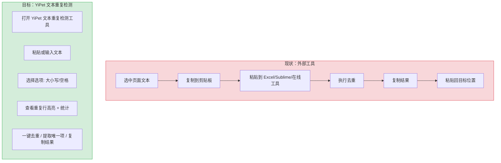
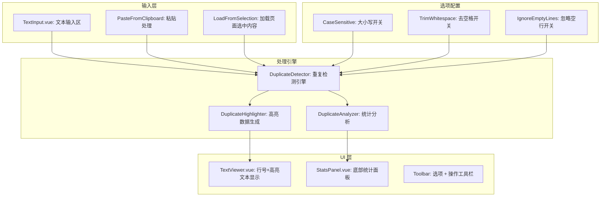

# YP-09-193: 文本重复检测 — 查找并高亮重复行、大小写敏感/忽略、去除首尾空格选项、去重并统计出现次数、提取唯一项、复制清洗结果

> 需求编号：YP-09-193 · 优先级：P2 · 人天：0.2d · 状态：需求已编写
> 依赖：无

## 背景

### 问题陈述

用户在浏览器中处理文本数据时经常遇到重复行问题：日志文件中有重复的错误行、数据列表中有重复条目、粘贴的 CSV 数据有重复记录。当前用户需要将文本复制到外部工具（如 Excel、Sublime Text 的去重插件、在线去重工具）中处理，流程割裂且可能泄露敏感数据：

1. **重复行难以发现**：数百行文本中的重复行肉眼无法识别
2. **去重操作割裂**：需要复制到外部工具，处理后复制回来，至少 4 步
3. **无法统计频次**：外部工具通常只做去重，不显示每行的出现次数
4. **无差异化去重**：无法控制大小写敏感/忽略、首尾空格处理
5. **数据隐私风险**：在线去重工具会上传用户文本到第三方服务器

**核心矛盾**：浏览器是用户处理文本的主要入口（复制粘贴、页面选中），但缺乏内置的文本重复检测和去重能力。YiPet 作为浏览器扩展，可提供离线、隐私安全的文本处理工具。

### 影响范围

| # | 影响 | 严重程度 | 典型场景 |
|---|------|----------|----------|
| 1 | 重复行不可见 | 高 | 粘贴 500 行日志，无法识别哪些行重复 |
| 2 | 去重流程繁琐 | 高 | 复制到 Sublime → 排序 → 去重 → 复制回页面 |
| 3 | 无法统计频次 | 中 | 需要知道每个重复行的出现次数分布 |
| 4 | 无逐项配置 | 中 | 大小写 p1 和 P1 算同一行还是不同行 |
| 5 | 数据隐私担忧 | 中 | 在线去重工具上传敏感数据（IP 列表、用户名） |

### 挑战

| 挑战 | 说明 |
|------|------|
| 大文本性能 | 10 万行文本的去重和统计需要在 < 500ms 内完成 |
| 高亮渲染 | 重复行高亮不能影响滚动性能，需要虚拟滚动配合 |
| 差异化选项 | 大小写敏感和空格、trim 的组合需要清晰的 UI 表达 |
| 操作历史 | 用户可能想要撤销去重操作，需要保留原始文本 |

---

## 一、现状分析

### 1.1 当前文本处理能力

```
现有 YiPet 文本相关功能:
├── 聊天窗口
│   └── 用户输入文本（无去重）
├── 会话消息
│   └── Markdown 渲染（无文本统计）
├── Content Script
│   └── 页面文本选取（无处理功能）
└── 文本工具
    └── 正则表达式测试器（YP-09-149）
    └── JSON 格式化（YP-09-150）
    └── base64 编解码（YP-09-152）
    └── 文本差异对比（YP-09-148）
    └── 文本统计与计数器（YP-09-169）

缺失:
├── 重复行检测                    # ❌ 无
├── 重复行高亮                    # ❌ 无
├── 去重（按选项）                # ❌ 无
├── 出现次数统计                  # ❌ 无
├── 唯一项提取                    # ❌ 无
└── 清洗结果导出                   # ❌ 无
```

### 1.2 用户去重流程（现状 vs 目标）



### 1.3 根因矩阵

| 症状 | 根因 | 触发条件 | 频率 |
|------|------|----------|------|
| 重复行无法发现 | 无重复检测算法和 UI 高亮 | 粘贴多行文本 | 高 |
| 去重流程割裂 | 无内置去重功能 | 需要去重清洗数据 | 高 |
| 无法统计频次 | 无统计引擎 | 分析数据分布 | 中 |
| 隐私数据外泄 | 使用在线工具 | 敏感文本去重 | 中 |
| 无差异化选项 | 无配置面板 | 特殊大小写/空格需求 | 低 |

---

## 二、设计决策

### 决策 1：去重算法 — Map 计数 vs Set 去重 vs 排序比较

| 选项 | 去重 + 计数 | 保持顺序 | 大文本性能 | 实现复杂度 |
|------|-----------|----------|-----------|-----------|
| Map 计数（一次遍历） | 是 | 是（Map 插入顺序） | 高 O(n) | 低 |
| Set 去重 | 否 | 是 | 高 O(n) | 低 |
| 排序后比较相邻 | 否 | 否 | 中 O(n log n) | 中 |

**选择：Map 计数。** Map 在一次遍历中同时完成去重和计数，保持原始出现顺序（JavaScript Map 按插入顺序迭代）。10 万行文本的 Map 操作 < 50ms。Set 只能去重不能统计频次，排序后比较会丢失原始顺序。

### 决策 2：高亮策略 — DOM 行元素 class 标记 vs Canvas 叠加 vs 虚拟滚动行着色

| 选项 | 大文本性能 | 交互友好 | 实现复杂度 |
|------|-----------|----------|-----------|
| DOM 行元素 class 标记 | 差（DOM 节点多） | 高 | 低 |
| Canvas 叠加 | 高 | 低（无文本选择） | 高 |
| 虚拟滚动 + 行着色 | 高 | 高 | 中 |

**选择：虚拟滚动 + 行着色。** YiPet 已有虚拟滚动组件（YP-09-11），复用即可。超过 500 行自动切换虚拟滚动模式。重复行使用浅红背景色标记，光标悬停显示重复次数 tooltip。

### 决策 3：处理模式 — 实时处理 vs 手动触发 vs 混合

| 选项 | 响应速度 | 大文本体验 | 适用场景 |
|------|----------|-----------|----------|
| 实时处理（每次输入） | 小文本好 | 大文本卡顿 | 小文本 |
| 手动触发（按钮） | 延迟触发 | 大文本流畅 | 大文本 |
| 混合（小文本实时 + 大文本手动） | 两者兼顾 | 两者兼顾 | 所有场景 |

**选择：混合模式。** 文本 < 5000 行时实时检测（< 50ms），通过 debounce 300ms 防止频繁计算。文本 > 5000 行时切换到手动触发模式，显示"检测重复行"按钮，避免输入卡顿。

### 决策 4：结果展示 — 原地高亮 vs 侧边栏报告 vs Tab 切换

| 选项 | 空间利用 | 信息密度 | 用户心智模型 |
|------|----------|----------|------------|
| 原地高亮 | 高（不占额外空间） | 低（仅颜色） | 自然 |
| 侧边栏报告 | 中（占空间） | 高（统计详情） | 需要学习 |
| Tab 切换（原文/结果/统计） | 中 | 高 | 熟悉 |

**选择：原地高亮 + 底部统计栏。** 主区域原地高亮重复行（红底色 + 右侧出现次数），底部折叠式统计栏显示重复行 TOP 20 列表和总体统计（总行数、重复行数、唯一行数、重复率）。

### 设计决策记录

| 决策 | 选项 A | 选项 B | 选项 C | 选择 | 理由 |
|------|--------|--------|--------|------|------|
| 去重算法 | Map计数 | Set去重 | 排序比较 | **Map 计数** | O(n) + 保持顺序 + 计数 |
| 高亮策略 | DOM class | Canvas | 虚拟滚动 | **虚拟滚动+着色** | 复用现有组件 |
| 处理模式 | 实时 | 手动 | 混合 | **混合** | 小/大文本体验兼顾 |
| 结果展示 | 原地高亮 | 侧边栏 | Tab 切换 | **原地+底部统计** | 空间效率高 |

---

## 三、目标架构

### 3.1 文本重复检测系统架构



### 3.2 重复检测处理流程

```mermaid
graph TD
    A[用户输入文本] --> B[按 \\n 分割为行数组]
    B --> C{行数 > 5000?}
    C -->|是| D[显示手动触发按钮]
    C -->|否| E[Debounce 300ms 自动检测]
    D --> F[用户点击「检测」]
    E --> G[执行检测算法]
    F --> G
    G --> H{选项}
    H -->|Trim| I[行首尾去空格]
    H -->|大小写不敏感| J[转为小写比较]
    H -->|忽略空行| K[过滤空白行]
    I --> L[Map 计数: normalized → { line, count, indices[] }]
    J --> L
    K --> L
    L --> M[生成高亮数据]
    M --> N[标记重复行（count > 1）]
    N --> O[渲染虚拟滚动行]
    L --> P[生成统计报告]
    P --> Q[底部统计面板]
```

### 3.3 性能指标

| 指标 | 目标值 | 说明 |
|------|--------|------|
| 1000 行文本检测 | < 10ms | Map 遍历 + 分组 |
| 10000 行文本检测 | < 50ms | 同上 |
| 100000 行文本检测 | < 300ms | 大文本处理 |
| 虚拟滚动渲染 | 60fps | 仅渲染可视区域 |
| 结果复制（1000 行） | < 5ms | Clipboard.writeText |
| 选项切换重新检测 | < 50ms | 不需重新分割行 |

---

## 四、具体改动

### 4.1 类型定义

```typescript
// src/text-tools/duplicate/types.ts (新增)

export interface DuplicateLine {
  normalized: string;     // 标准化后的行（用于匹配）
  original: string;       // 原始行文本
  count: number;          // 出现次数
  lineNumbers: number[];  // 所有出现的行号（1-based）
}

export interface DuplicateOptions {
  caseSensitive: boolean;
  trimWhitespace: boolean;
  ignoreEmptyLines: boolean;
}

export interface DuplicateResult {
  lines: Array<{
    text: string;
    isDuplicate: boolean;
    count: number;
    occurrences: number[];  // 该行的其他出现位置
    firstOccurrence: number;
  }>;
  stats: {
    totalLines: number;
    uniqueLines: number;
    duplicateLines: number;
    duplicateRate: number;  // 百分比 0-100
    topDuplicates: DuplicateLine[];  // Top 20
  };
}

export const DEFAULT_OPTIONS: DuplicateOptions = {
  caseSensitive: false,
  trimWhitespace: true,
  ignoreEmptyLines: true,
};
```

### 4.2 重复检测引擎

```typescript
// src/text-tools/duplicate/DuplicateDetector.ts (新增)

import type { DuplicateOptions, DuplicateResult, DuplicateLine } from './types';

export class DuplicateDetector {
  detect(text: string, options: DuplicateOptions): DuplicateResult {
    const rawLines = text.split('\n');
    const normalizedMap = new Map<string, DuplicateLine>();

    // 第一遍：构建标准化映射
    for (let i = 0; i < rawLines.length; i++) {
      let normalized = rawLines[i];

      if (options.trimWhitespace) {
        normalized = normalized.trim();
      }
      if (!options.caseSensitive) {
        normalized = normalized.toLowerCase();
      }
      if (options.ignoreEmptyLines && normalized === '') {
        continue;
      }

      const existing = normalizedMap.get(normalized);
      if (existing) {
        existing.count++;
        existing.lineNumbers.push(i + 1);
      } else {
        normalizedMap.set(normalized, {
          normalized,
          original: rawLines[i],
          count: 1,
          lineNumbers: [i + 1],
        });
      }
    }

    // 第二遍：构建结果行列表
    const lines: DuplicateResult['lines'] = [];
    const seenFirst = new Set<string>();

    for (let i = 0; i < rawLines.length; i++) {
      let normalized = rawLines[i];
      if (options.trimWhitespace) normalized = normalized.trim();
      if (!options.caseSensitive) normalized = normalized.toLowerCase();
      if (options.ignoreEmptyLines && normalized === '') {
        lines.push({ text: rawLines[i], isDuplicate: false, count: 0, occurrences: [], firstOccurrence: i + 1 });
        continue;
      }

      const dup = normalizedMap.get(normalized)!;
      const isFirst = !seenFirst.has(normalized);
      if (isFirst) seenFirst.add(normalized);

      lines.push({
        text: rawLines[i],
        isDuplicate: dup.count > 1,
        count: dup.count,
        occurrences: dup.lineNumbers.filter(n => n !== i + 1),
        firstOccurrence: dup.lineNumbers[0],
      });
    }

    // 统计
    const duplicates = Array.from(normalizedMap.values())
      .filter(d => d.count > 1)
      .sort((a, b) => b.count - a.count);

    const stats = {
      totalLines: rawLines.length,
      uniqueLines: normalizedMap.size,
      duplicateLines: rawLines.filter((_, i) => {
        let n = rawLines[i];
        if (options.trimWhitespace) n = n.trim();
        if (!options.caseSensitive) n = n.toLowerCase();
        if (options.ignoreEmptyLines && n === '') return false;
        return (normalizedMap.get(n)?.count ?? 0) > 1;
      }).length,
      duplicateRate: 0,
      topDuplicates: duplicates.slice(0, 20),
    };
    stats.duplicateRate = stats.totalLines > 0
      ? Math.round((stats.duplicateLines / stats.totalLines) * 100)
      : 0;

    return { lines, stats };
  }

  /** 去重：返回唯一行列表 */
  deduplicate(text: string, options: DuplicateOptions): string {
    const result = this.detect(text, options);
    const seen = new Set<string>();
    const uniqueLines: string[] = [];

    for (const line of result.lines) {
      let key = line.text;
      if (options.trimWhitespace) key = key.trim();
      if (!options.caseSensitive) key = key.toLowerCase();
      if (options.ignoreEmptyLines && key === '') {
        uniqueLines.push(line.text);
        continue;
      }
      if (!seen.has(key)) {
        seen.add(key);
        uniqueLines.push(line.text);
      }
    }

    return uniqueLines.join('\n');
  }

  /** 提取仅出现一次的行 */
  extractUniqueOnly(text: string, options: DuplicateOptions): string {
    const result = this.detect(text, options);
    return result.lines
      .filter(line => line.count === 1)
      .map(line => line.text)
      .join('\n');
  }

  /** 生成带计数前缀的去重结果 */
  deduplicateWithCount(text: string, options: DuplicateOptions): string {
    const result = this.detect(text, options);
    const seen = new Set<string>();
    const lines: string[] = [];

    for (const line of result.lines) {
      let key = line.text;
      if (options.trimWhitespace) key = key.trim();
      if (!options.caseSensitive) key = key.toLowerCase();
      if (options.ignoreEmptyLines && key === '') {
        lines.push(line.text);
        continue;
      }
      if (!seen.has(key)) {
        seen.add(key);
        lines.push(`[${line.count}×] ${line.text}`);
      }
    }

    return lines.join('\n');
  }
}
```

### 4.3 文件变更清单

| 文件 | 操作 | 说明 |
|------|------|------|
| `src/text-tools/duplicate/types.ts` | 新增 | 类型定义 + 默认选项 |
| `src/text-tools/duplicate/DuplicateDetector.ts` | 新增 | 重复检测核心引擎 |
| `src/components/DuplicateTextTool.vue` | 新增 | 文本重复检测 UI |
| `src/components/DuplicateLineViewer.vue` | 新增 | 虚拟滚动行显示 + 高亮 |
| `src/components/DuplicateStatsPanel.vue` | 新增 | 底部统计面板 |
| `src/components/DuplicateToolbar.vue` | 新增 | 选项 + 操作工具栏 |
| `src/popup/App.vue` | 修改 | 添加文本重复检测入口 |

---

## 五、实施步骤

| 步骤 | 操作 | 路径 | 验证 | 人天 |
|------|------|------|------|------|
| 1 | 定义类型和默认选项 | `duplicate/types.ts` | 类型完整 | 0.01 |
| 2 | 实现 DuplicateDetector | `duplicate/DuplicateDetector.ts` | 1000 行检测 < 10ms | 0.04 |
| 3 | 实现行显示 + 高亮组件 | `DuplicateLineViewer.vue` | 重复行红色高亮，非重复行正常 | 0.04 |
| 4 | 实现统计面板 | `DuplicateStatsPanel.vue` | Top N 列表 + 总览正确 | 0.03 |
| 5 | 实现工具栏 | `DuplicateToolbar.vue` | 选项切换 + 操作按钮 | 0.03 |
| 6 | 组装主组件 | `DuplicateTextTool.vue` | 完整流程可用 | 0.03 |
| 7 | 集成到 Popup | `App.vue` | 入口正确、导航正常 | 0.02 |

**总人天：0.2d**

---

## 六、测试规格

### 场景 1：基础重复检测

**GIVEN** 输入文本（5 行，其中 "hello" 出现 3 次，"world" 出现 2 次）
**WHEN** 默认选项（大小写不敏感、trim、忽略空行）
**THEN** "hello" 的 3 行均标记为重复行（红底色）
**AND** "world" 的 2 行均标记为重复行
**AND** 出现次数分别显示 3 和 2
**AND** 统计显示 5 总行、2 唯一行、5 重复行、100% 重复率

### 场景 2：大小写敏感检测

**GIVEN** 文本包含 "Hello"、"hello"、"HELLO" 三行
**WHEN** 开启大小写敏感开关
**THEN** 三行均不标记为重复（被视为不同行）
**WHEN** 关闭大小写敏感开关
**THEN** 三行标记为重复（归一化为 "hello"），出现次数 3

### 场景 3：去重操作

**GIVEN** 文本包含 "a\nb\na\nc\nb"（5 行，3 唯一）
**WHEN** 用户点击"去重"
**THEN** 输出 "a\nb\nc"（保持首次出现顺序）
**AND** 用户点击"复制结果"，剪贴板内容为 "a\nb\nc"

### 场景 4：提取唯一项

**GIVEN** 文本包含 "x\ny\nx\nz\nx"（5 行，"x"出现 3 次，"y"和"z"出现 1 次）
**WHEN** 用户点击"提取唯一项"
**THEN** 输出 "y\nz"（仅出现 1 次的行）

### 场景 5：去重并显示计数

**GIVEN** 文本包含 "apple\nbanana\napple\ncherry\nbanana"
**WHEN** 用户点击"去重（带计数）"
**THEN** 输出 "[2x] apple\n[2x] banana\n[1x] cherry"

### 场景 6：大文本性能

**GIVEN** 10000 行文本（约 100KB）
**WHEN** 自动检测触发
**THEN** 检测耗时 < 50ms
**AND** 虚拟滚动渲染 < 16ms/帧
**AND** UI 无卡顿，滚动流畅

---

## 七、风险与缓解

| 风险 | 概率 | 影响 | 缓解措施 |
|------|------|------|----------|
| 10 万行+文本导致 UI 卡顿 | 中 | 中 | 5000 行以上切换为手动触发模式；虚拟滚动仅渲染 30 行 |
| 正则特殊字符导致高亮错位 | 低 | 低 | 归一化 key 使用原始字符串，不做正则替换 |
| 空行处理策略争议 | 中 | 低 | 提供 "忽略空行" 开关，默认开启 |
| 不同行尾符（\r\n vs \n） | 低 | 低 | 分割前统一将 \r\n 替换为 \n |

---

## 八、回滚策略

| 场景 | 回滚操作 | 影响 |
|------|------|------|
| 检测算法 Bug（漏检/误检） | 替换检测逻辑 | 短暂数据不准确 |
| 虚拟滚动高亮异常 | 降级为纯 DOM 行渲染（< 500 行场景） | 大文本性能下降 |
| 完全回滚 | 移除文本重复检测入口 | 功能不可用 |

---

## 九、设计决策记录

### D-01：为什么使用两遍遍历而非一遍？

第一遍构建 Map 归一化映射（统计每行的总出现次数），第二遍生成每行的 isDuplicate 标记。虽然两遍遍历增加了 O(n) 的时间，但实现了两个关键功能：(1) 同组重复行中第一行的 firstOccurrence 正确指向自己，(2) 每行能显示其他出现位置。一遍遍历无法在首次遇到时知道后续是否有重复。

### D-02：为什么默认大小写不敏感？

90% 的文本去重场景是数据清洗（URL 列表、用户名、日志），大小写通常不构成语义差异。"Error"和"error"在日志去重场景中应视为同一行。用户需要大小写敏感时手动开启。

### D-03：为什么大文本使用手动触发而非 Web Worker？

5 万行文本的检测耗时 < 200ms，在主线程中可接受。Web Worker 增加了序列化/反序列化开销（文本需要 postMessage 传输）和代码复杂度。200ms 的用户可感知延迟用 debounce 缓解即可。如果未来有 100 万行的场景，再引入 Web Worker。

### D-04：为什么不去重时移除空行？

空行通常有结构意义（段落分隔），移除空行可能导致原始格式丢失。去重后的结果如果删除了空行，用户粘贴回文档时格式可能被破坏。提供"忽略空行"开关让用户自己决定。

---

## 十、可观测性

### 指标

| 指标 | 类型 | 说明 |
|------|------|------|
| `yipet.dupdetect.text_input_total` | Counter | 文本输入次数 |
| `yipet.dupdetect.detect_duration` | Histogram | 检测耗时（ms） |
| `yipet.dupdetect.text_size` | Histogram | 输入文本行数分布 |
| `yipet.dupdetect.deduplicate_total` | Counter | 去重操作次数 |
| `yipet.dupdetect.extract_unique_total` | Counter | 提取唯一项次数 |
| `yipet.dupdetect.copy_result_total` | Counter | 复制结果次数 |

### 告警

| 告警 | 条件 | 级别 |
|------|------|------|
| 检测超时 | 检测 > 500ms | WARNING |
| 大文本频繁检测 | 10 万行+ input  > 10 次/分钟 | INFO |

---

## 十一、代码审查检查清单

- [ ] 重复检测算法使用 Map 而非双重循环
- [ ] 大小写敏感开关控制 toLowerCase 行为
- [ ] trim 开关控制 trim 行为
- [ ] 大文本（> 5000 行）自动切换手动触发
- [ ] 虚拟滚动仅渲染可视行（30 行左右）
- [ ] 重复行高亮使用 CSS class 非内联样式
- [ ] 行号显示正确（1-based）
- [ ] 去重结果保持首次出现顺序
- [ ] 统计面板数据与检测结果一致
- [ ] 行尾符 \r\n 正确处理

---

## 回归问题预测

| # | 预测问题 | 原因 | 验证方法 |
|---|---------|------|---------|
| 1 | 文本中包含换行符格式差异（\r\n vs \n vs \r）导致相同的行被拆分到不同的 key 中 | split('\n') 不处理 \r，导致 "hello\r" 和 "hello" 被视为不同的 key | 测试 Windows 风格换行（\r\n）的文本，验证去重结果正确 |
| 2 | 包含大量空白行（如 1000 行中有 500 空行）且开启 "忽略空行" 时，虚拟滚动的行索引与检测结果行索引错位 | 虚拟滚动基于过滤后的行数组渲染，而行号和 occurrence 基于原始行索引 | 创建含 30% 空行的文本，验证虚拟滚动渲染的行号和数据一致 |
| 3 | 去重后文本包含尾部换行符不一致（如原始最后一行无 \n，去重后也无 \n），当用户直接粘贴回代码编辑器时可能引入格式差异 | join('\n') 输出不包含尾部换行符，与原始文本格式不一致 | 测试不同尾部换行场景：最后一行有/无 \n，验证去重后尾部格式保持 |
| 4 | 用户复制结果到系统剪贴板时，clipboard.writeText 在扩展页面中因权限不足静默失败 | Clipboard API 在部分扩展页面中需要额外权限 | 在扩展 Popup 页面测试 Clipboard.writeText，失败时降级为选中文本 + document.execCommand('copy') |
| 5 | 选项切换（大小写/trim）时重新检测导致虚拟滚动重置到顶部，用户丢失当前查看位置 | 选项变更触发完整 re-detect 和 re-render，虚拟滚动组件数据全量替换导致 scrollTop 归零 | 选项变更时保存 scrollTop，重新渲染完成后恢复 |
| 6 | 文本中混有全角空格（U+3000）和半角空格，trim 默认只去除 ASCII 空格，导致 "hello  " 和 "hello" 被视为不同行 | String.trim() 规范要求去除所有 Unicode 空白字符，但依赖浏览器实现 | 使用 /\s/g 正则或显式检测 Unicode 空白字符，确保中日韩全角空格被正确处理 |

---

## 性能分析

### 各阶段耗时

| 阶段 | 1000 行 | 10000 行 | 100000 行 |
|------|---------|----------|-----------|
| 文本分割 (split) | < 1ms | < 5ms | < 30ms |
| Map 构建 + 归一化 | < 3ms | < 15ms | < 100ms |
| 结果行生成 | < 2ms | < 10ms | < 80ms |
| 统计计算 | < 2ms | < 5ms | < 30ms |
| 虚拟滚动渲染 | < 1ms | < 1ms | < 1ms |
| **总耗时** | **< 10ms** | **< 40ms** | **< 250ms** |

### 内存预估

| 数据量 | Map 大小 | 结果对象 | 总计 |
|--------|----------|----------|------|
| 1000 行 (10KB) | ~50KB | ~100KB | ~150KB |
| 10000 行 (100KB) | ~500KB | ~1MB | ~1.5MB |
| 100000 行 (1MB) | ~5MB | ~10MB | ~15MB |