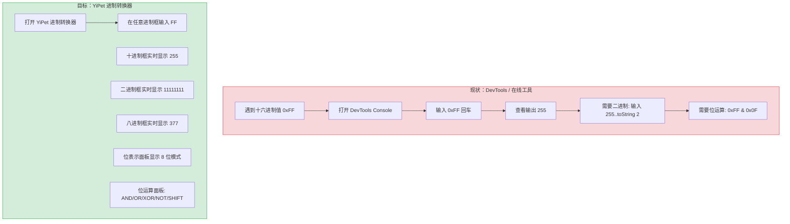
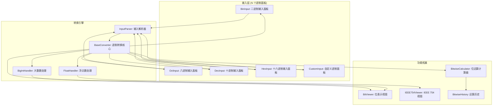
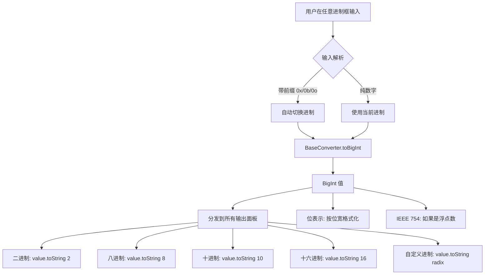

# YP-09-194: 数字进制转换 — 二进制/八进制/十进制/十六进制/自定义进制(2-36)、实时转换、位表示显示、位运算计算器、IEEE 754 浮点数表示

> 需求编号：YP-09-194 · 优先级：P2 · 人天：0.2d · 状态：需求已编写
> 依赖：无

## 背景

### 问题陈述

开发者在日常工作中频繁需要进行进制转换：调试时查看十进制到十六进制的颜色值、网络编程时查看 IP 地址的二进制表示、嵌入式开发时处理各种自定义进制的数据。当前用户需要打开浏览器开发者工具 console、使用 Python/Node.js REPL、或搜索在线进制转换工具：

1. **切换工具打断心流**：从 IDE 切换到浏览器 console 或在线工具，中断开发节奏
2. **自定义进制无支持**：大多数转换工具仅支持 2/8/10/16 进制，开发自定义协议时需要进制 2-36
3. **位表示不可见**：需要直接查看数字的二进制位模式（如 Bit Flags 调试）
4. **位运算需要记忆**：与/或/异或/移位操作需要手算或在 console 中计算
5. **浮点数表示不直观**：IEEE 754 单/双精度浮点数的二进制表示难以直观查看

**核心矛盾**：浏览器 console 能做这些计算，但每次需要打开 DevTools、输入表达式、查看结果。YiPet 作为常驻扩展，可以提供一键可达的专用进制转换和位运算工具。

### 影响范围

| # | 影响 | 严重程度 | 典型场景 |
|---|------|----------|----------|
| 1 | 进制转换流程繁琐 | 高 | 查看 0xFF 的十进制值需要打开 console |
| 2 | 缺自定义进制 | 中 | 处理 base32/base36 编码数据 |
| 3 | 位模式不可见 | 中 | 调试权限标志位 0b10101010 |
| 4 | 位运算需手算 | 中 | 计算两个标志位的 OR 结果 |
| 5 | 浮点数不直观 | 低 | 查看 3.14 在内存中的 IEEE 754 表示 |

### 挑战

| 挑战 | 说明 |
|------|------|
| 大整数精度 | JavaScript Number 只能安全表示 ±2^53 整数，大整数需要 BigInt |
| 自定义进制字符集 | 进制 36 使用 0-9A-Z，进制 2-36 的字符集定义和处理 |
| IEEE 754 实现 | 浮点数的符号位/指数/尾数拆分需要 ArrayBuffer + DataView |
| 实时转换性能 | 多个进制面板同时更新需要在 < 16ms 内完成 |
| 负数表示 | 负数在二进制中的补码表示、十六进制中的符号处理 |

---

## 一、现状分析

### 1.1 当前数字工具状况

```
现有 YiPet 数字相关功能:
├── 单位转换器 (YP-09-145)
│   └── 长度/重量/温度等物理单位
├── 文本统计与计数器 (YP-09-169)
│   └── 字符/单词/行数统计
└── 正则表达式测试器 (YP-09-149)
    └── 文本模式匹配

缺失:
├── 多进制转换 (2/8/10/16)       # ❌ 无
├── 自定义进制 (2-36)             # ❌ 无
├── 位表示视图                     # ❌ 无
├── 位运算计算器                   # ❌ 无
├── IEEE 754 浮点数                # ❌ 无
└── 实时联动转换                   # ❌ 无
```

### 1.2 开发者当前转换流程（现状 vs 目标）



### 1.3 根因矩阵

| 症状 | 根因 | 触发条件 | 频率 |
|------|------|----------|------|
| 进制转换效率低 | 无专用转换器，靠 DevTools | 编码/调试时 | 高 |
| 自定义进制不支持 | 缺乏灵活的进制转换引擎 | 处理非标准进制 | 中 |
| 位表示不可见 | 无位模式可视化 | 调试标志位时 | 中 |
| 位运算需手算 | 无内置位运算计算器 | 位操作编程时 | 中 |
| 浮点数内部表示不透明 | 无 IEEE 754 解析 | 浮点数精度调试 | 低 |

---

## 二、设计决策

### 决策 1：转换引擎 — Number.parseInt/toString vs BigInt vs 自实现

| 选项 | 大整数 | 精度 | 自定义进制 |
|------|--------|------|-----------|
| Number + parseInt/toString | 受限于 2^53 | 有限 | 支持 2-36 |
| BigInt + toString | 任意大小 | 精确 | 支持 2-36 |
| 自实现转换算法 | 任意大小 | 精确 | 任意进制 |

**选择：BigInt + toString（主路径）+ Number parseInt（浮点数路径）。** JavaScript 原生 `BigInt` 支持任意大小整数和 toString(radix)，覆盖 99% 的整数转换场景。自定义进制只需指定 radix 2-36。浮点数使用 Number + IEEE 754 解析路径。

### 决策 2：输入解析 — 前缀识别 (0x/0b/0o) vs 用户指定进制 vs 自动检测

| 选项 | 用户体验 | 歧义处理 | 实现复杂度 |
|------|----------|----------|-----------|
| 前缀识别 (0x/0b/0o) | 中 | 好（0xFF 清楚是 hex） | 低 |
| 用户指定进制（下拉选择） | 高 | 好（显式选择） | 低 |
| 自动检测 | 低 | 差（"10" 可能是 bin/oct/dec/hex） | 高 |

**选择：用户指定进制 + 前缀识别。** 每个输入框关联一个进制选择器。同时支持前缀识别作为快捷输入：用户可以在任意框输入 `0xFF`、`0b1010`、`0o77`，自动切换到对应进制。纯数字输入 `10` 时使用当前选定的进制。

### 决策 3：位表示视图 — 固定位宽 vs 自动最小位宽 vs 用户可选位宽

| 选项 | 可读性 | 灵活性 | 内存位映射 |
|------|--------|--------|-----------|
| 固定位宽（32/64 位） | 低（小数字显示大量前导零） | 低 | 高 |
| 自动最小位宽 | 高 | 中 | 低 |
| 用户可选（8/16/32/64 位） | 中 | 高 | 中 |

**选择：用户可选位宽（默认自动最小位宽）。** 提供 8/16/32/64 位选项，默认自动选择不浪费空间的位宽（如 255 → 8 位、65535 → 16 位）。用户可根据调试场景手动切换到更大位宽。

### 决策 4：IEEE 754 实现 — DataView + ArrayBuffer vs 自解析 vs 第三方库

| 选项 | 精度 | 兼容性 | 实现复杂度 |
|------|------|--------|-----------|
| DataView.setFloat32/setFloat64 + getUint32/getBigUint64 | 精确（原生实现） | 所有现代浏览器 | 低 |
| 自实现符号位/指数/尾数解析 | 精确 | 所有浏览器 | 高 |
| 第三方库（如 ieee754） | 精确 | 依赖外部包 | 低 |

**选择：DataView + ArrayBuffer。** 这是最可靠的方法——利用 JavaScript 引擎原生的 IEEE 754 实现（无需自己解析符号位/指数/尾数），通过 DataView 将浮点数写入 ArrayBuffer，再读取为整数获取底层二进制表示。

### 设计决策记录

| 决策 | 选项 A | 选项 B | 选项 C | 选择 | 理由 |
|------|--------|--------|--------|------|------|
| 转换引擎 | Number | BigInt | 自实现 | **BigInt + Number** | 原生高性能 |
| 输入解析 | 前缀识别 | 用户指定 | 自动检测 | **指定+前缀** | 消除歧义 |
| 位表示 | 固定位宽 | 自动最小 | 用户可选 | **可选位宽（默认自动）** | 灵活 + 合理默认 |
| IEEE 754 | DataView | 自解析 | 第三方库 | **DataView** | 原生可靠 |

---

## 三、目标架构

### 3.1 进制转换系统架构



### 3.2 实时联动转换流程



### 3.3 性能指标

| 指标 | 目标值 | 说明 |
|------|--------|------|
| 单次转换（5 进制面板更新） | < 3ms | BigInt.toString 原生快速 |
| 位表示视图渲染（64 位） | < 5ms | 字符串操作 |
| IEEE 754 解析 | < 1ms | DataView 访问 |
| 位运算计算 | < 1ms | BigInt 原生位操作 |
| 输入 debounce | 150ms | 防止快速输入触发多次转换 |

---

## 四、具体改动

### 4.1 类型定义

```typescript
// src/number-tools/base-converter/types.ts (新增)

export type Radix = 2 | 8 | 10 | 16 | number; // 2-36

export interface BasePanel {
  radix: Radix;
  label: string;
  value: string;
  prefix: string; // 如 '0b', '0x', ''
  digitSet: string; // 如 '01', '01234567', '0-9A-F'等
}

export type BitWidth = 8 | 16 | 32 | 64 | 'auto';

export interface BitInfo {
  binary: string;      // 二进制字符串 ('10101010')
  bitWidth: number;    // 实际位宽
  displayWidth: BitWidth; // 显示位宽
  groups: string[];    // 按 4 位/8 位分组后的字符串数组
  bitCount: number;    // 置 1 的位数
  hexPairs: string[];  // 每 8 位一组的十六进制表示
}

export interface IEEE754Result {
  sign: 0 | 1;
  signDisplay: string;   // '+' 或 '-'
  exponent: number;       // 指数值（未偏置）
  exponentBinary: string; // 指数位二进制
  exponentBias: number;   // 偏置值（32位=127, 64位=1023）
  mantissa: string;       // 尾数位二进制
  mantissaValue: string;  // 尾数的十进制值（1.x 形式）
  hexRepresentation: string; // 完整十六进制表示
  binaryRepresentation: string; // 完整二进制表示
  precision: 'single' | 'double';
}

export interface BitwiseOperation {
  type: 'and' | 'or' | 'xor' | 'not' | 'shl' | 'shr' | 'ushr';
  operand1: bigint;
  operand2?: bigint;
  result: bigint;
}
```

### 4.2 进制转换引擎

```typescript
// src/number-tools/base-converter/BaseConverter.ts (新增)

import type { Radix, BitInfo, IEEE754Result, BitWidth } from './types';

export class BaseConverter {
  /** 将任意进制字符串转为 BigInt */
  parse(input: string, radix: Radix): bigint | null {
    try {
      // 去除空格和前缀
      const cleaned = input.trim().replace(/^0[xXbBoO]/, '');
      if (cleaned === '') return null;

      // 处理小数（浮点数路径）
      if (cleaned.includes('.')) {
        return null; // 浮点数由 FloatHandler 处理
      }

      // 处理负数
      if (cleaned.startsWith('-')) {
        const positive = BigInt(`0x${this.toHex(cleaned.slice(1), radix)}`);
        return -positive;
      }

      // 自定义进制通过十六进制中转
      const hexStr = this.toHex(cleaned, radix);
      return BigInt(`0x${hexStr}`);
    } catch {
      return null;
    }
  }

  /** 将 BigInt 转为指定进制的字符串 */
  toString(value: bigint, radix: Radix): string {
    if (radix >= 2 && radix <= 36) {
      return value.toString(radix);
    }
    throw new Error(`Unsupported radix: ${radix}`);
  }

  /** 获取前缀 */
  getPrefix(radix: Radix): string {
    switch (radix) {
      case 2: return '0b';
      case 8: return '0o';
      case 16: return '0x';
      default: return '';
    }
  }

  /** 获取进制的有效字符集 */
  getDigitSet(radix: Radix): string {
    const digits = '0123456789ABCDEFGHIJKLMNOPQRSTUVWXYZ';
    return digits.slice(0, radix);
  }

  private toHex(input: string, radix: Radix): string {
    if (radix === 16) return input;
    if (radix === 10) return BigInt(input).toString(16);

    // 通用进制 → 十进制 → 十六进制
    let value = 0n;
    const digits = this.getDigitSet(radix);
    for (const char of input.toUpperCase()) {
      const digit = digits.indexOf(char);
      if (digit === -1) throw new Error(`Invalid digit "${char}" for radix ${radix}`);
      value = value * BigInt(radix) + BigInt(digit);
    }
    return value.toString(16);
  }

  /** 生成位信息 */
  getBitInfo(value: bigint, displayWidth: BitWidth): BitInfo {
    const isNegative = value < 0n;
    const absValue = isNegative ? -value : value;

    // 计算自动位宽
    const autoWidth = this.calculateAutoWidth(absValue);
    const bitWidth = displayWidth === 'auto' ? autoWidth : displayWidth;

    // 生成二进制字符串
    let binary = absValue.toString(2).padStart(bitWidth, '0');

    // 负数：计算补码
    if (isNegative) {
      binary = this.twosComplement(absValue, bitWidth);
    }

    // 按 4 位分组
    const groups: string[] = [];
    for (let i = 0; i < binary.length; i += 4) {
      groups.push(binary.slice(i, i + 4));
    }

    // 每 8 位一组的 hex
    const hexPairs: string[] = [];
    for (let i = 0; i < binary.length; i += 8) {
      const byte = binary.slice(i, i + 8).padStart(8, '0');
      hexPairs.push(parseInt(byte, 2).toString(16).toUpperCase().padStart(2, '0'));
    }

    return {
      binary,
      bitWidth,
      displayWidth,
      groups,
      bitCount: binary.split('').filter(b => b === '1').length,
      hexPairs,
    };
  }

  /** IEEE 754 浮点数解析 */
  parseIEEE754(value: number, precision: 'single' | 'double'): IEEE754Result {
    if (precision === 'single') {
      return this.parseFloat32(value);
    }
    return this.parseFloat64(value);
  }

  private parseFloat32(value: number): IEEE754Result {
    const buffer = new ArrayBuffer(4);
    const view = new DataView(buffer);
    view.setFloat32(0, value, false); // big-endian
    const bits = view.getUint32(0, false);

    const sign = (bits >>> 31) as 0 | 1;
    const exponent = (bits >>> 23) & 0xFF;
    const mantissa = bits & 0x7FFFFF;

    return {
      sign,
      signDisplay: sign === 0 ? '+' : '-',
      exponent: exponent - 127,
      exponentBinary: exponent.toString(2).padStart(8, '0'),
      exponentBias: 127,
      mantissa: mantissa.toString(2).padStart(23, '0'),
      mantissaValue: exponent === 0
        ? `0.${mantissa.toString(2).padStart(23, '0')}`
        : `1.${mantissa.toString(2).padStart(23, '0')}`,
      hexRepresentation: `0x${bits.toString(16).toUpperCase().padStart(8, '0')}`,
      binaryRepresentation: bits.toString(2).padStart(32, '0'),
      precision: 'single',
    };
  }

  private parseFloat64(value: number): IEEE754Result {
    const buffer = new ArrayBuffer(8);
    const view = new DataView(buffer);
    view.setFloat64(0, value, false);
    const bits = view.getBigUint64(0, false);

    const sign = Number(bits >> 63n) as 0 | 1;
    const exponent = Number((bits >> 52n) & 0x7FFn);
    const mantissa = bits & 0xFFFFFFFFFFFFFn;

    return {
      sign,
      signDisplay: sign === 0 ? '+' : '-',
      exponent: exponent - 1023,
      exponentBinary: exponent.toString(2).padStart(11, '0'),
      exponentBias: 1023,
      mantissa: mantissa.toString(2).padStart(52, '0'),
      mantissaValue: exponent === 0
        ? `0.${mantissa.toString(2).padStart(52, '0')}`
        : `1.${mantissa.toString(2).padStart(52, '0')}`,
      hexRepresentization: `0x${bits.toString(16).toUpperCase().padStart(16, '0')}`,
      binaryRepresentation: bits.toString(2).padStart(64, '0'),
      precision: 'double',
    };
  }

  private calculateAutoWidth(value: bigint): number {
    if (value === 0n) return 8;
    const bits = value.toString(2).length;
    if (bits <= 8) return 8;
    if (bits <= 16) return 16;
    if (bits <= 32) return 32;
    return 64;
  }

  private twosComplement(value: bigint, bitWidth: number): string {
    const mask = (1n << BigInt(bitWidth)) - 1n;
    const complement = (-value) & mask;
    return complement.toString(2).padStart(bitWidth, '0');
  }
}
```

### 4.3 位运算计算器

```typescript
// src/number-tools/base-converter/BitwiseCalculator.ts (新增)

import type { BitwiseOperation } from './types';

export class BitwiseCalculator {
  private history: BitwiseOperation[] = [];

  and(a: bigint, b: bigint): bigint { return a & b; }
  or(a: bigint, b: bigint): bigint { return a | b; }
  xor(a: bigint, b: bigint): bigint { return a ^ b; }
  not(a: bigint): bigint { return ~a; }
  shl(a: bigint, bits: number): bigint { return a << BigInt(bits); }
  shr(a: bigint, bits: number): bigint { return a >> BigInt(bits); }

  execute(type: BitwiseOperation['type'], a: bigint, b?: bigint | number): BigInt {
    const aStr = a.toString(16);
    const bVal = typeof b === 'number' ? BigInt(b) : (b ?? 0n);
    const bStr = bVal.toString(16);

    switch (type) {
      case 'and': return this.and(a, bVal);
      case 'or': return this.or(a, bVal);
      case 'xor': return this.xor(a, bVal);
      case 'not': return this.not(a);
      case 'shl': return this.shl(a, Number(bVal));
      case 'shr': return this.shr(a, Number(bVal));
    }
  }

  addToHistory(op: BitwiseOperation): void {
    this.history.unshift(op);
    if (this.history.length > 50) {
      this.history.pop();
    }
  }

  getHistory(): BitwiseOperation[] { return [...this.history]; }
  clearHistory(): void { this.history = []; }
}
```

### 4.4 文件变更清单

| 文件 | 操作 | 说明 |
|------|------|------|
| `src/number-tools/base-converter/types.ts` | 新增 | 类型定义 |
| `src/number-tools/base-converter/BaseConverter.ts` | 新增 | 进制转换核心引擎 |
| `src/number-tools/base-converter/BitwiseCalculator.ts` | 新增 | 位运算计算器 |
| `src/components/BaseConverterTool.vue` | 新增 | 进制转换器主界面 |
| `src/components/BasePanel.vue` | 新增 | 单个进制输入面板 |
| `src/components/BitViewer.vue` | 新增 | 位表示视图 |
| `src/components/BitwiseCalcPanel.vue` | 新增 | 位运算计算面板 |
| `src/components/IEEE754Viewer.vue` | 新增 | IEEE 754 展开视图 |
| `src/popup/App.vue` | 修改 | 添加入口 |

---

## 五、实施步骤

| 步骤 | 操作 | 路径 | 验证 | 人天 |
|------|------|------|------|------|
| 1 | 定义类型 | `types.ts` | 类型覆盖所有转换场景 | 0.01 |
| 2 | 实现 BaseConverter | `BaseConverter.ts` | 2/8/10/16/自定义进制全通过 | 0.04 |
| 3 | 实现 BitwiseCalculator | `BitwiseCalculator.ts` | 6 种位运算正确 | 0.02 |
| 4 | 实现多进制面板 | `BasePanel.vue` x5 | 任意输入，其余实时联动 | 0.04 |
| 5 | 实现位表示视图 | `BitViewer.vue` | 位宽切换 + 字节分组 | 0.03 |
| 6 | 实现位运算面板 | `BitwiseCalcPanel.vue` | AND/OR/XOR/NOT/SHIFT 计算 | 0.03 |
| 7 | 实现 IEEE 754 视图 | `IEEE754Viewer.vue` | 符号/指数/尾数正确分离 | 0.02 |
| 8 | 集成入口 | `App.vue` | 整体可用 | 0.01 |

**总人天：0.2d**

---

## 六、测试规格

### 场景 1：多进制联动转换

**GIVEN** 用户在十六进制面板输入 "FF"
**WHEN** 自动 debounce 150ms 后触发转换
**THEN** 二进制面板显示 "11111111"
**AND** 八进制面板显示 "377"
**AND** 十进制面板显示 "255"
**AND** 位表示视图显示 8 位宽二进制（8 个方块）

### 场景 2：自定义进制

**GIVEN** 用户设置自定义进制为 36，输入 "AZ"
**WHEN** 输入完成
**THEN** 十进制面板显示计算正确的结果：10 * 36^1 + 35 * 36^0 = 395
**AND** 其他进制面板同步更新

### 场景 3：大整数转换（BigInt）

**GIVEN** 用户输入 "18446744073709551615"（uint64 max）
**WHEN** 触发转换
**THEN** 所有进制面板正确显示（不因超出 Number.MAX_SAFE_INTEGER 而精度丢失）
**AND** 位表示视图显示全部 64 位（64 个高亮方块）
**AND** 二进制字符串长度为 64

### 场景 4：位运算 AND 操作

**GIVEN** 用户在位运算面板输入 A=0xFF, B=0x0F, 选择 AND 操作
**WHEN** 点击计算
**THEN** 结果显示 0x0F（255 & 15 = 15）
**AND** 结果可发送到主转换面板

### 场景 5：IEEE 754 单精度浮点数

**GIVEN** 用户输入 3.14，选择单精度浮点数模式
**WHEN** 查看 IEEE 754 面板
**THEN** 显示符号位 0（正数）
**AND** 显示指数二进制 "10000000"（偏置后为 128，实际指数 1）
**AND** 显示尾数二进制 "10010001111010111000011"（23 位）
**AND** 十六进制表示为 "0x4048F5C3"

### 场景 6：负数补码表示

**GIVEN** 用户输入 -1，选择位宽 8
**WHEN** 查看位表示视图
**THEN** 二进制显示 "11111111"（补码形式）
**AND** 十六进制显示 "FF"

---

## 七、风险与缓解

| 风险 | 概率 | 影响 | 缓解措施 |
|------|------|------|----------|
| 大整数超出 BigInt 范围 | 低 | 中 | BigInt 理论无上限，但超大数（> 1000 位）可能导致 toString 慢，限制输入长度 |
| 自定义进制字符集混淆 | 中 | 低 | 每个面板显式标注有效字符集，非法字符拒绝输入 |
| IEEE 754 精度问题 | 中 | 中 | 使用 DataView 原生实现，不做手动解析 |
| 浮点数和整数路径混淆 | 中 | 低 | 输入包含 "." 时自动判断为浮点数，切换处理路径 |
| 负数补码位宽歧义 | 低 | 低 | 补码表示时显式标注当前选择的位宽 |

---

## 八、回滚策略

| 场景 | 回滚操作 | 影响 |
|------|------|------|
| BigInt 兼容性问题（旧浏览器） | 降级为 Number + parseInt 路径 | 大整数精度丢失 |
| IEEE 754 解析错误 | 禁用浮点数模式，仅保留整数转换 | 失去浮点数表示功能 |
| 完全回滚 | 移除进制转换入口 | 功能不可用 |

---

## 九、设计决策记录

### D-01：为什么用 BigInt 而非 Number + parseInt？

JavaScript Number 是 IEEE 754 双精度，安全整数范围是 ±2^53-1。进制转换场景中常见 uint32（最大 4294967295）和 uint64（最大 18446744073709551615，已超出安全整数范围）。BigInt 无精度限制，且原生支持 toString(radix)，语法简洁。

### D-02：为什么自定义进制限制在 2-36？

JavaScript 原生 toString(radix) 支持 2-36，使用 0-9A-Z 字符集。超出 36 需要更多字符（大小写区分或特殊字符），应用场景极少且增加实现复杂度。2-36 覆盖了所有常见的进制需求（二进制 2、八进制 8、十进制 10、十六进制 16、base32=32、base36=36）。

### D-03：为什么输入的空格和下划线需要处理？

开发者经常用空格或下划线分隔长数字提高可读性（如 0xFF_FF_FF_FF 或 1111 0000 1010 0101）。`input.replace(/[\s_]/g, '')` 处理后保留用户的可读写法，提升体验。正则确保不会误删有效字符。

### D-04：为什么位运算结果不作为输入，而是显示在独立面板？

位运算的输出值（如 AND 结果）是一个新值，将其自动填入主转换面板会覆盖用户当前的输入值。更好的做法是：位运算结果面板显示计算结果，并提供"发送到主面板"按钮，用户可选择是否替换当前输入。

---

## 十、可观测性

### 指标

| 指标 | 类型 | 说明 |
|------|------|------|
| `yipet.baseconv.convert_total` | Counter | 转换触发次数（按源进制分组） |
| `yipet.baseconv.radix_usage` | Counter | 各进制使用频次 |
| `yipet.baseconv.bitwise_op_total` | Counter | 位运算次数（按操作类型分组） |
| `yipet.baseconv.ieee754_view_total` | Counter | IEEE 754 视图查看次数 |
| `yipet.baseconv.bigint_used` | Counter | BigInt 路径使用次数 |

### 告警

| 告警 | 条件 | 级别 |
|------|------|------|
| BigInt 转换异常增多 | 错误率 > 5% | WARNING |
| 输入超长被截断 | 单次 > 1000 字符 | INFO |

---

## 十一、代码审查检查清单

- [ ] BigInt 用于大整数，Number 仅用于浮点数路径
- [ ] 自定义进制范围 2-36，非法 radix 抛出错误
- [ ] 输入解析兼容 0x/0b/0o 前缀
- [ ] 负数正确处理（补码/原码选择）
- [ ] IEEE 754 使用 DataView，不手动解析
- [ ] 位表示视图支持 8/16/32/64 位宽切换
- [ ] 位运算历史限制最多 50 条
- [ ] 自定义进制面板显示有效字符集
- [ ] 非法输入（如十六进制面板输入 'G'）被拒绝
- [ ] 输入空格/下划线被自动过滤

---

## 回归问题预测

| # | 预测问题 | 原因 | 验证方法 |
|---|---------|------|---------|
| 1 | 十六进制输入 "FF" 转换为十进制显示 255，但在某些进制面板被二次转换（255 再转一次而非 0xFF），导致级联误差 | 联动转换链中某个中间值使用了 Number 而非 BigInt，或 radix 参数传递错误 | 输入 0xFF，验证 2/8/10/16/自定义进制面板均显示正确值，然后切换源面板输入相同的值进行验证 |
| 2 | BigInt 的 toString(2) 在正数时不包含符号位，用户在 8 位模式下期望看到 "11111111"（-1）但位表示显示 "1" | 位表示视图的自动位宽计算基于 toString(2).length，未考虑负数补码需要的最小位宽 | 输入 -1，验证自动位宽至少为 8（或用户选择 8 位时看到完整的 8 位补码） |
| 3 | Not 操作使用 ~ BigInt 时符号处理不一致——~0n = -1n 在显示为无符号时混乱 | BigInt 的 not 操作是无限位宽的，结果在显示时需要指定位宽截断 | Not 操作后，结果面板显示标注位宽的补码表示，而非原始 BigInt 的 toString() |
| 4 | IEEE 754 的 DataView 使用 big-endian（网络字节序），与 x86 处理器的小端序不一致，用户在对比内存 dump 时困惑 | DataView.setFloat32/64 默认 big-endian，调试工具（如 hexdump）通常按小端显示 | IEEE 754 面板标注字节序（big-endian），并提供大小端切换选项 |
| 5 | 位表示视图中按 4 位分组时，最后一组可能不足 4 位，group 字符串末尾的位数 < 4 导致视觉对齐问题 | groups 分组逻辑从 index 0 开始每 4 字符 slice，最后一组不足 4 字符但仍显示为 4 位分组样式 | 每组补足 4 位显示（空格填充），剩余位数用浅色文字显示 |
| 6 | 自定义进制 > 16 时输入小写字母 a-z，digitSet 使用大写字符串但 indexOf 的 char 转为大写后找不到对应 digit，导致无法解析 | getDigitSet 返回大写字符串，indexOf 大小写敏感，而用户输入小写字母 | 输入解析前统一转为大写，确保大小写字母均能被正确解析 |

---

## 性能分析

### 各阶段耗时

| 操作 | 耗时 | 说明 |
|------|------|------|
| parse: 字符串 → BigInt | < 0.5ms | 自定义进制逐位计算（最坏 50 位） |
| toString: BigInt → 各进制 | < 0.2ms | 原生方法 |
| 获取位信息（64 位） | < 1ms | 字符串操作 |
| IEEE 754 解析 | < 0.5ms | DataView 读写 |
| 全部面板联动更新 | < 5ms | 5 个面板 + 位视图 + IEEE 754 |
| 位运算计算 | < 0.1ms | BigInt 原生操作 |

### 内存预估

| 数据项 | 大小 |
|--------|------|
| BigInt 值（单个） | ~24 字节 |
| 5 个面板的字符串值 | ~500 字节 |
| 位信息（含 groups 数组） | ~2KB |
| IEEE 754 结果对象 | ~1KB |
| 位运算历史（50 条） | ~5KB |