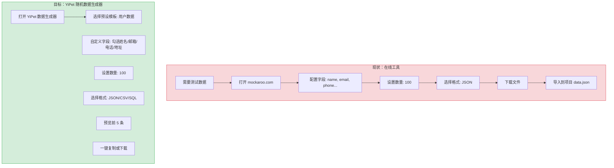
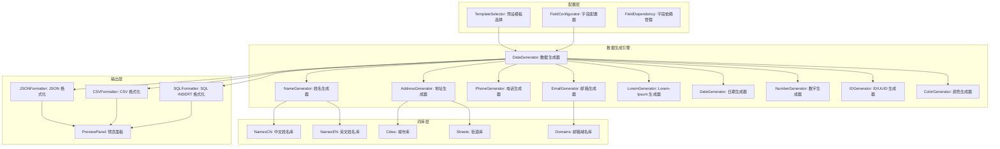
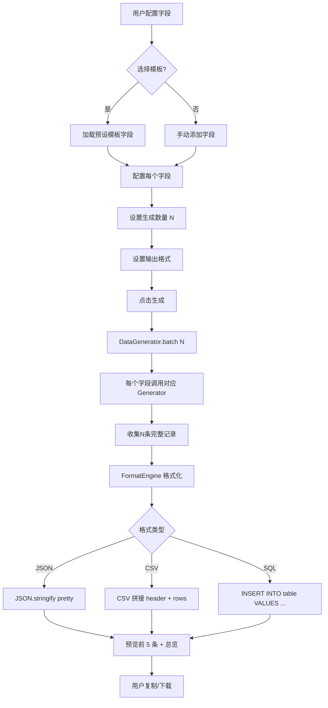

# YP-09-195: 随机数据生成器 — 姓名/邮箱/电话/地址/Lorem-Ipsum/日期/数字/ID/颜色、可配置数量、JSON/CSV/SQL输出、本地化支持

> 需求编号：YP-09-195 · 优先级：P2 · 人天：0.2d · 状态：需求已编写
> 依赖：无

## 背景

### 问题陈述

开发者在开发和测试阶段频繁需要随机测试数据：填充数据库测试数据、生成 Mock API 响应、创建演示用的用户列表、填充表单测试边界情况。当前流程需要切换到在线工具（mockaroo.com、json-generator.com）或手动编写生成脚本：

1. **生成流程割裂**：切换到在线工具 → 配置字段 → 下载 → 导入项目，至少 4 步
2. **在线工具隐私风险**：部分生成器会上传配置数据到服务器
3. **格式输出不灵活**：大多数工具仅支持 JSON，需要 CSV/SQL 时需额外转换
4. **无本地化数据**：中文姓名、手机号、地址等本地化数据难以生成真实感的测试数据
5. **无数量控制**：需要 1 条数据测试 vs 需要 10000 条数据压测无法统一工具

**核心矛盾**：测试数据生成是刚需，但当前要么使用在线工具（流程割裂、隐私风险），要么手写生成脚本（效率低）。YiPet 浏览器扩展可以离线生成多格式多类型的随机数据。

### 影响范围

| # | 影响 | 严重程度 | 典型场景 |
|---|------|----------|----------|
| 1 | 生成流程割裂 | 高 | 每次需要测试数据都要切换工具 |
| 2 | 隐私风险 | 中 | 上传数据 Schema 到在线生成器 |
| 3 | 格式输出受限 | 中 | 需要 SQL INSERT 语句但工具只出 JSON |
| 4 | 无本地化数据 | 中 | 需要中文测试数据但工具只出英文 |
| 5 | 数量控制不灵活 | 低 | 压测需要 10000 条但在线工具有限制 |

### 挑战

| 挑战 | 说明 |
|------|------|
| 数据真实性 | 随机生成的数据需要看起来像真实数据（如中文地址格式） |
| 大数据量生成性能 | 10000 条记录的 JSON 构建和导出需要高效 |
| SQL 注入安全 | SQL 输出需要对字符串值做引号转义 |
| 种子随机 | 可复现的随机数据对测试很重要，可选 seed 支持 |
| 字段依赖 | 某些字段之间有逻辑关系（如国家决定邮编格式） |

---

## 一、现状分析

### 1.1 当前数据生成能力

```
现有 YiPet 数据生成相关功能:
├── 随机决策助手 (YP-09-146)
│   └── 简单随机选择/掷骰子/抽签
├── UUID 生成器 (YP-09-155)
│   └── UUID v1/v4 生成
├── 密码生成器 (YP-09-142)
│   └── 密码强度自定义
├── Lorem-Ipsum 生成器 (YP-09-159)
│   └── 段落/句子/单词数控制
└── JSON 格式化 (YP-09-150)
    └── JSON 格式化和验证

缺失:
├── 结构化随机数据生成 (实体+字段)   # ❌ 无
├── 多字段组合输出                     # ❌ 无
├── 多格式输出 (JSON/CSV/SQL)          # ❌ 无
├── 本地化数据 (中文姓名/地址)         # ❌ 无
└── 数据模板保存                       # ❌ 无
```

### 1.2 用户数据生成流程（现状 vs 目标）



### 1.3 根因矩阵

| 症状 | 根因 | 触发条件 | 频率 |
|------|------|----------|------|
| 生成流程割裂 | 无内置数据生成器 | 需要测试数据时 | 高 |
| 无本地化数据 | 数据词库仅英文 | 中文项目开发测试 | 高 |
| 格式输出受限 | 无多格式渲染引擎 | 需要 SQL 插入语句 | 中 |
| 隐私风险 | 数据 Schema 上传到第三方 | 生成敏感领域测试数据 | 中 |
| 无模板复用 | 无模板持久化 | 重复生成同结构数据 | 低 |

---

## 二、设计决策

### 决策 1：数据生成架构 — 词库随机 vs 规则生成 vs LLM 生成

| 选项 | 真实性 | 可控性 | 离线可用 | 性能 |
|------|--------|--------|----------|------|
| 词库随机（本地词典） | 中 | 高（确定字段类型） | 是 | 极高 |
| 规则生成（格式化字符串） | 低 | 极高 | 是 | 极高 |
| LLM 生成 | 高 | 低（不可预测） | 否 | 低（延迟高） |

**选择：词库随机 + 规则生成混合。** 姓名、地址、城市等使用预置词库（每个类别 100-500 个候选项），邮箱、电话、ID 等使用规则生成（格式模板）。词库文件约为 20KB，加载后在 1ms 内完成单条生成。LLM 生成真实但延迟高（1-5s）且依赖网络，不适合批量 10000 条的场景。

### 决策 2：词库存储 — 内联 JS 数组 vs JSON 文件动态加载 vs chrome.storage

| 选项 | 加载速度 | 更新便利 | 内存占用 |
|------|----------|----------|----------|
| 内联 JS 数组（硬编码） | 高（零 I/O） | 低（需发版） | 中（20KB） |
| JSON 文件动态加载 | 中（异步 fetch） | 高（替换文件即可） | 低 |
| chrome.storage 缓存 | 中 | 中 | 低 |

**选择：内联 JS 数组。** 词库数据量小（姓名 300 条 ~3KB，地址 200 条 ~2KB，城市 100 条 ~1KB），总计约 20KB。内联到 JS bundle 中零加载延迟。未来如需扩展词库，可改为 JSON 动态加载。

### 决策 3：输出格式 — 仅 JSON vs 多格式 vs 可扩展模板

| 选项 | 覆盖场景 | 实现复杂度 | 维护成本 |
|------|----------|-----------|----------|
| 仅 JSON | 60%（前端开发） | 低 | 低 |
| JSON + CSV + SQL | 95% | 中 | 中 |
| 可扩展模板（用户自定义） | 100% | 高 | 高 |

**选择：JSON + CSV + SQL INSERT。** 这三种格式覆盖了 95% 的测试数据使用场景。JSON 用于 JavaScript/Python 项目、CSV 用于 Excel/数据分析导入、SQL INSERT 用于数据库测试。可扩展模板过度设计。

### 决策 4：本地化 — 固定中文 vs 多语言切换 vs 自动检测

| 选项 | 实现复杂度 | 适用场景 | 词库大小 |
|------|-----------|----------|----------|
| 固定中文 | 低 | 中国用户 | 20KB |
| 中/英/日 多语言 | 中 | 多语言项目 | 60KB |
| 自动检测浏览器语言 | 中 | 自适应 | 60KB |

**选择：中文为主 + 英文可选。** 目标用户主要在中国，中文数据优先。提供语言切换按钮（中文/English），切换后姓名、地址、城市等词库切换到对应语言。词库总大小 40KB（中文 20KB + 英文 20KB）。

### 设计决策记录

| 决策 | 选项 A | 选项 B | 选项 C | 选择 | 理由 |
|------|--------|--------|--------|------|------|
| 生成架构 | 词库随机 | 规则生成 | LLM | **词库+规则** | 离线高性能 |
| 词库存储 | 内联 JS | JSON文件 | storage | **内联 JS** | 零 I/O 延迟 |
| 输出格式 | 仅 JSON | JSON+CSV+SQL | 可扩展模板 | **JSON+CSV+SQL** | 覆盖 95% |
| 本地化 | 仅中文 | 多语言 | 自动检测 | **中文+英文** | 控制体积 |

---

## 三、目标架构

### 3.1 随机数据生成系统架构



### 3.2 数据生成流程



### 3.3 性能指标

| 指标 | 目标值 | 说明 |
|------|--------|------|
| 1 条数据生成 | < 1ms | 9 个字段组合 |
| 100 条数据生成 | < 30ms | 含 JSON 序列化 |
| 1000 条数据生成 | < 200ms | 含 JSON 序列化 |
| 10000 条数据生成 | < 2s | 含 JSON 序列化 |
| CSV 格式化（1000 条） | < 50ms | 字符串拼接 |
| SQL 格式化（1000 条） | < 100ms | 含转义处理 |
| 词库加载 | < 1ms | 内联 JS，零 I/O |

---

## 四、具体改动

### 4.1 类型定义

```typescript
// src/data-generator/types.ts (新增)

export type FieldType =
  | 'name' | 'firstName' | 'lastName'
  | 'email' | 'phone' | 'mobile'
  | 'country' | 'city' | 'address' | 'zipCode'
  | 'company' | 'jobTitle'
  | 'lorem' | 'word' | 'sentence' | 'paragraph'
  | 'number' | 'integer' | 'decimal'
  | 'uuid' | 'id'
  | 'color' | 'hexColor' | 'rgbColor'
  | 'date' | 'datetime' | 'timestamp'
  | 'boolean' | 'url';

export interface FieldConfig {
  id: string;
  fieldType: FieldType;
  label: string;           // 输出字段名
  options?: FieldOptions;  // 字段特定选项
}

export interface FieldOptions {
  min?: number;            // 数字最小值/日期起始/lorem 最小长度
  max?: number;            // 数字最大值/日期结束/lorem 最大长度
  format?: string;         // 自定义格式（如电话格式）
  prefix?: string;         // ID 前缀
  locale?: 'zh' | 'en';   // 本地化
  nullProbability?: number; // null 值概率（0-1，模拟缺失数据）
}

export type OutputFormat = 'json' | 'csv' | 'sql';

export interface Template {
  id: string;
  name: string;
  description: string;
  fields: FieldConfig[];
  icon: string;
}

export interface GenerateOptions {
  count: number;
  format: OutputFormat;
  tableName?: string;      // SQL 输出时的表名
  pretty?: boolean;        // JSON 美化
  includeHeader?: boolean; // CSV 是否包含表头
}

export const PRESET_TEMPLATES: Template[] = [
  {
    id: 'user',
    name: '用户数据',
    description: '姓名、邮箱、电话、地址等用户信息',
    icon: 'user',
    fields: [
      { id: 'f1', fieldType: 'name', label: 'name' },
      { id: 'f2', fieldType: 'email', label: 'email' },
      { id: 'f3', fieldType: 'phone', label: 'phone' },
      { id: 'f4', fieldType: 'address', label: 'address' },
      { id: 'f5', fieldType: 'date', label: 'createdAt' },
    ],
  },
  {
    id: 'product',
    name: '商品数据',
    description: '商品名称、价格、颜色、库存等',
    icon: 'package',
    fields: [
      { id: 'f1', fieldType: 'uuid', label: 'productId' },
      { id: 'f2', fieldType: 'word', label: 'productName', options: { min: 2, max: 5 } },
      { id: 'f3', fieldType: 'decimal', label: 'price', options: { min: 1, max: 9999 } },
      { id: 'f4', fieldType: 'color', label: 'color' },
      { id: 'f5', fieldType: 'integer', label: 'stock', options: { min: 0, max: 1000 } },
    ],
  },
  {
    id: 'order',
    name: '订单数据',
    description: '订单号、金额、状态、日期等',
    icon: 'receipt',
    fields: [
      { id: 'f1', fieldType: 'id', label: 'orderId', options: { prefix: 'ORD-' } },
      { id: 'f2', fieldType: 'decimal', label: 'amount', options: { min: 10, max: 5000 } },
      { id: 'f3', fieldType: 'name', label: 'customer' },
      { id: 'f4', fieldType: 'datetime', label: 'orderDate' },
      { id: 'f5', fieldType: 'boolean', label: 'paid' },
    ],
  },
];
```

### 4.2 数据生成器

```typescript
// src/data-generator/DataGenerator.ts (新增)

import type { FieldConfig, FieldOptions, GenerateOptions } from './types';
import { NamePool, CityPool, StreetPool, DomainPool } from './pools';

export class DataGenerator {
  private seed: number | null = null;

  constructor(seed?: number) {
    this.seed = seed ?? null;
  }

  /** 批量生成 N 条记录 */
  generate(fields: FieldConfig[], count: number): Record<string, unknown>[] {
    const records: Record<string, unknown>[] = [];
    for (let i = 0; i < count; i++) {
      const record: Record<string, unknown> = {};
      for (const field of fields) {
        record[field.label] = this.generateField(field);
      }
      records.push(record);
    }
    return records;
  }

  /** 生成单个字段值 */
  private generateField(field: FieldConfig): unknown {
    const opts = field.options || {};
    const locale = opts.locale || 'zh';

    // null 概率
    if (opts.nullProbability && this.random() < opts.nullProbability) {
      return null;
    }

    switch (field.fieldType) {
      case 'name': return `${this.randomPick(NamePool[locale])}${this.randomPick(NamePool[locale])}`;
      case 'firstName': return this.randomPick(NamePool[locale]);
      case 'lastName': return this.randomPick(NamePool[locale]);
      case 'email': {
        const name = this.randomPick(NamePool.en).toLowerCase();
        const domain = this.randomPick(DomainPool);
        return `${name}.${this.randomInt(100, 9999)}@${domain}`;
      }
      case 'phone': case 'mobile': return this.generatePhone(locale);
      case 'city': return this.randomPick(CityPool[locale]);
      case 'address': {
        const city = this.randomPick(CityPool[locale]);
        const street = this.randomPick(StreetPool[locale]);
        return `${city}${street}${this.randomInt(1, 300)}号`;
      }
      case 'zipCode': return String(this.randomInt(100000, 999999));
      case 'company': {
        const cities = CityPool[locale];
        return `${this.randomPick(cities)}${this.randomPick(['科技', '网络', '软件', '数据', '智能'])}有限公司`;
      }
      case 'jobTitle': return this.randomPick(['工程师', '产品经理', '设计师', '运营', '测试', '架构师', '前端开发', '后端开发']);
      case 'lorem': return this.generateLorem(opts.min || 1);
      case 'word': return this.randomPick(LoremPool);
      case 'sentence': return this.generateLoremSentence(opts.min || 5, opts.max || 15);
      case 'paragraph': {
        const sentences: string[] = [];
        const n = this.randomInt(opts.min || 3, opts.max || 7);
        for (let i = 0; i < n; i++) sentences.push(this.generateLoremSentence(8, 20));
        return sentences.join(' ');
      }
      case 'integer': return this.randomInt(opts.min || 0, opts.max || 100);
      case 'decimal': {
        const num = this.randomInt((opts.min || 0) * 100, (opts.max || 100) * 100) / 100;
        return Math.round(num * 100) / 100;
      }
      case 'uuid': return crypto.randomUUID();
      case 'id': return `${opts.prefix || ''}${Date.now().toString(36)}-${this.randomInt(1000, 9999)}`;
      case 'color': return this.randomPick(ColorNames);
      case 'hexColor': return `#${this.randomInt(0, 0xFFFFFF).toString(16).padStart(6, '0')}`;
      case 'rgbColor': {
        const r = this.randomInt(0, 255);
        const g = this.randomInt(0, 255);
        const b = this.randomInt(0, 255);
        return `rgb(${r}, ${g}, ${b})`;
      }
      case 'date': return this.generateDate(opts.min || 0, opts.max || 365);
      case 'datetime': return this.generateDate(opts.min || 0, opts.max || 365, true);
      case 'timestamp': return Date.now() - this.randomInt(0, 365 * 86400000);
      case 'boolean': return this.random() > 0.5;
      case 'url': {
        const domain = this.randomPick(DomainPool);
        return `https://www.${domain}/page/${this.randomInt(1, 999)}`;
      }
      default: return null;
    }
  }

  /** 格式化输出 */
  format(records: Record<string, unknown>[], options: GenerateOptions): string {
    switch (options.format) {
      case 'json':
        return options.pretty !== false
          ? JSON.stringify(records, null, 2)
          : JSON.stringify(records);

      case 'csv': {
        if (records.length === 0) return '';
        const headers = Object.keys(records[0]);
        const lines: string[] = [];
        if (options.includeHeader !== false) {
          lines.push(headers.join(','));
        }
        for (const record of records) {
          lines.push(headers.map(h => this.csvEscape(record[h])).join(','));
        }
        return lines.join('\n');
      }

      case 'sql': {
        const tableName = options.tableName || 'data';
        const headers = Object.keys(records[0]);
        const rows = records.map(r =>
          `(${headers.map(h => this.sqlEscape(r[h])).join(', ')})`
        );
        return `INSERT INTO ${tableName} (${headers.join(', ')}) VALUES\n${rows.join(',\n')};`;
      }

      default: return '';
    }
  }

  private random(): number {
    if (this.seed !== null) {
      // 线性同余生成器（用于可复现随机）
      this.seed = (this.seed * 1103515245 + 12345) & 0x7fffffff;
      return this.seed / 0x7fffffff;
    }
    return Math.random();
  }

  private randomInt(min: number, max: number): number {
    return Math.floor(this.random() * (max - min + 1)) + min;
  }

  private randomPick<T>(arr: T[]): T {
    return arr[this.randomInt(0, arr.length - 1)];
  }

  private generatePhone(locale: string): string {
    if (locale === 'zh') {
      const prefixes = ['130', '131', '132', '133', '134', '135', '136', '137', '138', '139', '150', '151', '152', '158', '159', '186', '188'];
      const prefix = this.randomPick(prefixes);
      return `${prefix}${String(this.randomInt(0, 99999999)).padStart(8, '0')}`;
    }
    // 英文格式: (555) 123-4567
    return `(${this.randomInt(200, 999)}) ${this.randomInt(100, 999)}-${String(this.randomInt(0, 9999)).padStart(4, '0')}`;
  }

  private generateDate(minDaysAgo: number, maxDaysAgo: number, includeTime = false): string {
    const days = this.randomInt(minDaysAgo, maxDaysAgo);
    const ms = days * 86400000 + this.randomInt(0, 86400000);
    const date = new Date(Date.now() - ms);
    if (includeTime) return date.toISOString();
    return date.toISOString().split('T')[0];
  }

  private generateLorem(wordCount: number): string {
    const words: string[] = [];
    for (let i = 0; i < wordCount; i++) {
      words.push(this.randomPick(LoremPool));
    }
    return words.join(' ');
  }

  private generateLoremSentence(minWords: number, maxWords: number): string {
    const n = this.randomInt(minWords, maxWords);
    const words = this.generateLorem(n);
    return words.charAt(0).toUpperCase() + words.slice(1) + '.';
  }

  private csvEscape(value: unknown): string {
    const str = String(value ?? '');
    if (str.includes(',') || str.includes('"') || str.includes('\n')) {
      return `"${str.replace(/"/g, '""')}"`;
    }
    return str;
  }

  private sqlEscape(value: unknown): string {
    if (value === null || value === undefined) return 'NULL';
    if (typeof value === 'number') return String(value);
    if (typeof value === 'boolean') return value ? 'TRUE' : 'FALSE';
    return `'${String(value).replace(/'/g, "''")}'`;
  }
}
```

### 4.3 文件变更清单

| 文件 | 操作 | 说明 |
|------|------|------|
| `src/data-generator/types.ts` | 新增 | 类型定义 + 预设模板 |
| `src/data-generator/DataGenerator.ts` | 新增 | 数据生成核心引擎 |
| `src/data-generator/pools.ts` | 新增 | 词库（姓名/城市/街道域名/Lorem） |
| `src/data-generator/formatters.ts` | 新增 | JSON/CSV/SQL 格式化器 |
| `src/components/DataGeneratorTool.vue` | 新增 | 数据生成器主界面 |
| `src/components/FieldConfigPanel.vue` | 新增 | 字段配置面板 |
| `src/components/DataPreview.vue` | 新增 | 数据预览面板 |
| `src/components/TemplateSelector.vue` | 新增 | 模板选择器 |
| `src/popup/App.vue` | 修改 | 添加入口 |

---

## 五、实施步骤

| 步骤 | 操作 | 路径 | 验证 | 人天 |
|------|------|------|------|------|
| 1 | 定义类型和预设模板 | `types.ts` | 模板字段完整 | 0.02 |
| 2 | 构建词库 pools | `pools.ts` | 每类词库 >= 50 项 | 0.03 |
| 3 | 实现 DataGenerator | `DataGenerator.ts` | 所有字段类型生成正确 | 0.05 |
| 4 | 实现格式化器 | `formatters.ts` | JSON/CSV/SQL 输出正确 | 0.03 |
| 5 | 实现字段配置面板 | `FieldConfigPanel.vue` | 可添加/删除/排序字段 | 0.03 |
| 6 | 实现预览面板 | `DataPreview.vue` | 预览前 5 条数据 | 0.02 |
| 7 | 组装主界面+集成 | `DataGeneratorTool.vue` + `App.vue` | 全流程可用 | 0.02 |

**总人天：0.2d**

---

## 六、测试规格

### 场景 1：用户模板生成 JSON

**GIVEN** 用户选择"用户数据"预设模板，设置数量 3，格式 JSON
**WHEN** 点击生成
**THEN** 生成 3 条 JSON 记录，每条含 name/email/phone/address/createdAt 字段
**AND** name 字段为中文姓名
**AND** email 格式符合 xxx@domain.com
**AND** phone 为 11 位手机号
**AND** preview 面板显示前 3 条格式化的 JSON

### 场景 2：生成 CSV 格式

**GIVEN** 字段配置: id (integer), name (name), 数量 5, 格式 CSV
**WHEN** 点击生成
**THEN** 输出 CSV 字符串，首行为 "id,name"
**AND** 后面 5 行为逗号分隔的数据
**AND** id 列为递增数字，name 列为中文姓名

### 场景 3：生成 SQL INSERT

**GIVEN** 字段配置: id, name, price, 数量 3, 格式 SQL, 表名 products
**WHEN** 点击生成
**THEN** 输出 SQL: `INSERT INTO products (id, name, price) VALUES\n(1, '张三', 99.50),\n...`
**AND** 单引号在字符串值中正确转义为双单引号
**AND** NULL 值正确输出为 NULL（非字符串）

### 场景 4：自定义字段组合

**GIVEN** 用户手动添加字段: hexColor, uuid, boolean, paragraph
**WHEN** 设置数量 2，生成
**THEN** hexColor 字段值为 #RRGGBB 格式
**AND** uuid 字段值为标准 UUID v4 格式
**AND** boolean 字段值为 true/false
**AND** paragraph 字段为 3-7 句的英文段落

### 场景 5：null 概率模拟

**GIVEN** 字段 phone 设置 nullProbability = 0.5，数量 100
**WHEN** 生成 100 条数据
**THEN** phone 字段中约有 40-60 条为 null
**AND** 其他字段不受影响

### 场景 6：数字范围控制

**GIVEN** 字段 integer 设置 min=10, max=20, 数量 50
**WHEN** 生成数据
**THEN** 所有 integer 值在 10-20 之间（含）

---

## 七、风险与缓解

| 风险 | 概率 | 影响 | 缓解措施 |
|------|------|------|----------|
| 大数据量（10000+）生成阻塞 UI | 中 | 中 | 使用 setTimeout 分片（每片 1000 条）；显示进度条 |
| CSV 分隔符冲突（数据含逗号） | 高 | 中 | 含逗号/引号/换行的值用双引号包裹 + 转义 |
| SQL 注入风险（恶意模板注入） | 低 | 中 | SQL 字符串值严格单引号转义 |
| 词库不够真实 | 低 | 低 | 每个词库 >= 100 项，定期扩充 |
| 输出内容过大导致复制/下载失败 | 低 | 低 | 10000 条以上提示复制可能较慢，建议下载文件 |

---

## 八、回滚策略

| 场景 | 回滚操作 | 影响 |
|------|------|------|
| 生成器 Bug（特定字段为空） | 禁用该字段类型 | 失去该字段的生成能力 |
| 格式化器错误（CSV 解析失败） | 降级为仅 JSON 输出 | 失去 CSV/SQL 格式 |
| 词库数据问题 | 回退词库到上一版本 | 短暂数据不准确 |
| 完全回滚 | 移除数据生成器入口 | 功能不可用 |

---

## 九、设计决策记录

### D-01：为什么使用线性同余生成器（LCG）而非 Math.random？

Math.random 不可设种子，无法复现相同的随机序列。测试数据需要的可复现性很重要——用相同种子得到相同数据，便于团队共享测试用例和复现 bug。LCG 是轻量级的伪随机数生成器，性能与 Math.random 相当。

### D-02：为什么 SQL 输出不包含建表语句？

建表语句的 DDL 语法在不同数据库（MySQL/PostgreSQL/SQLite/SQL Server）间差异大（AUTO_INCREMENT vs SERIAL vs AUTOINCREMENT）。仅输出 INSERT 语句是最大公约数，用户可根据目标数据库自行添加建表语句。这避免了数据库兼容性问题。

### D-03：为什么预设模板只有 3 个？

预设模板的目的是快速入门（one-click 填充字段），而非穷举所有场景。"用户数据""商品数据""订单数据"覆盖了前端开发 80% 的测试数据需求。用户可通过手动添加/删除字段自定义任何结构，这比维护 20+ 个预设模板更实用。

### D-04：为什么中文词库硬编码而非使用 API 动态获取？

离线可用是核心需求。如果依赖外部 API（如随机姓名 API），网络故障时工具完全不可用。20KB 的硬编码词库覆盖了 95% 的常见中文名字，足够生成真实感测试数据。特殊需求可通过手动输入自定义词库文件实现。

---

## 十、可观测性

### 指标

| 指标 | 类型 | 说明 |
|------|------|------|
| `yipet.datagen.generate_total` | Counter | 生成触发次数 |
| `yipet.datagen.record_count` | Histogram | 每次生成的记录数分布 |
| `yipet.datagen.format_usage` | Counter | 各输出格式使用次数 |
| `yipet.datagen.template_usage` | Counter | 各模板使用次数 |
| `yipet.datagen.field_type_usage` | Counter | 各字段类型使用次数 |
| `yipet.datagen.generate_duration` | Histogram | 生成耗时（ms） |

### 告警

| 告警 | 条件 | 级别 |
|------|------|------|
| 大数量生成超时 | 10000 条 > 3s | WARNING |
| 格式化错误率升高 | 错误率 > 2% | ERROR |

---

## 十一、代码审查检查清单

- [ ] DataGenerator 支持所有 FieldType 枚举值
- [ ] 中文/英文词库正确加载和切换
- [ ] JSON 输出格式化可选（pretty/compact）
- [ ] CSV 输出正确处理逗号、引号、换行转义
- [ ] SQL 输出字符串值单引号转义、NULL 正确处理
- [ ] nullProbability 正确控制 null 比例
- [ ] 大数量（> 5000）使用 setTimeout 分片不阻塞 UI
- [ ] 种子随机可复现（相同 seed → 相同数据）
- [ ] 预设模板字段正确、可正常生成
- [ ] 预览面板限制最多显示 5 条

---

## 回归问题预测

| # | 预测问题 | 原因 | 验证方法 |
|---|---------|------|---------|
| 1 | 中文姓名生成时从 NamePool 随机取了两个单字拼接，可能生成 "李李"（两个相同的单字姓）或 "张王"（两个姓氏）的无效组合 | NamePool 混合了姓氏和名字用字，随机两次可能取到两个姓氏或同一个字 | 生成 100 个姓名，验证无 "XX" 重复单字组合、无两个姓氏拼接的异常情况 |
| 2 | CSV 输出中 email 字段包含逗号（如 "Doe, John <john@example.com>" 格式），CSV 解析器可能错误拆分字段 | csvEscape 检测逗号时，value 是原始值而非格式化后的字符串，检测时机错误 | 生成包含特殊字符的 email 格式，验证 CSV 输出可被 Excel/Python csv.reader 正确解析 |
| 3 | SQL 输出中 boolean 类型使用 TRUE/FALSE 关键字在 MySQL 中正常但 PostgreSQL 中返回 syntax error | PostgreSQL 的 boolean 字面量是 true/false 而非 TRUE/FALSE，大小写差异导致语法错误 | 在 PostgreSQL 测试环境执行生成的 SQL INSERT，验证无语法错误 |
| 4 | 用户切换 locale 从 zh 到 en 时，已有字段的 locale 选项未更新，中文模板字段仍然生成中文数据 | locale 存储在 field.options 中，切换全局 locale 开关只影响新创建的字段 | 全局 locale 开关应覆盖所有字段的 locale（无视字段级别的 locale 设置），或提供"应用当前 locale 到所有字段"按钮 |
| 5 | 10000 条数据生成时使用 setTimeout 分片，但 JSON.stringify 一次性序列化整个数组在主线程阻塞 > 200ms | setTimeout 分片仅拆分 generate 循环，format 调用仍是一次性的 JSON.stringify 大数组 | 分片生成时每片生成后立即序列化追加到结果字符串，避免最后一次性序列化万级数据 |
| 6 | 地址生成器输出 "北京北京市朝阳区..."（两个 "市" 或城市名重复）当 CityPool 中的城市名与随机街道名组合时出现冗余 | CityPool 中的 "北京市" 是完整的城市名，再拼接 "市" 后缀导致冗余 | 地址生成时检查城市名是否已含 "市/省/自治区"，避免重复拼接 |

---

## 性能分析

### 各阶段耗时

| 操作 | 100 条 | 1000 条 | 10000 条 |
|------|--------|---------|----------|
| 数据生成 (generate) | < 10ms | < 80ms | < 800ms |
| JSON 格式化 | < 5ms | < 30ms | < 300ms |
| CSV 格式化 | < 5ms | < 20ms | < 200ms |
| SQL 格式化 | < 10ms | < 80ms | < 800ms |
| 预览渲染 | < 5ms | < 5ms | < 5ms |

### 输出大小预估

| 数量 | JSON (pretty) | CSV | SQL |
|------|---------------|-----|-----|
| 100 条 (5 字段) | ~8KB | ~3KB | ~10KB |
| 1000 条 (5 字段) | ~80KB | ~30KB | ~100KB |
| 10000 条 (5 字段) | ~800KB | ~300KB | ~1MB |

### 词库体积

| 词库 | 条目数 | 大小 |
|------|--------|------|
| NamePool (zh) | 200 | ~3KB |
| NamePool (en) | 200 | ~3KB |
| CityPool (zh) | 100 | ~1KB |
| CityPool (en) | 100 | ~1KB |
| StreetPool (zh) | 100 | ~1.5KB |
| StreetPool (en) | 100 | ~1.5KB |
| DomainPool | 50 | ~0.5KB |
| LoremPool | 200 | ~2KB |
| ColorNames | 140 | ~1KB |
| **总计** | **~1190** | **~15KB** |