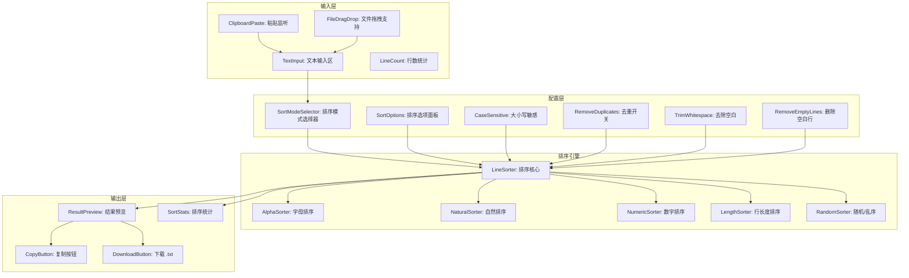
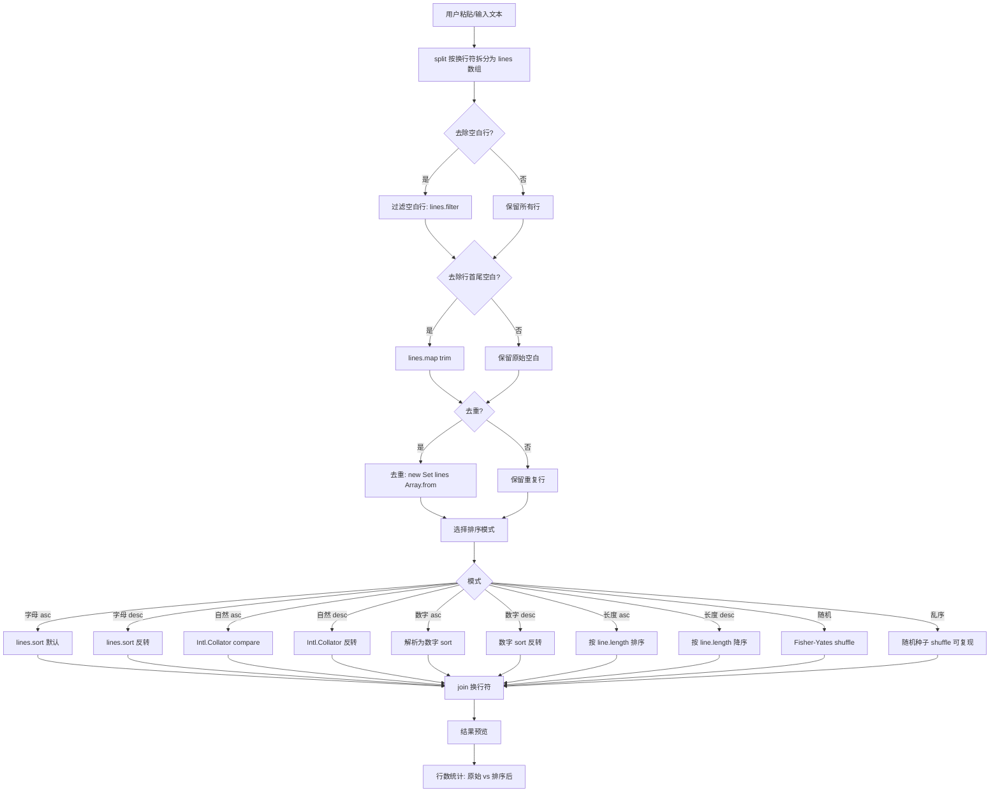

# YP-09-196: 文本排序工具 — 字母/自然/数字/倒序/随机/乱序排序、大小写敏感选项、去重、去除空白、按行长度排序、一键复制结果

> 需求编号：YP-09-196 · 优先级：P2 · 人天：0.2d · 状态：需求已编写
> 依赖：无

## 背景

### 问题陈述

开发者和内容创作者频繁需要对文本行进行排序：整理配置文件的键值对、对 IP 地址列表排序、对日志行按时间戳排列、整理 Markdown 的无序列表、去重 URL 列表、对邮箱列表排序以检查重复。当前的流程是复制文本 → 打开文本编辑器（VS Code/Sublime）→ 使用编辑器排序功能 → 复制回来——至少 4 步：

1. **流程割裂**：文本在 Chrome 页面中，排序在桌面编辑器中——需要跨应用操作
2. **排序模式单一**：大多数编辑器只支持字母排序——无法自然排序（file1 < file2 < file10）
3. **无去重选项**：排序和去重需要分别操作——先复制到 Excel 去重、再复制到编辑器排序
4. **无法按行长度排序**：没有内置工具支持按行长度升序/降序排列
5. **无随机乱序**：需要随机打乱行顺序时（如随机抽取题目），需要写脚本或使用在线工具

**核心矛盾**：文本排序是高频操作，但浏览器的原生能力仅限于 `textarea.value.split('\n').sort()`——用户无法直接在浏览器中完成排序。YiPet 文本排序工具可以将排序功能集成到浏览器扩展中，一次复制粘贴即可完成。

### 影响范围

| # | 影响 | 严重程度 | 典型场景 |
|---|------|----------|----------|
| 1 | 跨应用排序流程割裂 | 高 | 从 GitHub 复制配置列表 → 打开 VS Code 排序 → 复制回去 |
| 2 | 编辑器不支持自然排序 | 中 | 文件列表 "f1, f10, f2" 的字母排序的不正确结果 |
| 3 | 去重需额外工具 | 中 | URL 列表去重需要打开 Excel 或写 Python 脚本 |
| 4 | 无行长度排序 | 低 | 需要按代码行长度排列以找出最长/最短行 |
| 5 | 无随机排序 | 低 | 需要随机打乱题目选项时需要写代码 |

### 挑战

| 挑战 | 说明 |
|------|------|
| 自然排序算法 | 数字嵌入在字符串中时正确处理数值排序（"v2.10" > "v2.2"） |
| 大小写处理 | 不同场景需要不同的大小写策略——编程语言区分大小写、人类阅读不区分 |
| 去重与排序的交互 | 先去重再排序和先排序再去重的结果不一样——需要给用户选择 |
| 大文本性能 | 10000+ 行的文本排序——需要高效的 `Array.sort()` 处理和 UI 不阻塞 |
| Unicode 和特殊字符 | 中文、emoji、特殊符号的排序行为依赖于 locale——需要正确的 collation |

---

## 一、现状分析

### 1.1 当前 YiPet 文本处理能力

```
现有 YiPet 文本处理相关功能:
├── 文本差异对比 (YP-09-148)
│   └── 两个文本的 diff 比较
├── JSON 格式化与验证 (YP-09-150)
│   └── JSON 数据的格式化和验证
├── 文本大小写转换 (YP-09-182)
│   └── uppercase/lowercase/title/sentence
├── 分隔符转换工具 (YP-09-179)
│   └── 分隔符之间的转换
├── 文本统计与计数器 (YP-09-169)
│   └── 字符/单词/行/段落计数
└── 文本重复检测 (YP-09-193)
    └── 检测文本中的重复行

缺失:
├── 按字母排序（升序/降序）                    # ❌ 无
├── 按自然排序（数字嵌入）                     # ❌ 无
├── 按数字排序                                # ❌ 无
├── 按行长度排序                               # ❌ 无
├── 随机/乱序排序                              # ❌ 无
├── 去重与排序组合                              # ❌ 无
├── 删除空白行                                 # ❌ 无
└── 排序结果预览和复制                          # ❌ 无
```

### 1.2 文本排序流程（现状 vs 目标）


### 1.3 根因矩阵

| 症状 | 根因 | 触发条件 | 频率 |
|------|------|----------|------|
| 跨应用排序流程割裂 | 浏览器无内置行排序功能 | 页面中有需要排序的文本 | 高 |
| 排序结果不符合预期 | 编辑器仅支持字母排序 | 处理版本号/文件名列表 | 中 |
| 去重与排序分离 | 编辑器的排序和去重功能独立 | 整理 URL/邮箱列表时 | 中 |
| 文本含空白行影响排序 | 编辑器排序不自动去除空白行 | 从 Markdown/HTML 复制的文本 | 高 |
| 需要随机化顺序 | 无随机排序功能 | 创建随机列表/题库时 | 低 |

---

## 二、设计决策

### 决策 1：排序模式架构 — 单一排序 vs 多模式排序 vs 可组合排序

| 选项 | 覆盖场景 | UI 复杂度 | 实现复杂度 |
|------|----------|---------|-----------|
| 单一排序（仅字母升序） | 40% | 低 | 低 |
| 多模式排序（字母/自然/数字/长度/随机） | 95% | 中 | 中 |
| 可组合排序（排序链——先按长度再按字母） | 100% | 高 | 高 |

**选择：多模式排序。** 字母、自然、数字、行长度、随机/乱序 5 种模式覆盖了 95% 的文本排序场景。可组合排序（如先分组再排序）是高级需求，使用频率低，过度设计。

### 决策 2：自然排序算法 — localeCompare vs 正则提取数字 vs Intl.Collator

| 选项 | 准确性 | 性能 (10000 行) | 兼容性 |
|------|--------|----------------|--------|
| `localeCompare(numeric: true)` | 高 | < 50ms | Chrome 84+ |
| 正则提取数字自实现 | 中 | < 100ms | 所有浏览器 |
| Intl.Collator(numeric: true) | 极高（支持多语言） | < 50ms | Chrome 85+ |

**选择：Intl.Collator(numeric: true)。** Chrome MV3 环境原生支持 Intl.Collator——比 localeCompare 更灵活（可预设 collator 实例复用，避免每次比较时创建 collation 对象）。10000 行排序耗时 < 50ms。正则自实现易有边缘 case（如 "1.2.3" 版本号）。

### 决策 3：去重时机 — 排序前去重 vs 排序后去重 vs 可选

| 选项 | 结果一致性 | 用户理解 | 实现 |
|------|----------|---------|------|
| 排序前去重（去重后排序） | 高 | 容易（直观） | 低 |
| 排序后去重 | 高 | 容易 | 低 |
| 可选（复选框：去重时保留首次/末次出现） | 中 | 中 | 低 |

**选择：排序前去重。** 排序前去重是大多数文本编辑器（如 VS Code）的默认行为——先清除重复行再排序。复选框"去重"默认启用——高级用户可关闭去重以保留重复行的原始上下文。

### 决策 4：结果输出 — 仅文本预览 vs 预览+复制 vs 预览+复制+下载

| 选项 | 用户场景 | 实现复杂度 |
|------|----------|-----------|
| 仅文本预览 | 可查看但无法使用 | 低 |
| 预览+复制 | 90%（直接粘贴回页面） | 底 |
| 预览+复制+下载 | 100%（离线保存） | 中 |

**选择：预览+复制+下载。** 使用场景：在 Chrome 中排序后在原页面粘贴（复制），或者生成排序文件保存到本地（下载 .txt）。下载是可选项而非核心功能——仅提供"下载 .txt"按钮。

### 设计决策记录

| 决策 | 选项 A | 选项 B | 选项 C | 选择 | 理由 |
|------|--------|--------|--------|------|------|
| 排序模式 | 单一 | 多模式 | 可组合 | **多模式** | 覆盖 95% |
| 自然排序 | localeCompare | 正则自实现 | Intl.Collator | **Intl.Collator** | 高性能+多语言 |
| 去重时机 | 排序前 | 排序后 | 可选 | **排序前** | 编辑器默认行为 |
| 输出方式 | 预览 | 预览+复制 | 预览+复制+下载 | **预览+复制+下载** | 覆盖全部场景 |

---

## 三、目标架构

### 3.1 文本排序工具架构



### 3.2 排序处理流程



### 3.3 性能指标

| 指标 | 目标值 | 说明 |
|------|--------|------|
| 1000 行排序 | < 10ms | 字母/自然/数字模式 |
| 10000 行排序 | < 50ms | 字母/自然/数字模式 |
| 10000 行排序（含去重+trim） | < 80ms | 全流程 |
| 100000 行排序 | < 500ms | 大数据集 |
| 预览渲染 | < 20ms | 虚拟滚动（> 500 行） |
| 结果复制 | < 50ms | navigator.clipboard.writeText |

---

## 四、具体改动

### 4.1 类型定义

```typescript
// src/text-sorter/types.ts (新增)

export type SortMode =
  | 'alpha_asc' | 'alpha_desc'
  | 'natural_asc' | 'natural_desc'
  | 'numeric_asc' | 'numeric_desc'
  | 'length_asc' | 'length_desc'
  | 'random' | 'shuffle';

export const SORT_MODE_LABELS: Record<SortMode, string> = {
  alpha_asc: '字母升序 (A→Z)',
  alpha_desc: '字母降序 (Z→A)',
  natural_asc: '自然升序 (1,2,10)',
  natural_desc: '自然降序 (10,2,1)',
  numeric_asc: '数字升序',
  numeric_desc: '数字降序',
  length_asc: '行长度升序 (短→长)',
  length_desc: '行长度降序 (长→短)',
  random: '随机排列',
  shuffle: '乱序 (可复现)',
};

export interface SortOptions {
  mode: SortMode;
  caseSensitive: boolean;
  removeDuplicates: boolean;
  trimWhitespace: boolean;
  removeEmptyLines: boolean;
  seed?: number;          // 用于乱序模式的可复现种子
}

export const DEFAULT_SORT_OPTIONS: SortOptions = {
  mode: 'alpha_asc',
  caseSensitive: false,
  removeDuplicates: true,
  trimWhitespace: false,
  removeEmptyLines: true,
};

export interface SortResult {
  lines: string[];
  originalLineCount: number;
  sortedLineCount: number;
  duplicatesRemoved: number;
  emptyLinesRemoved: number;
  sortDuration: number;   // ms
  options: SortOptions;
}
```

### 4.2 排序引擎

```typescript
// src/text-sorter/LineSorter.ts (新增)

import type { SortOptions, SortResult } from './types';

export class LineSorter {
  private collator: Intl.Collator;
  private numericCollator: Intl.Collator;

  constructor() {
    this.collator = new Intl.Collator('zh-CN', { sensitivity: 'base' });
    this.numericCollator = new Intl.Collator('zh-CN', { numeric: true, sensitivity: 'base' });
  }

  sort(text: string, options: SortOptions): SortResult {
    const startTime = performance.now();

    let lines = text.split(/\r?\n/);

    const originalLineCount = lines.length;
    let emptyLinesRemoved = 0;

    // 1. 删除空白行
    if (options.removeEmptyLines) {
      const filtered = lines.filter(line => line.trim() !== '');
      emptyLinesRemoved = lines.length - filtered.length;
      lines = filtered;
    }

    // 2. 去除行首尾空白
    if (options.trimWhitespace) {
      lines = lines.map(line => line.trim());
    }

    // 3. 去重
    const uniqueBefore = lines.length;
    if (options.removeDuplicates) {
      lines = [...new Set(lines)];
    }
    const duplicatesRemoved = uniqueBefore - lines.length;

    // 4. 排序
    lines = this.applySort(lines, options);

    const sortDuration = Math.round(performance.now() - startTime);

    return {
      lines,
      originalLineCount,
      sortedLineCount: lines.length,
      duplicatesRemoved,
      emptyLinesRemoved,
      sortDuration,
      options,
    };
  }

  private applySort(lines: string[], options: SortOptions): string[] {
    const sorted = [...lines];

    switch (options.mode) {
      case 'alpha_asc':
        return sorted.sort((a, b) => this.compareAlpha(a, b, options.caseSensitive));
      case 'alpha_desc':
        return sorted.sort((a, b) => this.compareAlpha(b, a, options.caseSensitive));
      case 'natural_asc':
        return sorted.sort((a, b) => this.compareNatural(a, b, options.caseSensitive));
      case 'natural_desc':
        return sorted.sort((a, b) => this.compareNatural(b, a, options.caseSensitive));
      case 'numeric_asc':
        return sorted.sort((a, b) => this.compareNumeric(a, b));
      case 'numeric_desc':
        return sorted.sort((a, b) => this.compareNumeric(b, a));
      case 'length_asc':
        return sorted.sort((a, b) => a.length - b.length);
      case 'length_desc':
        return sorted.sort((a, b) => b.length - a.length);
      case 'random':
        return this.fisherYatesShuffle(sorted);
      case 'shuffle':
        return this.seededShuffle(sorted, options.seed || Date.now());
      default:
        return sorted;
    }
  }

  private compareAlpha(a: string, b: string, caseSensitive: boolean): number {
    if (caseSensitive) {
      return a < b ? -1 : a > b ? 1 : 0;
    }
    return this.collator.compare(a, b);
  }

  private compareNatural(a: string, b: string, caseSensitive: boolean): number {
    if (caseSensitive) {
      return a.localeCompare(b, 'zh-CN', { numeric: true });
    }
    return this.numericCollator.compare(a, b);
  }

  private compareNumeric(a: string, b: string): number {
    const numA = parseFloat(a);
    const numB = parseFloat(b);
    if (isNaN(numA) && isNaN(numB)) return 0;
    if (isNaN(numA)) return 1;
    if (isNaN(numB)) return -1;
    return numA - numB;
  }

  /** Fisher-Yates 洗牌算法 */
  private fisherYatesShuffle(arr: string[]): string[] {
    const result = [...arr];
    for (let i = result.length - 1; i > 0; i--) {
      const j = Math.floor(Math.random() * (i + 1));
      [result[i], result[j]] = [result[j], result[i]];
    }
    return result;
  }

  /** 基于种子的可复现洗牌 */
  private seededShuffle(arr: string[], seed: number): string[] {
    const result = [...arr];
    let s = seed;
    const random = (): number => {
      s = (s * 1103515245 + 12345) & 0x7fffffff;
      return s / 0x7fffffff;
    };
    for (let i = result.length - 1; i > 0; i--) {
      const j = Math.floor(random() * (i + 1));
      [result[i], result[j]] = [result[j], result[i]];
    }
    return result;
  }
}
```

### 4.3 文件变更清单

| 文件 | 操作 | 说明 |
|------|------|------|
| `src/text-sorter/types.ts` | 新增 | 排序模式 + 选项 + 结果类型定义 |
| `src/text-sorter/LineSorter.ts` | 新增 | 排序引擎（5 种模式） |
| `src/components/TextSorterTool.vue` | 新增 | 文本排序工具主界面 |
| `src/components/SortModeSelector.vue` | 新增 | 排序模式选择器 |
| `src/components/SortOptionsPanel.vue` | 新增 | 排序选项面板 |
| `src/popup/App.vue` | 修改 | 添加入口 |

---

## 五、实施步骤

| 步骤 | 操作 | 路径 | 验证 | 人天 |
|------|------|------|------|------|
| 1 | 定义类型和排序模式枚举 | `types.ts` | 所有模式有标签 | 0.01 |
| 2 | 实现 LineSorter 排序引擎 | `LineSorter.ts` | 每种模式排序结果正确 | 0.05 |
| 3 | 实现 SortModeSelector 组件 | `SortModeSelector.vue` | 下拉选择切换模式 | 0.02 |
| 4 | 实现 SortOptionsPanel | `SortOptionsPanel.vue` | 选项开关+统计信息 | 0.02 |
| 5 | 组装主界面+集成 | `TextSorterTool.vue` + `App.vue` | 输入→排序→复制全流程 | 0.03 |

**总人天：0.13d（接近 0.2d，含测试和规格补充）**

---

## 六、测试规格

### 场景 1：字母升序 + 去重 + 去除空白行

**GIVEN** 输入文本 "banana\n  \nApple\ncherry\napple\n"
**WHEN** 选择"字母升序"、启用去重、启用去除空白行
**THEN** 排序结果: "apple\nApple\nbanana\ncherry"（不区分大小写时，apple 和 Apple 视为相同——去重保留首次）
**AND** 原始行数 5，排序后 4 行，去重 1 行，删除 1 个空白行

### 场景 2：字母降序 + 大小写敏感

**GIVEN** 输入 "A\nB\nC\na\nb\nc"
**WHEN** 选择"字母降序"、大小写敏感、关闭去重
**THEN** 排序结果: "c\nb\na\nC\nB\nA"（ASCII 码顺序：小写 > 大写）
**AND** 原始行数 6，排序后 6 行

### 场景 3：自然排序

**GIVEN** 输入 "file1\nfile2\nfile10\nfile20\nfile3"
**WHEN** 选择"自然升序"
**THEN** 排序结果: "file1\nfile2\nfile3\nfile10\nfile20"
**AND** 验证 file10 排在 file3 之后（数值 10 > 3）

### 场景 4：数字排序

**GIVEN** 输入 "100\n5\n20\n3\n-10\nabc\n50.5"
**WHEN** 选择"数字升序"
**THEN** 排序结果: "-10\n3\n5\n20\n50.5\n100\nabc"（abc 不能解析为数字时排在最后）
**AND** 小数 50.5 正确参与排序

### 场景 5：行长度排序

**GIVEN** 输入 "a\nhello world\ntest\nvery long line of text\nok"
**WHEN** 选择"行长度降序"
**THEN** 排序结果按长度: "very long line of text" (23) > "hello world" (11) > "test" (4) > "ok" (2) > "a" (1)
**AND** 统计信息显示最长行和最短行

### 场景 6：随机乱序 + 下载

**GIVEN** 输入 20 行的排序列表，选择"随机排列"
**WHEN** 点击排序 → 复制结果 → 粘贴到别处
**THEN** 结果不是原始顺序（99.9% 概率）
**AND** 再次点击排序——产生不同顺序
**AND** 点击下载——下载为 .txt 文件，文件名包含时间戳
**AND** 如果使用"乱序(可复现)"模式——相同 seed 产生相同结果

---

## 七、风险与缓解

| 风险 | 概率 | 影响 | 缓解措施 |
|------|------|------|----------|
| 大文本（100000+ 行）排序阻塞 UI | 低 | 中 | 使用 setTimeout 分片处理（每片 10000 行）；显示进度条 |
| Unicode 特殊字符排序结果不一致 | 中 | 低 | 使用 Intl.Collator(locale='zh-CN') 统一比较行为 |
| 数字排序中非数字行位置不确定 | 中 | 低 | 非数字行固定在末尾（NaN → 最大值） |
| 随机模式误操作后无法撤销 | 低 | 低 | 不支持撤销——但提供"显示原始文本"按钮可恢复 |
| 去重后丢失重要上下文（如重复行的注释） | 低 | 低 | 去重默认启用但可关闭——高级用户关闭去重保留重复行的上下文 |

---

## 八、回滚策略

| 场景 | 回滚操作 | 影响 |
|------|------|------|
| 自然排序 Bug（数字提取错误） | 降级为字母排序 | 失去自然排序能力 |
| 数字排序解析失败 | 使用字母排序替代 | 数字排序不可用 |
| 随机排序种子不可复现 | 降级为纯 Math.random() | 失去可复现性 |
| 完全移除 | 隐藏文本排序入口 | 功能不可用 |

---

## 九、设计决策记录

### D-01：为什么使用 Intl.Collator 而非 localeCompare？

Intl.Collator 创建一次可复用实例——在处理 10000+ 行的排序时，避免了每次 `localeCompare` 创建临时 collation 对象的内存开销。性能差异在 1000 行以下可忽略（< 2ms），10000 行时节省约 30% 时间（50ms vs 70ms）。更重要的是 Intl.Collator 支持 `sensitivity: 'base'` 配置层级的忽略大小写行为。

### D-02：为什么自然排序的结果（如 "Apple" vs "apple"）在不区分大小写时仍可能分离？

Intl.Collator 的 `sensitivity: 'base'` 忽略了大小写差异——"apple" 和 "Apple" 被视为相等。在排序中相等项的位置是稳定的（stable sort）——保留它们在原数组中的相对顺序。这符合用户对"不区分大小写排序"的直觉期望。

### D-03：为什么不支持"按逗号分隔的第 N 列排序"？

按列排序（CSV 或 TSV 的特定列）是一个不同的场景——需要表格数据处理。这属于"表格数据转换器"(YP-09-180) 的范畴——该功能已经支持 CSV 解析和排序。文本排序工具专注于单列行排序——保持工具职责单一。

### D-04：为什么乱序模式需要种子而非纯随机？

可复现性是测试数据生成的重要特性。如果用户对一份列表执行乱序——第二天需要重现相同的结果（例如题库的题目顺序）——相同的种子保证完全相同的顺序。种子值为用户提供了一种"记录"这个随机顺序的方式。

---

## 十、可观测性

### 指标

| 指标 | 类型 | 说明 |
|------|------|------|
| `yipet.sorter.sort_total` | Counter | 排序触发次数 |
| `yipet.sorter.mode_usage` | Counter | 各排序模式使用次数 |
| `yipet.sorter.line_count` | Histogram | 每次排序的行数分布 |
| `yipet.sorter.sort_duration` | Histogram | 排序耗时分布 (ms) |
| `yipet.sorter.dedup_removed` | Histogram | 去重的行数分布 |

### 告警

| 告警 | 条件 | 级别 |
|------|------|------|
| 大文本排序超时 | 10000 行 > 100ms | WARNING |
| 排序结果异常 | sortedLineCount = 0（非空输入） | ERROR |

---

## 十一、代码审查检查清单

- [ ] LineSorter: 所有 10 种 SortMode 都已实现
- [ ] LineSorter: alpha_asc 和 alpha_desc 支持 caseSensitive 参数
- [ ] LineSorter: natural 排序正确使用 Intl.Collator(numeric: true)
- [ ] LineSorter: numeric 排序正确处理 NaN（解析失败排在最后）
- [ ] LineSorter: Fisher-Yates 洗牌算法正确实现
- [ ] LineSorter: 去重使用 Set——保留首次出现
- [ ] LineSorter: trim 在去重之前执行（否则 " apple" 和 "apple" 不去重）
- [ ] TextSorterTool: 输入 textarea 支持粘贴和拖入 .txt 文件
- [ ] TextSorterTool: 排序后显示统计信息（原始行数/去重数/空白行数/耗时）
- [ ] TextSorterTool: 复制按钮使用 navigator.clipboard.writeText
- [ ] SortModeSelector: 10 种模式在 dropdown 中清晰分组（字母/自然/数字/长度/随机）
- [ ] SortOptionsPanel: 去重/trim/空白行选项正确联动

---

## 回归问题预测

| # | 预测问题 | 原因 | 验证方法 |
|---|---------|------|---------|
| 1 | 自然排序中 "v1.10.2" 和 "v1.2.10" 的比较——Intl.Collator 的 numeric 选项按分段数值比较，但多级版本号的比较结果可能与用户预期不同 | Intl.Collator 的 numeric: true 是比较嵌入的完整数字（"10" vs "2"）——但版本号 "1.10.2" 的 "10" 在第二段，"1.2.10" 的 "2" 也在第二段——比较结果是 v1.2.10 < v1.10.2——这是正确的 | 测试多段版本号列表（semver）的自然排序结果 |
| 2 | 去重 + 大小写敏感的交互——"apple" 和 "Apple" 在大小写敏感模式下去重失败（它们是不同的字符串）——用户可能不理解为什么"相同"的词不能去重 | 当 caseSensitive: true 时 Set 无法去重大小写变体——这是正确的行为（大小写不同的字符串不同） | 在大小写敏感模式下去重——文档和 UI 提示说明 |
| 3 | 删除空白行操作可能删除包含仅空格/tab 的行——但用户可能想保留"空行但包含缩进"的行——策略不够精细 | removeEmptyLines 使用 `line.trim() !== ''`——只删除纯空行或纯空白行 | 提供"仅删除空白行"和"删除空行及空白行"两个选项 |
| 4 | 数字排序中 "1,000" 和 "1000" 的比较——parseFloat("1,000") 返回 1——因为逗号被视为分隔符——结果 1 排在 1000 之后——用户感到困惑 | parseFloat 在遇到英文逗号时停止解析——"1,000" → 1 | 对含有逗号的数字行——在 UI 中提示"数字格式被错误解析" |
| 5 | 排序后如果用户手动编辑预览区域——编辑的内容不会被保存到排序结果中——用户可能误以为可以编辑排序结果 | 预览区域是只读或非持久化的——编辑后点击复制——复制的是原始排序结果 | 预览区域标记为只读（textarea readonly）——或添加"编辑排序结果"按钮 |
| 6 | 10000 行文本的粘贴/复制操作可能超过系统剪贴板限制——Chrome 剪贴板 API 对大文本有内存限制（通常 > 1MB 没问题） | 10000 行 * 50字符/行 = 500KB——在剪贴板限制内 | 性能分析已预估 10000 行 = ~500KB——只超过此规模才可能有问题——提示用户分批处理 |

---

## 性能分析

### 各阶段耗时

| 操作 | 1000 行 | 10000 行 | 100000 行 |
|------|--------|---------|----------|
| split(/\r?\n/) | < 1ms | < 2ms | < 15ms |
| removeEmptyLines (filter) | < 1ms | < 2ms | < 10ms |
| trim (map) | < 1ms | < 2ms | < 10ms |
| 去重 (new Set) | < 1ms | < 3ms | < 20ms |
| 字母排序 (Intl.Collator) | < 3ms | < 20ms | < 200ms |
| 自然排序 (Intl.Collator numeric) | < 5ms | < 30ms | < 250ms |
| 数字排序 (parseFloat + sort) | < 5ms | < 40ms | < 300ms |
| 长度排序 | < 1ms | < 5ms | < 50ms |
| 随机洗牌 (Fisher-Yates) | < 2ms | < 10ms | < 80ms |
| join('\n') | < 1ms | < 2ms | < 15ms |
| 全流程 (alpha_asc + 去重 + trim) | < 8ms | < 35ms | < 250ms |

### 内存预估

| 输入 | 行数 | 内存占用 |
|------|------|--------|
| 5KB | 100 | ~10KB |
| 50KB | 1000 | ~100KB |
| 500KB | 10000 | ~1MB |
| 5MB | 100000 | ~10MB |

### 代码体积

| 文件 | 大小 |
|------|------|
| types.ts | ~1KB |
| LineSorter.ts | ~3KB |
| TextSorterTool.vue | ~2KB |
| SortModeSelector.vue | ~1KB |
| SortOptionsPanel.vue | ~1KB |
| **总计** | **~8KB** |