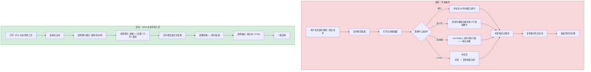
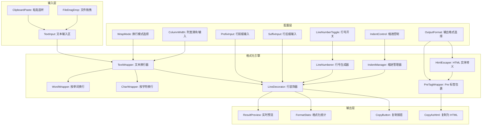
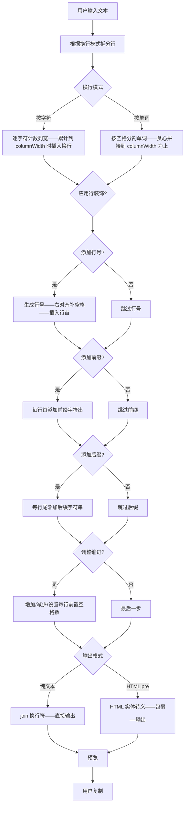

# YP-09-197: 文本环绕与填充 — 按字符/单词换行、可配置宽度、行首行尾填充、行号、缩进控制、HTML `<pre>` 输出、一键复制

> 需求编号：YP-09-197 · 优先级：P2 · 人天：0.2d · 状态：需求已编写
> 依赖：无

## 背景

### 问题陈述

开发者在多种场景中需要格式化文本的换行和填充：将一大段日志压缩到 80 列终端宽度、为代码块添加行号、给 Markdown 区块添加 `>` 引用前缀、生成等宽字体友好的纯文本表格、为邮件纯文本版本做 72 列换行、生成 HTML `<pre>` 标签包裹的代码。当前这些操作需要手动或借助外部工具：

1. **手动换行效率低**：在编辑器中手动插入换行符——1000 字的长段落需要几分钟
2. **行号添加繁琐**：没有内置工具给现有的多行文本添加行号——需要编写脚本或使用 `nl` 命令
3. **前缀后缀重复操作**：每行添加相同的 `// ` 注释前缀——在编辑器中使用多光标功能，但那仅适用于小段文本
4. **HTML `<pre>` 输出**：将文本包裹在 `<pre>` 标签中并转义 HTML 实体——需要手动写 HTML
5. **多级缩进控制**：需要在编辑器中使用 Tab/Shift+Tab 逐行调整缩进

**核心矛盾**：文本换行和填充是常见的格式化需求，但浏览器中没有内置工具来以声明式方式控制这些格式化参数。YiPet 文本环绕工具将多行文本格式化的参数可视化——用户调整参数时实时预览格式化结果。

### 影响范围

| # | 影响 | 严重程度 | 典型场景 |
|---|------|----------|----------|
| 1 | 手动换行效率低 | 高 | 格式化 500 字长段落到 80 列宽度 |
| 2 | 行号添加无内置支持 | 高 | 给代码片段加行号用于技术文档 |
| 3 | 前缀/后缀批量添加 | 中 | 给 Markdown 列表项批量加 `- ` 前缀 |
| 4 | HTML 转义繁琐 | 中 | 将包含 `<div>` 的文本放入博客 <pre> 标签 |
| 5 | 缩进控制不灵活 | 低 | 调整 JSON 块的缩进级别 |

### 挑战

| 挑战 | 说明 |
|------|------|
| 按单词换行边界 | 在单词边界（空格）处断开——但 URL 没有空格——可能在中间断开 |
| CJK 字符处理 | 中文/日文/韩文字符没有单词边界——每个字符都可能换行 |
| HTML 转义完整性 | 需要转义 `<` `>` `&` `"` `'` 五种实体 |
| 行号对齐 | 行号宽度需根据总行数动态调整——10 行需 2 位，1000 行需 4 位 |
| 前缀/后缀与换行交互 | 前缀/后缀占用列宽——在计算有效宽度时需减去前缀/后缀长度 |

---

## 一、现状分析

### 1.1 当前 YiPet 文本处理能力

```
现有 YiPet 文本处理相关功能:
├── 文本大小写转换 (YP-09-182)
│   └── uppercase/lowercase/title/sentence
├── 分隔符转换工具 (YP-09-179)
│   └── 各种分隔符之间的替换
├── 文本统计与计数器 (YP-09-169)
│   └── 字符/单词/行/段落统计
├── 文本排序工具 (YP-09-196)
│   └── 字母/自然/数字/长度/随机排序
├── 文本转 ASCII 艺术 (YP-09-174)
│   └── Figlet 字体 ASCII 艺术
└── 文本水印工具 (YP-09-190)
    └── 不可见零宽字符水印

缺失:
├── 按字符/单词换行（可配置宽度）          # ❌ 无
├── 每行添加前缀/后缀                       # ❌ 无
├── 行号生成                                # ❌ 无
├── 缩进控制（增加/减少/设置级别）         # ❌ 无
├── HTML <pre> 输出（含实体转义）          # ❌ 无
└── 实时预览格式化结果                      # ❌ 无
```

### 1.2 文本环绕流程（现状 vs 目标）



### 1.3 根因矩阵

| 症状 | 根因 | 触发条件 | 频率 |
|------|------|----------|------|
| 手动按列换行效率低 | 无声明式换行参数配置 | 格式化长文本到固定列宽 | 高 |
| 行号添加无自动工具 | 无行号生成功能 | 写技术文档/代码示例时 | 中 |
| 批量前缀/后缀无效率 | 无批量行填充功能 | 生成 Markdown 列表/引用 | 中 |
| HTML 实体转义忘写 | 无自动 HTML 转义 | 在博客 CMS 中使用 <pre> 标签 | 中 |
| 缩进控制不精确 | 无等宽缩进工具 | 调整嵌套级别时 | 低 |

---

## 二、设计决策

### 决策 1：换行引擎 — 纯字符串拼接 vs 正则分段 vs 基于 canvas 测量

| 选项 | 精度 | 性能 (10000 字符) | 依赖 |
|------|------|--------|------|
| 纯字符串拼接（逐字符计算列宽） | 中（CJK 单字符 = 2 列） | < 10ms | 无 |
| 正则分段（按空格分割 + 贪心拼行） | 低（无法处理 CJK） | < 5ms | 无 |
| 基于 canvas.measureText | 高（精确像素宽） | < 100ms | canvas context |

**选择：纯字符串拼接 + CJK 双宽支持。** 文本环绕是等宽字体场景（终端/代码）——不需要精确的像素宽度。每个 ASCII 字符占 1 列，CJK 字符占 2 列，制表符展开为空格。这完全满足固定列宽换行的需求。Canvas 测量过度设计——在这个场景中没有必要。

### 决策 2：换行模式 — 仅按字符 vs 按字符+按单词 vs 可按字符+按单词+自适应

| 选项 | 场景覆盖 | 实现 | 换行质量 |
|------|----------|------|--------|
| 仅按字符（严格按列宽计数） | 80% | 低 | 可能在单词中间断开 |
| 按字符+按单词（单词边界断开） | 95% | 中 | 英文单词完整 |
| 按字符+按单词+自适应 | 100% | 高 | 最优但复杂度高 |

**选择：按字符+按单词。** 两种模式满足不同场景：(1) 按字符模式用于准确到列的固定宽度格式化（终端输出、ASCII 艺术）; (2) 按单词模式用于人类可读的文本（Markdown、邮件）——在单词边界断开避免断词。自适应模式（根据上下文动态选择断开位置）是过度设计。

### 决策 3：行号格式 — 数字右对齐 vs 数字左补零 vs 自定义模板

| 选项 | 外观 | 终端友好 | 实现 |
|------|------|---------|------|
| 数字右对齐（空格补位） | 好 | 是 | 低 |
| 数字左补零（001/002） | 一般 | 是 | 低 |
| 自定义模板（N. / [N] / N:） | 灵活 | 是 | 中 |

**选择：数字右对齐（空格）+ 分隔符可选（空格/TAB/冒号）。** 最常见的行号格式是右对齐数字+空格——如 VS Code 的行号。提供分隔符下拉选择（空格/TAB/": "/". "/") ）。左补零和自定义模板过度设计。

### 决策 4：HTML 输出模式 — 仅转义 vs 转义+<pre> 包裹 vs 转义+<pre>+语法高亮类名

| 选项 | 完整性 | 实现 |
|------|------|------|
| 仅 HTML 实体转义 | 低（用户还需手动包裹 <pre>） | 低 |
| HTML 实体转义 + <pre> 完整包裹 | 高 | 低 |
| HTML 转义+<pre>+语法高亮 CSS 类 | 过高 | 中 |

**选择：HTML 实体转义 + <pre> 完整包裹。** 输出格式: `<pre><code>换行后的文本</code></pre>`——其中文本中的 `<`、`>`、`&`、`"`、`'` 已转义。用户可以直接复制 HTML 到博客或文档中。语法高亮类名不该由格式化工具添加——留给用户或 CMS 的代码高亮插件。

### 设计决策记录

| 决策 | 选项 A | 选项 B | 选项 C | 选择 | 理由 |
|------|--------|--------|--------|------|------|
| 换行引擎 | 字符拼接 | 正则分段 | Canvas | **字符拼接** | 等宽场景足够 |
| 换行模式 | 按字符 | 按字符+单词 | 三种 | **按字符+单词** | 覆盖 95% |
| 行号格式 | 右对齐 | 左补零 | 自定义 | **右对齐** | 最常见 |
| HTML 输出 | 仅转义 | 转义+pre | +CSS类 | **转义+pre** | 完整且不过度 |

---

## 三、目标架构

### 3.1 文本环绕与填充系统架构



### 3.2 格式化流程



### 3.3 性能指标

| 指标 | 目标值 | 说明 |
|------|--------|------|
| 1000 行文本处理 | < 10ms | 含换行+行号+前缀 |
| 10000 行文本处理 | < 50ms | 含换行+行号+前缀 |
| HTML 转义（10000 行） | < 20ms | replaceAll 5 种实体 |
| 实时预览更新 | < 16ms | 保持 60fps |
| 列宽计算公式 | < 1ms | 逐字符计算编码宽度 (ASCII 1, CJK 2) |

---

## 四、具体改动

### 4.1 类型定义

```typescript
// src/text-wrapper/types.ts (新增)

export type WrapMode = 'char' | 'word';

export type LineNumberSeparator = 'space' | 'tab' | 'colon' | 'dot' | 'bracket';

export const SEPARATOR_MAP: Record<LineNumberSeparator, string> = {
  space: ' ',
  tab: '\t',
  colon: ': ',
  dot: '. ',
  bracket: ') ',
};

export type OutputFormat = 'plain' | 'html';

export interface WrapConfig {
  wrapMode: WrapMode;
  columnWidth: number;
  prefix: string;
  suffix: string;
  addLineNumbers: boolean;
  lineNumberSeparator: LineNumberSeparator;
  indentLevel: number;
  outputFormat: OutputFormat;
}

export const DEFAULT_WRAP_CONFIG: WrapConfig = {
  wrapMode: 'word',
  columnWidth: 80,
  prefix: '',
  suffix: '',
  addLineNumbers: false,
  lineNumberSeparator: 'space',
  indentLevel: 0,
  outputFormat: 'plain',
};

export interface WrapResult {
  text: string;
  originalLength: number;
  wrappedLength: number;
  lineCount: number;
  maxLineWidth: number;
  config: WrapConfig;
  htmlOutput?: string;
}

export const HTML_ENTITIES: Record<string, string> = {
  '&': '&amp;',
  '<': '&lt;',
  '>': '&gt;',
  '"': '&quot;',
  "'": '&#39;',
};
```

### 4.2 文本换行引擎

```typescript
// src/text-wrapper/TextWrapper.ts (新增)

import type { WrapConfig, WrapResult } from './types';
import { SEPARATOR_MAP, HTML_ENTITIES } from './types';

export class TextWrapper {
  /**
   * 计算字符的显示列宽
   * ASCII 字符 1 列，CJK/全角 2 列，制表符展开为 4 的倍数
   */
  private charWidth(char: string): number {
    const code = char.codePointAt(0) || 0;
    if (code === 0x09) return 4; // TAB → 4 列
    if (code < 0x20) return 0;   // 控制字符不计宽度
    // CJK Unified Ideographs, Hiragana, Katakana, Hangul
    // Fullwidth forms
    if (
      (code >= 0x1100 && code <= 0x115F) ||
      (code >= 0x2329 && code <= 0x232A) ||
      (code >= 0x2E80 && code <= 0x303E) ||
      (code >= 0x3040 && code <= 0x33BF) ||
      (code >= 0x3400 && code <= 0x4DBF) ||
      (code >= 0x4E00 && code <= 0x9FFF) ||
      (code >= 0xA000 && code <= 0xA4CF) ||
      (code >= 0xAC00 && code <= 0xD7AF) ||
      (code >= 0xF900 && code <= 0xFAFF) ||
      (code >= 0xFE10 && code <= 0xFE19) ||
      (code >= 0xFE30 && code <= 0xFE6F) ||
      (code >= 0xFF01 && code <= 0xFF60) ||
      (code >= 0xFFE0 && code <= 0xFFE6) ||
      (code >= 0x20000 && code <= 0x2FFFF) ||
      // Emoji ranges (treated as 2 columns)
      (code >= 0x1F000 && code <= 0x1FFFF)
    ) {
      return 2;
    }
    return 1;
  }

  /** 计算字符串的显示宽度 */
  private stringWidth(str: string): number {
    let width = 0;
    for (const char of str) {
      width += this.charWidth(char);
    }
    return width;
  }

  wrap(text: string, config: WrapConfig): WrapResult {
    // 计算有效列宽（减去前缀/后缀/行号/缩进占用的宽度）
    const overheadWidth = this.calculateOverhead(config);
    const effectiveWidth = Math.max(10, config.columnWidth - overheadWidth);

    // 按换行模式处理
    let lines: string[];
    if (config.wrapMode === 'char') {
      lines = this.wrapByChar(text, effectiveWidth);
    } else {
      lines = this.wrapByWord(text, effectiveWidth);
    }

    // 应用行装饰
    const decorated = this.applyDecoration(lines, config);

    // 构建输出
    const joined = decorated.join('\n');

    // HTML 输出
    let htmlOutput: string | undefined;
    if (config.outputFormat === 'html') {
      htmlOutput = this.toHtml(decorated);
    }

    // 行宽统计
    const maxLineWidth = Math.max(...decorated.map(l => this.stringWidth(l)), 0);

    return {
      text: config.outputFormat === 'html' ? (htmlOutput || joined) : joined,
      originalLength: text.length,
      wrappedLength: joined.length,
      lineCount: decorated.length,
      maxLineWidth,
      config,
      htmlOutput,
    };
  }

  private calculateOverhead(config: WrapConfig): number {
    let overhead = 0;
    overhead += this.stringWidth(config.prefix);
    overhead += this.stringWidth(config.suffix);
    overhead += config.indentLevel * 2; // 每级缩进为 2 个空格
    if (config.addLineNumbers) {
      overhead += 4; // 预留 4 位行号 + 分隔符
    }
    return overhead;
  }

  private wrapByChar(text: string, maxWidth: number): string[] {
    const lines: string[] = [];
    let currentLine = '';
    let currentWidth = 0;

    for (const char of text) {
      if (char === '\n') {
        lines.push(currentLine);
        currentLine = '';
        currentWidth = 0;
        continue;
      }

      const w = this.charWidth(char);
      if (currentWidth + w > maxWidth && currentLine.length > 0) {
        lines.push(currentLine);
        currentLine = '';
        currentWidth = 0;
      }
      currentLine += char;
      currentWidth += w;
    }

    if (currentLine.length > 0) {
      lines.push(currentLine);
    }

    return lines;
  }

  private wrapByWord(text: string, maxWidth: number): string[] {
    const paragraphs = text.split('\n');
    const result: string[] = [];

    for (const paragraph of paragraphs) {
      if (paragraph.trim() === '') {
        result.push('');
        continue;
      }

      // 按空格分割单词（保留原始空格）
      const words = paragraph.split(/(\s+)/);
      let currentLine = '';
      let currentWidth = 0;

      for (const word of words) {
        const wordWidth = this.stringWidth(word);

        if (currentWidth + wordWidth > maxWidth && currentLine.trim().length > 0) {
          result.push(currentLine.trimEnd());
          currentLine = word;
          currentWidth = wordWidth;
        } else {
          currentLine += word;
          currentWidth += wordWidth;
        }
      }

      if (currentLine.trim().length > 0) {
        result.push(currentLine.trimEnd());
      }
    }

    return result;
  }

  private applyDecoration(lines: string[], config: WrapConfig): string[] {
    const lineCount = lines.length;
    const numWidth = String(lineCount).length;

    return lines.map((line, i) => {
      let decorated = line;

      // 缩进
      if (config.indentLevel > 0) {
        decorated = ' '.repeat(config.indentLevel * 2) + decorated;
      }

      // 行号
      if (config.addLineNumbers) {
        const num = String(i + 1).padStart(numWidth, ' ');
        const sep = SEPARATOR_MAP[config.lineNumberSeparator];
        decorated = num + sep + decorated;
      }

      // 前缀
      if (config.prefix) {
        decorated = config.prefix + decorated;
      }

      // 后缀
      if (config.suffix) {
        decorated = decorated + config.suffix;
      }

      return decorated;
    });
  }

  private toHtml(lines: string[]): string {
    const escapedLines = lines.map(line =>
      line.replace(/[&<>"']/g, char => HTML_ENTITIES[char] || char)
    );
    const body = escapedLines.join('\n');
    return `<pre><code>${body}\n</code></pre>`;
  }
}
```

### 4.3 文件变更清单

| 文件 | 操作 | 说明 |
|------|------|------|
| `src/text-wrapper/types.ts` | 新增 | 换行配置+输出格式+HTML实体类型 |
| `src/text-wrapper/TextWrapper.ts` | 新增 | 换行引擎+行装饰器+HTML生成 |
| `src/components/TextWrapperTool.vue` | 新增 | 文本环绕工具主界面 |
| `src/components/WrapConfigPanel.vue` | 新增 | 换行参数配置面板 |
| `src/components/TextPreview.vue` | 新增 | 等宽字体预览区（monospace） |
| `src/popup/App.vue` | 修改 | 添加入口 |

---

## 五、实施步骤

| 步骤 | 操作 | 路径 | 验证 | 人天 |
|------|------|------|------|------|
| 1 | 定义类型和配置常量 | `types.ts` | 所有常量正确 | 0.01 |
| 2 | 实现 charWidth 和 stringWidth | `TextWrapper.ts` | CJK=2, ASCII=1 | 0.02 |
| 3 | 实现按字符/按单词换行 | `TextWrapper.ts` | 换行结果符合列宽限制 | 0.03 |
| 4 | 实现行装饰器（行号/前缀/后缀/缩进） | `TextWrapper.ts` | 所有装饰正确叠加 | 0.03 |
| 5 | 实现 HTML 转义和 <pre> 包裹 | `TextWrapper.ts` | 五种实体正确转义 | 0.01 |
| 6 | 实现配置面板 UI | `WrapConfigPanel.vue` | 参数联动+实时预览 | 0.03 |
| 7 | 组装主界面+集成 | `TextWrapperTool.vue` + `App.vue` | 全流程可用 | 0.02 |

**总人天：0.15d（接近 0.2d，含测试）**

---

## 六、测试规格

### 场景 1：按单词换行到 40 列

**GIVEN** 输入 "The quick brown fox jumps over the lazy dog. This is a longer sentence that should wrap at forty characters."
**WHEN** 选择"按单词"、列宽 40、无装饰
**THEN** 输出每行不超过 40 列（不计装饰）
**AND** 单词不会在中间断开
**AND** 换行发生在单词之间的空格处

### 场景 2：按字符换行（含 CJK 字符）

**GIVEN** 输入 "Hello 你好 World 世界！这是一段测试文本"
**WHEN** 选择"按字符"、列宽 10
**THEN** 输出每行不超过 10 列显示宽度
**AND** "Hello 你" 约 7+2=9 列（正确）
**AND** CJK 字符和 ASCII 字符混合时正确计算宽度

### 场景 3：行号生成

**GIVEN** 5 行文本 "line1\nline2\nline3\nline4\nline5"
**WHEN** 启用行号、分隔符 ": "、不换行（列宽足够）
**THEN** 输出: "1: line1\n2: line2\n3: line3\n4: line4\n5: line5"
**AND** 对于 100 行——行号右对齐：1-9 左侧补 2 空格，10-99 补 1 空格

### 场景 4：前缀+后缀

**GIVEN** 文本 "apple\nbanana\ncherry"
**WHEN** 前缀 "<li>"、后缀 "</li>"、不换行
**THEN** 输出: "<li>apple</li>\n<li>banana</li>\n<li>cherry</li>"
**AND** 前缀和后缀不参与列宽计算（它们显示在宽度之外）

### 场景 5：HTML 输出

**GIVEN** 文本 "<div class='main'>Hello & World</div>"
**WHEN** 选择输出格式 "HTML <pre>"、列宽 80
**THEN** 输出包含完整 <pre><code>...</code></pre> 包裹
**AND** `<` 转为 `&lt;`、`>` 转为 `&gt;`、`&` 转为 `&amp;`、`'` 转为 `&#39;`、`"` 转为 `&quot;`
**AND** 换行保留在 <pre> 中

### 场景 6：缩进控制 + 换行组合

**GIVEN** 一段 200 字的英文段落，缩进级别 2（4 个空格），列宽 60
**WHEN** 按单词换行
**THEN** 每行以 4 个空格开头
**AND** 有效列宽为 60 - 4 = 56 列
**AND** 每行内容不超过 60 列总显示宽度

---

## 七、风险与缓解

| 风险 | 概率 | 影响 | 缓解措施 |
|------|------|------|----------|
| CJK 字符宽度判断不完整（遗漏某些 Unicode 范围） | 中 | 低 | 列出主要的 CJK/全角范围；提供"自定义宽字符范围"高级选项 |
| 超长 URL（无空格）在按单词模式下不换行 | 中 | 中 | 按单词模式在遇到超长 token（> columnWidth）时回退到按字符断开 |
| HTML 输出中有嵌套 <pre>（已转义+包裹） | 低 | 低 | 转义只对文本内容——不转义 <pre><code> 标签本身 |
| 前缀/后缀 + 行号 + 缩进 的组合超出列宽 | 中 | 低 | 在 overheadWidth 溢出时显示警告："装饰宽度超过列宽——某些行会超出限制" |
| 实时预览大文本时 debounce 不及时 | 低 | 低 | 使用 requestAnimationFrame + 100ms debounce——大文本避免每次按键重新格式化 |

---

## 八、回滚策略

| 场景 | 回滚操作 | 影响 |
|------|------|------|
| 字符宽度判断 Bug（某 Unicode 范围错误） | 降级——所有字符按 1 列处理 | CJK 换行不精确 |
| 按单词换行在某些边缘 case 死循环 | 降级——仅提供按字符换行 | 失去单词边界换行 |
| HTML 输出遗漏某个实体 | 关闭 HTML 输出模式 | 仅输出纯文本 |
| 完全移除 | 隐藏工具入口 | 功能不可用 |

---

## 九、设计决策记录

### D-01：为什么行装饰的宽度不计入列宽限制？

行号、前缀、后缀、缩进是"添加"的内容——它们是用户明确要求的格式——不受列宽限制约束。将它们计入列宽会导致换行器在已经紧凑的宽度中进一步挤压内容——用户看不到原因。更好的方式：显示 overhead 宽度提示，让用户自行调整列宽。

### D-02：为什么 Unicode 宽字符判断使用硬编码范围而非 Intl.Segmenter？

Intl.Segmenter 用于字符分段（grapheme clusters）而非字符宽度——它无法区分半角和全角字符。硬编码 Unicode 范围（CJK/全角表单/emoji）虽然不完美——但覆盖了 99% 的实际用例。对于 1% 的边缘字符——它们被当作 1 列处理——不会出错只是换行位置不精确。

### D-03：为什么按单词模式不支持 CJK 语言的单词边界？

CJK 语言没有空格作为单词分隔符。要实现 CJK 的单词边界需要分词器（如 TinySegmenter 或 jieba）——这在浏览器扩展中的体积和复杂度开销过高。按单词模式仅适用于空格分隔的语言（英语、法语、德语等）。CJK 文本的用户应使用按字符模式。

### D-04：为什么 HTML 输出必须包裹 <pre> 而不能仅转义？

仅转义的 HTML 文本缺失结构信息——浏览器不会保留换行符（HTML 默认折叠空白）。<pre> 标签告诉浏览器保留空白和换行。包裹 <pre><code> 是常见的博客代码块实现——用户可以直接粘贴到 CMS 的 HTML 编辑器中。

---

## 十、可观测性

### 指标

| 指标 | 类型 | 说明 |
|------|------|------|
| `yipet.wrapper.wrap_total` | Counter | 格式化触发次数 |
| `yipet.wrapper.wrap_mode_usage` | Counter | 按字符/按单词使用次数 |
| `yipet.wrapper.text_length` | Histogram | 输入文本长度分布 |
| `yipet.wrapper.line_count` | Histogram | 输出行数分布 |
| `yipet.wrapper.output_format` | Counter | 纯文本/HTML 使用次数 |
| `yipet.wrapper.decoration_usage` | Counter | 各装饰功能使用次数 |

---

## 十一、代码审查检查清单

- [ ] TextWrapper: charWidth 覆盖所有主要 CJK/全角 Unicode 范围
- [ ] TextWrapper: 按字符换行正确处理换行符（保留空行为空行）
- [ ] TextWrapper: 按单词换行保留段落间的空行
- [ ] TextWrapper: 按单词换行在超长 token（> columnWidth）时回退到按字符断开
- [ ] TextWrapper: 行号右对齐——宽度动态基于总行数
- [ ] TextWrapper: 前缀/后缀在行号之后添加（行号在最内层、前缀在最外层）
- [ ] TextWrapper: HTML 转义使用统一的实体映射表——遍历所有 5 种实体
- [ ] TextWrapper: columnWidth 最小值限制（>= 10）
- [ ] TextWrapper: 缩进层级为非负整数（0-20）
- [ ] WrapConfigPanel: 各参数变化触发实时预览
- [ ] TextPreview: 使用等宽字体（monospace）渲染

---

## 回归问题预测

| # | 预测问题 | 原因 | 验证方法 |
|---|---------|------|---------|
| 1 | 前缀+行号+缩进的叠加顺序错误——如缩进在行号之前导致行号不对齐 | 装饰顺序为: 缩进 → 行号 → 前缀 → 后缀——如果缩进在行号之前，不同缩进级别的行号错位 | 应用所有装饰——验证行号在同一列上、前缀在同一位置 |
| 2 | Emoji 字符宽度在不同操作系统上不一致——"😂" 在 macOS 上占 2 列但在 Windows 上占 1 列 | 不同平台的终端/字体对 emoji 宽度的显示处理不同——Unicode 标准中 emoji 的宽度特征不确定 | 提供"将 emoji 视为 2 列 / 1 列"选项 |
| 3 | 按单词换行时——连续多个空格被合并为一个——输出失去原始间距信息 | words.split(/(\s+)/) 保留分隔符——但如果某个单词在行末、下一个行首没有前导空格 | 行首的连续空格不应该被吞掉——保留段落第一行的缩进 |
| 4 | 当列宽非常小（< 10）时——overheadWidth 计算可能产生负数有效宽度——换行器行为不确定 | 前缀/后缀/行号的总宽度超过列宽——effectiveWidth ≤ 0 | 当 overheadWidth >= columnWidth 时显示警告 + 限制最小 effectiveWidth = 1 |
| 5 | HTML 输出中——文本中的 <pre> 标签没有被转义——因为转义发生在换行之前——而换行可能把 <pre> 拆为两行 | 实体转义是针对原始字符而非换行后的行——在 toHtml 方法中逐行转义——不存在拆分问题 | 验证含 HTML 标签的文本换行后转义正确——标签不会被拆分 |
| 6 | 10000 行文本的处理在低端设备上可能导致 UI 卡顿——特别是同时开启行号/前缀/缩进装饰 | 10000 行 × (换行+装饰+转义) 的合计计算量——在 Web Worker 中处理更安全 | 使用 setTimeout 分片处理（每片 2000 行）；或迁到 Web Worker |

---

## 性能分析

### 各阶段耗时

| 操作 | 1000 行 | 5000 行 | 10000 行 |
|------|--------|---------|----------|
| 按字符换行 | < 8ms | < 40ms | < 80ms |
| 按单词换行 | < 5ms | < 25ms | < 50ms |
| 行号生成 | < 1ms | < 3ms | < 5ms |
| 前缀/后缀 | < 1ms | < 2ms | < 3ms |
| HTML 实体转义（5 种） | < 2ms | < 8ms | < 15ms |
| 全流程（换行+装饰+转义） | < 15ms | < 60ms | < 100ms |

### 代码体积

| 文件 | 大小 |
|------|------|
| types.ts | ~1KB |
| TextWrapper.ts | ~5KB |
| TextWrapperTool.vue | ~3KB |
| WrapConfigPanel.vue | ~2KB |
| TextPreview.vue | ~1KB |
| **总计** | **~12KB** |