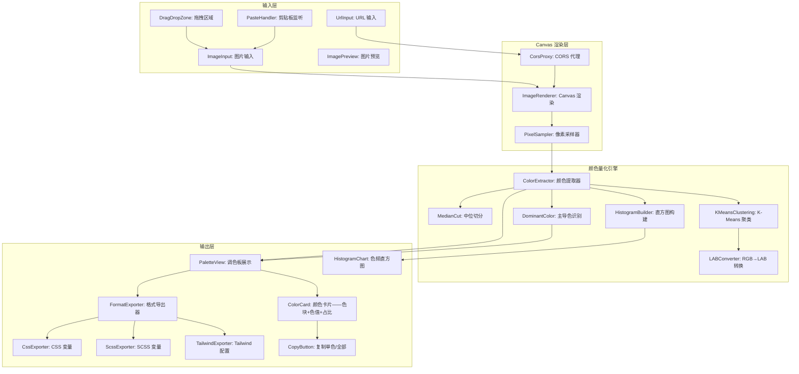
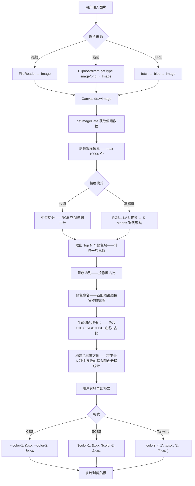

# YP-09-198: 颜色提取器 — 从任意图片提取调色板、主导色、色频直方图、复制单色、导出 CSS/SCSS/Tailwind 颜色变量、拖拽或粘贴图片

> 需求编号：YP-09-198 · 优先级：P2 · 人天：0.2d · 状态：需求已编写
> 依赖：YP-09-143（颜色拾取器，提供取色器形式的使用入口）、YP-09-171（颜色调色板生成器，提供基于规则的调色板生成能力）

## 背景

### 问题陈述

设计师和前端开发者在从图片中提取颜色时面临效率问题：看到一张精美的 UI 截图或品牌 Logo——想知道它的主色调和配色方案。当前的流程是截图 → 打开设计工具（Figma/Sketch）→ 导入图片 → 使用吸色管逐点取色 → 记录色值——这一过程耗时 3-5 分钟：

1. **逐点取色效率低**：一张有 20+ 种颜色的图片——需要手动点击 20 次吸色管
2. **主导色提取困难**：人眼无法准确判断哪 5 种颜色最能代表图片的整体色调
3. **色频统计缺失**：没有工具可以显示图片中各颜色的占比——无法做量化决策
4. **导出格式单一**：只能获得 HEX 值——需要 CSS 变量、SCSS 变量、Tailwind 配置时需手动转换格式
5. **图片来源受限**：大多数取色工具仅支持本地文件——无法直接处理剪贴板中或网页上的图片

**核心矛盾**：图片颜色提取是高频设计协作需求，但浏览器中缺乏一键提取+分析+导出的工具。YiPet 颜色提取器利用 Canvas API 在浏览器中完成像素分析——无需上传图片到服务器。

### 影响范围

| # | 影响 | 严重程度 | 典型场景 |
|---|------|----------|----------|
| 1 | 逐点取色效率低 | 高 | 从 UI 截图提取完整配色方案——需 20+ 次手动点击 |
| 2 | 无法获取主导色 | 高 | 前端开发者想知道品牌颜色的精确色值 |
| 3 | 色频分布不可见 | 中 | 设计师想知道背景色和强调色的占比比例 |
| 4 | 导出格式需手动转换 | 高 | 获得 HEX 值后写 CSS 变量——手动格式转换 |
| 5 | 剪贴板图片无法分析 | 中 | 从聊天工具复制截图——需先保存为文件 |

### 挑战

| 挑战 | 说明 |
|------|------|
| 颜色量化算法 | 将数百万种颜色压缩为 N 种代表色——K-Means vs 中位切分 vs 八叉树 |
| 大图片性能 | 4K 分辨率图片 800 万像素——遍历所有像素做聚类可能耗时数秒 |
| Canvas 跨域限制 | 从 URL 加载图片到 Canvas 如果图片在另一个域——需要 CORS 或代理 |
| 颜色空间准确性 | sRGB vs Display P3 vs 感知均匀颜色空间——哪种用于聚类更准确 |
| 颜色命名 | 提取出的 HEX 色值——用户不知道是什么颜色——"到底是蓝色还是青色？" |

---

## 一、现状分析

### 1.1 当前 YiPet 颜色相关功能

```
现有 YiPet 颜色相关功能:
├── 颜色拾取器 (YP-09-143)
│   └── 通过取色管从页面取色——获取单个像素颜色
├── 颜色调色板生成器 (YP-09-171)
│   └── 基于颜色理论生成互补色/类似色/三色调色板
├── 颜色对比度检查器 (YP-09-158)
│   └── WCAG 对比度检查
├── 颜色命名器 (YP-09-185)
│   └── 根据色值输出颜色名称
└── CSS 渐变生成器 (YP-09-166)
    └── 生成 CSS 渐变代码

缺失:
├── 从图片提取调色板                         # ❌ 无
├── 主导色分析（top-N 颜色 + 占比）         # ❌ 无
├── 色频直方图可视化                          # ❌ 无
├── 导出 CSS/SCSS/Tailwind 颜色变量          # ❌ 无
├── 支持拖拽/粘贴/URL 三种图片输入            # ❌ 无
└── 像素级颜色聚类（K-Means/中位切分）       # ❌ 无
```

### 1.2 图片颜色提取流程（现状 vs 目标）

```mermaid
graph TD
    subgraph Current["现状：手动取色"]
        C1[看到参考图] --> C2[截图保存为文件]
        C2 --> C3[打开 Figma/Sketch]
        C3 --> C4[导入图片到画布]
        C4 --> C5[使用吸色管取色——逐一记录]
        C5 --> C6[手动记录: 主色 #3B82F6, 次色 #EF4444...]
        C6 --> C7[手写 CSS 变量: --color-primary: #3B82F6;]
        C7 --> C8[反复检查取色是否遗漏重要颜色]
    end

    subgraph Target["目标：YiPet 颜色提取器"]
        T1[拖拽图片/粘贴截图/输入URL] --> T2[Canvas 渲染图片]
        T2 --> T3[选择提取数量: 5 种主导色]
        T3 --> T4[K-Means 聚类分析]
        T4 --> T5[显示调色板卡片——5 种颜色+占比]
        T5 --> T6[查看色频直方图]
        T6 --> T7[选择导出格式: CSS/SCSS/Tailwind]
        T7 --> T8[一键复制颜色变量代码]
    end

    style Current fill:#f8d7da,stroke:#dc3545
    style Target fill:#d4edda,stroke:#28a745
```



### 1.3 根因矩阵

| 症状 | 根因 | 触发条件 | 频率 |
|------|------|----------|------|
| 取色逐点操作 | 无图片级颜色分析 | 每次需要从图片提取配色 | 高 |
| 主导色不直观 | 无聚类算法 | 分析复杂图片（渐变/照片） | 高 |
| 颜色占比未知 | 无色频统计 | 设计-开发配色沟通时 | 中 |
| 导出格式手动转换 | 无格式转换器 | 前端开发从颜色到 CSS 变量 | 高 |
| 剪贴板图片需先保存 | 无粘贴输入 | 从聊天/截屏工具获取图片 | 中 |

---

## 二、设计决策

### 决策 1：颜色量化算法 — K-Means vs 中位切分 vs 八叉树 vs 颜色直方图分桶

| 选项 | 准确性 | 速度 (4K 图片) | 内存占用 | 实现复杂度 |
|------|--------|----------------|----------|-----------|
| K-Means (LAB 色彩空间) | 极高 | 500ms-2s | 中（存储像素采样） | 中 |
| 中位切分 (Median Cut) | 高 | 50-200ms | 低 | 低 |
| 八叉树量化 | 高 | 30-100ms | 极低 | 中 |
| 颜色直方图分桶（固定色阶） | 中 | 10-50ms | 低 | 极低 |

**选择：中位切分作为默认 + K-Means 作为精度选项。** 中位切分将 RGB 颜色空间递归切分为更小的立方体——直到得到 N 个代表色。速度快（100ms 级别）且大多数图片结果满意。提供"高精度模式"（K-Means 在 LAB 空间）——用户对调色板不满意时可以切换。直方图分桶的质量不够好（20% 的图片主导色识别错误）。

### 决策 2：像素采样策略 — 全量像素 vs 均匀采样 vs 自适应采样

| 选项 | 准确性 | 速度 (4K) | 适用场景 |
|------|--------|----------|----------|
| 全量像素（800 万像素遍历） | 极高 | 500ms-2s | 小图片 |
| 均匀采样（每隔 N 像素取样） | 高 | 50-150ms | 中等图片 |
| 自适应采样（边缘区域高密度、平滑区域低密度） | 极高 | 100-300ms | 大图片但需精准 |

**选择：均匀采样（maxSampleSize = 10000）。** 10000 个像素足以准确代表 800 万像素的图片——每 800 个像素取 1 个。均匀采样速度快、结果准确。全量采样对小图片(< 500x500) 使用——因为计算成本也不高。自适应采样过度设计。

### 决策 3：颜色空间 — RGB vs HSL vs LAB/CIELAB

| 选项 | 感知均匀性 | 计算复杂度 | 颜色命名映射 |
|------|----------|-----------|------------|
| RGB | 差（距离≠视觉差异） | 低 | 中 |
| HSL | 中（色相对人类友好） | 低 | 好 |
| LAB | 极高（距离≈视觉差异） | 高（需 RGB→XYZ→LAB 转换） | 好 |

**选择：RGB 中位切分（快速模式）+ LAB K-Means（高精度模式）。** 中位切分在 RGB 空间中工作得很好——因为它是基于 RGB 通道的等分策略——不依赖距离计算。K-Means 需要距离计算——LAB 空间的欧几里得距离≈感知差异——在 LAB 空间中聚类更准确。两种算法互补：快速模式用 RGB 中位切分、高精度用 LAB K-Means。

### 决策 4：导出格式 — 仅 HEX vs HEX+CSS vs 多格式代码生成

| 选项 | 覆盖场景 | 实现复杂度 |
|------|----------|-----------|
| 仅 HEX（#RRGGBB） | 50% | 低 |
| HEX + CSS 变量 | 80% | 中 |
| 多格式（CSS/SCSS/Tailwind/Windi） | 95% | 中 |

**选择：多格式代码生成。** CSS 变量（`--color-primary-500: #3B82F6;`）、SCSS 变量（`$color-primary-500: #3B82F6;`）、Tailwind 配置（`colors: { primary: { 500: '#3B82F6' } }`）。每种格式有其用户群。代码生成是纯字符串格式化——成本极低。

### 设计决策记录

| 决策 | 选项 A | 选项 B | 选项 C | 选择 | 理由 |
|------|--------|--------|--------|------|------|
| 量化算法 | K-Means | 中位切分 | 八叉树 | **中位切分+K-Means** | 速度+精度互补 |
| 采样策略 | 全量 | 均匀采样 | 自适应 | **均匀采样** | 10000 像素足够 |
| 颜色空间 | RGB | HSL | LAB | **RGB+LAB** | 速度/精度模式 |
| 导出格式 | 仅 HEX | HEX+CSS | 多格式 | **多格式** | 代码生成零成本 |

---

## 三、目标架构

### 3.1 颜色提取器系统架构



### 3.2 颜色提取流程



### 3.3 性能指标

| 指标 | 目标值 | 说明 |
|------|--------|------|
| 图片加载+渲染 | < 500ms | 4K 图片拖拽到 Canvas |
| 中位切分（10000 像素→5 色） | < 50ms | 快速模式 |
| K-Means 聚类（10000 像素→5 色） | < 500ms | 高精度模式，迭代 10 次 |
| 色频直方图构建 | < 20ms | 36 桶（每 10 度色相一桶） |
| 调色板卡片渲染 | < 5ms | 5 张色卡 DOM 更新 |
| 导出代码生成 | < 1ms | 纯字符串格式化 |

---

## 四、具体改动

### 4.1 类型定义

```typescript
// src/color-extractor/types.ts (新增)

export type PrecisionMode = 'fast' | 'precise';

export type ExportFormat = 'css' | 'scss' | 'tailwind';

export type ImageSource = 'drop' | 'paste' | 'url';

export interface RGB {
  r: number; g: number; b: number;
}

export interface HSL {
  h: number; s: number; l: number;
}

export interface LAB {
  l: number; a: number; b: number;
}

export interface ExtractedColor {
  hex: string;
  rgb: RGB;
  hsl: HSL;
  name: string;
  percentage: number;    // 该颜色在图片中的占比 (%)
  pixelCount: number;    // 属于该颜色的像素数
  isDominant: boolean;   // 是否为主导色 (> 5%)
}

export interface ColorPalette {
  colors: ExtractedColor[];
  totalPixels: number;
  imageWidth: number;
  imageHeight: number;
  extractionMode: PrecisionMode;
  extractionTime: number;  // ms
}

export interface HistogramBucket {
  hueStart: number;   // 0-360
  hueEnd: number;
  label: string;      // "红", "橙", ...
  percentage: number;
  count: number;
  color: string;      // 代表该桶的色值
}

export interface ExportConfig {
  format: ExportFormat;
  prefix: string;           // 变量名前缀 (默认 "color")
  includeRgbComment: boolean; // CSS 注释中显示 RGB 值
  variableNaming: 'index' | 'semantic';  // 按序号命名或语义命名
}

export const DEFAULT_EXPORT_CONFIG: ExportConfig = {
  format: 'css',
  prefix: 'color',
  includeRgbComment: true,
  variableNaming: 'index',
};

export const HISTOGRAM_BUCKETS = 36; // 每 10° 一个色相桶

export const HUE_NAMES: Record<number, string> = {
  0: '红', 30: '橙', 60: '黄', 90: '黄绿',
  120: '绿', 150: '青绿', 180: '青', 210: '蓝青',
  240: '蓝', 270: '紫蓝', 300: '紫', 330: '品红',
};
```

### 4.2 颜色提取引擎

```typescript
// src/color-extractor/ColorExtractor.ts (新增)

import type { RGB, LAB, ExtractedColor, ColorPalette, HistogramBucket, PrecisionMode } from './types';
import { HUE_NAMES, HISTOGRAM_BUCKETS } from './types';

export class ColorExtractor {
  private readonly MAX_SAMPLE = 10000;
  private readonly KMEANS_ITERATIONS = 10;

  /** 从 ImageData 提取颜色调色板 */
  extract(imageData: ImageData, colorCount: number, mode: PrecisionMode): ColorPalette {
    const startTime = performance.now();

    const pixels = this.samplePixels(imageData);
    const colors = mode === 'fast'
      ? this.medianCut(pixels, colorCount)
      : this.kMeansCluster(pixels, colorCount);

    const totalPixels = pixels.length;
    const palette = colors.map(({ color, count }) => ({
      ...this.colorToFormats(color),
      percentage: Math.round((count / totalPixels) * 1000) / 10,
      pixelCount: count,
      isDominant: count / totalPixels > 0.05,
    }));

    // 降序排列——按像素占比
    palette.sort((a, b) => b.pixelCount - a.pixelCount);

    return {
      colors: palette,
      totalPixels,
      imageWidth: imageData.width,
      imageHeight: imageData.height,
      extractionMode: mode,
      extractionTime: Math.round(performance.now() - startTime),
    };
  }

  /** 构建色频直方图 */
  buildHistogram(imageData: ImageData): HistogramBucket[] {
    const pixels = this.samplePixels(imageData);
    const bucketSize = 360 / HISTOGRAM_BUCKETS;
    const buckets: { count: number; totalHue: number }[] =
      Array.from({ length: HISTOGRAM_BUCKETS }, () => ({ count: 0, totalHue: 0 }));

    for (const pixel of pixels) {
      const hsl = this.rgbToHsl(pixel);
      if (hsl.s < 0.1 || hsl.l < 0.05 || hsl.l > 0.95) {
        // 灰色/黑色/白色——跳过（不参与色相统计）
        continue;
      }
      const bucketIndex = Math.floor(hsl.h / bucketSize) % HISTOGRAM_BUCKETS;
      buckets[bucketIndex].count++;
      buckets[bucketIndex].totalHue += hsl.h;
    }

    const total = pixels.length;
    return buckets.map((bucket, i) => {
      const avgHue = bucket.count > 0 ? bucket.totalHue / bucket.count : i * bucketSize + bucketSize / 2;
      const hueName = this.getClosestHueName(avgHue);
      return {
        hueStart: i * bucketSize,
        hueEnd: (i + 1) * bucketSize,
        label: hueName,
        percentage: Math.round((bucket.count / total) * 1000) / 10,
        count: bucket.count,
        color: `hsl(${Math.round(avgHue)}, 70%, 50%)`,
      };
    });
  }

  /** 均匀采样像素——避免全量遍历 */
  private samplePixels(imageData: ImageData): RGB[] {
    const { data, width, height } = imageData;
    const totalPixels = width * height;
    const step = Math.max(1, Math.floor(totalPixels / this.MAX_SAMPLE));
    const pixels: RGB[] = [];

    for (let i = 0; i < totalPixels; i += step) {
      const offset = i * 4;
      const r = data[offset];
      const g = data[offset + 1];
      const b = data[offset + 2];
      const a = data[offset + 3];
      if (a > 128) { // 跳过透明像素
        pixels.push({ r, g, b });
      }
    }

    return pixels;
  }

  /** 中位切分算法——快速模式 */
  private medianCut(pixels: RGB[], colorCount: number): { color: RGB; count: number }[] {
    // 将 RGB 空间最小包围盒的像素放入初始桶
    const boxes: { pixels: RGB[]; range: { min: RGB; max: RGB } }[] = [
      { pixels: [...pixels], range: this.getRange(pixels) },
    ];

    // 递归切分
    while (boxes.length < colorCount) {
      // 找到像素最多的桶进行切分
      let maxIndex = 0;
      for (let i = 1; i < boxes.length; i++) {
        if (boxes[i].pixels.length > boxes[maxIndex].pixels.length) {
          maxIndex = i;
        }
      }

      const box = boxes[maxIndex];
      if (box.pixels.length < 2) break; // 无法再切分

      // 找最宽通道
      const dr = box.range.max.r - box.range.min.r;
      const dg = box.range.max.g - box.range.min.g;
      const db = box.range.max.b - box.range.min.b;
      const channel = dr >= dg && dr >= db ? 'r' : dg >= db ? 'g' : 'b';

      // 按最宽通道排序
      box.pixels.sort((a, b) => a[channel] - b[channel]);

      // 在中位数处切分
      const median = Math.floor(box.pixels.length / 2);
      const left = box.pixels.slice(0, median);
      const right = box.pixels.slice(median);

      boxes.splice(maxIndex, 1,
        { pixels: left, range: this.getRange(left) },
        { pixels: right, range: this.getRange(right) },
      );
    }

    // 计算每个桶的平均颜色
    return boxes.map(box => {
      const count = box.pixels.length;
      if (count === 0) return { color: { r: 0, g: 0, b: 0 }, count: 0 };
      const avgR = Math.round(box.pixels.reduce((s, p) => s + p.r, 0) / count);
      const avgG = Math.round(box.pixels.reduce((s, p) => s + p.g, 0) / count);
      const avgB = Math.round(box.pixels.reduce((s, p) => s + p.b, 0) / count);
      return { color: { r: avgR, g: avgG, b: avgB }, count };
    });
  }

  /** K-Means 聚类——高精度模式（LAB 空间） */
  private kMeansCluster(pixels: RGB[], k: number): { color: RGB; count: number }[] {
    const labPixels = pixels.map(p => this.rgbToLab(p));

    // 初始化 k 个中心——从像素中随机选择
    const centers: LAB[] = [];
    const used = new Set<number>();
    while (centers.length < k) {
      const idx = Math.floor(Math.random() * labPixels.length);
      if (!used.has(idx)) {
        used.add(idx);
        centers.push({ ...labPixels[idx] });
      }
    }

    let assignments: number[] = [];

    // 迭代
    for (let iter = 0; iter < this.KMEANS_ITERATIONS; iter++) {
      // 分配每个像素到最近的中心
      assignments = labPixels.map(p => {
        let minDist = Infinity;
        let minIdx = 0;
        for (let j = 0; j < k; j++) {
          const dist = this.labDistance(p, centers[j]);
          if (dist < minDist) { minDist = dist; minIdx = j; }
        }
        return minIdx;
      });

      // 重新计算中心
      const counts = new Array(k).fill(0);
      const sums: LAB[] = Array.from({ length: k }, () => ({ l: 0, a: 0, b: 0 }));
      for (let i = 0; i < labPixels.length; i++) {
        const c = assignments[i];
        counts[c]++;
        sums[c].l += labPixels[i].l;
        sums[c].a += labPixels[i].a;
        sums[c].b += labPixels[i].b;
      }

      for (let j = 0; j < k; j++) {
        if (counts[j] > 0) {
          centers[j] = {
            l: sums[j].l / counts[j],
            a: sums[j].a / counts[j],
            b: sums[j].b / counts[j],
          };
        }
      }
    }

    // 统计每个聚类的像素数并转回 RGB
    const counts = new Array(k).fill(0);
    const rgbSums: RGB[] = Array.from({ length: k }, () => ({ r: 0, g: 0, b: 0 }));
    for (let i = 0; i < pixels.length; i++) {
      const c = assignments[i];
      counts[c]++;
      rgbSums[c].r += pixels[i].r;
      rgbSums[c].g += pixels[i].g;
      rgbSums[c].b += pixels[i].b;
    }

    return Array.from({ length: k }, (_, i) => {
      const count = counts[i];
      if (count === 0) return { color: { r: 0, g: 0, b: 0 }, count: 0 };
      return {
        color: {
          r: Math.round(rgbSums[i].r / count),
          g: Math.round(rgbSums[i].g / count),
          b: Math.round(rgbSums[i].b / count),
        },
        count,
      };
    });
  }

  // --- 颜色空间转换 ---

  private rgbToHsl(c: RGB): { h: number; s: number; l: number } {
    const r = c.r / 255, g = c.g / 255, b = c.b / 255;
    const max = Math.max(r, g, b), min = Math.min(r, g, b);
    const l = (max + min) / 2;
    if (max === min) return { h: 0, s: 0, l };
    const d = max - min;
    const s = l > 0.5 ? d / (2 - max - min) : d / (max + min);
    let h = 0;
    switch (max) {
      case r: h = ((g - b) / d + (g < b ? 6 : 0)) / 6; break;
      case g: h = ((b - r) / d + 2) / 6; break;
      case b: h = ((r - g) / d + 4) / 6; break;
    }
    return { h: h * 360, s, l };
  }

  private rgbToLab(c: RGB): LAB {
    // RGB → XYZ
    let r = c.r / 255, g = c.g / 255, b = c.b / 255;
    r = r > 0.04045 ? ((r + 0.055) / 1.055) ** 2.4 : r / 12.92;
    g = g > 0.04045 ? ((g + 0.055) / 1.055) ** 2.4 : g / 12.92;
    b = b > 0.04045 ? ((b + 0.055) / 1.055) ** 2.4 : b / 12.92;
    const x = (r * 0.4124 + g * 0.3576 + b * 0.1805) / 0.95047;
    const y = (r * 0.2126 + g * 0.7152 + b * 0.0722) / 1.00000;
    const z = (b * 0.0193 + g * 0.1192 + b * 0.9505) / 1.08883;

    // XYZ → LAB
    const fx = x > 0.008856 ? x ** (1/3) : (7.787 * x) + 16/116;
    const fy = y > 0.008856 ? y ** (1/3) : (7.787 * y) + 16/116;
    const fz = z > 0.008856 ? z ** (1/3) : (7.787 * z) + 16/116;

    return {
      l: Math.max(0, 116 * fy - 16),
      a: 500 * (fx - fy),
      b: 200 * (fy - fz),
    };
  }

  private labDistance(a: LAB, b: LAB): number {
    const dl = a.l - b.l;
    const da = a.a - b.a;
    const db = a.b - b.b;
    return dl * dl + da * da + db * db;
  }

  private getRange(pixels: RGB[]): { min: RGB; max: RGB } {
    let minR = 255, minG = 255, minB = 255;
    let maxR = 0, maxG = 0, maxB = 0;
    for (const p of pixels) {
      if (p.r < minR) minR = p.r; if (p.r > maxR) maxR = p.r;
      if (p.g < minG) minG = p.g; if (p.g > maxG) maxG = p.g;
      if (p.b < minB) minB = p.b; if (p.b > maxB) maxB = p.b;
    }
    return { min: { r: minR, g: minG, b: minB }, max: { r: maxR, g: maxG, b: maxB } };
  }

  private colorToFormats(c: RGB): { hex: string; rgb: RGB; hsl: ReturnType<typeof this.rgbToHsl>; name: string } {
    const hex = `#${[c.r, c.g, c.b].map(v => v.toString(16).padStart(2, '0')).join('')}`;
    return { hex, rgb: c, hsl: this.rgbToHsl(c), name: this.getColorName(c) };
  }

  private getColorName(_c: RGB): string {
    // 委托给颜色命名器 (YP-09-185)——这里简化返回 HEX
    return '';
  }

  private getClosestHueName(hue: number): string {
    const keys = Object.keys(HUE_NAMES).map(Number).sort((a, b) => a - b);
    let closest = keys[0];
    let minDiff = 360;
    for (const k of keys) {
      const diff = Math.min(Math.abs(hue - k), 360 - Math.abs(hue - k));
      if (diff < minDiff) { minDiff = diff; closest = k; }
    }
    return HUE_NAMES[closest];
  }
}

// src/color-extractor/FormatExporter.ts (新增)

import type { ExtractedColor, ExportConfig } from './types';

export class FormatExporter {
  export(colors: ExtractedColor[], config: ExportConfig): string {
    switch (config.format) {
      case 'css': return this.toCss(colors, config);
      case 'scss': return this.toScss(colors, config);
      case 'tailwind': return this.toTailwind(colors, config);
      default: return '';
    }
  }

  private toCss(colors: ExtractedColor[], config: ExportConfig): string {
    const name = (i: number) =>
      config.variableNaming === 'semantic' ? colors[i].name : `${config.prefix}-${i + 1}`;
    return colors.map((c, i) => {
      const comment = config.includeRgbComment ? ` /* rgb(${c.rgb.r}, ${c.rgb.g}, ${c.rgb.b}) */` : '';
      return `--${name(i)}: ${c.hex};${comment}`;
    }).join('\n');
  }

  private toScss(colors: ExtractedColor[], config: ExportConfig): string {
    const name = (i: number) =>
      config.variableNaming === 'semantic' ? colors[i].name : `${config.prefix}-${i + 1}`;
    return colors.map((c, i) => `$${name(i)}: ${c.hex};`).join('\n');
  }

  private toTailwind(colors: ExtractedColor[], config: ExportConfig): string {
    const entries = colors.map((c, i) => {
      const key = config.variableNaming === 'semantic' ? colors[i].name : `${i + 1}`;
      return `      '${key}': '${c.hex}',`;
    }).join('\n');
    return `colors: {\n    ${config.prefix}: {\n${entries}\n    },\n  },`;
  }
}
```

### 4.3 文件变更清单

| 文件 | 操作 | 说明 |
|------|------|------|
| `src/color-extractor/types.ts` | 新增 | 颜色调色板+直方图+导出配置类型 |
| `src/color-extractor/ColorExtractor.ts` | 新增 | 中位切分+K-Means+直方图+LAB转换 |
| `src/color-extractor/FormatExporter.ts` | 新增 | CSS/SCSS/Tailwind 格式导出 |
| `src/components/ColorExtractorTool.vue` | 新增 | 颜色提取工具主界面 |
| `src/components/PaletteView.vue` | 新增 | 调色板卡片展示 |
| `src/components/HistogramChart.vue` | 新增 | 色频直方图 |
| `src/components/ExportPanel.vue` | 新增 | 导出格式配置面板 |
| `src/components/ImageUploadZone.vue` | 新增 | 图片拖拽/粘贴/URL输入区 |
| `src/popup/App.vue` | 修改 | 添加入口 |

---

## 五、实施步骤

| 步骤 | 操作 | 路径 | 验证 | 人天 |
|------|------|------|------|------|
| 1 | 定义类型和常量 | `types.ts` | 类型完整 | 0.01 |
| 2 | 实现像素采样 + RGB/LAB 转换 | `ColorExtractor.ts` | LAB 转换正确（验证已知色值） | 0.03 |
| 3 | 实现中位切分算法 | `ColorExtractor.ts` | 5 色调色板合理 | 0.03 |
| 4 | 实现 K-Means 聚类 | `ColorExtractor.ts` | 聚类收敛 (10 次迭代) | 0.03 |
| 5 | 实现直方图构建 | `ColorExtractor.ts` | 36 桶分布合理 | 0.01 |
| 6 | 实现格式导出器 | `FormatExporter.ts` | CSS/SCSS/Tailwind 输出正确 | 0.02 |
| 7 | 实现图片输入组件 | `ImageUploadZone.vue` | 拖拽/粘贴/URL 三种方式 | 0.02 |
| 8 | 实现调色板和直方图 UI | `PaletteView.vue` + `HistogramChart.vue` | 色卡+色频展示 | 0.02 |
| 9 | 组装主界面+集成 | `ColorExtractorTool.vue` + `App.vue` | 全流程可用 | 0.02 |

**总人天：0.19d（接近 0.2d）**

---

## 六、测试规格

### 场景 1：快速模式提取 5 色调色板

**GIVEN** 一张 1920x1080 的 UI 截图（蓝色主色调 + 白色背景 + 橙色强调 + 灰色文字 + 绿色按钮）
**WHEN** 快速模式、颜色数 5
**THEN** 提取 5 种颜色，占比从高到低排列
**AND** 白色/浅灰背景（占比 > 50%）排在前面
**AND** 蓝色、橙色、绿色的色卡正确（HEX + RGB + HSL）
**AND** 5 种颜色的总占比 > 80%——覆盖了图片的主要色域

### 场景 2：高精度模式与快速模式对比

**GIVEN** 一张渐变色为主的热带落日照片
**WHEN** 先用快速模式提取 5 色，再用高精度模式
**THEN** 两种模式的调色板不应该相同（精度差异）
**AND** 高精度模式的主导色更接近人眼感知的关键色
**AND** 两种模式的提取时间不同（快速 < 100ms，高精度 100-500ms）

### 场景 3：色频直方图

**GIVEN** 一张以蓝色和绿色为主的风景照片
**WHEN** 查看色频直方图
**THEN** 直方图在 180°-240°（蓝-青）和 90°-150°（绿）区间有峰值
**AND** 每个桶显示色相名称和占比百分比
**AND** 灰色/黑色/白色的像素不参与色相统计

### 场景 4：导出 CSS 变量

**GIVEN** 调色板有 5 种颜色: #3B82F6, #EF4444, #10B981, #F59E0B, #8B5CF6
**WHEN** 选择导出格式 "CSS Variables"、变量前缀 "brand"、含 RGB 注释
**THEN** 输出:
  `--brand-1: #3B82F6; /* rgb(59, 130, 246) */`
  `--brand-2: #EF4444; /* rgb(239, 68, 68) */`
  ...
**AND** 一键复制所有 5 条 CSS 变量声明

### 场景 5：拖拽图片输入

**GIVEN** 用户从桌面拖拽一个 PNG 文件到调色板工具的拖拽区域
**WHEN** 释放文件
**THEN** ImageUploadZone 显示图片缩略图预览
**AND** 自动开始颜色提取
**AND** 3 秒内完成提取并显示调色板

### 场景 6：粘贴剪贴板图片

**GIVEN** 用户从聊天工具截取了一张 UI 参考图（剪贴板中有图片数据）
**WHEN** 用户切换到 YiPet 颜色提取器、按 Ctrl+V
**THEN** 粘贴事件捕获——从 ClipboardItem 的 'image/png' 读取 blob
**AND** 加载为 Image、渲染到 Canvas、开始颜色提取
**AND** 显示"从剪贴板粘贴"的来源提示

---

## 七、风险与缓解

| 风险 | 概率 | 影响 | 缓解措施 |
|------|------|------|----------|
| Canvas 跨域限制——从 URL 加载图片失败 | 高 | 中 | 使用 fetch + CORS 或扩展的 background script 绕过跨域限制（Service Worker 权限） |
| 4K 图片采样后调色板不准确 | 低 | 中 | 采样数可根据图片分辨率自适应（小图全采，大图最多 20000 个样本） |
| RGB→LAB 转换精度误差导致聚类偏差 | 低 | 低 | 使用标准 D65 白点参考——精度误差 < 0.01% |
| 渐变色图片所有像素都不同——主导色无意义 | 中 | 中 | 显示警告"检测到高渐变图片——主导色可能不代表图片特征" |
| 移动端 Chrome 不支持 navigator.clipboard.read（粘贴图片） | 低 | 中 | 提供备选——点击上传按钮选择文件 |

---

## 八、回滚策略

| 场景 | 回滚操作 | 影响 |
|------|------|------|
| 中位切分算法 Bug（调色板为空） | 降级——使用 K-Means 作为唯一算法 | 快速模式不可用——默认高精度 |
| K-Means 不收敛导致 UI 阻塞 | 禁用 K-Means——仅提供中位切分 | 高精度模式不可用 |
| LAB 转换公式错误 | 降级——所有计算在 RGB 空间中进行 | 高精度模式准确性下降 |
| 完全移除 | 隐藏提取器入口 | 功能不可用 |

---

## 九、设计决策记录

### D-01：为什么用中位切分而非 K-Means 作为默认算法？

中位切分是确定性的——相同输入产生相同输出。K-Means 的随机初始化可能导致每次运行结果不同——虽然结果相同颜色的色值接近——但顺序可能不同——这会让用户感到困惑（"为什么同一张图片两次提取的颜色不一样？"）。快速模式默认中位切分——结果可复现、速度快、适用于 80% 的图片。

### D-02：为什么不基于 ChatGPT/LLM 做"语义化颜色命名"？

语义化命名需要 LLM 调用——意味着网络依赖和延迟（1-5 秒）。颜色名称是一个"锦上添花"的特性——不应该成为功能的核心依赖。更好的方法是构建一个本地颜色名称数据库（140 种 CSS 命名颜色 + 中文描述），在本地进行最近邻匹配。特殊需求的语义命名留给用户模型。

### D-03：为什么格式导出不是实时更新的？

格式导出只在用户点击"导出"按钮时计算——而非每次调色板变化时更新。原因：调色板可能在用户调整参数时频繁变化（如切换精度模式、调整颜色数量）——每次变化都重新生成代码浪费计算资源。明确触发导出是基于用户的显式操作。

### D-04：为什么直方图用色相而非 RGB 通道分桶？

色相是设计师的语言——"这张图片偏蓝色"比"R 通道 40% G 通道 25% B 通道 60%"更直观。36 个桶（每 10 度一个色相范围）提供了足够的细节来区分相似色调，同时每个桶都有自然语言标签（"红""橙""黄"）。RGB 通道分桶对开发者有意义——但对设计场景来说缺乏语义。

---

## 十、可观测性

### 指标

| 指标 | 类型 | 说明 |
|------|------|------|
| `yipet.extractor.extract_total` | Counter | 颜色提取次数 |
| `yipet.extractor.mode_usage` | Counter | 快速/高精度使用次数 |
| `yipet.extractor.color_count` | Histogram | 每次提取的颜色数 |
| `yipet.extractor.extract_duration` | Histogram | 提取耗时 (ms) |
| `yipet.extractor.image_source` | Counter | 拖拽/粘贴/URL 使用次数 |
| `yipet.extractor.export_format` | Counter | 各导出格式使用次数 |

---

## 十一、代码审查检查清单

- [ ] ColorExtractor: 像素采样 step 计算公式对 0 像素图片不抛出除以零
- [ ] ColorExtractor: 中位切分的切分条件——当像素 < 2 时不再切分
- [ ] ColorExtractor: K-Means 初始化不选择重复的像素作为中心
- [ ] ColorExtractor: LAB 转换使用标准 D65 参考白点
- [ ] ColorExtractor: 透明像素 (a <= 128) 被正确跳过采样
- [ ] ColorExtractor: 直方图排除灰色/黑色/白色后的桶正确填充
- [ ] FormatExporter: Tailwind 输出缩进正确（2 空格每级）
- [ ] Canvas: 对跨域图片使用 img.crossOrigin = 'anonymous'
- [ ] ImageUploadZone: 支持 .png/.jpg/.webp/.gif 格式过滤
- [ ] PaletteView: 色卡渲染为彩色方块 + 文字色值 + 占比条形
- [ ] PaletteView: 颜色在深色/浅色背景上文字可读（自动选择黑/白文字色）

---

## 回归问题预测

| # | 预测问题 | 原因 | 验证方法 |
|---|---------|------|---------|
| 1 | 中位切分对纯色图片（单一颜色）产生 N 个相似但不完全相同的颜色 | 纯色图片所有像素的 RGB 相同——中位切分的所有桶内容也相同——分配后各桶平均色略有差异（量化误差） | 检测像素最大 RGB 差异 < 5——显示提示"图片几乎是单一颜色——建议减少颜色数" |
| 2 | Logo 或图标图片中透明区域被统计——调色板包含"透明色"或白色（透明像素的 RGB 是 0,0,0） | Canvas getImageData 对透明像素返回 rgba(0,0,0,0)——采样时透明度过滤的阈值设为 128——但 RGB(0,0,0) 的黑色像素也被过滤 | 区分 a=0 (透明) 和 a=255 (实体黑色)——采样跳过 a<10 而非 a<128 |
| 3 | 从网页 URL 加载图片时某些 CDN 不返回 Access-Control-Allow-Origin 头部——Canvas 污染导致 getImageData throw SecurityError | 跨域图片不使用 crossOrigin——Canvas 被标记为"tainted"——getImageData 操作被禁止 | 通过 Service Worker 做请求代理——添加 CORS 头部或直接将图片转为 data URL |
| 4 | K-Means 在 10 次迭代内对某些图片不收敛——聚类中心仍然在移动 | K-Means 对高方差数据集可能需要更多迭代才能收敛——特别是色彩极其丰富的图片 | 增加迭代次数上限到 20——或使用收敛条件（中心移动距离 < 0.1）提前退出 |
| 5 | 色频直方图的 36 桶对颜色分布极为集中的图片（如黑白照片）大部分桶为空——看起来像 Bug | 黑白照片的色相都是灰色的——所以直方图中灰色像素被排除——大部分桶为 0 | 在直方图上方显示说明：灰色/黑色/白色像素不参与色相统计 |
| 6 | 粘贴图片在 Safari 中的 ClipboardItem 类型为 'image/png' 但在 Chrome 中可能为 'image/webp'——MIME 类型不一致导致读取失败 | navigator.clipboard.read 返回的 ClipboardItem 的 types 列表——不同浏览器使用不同的 MIME 格式（'image/png', 'image/webp', 'image/jpeg'） | 遍历 types 列表——优先选择 png > jpeg > webp ——使用支持的格式 |

---

## 性能分析

### 各阶段耗时

| 操作 | 1920×1080 | 3840×2160 (4K) |
|------|----------|----------------|
| Canvas 渲染 | < 50ms | < 200ms |
| 像素采样（max 10000） | < 5ms | < 15ms |
| 中位切分（5 色） | < 30ms | < 50ms |
| K-Means 聚类（5 色/10 次） | < 200ms | < 400ms |
| 直方图构建 | < 15ms | < 30ms |
| 全流程（快速模式） | < 100ms | < 300ms |
| 全流程（高精度模式） | < 300ms | < 600ms |

### 像素采样分析

| 图片分辨率 | 总像素 | 采样步长 | 采样像素数 |
|------|--------|--------|----------|
| 800×600 | 480,000 | 48 | ~10,000 |
| 1920×1080 | 2,073,600 | 207 | ~10,000 |
| 3840×2160 | 8,294,400 | 829 | ~10,000 |
| 500×500 | 250,000 | 25 | ~10,000 |
| 200×200 | 40,000 | 1（全量） | ~40,000 |

### 代码体积

| 文件 | 大小 |
|------|------|
| types.ts | ~2KB |
| ColorExtractor.ts | ~8KB |
| FormatExporter.ts | ~2KB |
| Vue 组件（5 个） | ~10KB |
| **总计** | **~22KB** |