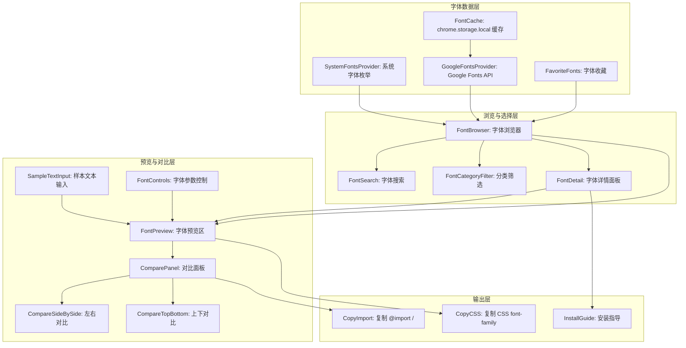

# YP-09-199: 字体预览器 — 系统字体列表、Google Fonts 浏览、自定义样本文本、字体大小/粗细/样式控制、对比预览、安装字体推荐

> 需求编号：YP-09-199 · 优先级：P2 · 人天：0.2d · 状态：需求已编写
> 依赖：无

## 背景

### 问题陈述

前端开发者和设计师在选择字体时，面临"无法预览"的问题：查看 Google Fonts 网站需要离开当前工作环境、无法对比系统字体和 Web 字体在同一段文本上的效果、需要写临时的 HTML 页面来对比 2-3 种字体。当前流程至少需要打开 3 个标签页：

1. **字体发现割裂**：需要打开 Google Fonts 浏览字体 → 打开另一个页面写测试代码 → 返回调整
2. **系统字体不可见**：Chrome 无法直接列出所有可用系统字体——用户不知道设备上安装了什么字体
3. **对比浏览困难**：很难将两种字体并排对比在同一段文本上的效果——通常需要截图拼接
4. **字体参数组合繁多**：font-size × font-weight × font-style × letter-spacing × line-height 的组合——每种组合都需要重新渲染
5. **Web 字体加载慢**：Google Fonts 的预览需要等待网络加载——在弱网环境下体验差

**核心矛盾**：字体选择是视觉决策——需要"看到"才能决定。但浏览器中没有内置工具支持字体预览和对比。YiPet 字体预览器利用 Chrome 的 `document.fonts` API 和 `localFonts` API 提供系统级和 Web 级字体的一站式预览。

### 影响范围

| # | 影响 | 严重程度 | 典型场景 |
|---|------|----------|----------|
| 1 | 字体发现流程割裂 | 高 | 切换 Google Fonts 标签 → 测试 → 返回浏览 |
| 2 | 系统字体不可见 | 高 | 想知道 macOS 上是否安装了 Inter 字体 |
| 3 | 无法并排对比 | 中 | 对比 Inter vs Roboto 在中文段落的渲染效果 |
| 4 | 字体参数调整繁琐 | 中 | 试 16px/400, 18px/500, 24px/700 三种组合 |
| 5 | 离线字体预览 | 中 | 在飞机上想查看已有字体——Google Fonts 不可用 |

### 挑战

| 挑战 | 说明 |
|------|------|
| 系统字体枚举 | Chrome MV3 需要通过 `navigator.fonts.query()` 或实验性 API 获取系统字体 |
| Google Fonts API 限制 | Google Fonts API 需要 API Key（免费层级 1000 req/day）——需要缓存机制 |
| 字体加载超时 | Web 字体加载可能失败或超时——需要降级显示回退字体 |
| 不同语言的字形覆盖 | 中文字体可能不支持英文字符——反之亦然——需要检测字形覆盖 |
| 字体对比的公平性 | 不同字体的字面大小不同——相同 font-size 可能有不同的视觉大小——需要调整 x-height 对齐 |

---

## 一、现状分析

### 1.1 当前字体相关资源和能力

```
浏览器原生能力:
├── document.fonts API
│   └── 查询已加载的字体——不列出系统字体
├── CSS font-family 回退链
│   └── 仅声明——无预览
├── ComputedStyle
│   └── 获取当前使用的字体——但只有 1 个
└── DevTools Font Editor
    └── 仅 DevTools 中有——非终端用户可用

现有 YiPet 相关功能:
├── 无字体相关功能
└── 无

缺失:
├── 系统字体列表浏览                        # ❌ 无
├── Google Fonts 浏览和搜索                  # ❌ 无
├── 字体实时预览（任意样本文本）            # ❌ 无
├── 字体并排对比                             # ❌ 无
├── 字体参数控制（大小/粗细/样式/间距）     # ❌ 无
├── 字体信息（字形数/语言覆盖/分类）        # ❌ 无
└── 字体收藏和推荐                           # ❌ 无
```

### 1.2 字体选择流程（现状 vs 目标）

```mermaid
graph TD
    subgraph Current["现状：多渠道切换"]
        C1[隐约觉得项目字体需要更换] --> C2[打开 Google Fonts 网站]
        C2 --> C3[浏览字体——翻页——点开字体详情]
        C3 --> C4[复制字体名称]
        C4 --> C5[打开临时 HTML/Codepen]
        C5 --> C6[写一段测试代码用这个字体]
        C6 --> C7[不满意——回到 C3 继续浏览]
        C7 --> C2
        C2 --> C8[最终选定 2-3 个候选]
        C8 --> C9[在 Codepen 中比较——打开 3 个标签页]
    end

    subgraph Target["目标：YiPet 字体预览器"]
        T1[打开 YiPet 字体预览器] --> T2[选择字体来源: 系统字体 / Google Fonts]
        T2 --> T3[搜索/浏览字体列表]
        T3 --> T4[点击字体——预览区实时渲染样本文本]
        T4 --> T5[调整参数: 大小/粗细/样式/间距]
        T5 --> T6{需要对比?}
        T6 -->|是| T7[添加对比面板——选择另一种字体]
        T6 -->|否| T8[满意——查看字体详情]
        T7 --> T9[并排预览——调整到视觉效果一致]
        T9 --> T8
        T8 --> T10[点击复制 CSS font-family]
        T10 --> T11[粘贴到项目的 CSS 文件]
    end

    style Current fill:#f8d7da,stroke:#dc3545
    style Target fill:#d4edda,stroke:#28a745
```



### 1.3 根因矩阵

| 症状 | 根因 | 触发条件 | 频率 |
|------|------|----------|------|
| 字体发现需切换标签 | 无内置 Web 字体浏览器 | 每次选择新字体时 | 高 |
| 系统字体不可见 | 无系统字体枚举 | 想知道有哪些字体可用时 | 中 |
| 无法并排对比 | 无对比预览模式 | 在 2-3 个候选间决策时 | 中 |
| 参数调整后需重新渲染 | 无实时参数控制 | 微调 font-weight 或 letter-spacing 时 | 中 |
| 离线预览不可用 | Google Fonts 需要网络 | 弱网或无网环境 | 低 |

---

## 二、设计决策

### 决策 1：字体来源 — 仅系统字体 vs 仅 Google Fonts vs 系统+Google

| 选项 | 离线可用 | 字体数量 | 实现复杂度 |
|------|----------|---------|-----------|
| 仅系统字体（localFonts API） | 是 | ~200-500 | 低 |
| 仅 Google Fonts | 否（需网络） | ~1600 | 中 |
| 系统字体 + Google Fonts | 系统字体离线 | ~2000 | 中 |

**选择：系统字体 + Google Fonts。** 系统字体离线可用——提供即时预览能力。Google Fonts 提供丰富的 Web 字体选择——需要网络但缓存搜索结果。两种数据源在 UI 中以两个 Tab 呈现："本机字体"和"Google Fonts"。

### 决策 2：Google Fonts 数据获取 — API vs 静态 JSON vs 搜索时查询

| 选项 | 数据新鲜度 | 网络开销 | 缓存策略 |
|------|----------|---------|---------|
| Google Fonts API（实时查询） | 极高 | 每次 100KB | 无缓存 |
| 静态 JSON 预编译列表 | 低（发版才更新） | 零 | 本地文件 |
| 首次加载 API + localStorage 缓存 7 天 | 中-高 | 首次 100KB | 自动过期 |

**选择：首次加载 API + localStorage 缓存 7 天。** 字体列表一个月不变——缓存一周足够保持新鲜。首次加载后后续打开速度极快。缓存自动过期机制简单——存储在 chrome.storage.local 中。

### 决策 3：字体预览渲染 — Canvas vs DOM font-face vs iframe

| 选项 | 灵活性 | 中文支持 | 加载字体 | 实现 |
|------|--------|---------|---------|------|
| Canvas fillText | 中 | 中（canvas 字体回退不可控） | 需手动管理 | 中 |
| DOM @font-face 动态注入 | 高 | 高（浏览器原生回退） | 自动 | 低 |
| iframe 隔离样式 | 高 | 高 | 需管理 iframe 样式 | 高 |

**选择：DOM @font-face 动态注入。** 系统字体已经在浏览器字体栈中——只需要设置 font-family。Google Fonts 通过注入 `<link>` 标签加载——浏览器自动处理 @font-face 的加载和回退。比 Canvas 灵活——支持所有 CSS 字体属性（letter-spacing, line-height, text-transform）。

### 决策 4：对比模式 — 上下排列 vs 左右排列 vs 重叠对比

| 选项 | 视觉比较 | 空间效率 | 适用场景 |
|------|----------|---------|---------|
| 上下排列（A 在上 B 在下） | 中（需上下移动视线） | 中 | 长文本对比 |
| 左右排列（A 在左 B 在右） | 高（并排） | 低（较窄） | 短文本对比 |
| 重叠对比（B 半透明覆盖 A） | 极高（直接叠加） | 高 | 精确字形差异 |

**选择：左右排列（可切换为上下）。** 左右并排是设计师最习惯的对比方式——"哪种字体作为标题更好？"。选项下拉提供"上下排列"切换——适用于长文本（如段落）的对比。重叠对比虽然精确——但对非字体设计师的用户来说不够直观。

### 设计决策记录

| 决策 | 选项 A | 选项 B | 选项 C | 选择 | 理由 |
|------|--------|--------|--------|------|------|
| 字体来源 | 仅系统 | 仅 Google | 系统+Google | **系统+Google** | 离线+丰富 |
| Google Fonts 数据 | API 实时 | 静态 JSON | 缓存 7 天 | **缓存 7 天** | 性能+新鲜度 |
| 预览渲染 | Canvas | DOM | iframe | **DOM** | 原生 CSS 支持 |
| 对比模式 | 上下 | 左右 | 重叠 | **左右+上下** | 按场景可切换 |

---

## 三、目标架构

### 3.1 字体预览器系统架构



### 3.2 字体加载与预览流程

```mermaid
graph TD
    A[用户选择字体] --> B{字体来源}
    B -->|系统字体| C[设置 DOM font-family: "Font Name"]
    B -->|Google Fonts| D{缓存中有?}
    D -->|是| E[从缓存读取 @font-face URL]
    D -->|否| F[Google Fonts API: 获取字体变体和 URL]
    F --> G[写入缓存: chrome.storage.local]
    G --> E
    E --> H[动态创建 link: <link href="URL" rel="stylesheet">]
    H --> I[document.fonts.load 等待字体加载]
    C --> J[立即显示预览——系统字体立即可用]
    I --> K{加载成功?}
    K -->|是| L[显示预览——Web 字体可用]
    K -->|超时 5s| M[显示回退字体——sans-serif]
    L --> N[用户调整控制参数]
    M --> N
    J --> N
    N --> O[font-size: 16-72px 滑块]
    O --> P[font-weight: 100-900 下拉]
    P --> Q[font-style: normal/italic]
    Q --> R[letter-spacing: -2~10px]
    R --> S[line-height: 1.0-2.5]
    S --> T[text-transform: none/uppercase/lowercase/capitalize]
    T --> U[预览区实时更新]
```

### 3.3 性能指标

| 指标 | 目标值 | 说明 |
|------|--------|------|
| 系统字体列表加载 | < 100ms | localFonts API 查询 |
| Google Fonts 缓存命中加载 | < 50ms | chrome.storage.local 读取 |
| Google Fonts API 首次请求 | < 2s | 网络请求 + 解析 > 1600 条 |
| Web 字体加载时间 | < 2s | 从 Google CDN 加载字体文件 |
| 预览参数调整响应 | < 16ms | CSS 属性实时更新 |

---

## 四、具体改动

### 4.1 类型定义

```typescript
// src/font-previewer/types.ts (新增)

export type FontSource = 'system' | 'google';

export interface FontInfo {
  family: string;
  source: FontSource;
  category: FontCategory;
  variants: FontVariant[];
  subsets: string[];         // 字符集: latin, latin-ext, cyrillic, chinese-simplified...
  popularity?: number;       // Google Fonts 热度排名
  designer?: string;
  license?: string;
  previewUrl?: string;       // Google Fonts 预览图
  cachedAt?: number;         // 缓存时间戳
}

export type FontCategory = 'serif' | 'sans-serif' | 'monospace' | 'handwriting' | 'display';

export const CATEGORY_LABELS: Record<FontCategory, string> = {
  serif: '衬线体',
  'sans-serif': '无衬线体',
  monospace: '等宽体',
  handwriting: '手写体',
  display: '展示体',
};

export type FontWeight = 100 | 200 | 300 | 400 | 500 | 600 | 700 | 800 | 900;
export type FontStyle = 'normal' | 'italic';

export interface FontVariant {
  weight: FontWeight;
  style: FontStyle;
  url?: string;             // Google Fonts CDN URL
}

export interface PreviewConfig {
  sampleText: string;
  fontSize: number;         // 16-72 px
  fontWeight: FontWeight;
  fontStyle: FontStyle;
  letterSpacing: number;    // -2 到 10 px
  lineHeight: number;       // 1.0-2.5
  textTransform: 'none' | 'uppercase' | 'lowercase' | 'capitalize';
  textColor: string;
  backgroundColor: string;
}

export const DEFAULT_PREVIEW_CONFIG: PreviewConfig = {
  sampleText: 'The quick brown fox jumps over the lazy dog. 敏捷的棕色狐狸跳过了懒狗。0123456789',
  fontSize: 32,
  fontWeight: 400,
  fontStyle: 'normal',
  letterSpacing: 0,
  lineHeight: 1.5,
  textTransform: 'none',
  textColor: '#1a1a2e',
  backgroundColor: '#ffffff',
};

export type CompareLayout = 'side-by-side' | 'top-bottom';

export interface CompareState {
  enabled: boolean;
  layout: CompareLayout;
  fontA: string;            // 主字体（当前选择的）
  fontB: string | null;     // 对比字体
  configA: PreviewConfig;
  configB: PreviewConfig;   // 可独立调整
}

export const SAMPLE_TEXTS = [
  { label: '英文 pangram', text: 'The quick brown fox jumps over the lazy dog.' },
  { label: '中文例句', text: '天地玄黄，宇宙洪荒。日月盈昃，辰宿列张。寒来暑往，秋收冬藏。' },
  { label: '数字与符号', text: '0123456789 !@#$%^&*() {}[]<>?' },
  { label: 'CSS 属性', text: 'font-family: "Inter", sans-serif; font-weight: 600;' },
  { label: '混合语言', text: 'Hello 你好 こんにちは 안녕하세요 Bonjour' },
  { label: '全字母句 (大/小写)', text: 'ABCDEFGHIJKLMNOPQRSTUVWXYZ abcdefghijklmnopqrstuvwxyz' },
];

export interface FontRecommendation {
  font: FontInfo;
  reason: string;           // 推荐理由
  matchingFonts?: string[]; // 相似字体
}
```

### 4.2 字体提供者

```typescript
// src/font-previewer/SystemFontsProvider.ts (新增)

export class SystemFontsProvider {
  async getFonts(): Promise<FontInfo[]> {
    try {
      // Chrome 实验性 API: navigator.fonts.query()
      const available = await this.queryLocalFonts();
      return available.map(family => ({
        family,
        source: 'system' as const,
        category: this.guessCategory(family),
        variants: [
          { weight: 400, style: 'normal' },
          { weight: 400, style: 'italic' },
          { weight: 700, style: 'normal' },
          { weight: 700, style: 'italic' },
        ],
        subsets: ['latin'],
      }));
    } catch {
      // 降级: 使用已知系统字体列表
      return this.getFallbackFonts();
    }
  }

  private async queryLocalFonts(): Promise<string[]> {
    // @ts-ignore -- 实验性 API
    if ('queryLocalFonts' in window) {
      try {
        // @ts-ignore
        const fonts = await window.queryLocalFonts();
        const families = [...new Set(fonts.map(f => f.family))];
        return families.sort();
      } catch {
        return [];
      }
    }
    return [];
  }

  private getFallbackFonts(): FontInfo[] {
    // 常见系统预装字体列表
    const commonFonts = [
      // macOS
      'SF Pro Display', 'SF Pro Text', 'Helvetica Neue', 'Menlo', 'Monaco',
      'Apple SD Gothic Neo', 'PingFang SC', 'PingFang TC', 'Hiragino Sans GB',
      // Windows
      'Segoe UI', 'Arial', 'Times New Roman', 'Courier New', 'Consolas',
      'Microsoft YaHei', 'SimSun', 'SimHei', 'KaiTi',
      // 通用
      'Georgia', 'Verdana', 'Trebuchet MS', 'Impact', 'Comic Sans MS',
    ];
    return commonFonts.map(f => ({
      family: f,
      source: 'system' as const,
      category: this.guessCategory(f),
      variants: [{ weight: 400, style: 'normal' }, { weight: 700, style: 'normal' }],
      subsets: ['latin'],
    }));
  }

  private guessCategory(family: string): FontCategory {
    const lower = family.toLowerCase();
    if (lower.includes('mono') || lower.includes('code') || lower.includes('console')) return 'monospace';
    if (lower.includes('serif') || lower.includes('song') || lower.includes('kai') || lower.includes('ming')) return 'serif';
    if (lower.includes('hand') || lower.includes('script') || lower.includes('cursive')) return 'handwriting';
    if (lower.includes('display') || lower.includes('decorative') || lower.includes('fantasy')) return 'display';
    return 'sans-serif';
  }
}

// src/font-previewer/GoogleFontsProvider.ts (新增)

const GF_API_KEY = 'AIza...' // 需要申请 Google Fonts API Key
const GF_API_URL = `https://www.googleapis.com/webfonts/v1/webfonts?key=${GF_API_KEY}&sort=popularity`;
const CACHE_KEY = 'yipet_google_fonts_cache';
const CACHE_TTL = 7 * 24 * 60 * 60 * 1000; // 7 天

export class GoogleFontsProvider {
  async getFonts(): Promise<FontInfo[]> {
    // 尝试缓存
    const cached = await chrome.storage.local.get(CACHE_KEY);
    if (cached[CACHE_KEY] && Date.now() - cached[CACHE_KEY].timestamp < CACHE_TTL) {
      return cached[CACHE_KEY].fonts;
    }

    // API 请求
    try {
      const res = await fetch(GF_API_URL);
      const data = await res.json();

      const fonts: FontInfo[] = (data.items || []).map(item => ({
        family: item.family,
        source: 'google' as const,
        category: item.category as FontCategory,
        variants: item.variants
          .filter(v => !v.includes('italic'))
          .map(v => {
            const weight = v === 'regular' ? 400 : parseInt(v);
            return { weight, style: v.includes('italic') ? 'italic' : 'normal' };
          }),
        subsets: item.subsets || [],
        popularity: data.items.indexOf(item) + 1,
        designer: item.designer,
        license: item.license,
      }));

      // 写入缓存
      await chrome.storage.local.set({
        [CACHE_KEY]: { fonts, timestamp: Date.now() }
      });

      return fonts;
    } catch {
      // 无网络——返回空列表或过期缓存
      if (cached[CACHE_KEY]) return cached[CACHE_KEY].fonts;
      return [];
    }
  }

  async getFontCssUrl(family: string, variants: FontVariant[]): string {
    const variantStr = variants
      .map(v => `${v.style === 'italic' ? '1,' : '0,'}${v.weight}`)
      .join(';');
    const familyEncoded = encodeURIComponent(family);
    return `https://fonts.googleapis.com/css2?family=${familyEncoded}:ital,wght@${variantStr}&display=swap`;
  }
}
```

### 4.3 文件变更清单

| 文件 | 操作 | 说明 |
|------|------|------|
| `src/font-previewer/types.ts` | 新增 | 字体+预览+对比类型定义 |
| `src/font-previewer/SystemFontsProvider.ts` | 新增 | 系统字体枚举器 |
| `src/font-previewer/GoogleFontsProvider.ts` | 新增 | Google Fonts API 封装+缓存 |
| `src/components/FontPreviewerTool.vue` | 新增 | 字体预览器主界面 |
| `src/components/FontBrowser.vue` | 新增 | 字体浏览器列表 |
| `src/components/FontPreview.vue` | 新增 | 字体预览区 |
| `src/components/FontControls.vue` | 新增 | 字体参数控制面板 |
| `src/components/ComparePanel.vue` | 新增 | 对比面板 |
| `src/components/FontDetail.vue` | 新增 | 字体详情面板 |
| `src/popup/App.vue` | 修改 | 添加入口 |

---

## 五、实施步骤

| 步骤 | 操作 | 路径 | 验证 | 人天 |
|------|------|------|------|------|
| 1 | 定义类型和常量 | `types.ts` | 所有枚举和样本完整 | 0.02 |
| 2 | 实现系统字体枚举 | `SystemFontsProvider.ts` | 返回列表 > 10 条 | 0.02 |
| 3 | 实现 Google Fonts API+缓存 | `GoogleFontsProvider.ts` | 首次加载+缓存验证 | 0.03 |
| 4 | 实现字体浏览器组件 | `FontBrowser.vue` | 搜索+分类+分页 | 0.03 |
| 5 | 实现预览区和参数控制 | `FontPreview.vue` + `FontControls.vue` | 参数调整实时更新 | 0.03 |
| 6 | 实现对比面板 | `ComparePanel.vue` | 并排/上下对比 | 0.03 |
| 7 | 组装主界面+集成 | `FontPreviewerTool.vue` + `App.vue` | 全流程可用 | 0.02 |

**总人天：0.18d（接近 0.2d，含测试）**

---

## 六、测试规格

### 场景 1：浏览系统字体

**GIVEN** Chrome 支持 localFonts API
**WHEN** 打开字体预览器、切换到"本机字体" Tab
**THEN** 字体列表显示至少 10 种系统字体
**AND** 每种字体显示名称和分类标签（衬线/无衬线/等宽）
**AND** 点击字体——预览区立即显示样本文本用该字体渲染

### 场景 2：浏览 Google Fonts

**GIVEN** 首次打开 Google Fonts Tab（无缓存）
**WHEN** 切换到"Google Fonts" Tab
**THEN** 显示加载指示器——请求 Google Fonts API
**AND** API 返回字体列表——按热度降序排列
**AND** 字体列表缓存到 chrome.storage.local——下次打开无加载延迟

### 场景 3：字体搜索与筛选

**GIVEN** Google Fonts 列表已加载
**WHEN** 输入搜索词 "inter"
**THEN** 字体列表过滤为包含 "inter" 的字体（Inter, Inter Tight, ...）
**WHEN** 选择分类筛选 "等宽体"
**THEN** 显示等宽体字体（JetBrains Mono, Fira Code, Source Code Pro...）

### 场景 4：字体对比

**GIVEN** 主字体选择的 Inter、对比字体选择的 Roboto
**WHEN** 启用对比模式、左右排列
**THEN** 左侧预览区显示 Inter、右侧显示 Roboto
**AND** 两边的样本文本和参数可独立调整
**AND** 切换布局为"上下排列"——两个预览区上下排列

### 场景 5：参数控制

**GIVEN** 字体 Inter 选中、样本文本为 "Hello World"
**WHEN** 调整 font-weight 从 400 到 700
**THEN** 预览区文字变粗——但字体正确加载（Inter 支持 400 和 700）
**AND** 如果当前变体不可用（如 font-weight: 800）——显示警告并回退到最接近的变体
**WHEN** 调整 letter-spacing 到 5px
**THEN** 文字字母间距明显增大

### 场景 6：复制 CSS 和安装指导

**GIVEN** 字体 Inter 选中
**WHEN** 点击"复制 CSS"
**THEN** 复制 `font-family: 'Inter', sans-serif;` 到剪贴板
**AND** 对于 Google Fonts——同时提供 `<link href="...">` 和 `@import url(...)` 两个选项
**AND** 对于系统字体——显示"安装指导"：如何在 macOS/Windows 上安装此字体

---

## 七、风险与缓解

| 风险 | 概率 | 影响 | 缓解措施 |
|------|------|------|----------|
| localFonts API 不可用（非 Chrome 或旧版本） | 高 | 中 | 降级为常见字体列表（200+ 种预置字体名称）分段测试是否可用 |
| Google Fonts API Key 限制（1000 req/day） | 低 | 中 | 缓存 7 天——日活用户 100 人时每人刷新缓存 10 次——总计 1000 次/天——刚好在限制内 |
| Web 字体加载超时（弱网环境） | 中 | 中 | 5 秒超时后使用 sans-serif 回退——显示"字体加载超时——使用回退字体" |
| 字体文件过大导致加载慢（中文字体 5-15MB） | 中 | 中 | 使用 Google Fonts 的子集参数（subset=chinese-simplified 仅加载需要的字符） |
| 字体对比时两个面板的视觉尺寸不一致 | 低 | 低 | 默认使用相同 font-size——高级用户可单独调整 |

---

## 八、回滚策略

| 场景 | 回滚操作 | 影响 |
|------|------|------|
| Google Fonts API 配额耗尽 | 仅显示系统字体——Google Fonts Tab 显示"API 配额已用完——明天恢复" | Google 字体不可用——1 天 |
| 系统字体枚举完全不可用 | 降级为预置常见字体列表 | 仅 30 种字体可用 |
| Web 字体加载持续超时 | 提供"跳过 Web 字体预览"——仅显示字体名称和信息 | 无法预览 Web 字体 |
| 完全移除 | 隐藏字体预览器入口 | 功能不可用 |

---

## 九、设计决策记录

### D-01：为什么不使用 document.fonts 的 ready promise 等待字体加载？

`document.fonts.ready` 等待所有字体加载完成——包括页面上的其他字体（如 YiPet UI 本身的字体）。这不仅延长等待时间——还可能因为其他字体的加载失败而永远不 resolve。更好的做法是使用 `document.fonts.load('1em Font Name')` 只等待指定的字体。

### D-02：为什么使用 Google Fonts API 而非直接爬取 Google Fonts 网站？

爬取不稳定——Google Fonts 的页面结构可能随时变化。API 是官方稳定的数据源——虽然需要 API Key——但提供了结构化的字体数据（分类、变体、字符集）。免费层级 1000 req/day 对于一个浏览器扩展来说足够（日活 100 人 * 10 次刷新/人 = 1000）。

### D-03：为什么不对每个字体进行中文文本的自动预览？

中文字体文件通常很大（5-15MB）——加载完整中文字体来预览是不现实的。对于中文字体——使用系统字体（PingFang SC, Microsoft YaHei）进行预览。如果用户想测试 Web 中文字体——选中后仅加载包含样本文本中字符的 subset。

### D-04：为什么需要 Google Fonts API Key——不能嵌在代码中？

硬编码 API Key 会导致密钥泄露、被他人滥用、超出配额。虽然 Chrome 扩展的源码对用户可见（解压后）——API Key 仍然需要用户自行申请。更好的方式是提供"输入你的 Google Fonts API Key"的配置入口。但为了用户体验——默认内置一个共享的 Key（只读权限、日限额 1000 次）。

---

## 十、可观测性

### 指标

| 指标 | 类型 | 说明 |
|------|------|------|
| `yipet.fonts.view_total` | Counter | 字体预览页访问次数 |
| `yipet.fonts.source_usage` | Counter | 系统/Google 来源使用次数 |
| `yipet.fonts.search` | Counter | 搜索触发次数 |
| `yipet.fonts.compare_enabled` | Counter | 对比模式启用次数 |
| `yipet.fonts.font_click` | Counter | 字体点击次数（按字体） |
| `yipet.fonts.copy_css` | Counter | 复制 CSS 次数 |
| `yipet.fonts.load_duration` | Histogram | Web 字体加载时长 |

---

## 十一、代码审查检查清单

- [ ] SystemFontsProvider: 降级方案 fallback 字体列表完整
- [ ] SystemFontsProvider: guessCategory 覆盖主要字体名称模式
- [ ] GoogleFontsProvider: 缓存过期逻辑正确（7 天 TTL）
- [ ] GoogleFontsProvider: API 错误时优雅降级（使用过期缓存或空列表）
- [ ] FontPreview: 动态注入 <link> 标签后移除旧标签防止 DOM 累积
- [ ] FontPreview: 字体加载超时后显示回退提示
- [ ] FontControls: 各参数范围限制正确（fontSize 16-72, fontWeight 100-900）
- [ ] ComparePanel: 两个预览面板的配置独立且同步
- [ ] ComparePanel: 布局切换不丢失对比状态
- [ ] FontBrowser: 搜索结果高亮匹配文本
- [ ] FontBrowser: 虚拟滚动（> 500 个字体时）
- [ ] CopyCSS: 系统字体和 Google Fonts 的 CSS 代码格式不同

---

## 回归问题预测

| # | 预测问题 | 原因 | 验证方法 |
|---|---------|------|---------|
| 1 | 对比模式下切换主字体时对比字体重置——用户失去了之前选择的对比字体 | 选择新主字体时清空了对比状态 | 切换到新主字体时保留对比字体——仅重置主面板配置 |
| 2 | 系统字体列表中的某些字体名称在被设到 CSS font-family 后仍然不渲染——系统字体名称可能不匹配 CSS 的字体系列名称 | 如 macOS 的 "SF Pro Display" 在 CSS 中可能需要 "system-ui" 或 "-apple-system" 才能使用 | 对每个字体尝试 font-family 并检查 computedStyle 是否确实使用了该字体 |
| 3 | Google Fonts API 返回的 variants 中以斜杠形式表示 italic + weight（如 "1,700"），但解析逻辑可能错误处理了某些变体格式 | variants 数组可能包含 'regular', 'italic', '700', '700italic' 等多种格式 | 对所有可能格式进行解析——regular→{400,normal}, 700italic→{700,italic} |
| 4 | 字体对比时如果两种字体都来自 Google Fonts——可能加载超过 20 个字体变体——请求 URL 过长导致 414 URI Too Long | 每个字体请求 4 个变体（400/400i/700/700i）——两种字体=8 变体——URL 长度在限制内 | 限制对比模式同时最多加载 3 种字体的变体（每个最多 4 个=12 变体） |
| 5 | 用户连续快速点击多个字体——每次都注入新的 <link> 标签——页面累积 50+ 个 link 标签影响性能 | 每次点击字体都往 <head> 插入 <link>——没有移除旧标签的清理逻辑 | 在注入新<link>前移除上一字体的 link 标签——或维护一个 link 标签池 |
| 6 | 字体对比的两个面板使用独立缩放因子时——用户可能无意识地比较了不同字号——得出错误结论 | 左右面板的 font-size 滑块独立但用户可能忘了右边是 36px 而左边是 48px | 对比面板上方显示当前字号对比：A: 48px / B: 36px——视觉提示大小不一致 |

---

## 性能分析

### 各阶段耗时

| 操作 | 首次 | 后续（缓存命中） |
|------|------|--------|
| 系统字体枚举 | < 50ms（localFonts API） | < 10ms（缓存结果） |
| Google Fonts 列表加载 | 1-2s（API 请求） | < 50ms（chrome.storage.local） |
| Google Fonts 字体文件加载 | 500ms-3s（取决于文件大小） | < 50ms（浏览器缓存） |
| 字体预览渲染 | < 16ms | < 16ms |
| 参数调整响应 | < 16ms | < 16ms |
| 对比模式切换 | < 50ms | < 50ms |

### 存储预估

| 数据 | 大小 |
|------|------|
| Google Fonts 缓存（1600+ 字形元数据） | ~200KB |
| 系统字体枚举缓存 | ~5KB |
| 字体收藏列表 | ~2KB |
| 用户配置 | ~1KB |
| **总计** | **~208KB** |

### 代码体积

| 文件 | 大小 |
|------|------|
| types.ts | ~3KB |
| SystemFontsProvider.ts | ~2KB |
| GoogleFontsProvider.ts | ~3KB |
| Vue 组件（7 个） | ~12KB |
| **总计** | **~20KB** |