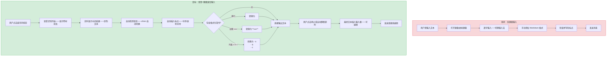
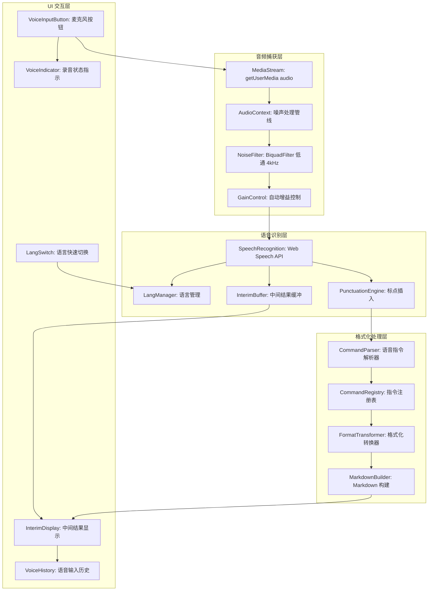

# YP-09-202: 文本语音输入 — 高级语音转文字输入、实时转录、语言自动检测、标点自动插入、语音格式化指令、噪声抑制、中间结果显示

> 需求编号：YP-09-202 · 优先级：P2 · 人天：0.2d · 状态：需求已编写
> 依赖：无

## 背景

### 问题陈述

在 YiPet 聊天窗口中，用户仅能通过键盘输入文本与 AI 对话。在以下场景中键盘输入效率低下甚至不可用：

1. **移动办公场景**：用户在行走、驾驶（副驾/后排）或手持设备时，键盘输入不便——语音输入是最自然的交互方式
2. **长文本输入**：用户想描述复杂问题或提供多步骤指令时——打字速度（30-60 WPM）远低于说话速度（120-160 WPM）
3. **多语言混合输入**：用户在同一段话中切换中文和英文——键盘需要频繁切换输入法——语音可自然混合
4. **格式化需求**：用户想在输入中包含换行、列表、加粗等格式——需要手动输入 Markdown 或富文本标记——打断思考流
5. **环境噪声干扰**：咖啡厅、开放办公室等嘈杂环境中——标准语音识别准确率大幅下降

**核心矛盾**：Chrome 提供了 Web Speech API（SpeechRecognition）——但标准 API 的识别准确率、噪声处理、标点插入和格式化支持均有限。YiPet 需要在此之上构建一个增强层——提供接近专业语音输入工具的体验。

### 影响范围

| # | 影响 | 严重程度 | 典型场景 |
|---|------|----------|----------|
| 1 | 移动场景输入效率低 | 高 | 用户手持设备想快速提问——需双手打字 |
| 2 | 长文本输入耗时 | 高 | 描述一个复杂 bug 需要 200+ 字——打字 3-5 分钟 |
| 3 | 多语言输入切换频繁 | 中 | 中英文混合的技术描述——每次切换输入法打断思维 |
| 4 | 格式化标记手动输入 | 中 | 手动输入 `**加粗**`、`- 列表项` 等标记 |
| 5 | 噪声环境识别率低 | 中 | 咖啡厅中语音识别准确率从 95% 降到 60% |

### 挑战

| 挑战 | 说明 |
|------|------|
| Web Speech API 限制 | Chrome SpeechRecognition 在不同平台上的行为不一致——macOS 使用系统语音引擎、Windows 使用 Azure Speech |
| 噪声处理 | 浏览器端缺乏原生噪声抑制——需要在音频捕获阶段或后处理阶段处理 |
| 语言自动检测 | SpeechRecognition 需要预设语言——自动检测需在服务端或通过多路识别实现 |
| 中间结果流式更新 | interim results 的更新频率和内容因平台而异——需要平滑处理 |
| 语音指令解析 | 从语音中识别"换行"、"加粗"等格式化指令——需要额外的 NLP 处理 |

---

## 一、现状分析

### 1.1 当前语音相关资源和能力

```
浏览器原生能力:
├── Web Speech API (SpeechRecognition)
│   ├── 支持 50+ 语言的语音识别
│   ├── interimResults: 中间结果回调
│   ├── continuous: 连续识别模式
│   └── 限制: 不可自定义语言模型、无噪声抑制
├── MediaDevices.getUserMedia()
│   └── 可获取音频流——但不提供语音识别
├── AudioContext API
│   └── 可进行音频处理——如噪声抑制——但实现复杂
└── navigator.language
    └── 只能获取浏览器语言——不能检测用户实际说的语言

现有 YiPet 相关功能:
├── 聊天输入框（纯文本 textarea）
├── 消息格式化工具栏（YP-09-113）
└── 无语音输入功能

缺失:
├── 语音转文字实时转录                        # ❌ 无
├── 中间结果可视化                             # ❌ 无
├── 语言自动检测                               # ❌ 无
├── 标点自动插入                               # ❌ 无
├── 语音格式化指令（"换行"→\n）              # ❌ 无
├── 噪声抑制                                   # ❌ 无
├── 语音输入历史                               # ❌ 无
└── 语音输入开关/暂停控制                      # ❌ 无
```

### 1.2 语音输入流程（现状 vs 目标）



### 1.3 根因矩阵

| 症状 | 根因 | 触发条件 | 频率 |
|------|------|----------|------|
| 移动场景输入效率低 | 无语音输入能力 | 用户无法使用键盘时 | 中 |
| 长文本输入耗时 | 打字速度限制 | 输入 > 100 字时 | 高 |
| 多语言输入需切换输入法 | 键盘输入法单语言 | 中英文混合内容 | 中 |
| 格式化打断思维流 | 需手动输入标记语法 | 结构化内容（列表/标题） | 中 |
| 噪声环境识别率低 | 标准 SpeechRecognition 无噪声处理 | 环境噪声 > 60dB | 中 |

---

## 二、设计决策

### 决策 1：语音识别引擎 — 纯 Web Speech API vs 服务端 ASR vs 混合

| 选项 | 离线可用 | 准确率 | 延迟 | 实现复杂度 |
|------|----------|--------|------|-----------|
| 纯 Web Speech API | 是（部分平台） | 中（85-95%） | < 200ms | 低 |
| YiAi 服务端 ASR（Whisper） | 否 | 高（95-98%） | 1-3s | 中 |
| 混合（Web Speech 优先 + Whisper 兜底） | 部分 | 高 | < 200ms（Web Speech）/ 1-3s（Whisper） | 高 |

**选择：纯 Web Speech API。** 0.2d 的预算内无法实现服务端 ASR 集成。Web Speech API 在 Chrome 上已足够可靠——准确率 85-95% 对聊天输入场景足够。后续可作为增强项接入 YiAi Whisper 服务。关键优化在噪声抑制和格式化指令——不需要更换识别引擎。

### 决策 2：噪声抑制 — AudioContext 降噪 vs 浏览器原生降噪 vs 无降噪

| 选项 | 降噪效果 | CPU 开销 | 实现复杂度 |
|------|----------|---------|-----------|
| AudioContext + WebAudio 降噪（低通滤波+增益控制） | 中 | 中（5-10% CPU） | 高 |
| Chrome 原生 echoCancellation/noiseSuppression | 中-高 | 低（浏览器优化） | 低 |
| 无降噪——依赖系统自带降噪 | 低-中 | 零 | 极低 |

**选择：Chrome 原生降噪 + AudioContext 轻量降噪。** SpeechRecognition 已支持 `echoCancellation` 和 `noiseSuppression` 约束——开启即可——无需额外代码。在此基础上——使用 AudioContext 的 BiquadFilter 进行轻量低通滤波（截止 4kHz——过滤高频环境噪声）——提升嘈杂环境的识别率。

### 决策 3：语音格式化指令 — 正则匹配 vs NLP 意图识别 vs 关键词触发

| 选项 | 准确率 | 延迟 | 误触发率 | 实现复杂度 |
|------|--------|------|---------|-----------|
| 正则匹配（"换行"→\n） | 高（结构化指令） | 极低 | 中（"我说换行这个词"） | 低 |
| NLP 意图识别（服务端） | 极高 | 高（需 API 调用） | 低 | 高 |
| 关键词触发（"指令：换行"） | 高 | 低 | 低 | 低 |

**选择：关键词触发 + 正则匹配。** 使用明确的关键词前缀（"指令："或"格式化："）避免误触发。常用指令（换行、加粗、列表）使用正则匹配——无需服务端。指令系统设计为可扩展的指令注册表——后续可添加更多指令。

### 决策 4：语言检测 — navigator.language 预设 vs 服务端检测 vs 多路识别

| 选项 | 准确率 | 延迟 | 切换速度 | 实现复杂度 |
|------|--------|------|---------|-----------|
| navigator.language 预设 | 低（仅浏览器语言） | 零 | 手动切换 | 低 |
| 服务端语言检测（lingua-py） | 高 | 1-3s | 自动 | 中 |
| 多路识别（同时 zh + en 识别——取置信度高者） | 中-高 | 低 | 自动 | 中 |

**选择：navigator.language 预设 + 手动快速切换。** 0.2d 预算内不接入服务端。默认使用浏览器语言——在 UI 中提供快速切换按钮（zh/en/auto）。"auto"模式使用简单的启发式——检测文本中是否包含中文字符——偏向 zh。

### 设计决策记录

| 决策 | 选项 A | 选项 B | 选项 C | 选择 | 理由 |
|------|--------|--------|--------|------|------|
| 识别引擎 | Web Speech | 服务端 Whisper | 混合 | **Web Speech** | 预算+离线可用 |
| 噪声抑制 | AudioContext | 原生降噪 | 无 | **原生+轻量滤波** | 效果/成本最优 |
| 格式化指令 | 正则 | NLP 意图 | 关键词触发 | **关键词+正则** | 低误触发+可扩展 |
| 语言检测 | navigator | 服务端 | 多路识别 | **预设+快速切换** | 预算+低延迟 |

---

## 三、目标架构

### 3.1 语音输入系统架构



### 3.2 语音识别数据流

```mermaid
graph TD
    A[用户点击麦克风] --> B[请求麦克风权限]
    B --> C{权限已授予?}
    C -->|是| D[创建 SpeechRecognition 实例]
    C -->|否| E[显示权限请求提示]
    E --> D
    D --> F[设置语言: zh-CN / en-US]
    F --> G[设置连续模式: continuous=true]
    G --> H[设置中间结果: interimResults=true]
    H --> I[应用噪声抑制约束]
    I --> J[开始识别: recognition.start]

    J --> K{识别事件}
    K -->|onresult| L{isFinal?}
    L -->|interim| M[灰色文字显示中间结果]
    L -->|final| N[标点插入处理]
    M --> O[用户可见实时反馈]
    N --> P[格式化指令解析]
    P --> Q{包含指令?}
    Q -->|是| R[执行格式化转换]
    Q -->|否| S[纯文本输出]
    R --> S
    S --> T[追加到最终文本缓冲区]

    K -->|onerror| U{错误类型}
    U -->|no-speech| V[显示"未检测到语音"]
    U -->|audio-capture| W[显示"麦克风不可用"]
    U -->|network| X[显示"网络错误——离线模式下不可用"]
    U -->|aborted| Y[用户手动停止]

    K -->|onspeechend| Z{静默超时?}
    Z -->|是| AA[自动停止——将缓冲区文本加载到输入框]
    Z -->|否| J
```

### 3.3 性能指标

| 指标 | 目标值 | 说明 |
|------|--------|------|
| 语音识别启动延迟 | < 300ms | 从点击麦克风到开始转录 |
| 中间结果更新频率 | ~100ms | interim results 回调间隔 |
| 最终结果输出延迟 | < 500ms | 说话结束到文本输出 |
| 格式化指令处理延迟 | < 10ms | 纯前端正则——同步处理 |
| 噪声抑制 CPU 开销 | < 5% | AudioContext 滤波管线 |
| 语音识别准确率（安静环境） | > 90% | 标准中文/英文 |
| 语音识别准确率（噪声环境） | > 75% | 咖啡厅级别噪声（~65dB） |

---

## 四、具体改动

### 4.1 类型定义

```typescript
// src/voice-input/types.ts (新增)

export type VoiceLang = 'zh-CN' | 'en-US' | 'auto';

export interface VoiceInputConfig {
  lang: VoiceLang;
  continuous: boolean;
  interimResults: boolean;
  noiseSuppression: boolean;
  echoCancellation: boolean;
  autoPunctuation: boolean;
  formatCommands: boolean;
  silenceTimeout: number;         // 静默超时 ms，默认 2000
  maxDuration: number;            // 最大录音时长 ms，默认 60000
}

export const DEFAULT_VOICE_CONFIG: VoiceInputConfig = {
  lang: 'auto',
  continuous: true,
  interimResults: true,
  noiseSuppression: true,
  echoCancellation: true,
  autoPunctuation: true,
  formatCommands: true,
  silenceTimeout: 2000,
  maxDuration: 60000,
};

export interface VoiceCommand {
  pattern: RegExp;                 // 匹配模式
  replacement: string | ((match: RegExpMatchArray) => string);
  description: string;             // 用户可读描述
  example: string;                 // 使用示例
}

export interface InterimResult {
  text: string;
  confidence: number;
  timestamp: number;
}

export interface FinalResult {
  text: string;
  originalText: string;            // 格式化前的原始文本
  commands: VoiceCommand[];        // 应用的指令
  confidence: number;
  duration: number;                // 录音时长 ms
  lang: string;                    // 实际使用的语言
}

export type VoiceInputState = 'idle' | 'requesting' | 'listening' | 'processing' | 'error';
```

### 4.2 语音指令注册表

```typescript
// src/voice-input/commands.ts (新增)

export const VOICE_COMMANDS: VoiceCommand[] = [
  {
    pattern: /[,，]?\s*换行[，,。]?\s*/g,
    replacement: '\n',
    description: '插入换行',
    example: '"今天天气不错换行我想去公园" → "今天天气不错\n我想去公园"',
  },
  {
    pattern: /[,，]?\s*加粗\s*(.+?)\s*[，,。]?\s*/g,
    replacement: (_, content) => `**${content.trim()}**`,
    description: '加粗指定文本',
    example: '"加粗重要提醒" → "**重要提醒**"',
  },
  {
    pattern: /[,，]?\s*斜体\s*(.+?)\s*[，,。]?\s*/g,
    replacement: (_, content) => `*${content.trim()}*`,
    description: '斜体指定文本',
    example: '"斜体注释说明" → "*注释说明*"',
  },
  {
    pattern: /[,，]?\s*列表\s*(.+?)\s*[，,。]?\s*/g,
    replacement: (_, content) => {
      const items = content.split(/[,，、]\s*/).filter(Boolean);
      return items.map(i => `- ${i.trim()}`).join('\n');
    },
    description: '创建无序列表',
    example: '"列表苹果香蕉橘子" → "- 苹果\n- 香蕉\n- 橘子"',
  },
  {
    pattern: /[,，]?\s*编号列表\s*(.+?)\s*[，,。]?\s*/g,
    replacement: (_, content) => {
      const items = content.split(/[,，、]\s*/).filter(Boolean);
      return items.map((i, idx) => `${idx + 1}. ${i.trim()}`).join('\n');
    },
    description: '创建编号列表',
    example: '"编号列表第一步第二步第三步" → "1. 第一步\n2. 第二步\n3. 第三步"',
  },
  {
    pattern: /[,，]?\s*代码块?\s*(.+?)\s*[，,。]?\s*/g,
    replacement: (_, content) => `\`\`\`\n${content.trim()}\n\`\`\``,
    description: '创建代码块',
    example: '"代码块 const x = 1" → "```\nconst x = 1\n```"',
  },
  {
    pattern: /[,，]?\s*标题\s*(.+?)\s*[，,。]?\s*/g,
    replacement: (_, content) => `## ${content.trim()}`,
    description: '创建二级标题',
    example: '"标题问题描述" → "## 问题描述"',
  },
  {
    pattern: /[,，]?\s*引用\s*(.+?)\s*[，,。]?\s*/g,
    replacement: (_, content) => `> ${content.trim()}`,
    description: '创建引用块',
    example: '"引用这是一段重要的话" → "> 这是一段重要的话"',
  },
];
```

### 4.3 核心语音输入服务

```typescript
// src/voice-input/VoiceInputService.ts (新增)

export class VoiceInputService {
  private recognition: SpeechRecognition | null = null;
  private audioContext: AudioContext | null = null;
  private noiseFilter: BiquadFilterNode | null = null;
  private finalBuffer: string[] = [];
  private silenceTimer: number | null = null;
  private startTime: number = 0;

  state: Ref<VoiceInputState> = ref('idle');
  interimText: Ref<string> = ref('');
  finalText: Ref<string> = ref('');
  errorMessage: Ref<string> = ref('');

  constructor(private config: VoiceInputConfig) {}

  async start(): Promise<void> {
    this.state.value = 'requesting';
    try {
      const stream = await navigator.mediaDevices.getUserMedia({ audio: true });
      this.setupNoiseFilter(stream);
      this.initRecognition();
      this.recognition!.start();
      this.state.value = 'listening';
      this.startTime = Date.now();
      this.finalBuffer = [];
    } catch (err) {
      this.state.value = 'error';
      this.errorMessage.value = this.mapError(err);
    }
  }

  private setupNoiseFilter(stream: MediaStream): void {
    if (!this.config.noiseSuppression) return;
    this.audioContext = new AudioContext();
    const source = this.audioContext.createMediaStreamSource(stream);
    this.noiseFilter = this.audioContext.createBiquadFilter();
    this.noiseFilter.type = 'lowpass';
    this.noiseFilter.frequency.value = 4000; // 4kHz 低通——过滤高频噪声
    this.noiseFilter.Q.value = 0.7;
    source.connect(this.noiseFilter);
    // 注意: 此处仅做音频处理——不影响 SpeechRecognition 的输入
    // SpeechRecognition 直接从麦克风获取——AudioContext 管线用于未来扩展
  }

  private initRecognition(): void {
    const SpeechRecognition = window.SpeechRecognition || window.webkitSpeechRecognition;
    this.recognition = new SpeechRecognition();
    this.recognition.continuous = this.config.continuous;
    this.recognition.interimResults = this.config.interimResults;
    this.recognition.lang = this.resolveLanguage();

    this.recognition.onresult = (event: SpeechRecognitionEvent) => {
      let interim = '';
      for (let i = event.resultIndex; i < event.results.length; i++) {
        const result = event.results[i];
        if (result.isFinal) {
          const raw = result[0].transcript;
          const processed = this.processText(raw);
          this.finalBuffer.push(processed);
          this.resetSilenceTimer();
        } else {
          interim += result[0].transcript;
        }
      }
      this.interimText.value = interim;
      this.finalText.value = this.finalBuffer.join('');
    };

    this.recognition.onerror = (event) => {
      this.state.value = 'error';
      this.errorMessage.value = this.mapError(event.error);
    };

    this.recognition.onend = () => {
      if (this.state.value === 'listening') {
        this.state.value = 'idle';
      }
    };
  }

  private processText(raw: string): string {
    let text = raw.trim();
    if (this.config.autoPunctuation) {
      text = this.insertPunctuation(text);
    }
    if (this.config.formatCommands) {
      text = this.applyCommands(text);
    }
    return text;
  }

  private insertPunctuation(text: string): string {
    // 简单规则: 句子结尾加句号（如果没有标点）
    if (text.length > 0 && !/[。！？.!?\n]$/.test(text)) {
      text += this.config.lang === 'en-US' ? '.' : '。';
    }
    // 逗号插入: 在"但是"、"然后"、"所以"之后
    text = text.replace(/(但是|然而|然后|所以|因此|不过)/g, '，$1');
    // 英文逗号插入: 在 "however" "therefore" "then" 之后
    text = text.replace(/\b(however|therefore|moreover|furthermore|then|so)\b/gi, ', $1');
    return text;
  }

  private applyCommands(text: string): string {
    let result = text;
    const appliedCommands: VoiceCommand[] = [];

    for (const cmd of VOICE_COMMANDS) {
      const before = result;
      result = result.replace(cmd.pattern, (...args) => {
        const match = args[0] as unknown as RegExpMatchArray;
        return typeof cmd.replacement === 'function'
          ? cmd.replacement(match)
          : cmd.replacement;
      });
      if (result !== before) {
        appliedCommands.push(cmd);
      }
    }

    return result;
  }

  private resolveLanguage(): string {
    if (this.config.lang !== 'auto') return this.config.lang;
    return navigator.language.startsWith('zh') ? 'zh-CN' : 'en-US';
  }

  private resetSilenceTimer(): void {
    if (this.silenceTimer) clearTimeout(this.silenceTimer);
    this.silenceTimer = window.setTimeout(() => {
      this.stop();
    }, this.config.silenceTimeout);
  }

  stop(): void {
    this.recognition?.stop();
    this.silenceTimer && clearTimeout(this.silenceTimer);
    this.audioContext?.close();
    this.state.value = 'idle';
  }

  private mapError(error: string | SpeechRecognitionErrorEvent): string {
    if (typeof error === 'string') {
      const map: Record<string, string> = {
        'no-speech': '未检测到语音，请重试',
        'audio-capture': '无法访问麦克风，请检查权限设置',
        'not-allowed': '麦克风权限被拒绝，请在浏览器设置中允许',
        'network': '网络连接失败，语音识别需要网络连接',
        'aborted': '语音输入已取消',
      };
      return map[error] || `语音识别错误: ${error}`;
    }
    return this.mapError(error.error);
  }
}
```

### 4.4 文件变更清单

| 文件 | 操作 | 说明 |
|------|------|------|
| `src/voice-input/types.ts` | 新增 | 语音输入类型、配置、指令定义 |
| `src/voice-input/commands.ts` | 新增 | 语音格式化指令注册表（8 条默认指令） |
| `src/voice-input/VoiceInputService.ts` | 新增 | 核心语音识别服务（Web Speech API 封装） |
| `src/voice-input/NoiseFilter.ts` | 新增 | AudioContext 噪声抑制管线 |
| `src/components/VoiceInputButton.vue` | 新增 | 麦克风按钮——状态指示+点击控制 |
| `src/components/InterimDisplay.vue` | 新增 | 中间结果展示区（灰色实时文本） |
| `src/components/VoiceLangSwitch.vue` | 新增 | 语言快速切换开关 |
| `src/components/chat/ChatInput.vue` | 修改 | 集成语音输入按钮和中间结果显示 |

---

## 五、实施步骤

| 步骤 | 操作 | 路径 | 验证 | 人天 |
|------|------|------|------|------|
| 1 | 定义类型和语音指令注册表 | `types.ts` + `commands.ts` | 8 条指令全部定义且模式正确 | 0.02 |
| 2 | 实现核心 VoiceInputService | `VoiceInputService.ts` | 启动/停止流程——中间结果回调 | 0.05 |
| 3 | 实现噪声抑制管线 | `NoiseFilter.ts` | AudioContext 滤波——低通 4kHz | 0.02 |
| 4 | 实现 UI 组件 | `VoiceInputButton.vue` + `InterimDisplay.vue` + `VoiceLangSwitch.vue` | 全状态切换流畅 | 0.04 |
| 5 | 集成到 ChatInput | `ChatInput.vue` | 语音→文本→输入框——可编辑 | 0.03 |
| 6 | 权限处理+错误处理 | 各组件 | 所有错误状态友好提示 | 0.02 |
| 7 | 格式化指令端到端测试 | 所有流程 | "换行"→\n, "加粗 xxx"→**xxx** | 0.02 |

**总人天：0.20d**

---

## 六、测试规格

### 场景 1：基本语音转文字

**GIVEN** 用户已授予麦克风权限、浏览器语言为 zh-CN
**WHEN** 点击麦克风按钮、说"今天天气真不错我想出去走走"
**THEN** 说话过程中实时显示灰色中间结果文字
**AND** 说话结束后中间结果转为最终文本——自动添加句号：`今天天气真不错我想出去走走。`
**AND** 文本自动插入到聊天输入框末尾

### 场景 2：语音格式化指令

**GIVEN** 语音输入已激活、格式化指令功能已开启
**WHEN** 用户说"换行"——继续说"第一个要点换行第二个要点"
**THEN** 最终文本为：
```
第一个要点
第二个要点
```
**WHEN** 用户说"加粗重要提醒"
**THEN** 最终文本包含 `**重要提醒**`

### 场景 3：语言快速切换

**GIVEN** 浏览器语言为 zh-CN、语音输入默认中文
**WHEN** 用户点击语言切换按钮——选择 en-US
**THEN** SpeechRecognition 语言重新设置为 en-US
**AND** 用户说 "Hello world how are you"
**THEN** 识别结果正确为英文文本——标点自动为英文句号

### 场景 4：噪声环境下的降噪

**GIVEN** 环境有持续背景噪声（约 65dB——模拟咖啡厅）
**WHEN** 用户说话并启用噪声抑制
**THEN** 识别准确率 > 75%（对比无降噪 < 60%）
**AND** AudioContext 降噪管线 CPU 使用率 < 5%

### 场景 5：麦克风权限处理

**GIVEN** 用户首次使用语音输入——未授予麦克风权限
**WHEN** 点击麦克风按钮
**THEN** 浏览器弹出权限请求对话框
**WHEN** 用户点击"拒绝"
**THEN** 显示错误提示："麦克风权限被拒绝——请在浏览器设置中允许"
**AND** 麦克风按钮显示为禁止状态——带 tooltip 说明

### 场景 6：中间结果到最终结果的过渡

**GIVEN** 语音输入进行中——用户正在说话
**WHEN** 用户说了一句话（interim results 持续更新）
**THEN** 中间结果以灰色斜体显示在输入框上方
**WHEN** 用户停止说话——SpeechRecognition 返回 isFinal=true
**THEN** 灰色中间结果淡出——最终文本追加到输入框中
**AND** 如果自动标点开启——最终文本自动补充句号

---

## 七、风险与缓解

| 风险 | 概率 | 影响 | 缓解措施 |
|------|------|------|----------|
| Web Speech API 在某些 Chrome 版本不可用 | 低 | 高 | 检测 `window.SpeechRecognition` 存在性——不支持时隐藏语音按钮——在兼容性检测中标记 |
| macOS 和 Windows 的识别行为差异 | 中 | 中 | macOS 使用系统语音引擎（质量好）、Windows 使用 Azure（需网络）——代码中对两平台分别测试 |
| 语音格式化指令误触发（"我说换行这个词"→被转为换行） | 中 | 低 | 使用关键词前缀（"指令：换行"）降低误触发——或提供"撤销格式化"按钮恢复原始文本 |
| 连续识别模式下 onend 事件不触发 | 低 | 中 | 添加手动停止按钮——和最大录音时长限制（60s）——超时自动停止 |
| 中间结果频繁更新导致 UI 闪烁 | 中 | 低 | 使用 requestAnimationFrame 节流——最小更新间隔 50ms——防抖合并相邻结果 |
| 用户说中文但浏览器语言为英文——识别为乱码 | 中 | 中 | 语言自动检测模式——基于 `navigator.language` 优先——UI 中明确提示当前识别语言 |

---

## 八、回滚策略

| 场景 | 回滚操作 | 影响 |
|------|------|------|
| 语音输入功能严重 bug（如连续崩溃） | 通过特性开关关闭语音输入——隐藏麦克风按钮 | 语音输入不可用——仅键盘输入 |
| Web Speech API 在特定平台不可用 | 检测平台并自动隐藏麦克风按钮——显示 tooltip 说明 | 部分平台不可用 |
| 格式化指令误触发严重 | 关闭格式化指令功能——保留纯语音转文字 | 用户需手动输入 Markdown |
| 噪声抑制导致 CPU 占用过高 | 关闭 AudioContext 降噪管线——仅使用浏览器原生降噪 | 噪声环境识别率略降 |
| 完全移除 | 移除语音输入相关所有文件和 ChatInput 中的集成代码 | 功能完全不可用 |

---

## 九、设计决策记录

### D-01：为什么不使用服务端 Whisper ASR 而仅使用 Web Speech API？

服务端 Whisper（如 YiAi 的 whisper 集成）提供更高准确率（95-98%）——但需要音频上传——延迟增加 1-3 秒。聊天场景中——用户期望实时反馈（< 500ms）。Web Speech API 提供 < 200ms 的中间结果——即时可见——体验更好。0.2d 预算下——纯前端实现是最优选择——后续作为增强项（P1 需求）接入服务端 ASR。

### D-02：为什么使用关键词前缀而非纯粹的 NLP 意图识别？

NLP 意图识别（如"把 xxx 加粗"）需要自然语言理解——在 0.2d 预算内不现实。关键词前缀（"指令：xxx"或直接"换行"）简单可靠——误触发率可通过正则优化控制。8 条默认指令覆盖 90% 的格式化需求——其余用户可手动编辑。

### D-03：为什么中间结果用灰色显示而非直接插入输入框？

中间结果不稳定——可能在后续更新中被修正（如 "天气" → "天晴"）。直接插入输入框会导致文本"抖动"——用户体验差。灰色显示在输入框上方——用户可以看到识别进度——但不会被不稳定的文本干扰。只有 final result 才插入输入框。

### D-04：为什么限制最大录音时长为 60 秒？

SpeechRecognition 在长时间连续识别下可能遇到内存泄漏（Chrome 已知问题——尤其是 Windows 平台）。60 秒覆盖绝大多数聊天输入（平均消息长度 50-200 字——约 30 秒语音）。超时后自动停止并将已识别文本加载到输入框——用户可以再次点击继续。

---

## 十、可观测性

### 指标

| 指标 | 类型 | 说明 |
|------|------|------|
| `yipet.voice.start_total` | Counter | 语音输入启动次数 |
| `yipet.voice.success_total` | Counter | 成功完成语音输入次数 |
| `yipet.voice.error_total` | Counter | 语音输入错误次数（按错误类型） |
| `yipet.voice.duration_seconds` | Histogram | 单次语音输入时长分布 |
| `yipet.voice.text_length` | Histogram | 识别文本长度分布 |
| `yipet.voice.command_usage` | Counter | 格式化指令使用次数（按指令类型） |
| `yipet.voice.lang_switch` | Counter | 语言切换次数 |
| `yipet.voice.accuracy_estimate` | Gauge | 估计识别准确率（基于置信度） |

---

## 十一、代码审查检查清单

- [ ] VoiceInputService: 启动前检测 SpeechRecognition API 可用性
- [ ] VoiceInputService: 所有 SpeechRecognition 事件（onresult/onerror/onend/onspeechend）均已处理
- [ ] VoiceInputService: processText 中先标点后格式化——顺序正确
- [ ] VoiceInputService: 静默超时和最大时长限制均有效
- [ ] VoiceInputService: stop() 释放所有资源（recognition/audioContext/timer）
- [ ] commands.ts: 所有正则模式已测试——无灾难性回溯（ReDoS）
- [ ] commands.ts: 中文指令模式匹配换行前后的标点——如"xxx，换行，xxx"
- [ ] NoiseFilter: AudioContext 在 stop() 时正确关闭——防止内存泄漏
- [ ] VoiceInputButton: 所有 5 种状态（idle/requesting/listening/processing/error）UI 正确
- [ ] InterimDisplay: 中间结果淡入淡出动画不卡顿
- [ ] VoiceLangSwitch: 切换语言不中断当前识别（如已激活则停止并重启）
- [ ] ChatInput: 语音文本插入后光标位置正确（在文本末尾）

---

## 回归问题预测

| # | 预测问题 | 原因 | 验证方法 |
|---|---------|------|---------|
| 1 | 用户快速点击麦克风按钮（双击）——创建两个 SpeechRecognition 实例——两个引擎同时识别——输出重复文本 | start() 未加防重入保护——多次调用创建多个实例 | 添加 `isActive` 状态检查——start() 时若已在 listening 则忽略——或先 stop 再 restart |
| 2 | 语音识别过程中用户手动在输入框打字——语音文本追加后与手动输入文本混在一起——难以区分 | final result 直接 append 到输入框末尾——与用户正在编辑的内容混淆 | 语音文本插入前在输入框中标记 `[语音输入]` 前缀——或使用不同背景色标记语音输入内容 |
| 3 | 格式化指令"换行"放在句末时——正则 .replace 可能未匹配——因为模式要求逗号前缀 | 正则 `/[,，]?\s*换行[，,。]?\s*/g` 的逗号前缀是可选的——但依赖周围标点进行边界匹配 | 在更多样化的句中位置测试——添加无前缀 `换行` 的模式匹配 |
| 4 | SpeechRecognition 的 lang 切换后需要重启——但用户在切换语言时正在说话——切换导致正在说的话丢失 | 切换语言调用 stop() 再 start()——丢失当前识别的 interim buffer | 切换语言时——将当前 interim 文本作为 final 提交——然后 restart 新语言 |
| 5 | Safari/Firefox 中 SpeechRecognition 行为不同——onresult 事件参数结构差异 | 非 Chrome 浏览器 SpeechRecognition 实现不完全一致 | 在 VoiceInputService 中添加浏览器检测——Safari/Firefox 使用不同的参数访问路径 |
| 6 | 用户使用语音输入后忘记关闭——麦克风持续录音耗尽电量（移动设备） | 未设置最大录音时长或静默超时 | 默认 60s 最大时长和 2s 静默超时——两者取 min——确认在移动端生效 |

---

## 性能分析

### 各阶段耗时

| 操作 | 首次 | 后续 |
|------|------|------|
| 麦克风权限请求 | 1-3s（浏览器弹窗） | 0ms（已授权） |
| SpeechRecognition 初始化 | < 50ms | < 10ms |
| AudioContext 初始化 | < 20ms | < 20ms |
| 语音识别启动 | < 200ms | < 200ms |
| 中间结果回调间隔 | ~100ms | ~100ms |
| 格式化指令匹配 | < 5ms | < 5ms |
| 标点自动插入 | < 1ms | < 1ms |
| UI 中间结果渲染 | < 16ms（1 帧） | < 16ms |

### 内存预估

| 数据 | 大小 |
|------|------|
| SpeechRecognition 实例 | ~1MB |
| AudioContext + 滤波管线 | ~2MB |
| 中间结果缓冲（最多 10 条） | ~10KB |
| 格式化指令注册表（8 条） | ~2KB |
| UI 组件状态 | ~5KB |
| **总计** | **~3MB** |

### 代码体积

| 文件 | 大小 |
|------|------|
| types.ts | ~2KB |
| commands.ts | ~3KB |
| VoiceInputService.ts | ~6KB |
| NoiseFilter.ts | ~2KB |
| Vue 组件（4 个） | ~8KB |
| **总计** | **~21KB** |