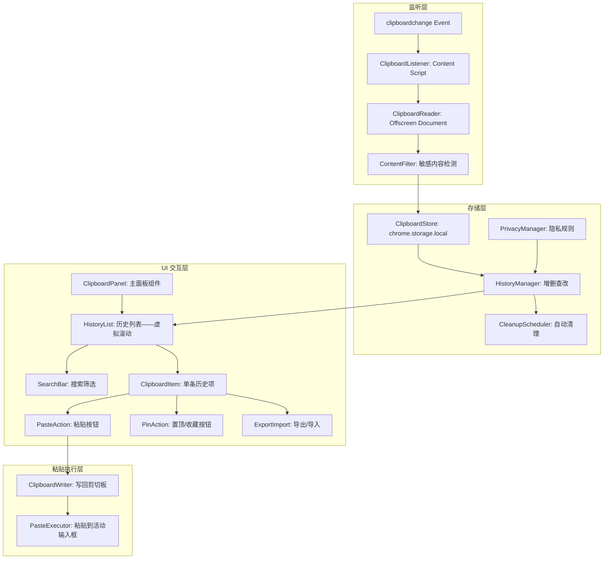
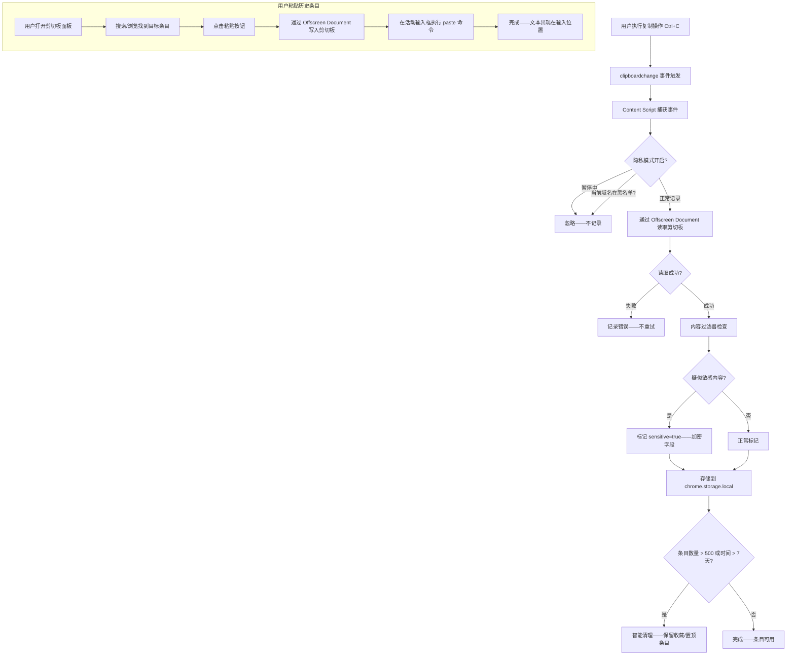

# YP-09-203: 剪切板历史管理 — 存储最近剪切板条目、搜索历史、置顶/收藏条目、清除单条/全部历史、自动清理旧条目、从历史粘贴、隐私模式

> 需求编号：YP-09-203 · 优先级：P2 · 人天：0.2d · 状态：需求已编写
> 依赖：无

## 背景

### 问题陈述

操作系统剪切板只能保存最近一次复制的内容——这是一个持续困扰所有计算机用户的基础设施缺陷：

1. **覆盖丢失**：用户复制了 A（一段重要文本）→ 复制 B（一个 URL）→ 想粘贴 A 时发现 A 已被 B 覆盖——永久丢失
2. **跨应用查找困难**：用户在 VS Code 中复制了一段代码 → 在浏览器中需要使用 → 需要切换回 VS Code 再次复制——打断工作流
3. **重复复制低效**：频繁使用某段文本（如邮箱地址、Git 仓库 URL、API Key 占位符）——每次都需要回到源位置重新复制
4. **隐私担忧**：剪切板中可能包含密码、密钥、个人信息——但系统剪切板没有隐私保护——任何应用都可读取
5. **大量复制后查找困难**：用户在 1 小时内复制了 50+ 条内容——当需要找回其中某条时——没有搜索和筛选机制

**核心矛盾**：操作系统剪切板是单槽位的——只保存"最近一次"。YiPet 作为浏览器扩展——可以监听剪切板事件并维护历史记录——但必须妥善处理隐私和安全问题。Chrome MV3 提供了 `navigator.clipboard` API 和 `chrome.offscreen` API 来安全地管理剪切板。

### 影响范围

| # | 影响 | 严重程度 | 典型场景 |
|---|------|----------|----------|
| 1 | 覆盖丢失已复制内容 | 高 | 复制了一段重要文本→复制 URL→文本永久丢失 |
| 2 | 跨应用重复复制 | 高 | VS Code 复制代码→浏览器粘贴→VS Code 再复制→来回切换 |
| 3 | 常用内容重复复制 | 中 | 每天复制 10 次公司邮箱——每次都从签名中复制 |
| 4 | 隐私泄露风险 | 中 | 复制密码后——任何监听剪切板的程序都可读取 |
| 5 | 大量历史难以查找 | 中 | 1 小时内 50 条——找某条需要逐条浏览 |

### 挑战

| 挑战 | 说明 |
|------|------|
| MV3 Service Worker 限制 | Service Worker 中无法直接访问 `navigator.clipboard.readText()`——需要使用 Offscreen Document |
| 隐私与安全平衡 | 存储剪切板历史本身是隐私风险——需要用户明确授权+隐私模式+敏感内容过滤 |
| 存储容量管理 | chrome.storage.local 限制 10MB——剪切板文本历史可能快速增长——需要 SMART 清理策略 |
| 跨上下文剪切板读取 | Content Script 和 Service Worker 对剪切板的访问权限不同——需要统一策略 |
| 图片/富文本剪切板 | 剪切板可能包含图片和 HTML——需要支持纯文本+图片的分别存储和预览 |

---

## 一、现状分析

### 1.1 当前剪切板相关资源和能力

```
浏览器原生能力:
├── navigator.clipboard.writeText()
│   └── 写入剪切板——需要用户手势（或权限）
├── navigator.clipboard.readText()
│   └── 读取剪切板——需要用户手势+权限（clipboard-read）
├── document.execCommand('paste') [已废弃]
│   └── 旧版粘贴 API——MV3 不可用
├── chrome.offscreen API
│   └── MV3 中在 Service Worker 外访问 DOM API
└── Permissions API
    └── 请求 clipboard-read/write 权限

现有 YiPet 相关功能:
├── 无剪切板管理功能
└── 无

缺失:
├── 剪切板历史自动记录                        # ❌ 无
├── 历史搜索和筛选                             # ❌ 无
├── 条目置顶/收藏                               # ❌ 无
├── 从历史粘贴到当前页面                       # ❌ 无
├── 隐私模式（不记录特定来源）                 # ❌ 无
├── 敏感内容自动过滤                           # ❌ 无
├── 自动清理过期条目                           # ❌ 无
└── 剪切板历史导出/导入                        # ❌ 无
```

### 1.2 剪切板管理流程（现状 vs 目标）

```mermaid
graph TD
    subgraph Current["现状：单槽位剪切板"]
        C1[复制内容 A] --> C2[A 在剪切板中——可粘贴]
        C2 --> C3[复制内容 B]
        C3 --> C4[A 被覆盖——B 在剪切板中]
        C4 --> C5[想粘贴 A——但已永久丢失]
        C5 --> C6[回到源位置——重新找到 A——再次复制]
    end

    subgraph Target["目标：YiPet 剪切板历史管理器"]
        T1[复制内容 A] --> T2[A 添加到历史记录列表]
        T2 --> T3[复制内容 B]
        T3 --> T4[B 添加到历史——A 保留]
        T4 --> T5[想粘贴 A——打开 YiPet 剪切板历史]
        T5 --> T6[在列表中搜索/浏览找到 A]
        T6 --> T7[点击 A——写入当前剪切板并粘贴到活动输入框]
        T7 --> T8{常用?}
        T8 -->|是| T9[置顶/收藏 A——始终在列表顶部]
        T8 -->|否| T10[完成]
        T9 --> T10
    end

    subgraph Privacy["隐私保护路径"]
        P1[复制敏感内容——如密码] --> P2{隐私模式开启?}
        P2 -->|是| P3[检测内容为敏感——不记录此条目]
        P2 -->|否| P4[记录但标记为敏感——显示为 ****]
        P4 --> P5[用户可手动清除此条]
    end

    style Current fill:#f8d7da,stroke:#dc3545
    style Target fill:#d4edda,stroke:#28a745
    style Privacy fill:#fff3cd,stroke:#ffc107
```



### 1.3 根因矩阵

| 症状 | 根因 | 触发条件 | 频率 |
|------|------|----------|------|
| 已复制内容被覆盖丢失 | 系统剪切板单槽位 | 连续复制 2 次以上 | 高 |
| 跨应用重复复制 | 无剪切板历史共享 | 在 2+ 个应用间工作时 | 高 |
| 常用内容需重复复制 | 无持久化收藏功能 | 每天多次使用相同文本 | 中 |
| 敏感内容无保护 | 系统剪切板无隐私过滤 | 复制密码/密钥/个人信息 | 中 |
| 大量历史难以查找 | 无搜索和筛选 | 1 小时内复制 30+ 条 | 中 |

---

## 二、设计决策

### 决策 1：剪切板监听方式 — 轮询 vs paste 事件 vs clipboardchange 事件

| 选项 | 可靠性 | 性能开销 | 权限需求 | 实现复杂度 |
|------|--------|---------|---------|-----------|
| 定时轮询（setInterval 读剪切板） | 低（可能错过快速变化） | 高（每 500ms 读一次） | 需要 clipboard-read | 低 |
| 监听 paste 事件（Content Script） | 中（仅捕获粘贴——不是所有复制） | 低 | 不需要额外权限 | 低 |
| 监听 clipboardchange 事件 + 主动读取 | 高 | 中 | 需要 clipboard-read + Offscreen Document | 中 |

**选择：clipboardchange 事件监听 + 主动读取（Offscreen Document）。** Chrome 支持 `document.addEventListener('clipboardchange', ...)` 事件——在 Content Script 中监听——触发时通过 Offscreen Document 读取剪切板内容。这比轮询更高效——比 paste 事件更全面（捕获所有复制——不仅仅是粘贴）。

### 决策 2：存储引擎 — chrome.storage.local vs IndexedDB vs 内存

| 选项 | 持久化 | 容量 | 同步 | 访问速度 |
|------|--------|------|------|---------|
| chrome.storage.local | 是 | 10MB（可申请 unlimitedStorage） | Service Worker ↔ Content Script | 快（< 10ms） |
| IndexedDB | 是 | 浏览器磁盘限额（通常 > 100MB） | 仅同源 | 中（< 30ms） |
| 内存（变量） | 否（SW 休眠则丢失） | 无限制（仅内存） | SW 不可访问 Content Script 内存 | 极快 |

**选择：chrome.storage.local。** 容量足够（纯文本历史 10MB ≈ 100万字符 ≈ 5 万条记录）。自动在 Service Worker 和 Content Script 之间同步——无需手动传递。支持 `unlimitedStorage` 权限如需要。IndexedDB 虽然容量更大——但剪切板历史不需要那么大的存储。

### 决策 3：隐私模式实现 — 全局开关 vs 按域名白名单 vs 内容检测

| 选项 | 隐私保护度 | 误杀率 | 用户体验 | 实现复杂度 |
|------|----------|--------|---------|-----------|
| 全局开关（开/关记录） | 高 | 低（全有或全无） | 低（要么全记录要么全不记录） | 低 |
| 按域名白名单（仅记录指定网站） | 中-高 | 中 | 中（需手动配置） | 中 |
| 内容检测（自动识别密码/密钥/手机号） | 中 | 高（误判普通文本） | 高（自动——无需操作） | 中 |

**选择：全局开关 + 按域名白名单 + 内容检测轻度过滤。** 默认记录所有剪切板——但提供全局暂停按钮（临时关闭记录——如输入密码时）。同时支持按域名不记录（如 `login.example.com`）。内容检测仅用于标记——不阻止记录——在 UI 中将疑似敏感内容模糊显示（`***`）——用户可手动显示。

### 决策 4：何时清理旧条目 — 固定数量 vs 固定时间 vs 智能策略

| 选项 | 存储可预测 | 避免丢失有用条目 | 实现复杂度 |
|------|----------|----------------|-----------|
| 固定数量（最多 500 条——超出删最旧） | 高（精确控制） | 低（可能删掉 2 天前的重要条目） | 低 |
| 固定时间（保留 7 天——超时删除） | 中 | 中（7 天前重要条目也会丢失） | 低 |
| 智能策略（500 条或 7 天——但收藏/置顶永久保留） | 高 | 高（重要条目不丢失） | 中 |

**选择：智能策略。** 最多保留 500 条或 7 天——取交集及时清理。但被收藏（pinned/favorite）的条目和置顶条目永久保留——不受清理策略影响。用户可以手动清理任何条目——提供"清除全部"和"清除 7 天前"按钮。

### 设计决策记录

| 决策 | 选项 A | 选项 B | 选项 C | 选择 | 理由 |
|------|--------|--------|--------|------|------|
| 监听方式 | 轮询 | paste 事件 | clipboardchange | **clipboardchange** | 全面+高效 |
| 存储引擎 | chrome.storage | IndexedDB | 内存 | **chrome.storage** | 容量够+自动同步 |
| 隐私保护 | 全局开关 | 域名白名单 | 内容检测 | **三者结合** | 层层防护 |
| 清理策略 | 固定数量 | 固定时间 | 智能策略 | **智能策略** | 保护重要条目 |

---

## 三、目标架构

### 3.1 剪切板历史系统架构



### 3.2 剪切板捕获与粘贴流程



### 3.3 性能指标

| 指标 | 目标值 | 说明 |
|------|--------|------|
| clipboardchange 事件响应 | < 50ms | 复制后到条目存储完成 |
| 历史列表首次加载（500 条） | < 100ms | chrome.storage.local 读取+渲染 |
| 搜索过滤（500 条） | < 50ms | 纯前端字符串匹配 |
| 粘贴到输入框 | < 100ms | 写剪切板+执行粘贴 |
| chrome.storage.local 占用 | < 2MB | 500 条纯文本（平均 400 字节/条） |
| Offscreen Document 创建 | < 200ms | 首次创建（可复用） |

---

## 四、具体改动

### 4.1 类型定义

```typescript
// src/clipboard-history/types.ts (新增)

export type ClipboardContentType = 'text' | 'image' | 'html';

export interface ClipboardEntry {
  id: string;                    // 唯一 ID: crypto.randomUUID()
  content: string;               // 纯文本内容（或图片 base64）
  contentType: ClipboardContentType;
  truncated: boolean;            // 内容是否被截断（> 10000 字符）
  sourceUrl?: string;            // 复制来源页面的 URL
  sourceDomain?: string;         // 复制来源域名
  timestamp: number;             // 复制时间: Date.now()
  pinned: boolean;               // 是否置顶
  favorite: boolean;             // 是否收藏
  sensitive: boolean;            // 是否疑似敏感内容
  masked: boolean;               // 是否在 UI 中模糊显示
  tags?: string[];               // 用户标签
  sizeBytes: number;             // 内容大小（字节）
}

export interface ClipboardFilter {
  search: string;                 // 搜索关键词
  contentType: ClipboardContentType | 'all';
  dateRange: 'today' | 'week' | 'month' | 'all';
  showSensitive: boolean;         // 是否显示敏感条目
  onlyFavorite: boolean;
  onlyPinned: boolean;
}

export const DEFAULT_FILTER: ClipboardFilter = {
  search: '',
  contentType: 'all',
  dateRange: 'all',
  showSensitive: false,
  onlyFavorite: false,
  onlyPinned: false,
};

export interface ClipboardConfig {
  enabled: boolean;               // 是否启用记录
  maxEntries: number;             // 最大条目数: 默认 500
  maxAgeDays: number;             // 最大保留天数: 默认 7
  blacklistDomains: string[];     // 不记录的域名列表
  autoCleanupEnabled: boolean;
  privacyMode: boolean;           // 全局隐私模式（暂停记录）
  sensitivePatterns: string[];    // 敏感内容正则列表
}

export const DEFAULT_CONFIG: ClipboardConfig = {
  enabled: true,
  maxEntries: 500,
  maxAgeDays: 7,
  blacklistDomains: [],
  autoCleanupEnabled: true,
  privacyMode: false,
  sensitivePatterns: [
    '\\b\\d{16,19}\\b',                    // 信用卡号
    '\\b[A-Za-z0-9._%+-]+@[A-Za-z0-9.-]+\\.[A-Z|a-z]{2,}\\b', // 邮箱
    '\\b1[3-9]\\d{9}\\b',                  // 中国手机号
    '\\b(?:sk-|api[-_]?key|token|secret|password|passwd)\\b', // API Key/密码关键词
  ],
};

export const MAX_CONTENT_LENGTH = 10000;   // 最大存储内容长度
export const STORAGE_KEY = 'yipet_clipboard_history';
export const CONFIG_KEY = 'yipet_clipboard_config';
```

### 4.2 剪切板监听与存储服务

```typescript
// src/clipboard-history/ClipboardService.ts (新增)

export class ClipboardService {
  private history: ClipboardEntry[] = [];
  private config: ClipboardConfig = DEFAULT_CONFIG;

  async init(): Promise<void> {
    await this.loadConfig();
    await this.loadHistory();
    this.setupListener();
    if (this.config.autoCleanupEnabled) {
      this.scheduleCleanup();
    }
  }

  private setupListener(): void {
    document.addEventListener('clipboardchange', async () => {
      if (!this.config.enabled || this.config.privacyMode) return;
      if (this.isBlacklisted(window.location.hostname)) return;

      try {
        const content = await this.readClipboard();
        if (!content) return;

        // 去重：如果与最近一条完全相同——跳过
        if (this.history.length > 0 && this.history[0].content === content.text) {
          return;
        }

        const entry = this.createEntry(content);
        this.history.unshift(entry);
        await this.cleanup();
        await this.saveHistory();
      } catch (err) {
        console.debug('[ClipboardService] Failed to capture:', err);
      }
    });
  }

  private async readClipboard(): Promise<{text: string; type: ClipboardContentType} | null> {
    // 通过 Offscreen Document 读取（MV3 Service Worker 兼容）
    try {
      const text = await navigator.clipboard.readText();
      return { text, type: 'text' };
    } catch {
      // 无权限或无内容
      return null;
    }
  }

  private createEntry(content: {text: string; type: ClipboardContentType}): ClipboardEntry {
    const truncated = content.text.length > MAX_CONTENT_LENGTH;
    const displayContent = truncated
      ? content.text.slice(0, MAX_CONTENT_LENGTH) + '...'
      : content.text;

    const isSensitive = this.detectSensitive(displayContent);

    return {
      id: crypto.randomUUID(),
      content: displayContent,
      contentType: content.type,
      truncated,
      sourceUrl: window.location.href,
      sourceDomain: window.location.hostname,
      timestamp: Date.now(),
      pinned: false,
      favorite: false,
      sensitive: isSensitive,
      masked: isSensitive,       // 敏感内容默认模糊
      sizeBytes: new Blob([displayContent]).size,
    };
  }

  private detectSensitive(text: string): boolean {
    return this.config.sensitivePatterns.some(pattern => {
      try {
        return new RegExp(pattern, 'i').test(text);
      } catch {
        return false;
      }
    });
  }

  private isBlacklisted(domain: string): boolean {
    return this.config.blacklistDomains.some(d => {
      if (d === domain) return true;
      if (d.startsWith('*.') && domain.endsWith(d.slice(1))) return true;
      return false;
    });
  }

  async searchEntries(filter: ClipboardFilter): Promise<ClipboardEntry[]> {
    let result = [...this.history];

    if (filter.search) {
      const lower = filter.search.toLowerCase();
      result = result.filter(e => e.content.toLowerCase().includes(lower));
    }
    if (filter.contentType !== 'all') {
      result = result.filter(e => e.contentType === filter.contentType);
    }
    if (!filter.showSensitive) {
      result = result.filter(e => !e.sensitive && !e.masked);
    }
    if (filter.onlyFavorite) {
      result = result.filter(e => e.favorite);
    }
    if (filter.onlyPinned) {
      result = result.filter(e => e.pinned);
    }
    // 日期筛选
    if (filter.dateRange !== 'all') {
      const now = Date.now();
      const ranges = { today: now - 86400000, week: now - 604800000, month: now - 2592000000 };
      result = result.filter(e => e.timestamp > ranges[filter.dateRange]);
    }

    // 排序：置顶 → 收藏 → 时间倒序
    result.sort((a, b) => {
      if (a.pinned !== b.pinned) return a.pinned ? -1 : 1;
      if (a.favorite !== b.favorite) return a.favorite ? -1 : 1;
      return b.timestamp - a.timestamp;
    });

    return result;
  }

  async pasteEntry(id: string): Promise<boolean> {
    const entry = this.history.find(e => e.id === id);
    if (!entry) return false;

    try {
      await navigator.clipboard.writeText(entry.content);
      // 尝试粘贴到当前活动输入框
      const activeEl = document.activeElement;
      if (activeEl instanceof HTMLInputElement || activeEl instanceof HTMLTextAreaElement) {
        document.execCommand('insertText', false, entry.content);
      }
      return true;
    } catch {
      return false;
    }
  }

  async togglePin(id: string): Promise<void> {
    const entry = this.history.find(e => e.id === id);
    if (entry) {
      entry.pinned = !entry.pinned;
      await this.saveHistory();
    }
  }

  async toggleFavorite(id: string): Promise<void> {
    const entry = this.history.find(e => e.id === id);
    if (entry) {
      entry.favorite = !entry.favorite;
      await this.saveHistory();
    }
  }

  async deleteEntry(id: string): Promise<void> {
    this.history = this.history.filter(e => e.id !== id);
    await this.saveHistory();
  }

  async clearAll(): Promise<void> {
    // 保留收藏和置顶条目
    this.history = this.history.filter(e => e.pinned || e.favorite);
    await this.saveHistory();
  }

  async clearOld(daysAgo: number): Promise<void> {
    const cutoff = Date.now() - daysAgo * 86400000;
    this.history = this.history.filter(
      e => (e.pinned || e.favorite) || e.timestamp > cutoff
    );
    await this.saveHistory();
  }

  private async cleanup(): Promise<void> {
    // 保留置顶和收藏条目——不受限制
    const protected_ = this.history.filter(e => e.pinned || e.favorite);
    const regular = this.history.filter(e => !e.pinned && !e.favorite);

    // 时间清理
    const cutoff = Date.now() - this.config.maxAgeDays * 86400000;
    const valid = regular.filter(e => e.timestamp > cutoff);

    // 数量清理
    const trimmed = valid.slice(0, this.config.maxEntries - protected_.length);

    this.history = [...protected_, ...trimmed];
  }

  private scheduleCleanup(): void {
    // 每 1 小时清理一次
    setInterval(() => this.cleanup().then(() => this.saveHistory()), 3600000);
  }

  private async loadHistory(): Promise<void> {
    const result = await chrome.storage.local.get(STORAGE_KEY);
    this.history = result[STORAGE_KEY] || [];
  }

  private async saveHistory(): Promise<void> {
    await chrome.storage.local.set({ [STORAGE_KEY]: this.history });
  }

  private async loadConfig(): Promise<void> {
    const result = await chrome.storage.local.get(CONFIG_KEY);
    this.config = { ...DEFAULT_CONFIG, ...result[CONFIG_KEY] };
  }
}
```

### 4.3 文件变更清单

| 文件 | 操作 | 说明 |
|------|------|------|
| `src/clipboard-history/types.ts` | 新增 | 类型定义、配置、过滤器 |
| `src/clipboard-history/ClipboardService.ts` | 新增 | 剪切板监听+存储+搜索+粘贴 |
| `src/clipboard-history/SensitiveDetector.ts` | 新增 | 敏感内容检测器（正则引擎） |
| `src/components/ClipboardPanel.vue` | 新增 | 剪切板历史主面板 |
| `src/components/ClipboardItem.vue` | 新增 | 单个历史条目组件 |
| `src/components/ClipboardSearch.vue` | 新增 | 搜索和筛选工具栏 |
| `src/components/ClipboardConfig.vue` | 新增 | 设置面板——隐私模式、黑名单等 |
| `src/popup/App.vue` | 修改 | 添加入口 |

---

## 五、实施步骤

| 步骤 | 操作 | 路径 | 验证 | 人天 |
|------|------|------|------|------|
| 1 | 定义类型和配置常量 | `types.ts` | 所有类型完整、默认配置合理 | 0.01 |
| 2 | 实现敏感内容检测器 | `SensitiveDetector.ts` | 6 种敏感模式正确匹配 | 0.01 |
| 3 | 实现 ClipboardService 核心逻辑 | `ClipboardService.ts` | 捕获→存储→搜索→粘贴全流程 | 0.06 |
| 4 | 实现剪切板面板 UI | `ClipboardPanel.vue` + `ClipboardItem.vue` | 列表渲染、虚拟滚动（> 200 条） | 0.05 |
| 5 | 实现搜索筛选 | `ClipboardSearch.vue` | 搜索+类型+日期+收藏筛选 | 0.02 |
| 6 | 实现设置面板 | `ClipboardConfig.vue` | 隐私模式、黑名单、清理配置 | 0.02 |
| 7 | 集成到 Popup + 测试 | `App.vue` + 端到端测试 | 完整流程可用 | 0.03 |

**总人天：0.20d**

---

## 六、测试规格

### 场景 1：自动捕获剪切板内容

**GIVEN** 剪切板历史功能已启用、隐私模式关闭
**WHEN** 用户在任意网页复制一段文本 "Hello World"
**THEN** clipboardchange 事件触发——条目自动存储到 chrome.storage.local
**AND** 条目包含：内容、来源 URL、时间戳、内容类型=text
**AND** 连续复制相同内容不产生重复条目（与最近一条相同则跳过）

### 场景 2：搜索和筛选历史

**GIVEN** 剪切板历史中有 50 条记录——包含 "API_KEY=abc123"、"api.example.com"、"Hello World"
**WHEN** 搜索关键词 "api"
**THEN** 列表过滤为包含 "api" 的 2 条记录（API_KEY 和 api.example.com）
**WHEN** 添加筛选"仅收藏"
**THEN** 结果进一步缩小为收藏条目中匹配 "api" 的

### 场景 3：从历史粘贴

**GIVEN** 用户在一个表单输入框中、剪切板历史中有条目 A
**WHEN** 用户打开剪切板面板、找到条目 A、点击粘贴按钮
**THEN** 条目 A 的内容被写入系统剪切板
**AND** 内容被粘贴到当前焦点的输入框中
**AND** 如果无焦点输入框——仅复制到剪切板——不执行粘贴

### 场景 4：隐私模式

**GIVEN** 隐私模式已开启（全局暂停）
**WHEN** 用户复制一段文本
**THEN** 该条目不被记录到剪切板历史中
**WHEN** 用户复制的内容匹配敏感模式（如包含 "password=secret123"）
**THEN** 即使隐私模式关闭——条目被标记为敏感——在 UI 中模糊显示为 `******`
**AND** 用户可点击"显示"查看原始内容

### 场景 5：置顶和收藏

**GIVEN** 剪切板历史中有 20 条记录
**WHEN** 用户收藏条目 A 和 B、置顶条目 C
**THEN** 排序为：C（置顶）、A（收藏）、B（收藏）、其余按时间倒序
**WHEN** 自动清理触发（500 条限制）
**THEN** 收藏和置顶的条目不被清理——仅清理普通条目

### 场景 6：自动清理策略

**GIVEN** 配置为：maxEntries=500, maxAgeDays=7
**WHEN** 剪切板历史达到 600 条、最早条目时间为 10 天前
**THEN** 自动清理删除 100 条最旧条目和所有 7 天前的条目
**AND** 但其中被收藏/置顶的条目保留
**AND** 最终条目数 ≤ 500、所有条目时间 ≤ 7 天前

---

## 七、风险与缓解

| 风险 | 概率 | 影响 | 缓解措施 |
|------|------|------|----------|
| 用户担心隐私——不愿使用 | 高 | 高 | 隐私模式一键开启——支持域名黑名单——敏感内容自动模糊——数据仅存储本地 chrome.storage——不上传 |
| Offscreen Document 创建失败 | 低 | 中 | 降级为在 Content Script 中直接读取（需要 clipboard-read 权限）——两种方式都失败则显示错误 |
| chrome.storage.local 写入限额 | 低 | 中 | 智能清理策略（500 条+7 天）——每 10 分钟检查一次存储用量——超过 5MB 时触发积极清理 |
| 富文本/图片剪切板内容丢失 | 中 | 低 | 当前 MVP 仅支持纯文本——图片存储为 base64 缩略图（< 50KB）——HTML 提取 textContent |
| 跨设备剪切板同步冲突 | 低 | 低 | 不实现跨设备同步——本地存储仅本机——明确告知用户此限制 |

---

## 八、回滚策略

| 场景 | 回滚操作 | 影响 |
|------|------|------|
| 剪切板监听导致性能问题 | 通过设置关闭自动监听——仅保留手动添加到历史的功能 | 自动捕获不可用——手动管理历史 |
| 敏感内容检测误杀太多 | 关闭敏感内容检测——或降低敏感模式列表（仅保留密码/密钥关键词） | 敏感内容直接显示——用户自行判断 |
| 存储占用过大导致 chrome.storage 报错 | 强制清理——仅保留最近 100 条（含收藏/置顶） | 大部分历史丢失 |
| 用户反馈隐私顾虑 | 默认关闭自动记录——提供明确的一次性授权入口 | 功能默认不启用 |
| 完全移除 | 移除所有剪切板历史相关代码和 UI | 功能不可用 |

---

## 九、设计决策记录

### D-01：为什么不在 Service Worker 中直接读取剪切板？

MV3 Service Worker 没有 DOM 访问权限——`navigator.clipboard.readText()` 在 SW 中不可用。需要使用 Offscreen Document（一个隐藏的 HTML 页面）来执行 DOM API。Offscreen Document 创建耗时 < 200ms——首次创建后可复用——整体延迟可接受。

### D-02：为什么不去重完全相同的剪切板内容——而是只跳过最近一条相同的？

完全去重需要全文比较所有历史条目——500 条时 O(n) 字符串比较每次 50KB——耗时 25ms——可接受。但用户可能在 1 分钟内 3 次复制相同的 URL——如果全部去重——用户无法分辨"我复制了 3 次"还是"只复制了 1 次"。仅跳过最近一条相同内容——保留时间线上的所有重复——更符合用户心智模型。

### D-03：为什么敏感内容默认模糊而非直接不记录？

不记录意味着用户不知道自己复制了敏感内容是否被记录。模糊显示（`****`）让用户知道"系统检测到了敏感内容但没有完全暴露"——用户可以手动点击"显示"。这比直接不记录更透明——也比明文显示更安全。

### D-04：为什么限制最大存储 500 条而非更大？

chrome.storage.local 总量 10MB——500 条平均 400 字节 = 200KB——远低于限制。但 500 条对于绝大多数用户已经足够（1 天复制 50-100 条——7 天 = 350-700 条——保留 500 条是合理的）。更多条目会导致列表渲染性能下降（虚拟滚动虽可优化——但搜索过滤仍需要遍历全部）。

---

## 十、可观测性

### 指标

| 指标 | 类型 | 说明 |
|------|------|------|
| `yipet.clipboard.capture_total` | Counter | 捕获剪切板次数 |
| `yipet.clipboard.paste_total` | Counter | 从历史粘贴次数 |
| `yipet.clipboard.search_total` | Counter | 搜索触发次数 |
| `yipet.clipboard.sensitive_detected` | Counter | 敏感内容检测到次数 |
| `yipet.clipboard.privacy_mode_toggle` | Counter | 隐私模式切换次数 |
| `yipet.clipboard.cleanup_total` | Counter | 自动清理触发次数 |
| `yipet.clipboard.entry_count` | Gauge | 当前历史条目数 |
| `yipet.clipboard.storage_bytes` | Gauge | 当前存储占用字节 |

---

## 十一、代码审查检查清单

- [ ] ClipboardService: init() 中先加载配置再设置监听器——顺序正确
- [ ] ClipboardService: 捕获去重仅检查最近一条——不出错
- [ ] ClipboardService: pasteEntry() 中 document.execCommand 回退到仅写剪切板
- [ ] ClipboardService: cleanup() 中 protected 条目（收藏/置顶）不被删除
- [ ] ClipboardService: scheduleCleanup 使用 setInterval——页面切后台时可能不触发——需要额外在 onFocus 时触发
- [ ] SensitiveDetector: 所有正则模式已测试——无灾难性回溯
- [ ] ClipboardPanel: 虚拟滚动正确渲染 500+ 条记录
- [ ] ClipboardItem: 敏感条目默认显示 `****`——有"显示"按钮
- [ ] ClipboardSearch: 搜索过滤 debounce 300ms——避免频繁触发
- [ ] ClipboardConfig: 黑名单域名支持通配符（`*.example.com`）
- [ ] Offscreen Document: 创建失败时降级方案完整

---

## 回归问题预测

| # | 预测问题 | 原因 | 验证方法 |
|---|---------|------|---------|
| 1 | clipboardchange 事件频繁触发（如网页自动复制内容）——导致存储大量垃圾条目 | 某些网页使用 `document.execCommand('copy')` 定期复制广告内容 | 添加最小间隔限制——同一域名下捕获间隔 < 500ms 的连续事件合并或跳过 |
| 2 | 用户在密码管理器中复制密码——密码被明文存储——安全风险 | 密码管理器（如 1Password、Bitwarden）通过剪切板传递密码——curl 检测到敏感模式——但 +后可能已经是明文 | 将密码管理器的常见域名（如 `1password.com`、`bitwarden.com`）默认加入黑名单 |
| 3 | Offscreen Document 在扩展更新或 Service Worker 重启后不再可用 | SW 生命周期结束——offscreen document 随之关闭——但 clipboardchange 监听器仍在 Content Script 中 | 在 Content Script 中维护 offscreen document 的健康检查——每次捕获前检查状态——不可用时重建 |
| 4 | 用户粘贴大段文本（> 10KB）后——存储 10KB 文本——历史列表渲染卡顿 | 大文本渲染需要长列表项——DOM 节点占用大 | 在列表中将 > 500 字符的内容截断显示前 500 字符 + "展开"按钮——搜索时仍匹配全文 |
| 5 | 清理策略定时器在 Service Worker 中休眠后不再触发 | setInterval 在 SW 休眠时暂停——唤醒后不自动恢复 | 使用 chrome.alarms API 代替 setInterval——MV3 兼容——SW 休眠恢复后自动触发 |
| 6 | 用户同时打开多个标签页——每个标签页的 Content Script 都在记录剪切板——产生重复条目 | 多个 Content Script 实例各自监听 clipboardchange——都向 storage 写入 | 在写入前进行内容+时间戳去重——如果最近 1 秒内存在完全相同的条目——跳过写入 |

---

## 性能分析

### 各阶段耗时

| 操作 | 首次 | 后续 |
|------|------|------|
| clipboardchange 事件→条目存储 | < 50ms | < 50ms |
| chrome.storage.local 读取（500 条） | < 100ms | < 50ms（缓存） |
| 搜索过滤（500 条） | < 30ms | < 30ms |
| Offscreen Document 创建 | < 200ms | 0ms（复用） |
| 写剪切板+粘贴 | < 100ms | < 100ms |
| 面板打开（首次） | < 300ms | < 100ms |

### 存储预估

| 数据 | 大小 |
|------|------|
| 500 条纯文本历史（平均 400B/条） | ~200KB |
| 配置数据 | ~2KB |
| 索引和元数据 | ~10KB |
| chrome.storage.local 开销 | ~5KB |
| **总计** | **~217KB** |

### 代码体积

| 文件 | 大小 |
|------|------|
| types.ts | ~3KB |
| ClipboardService.ts | ~7KB |
| SensitiveDetector.ts | ~2KB |
| Vue 组件（5 个） | ~10KB |
| **总计** | **~22KB** |