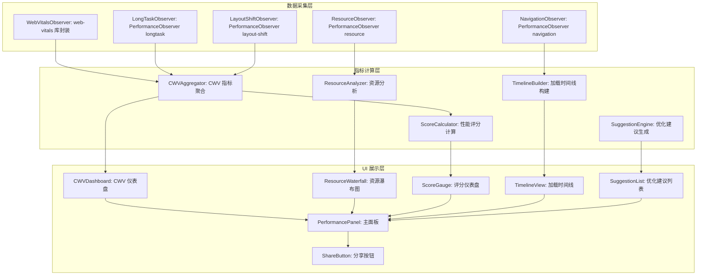
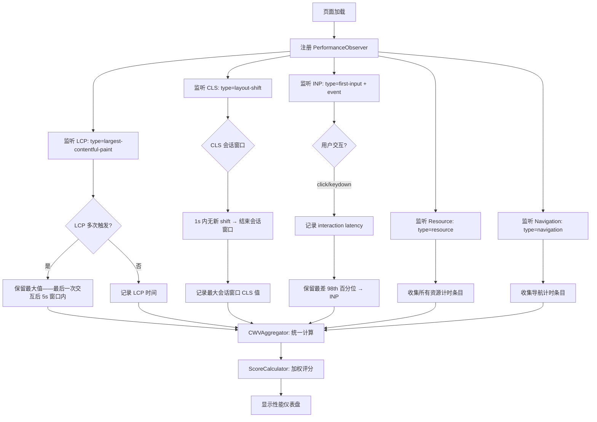

# YP-09-204: 页面性能分析 — 当前页面 Core Web Vitals 展示、资源瀑布图、性能优化建议、性能评分、分享分析结果

> 需求编号：YP-09-204 · 优先级：P2 · 人天：0.2d · 状态：需求已编写
> 依赖：无

## 背景

### 问题陈述

前端开发者需要频繁分析页面性能——但现有工具的体验存在多个断点：

1. **工具切换成本高**：开发者需要打开 DevTools → Performance Tab → 录制 → 分析——或打开 Lighthouse → 等待 30 秒——或打开 PageSpeed Insights 网站——流程割裂
2. **Core Web Vitals 可见性差**：LCP/INP/CLS 是 Google 排名因素——但开发者需要打开多个面板才能看到——没有统一视图
3. **资源瀑布图不友好**：DevTools Network 面板提供了瀑布图——但信息密度过高——难以快速识别性能瓶颈
4. **优化建议分散**：Lighthouse 提供建议——但需要等待审计完成——且建议是静态的——不针对当前页面的实时数据
5. **分享困难**：想将性能数据分享给同事——需要截图多个面板——或复制粘贴冗长的 Lighthouse JSON 报告

**核心矛盾**：Chrome 提供了丰富的性能 API（Performance API、PerformanceObserver、Resource Timing API）——但开发者需要专业的展示层来消费这些数据。YiPet 页面性能分析器利用这些原生 API——提供一个轻量级、即开即用的性能仪表盘。

### 影响范围

| # | 影响 | 严重程度 | 典型场景 |
|---|------|----------|----------|
| 1 | 性能分析工具切换成本高 | 高 | DevTools → Lighthouse → PageSpeed → 来回切换 |
| 2 | Core Web Vitals 不可见 | 高 | 不知道当前页面的 LCP/INP/CLS 值是多少 |
| 3 | 资源瀑布图难以解读 | 中 | 200 个请求的瀑布图——难以找到慢请求 |
| 4 | 优化建议缺乏针对性 | 中 | Lighthouse 通用建议——不针对当前页面的具体问题 |
| 5 | 性能数据难以分享 | 中 | 截图多个面板——粘贴到聊天窗口 |

### 挑战

| 挑战 | 说明 |
|------|------|
| Core Web Vitals 延迟获取 | LCP/INP/CLS 需要页面完全加载和用户交互后才能测量——可能晚于页面打开 10 秒 |
| 资源计时数据量大 | 页面可能有 200+ 个资源请求——每个都有详细的计时数据——渲染瀑布图需要虚拟化 |
| Performance API 精度差异 | 不同浏览器和设备的 Performance API 时间精度不同——可能影响微秒级分析 |
| INP 需要真实用户交互 | Interaction to Next Paint 需要用户实际交互才能测量——无法通过脚本模拟 |
| 跨域资源计时限制 | 默认情况下 Resource Timing API 不暴露跨域资源的详细计时——需要 Timing-Allow-Origin 头部 |

---

## 一、现状分析

### 1.1 当前性能分析工具和能力

```
浏览器原生能力:
├── Performance API
│   ├── performance.now() — 高精度时间戳
│   ├── performance.getEntriesByType('navigation') — 导航计时
│   ├── performance.getEntriesByType('resource') — 资源计时
│   ├── performance.getEntriesByType('paint') — FP/FCP 指标
│   └── performance.getEntriesByType('layout-shift') — CLS 累积
├── PerformanceObserver
│   ├── type: 'largest-contentful-paint' — LCP
│   ├── type: 'layout-shift' — CLS
│   ├── type: 'first-input' — FID
│   ├── type: 'longtask' — 长任务
│   └── type: 'event' (duration > 50ms) — INP
├── Resource Timing API
│   └── 每个资源的 DNS/TCP/TLS/Request/Response 计时
├── Navigation Timing API
│   └── 页面加载的完整时间线
└── DevTools
    ├── Performance Panel — 火焰图录制
    ├── Network Panel — 资源瀑布图
    └── Lighthouse — 综合审计

现有 YiPet 相关功能:
├── 无页面性能分析功能
└── 无

缺失:
├── Core Web Vitals 实时面板                    # ❌ 无
├── 资源瀑布图可视化                             # ❌ 无
├── 性能评分（0-100）                            # ❌ 无
├── 性能优化建议                                 # ❌ 无
├── 性能趋势追踪                                 # ❌ 无
├── 性能数据分享（截图/文本/JSON）              # ❌ 无
└── 页面加载时间线可视化                         # ❌ 无
```

### 1.2 性能分析流程（现状 vs 目标）

```mermaid
graph TD
    subgraph Current["现状：多工具切换"]
        C1[页面加载慢——感觉卡顿] --> C2[打开 DevTools → Performance Tab]
        C2 --> C3[点击录制 → 操作页面 → 停止]
        C3 --> C4[在火焰图中寻找瓶颈——耗时 2 分钟]
        C4 --> C5[记录 LCP 时间——FCP 时间]
        C5 --> C6[打开 Lighthouse Tab → 生成报告——等待 30s]
        C6 --> C7[阅读优化建议——截图保存]
        C7 --> C8[打开聊天窗口——粘贴截图给同事]
    end

    subgraph Target["目标：YiPet 页面性能分析器"]
        T1[页面加载——或用户主动触发] --> T2[PerformanceObserver 自动收集 CWV]
        T2 --> T3[打开 YiPet 性能面板——实时显示]
        T3 --> T4[查看 Core Web Vitals 仪表盘]
        T4 --> T5{LCP > 2.5s?}
        T5 -->|是| T6[红色标记——查看慢请求]
        T5 -->|否| T7[绿色通过]
        T6 --> T8[切换到资源瀑布图——找到 LCP 资源]
        T8 --> T9[查看该资源的详细计时: DNS/TCP/TLS/下载]
        T9 --> T10[系统自动生成优化建议]
        T10 --> T11[一键分享性能报告]
        T7 --> T11
    end

    style Current fill:#f8d7da,stroke:#dc3545
    style Target fill:#d4edda,stroke:#28a745
```



### 1.3 根因矩阵

| 症状 | 根因 | 触发条件 | 频率 |
|------|------|----------|------|
| 工具切换成本高 | 性能数据分散在多个面板 | 每次性能分析时 | 高 |
| CWV 数据不直观 | 无统一可视化面板 | 想了解页面性能状态时 | 高 |
| 资源瀑布图难解读 | 信息密度过高+无过滤排序 | 分析 50+ 资源请求时 | 中 |
| 优化建议不具体 | 通用建议未关联实时数据 | 想针对性优化时 | 中 |
| 分享困难 | 无导出/分享功能 | 团队协作时 | 中 |

---

## 二、设计决策

### 决策 1：CWV 数据来源 — PerformanceObserver 实时 vs Web Vitals 库 vs CrUX API

| 选项 | 数据实时性 | 准确性 | 依赖 | 实现复杂度 |
|------|----------|--------|------|-----------|
| PerformanceObserver（原生） | 实时 | 中（需自行计算） | 无 | 中 |
| web-vitals 库（Google 官方） | 实时 | 高（Google 官方算法） | npm 包 | 低 |
| CrUX API（Chrome UX Report） | 28 天聚合数据 | 极高（真实用户） | API Key + 网络 | 中 |

**选择：web-vitals 库 + PerformanceObserver 补充。** web-vitals 是 Google 官方库——提供准确的 CWV 计算（处理了 LCP 的多次触发、CLS 的会话窗口等边缘情况）。同时使用 PerformanceObserver 收集额外的性能数据（资源计时、长任务、导航计时）——补充 web-vitals 未覆盖的指标。

### 决策 2：资源瀑布图渲染 — Canvas vs SVG vs DOM 虚拟列表

| 选项 | 大数据量性能 | 交互性 | 实现复杂度 |
|------|----------|--------|-----------|
| Canvas 绘制 | 极高（GPU 加速——500+ 请求流畅） | 低（需自行实现点击/悬停） | 高 |
| SVG 元素 | 中（100+ 请求后卡顿） | 中（原生事件） | 中 |
| DOM 虚拟列表（横向条形图） | 高（虚拟滚动） | 高（CSS 原生） | 低 |

**选择：DOM 虚拟列表（横向条形图）。** 0.2d 预算内 Canvas 实现瀑布图不现实。使用简化的横向条形图——每条表示一个资源请求——按时间轴排列——宽度代表耗时。虚拟滚动（最多可见 30 条——实际可有 200+）保证渲染性能。比 SVG 更灵活——比 Canvas 更易实现。

### 决策 3：性能评分模型 — Lighthouse 评分 vs 自定义加权 vs 简单阈值

| 选项 | 行业认可度 | 实现复杂度 | 说明 |
|------|----------|-----------|------|
| 复制 Lighthouse 评分算法（4 项加权） | 高 | 高 | 性能 50%/可访问性 20%/最佳实践 20%/SEO 10% |
| 自定义加权评分（仅 CWV） | 中 | 低 | LCP 40%/INP 35%/CLS 25% |
| 简单绿/黄/红阈值 | 低 | 极低 | 仅颜色分级——无分数 |

**选择：自定义加权评分（仅 CWV + 补充指标）。** 0.2d 预算下——聚焦 CWV 核心指标。评分公式：`score = LCP_score * 0.35 + INP_score * 0.30 + CLS_score * 0.20 + TTFB_score * 0.15`。每个子项 0-100——根据 Google 的阈值（Good/Needs Improvement/Poor）线性插值。结果近似 Lighthouse 性能分——但仅基于实时测量数据。

### 决策 4：分享格式 — 截图 vs JSON 报告 vs Markdown vs 复制链接

| 选项 | 信息完整度 | 可读性 | 实现复杂度 |
|------|----------|--------|-----------|
| 截图（html2canvas） | 中（可视化——无原始数据） | 高 | 低 |
| JSON 报告 | 高（完整数据） | 低（需解析） | 低 |
| Markdown 文本 | 中-高（结构化+可读） | 高 | 低 |
| 复制链接（在线报告） | 高 | 高 | 高（需服务端） |

**选择：Markdown 文本 + 截图。** Markdown 格式可读性强——适合粘贴到聊天窗口——自动渲染为富文本。截图作为补充——提供可视化图表。JSON 作为内部格式——需要时可导出。

### 设计决策记录

| 决策 | 选项 A | 选项 B | 选项 C | 选择 | 理由 |
|------|--------|--------|--------|------|------|
| CWV 数据来源 | PerformanceObserver | web-vitals | CrUX API | **web-vitals + 原生** | 官方准确+补充数据 |
| 瀑布图渲染 | Canvas | SVG | DOM 虚拟列表 | **DOM 虚拟列表** | 预算+易实现 |
| 性能评分 | Lighthouse | 自定义加权 | 简单阈值 | **自定义加权** | CWV 专注+低复杂度 |
| 分享格式 | 截图 | JSON | Markdown | **Markdown + 截图** | 可读+可视化 |

---

## 三、目标架构

### 3.1 页面性能分析系统架构



### 3.2 CWV 数据采集流程



### 3.3 性能指标

| 指标 | 目标值 | 说明 |
|------|--------|------|
| PerformanceObserver 注册 | < 10ms | 页面加载时同步注册 |
| CWV 数据采集完成 | < 15s | 取决于用户交互（INP 需要交互） |
| 资源瀑布图渲染（200 条） | < 100ms | 虚拟滚动初始渲染 |
| 评分计算 | < 5ms | 纯数学计算 |
| 优化建议生成 | < 10ms | 规则匹配——无 API 调用 |
| Markdown 报告生成 | < 50ms | 字符串拼接+截图 |

---

## 四、具体改动

### 4.1 类型定义

```typescript
// src/page-perf/types.ts (新增)

export interface CoreWebVitals {
  lcp: number | null;           // Largest Contentful Paint (ms)
  inp: number | null;           // Interaction to Next Paint (ms)
  cls: number | null;           // Cumulative Layout Shift (score)
  fcp: number | null;           // First Contentful Paint (ms)
  ttfb: number | null;          // Time to First Byte (ms)
}

export type VitalRating = 'good' | 'needs-improvement' | 'poor';

export const CWV_THRESHOLDS: Record<keyof CoreWebVitals, { good: number; poor: number }> = {
  lcp: { good: 2500, poor: 4000 },
  inp: { good: 200, poor: 500 },
  cls: { good: 0.1, poor: 0.25 },
  fcp: { good: 1800, poor: 3000 },
  ttfb: { good: 800, poor: 1800 },
};

export interface ResourceTiming {
  url: string;
  type: string;                 // script/style/image/font/fetch/xhr
  startTime: number;
  duration: number;
  dns: number;
  tcp: number;
  tls: number;
  request: number;
  response: number;
  transferSize: number;
  encodedBodySize: number;
  decodedBodySize: number;
  statusCode: number;           // 仅同源可见
  protocol: string;             // h2/h3/http1.1
}

export interface NavigationTiming {
  domContentLoaded: number;
  loadComplete: number;
  domInteractive: number;
  firstPaint: number;
  redirectCount: number;
  type: 'navigate' | 'reload' | 'back_forward' | 'prerender';
}

export interface PerformanceScore {
  overall: number;              // 0-100
  lcpScore: number;
  inpScore: number;
  clsScore: number;
  ttfbScore: number;
  rating: VitalRating;
}

export interface OptimizationSuggestion {
  id: string;
  category: 'lcp' | 'inp' | 'cls' | 'network' | 'resource';
  severity: 'critical' | 'warning' | 'info';
  title: string;
  description: string;
  details: string;             // 具体数据（如"当前 LCP: 3.2s——阈值为 2.5s"）
  action: string;              // 可执行建议
}

export interface PerformanceReport {
  url: string;
  timestamp: number;
  userAgent: string;
  cwv: CoreWebVitals;
  score: PerformanceScore;
  navigation: NavigationTiming;
  resourceStats: {
    totalRequests: number;
    totalSize: number;
    slowestResources: ResourceTiming[];
    byType: Record<string, { count: number; totalSize: number }>;
  };
  suggestions: OptimizationSuggestion[];
}

export const CWV_LABELS: Record<keyof CoreWebVitals, string> = {
  lcp: 'LCP 最大内容绘制',
  inp: 'INP 交互延迟',
  cls: 'CLS 累计布局偏移',
  fcp: 'FCP 首次内容绘制',
  ttfb: 'TTFB 首字节时间',
};

export function getVitalRating(key: keyof CoreWebVitals, value: number): VitalRating {
  const thresholds = CWV_THRESHOLDS[key];
  if (value <= thresholds.good) return 'good';
  if (value <= thresholds.poor) return 'needs-improvement';
  return 'poor';
}
```

### 4.2 优化建议引擎

```typescript
// src/page-perf/SuggestionEngine.ts (新增)

export class SuggestionEngine {
  generate(report: PerformanceReport): OptimizationSuggestion[] {
    const suggestions: OptimizationSuggestion[] = [];
    this.checkLCP(report, suggestions);
    this.checkINP(report, suggestions);
    this.checkCLS(report, suggestions);
    this.checkResources(report, suggestions);
    this.checkNetwork(report, suggestions);
    return suggestions;
  }

  private checkLCP(report: PerformanceReport, out: OptimizationSuggestion[]): void {
    const { lcp } = report.cwv;
    if (lcp && lcp > 2500) {
      // 找到 LCP 元素（最大的图片/文本块）
      const lcpResource = report.resourceStats.slowestResources
        .find(r => r.type === 'image' && r.duration > 500);
      if (lcpResource) {
        out.push({
          id: 'lcp-slow-image',
          category: 'lcp',
          severity: 'critical',
          title: 'LCP 元素（图片）加载过慢',
          description: `LCP 时间为 ${(lcp / 1000).toFixed(1)}s——超过推荐值 2.5s`,
          details: `慢速图片: ${lcpResource.url}——耗时 ${(lcpResource.duration / 1000).toFixed(1)}s`,
          action: '建议: 使用 <link rel="preload"> 预加载 LCP 图片——或转换为 WebP 格式——或使用 CDN 加速',
        });
      }
    }
  }

  private checkINP(report: PerformanceReport, out: OptimizationSuggestion[]): void {
    const { inp } = report.cwv;
    if (inp && inp > 200) {
      out.push({
        id: 'inp-high',
        category: 'inp',
        severity: inp > 500 ? 'critical' : 'warning',
        title: '交互延迟过高',
        description: `INP 为 ${inp.toFixed(0)}ms——超过推荐值 200ms——页面响应迟缓`,
        details: '用户点击/键盘输入后需要等待较长时间才能看到视觉反馈',
        action: '建议: 检查长任务（> 50ms）——拆分主线程工作——使用 Web Worker 处理重计算——减少事件处理函数中的同步操作',
      });
    }
  }

  private checkCLS(report: PerformanceReport, out: OptimizationSuggestion[]): void {
    const { cls } = report.cwv;
    if (cls && cls > 0.1) {
      out.push({
        id: 'cls-high',
        category: 'cls',
        severity: cls > 0.25 ? 'critical' : 'warning',
        title: '布局偏移过大',
        description: `CLS 值为 ${cls.toFixed(3)}——超过推荐值 0.1——页面元素发生意外移动`,
        details: '图片/广告/iframe 等元素在加载后改变了页面布局',
        action: '建议: 为图片和视频设置明确的 width/height——为广告预留空间——避免在已有内容上方插入动态内容——使用 transform 动画替代 top/left',
      });
    }
  }

  private checkResources(report: PerformanceReport, out: OptimizationSuggestion[]): void {
    const { byType } = report.resourceStats;
    const jsSize = byType['script']?.totalSize || 0;
    const cssSize = byType['style']?.totalSize || 0;
    const imgSize = byType['image']?.totalSize || 0;
    const fontSize = byType['font']?.totalSize || 0;
    const total = report.resourceStats.totalSize;

    if (jsSize > 500 * 1024) {
      out.push({
        id: 'large-js',
        category: 'resource',
        severity: jsSize > 1024 * 1024 ? 'critical' : 'warning',
        title: 'JavaScript 体积过大',
        description: `JS 总大小 ${(jsSize / 1024).toFixed(0)}KB——可能影响加载和解析性能`,
        details: `JS 占总资源的 ${((jsSize / total) * 100).toFixed(0)}%`,
        action: '建议: 代码分割（dynamic import）——Tree Shaking——按需加载——压缩混淆',
      });
    }

    if (imgSize > 2 * 1024 * 1024) {
      out.push({
        id: 'large-images',
        category: 'resource',
        severity: 'warning',
        title: '图片总体积过大',
        description: `图片总大小 ${(imgSize / 1024).toFixed(0)}KB`,
        details: `共 ${byType['image']?.count || 0} 张图片`,
        action: '建议: 使用 WebP/AVIF 格式——响应式图片（srcset）——延迟加载（loading=lazy）',
      });
    }
  }

  private checkNetwork(_report: PerformanceReport, out: OptimizationSuggestion[]): void {
    const navEntry = performance.getEntriesByType('navigation')[0] as PerformanceNavigationTiming;
    if (navEntry) {
      const ttfb = navEntry.responseStart - navEntry.requestStart;
      if (ttfb > 800) {
        out.push({
          id: 'high-ttfb',
          category: 'network',
          severity: ttfb > 1800 ? 'critical' : 'warning',
          title: '服务器响应时间过长',
          description: `TTFB 为 ${ttfb.toFixed(0)}ms——超过推荐值 800ms`,
          details: `服务器处理请求+网络往返时间`,
          action: '建议: 使用 CDN——启用服务器缓存——优化后端逻辑——使用 HTTP/2 或 HTTP/3',
        });
      }
    }
  }
}
```

### 4.3 文件变更清单

| 文件 | 操作 | 说明 |
|------|------|------|
| `src/page-perf/types.ts` | 新增 | 性能指标、评分、报告类型定义 |
| `src/page-perf/PerfCollector.ts` | 新增 | 数据采集器（web-vitals + PerformanceObserver） |
| `src/page-perf/ScoreCalculator.ts` | 新增 | 性能评分计算器 |
| `src/page-perf/SuggestionEngine.ts` | 新增 | 优化建议生成引擎 |
| `src/components/PerformancePanel.vue` | 新增 | 性能分析主面板 |
| `src/components/CWVDashboard.vue` | 新增 | CWV 仪表盘（环形/条形图） |
| `src/components/ResourceWaterfall.vue` | 新增 | 资源瀑布图（虚拟列表） |
| `src/components/ScoreGauge.vue` | 新增 | 评分仪表盘 |
| `src/components/SuggestionList.vue` | 新增 | 优化建议列表 |
| `src/popup/App.vue` | 修改 | 添加入口 |

---

## 五、实施步骤

| 步骤 | 操作 | 路径 | 验证 | 人天 |
|------|------|------|------|------|
| 1 | 定义类型和常量 | `types.ts` | 所有阈值和标签完整 | 0.01 |
| 2 | 实现 PerfCollector 数据采集 | `PerfCollector.ts` | LCP/INP/CLS/FCP/TTFB 正确采集 | 0.04 |
| 3 | 实现 ScoreCalculator 评分 | `ScoreCalculator.ts` | 评分公式正确——边界测试 | 0.02 |
| 4 | 实现 SuggestionEngine | `SuggestionEngine.ts` | 5 类建议规则覆盖 | 0.03 |
| 5 | 实现 CWV 仪表盘 UI | `CWVDashboard.vue` + `ScoreGauge.vue` | 环形图和评级颜色 | 0.04 |
| 6 | 实现资源瀑布图 | `ResourceWaterfall.vue` | 虚拟滚动——200 条流畅 | 0.03 |
| 7 | 实现分享功能+面板集成 | `SuggestionList.vue` + `PerformancePanel.vue` | Markdown 报告正确——截图可用 | 0.03 |

**总人天：0.20d**

---

## 六、测试规格

### 场景 1：Core Web Vitals 采集

**GIVEN** 页面已加载完成、PerformanceObserver 已注册
**WHEN** 页面中包含一张大图片（LCP 候选）
**THEN** LCP 值正确记录（图片加载完成的时间）
**AND** FCP 值在 LCP 之前
**WHEN** 用户点击页面中的按钮——触发交互
**THEN** INP 值更新（首次交互后）
**WHEN** 页面发生布局偏移（动态加载广告横幅）
**THEN** CLS 值更新

### 场景 2：性能评分计算

**GIVEN** CWV 数据已采集: LCP=2000ms, INP=150ms, CLS=0.05, TTFB=500ms
**WHEN** ScoreCalculator 计算总分
**THEN** 各子项得分均为 90-100——总分为 90+
**AND** 评级为 "good"——显示绿色
**GIVEN** LCP=4000ms, INP=600ms, CLS=0.30, TTFB=2000ms
**WHEN** 计算总分
**THEN** 总分为 20-30——评级为 "poor"——显示红色

### 场景 3：资源瀑布图渲染

**GIVEN** 页面有 150 个资源请求（PerformanceResourceTiming）
**WHEN** 打开资源瀑布图
**THEN** 列表显示 150 条——默认按时间排序
**AND** 每条显示：URL（截断）、类型图标、耗时条形图、大小
**AND** 虚拟滚动仅渲染可见 30 条——滚动流畅无卡顿
**WHEN** 点击某条资源
**THEN** 展开详细计时：DNS/TCP/TLS/Request/Response 分段

### 场景 4：优化建议生成

**GIVEN** LCP=3.5s 且 LCP 元素是一张 2MB 的 PNG 图片
**WHEN** SuggestionEngine 分析报告
**THEN** 生成 "LCP 元素加载过慢" 建议——严重级别 critical
**AND** 建议内容包含：使用 WebP、preload、CDN
**GIVEN** JS 总体积为 1.5MB
**THEN** 生成 "JavaScript 体积过大" 建议——严重级别 critical
**AND** 建议包含：代码分割、Tree Shaking、按需加载

### 场景 5：性能报告分享

**GIVEN** 性能分析已完成
**WHEN** 点击"分享"按钮
**THEN** 生成 Markdown 格式报告——包含 CWV 数值表格、性能评分、TOP 5 慢请求
**AND** Markdown 内容复制到剪切板——可直接粘贴到聊天窗口
**WHEN** 选择"分享截图"
**THEN** 使用 html2canvas 截取性能仪表盘——图片复制到剪切板

### 场景 6：跨域资源有限的计时数据

**GIVEN** 页面加载了来自 CDN 的跨域资源（无 Timing-Allow-Origin 头部）
**WHEN** 资源瀑布图收集数据
**THEN** 跨域资源的 DNS/TCP/TLS 等详细计时显示为 "N/A"
**AND** 但 duration（总耗时）仍然可见（Resource Timing 的 0 级数据始终可用）
**AND** 在 UI 中用小图标标记跨域资源——说明数据有限

---

## 七、风险与缓解

| 风险 | 概率 | 影响 | 缓解措施 |
|------|------|------|----------|
| web-vitals 库体积增加扩展包大小 | 中 | 低 | web-vitals 压缩后约 2KB——可接受——或内联核心逻辑（约 150 行） |
| INP 需要用户交互——无交互则永远不触发 | 高 | 低 | 如果 30 秒内无用户交互——INP 显示 "等待用户交互中..."——不影响其他指标展示 |
| PerformanceObserver 在某些场景不触发（如 back-forward cache） | 低 | 中 | 添加 pageshow 事件监听——恢复时重新注册 Observer |
| 资源计时条目数量受浏览器限制（通常 150-250 条） | 中 | 低 | 在 PerfCollector 初始化时调用 `performance.setResourceTimingBufferSize(500)` 增加缓冲区 |
| html2canvas 截图可能不完整（Shadow DOM 内容不被捕获） | 中 | 低 | 提供"纯文本 Markdown 报告"作为主要分享方式——截图作为附属 |

---

## 八、回滚策略

| 场景 | 回滚操作 | 影响 |
|------|------|------|
| web-vitals 库导致构建失败 | 内联 web-vitals 核心逻辑（~150 行）到 PerfCollector 中 | 功能不变——构建方式回退 |
| PerformanceObserver 导致内存泄漏 | 添加 disconnect() 调用——在扩展休眠时清理 Observer | 无 |
| 性能面板加载过慢 | 将面板拆分——首屏仅显示 CWV 仪表盘——瀑布图按需加载 | 功能可用——加载变慢 |
| html2canvas 截图功能不稳定 | 移除截图分享——仅保留 Markdown 文本分享 | 分享功能降级 |
| 完全移除 | 隐藏性能分析入口——移除页面性能相关代码 | 功能不可用 |

---

## 九、设计决策记录

### D-01：为什么选择 web-vitals 库而非自己实现 CWV 计算？

CWV 计算有许多边缘情况：LCP 在用户交互后会停止更新——CLS 需要会话窗口算法（1s 无 shift 后结束窗口——取最大值）——INP 需要取最差 98 百分位。Google 的 web-vitals 库（2KB 压缩后）已经正确处理了所有这些边缘情况。自己实现需要 > 200 行代码——且容易出错。使用官方库是更好的工程决策。

### D-02：为什么不实现完整的灯塔式审计？

Lighthouse 审计包含 50+ 项检查（性能、可访问性、SEO、最佳实践、PWA）——需要自动化浏览器控制和模拟网络条件。0.2d 预算下不可行。本需求聚焦于实时 CWV + 资源分析 + 针对性建议——基于页面实际运行的性能数据——而非模拟条件下的综合审计。

### D-03：为什么资源瀑布图使用简化的条形图而非时间轴瀑布图？

完整的时间轴瀑布图（每条请求在水平时间轴上显示各阶段开始/结束时间）需要 Canvas 绘制——实现复杂度高。简化的横向条形图（每条一条——宽度=总耗时——悬停显示分段详细信息）在 DOM 中即可实现——提供相同的信息量——但实现成本低得多。

### D-04：为什么评分模型权重为 LCP 35%/INP 30%/CLS 20%/TTFB 15%？

Google 的 CWV 排名因素主要关注 LCP、INP、CLS 三项。LCP 权重最高（35%）——因为它直接影响用户感知的加载速度。INP 次之（30%）——因为交互响应影响用户操作体验。CLS（20%）影响较小——因为大多数页面的 CLS 问题较少。TTFB（15%）作为补充——反映服务器和网络质量——但并非直接 CWV 指标。

---

## 十、可观测性

### 指标

| 指标 | 类型 | 说明 |
|------|------|------|
| `yipet.perf.panel_open_total` | Counter | 性能面板打开次数 |
| `yipet.perf.analysis_complete_total` | Counter | 分析完成次数 |
| `yipet.perf.lcp_value` | Histogram | LCP 值分布 |
| `yipet.perf.inp_value` | Histogram | INP 值分布 |
| `yipet.perf.cls_value` | Histogram | CLS 值分布 |
| `yipet.perf.score_overall` | Histogram | 总体性能评分分布 |
| `yipet.perf.suggestion_count` | Gauge | 每次分析的优化建议数量 |
| `yipet.perf.share_total` | Counter | 分享次数（按格式） |

---

## 十一、代码审查检查清单

- [ ] PerfCollector: 所有 PerformanceObserver 在页面隐藏/休眠时 disconnect()
- [ ] PerfCollector: pageshow 事件恢复时重新注册 Observers
- [ ] PerfCollector: 资源计时缓冲区大小设置为 500——防止数据丢失
- [ ] ScoreCalculator: 评分公式处理 null 值（如 INP 未触发）——使用其他指标权重重新分配
- [ ] ScoreCalculator: 边界值（LCP=2500 精确在 good/poor 边界）——用 <= good 判定为 good
- [ ] SuggestionEngine: 所有建议必须有可执行的操作步骤——不能仅描述问题
- [ ] ResourceWaterfall: 虚拟滚动支持 500 条以上——不卡顿
- [ ] ResourceWaterfall: 资源 URL 截断——保留域名+最后一段路径
- [ ] CWVDashboard: 三色（绿/黄/红）与 Google CWV 颜色一致
- [ ] PerformancePanel: 初始加载时显示"正在收集性能数据..."——而非空白
- [ ] ShareButton: Markdown 模板中数值格式化（ms→s 显示）

---

## 回归问题预测

| # | 预测问题 | 原因 | 验证方法 |
|---|---------|------|---------|
| 1 | 用户在 SPA 页面中导航——PerfCollector 未重置——旧数据和新数据混合 | SPA 路由切换不触发页面重载——PerformanceObserver 持续运行——混合了前一页的资源条目 | 监听 popstate/hashchange 事件——检测到路由变化时重置 PerfCollector 并清空缓冲区 |
| 2 | PerformanceObserver 的回调在某些 Chrome 版本中未被调用 | Chrome 对 PerformanceObserver 的某些类型支持有差异（如 event 类型仅 Chrome 96+） | 检测浏览器版本——对不支持的 observer 类型降级为轮询 performance.getEntries() |
| 3 | 用户连续打开多个标签页——每个标签页的 Content Script 都注入 web-vitals——多个 LCP 同时触发 | web-vitals 在多个标签页中独立运行——无冲突——但用户可能混淆不同标签页的数据 | 在性能面板中明确显示当前分析的页面 URL——防止混淆 |
| 4 | 资源瀑布图在包含 iframe 的页面中混合了主页面和 iframe 的请求 | performance.getEntriesByType('resource') 返回所有同源 context 的条目——包括 iframe | 过滤掉 initiatorType 不是主文档发起的请求——或使用 frame 属性区分 |
| 5 | 用户页面有 Service Worker——资源计时数据可能不准确（SW 缓存命中的资源计时） | SW 缓存命中时——Resource Timing 的时间可能为 0 或非常小 | 在瀑布图中标记 "from ServiceWorker" 的资源——用不同颜色显示 |
| 6 | 性能评分为 100 但实际上有未检测到的问题（如 FID 需要真实用户但 INP 使用实验性 API） | INP 使用 event timing API（实验性——Chrome 96+）——可能不准确 | 在 UI 中标注 INP 为"实验性指标"——提示可能与真实用户体验有偏差 |

---

## 性能分析

### 各阶段耗时

| 操作 | 首次 | 后续 |
|------|------|------|
| PerformanceObserver 注册 | < 5ms | < 2ms |
| CWV 数据采集 | 10-15s（等待 LCP + INP） | N/A（单次） |
| 资源条目遍历（200 条） | < 10ms | < 10ms |
| 评分计算 | < 5ms | < 5ms |
| 优化建议生成 | < 10ms | < 10ms |
| 瀑布图渲染（200 条虚拟滚动） | < 100ms | < 50ms |
| Markdown 报告生成 | < 30ms | < 30ms |

### 存储预估

| 数据 | 大小 |
|------|------|
| CWV 指标值（5 个数字） | < 100B |
| 资源计时数据（200 条） | ~50KB |
| 导航计时数据 | ~1KB |
| 优化建议（5-10 条） | ~2KB |
| 性能评分 | < 100B |
| **总计（单次分析）** | **~53KB** |

### 代码体积

| 文件 | 大小 |
|------|------|
| types.ts | ~3KB |
| PerfCollector.ts | ~4KB |
| ScoreCalculator.ts | ~2KB |
| SuggestionEngine.ts | ~4KB |
| Vue 组件（6 个） | ~12KB |
| web-vitals 库（内联） | ~2KB |
| **总计** | **~27KB** |