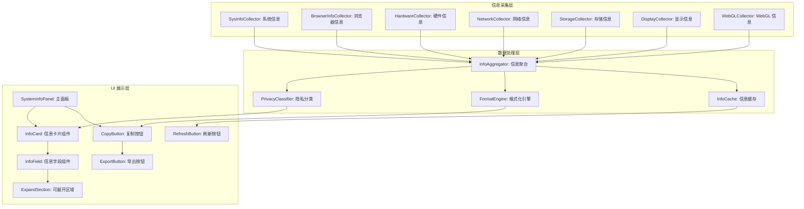
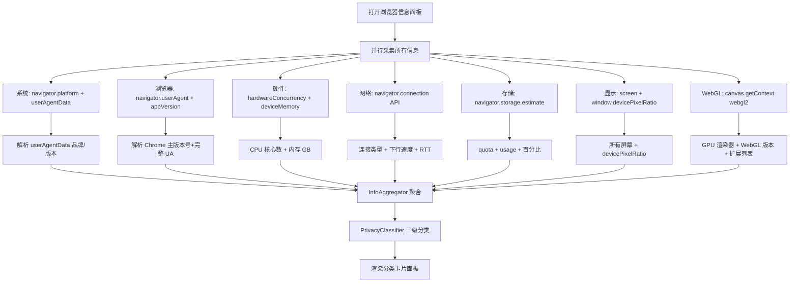

# YP-09-205: 浏览器信息展示 — 详细浏览器/系统信息面板、WebGL 支持、存储配额、已安装字体数量、屏幕详情、连接信息、复制系统信息用于调试

> 需求编号：YP-09-205 · 优先级：P2 · 人天：0.2d · 状态：需求已编写
> 依赖：无

## 背景

### 问题陈述

当用户报告 YiPet 的 bug 或前端开发者在调试兼容性问题时——收集浏览器和系统信息是第一步——但当前流程极其低效：

1. **信息分散**：浏览器版本在 `chrome://version`、屏幕分辨率在 DevTools Console、WebGL 信息在单独的检测页面、存储配额在 `chrome://quota-internals`——需要打开 4-5 个页面
2. **用户不会收集**：终端用户不知道如何获取浏览器信息——当开发者问"你用的什么浏览器版本？"——用户回答"最新版"或"谷歌"——无用
3. **格式不一致**：开发者手动从不同来源拼接信息——格式各异——每次都需要重新整理
4. **WebGL 信息隐藏**：WebGL 支持状态（GPU 型号、驱动版本、扩展列表）是排查渲染问题的关键——但隐藏在 `chrome://gpu` 中——普通用户无法访问
5. **存储配额不可见**：开发者想知道 localStorage/indexedDB/Cache Storage 的占用——需要写脚本——没有可视化界面

**核心矛盾**：浏览器暴露了丰富的系统和硬件信息（通过 20+ 个 Web API）——但没有一个统一的面板来展示它们。YiPet 浏览器信息面板收集所有可用的浏览器和系统信息——以结构化的方式展示——并提供一键复制功能。

### 影响范围

| # | 影响 | 严重程度 | 典型场景 |
|---|------|----------|----------|
| 1 | 信息收集效率低 | 高 | 每次 bug 报告需要 5 分钟收集环境信息 |
| 2 | 用户提供的信息不准确 | 高 | "最新版 Chrome"——实际上是 3 个版本前的 |
| 3 | GPU/渲染信息难以获取 | 中 | 排查 Canvas/WebGL 渲染 bug 时 |
| 4 | 存储信息不可见 | 中 | 排查存储配额超限导致的 bug |
| 5 | 多屏幕信息不完整 | 低 | 多显示器设置——不知道主屏幕分辨率 |

### 挑战

| 挑战 | 说明 |
|------|------|
| 隐私保护 | 部分信息（如精确屏幕分辨率、GPU 型号）可作为指纹——需要用户明确知晓并授权展示 |
| API 可用性差异 | 部分 API（如 `navigator.getBattery`、`navigator.connection`）在不同浏览器/平台不可用 |
| 信息过时 | 硬件信息（如 GPU）可能在 eGPU 热插拔后变化——需要刷新机制 |
| 存储配额计算 | 不同存储类型（localStorage/indexedDB/Cache/OPFS）需要分别调用 `estimate()` API |
| WebGL 信息获取 | WebGL 上下文创建后需要提取大量参数——不同浏览器返回的字符串格式不同 |

---

## 一、现状分析

### 1.1 当前浏览器信息获取方式

```
现有信息源（分散）:
├── chrome://version
│   ├── 浏览器版本、用户代理、命令行参数
│   └── 需要用户在地址栏输入——多数用户不知道
├── chrome://gpu
│   ├── GPU 信息、WebGL 支持、驱动版本
│   └── 高度技术化页面——普通用户无法理解
├── chrome://quota-internals
│   └── 存储配额详情——仅开发者模式可用
├── chrome://system
│   ├── 操作系统版本、硬件信息
│   └── 信息过于详细——难以提取关键数据
├── DevTools Console
│   ├── navigator.userAgent → 手动复制
│   ├── screen.width/height → 手动查询
│   └── 每项需要单独执行命令
├── navigator Web APIs（可用但无统一面板）
│   ├── navigator.userAgent / platform / language
│   ├── navigator.hardwareConcurrency
│   ├── navigator.deviceMemory
│   ├── navigator.connection (NetworkInformation)
│   ├── screen.width / height / colorDepth
│   ├── window.devicePixelRatio
│   └── 20+ 个分散的 API
└── 第三方检测网站（如 browserleaks.com）
    └── 存在隐私风险——数据可能被收集

现有 YiPet 相关功能:
├── YP-09-069 诊断信息收集（桌面端安装信息）
└── 无浏览器/系统信息面板

缺失:
├── 统一信息面板                                # ❌ 无
├── 分类展示（系统/浏览器/硬件/网络/存储）       # ❌ 无
├── 一键复制格式化信息                           # ❌ 无
├── WebGL/GPU 详情展示                          # ❌ 无
├── 存储配额可视化                               # ❌ 无
├── 多屏幕信息                                   # ❌ 无
└── 信息导出（Markdown/JSON）                    # ❌ 无
```

### 1.2 信息收集流程（现状 vs 目标）

```mermaid
graph TD
    subgraph Current["现状：多来源手动拼接"]
        C1[收到 bug 报告——需要环境信息] --> C2[让用户打开 chrome://version——截图]
        C2 --> C3[让用户打开 chrome://gpu——截图 GPU 信息]
        C3 --> C4[让用户执行 console 命令——获取屏幕和存储信息]
        C4 --> C5{用户愿意配合?}
        C5 -->|是| C6[收到 4 张截图——手动整理到 bug 报告中——5 分钟]
        C5 -->|否| C7[信息不全——无法定位问题]
    end

    subgraph Target["目标：YiPet 浏览器信息面板"]
        T1[用户打开 YiPet 浏览器信息面板] --> T2[自动收集所有可用信息]
        T2 --> T3[分类展示: 系统/浏览器/硬件/网络/存储]
        T3 --> T4{需要分享给开发者?}
        T4 -->|是| T5[点击"复制系统信息"]
        T5 --> T6[格式化 Markdown 信息复制到剪切板]
        T6 --> T7[粘贴到 bug 报告或聊天窗口——3 秒]
        T4 -->|否| T8[浏览信息——排查自己的问题]
    end

    style Current fill:#f8d7da,stroke:#dc3545
    style Target fill:#d4edda,stroke:#28a745
```

### 1.3 根因矩阵

| 症状 | 根因 | 触发条件 | 频率 |
|------|------|----------|------|
| 环境信息收集耗时 | 信息分散在多个页面和 API | 每次 bug 报告 | 高 |
| 用户提供不准确信息 | 不知道如何获取 | 非技术用户报告 bug 时 | 高 |
| GPU/WebGL 信息难获取 | 隐藏在 chrome://gpu 中 | 排查渲染问题时 | 中 |
| 存储信息不透明 | 无可视化存储配额面板 | 排查存储相关 bug 时 | 中 |
| 多屏幕/多显示器信息遗漏 | 标准 API 仅返回主屏幕 | 多显示器用户 | 低 |

---

## 二、设计决策

### 决策 1：信息展示结构 — 平铺列表 vs 分类卡片 vs 分类折叠面板

| 选项 | 可扫描性 | 信息密度 | 实现复杂度 |
|------|----------|---------|-----------|
| 平铺列表（所有信息一列） | 低（信息过载） | 高 | 低 |
| 分类卡片（5-6 张卡片——每张一个类别） | 高 | 中-高 | 中 |
| 分类折叠面板（每类可展开/收起） | 高 | 中（默认折叠部分信息） | 中 |

**选择：分类卡片 + 一键展开全部。** 卡片视觉上区分不同信息类别——用户可以快速定位（如"网络信息"卡片）。默认展示关键字段（浏览器版本、操作系统、屏幕分辨率）——其他字段通过"展开"查看详情。一键"展开全部"用于复制前的完整信息查看。

### 决策 2：复制格式 — 纯文本 vs Markdown vs JSON vs YAML

| 选项 | 可读性 | 机器可解析 | 粘贴到聊天窗口效果 |
|------|--------|----------|-----------------|
| 纯文本（Key: Value） | 中 | 低 | 中 |
| Markdown 表格 | 高 | 中 | 高（富文本渲染） |
| JSON | 低（人类不友好） | 高 | 低（长文本块） |
| YAML | 中-高 | 高 | 中 |

**选择：Markdown 表格。** 粘贴到企业微信/Slack/Discord 等聊天工具时——Markdown 表格自动渲染为富文本表格——可读性高。同时提供 JSON 导出选项（"导出 JSON"按钮）用于程序化处理。Markdown 是调试交流的最佳格式——既人类可读又结构化。

### 决策 3：WebGL 信息获取深度 — 基本信息 vs 详细扩展列表 vs 完整 GPU 报告

| 选项 | 信息量 | 隐私风险 | 性能影响 | 实现复杂度 |
|------|--------|---------|---------|-----------|
| 基本信息（支持/不支持 + 渲染器名称） | 低 | 低 | 无 | 低 |
| 详细扩展列表（支持的所有 WebGL 扩展） | 中 | 中（可做指纹） | 中（创建 WebGL 上下文） | 中 |
| 完整 GPU 报告（参数+限制+能力矩阵） | 高 | 中-高 | 中-高 | 高 |

**选择：基本信息 + 详细扩展列表。** 渲染器名称（GPU 型号）和 WebGL 版本是排查渲染 bug 时最需要的信息。支持哪些扩展（如 `EXT_texture_filter_anisotropic`、`OES_texture_float`）直接影响图形功能可用性。完整 GPU 报告中的参数限制（MAX_TEXTURE_SIZE 等）虽然有用——但 0.2d 预算内暂不覆盖。

### 决策 4：隐私处理 — 全部展示 vs 敏感信息隐藏 vs 用户确认后再展示

| 选项 | 隐私保护度 | 调试价值 | 用户体验 |
|------|----------|---------|---------|
| 全部展示 | 低 | 高 | 中（用户可能不安） |
| 敏感信息隐藏（IP/精确位置等） | 中 | 中（丢失部分调试信息） | 中-高 |
| 分类展示——敏感信息标注并默认折叠 | 高 | 高 | 高（透明+可控） |

**选择：分类展示——敏感信息标注并默认折叠。** 区分三个隐私级别：公开（浏览器版本、操作系统、屏幕尺寸）、半公开（GPU 型号、已安装字体数、语言列表——默认折叠）、私有（IP 地址、精确地理位置——默认隐藏并标注"可能包含隐私信息"——用户需手动点击展示）。

### 设计决策记录

| 决策 | 选项 A | 选项 B | 选项 C | 选择 | 理由 |
|------|--------|--------|--------|------|------|
| 展示结构 | 平铺列表 | 分类卡片 | 折叠面板 | **分类卡片 + 展开** | 可扫描+信息密度 |
| 复制格式 | 纯文本 | Markdown | JSON | **Markdown + JSON** | 人类可读+机器可解析 |
| WebGL 深度 | 基本信息 | 扩展列表 | 完整报告 | **基本信息+扩展** | 调试价值/成本最优 |
| 隐私处理 | 全部展示 | 隐藏敏感 | 分类标注 | **三级分类标注** | 透明+可控 |

---

## 三、目标架构

### 3.1 浏览器信息系统架构



### 3.2 信息采集流程



### 3.3 性能指标

| 指标 | 目标值 | 说明 |
|------|--------|------|
| 信息采集总耗时 | < 200ms | 7 个采集器并行执行 |
| WebGL 上下文创建 | < 50ms | canvas.getContext('webgl2') |
| 存储配额查询 | < 100ms | navigator.storage.estimate() 异步 |
| UI 渲染 | < 50ms | 所有卡片渲染完成 |
| Markdown 导出生成 | < 20ms | 字符串拼接 |
| 刷新重新采集 | < 200ms | 同首次采集 |

---

## 四、具体改动

### 4.1 类型定义

```typescript
// src/browser-info/types.ts (新增)

export type PrivacyLevel = 'public' | 'semi_private' | 'private';

export interface InfoField {
  key: string;
  label: string;
  value: string | number | boolean | null;
  privacyLevel: PrivacyLevel;
  category: InfoCategory;
  description?: string;         // 鼠标悬停提示
  visible: boolean;              // 默认是否可见
}

export type InfoCategory =
  | 'system'
  | 'browser'
  | 'hardware'
  | 'network'
  | 'storage'
  | 'display'
  | 'webgl';

export const CATEGORY_LABELS: Record<InfoCategory, string> = {
  system: '操作系统',
  browser: '浏览器',
  hardware: '硬件信息',
  network: '网络连接',
  storage: '存储配额',
  display: '显示设置',
  webgl: 'WebGL / GPU',
};

export const CATEGORY_ICONS: Record<InfoCategory, string> = {
  system: 'desktop',
  browser: 'chrome',
  hardware: 'cpu',
  network: 'wifi',
  storage: 'database',
  display: 'monitor',
  webgl: 'gpu',
};

export interface BrowserInfoSnapshot {
  id: string;
  timestamp: number;
  fields: InfoField[];
  rawData: Record<string, unknown>;    // 原始 API 返回值——供调试
}

export interface DisplayInfo {
  label: string;               // Screen 1, Screen 2, External
  width: number;
  height: number;
  availWidth: number;
  availHeight: number;
  colorDepth: number;
  pixelDepth: number;
  devicePixelRatio: number;
  isPrimary: boolean;
  orientation: string;
}

export interface WebGLInfo {
  supported: boolean;
  version: string;             // WebGL 1.0 / WebGL 2.0
  renderer: string;            // GPU 型号——如 "ANGLE (NVIDIA, NVIDIA GeForce RTX 3060)"
  vendor: string;              // GPU 厂商
  shadingLanguageVersion: string;
  maxTextureSize: number;
  maxViewportDims: number[];
  extensions: string[];        // 支持的扩展列表
  maxDrawBuffers: number;
  maxCombinedTextureImageUnits: number;
}

export interface StorageInfo {
  quota: number;               // 总配额——字节
  usage: number;               // 已使用——字节
  usagePercent: number;        // 使用百分比
  persisted: boolean;          // 是否持久化存储
  breakdown: {                 // 分类占用
    localStorage: number;
    indexedDB: number;
    cacheStorage: number;
    serviceWorker: number;
    other: number;
  };
}

export interface NetworkInfo {
  online: boolean;
  type: string;                // wifi/ethernet/cellular/none
  effectiveType: string;       // slow-2g/2g/3g/4g
  downlink: number;            // Mbps
  downlinkMax: number;
  rtt: number;                 // 毫秒
  saveData: boolean;           // 省流量模式
}
```

### 4.2 核心采集器

```typescript
// src/browser-info/collectors/SystemCollector.ts (新增)

export class SystemCollector {
  collect(): InfoField[] {
    const fields: InfoField[] = [];

    // User-Agent Client Hints (现代 API)
    if ('userAgentData' in navigator) {
      const uad = navigator.userAgentData as any;
      fields.push({
        key: 'platform', label: '平台', value: uad.platform || navigator.platform,
        privacyLevel: 'public', category: 'system', visible: true,
        description: '操作系统平台',
      });
      // brands 中提取浏览器品牌
      if (uad.brands) {
        const chrome = uad.brands.find((b: any) => b.brand.includes('Chromium'));
        if (chrome) {
          fields.push({
            key: 'browser_brand', label: '浏览器品牌', value: `${chrome.brand} ${chrome.version}`,
            privacyLevel: 'public', category: 'system', visible: true,
          });
        }
      }
    }

    fields.push(
      { key: 'user_agent', label: 'User Agent', value: navigator.userAgent,
        privacyLevel: 'public', category: 'browser', visible: true,
        description: '完整用户代理字符串' },
      { key: 'language', label: '浏览器语言', value: navigator.language,
        privacyLevel: 'public', category: 'browser', visible: true },
      { key: 'languages', label: '接受语言', value: navigator.languages.join(', '),
        privacyLevel: 'semi_private', category: 'browser', visible: false },
      { key: 'cookie_enabled', label: 'Cookie 启用', value: navigator.cookieEnabled ? '是' : '否',
        privacyLevel: 'public', category: 'browser', visible: true },
      { key: 'do_not_track', label: 'Do Not Track', value: navigator.doNotTrack || '未设置',
        privacyLevel: 'public', category: 'browser', visible: false },
      { key: 'online', label: '在线状态', value: navigator.onLine ? '在线' : '离线',
        privacyLevel: 'public', category: 'network', visible: true },
    );

    return fields;
  }
}

// src/browser-info/collectors/HardwareCollector.ts (新增)

export class HardwareCollector {
  collect(): InfoField[] {
    const fields: InfoField[] = [];

    fields.push(
      { key: 'cpu_cores', label: 'CPU 核心数', value: navigator.hardwareConcurrency || '未知',
        privacyLevel: 'semi_private', category: 'hardware', visible: true },
      { key: 'device_memory', label: '设备内存',
        value: (navigator as any).deviceMemory ? `${(navigator as any).deviceMemory} GB` : '未知',
        privacyLevel: 'semi_private', category: 'hardware', visible: true },
      { key: 'max_touch_points', label: '最大触摸点', value: navigator.maxTouchPoints,
        privacyLevel: 'public', category: 'hardware', visible: false,
        description: '支持的同时触摸点数（0=非触屏设备）' },
    );

    return fields;
  }
}

// src/browser-info/collectors/WebGLCollector.ts (新增)

export class WebGLCollector {
  collect(): InfoField[] {
    const fields: InfoField[] = [];
    const canvas = document.createElement('canvas');
    const gl = canvas.getContext('webgl2') || canvas.getContext('webgl');

    if (!gl) {
      fields.push({
        key: 'webgl_supported', label: 'WebGL 支持', value: '不支持',
        privacyLevel: 'public', category: 'webgl', visible: true,
      });
      return fields;
    }

    const debugInfo = gl.getExtension('WEBGL_debug_renderer_info');

    fields.push(
      { key: 'webgl_version', label: 'WebGL 版本', value: gl instanceof WebGL2RenderingContext ? 'WebGL 2.0' : 'WebGL 1.0',
        privacyLevel: 'public', category: 'webgl', visible: true },
      { key: 'gpu_renderer', label: 'GPU 渲染器',
        value: debugInfo ? gl.getParameter(debugInfo.UNMASKED_RENDERER_WEBGL) : '未知（无调试扩展）',
        privacyLevel: 'semi_private', category: 'webgl', visible: true,
        description: '实际使用的 GPU 型号' },
      { key: 'gpu_vendor', label: 'GPU 厂商',
        value: debugInfo ? gl.getParameter(debugInfo.UNMASKED_VENDOR_WEBGL) : '未知',
        privacyLevel: 'semi_private', category: 'webgl', visible: true },
      { key: 'shader_version', label: '着色器语言版本',
        value: gl.getParameter(gl.SHADING_LANGUAGE_VERSION),
        privacyLevel: 'public', category: 'webgl', visible: false },
      { key: 'max_texture_size', label: '最大纹理尺寸',
        value: `${gl.getParameter(gl.MAX_TEXTURE_SIZE)} px`,
        privacyLevel: 'public', category: 'webgl', visible: false },
      { key: 'max_viewport_dims', label: '最大视口',
        value: `${gl.getParameter(gl.MAX_VIEWPORT_DIMS)[0]} x ${gl.getParameter(gl.MAX_VIEWPORT_DIMS)[1]}`,
        privacyLevel: 'public', category: 'webgl', visible: false },
    );

    // WebGL 扩展列表（详细）
    const extensions = gl.getSupportedExtensions();
    if (extensions) {
      fields.push({
        key: 'webgl_extensions', label: 'WebGL 扩展',
        value: `${extensions.length} 个扩展——点击展开列表`,
        privacyLevel: 'semi_private', category: 'webgl', visible: false,
        description: extensions.join(', '),
      });
    }

    canvas.remove();
    return fields;
  }
}

// src/browser-info/collectors/StorageCollector.ts (新增)

export class StorageCollector {
  async collect(): Promise<InfoField[]> {
    const fields: InfoField[] = [];

    try {
      const estimate = await navigator.storage.estimate();
      const quota = estimate.quota || 0;
      const usage = estimate.usage || 0;
      const percent = quota > 0 ? ((usage / quota) * 100).toFixed(1) : '0';

      fields.push(
        { key: 'storage_quota', label: '存储配额',
          value: this.formatBytes(quota),
          privacyLevel: 'semi_private', category: 'storage', visible: true },
        { key: 'storage_usage', label: '已使用',
          value: this.formatBytes(usage),
          privacyLevel: 'semi_private', category: 'storage', visible: true },
        { key: 'storage_percent', label: '使用率',
          value: `${percent}%`,
          privacyLevel: 'semi_private', category: 'storage', visible: true },
      );

      // 检查持久化存储
      if ('persisted' in navigator.storage) {
        const persisted = await navigator.storage.persisted();
        fields.push({
          key: 'storage_persisted', label: '持久化存储',
          value: persisted ? '是（数据不会被自动清理）' : '否（可能被浏览器清理）',
          privacyLevel: 'public', category: 'storage', visible: true,
        });
      }
    } catch {
      fields.push({
        key: 'storage_error', label: '存储信息', value: '无法获取——API 不支持',
        privacyLevel: 'public', category: 'storage', visible: true,
      });
    }

    return fields;
  }

  private formatBytes(bytes: number): string {
    if (bytes === 0) return '0 B';
    const units = ['B', 'KB', 'MB', 'GB', 'TB'];
    const i = Math.floor(Math.log(bytes) / Math.log(1024));
    return `${(bytes / Math.pow(1024, i)).toFixed(1)} ${units[i]}`;
  }
}
```

### 4.3 文件变更清单

| 文件 | 操作 | 说明 |
|------|------|------|
| `src/browser-info/types.ts` | 新增 | 信息字段、分类、隐私级别类型定义 |
| `src/browser-info/collectors/SystemCollector.ts` | 新增 | 系统+浏览器信息采集 |
| `src/browser-info/collectors/HardwareCollector.ts` | 新增 | 硬件信息采集 |
| `src/browser-info/collectors/WebGLCollector.ts` | 新增 | WebGL/GPU 信息采集 |
| `src/browser-info/collectors/StorageCollector.ts` | 新增 | 存储配额信息采集 |
| `src/browser-info/collectors/NetworkCollector.ts` | 新增 | 网络连接信息采集 |
| `src/browser-info/collectors/DisplayCollector.ts` | 新增 | 显示/屏幕信息采集 |
| `src/browser-info/InfoAggregator.ts` | 新增 | 信息聚合+隐私分类+缓存 |
| `src/browser-info/FormatEngine.ts` | 新增 | Markdown/JSON 格式化引擎 |
| `src/components/BrowserInfoPanel.vue` | 新增 | 浏览器信息主面板 |
| `src/components/InfoCard.vue` | 新增 | 分类信息卡片 |
| `src/popup/App.vue` | 修改 | 添加入口 |

---

## 五、实施步骤

| 步骤 | 操作 | 路径 | 验证 | 人天 |
|------|------|------|------|------|
| 1 | 定义类型和分类体系 | `types.ts` | 7 个类别、3 级隐私、30+ 字段定义 | 0.01 |
| 2 | 实现 6 个采集器 | `collectors/*.ts` | 每个采集器返回完整字段列表 | 0.06 |
| 3 | 实现聚合器+隐私分类 | `InfoAggregator.ts` | 所有字段正确分类+隐私标记 | 0.02 |
| 4 | 实现格式化引擎 | `FormatEngine.ts` | Markdown 表格+JSON 均正确 | 0.02 |
| 5 | 实现信息卡片 UI | `InfoCard.vue` | 分类展示+折叠展开+隐私标记 | 0.04 |
| 6 | 实现主面板+复制功能 | `BrowserInfoPanel.vue` + `App.vue` | 一键复制 Markdown 信息 | 0.03 |
| 7 | 刷新+导出功能 | 各组件 | 刷新重新采集——导出 JSON | 0.02 |

**总人天：0.20d**

---

## 六、测试规格

### 场景 1：基本信息采集展示

**GIVEN** 用户在 Chrome 120+ 上打开信息面板
**WHEN** 面板加载完成
**THEN** "浏览器"卡片显示 Chrome 版本号、User Agent、语言
**AND** "操作系统"卡片显示平台信息
**AND** "硬件"卡片显示 CPU 核心数和内存
**AND** 所有信息字段带有分类图标和颜色标记

### 场景 2：WebGL 信息采集

**GIVEN** 设备支持 WebGL 2.0、GPU 为独立显卡
**WHEN** 展开 "WebGL / GPU" 卡片
**THEN** 显示 WebGL 版本为 "WebGL 2.0"
**AND** 显示 GPU 渲染器名称（如 "NVIDIA GeForce RTX 3060"）
**AND** 显示 GPU 厂商名称
**AND** 显示支持的最大纹理尺寸
**AND** 展开 "WebGL 扩展" 查看完整扩展列表（> 30 个）

### 场景 3：存储配额可视化

**GIVEN** 浏览器存储配额为 10GB、已使用 2.3GB
**WHEN** 查看 "存储配额" 卡片
**THEN** 显示总配额: 10.0 GB
**AND** 已使用: 2.3 GB——使用率 23%
**AND** 显示持久化存储状态
**AND** 使用率进度条颜色为绿色（< 50%）

### 场景 4：网络连接信息

**GIVEN** 用户通过 WiFi 连接——下行速度 50Mbps、RTT 30ms
**WHEN** 展开 "网络连接" 卡片
**THEN** 显示连接类型: wifi
**AND** 有效连接类型: 4g
**AND** 下行速度: 50 Mbps
**AND** 往返时间: 30 ms
**AND** 如果离线——在线状态显示"离线"并红色标记

### 场景 5：复制系统信息（Markdown）

**GIVEN** 所有信息已采集完成
**WHEN** 点击 "复制系统信息" 按钮
**THEN** 生成 Markdown 格式文本——包含表格
**AND** 文本复制到剪切板
**AND** 显示 "已复制——可粘贴到聊天窗口" 提示
**WHEN** 粘贴到企业微信/Slack
**THEN** 表格自动渲染为富文本表格——清晰可读
**AND** 敏感信息（标记为 private）未包含在默认复制内容中

### 场景 6：隐私级别控制

**GIVEN** 信息面板已加载——包含 public/semi_private/private 字段
**WHEN** 默认展示状态
**THEN** public 字段直接可见
**AND** semi_private 字段在展开区域——默认隐藏
**AND** private 字段旁边有锁图标——提示"点击查看"
**WHEN** 用户点击 private 字段
**THEN** 显示确认提示——"此信息可能包含隐私数据——确认显示？"
**AND** 确认后显示字段内容

---

## 七、风险与缓解

| 风险 | 概率 | 影响 | 缓解措施 |
|------|------|------|----------|
| userAgentData API 在旧版 Chrome 不可用 | 中 | 低 | 降级为 navigator.userAgent + navigator.platform——使用正则提取版本信息 |
| WebGL 上下文创建失败（如 GPU 进程崩溃） | 低 | 中 | 捕获 getContext 异常——显示 "WebGL 不可用"——不影响其他卡片采集 |
| navigator.storage.estimate() 在非安全上下文不可用 | 低 | 低 | HTTP 页面上 API 不可用——捕获异常——显示"需要 HTTPS" |
| navigator.connection API 在桌面端可能返回不准确信息 | 中 | 低 | 标注 "基于浏览器估算——可能不准确"——对于有线网络有效类型可能为 '4g' |
| 信息面板可能被用于浏览器指纹 | 低 | 中 | 不包含任何唯一标识符——不包含 IP——不包含精确地理位置——信息粒度与标准 User Agent 相当 |

---

## 八、回滚策略

| 场景 | 回滚操作 | 影响 |
|------|------|------|
| WebGL 采集导致某些设备崩溃 | 跳过 WebGL 采集——显示 "WebGL 信息不可用" | WebGL 信息缺失 |
| 存储配额 API 触发权限弹窗（罕见） | 移除 storage.estimate() 调用——显示静态提示 | 存储信息缺失 |
| 信息面板加载耗时 > 1s | 各采集器添加 200ms 超时——超时则跳过 | 部分信息缺失 |
| 用户反馈隐私担忧 | 添加 "信息收集需用户确认" 开关——默认关闭 | 功能需用户主动开启 |
| 完全移除 | 隐藏浏览器信息入口——移除所有相关代码 | 功能不可用 |

---

## 九、设计决策记录

### D-01：为什么使用 userAgentData 而非直接解析 navigator.userAgent？

`navigator.userAgent` 正在被逐步弃用（Chrome 计划减少其中的信息量——仅保留浏览器品牌和版本）。`navigator.userAgentData` 是替代 API——提供结构化的平台和品牌信息——避免 User Agent 字符串解析的脆弱性。当前两种方式共存——优先使用 userAgentData——降级使用 userAgent 解析。

### D-02：为什么不获取用户 IP 地址和精确地理位置？

IP 地址和精确地理位置是强隐私信息——浏览器扩展可以轻松获取（通过 WebRTC 或 fetch 外部 IP 服务）——但这对调试帮助有限（开发者需要的是"中国大陆"还是"美国"——而非具体 IP）。如果需要 IP 信息——可以通过 YiAi 后端（已知请求 IP）补充——而非在前端获取。

### D-03：为什么分类为 7 个——而非更少或更多？

7 个类别（系统/浏览器/硬件/网络/存储/显示/WebGL）映射到用户排查问题的思维模型。"显示"独立于"硬件"——因为屏幕分辨率和设备像素比是调试布局问题的关键。"存储"独立——因为存储配额超限是常见的 bug 来源。7 个类别可以用 2 行 4 列或 1 行滚动布局展示——信息密度合理。

### D-04：为什么默认复制内容不包含 private 级别的信息？

用户可能将复制的系统信息直接粘贴到公共论坛或群聊——不会仔细检查每一项。private 级别的信息（如完整 WebGL 扩展列表、接受语言列表、存储用量精确值）单独使用时可能被用于浏览器指纹攻击。默认隐藏——用户需要主动选择"包含详细信息"才会加入复制内容——这是安全的默认策略。

---

## 十、可观测性

### 指标

| 指标 | 类型 | 说明 |
|------|------|------|
| `yipet.sysinfo.panel_open_total` | Counter | 信息面板打开次数 |
| `yipet.sysinfo.copy_total` | Counter | 复制系统信息次数 |
| `yipet.sysinfo.export_json_total` | Counter | JSON 导出次数 |
| `yipet.sysinfo.refresh_total` | Counter | 刷新次数 |
| `yipet.sysinfo.collect_duration` | Histogram | 信息采集总耗时 |
| `yipet.sysinfo.webgl_available` | Gauge | WebGL 可用状态（0/1） |
| `yipet.sysinfo.storage_usage_percent` | Gauge | 存储使用率 |

---

## 十一、代码审查检查清单

- [ ] 所有采集器: 异常时返回降级信息——不抛异常中断其他采集器
- [ ] WebGLCollector: canvas 元素在采集后 remove()——防止 DOM 泄漏
- [ ] WebGLCollector: WEBGL_debug_renderer_info 扩展可能不可用——此时使用默认 GL_RENDERER 参数
- [ ] StorageCollector: estimate() 返回的 quota/usage 可能为 undefined——类型安全处理
- [ ] DisplayCollector: window.screenDetails（多屏幕 API）可能不可用——降级为单屏幕 screen 对象
- [ ] InfoAggregator: 所有采集器使用 Promise.allSettled——单个失败不影响整体
- [ ] FormatEngine: Markdown 表格中特殊字符（管道符 `|`）需转义
- [ ] InfoCard: 隐私级别为 private 的字段需要二次确认才能显示
- [ ] BrowserInfoPanel: 复制按钮点击后显示 copy 成功的视觉反馈
- [ ] BrowserInfoPanel: 刷新按钮点击时显示 loading 状态
- [ ] 采集缓存: 所有字段在刷新前不重新采集——避免重复 API 调用

---

## 回归问题预测

| # | 预测问题 | 原因 | 验证方法 |
|---|---------|------|---------|
| 1 | WebGL 上下文创建后在非当前标签页中 canvas 被垃圾回收——再次采集时 getContext 返回 null | canvas 元素超出作用域——浏览器可能回收 GPU 资源 | 每次采集创建新的 canvas——采集后立即读取参数——存储结果后销毁 canvas |
| 2 | 用户有多个显示器——screen 对象仅返回主显示器——其他显示器信息缺失 | 标准 screen API 仅返回主屏幕信息——window.screenDetails 需要权限且非标准 | 标注"仅显示主屏幕信息"——多显示器用户可通过 getScreenDetails() 增强（需要权限） |
| 3 | navigator.languages 在某些浏览器中返回空数组——显示为空白 | 某些隐私设置可能阻止返回语言列表 | 空数组时显示"未提供"——降级使用 navigator.language |
| 4 | storage.estimate() 返回值不是实时更新的——显示的是上次快照 | 浏览器缓存 storage.estimate() 结果——可能有几秒到几分钟的延迟 | 在信息旁标注"数据可能非实时——刷新间隔约 1 分钟" |
| 5 | userAgentData 的 brands 列表在某些 Chrome 版本中包含多个非 Chromium 品牌——提取 Chromium 版本时匹配到错误的条目 | brands 用于 User-Agent 伪装——可能包含 Microsoft Edge、Google Chrome、Not=A?Brand 等多种品牌 | 按顺序取第一个标记为 "Chromium" 的 brand——忽略其他——验证版本号格式 |
| 6 | 复制 Markdown 到不同聊天平台——表格渲染效果不一致 | 不同平台的 Markdown 渲染引擎对表格的支持程度不同（企业微信 vs Slack vs Discord） | 同时提供"表格"和"列表"两种 Markdown 格式——列表格式兼容性更好——作为备选 |

---

## 性能分析

### 各阶段耗时

| 操作 | 首次 | 后续（缓存） |
|------|------|------|
| SystemCollector | < 1ms | < 1ms |
| BrowserCollector | < 1ms | < 1ms |
| HardwareCollector | < 1ms | < 1ms |
| NetworkCollector | < 5ms | < 5ms |
| StorageCollector | < 100ms | < 50ms（部分缓存） |
| DisplayCollector | < 5ms | < 5ms |
| WebGLCollector | < 50ms | < 30ms（扩展缓存） |
| 聚合+分类 | < 5ms | < 5ms |
| UI 渲染 | < 50ms | < 30ms |
| **总计** | **< 200ms** | **< 100ms** |

### 内存预估

| 数据 | 大小 |
|------|------|
| 所有字段数组（~40 字段） | ~4KB |
| WebGL 扩展列表（~30-50 个） | ~2KB |
| 采集器实例 | ~5KB |
| UI 组件状态 | ~3KB |
| **总计** | **~14KB** |

### 代码体积

| 文件 | 大小 |
|------|------|
| types.ts | ~3KB |
| 6 个采集器 | ~8KB |
| InfoAggregator.ts | ~3KB |
| FormatEngine.ts | ~3KB |
| Vue 组件（3 个） | ~6KB |
| **总计** | **~23KB** |