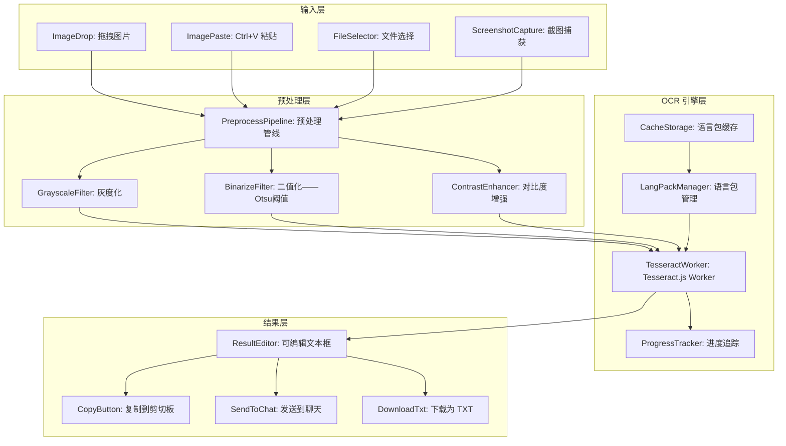

# YP-09-207: 文字提取OCR — Tesseract.js WASM 图片文字识别、拖拽粘贴图片、语言选择、复制/发送到聊天、基础图像预处理

> 需求编号：YP-09-207 · 优先级：P2 · 人天：0.2d · 状态：需求已编写
> 依赖：YP-09-206（图片裁剪工具——共享图片输入流程）

## 背景

### 问题陈述

用户浏览网页时经常遇到图片中的文字无法复制——截图中的报错信息、PDF 截图的表格数据、设计稿中的文案——这些文字以像素形式存在而非可选文本：

1. **截图文字无法复制**：报错弹窗、系统提示的截图——文字是图片的一部分——无法直接复制粘贴
2. **PDF/文档截图**：分享的 PDF 页面截图——文字需要手动打字转录——易出错
3. **设计稿文字提取**：UI 设计稿中的占位文案——开发和测试需要提取使用——没有现成的文字版本
4. **多语言图片**：英文/日文/韩文图片文字——需要选中正确语言才能准确识别
5. **图片质量影响识别**：低分辨率截图、模糊图片——直接 OCR 准确率低——需要预处理

**核心矛盾**：网页上的文字有两种形态——可选文本（可以直接复制）和图片文字（需要 OCR）。用户遇到大量图片文字场景（报错截图、PDF 截图、设计稿）——但浏览器扩展是处理这个问题的理想位置——可以在用户遇到图片文字时即时提取。

### 影响范围

| # | 影响 | 严重程度 | 典型场景 |
|---|------|----------|----------|
| 1 | 截图文字无法直接复制 | 高 | 报错日志截图→手动打字转录 |
| 2 | 图片中表格/数据需手动录入 | 高 | PDF 表格截图→逐格手动输入 |
| 3 | 多语言图片识别不准 | 中 | 英文截图用中文 OCR 引擎→乱码 |
| 4 | 低质量图片识别率低 | 中 | 低分辨率截图→识别结果无法使用 |

### 挑战

| 挑战 | 说明 |
|------|------|
| Tesseract WASM 体积 | tesseract.js 包含 WASM + 语言包——eng+chi_sim 合计约 30MB——需 CDN 懒加载 |
| 识别速度 | 首次加载 WASM 需 2-5 秒——大图识别需 5-15 秒——需要进度指示 |
| 准确率依赖预处理 | 原始截图可能模糊、倾斜、低对比度——需要预处理提升准确率 |
| 语言包管理 | 不同语言包按需下载——避免一次加载所有语言 |
| Service Worker 限制 | WASM 在 Service Worker 中可能不可用——识别必须在 content script 或 popup 中执行 |

---

## 一、现状分析

### 1.1 当前文字提取方式

```
现有文字提取手段:
├── 浏览器原生复制 (仅可选文本)
│   ├── 网页正文: Ctrl+C 直接复制 → 快速
│   ├── 图片中文字: ❌ 无法选中 → 无法复制
│   └── PDF 中文字: 取决于 PDF 渲染方式
├── 外部 OCR 工具
│   ├── 微信截图 OCR: 仅限微信内置——不支持浏览器扩展调用
│   ├── 在线 OCR (ocr.space等): 需上传图片——隐私风险——有次数限制
│   ├── 本地 OCR 软件 (ABBYY): 需安装——商业软件——用户不会为偶尔使用安装
│   └── Google Keep OCR: 需要先保存到 Keep——流程冗长
├── YiPet 已有能力
│   ├── YP-09-101 截图与标注工具: 区域截图获取图片数据
│   ├── YP-09-206 图片裁剪工具: 裁剪预处理
│   └── 聊天窗口: 图片粘贴/拖拽能力
│
缺失:
├── 浏览器端 OCR 引擎                       # ❌ 无
├── 拖拽/粘贴图片→OCR 流程                   # ❌ 无
├── 语言选择器 (中/英/日/韩/混合)             # ❌ 无
├── 图像预处理 (灰度/二值化/对比度)           # ❌ 无
├── 识别结果可编辑+复制                       # ❌ 无
├── 结果发送到聊天                            # ❌ 无
└── 识别进度指示                              # ❌ 无
```

### 1.2 OCR 工作流（现状 vs 目标）

```mermaid
graph TD
    subgraph Current["现状：外部工具 + 手动转录"]
        C1[用户看到图片中的文字] --> C2{文字可选中?}
        C2 -->|是| C3[Ctrl+C 复制]
        C2 -->|否| C4[截图保存图片]
        C4 --> C5[打开在线 OCR 工具——上传图片]
        C5 --> C6[等待云端识别——10-30 秒]
        C6 --> C7[复制识别结果——可能不准]
        C7 --> C8[手动修正错误]
        C8 --> C9[粘贴到目标位置]
    end

    subgraph Target["目标：YiPet 内置 OCR"]
        T1[用户在网页上看到图片文字] --> T2[截图/复制图片/拖拽图片到 YiPet]
        T2 --> T3[打开 OCR 工具]
        T3 --> T4[选择语言: 中文/英文/日文/混合]
        T4 --> T5{需要预处理?}
        T5 -->|是| T6[应用灰度/二值化/对比度增强]
        T5 -->|否| T7[点击"开始识别"]
        T6 --> T7
        T7 --> T8[显示进度——WASM 加载+Tesseract 识别]
        T8 --> T9[展示识别结果——可编辑文本框]
        T9 --> T10[复制结果 / 发送到聊天 / 下载为 TXT]
    end

    style Current fill:#f8d7da,stroke:#dc3545
    style Target fill:#d4edda,stroke:#28a745
```

### 1.3 根因矩阵

| 症状 | 根因 | 触发条件 | 频率 |
|------|------|----------|------|
| 截图文字无法直接复制 | 浏览器无法选中图片中的文字 | 遇到报错截图、提示图片 | 高 |
| 在线 OCR 工具隐私担忧 | 图片上传到第三方服务器 | 处理敏感信息（报错日志含IP等） | 中 |
| 多语言图片识别错误 | OCR 引擎使用错误语言包 | 非母语图片 | 中 |
| 低质量图片识别率低 | 无预处理能力——直接原始图 OCR | 截图分辨率低、模糊 | 中 |
| 手动转录耗时且易错 | 无 OCR 工具——只能手动打字 | 大量表格数据需提取 | 低 |

---

## 二、设计决策

### 决策 1：OCR 引擎选择 — Tesseract.js vs 云端 API vs WebLLM

| 选项 | 隐私 | 速度 | 准确率 | 离线能力 | 体积 |
|------|------|------|--------|---------|------|
| Tesseract.js WASM | 高（本地） | 中 (5-15s) | 中-高 | 是 | 大 (~30MB) |
| 云端 API (Google Vision/OCR.space) | 低（上传） | 高 (1-3s) | 高 | 否 | 小 |
| WebLLM + 多模态模型 | 高 | 低 (30-60s) | 中 | 是 | 极大 (~2GB) |

**选择：Tesseract.js WASM。** 本地 OCR 保护用户隐私——报错日志可能包含敏感信息（IP、路径、用户名）不应上传到第三方。准确率在预处理后可以满足大部分场景。CDN 懒加载解决体积问题——首次使用下载语言包（约 15MB eng+chi_sim）——后续使用从 CacheStorage 加载。

### 决策 2：语言包加载策略 — 全部预加载 vs 按需加载 vs 固定内置

| 选项 | 首次使用速度 | 体积 | 灵活性 |
|------|-----------|------|--------|
| 全部预加载（10+ 语言包） | 最慢 (>50MB) | 极大 | 高 |
| 按需加载（用户选择后下载） | 较快 | 按需 | 高 |
| 固定内置（仅 eng+chi_sim） | 最快 | 中 (~30MB) | 低 |

**选择：按需加载 + 内置 eng+chi_sim 缓存。** 首次使用时自动下载 eng 和 chi_sim 两个最常用语言包——缓存到 CacheStorage。其他语言（jpn/kor/fra 等）在用户选择后按需下载——下载后同样缓存。语言包 URL 指向 CDN——利用浏览器缓存机制。

### 决策 3：图像预处理策略 — 固定预处理 vs 用户可选 vs 自动检测

| 选项 | 操作复杂度 | 适用性 | 实现复杂度 |
|------|----------|--------|-----------|
| 固定预处理（灰度+二值化+对比度增强） | 低 | 中（适合文档——不适合照片） | 低 |
| 用户可选预处理（勾选启用选项） | 中 | 高 | 中 |
| 自动检测图片类型并应用预处理 | 高 | 最高 | 高 |

**选择：用户可选预处理。** 提供 3 个预处理开关——灰度化、二值化（阈值可调）、对比度增强。默认全部关闭——用户预览预处理效果后决定是否启用。0.2d 预算内不做自动检测。

### 决策 4：识别结果处理 — 仅展示 vs 可编辑 vs 结构化提取

| 选项 | 实用性 | 实现复杂度 |
|------|--------|-----------|
| 仅展示（只读文本框） | 低（OCR 总有错误需要手动修正） | 低 |
| 可编辑（用户可修正识别结果） | 高 | 中 |
| 结构化提取（自动识别表格/列表/段落） | 最高 | 高 |

**选择：可编辑展示。** Tesseract.js 的准确率在 85-95% 之间——总有需要手动修正的地方。可编辑文本框让用户在复制前修正明显错误。结构化提取（表格识别、段落分割）留待 YP-09-208 表格提取工具覆盖。

### 设计决策记录

| 决策 | 选项 A | 选项 B | 选项 C | 选项 D | 选择 | 理由 |
|------|--------|--------|--------|--------|------|------|
| OCR 引擎 | Tesseract.js | 云端 API | WebLLM | — | **Tesseract.js** | 隐私+离线 |
| 语言包 | 全部预加载 | 按需加载 | 固定内置 | — | **按需+内置缓存** | 体积/速度平衡 |
| 预处理 | 固定预处理 | 用户可选 | 自动检测 | — | **用户可选** | 灵活性 |
| 结果处理 | 仅展示 | 可编辑 | 结构化 | — | **可编辑展示** | 实用+低成本 |

---

## 三、目标架构

### 3.1 OCR 系统架构



### 3.2 OCR 识别流程

```mermaid
graph TD
    A[用户提供图片] --> B[加载到 Image 元素]
    B --> C{用户启用预处理?}
    C -->|灰度化| D1[Canvas: 提取灰度通道]
    C -->|二值化| D2[Canvas: 应用 Otsu 阈值]
    C -->|对比度| D3[Canvas: 对比度拉伸]
    C -->|无预处理| E[直接使用原始图片]
    D1 --> E
    D2 --> E
    D3 --> E
    E --> F[获取处理后图片的 ImageData]
    F --> G[初始化 Tesseract Worker]
    G --> H{语言包已缓存?}
    H -->|是| I[从 CacheStorage 加载]
    H -->|否| J[从 CDN 下载语言包]
    J --> K[缓存到 CacheStorage]
    I --> L[createWorker + loadLanguage]
    K --> L
    L --> M[worker.recognize(imageData)]
    M --> N[获取 text/confidence/words 信息]
    N --> O[展示可编辑结果——标注低置信度区域]
    O --> P[用户修正/复制/发送/下载]
```

### 3.3 性能指标

| 指标 | 目标值 | 说明 |
|------|--------|------|
| WASM Worker 初始化 | < 3s | 首次创建 Worker + 加载核心 WASM |
| 语言包加载 (eng) | < 2s | CDN 下载约 10MB——缓存后 < 100ms |
| 语言包加载 (chi_sim) | < 3s | CDN 下载约 15MB——缓存后 < 100ms |
| 小图识别 (800x600) | < 5s | eng 语言 |
| 大图识别 (1920x1080) | < 15s | chi_sim+eng 混合 |
| 预处理 (灰度+二值化) | < 50ms | Canvas 像素操作 |
| 结果展示 | < 20ms | 渲染文本编辑器 |

---

## 四、具体改动

### 4.1 类型定义

```typescript
// src/ocr/types.ts (新增)

export type OcrLanguage = 'eng' | 'chi_sim' | 'chi_tra' | 'jpn' | 'kor' | 'fra' | 'deu' | 'spa';

export interface LanguageOption {
  code: OcrLanguage;
  label: string;
  nativeName: string     // 本地化名称: English, 中文简体, 日本語
  size: string;          // 语言包大小: "10.2MB"
  priority: number;      // 排序优先级——常用语言靠前
}

export const SUPPORTED_LANGUAGES: LanguageOption[] = [
  { code: 'eng', label: '英文', nativeName: 'English', size: '10.2MB', priority: 1 },
  { code: 'chi_sim', label: '中文简体', nativeName: '中文简体', size: '15.4MB', priority: 2 },
  { code: 'chi_tra', label: '中文繁体', nativeName: '中文繁體', size: '15.8MB', priority: 3 },
  { code: 'jpn', label: '日文', nativeName: '日本語', size: '16.1MB', priority: 4 },
  { code: 'kor', label: '韩文', nativeName: '한국어', size: '11.3MB', priority: 5 },
  { code: 'fra', label: '法文', nativeName: 'Français', size: '8.2MB', priority: 6 },
  { code: 'deu', label: '德文', nativeName: 'Deutsch', size: '8.5MB', priority: 7 },
  { code: 'spa', label: '西班牙文', nativeName: 'Español', size: '7.8MB', priority: 8 },
];

export type PreprocessOption = 'none' | 'grayscale' | 'binarize' | 'contrast';

export interface OcrOptions {
  languages: OcrLanguage[];          // 可多选——混合语言识别
  preprocess: PreprocessOption[];
  binarizeThreshold?: number;       // 二值化阈值 0-255——默认 Otsu 自动
  contrastFactor?: number;          // 对比度因子 1.0-3.0
}

export interface OcrWord {
  text: string;
  bbox: { x0: number; y0: number; x1: number; y1: number };
  confidence: number;               // 0-100——置信度
}

export interface OcrResult {
  text: string;                     // 完整识别文本
  confidence: number;               // 整体置信度 0-100
  words: OcrWord[];                 // 逐词信息
  duration: number;                 // 识别耗时 ms
  languages: OcrLanguage[];         // 使用的语言
  preprocessApplied: PreprocessOption[]; // 应用的预处理
}

export interface OcrProgress {
  status: 'loading-wasm' | 'loading-language' | 'recognizing' | 'done' | 'error';
  progress: number;                 // 0-1 整体进度
  detail: string;                   // 进度详情文本
  workerId?: number;
}
```

### 4.2 核心 OCR 引擎

```typescript
// src/ocr/OcrEngine.ts (新增)

import { createWorker, Worker } from 'tesseract.js';

export class OcrEngine {
  private worker: Worker | null = null;
  private loadedLanguages: Set<OcrLanguage> = new Set();
  private onProgress: (p: OcrProgress) => void = () => {};

  /** 初始化 Worker——加载指定语言 */
  async initialize(
    languages: OcrLanguage[],
    onProgress: (p: OcrProgress) => void
  ): Promise<void> {
    this.onProgress = onProgress;

    this.onProgress({ status: 'loading-wasm', progress: 0, detail: '加载 Tesseract WASM...' });

    this.worker = await createWorker({
      logger: (m) => {
        if (m.status === 'recognizing text') {
          this.onProgress({
            status: 'recognizing',
            progress: m.progress,
            detail: `识别中... ${Math.round(m.progress * 100)}%`,
          });
        }
      },
    });

    for (const lang of languages) {
      if (!this.loadedLanguages.has(lang)) {
        this.onProgress({
          status: 'loading-language',
          progress: 0.5,
          detail: `加载语言包: ${lang}...`,
        });
        await this.worker.loadLanguage(lang);
        await this.worker.initialize(lang);
        this.loadedLanguages.add(lang);
      }
    }
  }

  /** 执行 OCR 识别 */
  async recognize(imageData: ImageData, options: OcrOptions): Promise<OcrResult> {
    if (!this.worker) throw new Error('Worker not initialized');

    // 设置识别参数
    await this.worker.setParameters({
      tessedit_ocr_engine_mode: 3,  // LSTM + Legacy
      tessedit_pageseg_mode: 3,     // 自动页面分割
    });

    const startTime = performance.now();

    const result = await this.worker.recognize(imageData);

    const duration = performance.now() - startTime;

    return {
      text: result.data.text,
      confidence: result.data.confidence,
      words: result.data.words.map(w => ({
        text: w.text,
        bbox: w.bbox,
        confidence: w.confidence,
      })),
      duration,
      languages: options.languages,
      preprocessApplied: options.preprocess,
    };
  }

  /** 终止 Worker */
  async terminate(): Promise<void> {
    if (this.worker) {
      await this.worker.terminate();
      this.worker = null;
    }
  }
}
```

### 4.3 图像预处理管线

```typescript
// src/ocr/PreprocessPipeline.ts (新增)

export class PreprocessPipeline {
  /** 应用预处理管线——返回处理后的 ImageData */
  static apply(
    source: ImageData,
    options: PreprocessOption[],
    binarizeThreshold?: number,
    contrastFactor: number = 2.0
  ): ImageData {
    const canvas = document.createElement('canvas');
    canvas.width = source.width;
    canvas.height = source.height;
    const ctx = canvas.getContext('2d')!;
    ctx.putImageData(source, 0, 0);

    for (const option of options) {
      const imageData = ctx.getImageData(0, 0, canvas.width, canvas.height);

      switch (option) {
        case 'grayscale':
          this.applyGrayscale(imageData);
          break;
        case 'binarize':
          this.applyBinarize(imageData, binarizeThreshold);
          break;
        case 'contrast':
          this.applyContrast(imageData, contrastFactor);
          break;
      }

      ctx.putImageData(imageData, 0, 0);
    }

    return ctx.getImageData(0, 0, canvas.width, canvas.height);
  }

  /** 灰度化——加权平均法 */
  private static applyGrayscale(data: ImageData): void {
    const pixels = data.data;
    for (let i = 0; i < pixels.length; i += 4) {
      const gray = 0.299 * pixels[i] + 0.587 * pixels[i + 1] + 0.114 * pixels[i + 2];
      pixels[i] = pixels[i + 1] = pixels[i + 2] = gray;
    }
  }

  /** 二值化——Otsu 自动阈值 或 手动阈值 */
  private static applyBinarize(data: ImageData, threshold?: number): void {
    const thresh = threshold ?? this.otsuThreshold(data);
    const pixels = data.data;
    for (let i = 0; i < pixels.length; i += 4) {
      const gray = 0.299 * pixels[i] + 0.587 * pixels[i + 1] + 0.114 * pixels[i + 2];
      const value = gray > thresh ? 255 : 0;
      pixels[i] = pixels[i + 1] = pixels[i + 2] = value;
    }
  }

  /** 对比度增强 */
  private static applyContrast(data: ImageData, factor: number): void {
    const pixels = data.data;
    for (let i = 0; i < pixels.length; i += 4) {
      pixels[i] = this.adjustContrast(pixels[i], factor);
      pixels[i + 1] = this.adjustContrast(pixels[i + 1], factor);
      pixels[i + 2] = this.adjustContrast(pixels[i + 2], factor);
    }
  }

  private static otsuThreshold(data: ImageData): number { /* Otsu 算法实现 */ }
  private static adjustContrast(value: number, factor: number): number { /* 对比度拉伸 */ }
}
```

### 4.4 文件变更清单

| 文件 | 操作 | 说明 |
|------|------|------|
| `src/ocr/types.ts` | 新增 | OCR 类型定义——语言、选项、结果 |
| `src/ocr/OcrEngine.ts` | 新增 | Tesseract.js Worker 封装 |
| `src/ocr/PreprocessPipeline.ts` | 新增 | 图像预处理管线 |
| `src/ocr/LangPackManager.ts` | 新增 | 语言包下载+缓存管理 |
| `src/components/OcrTool.vue` | 新增 | OCR 工具主面板 |
| `src/components/OcrImageDrop.vue` | 新增 | 图片拖拽/粘贴接收区 |
| `src/components/OcrResultEditor.vue` | 新增 | 识别结果可编辑展示 |
| `src/components/OcrPreprocessPanel.vue` | 新增 | 预处理选项面板 |
| `src/components/OcrLanguageSelector.vue` | 新增 | 语言选择器 |
| `src/composables/useOcr.ts` | 新增 | OCR 状态管理 composable |
| `src/popup/App.vue` | 修改 | 添加入口 |

---

## 五、实施步骤

| 步骤 | 操作 | 路径 | 验证 | 人天 |
|------|------|------|------|------|
| 1 | 类型定义 + 语言配置 | `types.ts` | 8 种语言枚举+元数据 | 0.01 |
| 2 | Tesseract Worker 封装 | `OcrEngine.ts` | 初始化→加载语言→识别→终止 | 0.04 |
| 3 | 图像预处理管线 | `PreprocessPipeline.ts` | 灰度+二值化+对比度 3 种预处理 | 0.03 |
| 4 | 语言包缓存管理 | `LangPackManager.ts` | CDN 下载+CacheStorage 缓存+版本管理 | 0.03 |
| 5 | 图片输入组件 | `OcrImageDrop.vue` | 拖拽/粘贴/文件选择 3 种输入 | 0.02 |
| 6 | 预处理选项面板 | `OcrPreprocessPanel.vue` | 3 种预处理开关+预览对比 | 0.02 |
| 7 | 结果编辑器 + 操作按钮 | `OcrResultEditor.vue` + `OcrTool.vue` | 可编辑+复制+发送到聊天+下载 | 0.03 |
| 8 | 语言选择器 | `OcrLanguageSelector.vue` | 多选语言+下载状态+语言包大小展示 | 0.02 |

**总人天：0.20d**

---

## 六、测试规格

### 场景 1：英文图片 OCR——无预处理

**GIVEN** 用户拖入一张英文截图（清晰的黑色文字，白色背景）
**WHEN** 语言选择 "英文"——不启用预处理——点击"开始识别"
**THEN** 显示 Tesseract WASM 加载进度
**AND** 加载完成后开始识别——显示识别进度百分比
**AND** 识别完成后展示完整的英文文本
**AND** 整体置信度 > 85%
**AND** 用户可编辑文本框中的内容

### 场景 2：中文图片 OCR——灰度+二值化预处理

**GIVEN** 用户粘贴一张中文文档截图（低对比度——灰色文字在米色背景上）
**WHEN** 语言选择 "中文简体"——启用灰度化+二值化预处理
**THEN** 预处理后图片显示黑白分明——文字清晰
**AND** 执行 OCR 识别
**AND** 识别结果置信度 > 80%——明显高于无预处理的结果
**AND** 中文文字正确提取

### 场景 3：混合语言 OCR

**GIVEN** 用户拖入一张中英文混合的界面截图
**WHEN** 语言选择 "英文" + "中文简体"——启动识别
**THEN** Worker 加载 eng + chi_sim 两个语言包
**AND** 识别结果中英文部分和中文部分均被正确识别
**AND** 英文单词和中文汉字在同一文本框中混合展示

### 场景 4：语言包按需下载与缓存

**GIVEN** 用户首次使用日文 OCR——尚未缓存日文语言包
**WHEN** 语言选择 "日文"——点击开始识别
**THEN** 显示 "下载语言包: 日文 (16.1MB)" 进度
**AND** 下载完成后自动缓存到 CacheStorage
**WHEN** 用户第二次使用日文 OCR
**THEN** 直接从缓存加载——无需网络请求——加载时间 < 100ms

### 场景 5：识别结果操作

**GIVEN** OCR 识别完成——结果包含少量错误（"Hell0" 应为 "Hello"）
**WHEN** 用户点击结果文本框——编辑修正错误
**AND** 点击 "复制到剪切板"
**THEN** 修正后的文本复制到剪切板
**WHEN** 点击 "发送到聊天"
**THEN** 文本出现在聊天输入框中
**WHEN** 点击 "下载为 TXT"
**THEN** 浏览器下载 `ocr_result_yyyyMMdd_HHmmss.txt`

### 场景 6：识别失败处理

**GIVEN** 用户拖入一张纯色背景无文字的图片
**WHEN** 执行 OCR 识别
**THEN** 识别结果显示空文本或极少量噪声字符
**AND** 置信度 < 10%
**AND** 展示提示 "未检测到可识别文字——请确认图片包含文字内容"
**AND** 无崩溃——Worker 正常终止

---

## 七、风险与缓解

| 风险 | 概率 | 影响 | 缓解措施 |
|------|------|------|----------|
| Tesseract WASM 加载超时 (>10s) | 中 | 高 | 设置 15s 超时——超时后提示"网络较慢——建议使用纯文本代替" |
| Worker 内存泄漏——多次识别后内存持续增长 | 中 | 中 | 每次识别后 terminate() Worker 并重新创建——避免长时间持有 Worker |
| 语言包 CDN 不可用 | 低 | 高 | 配置 2 个 CDN 备用域名——fallback 到 jsDelivr + unpkg |
| CacheStorage 配额超限 | 低 | 中 | 语言包缓存设置最大 5 个——超出时 LRU 淘汰 |
| 大图 (4K) 内存溢出 | 中 | 中 | 识别前自动将图片缩放至最大 2048px——Canvas 绘制时等比缩放 |
| Content Script 中 Worker 创建失败 | 低 | 中 | Content Script 中 CSP 可能阻止 WASM——提供 popup 模式备选 |

---

## 八、回滚策略

| 场景 | 回滚操作 | 影响 |
|------|------|------|
| Tesseract WASM 在所有浏览器崩溃 | 切换到云端 OCR API 作为 fallback | 隐私降低——有网络依赖 |
| Worker 创建持续失败 | 隐藏 OCR 入口——显示"OCR 功能暂不可用" | 功能完全不可用 |
| 语言包下载失败率高 | 预置内置精简英文语言包 (eng.traineddata 约 4MB 压缩版) | 仅支持英文——体积增加 |
| 性能问题 (识别>30s) | 强制限制图片最大尺寸为 1024px | 大图识别精度下降 |
| 完全移除 | 隐藏 OCR 入口——移除相关代码和依赖 | 功能不可用 |

---

## 九、设计决策记录

### D-01：为什么选择 Tesseract.js 而非 PaddleOCR.js 或其他 WASM OCR？

Tesseract.js 是最成熟的浏览器端 OCR 库——社区活跃——支持 100+ 语言——文档完善。PaddleOCR.js 准确率可能更高（尤其在中文场景）——但其 WASM 体积更大（50MB+）且文档较少——在 0.2d 预算内集成风险高。后续可以评估 PaddleOCR.js 作为增强选项。

### D-02：为什么预处理选项让用户手动选择而非自动应用？

自动判断图片质量（是否需要预处理）需要图像分析算法——超出了 0.2d 预算。手动开关让用户在实际场景中根据效果选择——简单可靠。用户通常知道自己截图的类型（文档 vs 照片）——可以快速判断是否需要预处理。

### D-03：为什么语言包缓存使用 CacheStorage 而非 IndexedDB？

CacheStorage 是浏览器为缓存 HTTP 响应设计的 API——天然支持 URL 键值存储、过期策略、配额管理。Tesseract.js 的语言包通过 HTTP 请求加载——CacheStorage 可以拦截并缓存这些请求——无需额外代码。IndexedDB 需要手动管理序列化/反序列化大文件。

### D-04：为什么识别后创建新 Worker 而非复用？

Tesseract.js 的 Worker 在多次识别后可能出现内存增长（WASM 内存碎片）——长时间持有的 Worker 可能导致 Tab 内存占用 > 200MB。每次识别创建新 Worker 并 terminate 旧 Worker——确保内存总是从干净状态开始——对于浏览器扩展至关重要（用户可能打开 OCR 工具但很少使用——长时间持有 Worker 浪费内存）。

---

## 十、可观测性

### 指标

| 指标 | 类型 | 说明 |
|------|------|------|
| `yipet.ocr.open_total` | Counter | OCR 工具打开次数 |
| `yipet.ocr.recognize_total` | Counter | 识别执行次数 |
| `yipet.ocr.recognize_duration` | Histogram | 识别耗时分布 |
| `yipet.ocr.language_used` | Counter (label: lang) | 各语言使用次数 |
| `yipet.ocr.preprocess_used` | Counter (label: type) | 各预处理使用次数 |
| `yipet.ocr.avg_confidence` | Gauge | 平均置信度 |
| `yipet.ocr.langpack_download_time` | Histogram | 语言包下载耗时 |
| `yipet.ocr.copy_total` | Counter | 复制结果次数 |
| `yipet.ocr.send_to_chat_total` | Counter | 发送到聊天次数 |

---

## 十一、代码审查检查清单

- [ ] OcrEngine: Worker 创建/terminate 配对——无泄漏
- [ ] OcrEngine: 识别超时设置——Promise.race 或 AbortController
- [ ] PreprocessPipeline: 像素操作使用 Uint8ClampedArray——无越界
- [ ] PreprocessPipeline: 大图预处理前检查 Canvas 尺寸——超过 4096px 自动缩放
- [ ] LangPackManager: CDN fallback 逻辑——主 CDN 失败时自动切换备用
- [ ] LangPackManager: CacheStorage 写入失败时不阻塞识别——直接从网络加载
- [ ] OcrImageDrop: 接收的图片自动转换为 ImageData——支持 File/Blob/URL
- [ ] OcrResultEditor: 低置信度文字 (<50%) 用红色背景标注
- [ ] OcrLanguageSelector: 语言包下载进行中禁用开始按钮
- [ ] useOcr: composable 卸载时确保 Worker terminate

---

## 回归问题预测

| # | 预测问题 | 原因 | 验证方法 |
|---|---------|------|---------|
| 1 | Tesseract 版本升级导致语言包格式不兼容 | traineddata 格式版本变化——tesseract 5.x 与 4.x 不兼容 | 在 package.json 中固定 tesseract.js 版本——升级时验证 |
| 2 | 中英文混合识别时——中文标点被识别为英文标点 | chi_sim 语言包的标点映射表与 eng 冲突 | 验证标点符号——必要时后处理替换中文标点 |
| 3 | CacheStorage 缓存的旧版本语言包与新版本 Worker 不兼容 | Worker 升级后需要新版本 traineddata——缓存中的旧版本导致识别失败 | 语言包 URL 包含版本号——版本变更时自动重新下载 |
| 4 | 二值化阈值在浅色文字深色背景上效果差 | Otsu 算法假设文字比背景深——暗色模式下相反 | 暗色模式图片预处理前自动反转颜色 |
| 5 | 识别结果中连续空格被合并 | Tesseract 默认压缩空白字符 | 设置 `preserve_interword_spaces=1` 参数 |
| 6 | 多次快速识别导致多个 Worker 并存 | 用户快速切换图片和语言——新 Worker 创建前旧 Worker 未 terminate | 单例模式——同一时间仅一个 Worker——新识别启动前终止旧 Worker |

---

## 性能分析

### 各阶段耗时

| 阶段 | 首次 (eng) | 首次 (chi_sim) | 缓存后 |
|------|----------|---------------|--------|
| Worker 初始化 + WASM 加载 | 2-3s | 2-3s | < 500ms |
| 语言包下载 | 1-3s (~10MB) | 2-4s (~15MB) | < 100ms |
| 小图识别 (800x600) | 2-3s | 3-5s | 2-3s |
| 中图识别 (1920x1080) | 5-8s | 8-12s | 5-8s |
| 预处理 (灰度+二值化) | < 30ms | < 30ms | < 30ms |
| **总计 (小图 eng 首次)** | **~6s** | — | **~3s** |
| **总计 (大图 chi_sim 首次)** | — | **~18s** | **~9s** |

### 内存占用

| 资源 | 内存 |
|------|------|
| Tesseract Worker (WASM) | ~80MB |
| eng 语言包 (加载到内存) | ~30MB |
| chi_sim 语言包 | ~45MB |
| 图片 ImageData (1920x1080) | ~8MB |
| Canvas + 预处理缓冲 | ~16MB |
| UI 组件 + 状态 | ~2MB |
| **总计 (中英文混合)** | **~180MB** |

### 代码体积

| 文件 | 大小 |
|------|------|
| types.ts | ~3KB |
| OcrEngine.ts | ~4KB |
| PreprocessPipeline.ts | ~4KB |
| LangPackManager.ts | ~3KB |
| Vue 组件 (5 个) | ~10KB |
| useOcr.ts | ~2KB |
| **总计** | **~26KB** |

### 外部依赖体积

| 依赖 | 大小 | 加载方式 |
|------|------|---------|
| tesseract.js (npm) | ~2KB (JS 壳) | import |
| tesseract.wasm.js | ~1.5MB | CDN 懒加载 |
| eng.traineddata | ~10.2MB | CDN 懒加载 |
| chi_sim.traineddata | ~15.4MB | CDN 懒加载 |