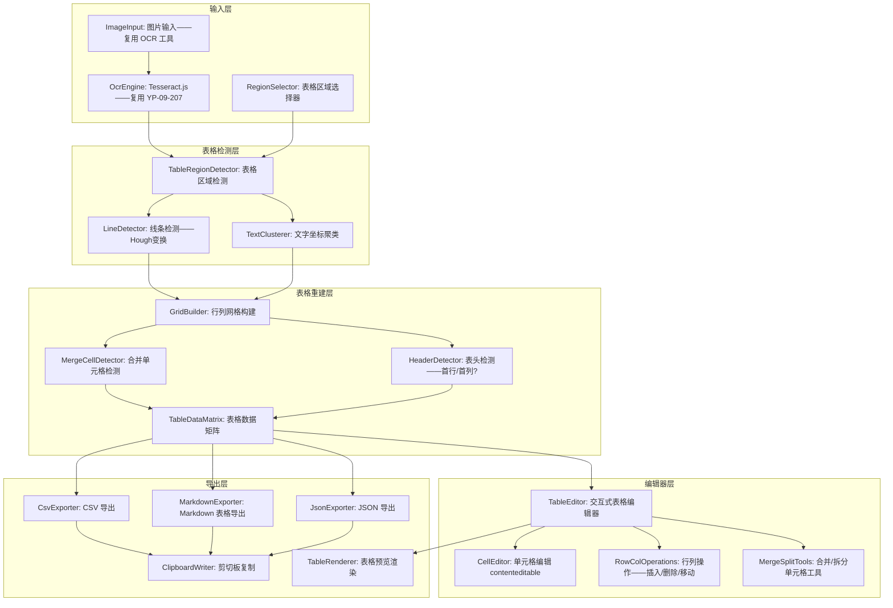

# YP-09-208: 表格提取工具 — 图片/截图表格识别、CSV/Markdown/JSON 导出、手动修正编辑器、复制表格数据

> 需求编号：YP-09-208 · 优先级：P2 · 人天：0.2d · 状态：需求已编写
> 依赖：YP-09-207（OCR 文字提取——共享 Tesseract.js 引擎和图片预处理管线）

## 背景

### 问题陈述

用户在浏览网页、查看 PDF 或分析数据报告时经常遇到表格以图片形式存在——无法直接复制数据：

1. **PDF 表格截图**：财务报告、研究数据以 PDF 形式分享——表格数据无法直接复制到 Excel
2. **网页截图表格**：部分网站用图片展示数据表——防止数据被爬取——用户需要手动录入
3. **会议截图**：视频会议中分享的数据表格——截图后需要转录
4. **仪表盘截图**：BI 工具截图——数据需要手动提取进行二次分析
5. **表格结构识别困难**：普通 OCR 将表格识别为连续文本——丢失行列结构——需要额外处理

**核心矛盾**：表格数据是结构化的（行 x 列）——在图片中以视觉形式存在。普通 OCR（YP-09-207）将其识别为线性文本——丢失行列对应关系。表格提取工具在 OCR 结果之上——通过线条检测和空间分析重建表格结构——让用户获得真正的结构化数据。

### 影响范围

| # | 影响 | 严重程度 | 典型场景 |
|---|------|----------|----------|
| 1 | 表格数据无法结构化提取 | 高 | PDF 表格→手动逐格录入 Excel |
| 2 | OCR 结果行列错乱 | 高 | 普通 OCR 将表格识别为连续文本 |
| 3 | 识别结果无法直接用于分析 | 高 | 不能导出 CSV——无法导入 Excel/数据库 |
| 4 | 合并单元格识别错误 | 中 | 表头合并单元格被识别为多个独立单元格 |

### 挑战

| 挑战 | 说明 |
|------|------|
| 表格线条检测 | 无边框表格（仅颜色/间距区分）难以检测行列边界 |
| 合并单元格 | 跨行/跨列表头在 OCR 结果中被拆分——需要重新合并 |
| 行列对齐 | OCR 返回的字词坐标为右上角——需要统计聚类确定行列边界 |
| 数据验证 | 提取后表格数据可能错位——需要可视化的手动修正 |
| 多格式导出 | CSV/Markdown/JSON 三种格式的序列化逻辑不同 |

---

## 一、现状分析

### 1.1 当前表格提取方式

```
现有表格数据处理方式:
├── 可选中文本表格（HTML 表格）
│   ├── 直接 Ctrl+C 复制单元格 → 粘贴到 Excel → 保留结构
│   └── 局限：仅限选中文本——图片表格不可用
├── 图片表格 → 手动转录
│   ├── 用户目视读取每个单元格值 → 手动输入到 Excel
│   ├── 10 行 x 5 列的表格——手动录入约 5-10 分钟
│   └── 易出错——尤其是数字数据
├── 在线工具
│   ├── Table2XL, Convertio 等: 上传图片→识别表格→下载 CSV
│   ├── 隐私风险——财务数据上传到第三方
│   └── 有次数/文件大小限制
├── 专业 OCR 软件 (ABBYY)
│   ├── 内置表格识别——准确率高
│   └── 商业软件——一千元以上——非所有用户都有
│
缺失:
├── 浏览器端表格检测和结构重建                 # ❌ 无
├── 行列边界识别算法                           # ❌ 无
├── 交互式表格修正编辑器                        # ❌ 无
├── CSV / Markdown / JSON 多格式导出            # ❌ 无
├── 合并单元格自动检测与处理                     # ❌ 无
└── 与 OCR 文字提取工具的数据共享                # ❌ 无
```

### 1.2 表格提取流程（现状 vs 目标）

```mermaid
graph TD
    subgraph Current["现状：手动转录——5-10分钟/表格"]
        C1[看到图片表格] --> C2[截图或保存图片]
        C2 --> C3{有 OCR 工具?}
        C3 -->|有| C4[运行 OCR——得到线性文本]
        C4 --> C5[目视识别行列关系——手动拆分到 Excel]
        C3 -->|无| C6[目视每个单元格——手动输入 Excel]
        C5 --> C7[检查数据——修正识别错误]
        C6 --> C7
        C7 --> C8[保存为 CSV/Excel]
    end

    subgraph Target["目标：YiPet 表格提取——30秒/表格"]
        T1[用户截图或粘贴表格图片] --> T2[OCR 识别文字+坐标]
        T2 --> T3[行列边界检测算法——聚类字词坐标]
        T3 --> T4[构建表格结构——行x列矩阵]
        T4 --> T5[在交互式编辑器中展示——用户可视修正]
        T5 --> T6{需要修正?}
        T6 -->|是| T7[合并/拆分单元格——编辑单元格值]
        T7 --> T5
        T6 -->|否| T8[选择导出格式: CSV/Markdown/JSON]
        T8 --> T9[下载 / 复制到剪切板 / 发送到聊天]
    end

    style Current fill:#f8d7da,stroke:#dc3545
    style Target fill:#d4edda,stroke:#28a745
```



### 1.3 根因矩阵

| 症状 | 根因 | 触发条件 | 频率 |
|------|------|----------|------|
| 表格数据无法结构提取 | 无表格结构重建算法 | 每次遇到图片表格 | 高 |
| OCR 结果行列错乱 | 未根据坐标聚类重建行列 | 使用普通 OCR 时 | 高 |
| 数据转录耗时 | 手动目视录入——无自动化 | 财务/数据报告截图 | 中 |
| 合并单元格数据错位 | 未处理跨行跨列的合并逻辑 | 复杂表头表格 | 中 |
| 导出格式不匹配需求 | 仅支持单一格式导出 | 不同下游工具（Excel/数据库/Markdown文档） | 低 |

---

## 二、设计决策

### 决策 1：表格识别方案 — 线条检测 vs OCR坐标聚类 vs 深度学习

| 选项 | 准确率（有线表格） | 准确率（无线表格） | 实现复杂度 |
|------|----------------|----------------|----------|
| 线条检测（Hough 变换检测横/竖线） | 高 | 低（无线条无法检测） | 中 |
| OCR 坐标聚类（根据文字坐标聚合行列） | 中-高 | 高 | 中 |
| 深度学习（表格检测模型） | 高 | 高 | 极高（需模型+推理） |

**选择：线条检测 + OCR坐标聚类——双策略。** 优先使用线条检测（适用于 80% 的有线表格——即传统数据表格）。线条检测失败（无线表格或无清晰线条）时降级为 OCR 坐标聚类——根据文字水平/垂直对齐关系推断行列。0.2d 预算内不做深度学习模型集成。

### 决策 2：表格修正编辑器形式 — 文本区域 vs 类Excel网格 vs 可编辑HTML表格

| 选项 | 直观性 | 编辑灵活性 | 实现复杂度 |
|------|--------|----------|-----------|
| 文本区域（CSV格式显示——手动编辑） | 低（文本格式不直观） | 高 | 低 |
| 类Excel网格（单元格独立编辑） | 高 | 高 | 高 |
| 可编辑HTML表格（contenteditable） | 中-高 | 中 | 中 |

**选择：可编辑HTML表格——contenteditable。** 每个 `<td>` 设置 `contenteditable="true"`——用户点击单元格直接编辑值。表格结构操作（插入/删除行列、合并拆分）通过右键菜单实现。实现复杂度合理——复用浏览器原生表格编辑能力。Excel 级别的网格编辑在 0.2d 预算内不可行。

### 决策 3：导出格式优先级 — 仅CSV vs CSV+JSON vs CSV+Markdown+JSON

| 选项 | 实用性 | 实现复杂度 |
|------|--------|-----------|
| 仅 CSV | 中（仅适合 Excel/数据库导入） | 低 |
| CSV + JSON | 中-高（JSON 适合程序化处理） | 中 |
| CSV + Markdown + JSON | 高（Markdown 适合文档/聊天） | 中 |

**选择：CSV + Markdown + JSON。** CSV 用于 Excel/Google Sheets 导入。Markdown 表格用于粘贴到聊天窗口（企业微信/Slack 渲染表格）、文档编辑（Typora/Notion）。JSON 用于程序化处理（导入数据库、API 调用）。三种格式覆盖 95% 使用场景——序列化逻辑互不冲突。

### 决策 4：表格检测触发方式 — 自动检测 vs 用户标记区域 vs 手动指定

| 选项 | 便捷性 | 准确性 | 实现复杂度 |
|------|--------|--------|-----------|
| 自动检测（全图分析表格区域） | 高 | 中（可能错误检测） | 中 |
| 用户标记区域（拖拽框选表格区域） | 中 | 高 | 中 |
| 手动指定（宽度+高度+起始点） | 低 | 最高 | 低 |

**选择：自动检测 + 用户区域标记备选。** 默认全图自动检测表格——检测到多个表格时展示缩略图供用户选择。用户也可以通过拖拽框选指定表格区域——跳过自动检测。两种方式互补——自动检测用于简单场景——手动区域用于复杂多表格场景。

### 设计决策记录

| 决策 | 选项 A | 选项 B | 选项 C | 选择 | 理由 |
|------|--------|--------|--------|------|------|
| 表格识别 | 线条检测 | 坐标聚类 | 深度学习 | **线条+坐标双策略** | 覆盖有线/无线表格 |
| 修正编辑器 | 文本区域 | Excel网格 | HTML表格 | **contenteditable HTML** | 直观+低成本 |
| 导出格式 | 仅CSV | CSV+JSON | CSV+MD+JSON | **CSV+Markdown+JSON** | 全场景覆盖 |
| 检测触发 | 自动检测 | 区域标记 | 手动指定 | **自动+区域备选** | 便捷+准确 |

---

## 三、目标架构

### 3.1 表格提取系统架构



### 3.2 表格结构重建流程

```mermaid
graph TD
    A[OCR 结果——每个字词含 bbox 坐标] --> B[收集所有字词的 y0 坐标]
    B --> C[聚类 y0 坐标——确定行边界]

    A --> D[收集所有字词的 x0 坐标]
    D --> E[聚类 x0 坐标——确定列边界]

    C --> F{线条检测可用?}
    E --> F
    F -->|是| G[检测到的横线 y 坐标与聚类 y 对比——取更精确的]
    F -->|是| H[检测到的竖线 x 坐标与聚类 x 对比——取更精确的]
    F -->|否| I[直接使用聚类结果作为行列边界]

    G --> J[构建 Grid: Row[0..N] x Col[0..M]]
    H --> J
    I --> J

    J --> K[将每个 OCR 字词分配到对应的 Grid 单元格中]

    K --> L{检测合并单元格}
    L -->|同一单元格跨多列| M[水平合并——连续空列→同一单元格]
    L -->|同一单元格跨多行| N[垂直合并——连续空行→同一单元格]

    M --> O[最终 TableDataMatrix: 去空格/合并后的二维数组]
    N --> O

    O --> P[可选: 首行标记为表头 header]
    O --> Q[可选: 首列标记为行标题]
```

### 3.3 性能指标

| 指标 | 目标值 | 说明 |
|------|--------|------|
| OCR 文字识别 | 与 YP-09-207 相同 | 复用 OCR 引擎 |
| 行列聚类分析 | < 100ms | 最多 500 个字词坐标 |
| 线条检测 | < 50ms | Canvas 图像分析 |
| 表格结构重建 | < 50ms | Grid 构建+合并检测 |
| 编辑器渲染 | < 100ms | HTML 表格生成 |
| CSV/JSON 导出 | < 20ms | 字符串拼接 |
| **总计 (不含 OCR)** | **< 300ms** | 后处理阶段 |

---

## 四、具体改动

### 4.1 类型定义

```typescript
// src/table-extract/types.ts (新增)

/** OCR 字词——含坐标——来自 Tesseract.js */
export interface OcrWord {
  text: string;
  bbox: { x0: number; y0: number; x1: number; y1: number };
  confidence: number;
}

/** 表格单元格 */
export interface TableCell {
  text: string;               // 单元格文本
  col: number;                // 列索引 (0-based)
  row: number;                // 行索引 (0-based)
  colSpan: number;            // 跨列数——默认 1
  rowSpan: number;            // 跨行数——默认 1
  confidence: number;         // 该单元格 OCR 置信度
  isHeader: boolean;          // 是否为表头单元格
}

/** 检测到的表格区域 */
export interface TableRegion {
  x: number;
  y: number;
  width: number;
  height: number;
}

/** 表格结构 = 二维单元格数组 */
export type TableStructure = TableCell[][];

/** 导出选项 */
export type ExportFormat = 'csv' | 'markdown' | 'json';

export interface ExportOptions {
  format: ExportFormat;
  includeHeaders: boolean;
  csvDelimiter: ',' | ';' | '\t';
  csvEncoding: 'utf-8' | 'utf-8-bom';  // BOM 用于 Excel 打开中文 CSV
}

/** 表格提取结果 */
export interface TableExtractResult {
  structure: TableStructure;
  rows: number;
  cols: number;
  sourceRegion: TableRegion;
  allConfidence: number;         // 平均置信度
  ocrDuration: number;           // OCR 耗时
  buildDuration: number;         // 结构重建耗时
}
```

### 4.2 表格结构重建器

```typescript
// src/table-extract/TableBuilder.ts (新增)

export class TableBuilder {
  /** 根据 OCR 字词坐标构建表格结构 */
  static build(ocrWords: OcrWord[], lineData?: LineDetectionResult): TableStructure {
    // 1. 通过 y 坐标聚类确定行
    const rowBounds = this.findRowBounds(ocrWords);

    // 2. 通过 x 坐标聚类确定列
    const colBounds = this.findColBounds(ocrWords);

    // 3. 如果提供了线条数据——与聚类结果合并——取更精确的
    if (lineData) {
      this.refineWithLines(rowBounds, colBounds, lineData);
    }

    // 4. 将 OCR 字词分配到对应的 (row, col)
    const grid = this.assignToGrid(ocrWords, rowBounds, colBounds);

    // 5. 合并同一单元格中的多个字词
    const merged = this.mergeWordsInCells(grid);

    // 6. 检测合并单元格（同一 cell 文本为空但跨行列）
    const withMerge = this.detectMergedCells(merged);

    // 7. 检测表头（首行文本加粗/居中/背景色 vs 普通行）
    const withHeaders = this.detectHeaders(withMerge);

    return withHeaders;
  }

  /** Y 坐标聚类——使用直方图+峰值检测确定行边界 */
  private static findRowBounds(words: OcrWord[]): number[] {
    // 对 y0 坐标聚类——容忍度 = 平均字高的 0.5
    // 返回排序后的行边界 y 坐标数组 [y0, y1, y2, ...]
  }

  /** X 坐标聚类——确定列边界 */
  private static findColBounds(words: OcrWord[]): number[] {
    // 对 x0 坐标聚类——容忍度 = 平均字宽的 0.3
    // 返回排序后的列边界 x 坐标数组 [x0, x1, x2, ...]
  }

  /** 线条信息精炼行列边界 */
  private static refineWithLines(
    rows: number[], cols: number[],
    lines: LineDetectionResult
  ): void { /* ... */ }

  /** 将字词分配到 Grid 单元格 */
  private static assignToGrid(
    words: OcrWord[],
    rowBounds: number[],
    colBounds: number[]
  ): Map<string, OcrWord[]> { /* ... */ }

  /** 合并同一单元格中的多个字词——拼接文本 */
  private static mergeWordsInCells(
    grid: Map<string, OcrWord[]>
  ): TableStructure { /* ... */ }

  /** 检测合并单元格——同一文本跨越多列/多行 */
  private static detectMergedCells(table: TableStructure): TableStructure { /* ... */ }

  /** 检测表头——首行满足表头特征则标记 */
  private static detectHeaders(table: TableStructure): TableStructure { /* ... */ }
}
```

### 4.3 编辑器组件

```typescript
// src/components/TableEditor.vue (新增)

// 核心逻辑:
// 1. 将 TableStructure 渲染为 HTML <table>
// 2. 每个 <td> 设置 contenteditable="true"
// 3. 用户编辑后——同步回 TableStructure
// 4. 右键菜单: 在上方/下方插入行、在左侧/右侧插入列、删除行列、合并/拆分
// 5. 表头单元格自动加粗+背景色
// 6. 编辑状态显示: 原始值 vs 当前值（修改后高亮）
```

### 4.4 文件变更清单

| 文件 | 操作 | 说明 |
|------|------|------|
| `src/table-extract/types.ts` | 新增 | 表格提取类型定义 |
| `src/table-extract/TableBuilder.ts` | 新增 | 表格结构重建核心算法 |
| `src/table-extract/LineDetector.ts` | 新增 | 线条检测——Hough变换 |
| `src/table-extract/CsvExporter.ts` | 新增 | CSV 导出——含 BOM 选项 |
| `src/table-extract/MarkdownExporter.ts` | 新增 | Markdown 表格导出 |
| `src/table-extract/JsonExporter.ts` | 新增 | JSON 导出 |
| `src/components/TableExtractTool.vue` | 新增 | 表格提取主面板 |
| `src/components/TableRegionSelector.vue` | 新增 | 表格区域选择器 |
| `src/components/TableEditor.vue` | 新增 | 交互式表格编辑器 |
| `src/components/TableExportPanel.vue` | 新增 | 导出选项面板 |
| `src/composables/useTableExtract.ts` | 新增 | 表格提取状态管理 |
| `src/popup/App.vue` | 修改 | 添加入口 |

---

## 五、实施步骤

| 步骤 | 操作 | 路径 | 验证 | 人天 |
|------|------|------|------|------|
| 1 | 类型定义 | `types.ts` | TableCell/TableStructure/ExportOptions | 0.01 |
| 2 | 坐标聚类算法 | `TableBuilder.ts` (行列边界) | 10x5 表格聚类正确 | 0.04 |
| 3 | 线条检测 | `LineDetector.ts` | 横线/竖线检测+坐标提取 | 0.03 |
| 4 | Grid 构建+合并检测 | `TableBuilder.ts` (其余) | 合并单元格识别正确 | 0.03 |
| 5 | 导出器 (CSV/MD/JSON) | `*Exporter.ts` x3 | 三种格式序列化正确 | 0.02 |
| 6 | 表格编辑器 UI | `TableEditor.vue` | contenteditable+行列操作+右键菜单 | 0.04 |
| 7 | 主面板+区域选择+导出面板 | `TableExtractTool.vue` 等 | 完整用户流程 | 0.03 |

**总人天：0.20d**

---

## 六、测试规格

### 场景 1：标准有线表格提取

**GIVEN** 用户上传一张 5 行 x 4 列的有线表格截图（清晰表格线、标准字体）
**WHEN** 点击"提取表格"
**THEN** 系统识别出 5 行 x 4 列的表格结构
**AND** 自动检测到表格线——使用线条检测模式
**AND** 编辑器中展示 5x4 网格——每个单元格填充对应文字
**AND** 置信度标签显示 "高：92%"

### 场景 2：无线表格提取（仅间距分隔）

**GIVEN** 用户上传一张 3 行 x 3 列的无线表格（仅通过间距和颜色区分列）
**WHEN** 线条检测找不到足够线条——自动降级为坐标聚类模式
**THEN** 系统通过字词间距聚类识别出 3 行 x 3 列结构
**AND** 提示用户 "未检测到表格线——使用文字位置聚类（可能不准确——请检查结果）"

### 场景 3：合并单元格处理

**GIVEN** 用户上传表格——表头第一行有一个跨 2 列的合并单元格 "2024年销售数据"
**WHEN** 提取表格
**THEN** 该合并单元格被识别为一个单元格——colSpan=2
**AND** 该行只有 3 个单元格（而非 4 个）——第二列位置为空
**WHEN** 导出为 Markdown 表格
**THEN** 使用 Markdown 的 colspan 语法（或拆分为两个相同内容的单元格）

### 场景 4：手动修正编辑器

**GIVEN** 表格提取完成后——第 2 行第 3 列的文本识别为 "1,234.5b"（应为 "1,234.56"）
**WHEN** 用户点击该单元格——直接编辑值为 "1,234.56"
**THEN** 单元格高亮标记为"已修改"（黄色背景）
**WHEN** 用户在第三行右键——选择 "在下方插入行"
**THEN** 第四行插入空白行——原第四行及以下下移
**WHEN** 用户导出
**THEN** 导出的数据包含手动修正的内容

### 场景 5：CSV 导出——Excel 兼容

**GIVEN** 表格包含中文字符——提取结果正确
**WHEN** 选择导出格式为 CSV——分隔符为逗号——编码选择 UTF-8 BOM
**THEN** 下载 `table_yyyyMMdd_HHmmss.csv` 文件
**WHEN** 用 Excel 打开 CSV 文件
**THEN** 中文字符正确显示（BOM 头确保 Excel 以 UTF-8 编码打开）
**AND** 单元格正确分列——每列数据在独立列中

### 场景 6：多表格图片处理

**GIVEN** 用户上传一张包含 2 个独立表格的截图
**WHEN** 自动检测发现 2 个表格区域
**THEN** 展示缩略图列表——"检测到 2 个表格区域"
**AND** 用户点击选择第一个表格——提取该表格
**WHEN** 用户切换到第二个表格
**THEN** 提取第二个表格——第一个表格的编辑状态保留（如果是修改后的）

---

## 七、风险与缓解

| 风险 | 概率 | 影响 | 缓解措施 |
|------|------|------|----------|
| 无线表格行列聚类错误 | 中 | 中 | 聚类容差可调——用户可以通过手动区域精确指定表格边界 |
| 合并单元格识别失败 | 中 | 中 | 表格编辑器中提供手动合并/拆分按钮——用户拖动选择多个单元格后合并 |
| 倾斜/旋转表格识别失败 | 低 | 中 | 检测前提示用户"表格应水平对齐"——或提供旋转预处理（复用 YP-09-206 旋转能力） |
| 复杂表头（多层表头）识别错误 | 中 | 中 | 仅支持单层表头自动识别——多层表头提示用户手动调整 |
| CSV 逗号/引号转义问题 | 低 | 中 | 单元格内逗号用双引号包裹——双引号用两个双引号转义——符合 RFC 4180 |
| 大表格 (50x50) 编辑器渲染卡顿 | 低 | 中 | 超过 30x30 的表格使用虚拟化渲染——仅可视区域渲染 |

---

## 八、回滚策略

| 场景 | 回滚操作 | 影响 |
|------|------|------|
| 表格检测算法误检率高 | 关闭自动检测——仅使用手动区域标记模式 | 便捷性降低 |
| 编辑器性能问题 | 限制最大表格尺寸为 20x20——超过时仅展示预览不编辑 | 大表格不能编辑 |
| contenteditable 兼容性问题 | 降级为文本区域编辑——每行一个文本框 | 编辑体验下降 |
| 导出格式问题 (CSV 乱码) | CSV 默认使用 UTF-8 BOM——提供编码选项 | 仅编码差异 |
| 完全移除 | 隐藏表格提取入口——移除相关代码 | 功能不可用 |

---

## 九、设计决策记录

### D-01：为什么表格识别的核心算法是坐标聚类而非深度学习？

深度学习表格检测模型（如 TableNet、CascadeTabNet）需要模型文件（50-200MB）和推理运行时（ONNX.js 或 TensorFlow.js）——在浏览器扩展中集成这些依赖会显著增加体积和复杂度。坐标聚类算法（纯 JavaScript < 100 行）在大多数场景下效果良好——有线表格用线条检测——无线表格用字词间距推断。如果未来准确率需求提高——可以将 TableNet 作为可选增强模块。

### D-02：为什么 CSV 导出提供 UTF-8 BOM 选项？

Excel 在打开 UTF-8 编码的 CSV 文件时——默认以 ANSI 编码打开——中文会显示为乱码。UTF-8 BOM（Byte Order Mark——文件头的 `\uFEFF`）触发 Excel 以 UTF-8 编码打开——正确显示中文。这是 Excel 用户最常遇到的 CSV 坑点——默认开启。

### D-03：为什么使用 contenteditable 的 HTML 表格而非 Canvas 或自绘 Grid？

contenteditable 是浏览器原生能力——免费获得文本选择、复制粘贴、键盘导航等功能——无需从零实现。HTML `<table>` 的渲染性能远优于 Canvas 自绘网格——尤其在大表格场景中。限制是合并单元格操作较复杂——但通过 DOM 操作（rowSpan/colSpan 属性）可以实现。

### D-04：为什么 Markdown 导出是默认选项之一——优先级高于 JSON？

用户最常表的场景是将表格数据粘贴到聊天窗口（企业微信/Slack/Discord）或 Markdown 文档（Typora/Notion/Obsidian）中。这些平台都支持 Markdown 表格渲染——粘贴后即时展示为富文本表格。CSV 粘贴显示为纯文本逗号分隔——可读性差。JSON 适合程序化处理——但多数用户需要的是"看的表格"而非"机器读的数据"。

---

## 十、可观测性

### 指标

| 指标 | 类型 | 说明 |
|------|------|------|
| `yipet.table.open_total` | Counter | 表格提取工具打开次数 |
| `yipet.table.extract_total` | Counter | 表格提取执行次数 |
| `yipet.table.detection_mode` | Counter (label: lines/cluster) | 使用线条检测 vs 坐标聚类 |
| `yipet.table.grid_size` | Histogram (label: rows, cols) | 提取的表格尺寸分布 |
| `yipet.table.confidence_avg` | Gauge | 平均识别置信度 |
| `yipet.table.export_format` | Counter (label: csv/md/json) | 导出格式分布 |
| `yipet.table.manual_edit_total` | Counter | 用户手动编辑次数 |
| `yipet.table.build_duration` | Histogram | 表格结构重建耗时 |

---

## 十一、代码审查检查清单

- [ ] TableBuilder: 坐标聚类容差参数可配置——默认值基于标准字号 (~14px)
- [ ] TableBuilder: 空行/空列自动跳过——不创建无内容的行列
- [ ] LineDetector: Hough 变换阈值可配置——噪声图片可能误检线条
- [ ] CsvExporter: 单元格含逗号/换行/双引号时正确转义（RFC 4180）
- [ ] CsvExporter: UTF-8 BOM 作为选项——默认开启
- [ ] MarkdownExporter: 对齐符号 `:---` vs `---` 根据表头对齐方式
- [ ] TableEditor: contenteditable 单元格输入事件绑定——实时同步回 store
- [ ] TableEditor: 插入行列时——后续行列的索引重新计算
- [ ] TableEditor: 合并单元格视觉反馈——rowSpan/colSpan > 1 的单元格高亮边框
- [ ] useTableExtract: 表格提取与 OCR 引擎生命周期解耦——OCR 完成后即可释放 Worker

---

## 回归问题预测

| # | 预测问题 | 原因 | 验证方法 |
|---|---------|------|---------|
| 1 | 表格线不连续导致同一行被识别为两行 | 截图压缩导致某些位置的表格线像素断裂——线条检测认为这是行边界 | 线条检测容差——间距 < 5px 的横线合并为一条 |
| 2 | 单元格内多行文本被分割为多行 | OCR 字词坐标的 y0 差异较大——聚类算法误判为不同行 | 检查同一单元格内的文本——垂直间距 < 半行高时合并 |
| 3 | CSV 导出时数字前导零丢失 | Excel 打开 CSV 时 `00123` 显示为 `123` | CSV 中数字单元格前加制表符 `\t` 或单引号强制文本格式 |
| 4 | Markdown 表格宽度超出聊天窗口显示范围 | 列数过多——Markdown 表格宽度 > 聊天窗口宽度 | 超过 6 列的表格在导出时提示 "建议使用 CSV 格式——Markdown 表格可能过宽" |
| 5 | 表格中图片/图标被 OCR 识别为乱码字符 | Tesseract 将表格中的图标/logo 区域的噪点识别为字符 | 后处理过滤置信度 < 30% 的字词——标记为 "?" |
| 6 | contenteditable 粘贴操作引入 HTML 格式污染 | 用户从网页粘贴内容到单元格——携带 HTML 标签 | 监听 paste 事件——`e.clipboardData.getData('text/plain')` 仅取纯文本 |

---

## 性能分析

### 各阶段耗时

| 阶段 | 小表格 (5x4) | 中等表格 (15x8) | 大表格 (30x20) |
|------|-----------|--------------|--------------|
| OCR 识别 (复用 YP-09-207) | 3-5s | 5-10s | 10-20s |
| 线条检测 | < 20ms | < 50ms | < 100ms |
| 坐标聚类 | < 30ms | < 80ms | < 200ms |
| Grid 构建+合并检测 | < 10ms | < 30ms | < 80ms |
| 编辑器渲染 | < 30ms | < 100ms | < 300ms |
| CSV/JSON 导出 | < 5ms | < 10ms | < 30ms |
| Markdown 导出 | < 5ms | < 10ms | < 30ms |

### 代码体积

| 文件 | 大小 |
|------|------|
| types.ts | ~3KB |
| TableBuilder.ts | ~5KB |
| LineDetector.ts | ~3KB |
| CsvExporter.ts | ~2KB |
| MarkdownExporter.ts | ~2KB |
| JsonExporter.ts | ~1KB |
| Vue 组件 (4 个) | ~10KB |
| useTableExtract.ts | ~2KB |
| **总计** | **~28KB** |