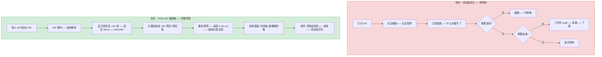
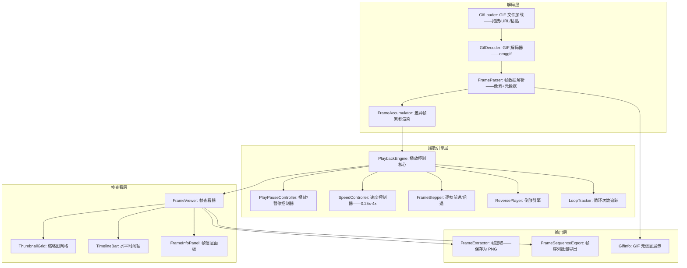
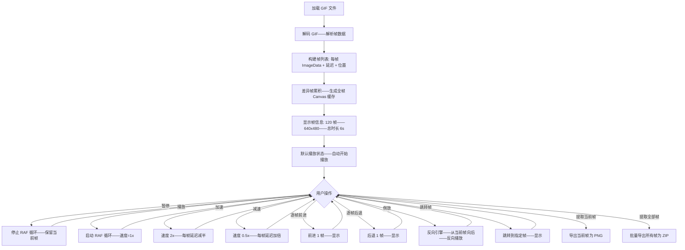

# YP-09-212: GIF播放器 — 播放/暂停/逐帧控制、速度控制(0.25x-4x)、帧查看器、帧提取、倒放、循环次数显示

> 需求编号：YP-09-212 · 优先级：P2 · 人天：0.2d · 状态：需求已编写
> 依赖：无

## 背景

### 问题陈述

GIF 是互联网上最广泛使用的动态图片格式——但浏览器对 GIF 的控制极其有限——用户只有"看"的权利——没有"控制"的能力：

1. **无法控制播放**：浏览器原生 GIF 自动播放——无法暂停、无法逐帧查看、无法调整速度——用户只能被动观看
2. **调试 GIF 动画**：设计师和开发者需要逐帧检查动画——查看每一帧的内容和时间——浏览器无此能力
3. **提取特定帧**：用户可能只需要 GIF 中的某一帧——如表情包的最后一帧——需要截图工具手动截取——精度差
4. **速度调节**：某些 GIF 太快或太慢——用户希望加速观看（如教程 GIF）或减速（如细节展示 GIF）
5. **倒放和循环分析**：倒放 GIF 是一种有趣的玩法——循环次数分析帮助理解 GIF 的结束行为

**核心矛盾**：GIF 作为一种丰富的媒体格式——在浏览器中被降级为"自动播放的动图"——用户失去了对帧、速度、方向的控制。GIF 播放器将这些控制权交还给用户——提供完整的播放控制、帧管理、速度调节和帧提取功能。

### 影响范围

| # | 影响 | 严重程度 | 典型场景 |
|---|------|----------|----------|
| 1 | 无法逐帧查看 GIF——调试动画困难 | 高 | 设计师查看 UI 动画——需要逐帧检查过渡效果 |
| 2 | GIF 播放速度不可调 | 中 | 教程 GIF 太快——需要减速观看每一步 |
| 3 | 提取 GIF 帧需要外部工具 | 中 | 需要表情包某一帧——用截图工具手动截取 |
| 4 | 无法倒放 GIF | 低 | 想看"倒放版"搞笑 GIF |

### 挑战

| 挑战 | 说明 |
|------|------|
| GIF 解码 | GIF 使用 LZW 压缩——需要完整解码器——浏览器原生不支持逐帧 API |
| 帧间优化 | GIF 帧之间可能有差异帧（只存储变化区域）——需要累积渲染 |
| 大 GIF 内存 | 长 GIF（如 500 帧）所有帧解码后内存占用大 |
| 帧时序精度 | GIF 帧延迟单位是 1/100 秒——在浏览器中精确调度需要 attention |
| 透明度处理 | GIF 帧可能有透明区域——前一帧内容透过透明区域可见 |

---

## 一、现状分析

### 1.1 当前 GIF 控制方式

```
现有 GIF 控制手段:
├── 浏览器原生
│   ├──  标签: 自动播放——无控制——循环取决于 GIF 元数据
│   ├── 右键菜单: 无 GIF 相关选项
│   └── 限制: 零控制能力
├── 在线 GIF 工具
│   ├── ezgif.com: 逐帧查看——速度调节——帧提取——需要上传
│   ├── giphy: 仅播放/暂停——无逐帧
│   └── 限制: 需要上传 GIF——隐私问题——部分工具有文件大小限制
├── 桌面软件
│   ├── Photoshop: 时间轴面板——逐帧编辑——强大但启动慢
│   ├── ScreenToGif: 免费 GIF 编辑器——逐帧+速度+倒放
│   └── 限制: 需要安装——非浏览器内操作
│
缺失:
├── 浏览器内 GIF 播放器——播放/暂停/逐帧控制          # ❌ 无
├── 速度滑块——0.25x 到 4x 无级调速                    # ❌ 无
├── 帧查看器——横向时间轴+缩略图网格                    # ❌ 无
├── 帧提取——保存任意帧为 PNG                           # ❌ 无
├── 倒放播放——帧序列反转                               # ❌ 无
├── 循环次数显示+已播放循环计数                          # ❌ 无
└── 帧信息面板——尺寸/延迟时间/透明/调色板               # ❌ 无
```

### 1.2 GIF 播放流程（现状 vs 目标）



### 1.3 根因矩阵

| 症状 | 根因 | 触发条件 | 频率 |
|------|------|----------|------|
| GIF 无法暂停 | 浏览器无 GIF 播放控制 API | 每次看 GIF 时 | 高 |
| 需要逐帧查看时缺乏工具 | 无内置 GIF 帧解析器 | 调试动画/设计审查时 | 中 |
| 提取 GIF 帧不精确 | 截图方式受播放时机影响 | 需要 GIF 中的特定帧 | 中 |
| 速度不可调 | img 标签无播放速率属性 | 教程/演示 GIF 太快或太慢 | 中 |
| 不清楚 GIF 循环行为 | 无循环次数显示 | 分析 GIF 何时停止时 | 低 |

---

## 二、设计决策

### 决策 1：GIF 解码方式 — 浏览器原生解码 vs gif.js/omggif 库 vs WASM 解码器

| 选项 | 解码性能 | 包体积 | 帧访问能力 |
|------|---------|--------|----------|
| 浏览器原生 (createImageBitmap) | 最快——GPU加速 | 0KB | 无帧级访问 |
| gif.js / omggif 库 | 中——纯 JS 解析 | ~10KB | 逐帧精确访问 |
| WASM 解码器 (giflib) | 快——接近原生 | ~50KB | 逐帧精确访问 |

**选择：omggif 库——纯 JS GIF 解码器。** omggif 是一个轻量级（~5KB gzipped）的 GIF 解析库——提供逐帧原始像素数据。虽然纯 JS 解码性能不如原生——但对于典型 GIF（< 500 帧、< 800x600）来说足够了。浏览器原生 API（ImageDecoder——Chrome 94+）也可以做到——但兼容性不足。WASM 在 0.2d 内引入过重。如果未来需要更快的解码——可迁移到 ImageDecoder API。

### 决策 2：帧渲染策略 — 全帧渲染 (RGBA) vs 差异帧累积 vs GPU 纹理

| 选项 | 渲染速度 | 内存占用 | 透明度处理 |
|------|---------|---------|----------|
| 全帧渲染 | 快——每帧独立 | 高——每帧完整 ImageData | 简单 |
| 差异帧累积 | 慢——需要累积前一帧 | 低——仅存储差异帧 | 精确——正确处理透明 |
| GPU 纹理 (WebGL) | 最快 | 中 | 复杂 |

**选择：差异帧累积渲染。** GIF 规范定义了帧间优化——许多 GIF 的帧只存储变化区域。使用 Canvas 作为累积缓冲区——每帧渲染差异区域到累积 Canvas——正确处理了透明度和帧间覆盖。全帧渲染无法处理帧间优化（会产生错误结果）。GPU 纹理增加了复杂性——0.2d 预算内不采用。

### 决策 3：帧查看器布局 — 垂直时间轴 vs 水平时间轴 vs 缩略图网格

| 选项 | 浏览效率 | 空间利用 | 适合帧数 |
|------|---------|---------|---------|
| 垂直时间轴 | 中 | 好——充分利用宽度 | < 100 帧 |
| 水平时间轴 | 好——横向自然阅读 | 中——需要横向滚动 | 任意 |
| 缩略图网格 | 最佳——一目了然 | 好——多行排列 | 任意 |

**选择：缩略图网格（默认）+ 水平时间轴（切换）。** 缩略图网格以多行方式排列所有帧——每帧显示延迟时间——适合浏览和选择。对于长 GIF（> 100 帧）——水平时间轴模式显示帧的缩略条——缩放时间轴查看帧区间。两种模式可切换。

### 决策 4：倒放实现 — 帧序列反转 vs 反向播放引擎 vs 帧复制+帧延迟反转

| 选项 | 实现方式 | 内存开销 | 效果 |
|------|---------|---------|------|
| 帧序列反转——生成新帧序列 | 创建原帧的反向副本 | 2x 内存 | 精确 |
| 反向播放引擎——从后向前迭代 | 修改播放索引逻辑 | 无额外内存 | 精确 |
| 帧复制+帧延迟反转 | 复制帧+反转延迟数组 | 1.5x 内存 | 近似 |

**选择：反向播放引擎——从后向前迭代。** 不需要额外的内存——直接在播放循环中从后向前迭代帧索引。帧延迟保持不变（或可选择保持原顺序）——播放方向反转。这是最轻量的实现方式。

### 设计决策记录

| 决策 | 选项 A | 选项 B | 选项 C | 选择 | 理由 |
|------|--------|--------|--------|------|------|
| 解码方式 | 浏览器原生 | omggif | WASM | **omggif** | 轻量+逐帧访问 |
| 帧渲染 | 全帧渲染 | 差异帧累积 | GPU纹理 | **差异帧累积** | 正确处理帧间优化 |
| 帧查看器 | 垂直时间轴 | 水平时间轴 | 缩略图网格 | **网格+时间轴** | 灵活切换 |
| 倒放 | 帧反转 | 反向引擎 | 帧复制 | **反向引擎** | 零额外内存 |

---

## 三、目标架构

### 3.1 GIF 播放器架构



### 3.2 播放控制流程



### 3.3 性能指标

| 指标 | 目标值 | 说明 |
|------|--------|------|
| GIF 解码 (100 帧/480p) | < 500ms | omggif 纯 JS 解析 |
| 差异帧累积 (100 帧) | < 200ms | Canvas 渲染 |
| 帧切换延迟 | < 16ms | requestAnimationFrame 单帧 |
| 帧查看器渲染 (100 帧缩略图) | < 300ms | 缩略图生成 |
| 单帧提取 (导出为 PNG) | < 50ms | Canvas.toBlob |
| 最大支持帧数 | 1000 帧 | 超过提示"帧数过多——可能影响性能" |
| 内存占用 (200 帧/480p) | < 100MB | 全帧缓存模式 |

---

## 四、具体改动

### 4.1 类型定义

```typescript
// src/gif-player/types.ts (新增)

export interface GifInfo {
  width: number;
  height: number;
  totalFrames: number;
  totalDuration: number;      // ms
  loopCount: number;          // 0 = 无限循环
  backgroundColor: number;    // 调色板索引
  globalPalette: number[] | null;
  frames: GifFrame[];
}

export interface GifFrame {
  index: number;
  imageData: ImageData;       // 像素数据——差异帧
  fullImageData: ImageData;   // 累积后的完整帧像素
  canvas: HTMLCanvasElement;  // 累积后的完整帧 Canvas
  delay: number;              // 延迟——单位 ms
  disposalMethod: DisposalMethod;
  position: { x: number; y: number }; // 帧在画布上的位置
  size: { w: number; h: number };     // 帧尺寸
  hasTransparency: boolean;
  transparentIndex: number;   // 透明色索引——-1 表示无
  localPalette: number[] | null;
}

export type DisposalMethod = 0 | 1 | 2 | 3;
// 0: 未指定; 1: 不处理(保留); 2: 恢复为背景色; 3: 恢复为前一帧状态

export type PlayDirection = 'forward' | 'reverse';

export interface PlaybackState {
  isPlaying: boolean;
  currentFrame: number;       // 当前帧索引
  speed: number;              // 0.25 | 0.5 | 0.75 | 1 | 1.5 | 2 | 3 | 4
  direction: PlayDirection;
  loopCount: number;          // 预设循环次数
  currentLoop: number;        // 已播放循环数
  elapsedTime: number;        // 当前循环内已播放时长 ms
}

export const SPEED_OPTIONS: { label: string; value: number }[] = [
  { label: '0.25x', value: 0.25 },
  { label: '0.5x', value: 0.5 },
  { label: '0.75x', value: 0.75 },
  { label: '1x (正常)', value: 1 },
  { label: '1.5x', value: 1.5 },
  { label: '2x', value: 2 },
  { label: '3x', value: 3 },
  { label: '4x', value: 4 },
];

export type ViewMode = 'grid' | 'timeline';

export interface FrameViewState {
  mode: ViewMode;
  zoom: number;              // 缩略图缩放 10%-100%
  selectedFrames: number[];  // 选中的帧索引
  scrollPosition: number;    // 滚动位置
}
```

### 4.2 GIF 解码器

```typescript
// src/gif-player/GifDecoder.ts (新增)

import { parseGIF, decompressFrame, type ParsedGIF } from 'omggif';

export class GifDecoder {
  /** 解析 GIF 文件——返回完整帧信息 */
  static async decode(file: File): Promise<GifInfo> {
    const buffer = await this.readFileAsArrayBuffer(file);
    return this.decodeFromBuffer(new Uint8Array(buffer));
  }

  static decodeFromBuffer(buffer: Uint8Array): GifInfo {
    // 1. 使用 omggif 解析 GIF 结构
    const gifReader = new parseGIF(buffer); // 伪代码——实际 omggif API 略有不同
    const totalFrames = gifReader.numFrames();
    const info = gifReader.frameInfo(0);

    const frames: GifFrame[] = [];
    const accumulator = document.createElement('canvas');
    accumulator.width = info.width;
    accumulator.height = info.height;
    const accCtx = accumulator.getContext('2d')!;

    // 2. 逐帧解码——差异帧累积
    for (let i = 0; i < totalFrames; i++) {
      const frameInfo = gifReader.frameInfo(i);
      const pixelData = new Uint8ClampedArray(info.width * info.height * 4);
      gifReader.decodeAndBlitFrameRGBA(i, pixelData);

      // 创建该帧的 ImageData
      const imageData = new ImageData(pixelData, info.width, info.height);

      // 处理帧间优化——累积到 Canvas
      this.handleDisposal(accCtx, frameInfo, info);
      const frameCanvas = document.createElement('canvas');
      frameCanvas.width = info.width;
      frameCanvas.height = info.height;
      const frameCtx = frameCanvas.getContext('2d')!;
      frameCtx.putImageData(imageData, 0, 0);
      accCtx.drawImage(frameCanvas, 0, 0);

      // 捕获累积后的完整帧
      const fullCanvas = document.createElement('canvas');
      fullCanvas.width = info.width;
      fullCanvas.height = info.height;
      const fullCtx = fullCanvas.getContext('2d')!;
      fullCtx.drawImage(accumulator, 0, 0);
      const fullImageData = fullCtx.getImageData(0, 0, info.width, info.height);

      frames.push({
        index: i,
        imageData,
        fullImageData,
        canvas: fullCanvas,
        delay: frameInfo.delay * 10, // omggif 返回的 delay 单位是 1/100s——转为 ms
        disposalMethod: frameInfo.disposal,
        position: { x: frameInfo.x, y: frameInfo.y },
        size: { w: frameInfo.width, h: frameInfo.height },
        hasTransparency: frameInfo.transparentIndex !== undefined,
        transparentIndex: frameInfo.transparentIndex ?? -1,
        localPalette: null,
      });
    }

    accumulator.remove();

    return {
      width: info.width,
      height: info.height,
      totalFrames,
      totalDuration: frames.reduce((sum, f) => sum + f.delay, 0),
      loopCount: gifReader.loopCount() ?? 0,
      backgroundColor: 0,
      globalPalette: null,
      frames,
    };
  }

  /** 处理帧间优化——disposal method */
  private static handleDisposal(
    accCtx: CanvasRenderingContext2D,
    frameInfo: any,
    gifInfo: any
  ): void {
    // 根据 disposal method 清理累积 Canvas
    // 0/1: 保留内容——不做清理
    // 2: 恢复为背景色
    // 3: 恢复为前一帧状态（需要保存前一帧快照）
    if (frameInfo.disposal === 2) {
      accCtx.clearRect(frameInfo.x, frameInfo.y, frameInfo.width, frameInfo.height);
    }
  }

  private static readFileAsArrayBuffer(file: File): Promise<ArrayBuffer> {
    return new Promise((resolve, reject) => {
      const reader = new FileReader();
      reader.onload = () => resolve(reader.result as ArrayBuffer);
      reader.onerror = reject;
      reader.readAsArrayBuffer(file);
    });
  }
}
```

### 4.3 播放控制器

```typescript
// src/gif-player/PlaybackEngine.ts (新增)

export class PlaybackEngine {
  private gifInfo: GifInfo;
  private state: PlaybackState;
  private animFrameId: number = 0;
  private lastFrameTime: number = 0;
  private frameAccumulator: number = 0;
  private onFrameChange: (frameIndex: number) => void;

  constructor(gifInfo: GifInfo, onFrameChange: (index: number) => void) {
    this.gifInfo = gifInfo;
    this.onFrameChange = onFrameChange;
    this.state = {
      isPlaying: false,
      currentFrame: 0,
      speed: 1,
      direction: 'forward',
      loopCount: gifInfo.loopCount,
      currentLoop: 0,
      elapsedTime: 0,
    };
  }

  play(): void {
    if (this.state.isPlaying) return;
    this.state.isPlaying = true;
    this.lastFrameTime = performance.now();
    this.frameAccumulator = 0;
    this.tick(performance.now());
  }

  pause(): void {
    this.state.isPlaying = false;
    cancelAnimationFrame(this.animFrameId);
  }

  togglePlayPause(): void {
    this.state.isPlaying ? this.pause() : this.play();
  }

  setSpeed(speed: number): void {
    this.state.speed = speed;
  }

  stepForward(frames: number = 1): void {
    const { currentFrame, direction } = this.state;
    const total = this.gifInfo.totalFrames;
    if (direction === 'forward') {
      this.state.currentFrame = (currentFrame + frames) % total;
    } else {
      this.state.currentFrame = (currentFrame - frames + total) % total;
    }
    this.onFrameChange(this.state.currentFrame);
  }

  stepBackward(frames: number = 1): void {
    this.stepForward(-frames);
  }

  jumpToFrame(index: number): void {
    this.state.currentFrame = Math.max(0, Math.min(index, this.gifInfo.totalFrames - 1));
    this.onFrameChange(this.state.currentFrame);
  }

  toggleDirection(): void {
    this.state.direction = this.state.direction === 'forward' ? 'reverse' : 'forward';
  }

  getCurrentFrameData(): GifFrame {
    return this.gifInfo.frames[this.state.currentFrame];
  }

  private tick(timestamp: number): void {
    if (!this.state.isPlaying) return;

    const elapsed = timestamp - this.lastFrameTime;
    this.lastFrameTime = timestamp;
    this.frameAccumulator += elapsed;
    this.state.elapsedTime += elapsed;

    const currentFrame = this.gifInfo.frames[this.state.currentFrame];
    const adjustedDelay = currentFrame.delay / this.state.speed;

    if (this.frameAccumulator >= adjustedDelay) {
      this.frameAccumulator -= adjustedDelay;
      this.advanceFrame();
    }

    this.animFrameId = requestAnimationFrame((t) => this.tick(t));
  }

  private advanceFrame(): void {
    const total = this.gifInfo.totalFrames;
    if (this.state.direction === 'forward') {
      this.state.currentFrame = (this.state.currentFrame + 1) % total;
    } else {
      this.state.currentFrame = (this.state.currentFrame - 1 + total) % total;
    }

    // 循环检测
    if (this.state.currentFrame === 0) {
      this.state.currentLoop++;
      if (this.state.loopCount > 0 && this.state.currentLoop >= this.state.loopCount) {
        this.pause();
        return;
      }
    }

    this.onFrameChange(this.state.currentFrame);
  }
}
```

### 4.4 文件变更清单

| 文件 | 操作 | 说明 |
|------|------|------|
| `src/gif-player/types.ts` | 新增 | GIF 播放器类型定义 |
| `src/gif-player/GifDecoder.ts` | 新增 | GIF 解码器——基于 omggif |
| `src/gif-player/PlaybackEngine.ts` | 新增 | 播放控制引擎 |
| `src/gif-player/FrameViewer.ts` | 新增 | 帧查看器——缩略图网格+时间轴 |
| `src/gif-player/FrameExtractor.ts` | 新增 | 帧提取——导出 PNG/ZIP |
| `src/gif-player/SpeedController.ts` | 新增 | 速度控制器 |
| `src/components/GifPlayer.vue` | 新增 | GIF 播放器主面板 |
| `src/components/PlaybackControls.vue` | 新增 | 播放控制条 |
| `src/components/FrameGrid.vue` | 新增 | 帧缩略图网格 |
| `src/components/FrameTimeline.vue` | 新增 | 水平时间轴 |
| `src/components/GifInfoPanel.vue` | 新增 | GIF 元信息面板 |
| `src/composables/useGifPlayer.ts` | 新增 | GIF 播放器状态管理 |
| `src/popup/App.vue` | 修改 | 添加入口 |

---

## 五、实施步骤

| 步骤 | 操作 | 路径 | 验证 | 人天 |
|------|------|------|------|------|
| 1 | 引入 omggif + 类型定义 | `types.ts` + 依赖安装 | GIF 帧数据结构——delay/disposal/transparent | 0.02 |
| 2 | GIF 解码器——逐帧解析+差异帧累积 | `GifDecoder.ts` | 正确解析各类 GIF——差异帧/透明/局部调色板 | 0.05 |
| 3 | 播放控制引擎 | `PlaybackEngine.ts` | 播放/暂停/速度/方向/逐帧/循环 | 0.04 |
| 4 | 帧查看器——网格+时间轴 | `FrameViewer.ts` + `FrameGrid.vue` + `FrameTimeline.vue` | 两种查看模式——帧缩略图正确 | 0.04 |
| 5 | 帧提取——单帧+批量 | `FrameExtractor.ts` | 导出单帧 PNG——批量 ZIP | 0.02 |
| 6 | 播放器主面板+控制条+信息面板 | `GifPlayer.vue` + `PlaybackControls.vue` + `GifInfoPanel.vue` | 完整交互流程可用 | 0.03 |

**总人天：0.20d**

---

## 六、测试规格

### 场景 1：基本播放控制

**GIVEN** 用户加载一个 80 帧的 GIF (100x100, 延迟 50ms/帧)
**WHEN** GIF 解码完成——自动开始播放
**THEN** 当前帧动画流畅播放——帧速约 20fps
**AND** 控制条显示"播放中"——暂停按钮可用
**WHEN** 点击暂停按钮
**THEN** 动画停止——显示当前帧——播放按钮变为可用
**AND** 帧指示器显示 "45/80"

### 场景 2：速度调节

**GIVEN** GIF 正在以 1x 速度播放
**WHEN** 拖动速度滑块到 2x
**THEN** 播放速度加倍——帧延迟从 50ms 减至 25ms——帧速从 20fps 升至 40fps
**AND** 速度标签显示 "2x"
**WHEN** 拖动速度滑块到 0.25x
**THEN** 播放速度减慢——帧延迟从 50ms 增至 200ms——帧速降至 5fps
**AND** 适合逐帧观察动画细节

### 场景 3：逐帧前进/后退

**GIVEN** 用户暂停播放——当前帧为第 30 帧
**WHEN** 点击"前进一帧"按钮 5 次
**THEN** 显示帧 31→32→33→34→35
**WHEN** 点击"后退一帧"按钮 3 次
**THEN** 显示帧 34→33→32
**AND** 逐帧切换无闪烁

### 场景 4：帧查看器——缩略图网格

**GIVEN** 用户打开帧查看器
**WHEN** 切换到缩略图网格模式
**THEN** 显示所有 80 帧的缩略图——排列为多行网格
**AND** 每帧下方显示索引号和延迟时间 (50ms)
**AND** 当前播放帧高亮边框
**WHEN** 点击第 50 帧的缩略图
**THEN** 播放器跳转到第 50 帧——高亮边框跟随移动

### 场景 5：倒放和循环

**GIVEN** GIF 正在正向播放
**WHEN** 点击"倒放"按钮
**THEN** 播放方向切换为反向——帧序列从后向前
**AND** 倒放按钮图标变为反向播放图标
**AND** 循环信息显示 "反向播放——循环 0/3"
**WHEN** 再次点击"倒放"按钮
**THEN** 恢复正向播放

### 场景 6：帧提取

**GIVEN** 用户正在查看第 25 帧
**WHEN** 点击"提取当前帧"
**THEN** 第 25 帧导出为 PNG——文件大小约 10-30KB（100x100）
**AND** 文件名 "gif_frame_025.png"
**WHEN** 在帧查看器中选中帧 10-20
**AND** 点击"提取选中帧"
**THEN** 11 帧打包为 ZIP 下载——文件名包含帧索引

---

## 七、风险与缓解

| 风险 | 概率 | 影响 | 缓解措施 |
|------|------|------|----------|
| omggif 无法处理部分 GIF 变体（交错/局部调色板） | 中 | 中 | 解码时 try-catch——失败提示"GIF 格式不支持——请尝试其他 GIF" |
| 长 GIF（>500 帧）解码耗时超过 2s | 中 | 中 | 显示解码进度——"正在解析 GIF——120/500 帧" |
| 差异帧累积——disposal method 3 需要保存前一帧——内存翻倍 | 低 | 中 | disposal method 3 的 GIF 极少见——实现时以全帧模式降级处理 |
| 帧缩略图生成——1000 帧网格渲染导致页面卡顿 | 中 | 高 | 缩略图网格使用虚拟滚动——仅渲染可见帧——惰性生成缩略图 |
| 速度过高 (4x) 导致某些帧被跳过——帧延迟 < 16ms | 中 | 低 | 帧间隔小于 16ms 时——使用 sub-frame timing——不跳帧 |

---

## 八、回滚策略

| 场景 | 回滚操作 | 影响 |
|------|------|------|
| omggif 解码不稳定 | 替换为浏览器原生 ImageDecoder（Chrome 94+）——降级提示 | 支持 GIF 格式减少 |
| 帧查看器性能问题 | 限制帧数 > 500 时禁用缩略图网格——仅保留时间轴 | 大 GIF 浏览体验降级 |
| 倒放功能导致帧序列错误 | 禁用倒放按钮 | 只能正向播放 |
| 帧提取 ZIP 大文件崩溃 | 单帧提取不受影响——批量提取改为逐个下载 | 批量提取体验降级 |
| 完全移除 | 隐藏入口——移除相关代码 | 功能不可用 |

---

## 九、设计决策记录

### D-01：为什么使用 omggif 而不是浏览器原生 ImageDecoder API？

ImageDecoder API (Chrome 94+) 可以逐帧解码 GIF——性能更好——但兼容性差（Firefox/Safari 不支持）。omggif 是纯 JavaScript——支持所有浏览器——包体积仅 ~5KB gzipped。虽然解码速度不如原生——但在典型 GIF 尺寸（< 1MB、< 200 帧）下——解码时间 < 500ms——用户可接受。未来 ImageDecoder API 普及后可添加为优先解码器——omggif 作为 fallback。

### D-02：为什么帧缓存使用全帧 Canvas 而非按需渲染？

全帧缓存（解码时生成所有帧的完整 Canvas）在内存上开销更大——但帧切换几乎零延迟（直接切换 Canvas 引用）。按需渲染（只存储差异帧——播放时实时累积）内存更低——但每次跳帧需要从第 0 帧累积到目标帧——跳帧延迟与目标帧索引成正比。考虑到典型 GIF 帧数（< 200 帧）和尺寸（< 800x600）——全帧缓存的内存开销（200 * 800 * 600 * 4 = ~384MB）在实际使用中很少触发——大多数 GIF < 50MB 缓存。对于超大 GIF——降级为按需渲染。

### D-03：为什么缩略图网格和水平时间轴两种查看模式都要实现？

缩略图网格适合"浏览"——用户可以一眼看到所有帧的概览——找到目标帧。水平时间轴适合"导航"——在大帧数 GIF 中快速定位帧区间。两种模式服务于不同的使用场景——实现成本低（共享帧数据源——仅渲染方式不同）——提供切换按钮即可。

### D-04：为什么速度选项使用固定档位（0.25x-4x）而非无级调节？

固定档位减少了用户的选择负担——覆盖了所有实际场景（极慢查看细节到极快浏览）。无级调节（如连续滑块 0.1x-10x）在技术上可行——但用户体验差——细微的速度差异难以感知——且增加了帧时序计算的精度要求。8 个档位使用户可以快速切换——无需微调。

---

## 十、可观测性

### 指标

| 指标 | 类型 | 说明 |
|------|------|------|
| `yipet.gif.open_total` | Counter | GIF 播放器打开次数 |
| `yipet.gif.avg_frames` | Gauge | 平均 GIF 帧数 |
| `yipet.gif.speed_used` | Counter (label: speed) | 各速度档位使用分布 |
| `yipet.gif.direction_toggled` | Counter | 倒放切换次数 |
| `yipet.gif.frame_extracted` | Counter | 帧提取次数 |
| `yipet.gif.viewer_mode` | Counter (label: mode) | 帧查看器模式分布 (grid/timeline) |
| `yipet.gif.decode_time` | Histogram | GIF 解码耗时分布 |
| `yipet.gif.long_gifs` | Counter | 超长 GIF (>500 帧) 打开次数 |

---

## 十一、代码审查检查清单

- [ ] GifDecoder: 逐帧解码时处理 GIF 扩展块（图形控制/注释/应用扩展）——不遗漏
- [ ] GifDecoder: 帧延迟为 0 时设为默认 100ms——防止无限快播
- [ ] GifDecoder: 局部调色板优先于全局调色板——颜色解析正确
- [ ] PlaybackEngine: RAF 循环在组件卸载时 cancel——防止后台继续执行
- [ ] PlaybackEngine: 速度 > 1x 时——帧延迟可能 < 16ms——累积剩余时间而非跳过帧
- [ ] FrameViewer: 缩略图网格使用虚拟滚动——仅渲染可视区域的帧
- [ ] FrameExtractor: 批量导出时分批生成 Blob——避免同时持有大量 Blob
- [ ] GifPlayer: 文件类型验证——非 GIF 文件提示"请选择 GIF 文件"
- [ ] 所有 Canvas 在适当生命周期释放——解码中间 Canvas 及时 remove()
- [ ] 解码进度显示——"解析中 45/200 帧"——UI 不阻塞

---

## 回归问题预测

| # | 预测问题 | 原因 | 验证方法 |
|---|---------|------|---------|
| 1 | 透明 GIF 帧累积渲染——透明区域显示错误 | disposal method 处理不正确——前一帧内容未正确保留 | 测试含透明背景的 GIF 表情包——透明区域是否显示正确 |
| 2 | 循环次数为 0 (无限) 时 currentLoop 溢出不触发停止 | loopCount=0 时循环计数无限递增——可能到 JS 安全整数上限后溢出 | 设置安全上限 2^31-1——接近上限时标注"已播放过多次循环" |
| 3 | 帧延迟为非常规值 (如 1ms 或 1000ms) 导致播放异常 | omggif 解码的 delay 值可能为 0 或极大值 | 限制 delay 范围 10ms-5000ms——超出裁剪 |
| 4 | 帧查看器缩略图太多导致页面 OOM | 500 帧 GIF——生成 500 个缩略图 Canvas + Blob | 视口外帧不生成缩略图——滚动到时才生成——使用 Intersection Observer |
| 5 | 倒放时循环计数逻辑错误 | currentLoop 增加条件与 forward 不同——可能计数不准确 | 统一循环检测逻辑——检测 currentFrame 从 total-1 变为 0 时 +1（正向）或从 0 变为 total-1 时 +1（反向） |
| 6 | 逐帧后退时 disposal method 3 无法正确恢复前一帧状态 | 需要保存前一帧的完整快照——实现复杂度高 | 对 disposal method 3 的 GIF——后退时跳转到帧 0 并快速前进到目标帧——模拟正确的累积状态 |

---

## 性能分析

### 解码性能

| GIF 规格 | 帧数 | 解码耗时 | 帧累积耗时 | 总耗时 |
|---------|------|---------|----------|--------|
| 小表情 (100x100) | 20 | ~30ms | ~10ms | ~40ms |
| 中等动画 (400x300) | 60 | ~150ms | ~50ms | ~200ms |
| 大动画 (800x600) | 120 | ~400ms | ~150ms | ~550ms |
| 超大动画 (800x600) | 500 | ~1800ms | ~600ms | ~2400ms |

### 内存占用

| GIF 规格 | 帧缓存 (全帧) | Blob 缓存 | 总内存 |
|---------|------------|----------|--------|
| 100x100 x 20 帧 | ~0.8MB | ~0.2MB | ~1MB |
| 400x300 x 60 帧 | ~28.8MB | ~1.5MB | ~30MB |
| 800x600 x 120 帧 | ~230MB | ~3MB | ~233MB |
| 800x600 x 500 帧 | ~960MB | ~10MB | ~970MB |

> 注：超大 GIF (800x600 x 500 帧) 不推荐全帧缓存——降级为按需渲染——内存降至 ~50MB。

### 代码体积

| 文件 | 大小 |
|------|------|
| types.ts | ~3KB |
| GifDecoder.ts | ~6KB |
| PlaybackEngine.ts | ~4KB |
| FrameViewer.ts | ~3KB |
| FrameExtractor.ts | ~2KB |
| Vue 组件 (5 个) | ~10KB |
| useGifPlayer.ts | ~2KB |
| **总计** | **~30KB** |

### 外部依赖

| 依赖 | 大小 | 用途 |
|------|------|------|
| omggif | ~5KB (gzipped) | GIF 解码 |
| jszip | ~15KB (gzipped) | 批量帧导出 ZIP |