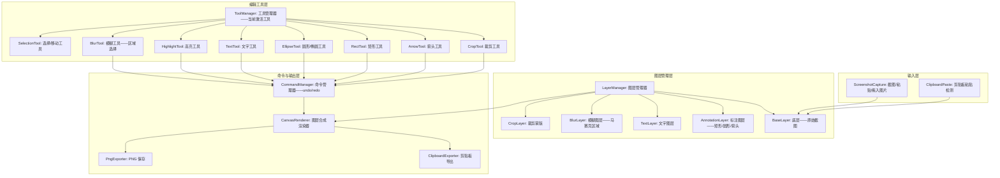

# YP-09-213: 网页截图编辑 — 截图标注编辑器、裁剪/高亮/箭头/文字/矩形/圆形工具、模糊敏感区域、撤销/重做、保存PNG、复制到剪贴板

> 需求编号：YP-09-213 · 优先级：P2 · 人天：0.2d · 状态：需求已编写
> 依赖：YP-09-206（图片裁剪工具——共享裁剪基类）

## 背景

### 问题陈述

用户在截取网页截图后——往往需要标注、编辑后再分享或存档——但浏览器缺乏内置的截图编辑工具：

1. **标注需求普遍**：用户截取网页后需要圈出重点、添加箭头指示、打码敏感信息——但只能依赖外部工具
2. **敏感信息打码**：截图中可能包含个人信息（手机号、邮箱、地址）或机密数据——需要模糊处理——手动用画图工具涂抹效果差
3. **撤销/重做缺失**：编辑操作容易出错——没有撤销意味着一步错就要从头开始
4. **批注后直接使用**：需要标注后直接复制到剪贴板粘贴到聊天窗口或文档——而非保存文件再插入
5. **步骤过多**：截图 → 保存文件 → 打开编辑工具 → 标注 → 保存 → 插入文档——6 步以上

**核心矛盾**：操作系统截图工具（如 macOS 截图、Windows 截图工具）在截图后提供最基础的编辑——但功能有限（仅裁剪和简单画笔）。YiPet 的截图编辑工具在截取后直接进入全功能编辑器——裁剪、标注、模糊、文字一站式完成——然后复制到剪贴板或保存。

### 影响范围

| # | 影响 | 严重程度 | 典型场景 |
|---|------|----------|----------|
| 1 | 截图标注需要外部工具 | 高 | 截图 → 保存 → 打开预览/画图 → 标注 → 保存 → 插入——6 步 |
| 2 | 敏感信息未打码导致泄露 | 高 | 分享截图时忘记遮盖手机号/邮箱——信息泄露 |
| 3 | 箭头/文字标注不美观 | 中 | 手绘线条歪斜——文字位置不对——影响沟通效果 |
| 4 | 编辑错误无法撤销 | 中 | 标注错误——只能清除所有或重新截取 |

### 挑战

| 挑战 | 说明 |
|------|------|
| 撤销/重做栈 | 需要保存每一步的完整 Canvas 快照或操作记录——内存和性能权衡 |
| 模糊算法 | 需要对指定区域进行像素化/高斯模糊——Canvas 原生不支持——需手动实现 |
| 文字渲染 | 文字标注需要支持字体/大小/颜色/粗体——跨平台字体渲染一致性问题 |
| 箭头绘制 | 箭头需要精确的起终点+箭头头部计算——涉及三角函数 |
| 工具切换 | 多个编辑工具之间需要流畅切换——鼠标状态和光标样式管理 |
| 高 DPI 支持 | Retina 屏幕下 Canvas 需要 2x 渲染——坐标换算需处理 devicePixelRatio |

---

## 一、现状分析

### 1.1 当前截图编辑方式

```
现有截图编辑手段:
├── 操作系统原生
│   ├── macOS 截图预览: 裁剪+画笔+形状+文字——功能基础
│   ├── Windows 截图工具: 裁剪+画笔+荧光笔——功能有限
│   └── 限制: 无模糊/马赛克、无撤销/重做、无箭头工具
├── 第三方截图工具
│   ├── Snipaste: 截图+标注+贴图——功能强大但需要安装
│   ├── CleanShot X: macOS 付费——功能全面但不免费
│   └── 限制: 需要安装额外软件
├── 在线工具
│   ├── 上传截图 → 标注 → 下载——隐私问题
│   └── 限制: 需要网络、上传等待、隐私风险
│
缺失:
├── 浏览器内截图后直接编辑                              # ❌ 无
├── 模糊/马赛克敏感区域——一键打码                        # ❌ 无
├── 撤销/重做栈——无限次                                 # ❌ 无
├── 箭头/矩形/圆形/线条/文字——统一样式控制               # ❌ 无
├── 编辑后直接复制到剪贴板                               # ❌ 无
├── 多层级标注——标注可编辑/移动/删除                      # ❌ 无
└── 编辑历史面板——查看所有操作                            # ❌ 无
```

### 1.2 截图编辑流程（现状 vs 目标）

```mermaid
graph TD
    subgraph Current["现状：6步——多工具切换"]
        C1[截图——Command+Shift+4] --> C2[保存截图到桌面]
        C2 --> C3[打开 macOS 预览]
        C3 --> C4[添加框选+文字——功能有限]
        C4 --> C5[保存编辑后图片]
        C5 --> C6[拖入聊天窗口或文档]
        C6 --> C7{需要打码?}
        C7 -->|是| C8[打开在线打码工具——上传——打码——下载]
        C7 -->|否| C9[完成——耗时 2-3 分钟]
    end

    subgraph Target["目标：YiPet 截图编辑器——3步一站式"]
        T1[截图或粘贴图片] --> T2[自动进入编辑模式]
        T2 --> T3[选择工具: 裁剪/箭头/矩形/圆形/文字/模糊]
        T3 --> T4[标注+裁剪+打码]
        T4 --> T5[撤销不满意操作 (Ctrl+Z)]
        T5 --> T6[复制到剪贴板——直接粘贴到聊天]
        T6 --> T7[或保存为 PNG]
    end

    style Current fill:#f8d7da,stroke:#dc3545
    style Target fill:#d4edda,stroke:#28a745
```

### 1.3 根因矩阵

| 症状 | 根因 | 触发条件 | 频率 |
|------|------|----------|------|
| 截图后标注步骤多 | 浏览器无内置截图编辑能力 | 每次截图需要标注时 | 高 |
| 敏感信息泄露 | 缺乏便捷的打码工具——手动涂抹不彻底 | 截图含个人信息时 | 中 |
| 标注错误无法撤销 | 无操作历史——编辑工具缺少撤销机制 | 标注失误时 | 中 |
| 批注效果不专业 | 手绘线条、文字位置不精确 | 需要专业外观批注时 | 中 |
| 工具切换不便 | 系统工具功能分散——裁剪和标注在不同工具中 | 需要多种编辑操作时 | 中 |

---

## 二、设计决策

### 决策 1：编辑模式 — 位图直接编辑 vs 图层叠加编辑器

| 选项 | 操作灵活性 | 撤销实现 | 最终导出 |
|------|----------|---------|---------|
| 位图直接编辑 | 低——像素直接修改——无法移动已添加内容 | 困难——需保存全图快照 | 简单 |
| 图层叠加编辑器 | 高——标注作为独立图层——可编辑/移动/删除 | 简单——撤销删除或恢复图层 | 导出时合并图层 |

**选择：图层叠加编辑器。** 每个标注操作（箭头、矩形、文字、模糊区域）作为独立图层存储——而非直接修改底层截图。图层模式支持：标注后可选中移动/调整大小/删除、撤销只需移除图层、导出时将所有图层渲染到最终 Canvas。这是专业截图工具的标准架构。

### 决策 2：撤销/重做实现 — 全图快照栈 vs 命令模式 (Command Pattern)

| 选项 | 内存占用 | 实现复杂度 | 无限撤销 |
|------|---------|----------|---------|
| 全图快照栈 | 高——每步保存完整 Canvas ImageData | 低 | 受限于内存 |
| 命令模式 | 极低——仅存储操作参数 | 中 | 无限制 |
| 快照+命令混合 | 中——每 10 步插一个快照 | 中 | 兼顾 |

**选择：命令模式 (execute/undo/redo)。** 每个编辑操作包装为 Command（包含执行参数和逆操作参数）。撤销栈仅存储命令对象——内存占用忽略不计。撤销时调用 command.undo()——重做时调用 command.redo()。全图快照栈在大截图（4K）下每步 ~32MB——10 步撤销就 320MB——不可持续。命令模式的唯一代价是需要正确实现每个工具的 undo 逻辑。

### 决策 3：模糊实现 — CSS filter:blur() vs Canvas 像素化 (马赛克) vs Canvas 高斯模糊

| 选项 | 视觉效果 | 性能 | 实现复杂度 |
|------|---------|------|----------|
| CSS filter:blur() | 好——高斯模糊 | 快——GPU 加速 | 低——但对导出无效 |
| 像素化 (马赛克——平均降采样) | 中等——方块感 | 快 | 低 |
| Canvas 高斯模糊 | 好——真实模糊 | 慢——O(n^2) | 中 |

**选择：像素化（马赛克）+ CSS filter 预览。** 像素化（将区域降采样再放大）是打码场景最常用的方式——视觉效果清晰"这里被遮盖了"——且实现简单（O(n) 操作）。CSS filter:blur() 用于实时预览——显示真实的模糊效果——导出时使用像素化。Canvas 高斯模糊在 0.2d 内不实现——性能和复杂度不匹配。

### 决策 4：剪贴板复制策略 — Clipboard API write vs execCommand vs 数据 URL

| 选项 | 兼容性 | 支持 PNG | 权限需求 |
|------|--------|---------|---------|
| Clipboard API (navigator.clipboard.write) | Chrome 86+ | 是——Blob | 需要 clipboard-write 权限 |
| execCommand('copy') | 所有浏览器 | 否——仅文本/HTML | 无 |
| 数据 URL → 新建 tab → 右键保存 | 所有浏览器 | 是 | 无 |

**选择：Clipboard API write——降级到数据 URL。** `navigator.clipboard.write([new ClipboardItem({'image/png': blob})])` 直接复制 PNG 到剪贴板——可粘贴到大多数应用（微信/钉钉/Slack/Figma/文档）。如果 Clipboard API 不可用——降级到在新 tab 中打开数据 URL——用户手动右键保存。

### 设计决策记录

| 决策 | 选项 A | 选项 B | 选项 C | 选择 | 理由 |
|------|--------|--------|--------|------|------|
| 编辑模式 | 位图直接编辑 | 图层叠加 | — | **图层叠加** | 可编辑/移动/删除 |
| 撤销实现 | 全图快照 | 命令模式 | 混合 | **命令模式** | 无限撤销+低内存 |
| 模糊方式 | CSS blur | 像素化 | 高斯模糊 | **像素化+CSS预览** | 简单有效 |
| 剪贴板 | Clipboard API | execCommand | 数据 URL | **Clipboard API** | 直接复制 PNG |

---

## 三、目标架构

### 3.1 截图编辑器架构



### 3.2 标注编辑流程

```mermaid
graph TD
    A[用户导入截图] --> B[创建基础图层——原始截图]
    B --> C[显示编辑工具栏: 裁剪/箭头/矩形/圆形/文字/高亮/模糊/选择]

    C --> D{选择工具}
    D -->|裁剪| E[拖拽选区——双击确认——非选区变暗]
    D -->|箭头| F[点击起点——拖拽到终点——箭头头部自动绘制]
    D -->|矩形| G[拖拽选区——描边矩形+填充色]
    D -->|圆形| H[拖拽选区——描边椭圆]
    D -->|文字| I[点击位置——弹出文字输入——确认]
    D -->|高亮| J[拖拽选区——半透明黄色覆盖]
    D -->|模糊| K[拖拽选区——马赛克效果+CSS预览]
    D -->|选择| L[点击标注——选中——可拖动/调整大小/删除]

    E --> M[创建 Command——推入 undo 栈]
    F --> M
    G --> M
    H --> M
    I --> M
    J --> M
    K --> M

    M --> N[重新合成所有图层——更新预览]

    C -->|Ctrl+Z| O[CommandManager.undo()]
    O --> N
    C -->|Ctrl+Shift+Z| P[CommandManager.redo()]
    P --> N

    N --> Q{用户操作}
    Q -->|复制| R[合成最终图片→剪贴板]
    Q -->|保存| S[合成→toBlob PNG→下载]
    Q -->|继续编辑| C
```

### 3.3 性能指标

| 指标 | 目标值 | 说明 |
|------|--------|------|
| 图层合成渲染 | < 16ms | requestAnimationFrame 一帧内 |
| 命令推入/撤销 | < 5ms | 仅操作栈——不重渲染 |
| 模糊区域生成 (300x200) | < 100ms | 像素化算法 |
| 文字渲染 | < 10ms | Canvas fillText |
| 导出 PNG (1080p) | < 100ms | Canvas.toBlob |
| 剪贴板复制 | < 200ms | Clipboard API write |
| 编辑器打开 | < 200ms | 加载截图+初始化工具 |

---

## 四、具体改动

### 4.1 类型定义

```typescript
// src/screenshot-editor/types.ts (新增)

export type EditTool = 'select' | 'crop' | 'arrow' | 'rect' | 'ellipse' | 'text' | 'highlight' | 'blur';
export type LayerType = 'base' | 'annotation' | 'text' | 'blur' | 'crop-mask';

export interface Point {
  x: number;
  y: number;
}

export interface Rect {
  x: number;
  y: number;
  w: number;
  h: number;
}

export interface AnnotationStyle {
  strokeColor: string;
  strokeWidth: number;
  fillColor: string;
  fillOpacity: number;
  fontSize: number;
  fontFamily: string;
  fontWeight: 'normal' | 'bold';
  textColor: string;
}

export const DEFAULT_STYLE: AnnotationStyle = {
  strokeColor: '#FF0000',
  strokeWidth: 3,
  fillColor: '#FF0000',
  fillOpacity: 0.2,
  fontSize: 20,
  fontFamily: 'sans-serif',
  fontWeight: 'bold',
  textColor: '#FF0000',
};

export interface Layer {
  id: string;
  type: LayerType;
  visible: boolean;
  locked: boolean;
  zIndex: number;
  data: LayerData;
}

export interface ArrowData {
  startPoint: Point;
  endPoint: Point;
  style: AnnotationStyle;
}

export interface RectData {
  rect: Rect;
  style: AnnotationStyle;
}

export interface EllipseData {
  rect: Rect;
  style: AnnotationStyle;
}

export interface TextData {
  position: Point;
  text: string;
  style: AnnotationStyle;
}

export interface HighlightData {
  rect: Rect;
  color: string;
  opacity: number;
}

export interface BlurData {
  rect: Rect;
  mosaicSize: number; // 马赛克块大小——像素
  originalPixels?: ImageData; // 模糊前的原始像素——用于撤销
}

export interface CropData {
  rect: Rect;
  originalDimensions: { w: number; h: number };
}

export type LayerData = ArrowData | RectData | EllipseData | TextData | HighlightData | BlurData | CropData;

export interface EditorCommand {
  id: string;
  name: string;
  execute(): void;
  undo(): void;
  redo(): void;
}

export interface EditorState {
  layers: Layer[];
  activeTool: EditTool;
  currentStyle: AnnotationStyle;
  isModified: boolean;
  canvasWidth: number;
  canvasHeight: number;
}
```

### 4.2 图层管理器

```typescript
// src/screenshot-editor/LayerManager.ts (新增)

export class LayerManager {
  private layers: Layer[] = [];
  private layerIdCounter: number = 0;

  constructor(baseImageData: ImageData) {
    // 创建基础图层
    this.addBaseLayer(baseImageData);
  }

  addLayer(layer: Omit<Layer, 'id'>): Layer {
    const id = `layer_${++this.layerIdCounter}`;
    const newLayer: Layer = { ...layer, id };
    this.layers.push(newLayer);
    this.sortByZIndex();
    return newLayer;
  }

  removeLayer(id: string): Layer | null {
    const index = this.layers.findIndex(l => l.id === id);
    if (index === -1) return null;
    const [removed] = this.layers.splice(index, 1);
    return removed;
  }

  updateLayer(id: string, updates: Partial<Layer>): boolean {
    const layer = this.layers.find(l => l.id === id);
    if (!layer) return false;
    Object.assign(layer, updates);
    return true;
  }

  getLayer(id: string): Layer | undefined {
    return this.layers.find(l => l.id === id);
  }

  getAllLayers(): Layer[] {
    return [...this.layers];
  }

  getVisibleLayers(): Layer[] {
    return this.layers.filter(l => l.visible).sort((a, b) => a.zIndex - b.zIndex);
  }

  /** 渲染所有可见图层到 Canvas */
  renderAll(targetCanvas: HTMLCanvasElement): void {
    const ctx = targetCanvas.getContext('2d')!;
    ctx.clearRect(0, 0, targetCanvas.width, targetCanvas.height);

    for (const layer of this.getVisibleLayers()) {
      this.renderLayer(ctx, layer);
    }
  }

  private renderLayer(ctx: CanvasRenderingContext2D, layer: Layer): void {
    switch (layer.type) {
      case 'base':
        ctx.putImageData(layer.data as ImageData, 0, 0);
        break;
      case 'annotation':
        this.renderAnnotation(ctx, layer.data as RectData | ArrowData | EllipseData);
        break;
      case 'text':
        this.renderText(ctx, layer.data as TextData);
        break;
      case 'blur':
        this.renderBlur(ctx, layer.data as BlurData);
        break;
      case 'crop-mask':
        this.renderCropMask(ctx, layer.data as CropData);
        break;
    }
  }

  private renderAnnotation(ctx: CanvasRenderingContext2D, data: RectData | ArrowData | EllipseData): void { /* ... */ }
  private renderText(ctx: CanvasRenderingContext2D, data: TextData): void { /* ... */ }
  private renderBlur(ctx: CanvasRenderingContext2D, data: BlurData): void { /* ... */ }
  private renderCropMask(ctx: CanvasRenderingContext2D, data: CropData): void { /* ... */ }

  private addBaseLayer(imageData: ImageData): void { /* ... */ }
  private sortByZIndex(): void {
    this.layers.sort((a, b) => a.zIndex - b.zIndex);
  }
}
```

### 4.3 命令管理器

```typescript
// src/screenshot-editor/CommandManager.ts (新增)

export class CommandManager {
  private undoStack: EditorCommand[] = [];
  private redoStack: EditorCommand[] = [];
  private maxHistory: number = 100;

  execute(command: EditorCommand): void {
    command.execute();
    this.undoStack.push(command);
    this.redoStack = []; // 新操作清除重做栈
    if (this.undoStack.length > this.maxHistory) {
      this.undoStack.shift();
    }
  }

  undo(): boolean {
    const command = this.undoStack.pop();
    if (!command) return false;
    command.undo();
    this.redoStack.push(command);
    return true;
  }

  redo(): boolean {
    const command = this.redoStack.pop();
    if (!command) return false;
    command.redo();
    this.undoStack.push(command);
    return true;
  }

  get canUndo(): boolean {
    return this.undoStack.length > 0;
  }

  get canRedo(): boolean {
    return this.redoStack.length > 0;
  }

  get undoCount(): number {
    return this.undoStack.length;
  }

  get redoCount(): number {
    return this.redoStack.length;
  }

  /** 创建添加图层的命令 */
  static createAddLayerCommand(layerManager: LayerManager, layer: Layer): EditorCommand {
    return {
      id: `add_${layer.id}`,
      name: '添加标注',
      execute: () => { layerManager.updateLayer(layer.id, { visible: true }); },
      undo: () => { layerManager.updateLayer(layer.id, { visible: false }); },
      redo: () => { layerManager.updateLayer(layer.id, { visible: true }); },
    };
  }

  /** 创建删除图层的命令 */
  static createRemoveLayerCommand(layerManager: LayerManager, layer: Layer): EditorCommand {
    return {
      id: `remove_${layer.id}`,
      name: '删除标注',
      execute: () => { layerManager.removeLayer(layer.id); },
      undo: () => { layerManager.addLayer(layer); },
      redo: () => { layerManager.removeLayer(layer.id); },
    };
  }
}
```

### 4.4 模糊/马赛克工具

```typescript
// src/screenshot-editor/BlurTool.ts (新增)

export class BlurTool {
  /** 对指定区域应用马赛克效果 */
  static applyMosaic(
    sourceCanvas: HTMLCanvasElement,
    rect: Rect,
    mosaicSize: number = 10
  ): void {
    const ctx = sourceCanvas.getContext('2d')!;
    const imageData = ctx.getImageData(rect.x, rect.y, rect.w, rect.h);
    const pixels = imageData.data;

    // 遍历马赛克块
    for (let y = 0; y < rect.h; y += mosaicSize) {
      for (let x = 0; x < rect.w; x += mosaicSize) {
        // 计算块内平均颜色
        const avgColor = this.calcBlockAverage(pixels, rect.w, x, y, mosaicSize, rect);

        // 用平均颜色填充块
        this.fillBlock(pixels, rect.w, x, y, mosaicSize, avgColor, rect);
      }
    }

    ctx.putImageData(imageData, rect.x, rect.y);
  }

  private static calcBlockAverage(
    pixels: Uint8ClampedArray,
    imgWidth: number,
    startX: number,
    startY: number,
    size: number,
    rect: Rect
  ): [number, number, number, number] {
    let r = 0, g = 0, b = 0, a = 0;
    let count = 0;
    const endX = Math.min(startX + size, rect.w);
    const endY = Math.min(startY + size, rect.h);

    for (let y = startY; y < endY; y++) {
      for (let x = startX; x < endX; x++) {
        const idx = (y * imgWidth + x) * 4;
        r += pixels[idx];
        g += pixels[idx + 1];
        b += pixels[idx + 2];
        a += pixels[idx + 3];
        count++;
      }
    }

    return count > 0
      ? [Math.round(r / count), Math.round(g / count), Math.round(b / count), Math.round(a / count)]
      : [0, 0, 0, 255];
  }

  private static fillBlock(
    pixels: Uint8ClampedArray,
    imgWidth: number,
    startX: number,
    startY: number,
    size: number,
    color: [number, number, number, number],
    rect: Rect
  ): void { /* 用颜色填充马赛克块 */ }

  /** CSS 模糊预览——用于实时反馈 */
  static createBlurOverlay(rect: Rect, blurRadius: number = 8): HTMLDivElement { /* ... */ }
}
```

### 4.5 文件变更清单

| 文件 | 操作 | 说明 |
|------|------|------|
| `src/screenshot-editor/types.ts` | 新增 | 截图编辑器类型定义 |
| `src/screenshot-editor/LayerManager.ts` | 新增 | 图层管理器 |
| `src/screenshot-editor/CommandManager.ts` | 新增 | 命令管理器——undo/redo |
| `src/screenshot-editor/ToolManager.ts` | 新增 | 编辑工具管理器 |
| `src/screenshot-editor/BlurTool.ts` | 新增 | 模糊/马赛克工具 |
| `src/screenshot-editor/ArrowTool.ts` | 新增 | 箭头绘制工具 |
| `src/screenshot-editor/CanvasRenderer.ts` | 新增 | 图层合成渲染器 |
| `src/screenshot-editor/ClipboardExporter.ts` | 新增 | 剪贴板导出 |
| `src/components/ScreenshotEditor.vue` | 新增 | 截图编辑器主面板 |
| `src/components/EditorToolbar.vue` | 新增 | 编辑工具栏 |
| `src/components/StylePanel.vue` | 新增 | 样式设置面板（颜色/线宽/字体） |
| `src/components/EditorCanvas.vue` | 新增 | 编辑画布 |
| `src/components/LayerPanel.vue` | 新增 | 图层面板 |
| `src/composables/useScreenshotEditor.ts` | 新增 | 编辑器状态管理 |
| `src/popup/App.vue` | 修改 | 添加入口 |

---

## 五、实施步骤

| 步骤 | 操作 | 路径 | 验证 | 人天 |
|------|------|------|------|------|
| 1 | 类型定义+常量 | `types.ts` | 编辑器状态——图层——命令类型完整 | 0.01 |
| 2 | 图层管理器——添加/删除/渲染 | `LayerManager.ts` | 多层叠加渲染——z-index 排序 | 0.03 |
| 3 | 命令管理器——undo/redo 栈 | `CommandManager.ts` | 撤销/重做——100 步上限 | 0.02 |
| 4 | 工具集——箭头/矩形/圆形/文字/高亮 | `ToolManager.ts` + `ArrowTool.ts` + 其他工具 | 6 个标注工具可用 | 0.05 |
| 5 | 模糊/马赛克工具+裁剪工具 | `BlurTool.ts` + 裁剪逻辑 | 马赛克效果+裁剪蒙版 | 0.03 |
| 6 | 编辑画布+工具栏+图层面板 | `EditorCanvas.vue` + `EditorToolbar.vue` + `LayerPanel.vue` | 完整编辑交互 | 0.04 |
| 7 | 剪贴板导出+入口集成 | `ClipboardExporter.ts` + `ScreenshotEditor.vue` | 复制到剪贴板+PNG保存 | 0.02 |

**总人天：0.20d**

---

## 六、测试规格

### 场景 1：截图导入+矩形标注

**GIVEN** 用户粘贴一张网页截图 (1920x1080)
**WHEN** 截图加载到编辑器——基础图层显示完整截图
**THEN** 工具栏显示所有编辑工具——默认选择"矩形"
**WHEN** 拖拽绘制一个红色矩形——框选截图中的重点区域
**THEN** 矩形标注出现在编辑画布上——红色边框+半透明填充
**AND** 图层面板显示 "矩形 1"——可见+可选中

### 场景 2：敏感信息打码

**GIVEN** 截图中有一个手机号区域 "138xxxx1234"
**WHEN** 选择"模糊"工具——在手机号区域拖拽选区
**THEN** CSS 滤镜实时显示高斯模糊效果
**AND** 导出时使用马赛克效果——手机号不可辨识
**AND** 马赛克块大小 10px——可调整 5-30px

### 场景 3：撤销/重做

**GIVEN** 用户依次添加箭头→矩形→文字三个标注
**WHEN** 按 Ctrl+Z 一次
**THEN** 文字标注消失——图层面板移除"文字 1"
**WHEN** 按 Ctrl+Z 再两次
**THEN** 矩形消失——箭头消失——只剩原始截图
**WHEN** 按 Ctrl+Shift+Z 两次
**THEN** 箭头恢复——矩形恢复——重做栈清空（如果有新操作）

### 场景 4：标注移动和调整

**GIVEN** 画布上有一个矩形标注
**WHEN** 选择"选择"工具——点击矩形
**THEN** 矩形四周出现 8 个拖拽手柄
**WHEN** 拖拽角手柄——调整矩形大小
**THEN** 矩形尺寸实时更新——释放鼠标后生成尺寸调整命令
**WHEN** 拖拽矩形中心——移动位置
**THEN** 矩形跟随鼠标移动——释放后位置生效

### 场景 5：裁剪功能

**GIVEN** 用户需要从截图中裁剪出部分区域
**WHEN** 选择"裁剪"工具——拖拽裁剪选区
**THEN** 选区外区域显示半透明灰色蒙版——选区清晰可见
**AND** 可以调整选区大小和位置
**WHEN** 双击选区或点击"应用裁剪"
**THEN** 编辑器 Canvas 尺寸裁剪到选区大小
**AND** 所有标注图层同步调整位置

### 场景 6：复制到剪贴板+保存PNG

**GIVEN** 编辑完成——包含 3 个标注和 1 个模糊区域
**WHEN** 点击"复制到剪贴板"
**THEN** 所有图层合成——生成 PNG Blob——复制到系统剪贴板
**AND** 可以在微信/钉钉/文档中直接粘贴使用
**WHEN** 点击"保存为 PNG"
**THEN** 下载 PNG 文件——文件名 "screenshot_edited_20260909_143025.png"

---

## 七、风险与缓解

| 风险 | 概率 | 影响 | 缓解措施 |
|------|------|------|----------|
| Clipboard API 在某些环境不可用（HTTP 非 HTTPS） | 中 | 中 | 降级到 data URL——在新 tab 中打开——提示用户右键保存 |
| 图层过多 (50+) 导致渲染性能下降 | 低 | 中 | 图层合成使用离屏 Canvas——仅在图层变化时重新渲染——非每帧 |
| 马赛克效果在 4K 截图上性能差 | 中 | 中 | 马赛克算法复杂度 O(n)——4K 图片分析量 ~33MB——使用 Web Worker 处理 |
| 撤销栈在极端操作下内存累积 | 低 | 低 | 限制 100 步——超过移除最旧命令 |
| 文字渲染在不同平台字体不一致 | 高 | 低 | 默认使用系统 sans-serif——提供字体选择器 (Arial/Helvetica/系统默认) |
| 工具切换时鼠标状态残留 | 中 | 低 | 工具切换时重置所有鼠标事件监听——统一通过 ToolManager 管理 |

---

## 八、回滚策略

| 场景 | 回滚操作 | 影响 |
|------|------|------|
| 图层管理模式导致性能问题 | 降级为位图直接编辑——移除图层功能 | 标注不可移动/编辑 |
| 命令模式 undo/redo 逻辑出错 | 禁用撤销/重做——显示警告 | 无撤销功能 |
| 剪贴板 API 兼容性问题严重 | 仅保留 PNG 保存——移除复制按钮 | 不能直接粘贴 |
| 模糊工具性能差 | 降级为 CSS filter 预览——导出不含模糊 | 导出版本无打码 |
| 完全移除 | 隐藏入口——移除相关代码 | 功能不可用 |

---

## 九、设计决策记录

### D-01：为什么选择图层叠加编辑器而非位图直接编辑？

图层叠加的核心价值是"非破坏性编辑"——原始截图保存在基础图层——所有标注是叠加在上的独立图层。用户可以随时删除、修改、移动任何标注——而不会损坏原始截图。位图直接编辑一旦标注就无法撤销（除了全图快照）——且标注无法被选中和移动。图层模式虽然实现复杂度更高——但用户体验提升显著。

### D-02：为什么命令模式优于全图快照？

全图快照每步保存 ~8MB (1080p) 或 ~32MB (4K)——100 步撤销需要 800MB-3.2GB 内存——在实际使用中不可行。命令模式仅保存操作参数（如"在 (100,200) 添加红色矩形 300x150"）——几十字节——百万步撤销也毫无压力。代价是每个工具都需要实现 undo 逻辑——但每个工具约 20 行代码——总代价可控。

### D-03：为什么模糊使用马赛克而非高斯模糊？

打码场景的核心需求是"无法辨识原始内容"——而非"看起来美观"。马赛克块的方块效果恰好传达"这里被遮盖"的信息——比光滑的高斯模糊更明确。性能上——马赛克 O(n/blockSize^2) vs 高斯模糊 O(n*kernelSize) ——马赛克更快。真实的高斯模糊可能让用户误以为内容仍然可见——降低安全感。

### D-04：为什么剪贴板复制功能优先级高于文件保存？

用户编辑截图后的典型行为是"粘贴到聊天窗口/文档"——而非"保存文件到磁盘"。Clipboard API 支持直接写入 PNG Blob——一步操作完成"截图编辑→分享"。从用户旅程来看——复制到剪贴板减少了 2 个步骤（保存文件→插入文件）——更符合实际工作流。PNG 保存作为备选功能提供。

---

## 十、可观测性

### 指标

| 指标 | 类型 | 说明 |
|------|------|------|
| `yipet.editor.open_total` | Counter | 截图编辑器打开次数 |
| `yipet.editor.tool_used` | Counter (label: tool) | 各工具使用次数分布 |
| `yipet.editor.layer_count` | Histogram | 图数量分布 |
| `yipet.editor.undo_total` | Counter | 撤销操作总数 |
| `yipet.editor.redo_total` | Counter | 重做操作总数 |
| `yipet.editor.export_png_total` | Counter | PNG 保存次数 |
| `yipet.editor.export_clipboard_total` | Counter | 剪贴板复制次数 |
| `yipet.editor.blur_used` | Counter | 模糊/打码使用次数 |
| `yipet.editor.session_duration` | Histogram | 编辑会话时长 |

---

## 十一、代码审查检查清单

- [ ] LayerManager: 图层渲染顺序严格按 zIndex——基础图层始终在底部
- [ ] LayerManager: 裁剪图层仅显示蒙版——非裁剪操作时蒙版隐藏
- [ ] CommandManager: execute 后清空 redoStack——符合标准 undo/redo 语义
- [ ] ToolManager: 工具切换时取消当前工具的进行中操作——重置状态
- [ ] BlurTool: 马赛克块边缘处理——rect.w / rect.h 不能整除 blockSize 时——最后一行/列不越界
- [ ] ArrowTool: 箭头头部角度 30 度——长度 15px——三角函数计算正确
- [ ] CanvasRenderer: 使用 devicePixelRatio 适配 Retina 显示——Canvas 内尺寸与 CSS 尺寸一致
- [ ] ClipboardExporter: Clipboard.write 失败时降级——友好提示而非静默失败
- [ ] EditorCanvas: 鼠标事件使用 Canvas 坐标换算——考虑 CSS 缩放和滚动偏移
- [ ] 所有工具使用 requestAnimationFrame 渲染预览——而非直接操作 DOM

---

## 回归问题预测

| # | 预测问题 | 原因 | 验证方法 |
|---|---------|------|---------|
| 1 | Retina 屏下坐标换算错误——点击位置偏移 | devicePixelRatio 2x 下——Canvas 内坐标 = CSS坐标 * dpr | 在 2x 屏测试点击精确度——标注位置是否与鼠标位置一致 |
| 2 | 撤销模糊操作后——原始像素未正确恢复 | 需要保存模糊前的像素数据——如果忘记保存则无法恢复 | 模糊操作时在 BlurData 中保存 originalPixels——撤销时恢复 |
| 3 | 裁剪后标注图层位置偏移 | 裁剪改变 Canvas 尺寸——标注的绝对坐标不再匹配 | 裁剪后对所有标注图层做坐标偏移——偏移量 = 裁剪区域起点 |
| 4 | 导出 PNG 不包含模糊效果 | CSS filter 仅在预览时生效——导出时未渲染马赛克像素 | 导出前调用 BlurTool.applyMosaic 在导出 Canvas 上渲染马赛克 |
| 5 | Ctrl+Z 在文字输入时被编辑器拦截而非触发 undo | 焦点在文字输入框时——浏览器默认处理 Ctrl+Z | 文字输入完成前——使用浏览器默认 undo——完成后切换到编辑器 undo |
| 6 | 剪贴板复制在 Firefox 中失败 | Firefox 的 ClipboardItem 支持有限 | 检测浏览器支持——Firefox 降级到 data URL 方案 |

---

## 性能分析

### 各操作耗时

| 操作 | 1080p | 4K | 说明 |
|------|-------|----|------|
| 图层合成渲染 (5 层) | < 5ms | < 15ms | Canvas drawImage 图层叠加 |
| 马赛克 (300x200, block=10) | < 20ms | < 80ms | 像素遍历 |
| 马赛克 (全图, block=10) | < 200ms | < 800ms | 全图像素化 |
| 箭头绘制 | < 1ms | < 1ms | Canvas 路径绘制 |
| 文字渲染 | < 2ms | < 2ms | Canvas fillText |
| 导出 PNG (toBlob) | < 50ms | < 200ms | Canvas.toBlob |
| 剪贴板写入 | < 100ms | < 200ms | Clipboard API |
| 撤销/重做 | < 5ms | < 5ms | 命令栈操作+重渲染 |

### 内存占用

| 场景 | 内存峰值 | 说明 |
|------|---------|------|
| 原始截图 (1080p) | ~8MB | 基础图层 ImageData |
| 10 个标注图层 | ~1MB | 仅元数据——不存储像素 |
| 5 个模糊区域原始像素 | ~2MB | 每个 300x200 区域 |
| 导出缓冲区 | ~8MB | 导出用 Canvas |
| 撤销栈 (100 步) | ~0.1MB | 命令对象——极轻 |
| **总计** | **~19MB** | |

### 代码体积

| 文件 | 大小 |
|------|------|
| types.ts | ~4KB |
| LayerManager.ts | ~5KB |
| CommandManager.ts | ~3KB |
| ToolManager.ts | ~4KB |
| BlurTool.ts | ~3KB |
| ArrowTool.ts | ~2KB |
| CanvasRenderer.ts | ~3KB |
| ClipboardExporter.ts | ~2KB |
| Vue 组件 (5 个) | ~10KB |
| useScreenshotEditor.ts | ~3KB |
| **总计** | **~39KB** |