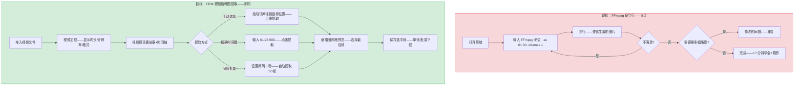
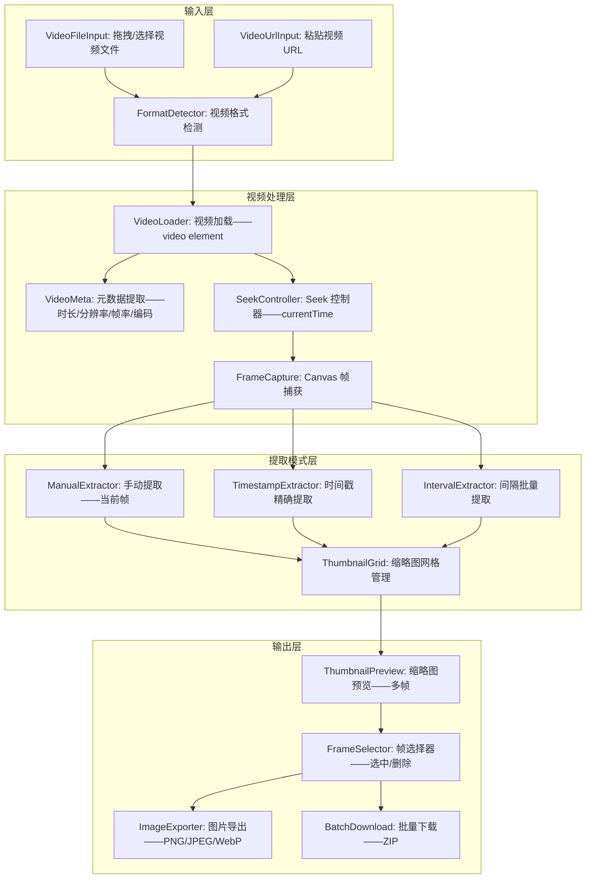

# YP-09-214: 视频缩略图提取 — 从视频提取缩略图、选择时间戳、间隔批量提取、缩略图网格预览、保存为图片、拖拽视频

> 需求编号：YP-09-214 · 优先级：P2 · 人天：0.2d · 状态：需求已编写
> 依赖：无

## 背景

### 问题陈述

用户经常需要从视频中提取静态帧——用于封面图、预览图、内容展示等多种场景——但当前缺乏便捷的浏览器端工具：

1. **视频封面提取**：上传视频到平台时——需要从视频中选择一帧作为封面——通常用播放器截图——精度差
2. **批量缩略图生成**：视频网站（YouTube/Bilibili）需要多张缩略图——用于不同展示位置——手动截取效率低
3. **关键帧定位**：用户需要视频中某个特定时刻的画面——拖动播放进度条精度不够——反复播放寻找
4. **画质检查**：视频制作者需要检查不同时间点的画质——逐帧查看编码伪影/模糊/曝光问题
5. **格式支持广泛**：用户有各种格式的视频（MP4/WebM/MKV/MOV/AVI）——需要通用提取工具

**核心矛盾**：浏览器原生 `<video>` 元素可以渲染视频——但没有任何内置的"提取当前帧为图片"功能。YiPet 的视频缩略图提取器利用浏览器的视频解码能力——通过 Canvas 捕获任意时间戳的画面——支持精确时间选择和批量间隔提取。

### 影响范围

| # | 影响 | 严重程度 | 典型场景 |
|---|------|----------|----------|
| 1 | 视频封面提取——用播放器截图不精确 | 高 | 播放到大致位置→暂停→截图——keyframe 跳帧导致定位不准 |
| 2 | 批量缩略图需外部工具（FFmpeg） | 高 | 需要 FFmpeg 命令行——学习成本高——非技术用户无法使用 |
| 3 | 视频格式不支持——系统播放器无法打开某些格式 | 中 | .mkv 文件无法在 macOS QuickTime 中打开 |
| 4 | 时间戳定位精度差——拖拽进度条不够精细 | 中 | 需要精确定位到 1:23.500——进度条最小粒度 1 秒 |

### 挑战

| 挑战 | 说明 |
|------|------|
| 视频格式兼容性 | 浏览器不支持 MKV/MOV/AVI——需检测格式并提示转换 |
| 精确 seek 精度 | video.currentTime 的精度取决于关键帧间隔——非精确到帧 |
| 大视频处理 | 4K/8K 视频的帧提取——Canvas 尺寸和内存限制 |
| 批量提取性能 | 大量时间戳 seek 操作——video 元素 seek 需异步等待 |
| 音频轨分离 | 用户可能只需要视频轨——存在多音轨/字幕轨的视频 |

---

## 一、现状分析

### 1.1 当前视频缩略图提取方式

```
现有视频帧提取手段:
├── 播放器截图
│   ├── VLC: 播放→暂停→视频→截图——功能基础
│   ├── QuickTime: 播放→暂停→编辑→复制——仅限 mov/mp4
│   └── 限制: 无法精确定位时间戳——批量手动操作繁琐
├── 命令行工具
│   ├── FFmpeg: ffmpeg -i video.mp4 -ss 00:01:30 -vframes 1 thumb.png——功能强大
│   ├── ffmpeg -i video.mp4 -vf fps=1/10 thumb_%03d.png——批量间隔提取
│   └── 限制: 需要安装+命令行知识——非技术用户无法使用
├── 在线工具
│   ├── 上传视频→选择时间→下载缩略图——隐私风险+上传耗时
│   └── 限制: 大视频上传慢——视频内容泄露风险
│
缺失:
├── 浏览器端视频帧提取——无需上传                         # ❌ 无
├── 可视时间轴——点击任意位置提取帧                        # ❌ 无
├── 精确时间戳输入——毫秒级定位                            # ❌ 无
├── 间隔批量提取——每 N 秒提取一帧——网格预览               # ❌ 无
├── 多帧同时预览——选择最佳帧保存                          # ❌ 无
├── 缩略图网格——jpg/png/webp 多种导出格式                 # ❌ 无
└── 拖拽视频文件+粘贴视频 URL 双输入                       # ❌ 无
```

### 1.2 缩略图提取流程（现状 vs 目标）



### 1.3 根因矩阵

| 症状 | 根因 | 触发条件 | 频率 |
|------|------|----------|------|
| 视频帧提取需要外部工具 | 浏览器无帧导出 API | 每次需要视频缩略图时 | 高 |
| 时间戳定位不精确 | 播放器进度条最小粒度 1 秒——不支持毫秒 | 需要精确画面时 | 中 |
| 批量提取繁琐 | 无间隔自动提取功能——手动逐一操作 | 生成视频预览图集时 | 中 |
| 某些视频格式无法打开 | 浏览器不支持 MKV/MOV——本地播放器也不行 | 用户有多种格式视频时 | 中 |
| 大视频处理能力不足 | 在线工具有文件大小限制 | > 100MB 视频需要缩略图时 | 低 |

---

## 二、设计决策

### 决策 1：视频解码方式 — 浏览器原生 video vs WebCodecs API vs FFmpeg.wasm

| 选项 | 格式支持 | 性能 | 包体积 | seek 精度 |
|------|---------|------|--------|----------|
| 浏览器原生 (video element) | MP4/WebM/OGG | 高——硬件加速 | 0KB | 关键帧精度 |
| WebCodecs API | MP4/WebM + 部分其他 | 最高——帧级访问 | 0KB | 精确到帧 |
| FFmpeg.wasm | 几乎所有格式 | 低——纯 WASM 软解 | ~30MB | 精确到帧 |

**选择：浏览器原生 video element（默认）+ WebCodecs API（增强）。** Video element 支持主流格式——硬件加速解码——包体积零——是最实用的方案。WebCodecs API (Chrome 94+) 提供帧级精确访问——当可用时使用——精度更高。FFmpeg.wasm 的 30MB 包体积对于 0.2d 的扩展功能来说太大了——且解码性能远不如硬件加速。

### 决策 2：Seek 精度策略 — 等待 seeked 事件 vs 等待 canplay 事件 vs 轮询 readyState

| 选项 | 可靠性 | 等待时间 | 精确度 |
|------|--------|---------|--------|
| 等待 seeked 事件 | 中——帧可能未渲染 | 快——~50ms | 关键帧级 |
| 等待 canplay 事件 | 高——帧已渲染 | 中——~100ms | 关键帧级 |
| 轮询 readyState + 超时 | 最高 | 可变——取决于视频 | 关键帧级 |

**选择：seeked 事件 + requestVideoFrameCallback (Chrome 83+)。** 标准流程：设置 currentTime → 等待 seeked 事件 → 使用 requestVideoFrameCallback 等待帧真正渲染 → Canvas 捕获。对于不支持 requestVideoFrameCallback 的浏览器——降级为 seeked + 50ms setTimeout。关键帧精度限制无法完全规避——但实际使用中关键帧间隔通常 2-10 秒——对于缩略图提取足够。

### 决策 3：批量提取策略 — 顺序 seek vs 跳帧 seek vs 预加载队列

| 选项 | 总耗时 | 实现复杂度 | 是否阻塞播放 |
|------|--------|----------|------------|
| 顺序 seek | 长——每次 seek 需等待渲染 | 低 | 是 |
| 跳帧 seek——video 帧步进 | 中——使用 video 内部帧索引 | 中 | 是 |
| 预加载队列 | 快——使用多个 video 元素预加载 | 高 | 否 |

**选择：顺序 seek——每个时间戳依次 seek→capture→next。** 批量提取不是高频操作——10 个缩略图耗时约 2-5 秒——用户可接受。多 video 元素预加载虽然更快——但内存占用大（10 个 video 元素 x 视频解码器）——且增加了管理复杂度。0.2d 内采用简单可靠的顺序方案。

### 决策 4：时间戳输入方式 — 仅进度条 vs 进度条+文本输入 vs 进度条+文本输入+帧步进

| 选项 | 精确度 | 用户体验 | 实现复杂度 |
|------|--------|---------|-----------|
| 仅进度条 | 低——取决于视频长度 | 好——直观 | 低 |
| 进度条+文本输入 | 高——精确到毫秒 | 好 | 低 |
| 进度条+文本输入+帧步进 | 最高——逐帧 | 最好 | 中 |

**选择：进度条+文本输入+帧步进按钮。** 进度条提供粗粒度导航——文本输入支持精确时间戳（格式: `MM:SS.mmm`）——帧步进按钮（前进/后退 1 帧）提供微调。帧步进使用 video.currentTime +/- 1/fps——在关键帧间隔内线性插值——虽不能真正逐帧——但比进度条精度高。

### 设计决策记录

| 决策 | 选项 A | 选项 B | 选项 C | 选择 | 理由 |
|------|--------|--------|--------|------|------|
| 解码方式 | 原生 video | WebCodecs | FFmpeg.wasm | **video+WebCodecs** | 轻量+主流 |
| Seek精度 | seeked | canplay | 轮询 | **seeked+帧回调** | 快速可靠 |
| 批量提取 | 顺序seek | 跳帧seek | 预加载队列 | **顺序seek** | 简单可靠 |
| 时间戳输入 | 进度条 | 进度条+文本 | 三合一 | **三合一** | 精度+便捷 |

---

## 三、目标架构

### 3.1 视频缩略图提取器架构



### 3.2 缩略图提取流程

```mermaid
graph TD
    A[用户拖入视频文件] --> B[视频加载——解码元数据]
    B --> C[显示视频信息: MP4——1920x1080——30fps——时长 5:30]

    C --> D[视频预览区域——播放器+时间轴]
    D --> E{选择提取模式}

    E -->|手动提取| F[播放/暂停视频——找到目标画面]
    F --> G[点击 "提取当前帧"]
    G --> H[帧捕获——添加到缩略图网格]

    E -->|时间戳提取| I[输入时间: 01:23.500]
    I --> J[点击 "跳转并提取"]
    J --> K[Seek 到时间戳——捕获帧——添加到网格]

    E -->|间隔批量提取| L[设置: 每 10 秒提取一帧——预计提取 33 帧]
    L --> M[预览: 显示缩略图网格——播放位置映射到网格]
    M --> N[可选: 调整采样间隔/起止时间]
    N --> O[点击 "确认提取"]

    H --> P[缩略图网格面板]
    K --> P
    O --> P

    P --> Q[预览: 所有提取的缩略图——含时间戳标签]
    Q --> R[勾选需要的帧——取消不需要的]
    R --> S{选择导出}
    S -->|保存选中| T[导出选中帧——PNG/JPEG/WebP]
    S -->|批量 ZIP| U[所有选中帧打包 ZIP 下载]
```

### 3.3 性能指标

| 指标 | 目标值 | 说明 |
|------|--------|------|
| 视频加载+元数据 | < 500ms | video element 加载 |
| 单次 seek+捕获 | < 150ms | seek + requestVideoFrameCallback |
| 10帧批量提取 (5秒间隔) | < 3s | 顺序 seek——150ms/帧 |
| 4K 视频帧捕获 | < 200ms | Canvas 4K 处理 |
| 缩略图网格渲染 (30帧) | < 200ms | 缩略图 200x112 |
| 最大支持视频分辨率 | 4096x2160 | 超出缩放至 1920px 预览 |
| 最大支持视频时长 | 无限制 | 仅受浏览器 video 元素限制 |

---

## 四、具体改动

### 4.1 类型定义

```typescript
// src/video-thumbnail/types.ts (新增)

export type ExtractMode = 'manual' | 'timestamp' | 'interval';

export interface VideoInfo {
  file: File;
  duration: number;          // 秒——浮点
  width: number;
  height: number;
  fps: number;               // 帧率——估计值
  format: string;            // MIME 类型
  codec: string;             // 编码格式
  size: number;              // 文件大小 bytes
  supported: boolean;        // 浏览器是否支持
  unsupportedReason?: string;
}

export interface ThumbnailResult {
  id: string;
  timestamp: number;         // 秒
  timestampLabel: string;    // "01:23.500"
  blob: Blob;
  dataUrl: string;
  width: number;
  height: number;
  fileSize: number;
  selected: boolean;
}

export interface IntervalConfig {
  startTime: number;         // 起始时间——秒
  endTime: number;           // 结束时间——秒
  interval: number;          // 采样间隔——秒
  estimatedCount: number;    // 预计提取帧数
}

export interface ThumbnailState {
  mode: ExtractMode;
  videoInfo: VideoInfo | null;
  thumbnails: ThumbnailResult[];
  isExtracting: boolean;
  extractProgress: { current: number; total: number };
  currentTimestamp: number;
  exportFormat: 'png' | 'jpeg' | 'webp';
  exportQuality: number;
}

export const EXPORT_FORMATS = [
  { value: 'png' as const, label: 'PNG——无损', mimeType: 'image/png' },
  { value: 'jpeg' as const, label: 'JPEG——照片', mimeType: 'image/jpeg' },
  { value: 'webp' as const, label: 'WebP——推荐', mimeType: 'image/webp' },
];

export const INTERVAL_PRESETS = [
  { label: '每 1 秒', value: 1 },
  { label: '每 3 秒', value: 3 },
  { label: '每 5 秒', value: 5 },
  { label: '每 10 秒', value: 10 },
  { label: '每 30 秒', value: 30 },
  { label: '每 60 秒', value: 60 },
];
```

### 4.2 帧捕获器

```typescript
// src/video-thumbnail/FrameCapture.ts (新增)

export class FrameCapture {
  private video: HTMLVideoElement;
  private canvas: HTMLCanvasElement;
  private ctx: CanvasRenderingContext2D;

  constructor(video: HTMLVideoElement) {
    this.video = video;
    this.canvas = document.createElement('canvas');
    this.ctx = this.canvas.getContext('2d')!;
  }

  /** 捕获当前帧为 Blob */
  async captureCurrentFrame(format: 'png' | 'jpeg' | 'webp' = 'png', quality?: number): Promise<Blob> {
    this.canvas.width = this.video.videoWidth;
    this.canvas.height = this.video.videoHeight;
    this.ctx.drawImage(this.video, 0, 0);
    return this.canvasToBlob(format, quality);
  }

  /** 跳转到指定时间戳并捕获帧 */
  async captureAtTimestamp(
    timestamp: number,
    format: 'png' | 'jpeg' | 'webp' = 'png',
    quality?: number
  ): Promise<ThumbnailResult> {
    // seek 到目标时间
    await this.seekTo(timestamp);
    // 捕获帧
    const blob = await this.captureCurrentFrame(format, quality);
    return {
      id: `thumb_${timestamp.toFixed(3)}`,
      timestamp,
      timestampLabel: this.formatTimestamp(timestamp),
      blob,
      dataUrl: URL.createObjectURL(blob),
      width: this.video.videoWidth,
      height: this.video.videoHeight,
      fileSize: blob.size,
      selected: true,
    };
  }

  /** 批量间隔提取 */
  async captureInterval(
    config: IntervalConfig,
    format: 'png' | 'jpeg' | 'webp' = 'png',
    quality?: number,
    onProgress?: (current: number, total: number) => void
  ): Promise<ThumbnailResult[]> {
    const results: ThumbnailResult[] = [];
    const total = config.estimatedCount;
    let current = 0;

    for (let t = config.startTime; t <= config.endTime; t += config.interval) {
      const result = await this.captureAtTimestamp(t, format, quality);
      results.push(result);
      current++;
      onProgress?.(current, total);
    }

    return results;
  }

  /** Seek 到指定时间——等待帧渲染 */
  private async seekTo(timestamp: number): Promise<void> {
    return new Promise((resolve, reject) => {
      const onSeeked = () => {
        this.video.removeEventListener('seeked', onSeeked);
        // 等待帧渲染
        if ('requestVideoFrameCallback' in this.video) {
          (this.video as any).requestVideoFrameCallback(() => resolve());
        } else {
          setTimeout(resolve, 50); // fallback: 50ms 等待渲染
        }
      };
      this.video.addEventListener('seeked', onSeeked);
      this.video.currentTime = Math.max(0, Math.min(timestamp, this.video.duration));
    });
  }

  /** 提取视频信息 */
  static async getVideoInfo(file: File): Promise<VideoInfo> {
    const video = document.createElement('video');
    video.preload = 'metadata';
    video.src = URL.createObjectURL(file);

    return new Promise((resolve, reject) => {
      video.onloadedmetadata = () => {
        resolve({
          file,
          duration: video.duration,
          width: video.videoWidth,
          height: video.videoHeight,
          fps: 30, // 估算——无法从 video 元素获取精确 fps
          format: file.type,
          codec: 'unknown',
          size: file.size,
          supported: true,
        });
        URL.revokeObjectURL(video.src);
      };
      video.onerror = () => {
        resolve({
          file, duration: 0, width: 0, height: 0, fps: 0,
          format: file.type, codec: 'unknown', size: file.size,
          supported: false,
          unsupportedReason: '浏览器不支持此视频格式',
        });
        URL.revokeObjectURL(video.src);
      };
    });
  }

  private async canvasToBlob(format: string, quality?: number): Promise<Blob> { /* ... */ }
  private formatTimestamp(seconds: number): string {
    const m = Math.floor(seconds / 60);
    const s = seconds % 60;
    return `${m.toString().padStart(2, '0')}:${s.toFixed(3).padStart(6, '0')}`;
  }

  dispose(): void {
    this.canvas.remove();
  }
}
```

### 4.3 文件变更清单

| 文件 | 操作 | 说明 |
|------|------|------|
| `src/video-thumbnail/types.ts` | 新增 | 视频缩略图类型定义 |
| `src/video-thumbnail/FrameCapture.ts` | 新增 | 帧捕获核心引擎 |
| `src/video-thumbnail/IntervalExtractor.ts` | 新增 | 间隔批量提取 |
| `src/video-thumbnail/ThumbnailManager.ts` | 新增 | 缩略图选中/删除/管理 |
| `src/components/VideoThumbnail.vue` | 新增 | 视频缩略图主面板 |
| `src/components/VideoPlayer.vue` | 新增 | 视频预览播放器 |
| `src/components/TimelineBar.vue` | 新增 | 时间轴+时间戳选择 |
| `src/components/ThumbnailGrid.vue` | 新增 | 缩略图网格 |
| `src/components/IntervalConfig.vue` | 新增 | 间隔提取配置面板 |
| `src/components/TimestampInput.vue` | 新增 | 时间戳输入器 |
| `src/composables/useVideoThumbnail.ts` | 新增 | 视频缩略图状态管理 |
| `src/popup/App.vue` | 修改 | 添加入口 |

---

## 五、实施步骤

| 步骤 | 操作 | 路径 | 验证 | 人天 |
|------|------|------|------|------|
| 1 | 类型定义+常量 | `types.ts` | 提取模式——时间戳格式——导出格式 | 0.01 |
| 2 | 视频加载+元数据提取 | `FrameCapture.ts` (VideoInfo) | 正确读取时长/分辨率/格式 | 0.02 |
| 3 | 帧捕获器——seek+捕获 | `FrameCapture.ts` (核心) | 精确 seek——Canvas 捕获正确 | 0.04 |
| 4 | 间隔批量提取器 | `IntervalExtractor.ts` | 间隔提取——进度回调——错误处理 | 0.03 |
| 5 | 视频播放器+时间轴 | `VideoPlayer.vue` + `TimelineBar.vue` | 播放/暂停/seek——时间轴交互 | 0.03 |
| 6 | 缩略图网格+管理 | `ThumbnailGrid.vue` + `ThumbnailManager.ts` | 预览/选中/删除/导出 | 0.04 |
| 7 | 主面板+时间戳输入+入口 | `VideoThumbnail.vue` + `TimestampInput.vue` | 三模式完整流程 | 0.03 |

**总人天：0.20d**

---

## 六、测试规格

### 场景 1：手动提取——播放定位

**GIVEN** 用户拖入一个 3 分钟的 MP4 视频 (1920x1080, 30fps)
**WHEN** 视频加载完成——显示视频信息和播放器
**THEN** 视频信息显示: MP4——1920x1080——时长 3:00——文件 45MB
**WHEN** 播放视频到约 1:30——点击暂停
**AND** 使用帧步进按钮微调到 1:30.500
**WHEN** 点击"提取当前帧"
**THEN** 缩略图网格出现帧 01:30.500——1920x1080 PNG

### 场景 2：精确时间戳提取

**GIVEN** 视频已加载
**WHEN** 切换到手时间戳提取模式——输入时间 "00:45.200"
**AND** 点击"跳转并提取"
**THEN** 视频 seek 到 00:45.200——捕获帧——添加到网格
**AND** 时间戳标签显示 "00:45.200"
**AND** 可继续输入其他时间戳——累积提取多帧

### 场景 3：间隔批量提取

**GIVEN** 一个 60 秒的视频
**WHEN** 切换到间隔提取模式——选择"每 5 秒"——起始 0s——结束 60s
**THEN** 预估显示 "预计提取 13 帧"
**WHEN** 点击"开始提取"
**THEN** 显示进度 "提取中 3/13——00:15.000"
**AND** 过程中——可点击"取消"中止
**AND** 完成后——13 帧显示在缩略图网格——时间间隔均匀

### 场景 4：缩略图网格管理

**GIVEN** 已提取 8 帧缩略图——显示在网格中
**THEN** 每帧显示缩略图+时间戳标签——默认全部选中
**WHEN** 点击第 3/5/7 帧——取消选中
**THEN** 取消选中的帧显示灰色覆盖+叉号
**AND** 底部显示 "已选 5/8 帧"
**WHEN** 点击"删除未选中"
**THEN** 仅保留选中的 5 帧——3 帧从网格移除

### 场景 5：帧导出——格式选择

**GIVEN** 选中 3 帧缩略图——文件格式 PNG
**WHEN** 切换导出格式为 WebP——质量 85%
**THEN** 导出按钮标签变为 "保存为 WebP"
**WHEN** 点击"保存选中"
**THEN** 3 帧以 WebP 格式导出——文件比 PNG 小 70-80%
**AND** 每帧文件名包含时间戳 "thumb_00_15_000.webp"

### 场景 6：不支持的视频格式

**GIVEN** 用户拖入一个 .mkv 格式的视频文件
**WHEN** 浏览器无法加载——video.onerror 触发
**THEN** 显示提示 "浏览器不支持此视频格式 (.mkv)"
**AND** 建议 "请使用 MP4/WebM 格式——或使用格式转换工具先转换"
**AND** 不显示播放器和提取功能

---

## 七、风险与缓解

| 风险 | 概率 | 影响 | 缓解措施 |
|------|------|------|----------|
| Seek 精度不足——提取的帧不是目标时刻 | 高 | 中 | 在 UI 中标注"精度取决于视频关键帧间隔"——使用 requestVideoFrameCallback 提高精度 |
| 大视频 (>2GB) 加载缓慢 | 中 | 中 | 显示加载进度——预加载仅 video metadata（不加载全视频） |
| 间隔提取时——某些时间戳 seek 超时 | 低 | 中 | 设置 seek 超时 5 秒——超时跳过该时间戳——标记为失败 |
| Canvas 捕获 4K 视频时颜色空间转换错误 (HDR/SDR) | 中 | 中 | Canvas 默认 sRGB——HDR 视频可能过曝——标注"HDR 视频颜色可能与原始有差异" |
| 视频有 DRM 保护 (如 Netflix 录制)——Canvas 捕获黑屏 | 低 | 低 | 检测空帧——提示"视频可能受 DRM 保护——无法提取帧" |
| 浏览器内存溢出——大量批量提取 | 中 | 低 | 限制缩略图网格最大 200 帧——超出提示分批提取 |

---

## 八、回滚策略

| 场景 | 回滚操作 | 影响 |
|------|------|------|
| Canvas 捕获 4K 视频崩溃 | 限制提取分辨率——>4K 时缩放至 1920px | 4K 缩略图不可用 |
| 间隔提取性能问题 | 取消间隔预设——仅保留手动和时间戳提取 | 无批量功能 |
| 浏览器不支持部分视频格式 | 提供格式检测——不支持的提示转换 | 支持的格式减少 |
| Canvas 捕获黑屏 (DRM) | 添加免责声明——非 DRM 工具用途 | 无影响 |
| 完全移除 | 隐藏入口——移除相关代码 | 功能不可用 |

---

## 九、设计决策记录

### D-01：为什么不在扩展中引入 FFmpeg.wasm 来支持所有视频格式？

FFmpeg.wasm 的 WASM 二进制约 30MB——这对于 Chrome 扩展来说是巨大的负担——严重增加下载和更新成本。视频解码是计算密集型操作——WASM 软件解码性能远低于浏览器硬件加速。此外——大多数用户视频为 MP4/WebM（手机录制、网络下载）——浏览器原生支持覆盖了 90%+ 场景。特殊格式用户可以使用格式转换工具先转换——而非在扩展中内置全能解码器。

### D-02：为什么缩略图网格限制 200 帧？

200 帧缩略图（每帧约 200x112 的 Canvas + DOM 元素）的渲染需要约 50-100MB 内存和数百毫秒的渲染时间——这是用户体验的边界值。超过 200 帧时——网格变得非常长——用户难以浏览——实际使用价值降低。对于极端场景——用户可以先设置更大的采样间隔——减少帧数。

### D-03：为什么 seek 精度受到关键帧的限制？

视频编码使用关键帧 (I-frame) 和差异帧 (P/B-frame) 来压缩数据。浏览器的 video element 在 seek 时——只能定位到最近的关键帧——然后解码到目标帧。关键帧间隔通常由编码器决定（2-10 秒）——不受 YiPet 控制。requestVideoFrameCallback 可以提高捕获精度（等待实际帧渲染）——但无法突破关键帧限制的根本性约束。

### D-04：为什么缩略图默认选中——而非默认不选？

用户提取缩略图的核心目的是使用它们——默认选中减少了"提取后还要逐个勾选"的操作步骤。如果用户不需要某些帧——取消勾选比逐个勾选更容易。批量导出时——用户可以在完成所有提取后——统一取消不需要的帧——再导出。

---

## 十、可观测性

### 指标

| 指标 | 类型 | 说明 |
|------|------|------|
| `yipet.vthumb.open_total` | Counter | 视频缩略图工具打开次数 |
| `yipet.vthumb.mode_used` | Counter (label: mode) | 提取模式使用分布 (manual/timestamp/interval) |
| `yipet.vthumb.video_format` | Counter (label: format) | 视频格式分布 |
| `yipet.vthumb.frames_per_batch` | Histogram | 每次批量提取帧数 |
| `yipet.vthumb.export_format` | Counter (label: format) | 导出格式分布 |
| `yipet.vthumb.unsupported_attempts` | Counter | 不支持格式尝试次数 |
| `yipet.vthumb.avg_seek_time` | Gauge | 平均 seek 耗时 |
| `yipet.vthumb.video_size` | Histogram | 视频文件大小分布 |

---

## 十一、代码审查检查清单

- [ ] FrameCapture: seek 后使用 requestVideoFrameCallback——等待帧真正渲染后再捕获
- [ ] FrameCapture: seek 超时 5 秒——超时跳过该时间戳——不阻塞批量提取
- [ ] FrameCapture: Canvas 尺寸与 video.videoWidth/videoHeight 一致——不使用 CSS 尺寸
- [ ] VideoPlayer: video 使用 preload="metadata"——不预加载全部视频数据
- [ ] IntervalExtractor: 取消按钮可中止批量提取——清理 pending seek
- [ ] ThumbnailGrid: 缩略图使用 URL.createObjectURL——组件卸载时 revoke
- [ ] TimelineBar: 时间轴交互更新 video.currentTime——防抖 100ms
- [ ] TimestampInput: 验证时间戳格式 MM:SS.mmm——超出视频时长时限制
- [ ] VideoThumbnail: 不支持格式时——禁用所有提取功能——仅显示提示
- [ ] 所有 video element 和 Canvas 在组件销毁时清理——释放视频解码器资源

---

## 回归问题预测

| # | 预测问题 | 原因 | 验证方法 |
|---|---------|------|---------|
| 1 | seek 到接近视频结尾的时间戳 (duration-0.1s) 失败 | video.duration 可能小于实际可 seek 范围 | 限制 max timestamp = duration - 0.5s——确保 seek 有效 |
| 2 | 批量提取时 video 元素在当前时间跳变——进度显示不更新 | seek 操作频繁——UI 更新频率不足 | 使用 RAF 节流更新 UI——不依赖 video timeupdate 事件 |
| 3 | 视频旋转元数据 (rotation metada) 未处理——竖拍视频帧旋转 | iOS 竖拍视频有 rotation metadata——video 自动旋转——Canvas 未旋转 | Canvas 绘制前检测并应用旋转——使用 CSS transform 或 Canvas 旋转 |
| 4 | URL.createObjectURL 过多——内存泄漏 | 每次提取都创建 Blob URL——但从不 revoke | 使用统一管理——组件卸载时全部 revoke——限制最大 200 个 URL |
| 5 | 间隔提取——精度受关键帧影响——提取帧时间戳不准确 | 提取帧的实际时间戳不等于请求时间戳——偏差可达关键帧间隔 | 显示实际捕获时间戳（video.currentTime）而非请求时间戳 |
| 6 | 同一视频文件重复提取大量帧——Blob 重复存储 | 多帧来自同一视频——每帧存储完整像素数据 | 可选"仅保存缩略图"模式——缩略图 320x180——节省空间 |

---

## 性能分析

### 操作耗时

| 操作 | 1080p 30fps | 4K 60fps | 说明 |
|------|-----------|---------|------|
| 视频元数据加载 | < 100ms | < 200ms | preload=metadata |
| 单次 seek+捕获 (PNG) | < 150ms | < 300ms | seek ~100ms + Canvas ~50-200ms |
| 批量 10 帧提取 | < 2s | < 4s | 顺序 seek |
| 批量 30 帧提取 | < 6s | < 12s | 顺序 seek |
| 缩略图网格渲染 (30帧) | < 150ms | < 200ms | 缩略图 200x112 |
| PNG 导出 1080p | < 50ms | — | Canvas.toBlob |
| JPEG 导出 (q=85) | < 30ms | < 100ms | Canvas.toBlob |

### 内存占用

| 场景 | 内存峰值 | 说明 |
|------|---------|------|
| 视频加载 (1080p) | ~10MB | video element 解码器 |
| 10 帧缩略图 (1080p PNG) | ~50MB | 10 个 Blob——每帧 ~5MB |
| 10 帧缩略图 (缩略图模式 320x180) | ~5MB | 缩略图压缩 |
| 批量提取 30 帧 | ~150MB | 30 个 1080p PNG Blob |
| 视频加载 (4K) | ~30MB | video element 解码器 |

### 代码体积

| 文件 | 大小 |
|------|------|
| types.ts | ~3KB |
| FrameCapture.ts | ~5KB |
| IntervalExtractor.ts | ~2KB |
| ThumbnailManager.ts | ~2KB |
| Vue 组件 (5 个) | ~12KB |
| useVideoThumbnail.ts | ~3KB |
| **总计** | **~27KB** |