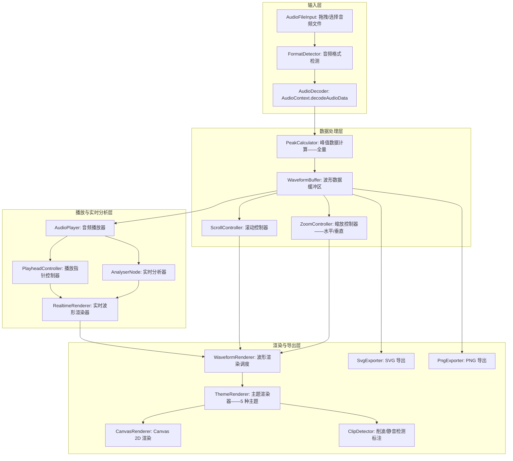
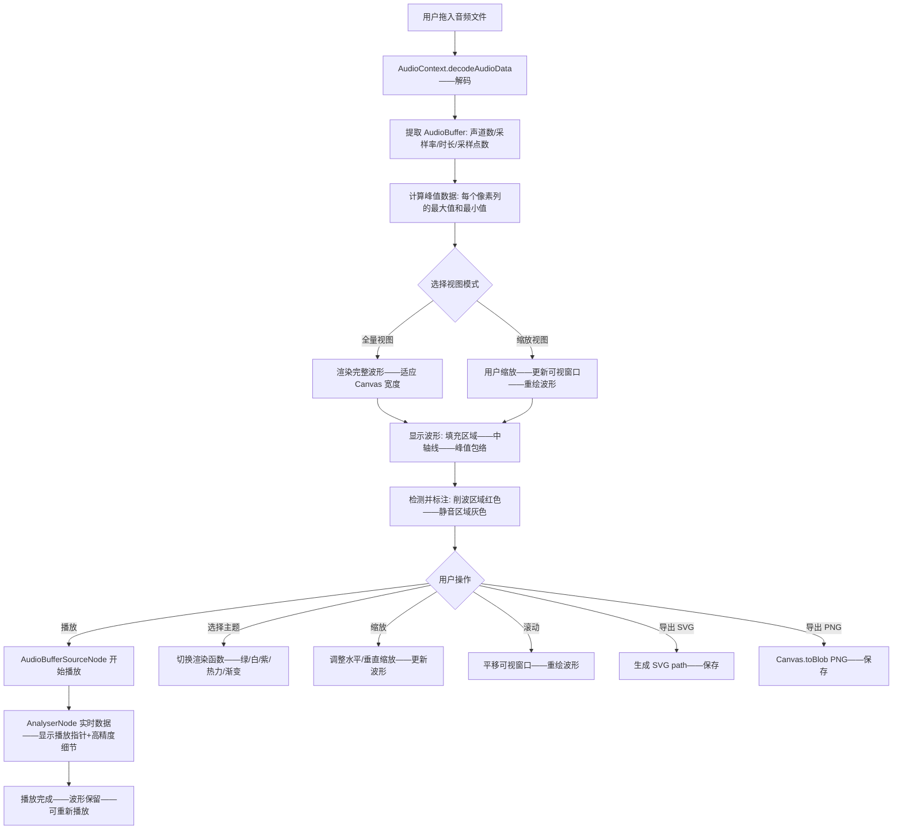

# YP-09-215: 音频波形可视化 — Web Audio API 分析器、播放中实时波形、缩放与滚动波形、导出波形为 SVG/PNG、颜色主题

> 需求编号：YP-09-215 · 优先级：P2 · 人天：0.2d · 状态：需求已编写
> 依赖：无

## 背景

### 问题陈述

音频文件是互联网重要的媒体类型——播客、有声书、音乐、语音消息都依赖音频——但浏览器缺乏将音频"可视化"的工具：

1. **音频不可见**：与图片/视频不同——音频文件在文件系统中只显示一个图标和文件名——用户无法预览内容
2. **播客/有声书预览**：发布者需要展示音频的波形图作为封面或预览——通常使用专业音频软件生成
3. **音量/峰值分析**：音频编辑者需要查看波形的峰值和动态范围——判断响度是否合适
4. **社交媒体分享**：在社交媒体上分享音频片段时——静态波形图是一种视觉吸引力强的内容形式
5. **音频质量检查**：录制完成后检查是否有削波（波形被截断）或静音段落

**核心矛盾**：Web Audio API 提供了 `AnalyserNode` 用于实时频谱和波形分析——但没有任何浏览器内置工具将这些数据渲染为可视化波形。YiPet 的音频波形可视化器利用 `AnalyserNode` 的时域数据——渲染实时播放波形——支持缩放、滚动、颜色主题和 SVG/PNG 导出。

### 影响范围

| # | 影响 | 严重程度 | 典型场景 |
|---|------|----------|----------|
| 1 | 音频内容无法可视化预览 | 高 | 文件夹中有 100 个音频——无法快速了解内容 |
| 2 | 波形图需要专业软件生成 | 中 | 播客封面需要波形——用 Audacity 生成——导出——裁剪 |
| 3 | 无法检测音频削波/静音 | 中 | 录制的音频响度过高——波形被截断——听之前无法发现 |
| 4 | 无实时播放波形 | 低 | 播放音频时——只看到进度条——缺少视觉反馈 |

### 挑战

| 挑战 | 说明 |
|------|------|
| 实时波形渲染性能 | 60fps 的波形动画需要高效的 Canvas 渲染——大 Canvas 时可能掉帧 |
| 音频文件解码 | 不同格式 (MP3/WAV/OGG/FLAC/AAC) 的浏览器兼容性差异 |
| 波形数据分辨率 | AnalyserNode 仅提供 2048 个频率 bin——时域数据足够的但有上限 |
| 长音频 (>1小时) 的全量波形 | 需要预计算峰值数据——逐帧分析的性能开销 |
| 缩放时波形重绘 | 缩放改变可视窗口——需要重新计算可见范围内的峰值数据 |
| 颜色主题渲染 | 渐变色/纯色/分频带颜色——不同主题的渲染逻辑不同 |

---

## 一、现状分析

### 1.1 当前音频波形生成方式

```
现有音频波形生成手段:
├── 专业音频软件
│   ├── Audacity: 导入音频→查看波形→导出截图——功能强大但需安装
│   ├── Adobe Audition: 专业频谱分析——需付费
│   └── 限制: 非浏览器内工具——不支持批量——启动慢
├── 在线波形生成器
│   ├── wavesurfer.js demo: 在线查看波形
│   ├── voicecoil: 仅支持录制——不支持文件导入
│   └── 限制: 功能分散——无统一工具——部分需要上传
├── 命令行工具
│   ├── FFmpeg: ffmpeg -i audio.mp3 -filter_complex showwavespic=s=1920x1080 wave.png
│   └── 限制: 需要命令行——无交互式预览
│
缺失:
├── 浏览器内交互式波形查看器——拖拽音频文件             # ❌ 无
├── 实时播放波形——播放指针随音频移动                    # ❌ 无
├── 波形缩放——水平/垂直缩放和滚动                        # ❌ 无
├── 波形导出——SVG/PNG——多种颜色主题                     # ❌ 无
├── 预制颜色主题——经典绿/极简白/霓虹紫/热力图            # ❌ 无
├── 峰值检测——削波/静音区域标注                           # ❌ 无
└── 多音轨对比——并排显示                                 # ❌ 无
```

### 1.2 波形可视化流程（现状 vs 目标）

```mermaid
graph TD
    subgraph Current["现状：专业软件——多步操作"]
        C1[打开 Audacity] --> C2[导入音频文件]
        C2 --> C3[等待加载和分析]
        C3 --> C4[查看波形——缩放——滚动]
        C4 --> C5[截图或导出波形图]
        C5 --> C6[用图片编辑器裁剪/添加颜色]
        C6 --> C7[保存——耗时 3-5 分钟每个音频]
    end

    subgraph Target["目标：YiPet 波形可视化——即时"]
        T1[拖入音频文件] --> T2[自动解码+分析——渲染全量波形]
        T2 --> T3[实时播放——波形跟随播放指针]
        T3 --> T4[缩放/滚动——查看细节]
        T4 --> T5[选择颜色主题: 经典绿/极简白/霓虹紫/热力图/渐变色]
        T5 --> T6[导出 SVG——矢量——无限缩放]
        T6 --> T7[或导出 PNG——即时分享]
    end

    style Current fill:#f8d7da,stroke:#dc3545
    style Target fill:#d4edda,stroke:#28a745
```



### 1.3 根因矩阵

| 症状 | 根因 | 触发条件 | 频率 |
|------|------|----------|------|
| 音频内容无法可视化 | 文件管理器仅显示图标——无预览 | 浏览音频文件时 | 高 |
| 波形图需要专业软件 | 无浏览器内置波形渲染 | 需要波形图时 | 中 |
| 无法快速判断音频质量（削波/静音） | 无视觉反馈——需播放才能发现 | 录制/接收音频后 | 中 |
| 播放音频缺乏视觉反馈 | 播放器仅进度条——无波形动画 | 播放音频时 | 中 |
| 波形图样式单一 | 专业工具默认风格固定——不可自定义 | 需要特定风格时 | 低 |

---

## 二、设计决策

### 决策 1：波形数据生成方式 — 实时 AnalyserNode vs 离线 AudioBuffer 分析 vs 混合方案

| 选项 | 精度 | 速度 | 支持长音频 | 功能 |
|------|------|------|----------|------|
| 实时 AnalyserNode | 低——2048 点 | 最快——实时流 | 是——但只显示当前窗口 | 仅实时 |
| 离线 AudioBuffer | 高——全量数据 | 中——一次性解码 | 是——可预计算全量 | 全量+实时 |
| 混合 | 高——全量峰值+实时细节 | 中 | 是 | 最全面 |

**选择：混合方案——离线 AudioBuffer 生成全量峰值数据 + 实时 AnalyserNode 驱动播放动画。** 先用 `AudioContext.decodeAudioData()` 一次性解码音频——遍历所有采样点计算峰值数据（用于全量波形渲染）。播放时——使用 AnalyserNode 的 `getByteTimeDomainData()` 获取实时波形——在播放指针附近显示高精度波形。混合方案结合了全量预览和实时高精度的优势。

### 决策 2：波形渲染方式 — Canvas 2D vs SVG DOM vs WebGL

| 选项 | 渲染性能 | 导出便利性 | 交互性 |
|------|---------|----------|--------|
| Canvas 2D | 高——60fps 波形动画 | 导出为 PNG 简单——SVG 需手动生成 | 需要手动处理点击 |
| SVG DOM | 中——大量节点时性能差 | 直接导出 SVG | 天然的 DOM 交互 |
| WebGL | 最高——可处理百万点 | 导出困难 | 复杂 |

**选择：Canvas 2D 用于实时渲染 + SVG 用于导出。** Canvas 2D 是 60fps 波形动画的最佳选择——渲染 2048 个波形成分只需 ~1ms。SVG 导出时——基于峰值数据生成 SVG `<path>` 元素——矢量无损——可在 Figma/Illustrator 中编辑。WebGL 过于复杂——0.2d 内不需要。

### 决策 3：颜色主题实现 — CSS 变量 vs Canvas 渐变色模板 vs 预制渲染函数

| 选项 | 自定义性 | 实现复杂度 | 视觉效果 |
|------|---------|----------|---------|
| CSS 变量 | 高——任意颜色 | 低——Canvas 读取 CSS 变量 | 中——颜色单调 |
| Canvas 渐变色模板 | 中——预设渐变色 | 中 | 高——渐变色效果 |
| 预制渲染函数 | 低——固定主题 | 中 | 最高——定制化渲染 |

**选择：预制渲染函数——5 种主题。** 每种主题是一个渲染函数——接收波形数据和 Canvas Context——绘制特定风格的波形。5 种主题覆盖主流审美：经典绿（黑底绿色波形——复古音频设备风格）、极简白（白底黑色波形——现代简约）、霓虹紫（深紫底霓虹渐变——适合音乐）、热力图（颜色对应振幅——适合分析）、渐变色（纯色背景+填充渐变色波形——适合封面）。用户选择主题——直接切换渲染函数。

### 决策 4：SVG 导出策略 — 全精度采样点 vs 降采样路径 vs 智能简化

| 选项 | 文件大小 | 视觉精度 | 可编辑性 |
|------|---------|---------|---------|
| 全精度采样点——每个采样点一个 line | 巨大——百万个 SVG 元素 | 最高 | 差——元素太多 |
| 降采样路径——每 N 个点取峰值 | 小——数千个路径点 | 中 | 好 |
| 智能简化 (Ramer-Douglas-Peucker) | 最小——关键点 | 高——视觉无差异 | 好 |

**选择：降采样路径。** 音频采样率通常是 44100Hz——3 分钟音频有约 800 万个采样点——全部渲染为 SVG 会产生巨大的文件。降采样到约 2000-4000 个路径点（经过峰值计算后）——既保持了波形的视觉精度——又控制在 100KB 以内的 SVG 文件大小。RDP 简化算法对于波形这种高频细节多的数据——容易丢失微小峰值——不适用。

### 设计决策记录

| 决策 | 选项 A | 选项 B | 选项 C | 选择 | 理由 |
|------|--------|--------|--------|------|------|
| 波形数据 | 实时Analyser | 离线Buffer | 混合 | **混合** | 全量+实时 |
| 渲染方式 | Canvas 2D | SVG DOM | WebGL | **Canvas+SVG导出** | 性能+导出 |
| 颜色主题 | CSS变量 | 渐变模板 | 预制函数 | **预制函数** | 视觉效果丰富 |
| SVG导出 | 全精度 | 降采样 | RDP简化 | **降采样** | 小文件+高精度 |

---

## 三、目标架构

### 3.1 音频波形可视化架构



### 3.2 波形渲染流程



### 3.3 性能指标

| 指标 | 目标值 | 说明 |
|------|--------|------|
| 音频解码 (3 分钟 MP3) | < 500ms | decodeAudioData |
| 峰值数据计算 (44100Hz x 180s) | < 200ms | 降采样到 2000 像素 |
| 全量波形渲染 | < 10ms | Canvas 绘制 2000 列 |
| 实时波形更新 | 60fps——< 16ms/帧 | AnalyserNode 2048 点 |
| 缩放重绘 | < 10ms | 重新计算峰值+渲染 |
| SVG 导出 (3 分钟音频) | < 500ms | 生成 SVG 字符串 |
| PNG 导出 (1920x400) | < 50ms | Canvas.toBlob |

---

## 四、具体改动

### 4.1 类型定义

```typescript
// src/audio-waveform/types.ts (新增)

export type ColorTheme = 'classic-green' | 'minimal-white' | 'neon-purple' | 'heatmap' | 'gradient';

export interface AudioInfo {
  file: File;
  duration: number;           // 秒
  sampleRate: number;         // Hz
  channels: number;           // 声道数
  totalSamples: number;       // 总采样点数
  peakDb: number;             // 峰值分贝
  hasClipping: boolean;       // 是否有削波
  format: string;             // MIME 类型
  size: number;               // 文件大小 bytes
}

export interface WaveformPeak {
  max: number;   // 0-1 归一化最大值
  min: number;   // 0-1 归一化最小值 (负值取反)
  rms: number;   // 均方根值
}

export interface WaveformData {
  peaks: WaveformPeak[];
  resolution: number;         // 每列覆盖的采样点数
  totalColumns: number;       // 总列数
  duration: number;
  sampleRate: number;
}

export interface WaveformViewport {
  startColumn: number;        // 可视起始列
  endColumn: number;          // 可视结束列
  zoomX: number;              // 水平缩放倍率 1-100
  zoomY: number;              // 垂直缩放倍率 0.5-5
  scrollX: number;            // 水平滚动位置 px
}

export interface PlaybackState {
  isPlaying: boolean;
  currentTime: number;        // 秒
  duration: number;
  playheadPosition: number;   // Canvas 中 x 坐标
}

export interface ThemeConfig {
  id: ColorTheme;
  name: string;
  description: string;
  backgroundColor: string;
  waveformColor: string | CanvasGradient;
  centerLineColor: string;
  playheadColor: string;
  clippingColor: string;
  silenceColor: string;
  render: (ctx: CanvasRenderingContext2D, peaks: WaveformPeak[], viewport: WaveformViewport, canvas: HTMLCanvasElement, theme: ThemeConfig) => void;
}

export const COLOR_THEMES: Record<ColorTheme, Omit<ThemeConfig, 'render'>> = {
  'classic-green': {
    id: 'classic-green', name: '经典绿', description: '黑底绿色波形——复古音频设备风格',
    backgroundColor: '#1a1a2e', waveformColor: '#00ff88',
    centerLineColor: '#00ff88', playheadColor: '#ffffff',
    clippingColor: '#ff4444', silenceColor: '#333355',
  },
  'minimal-white': {
    id: 'minimal-white', name: '极简白', description: '白底黑色波形——现代简约设计',
    backgroundColor: '#ffffff', waveformColor: '#1a1a1a',
    centerLineColor: '#cccccc', playheadColor: '#007aff',
    clippingColor: '#ff3b30', silenceColor: '#e5e5ea',
  },
  'neon-purple': {
    id: 'neon-purple', name: '霓虹紫', description: '深紫底霓虹渐变——适合音乐/创意',
    backgroundColor: '#1a0033', waveformColor: '#ff00ff',
    centerLineColor: '#9933ff', playheadColor: '#ffffff',
    clippingColor: '#ff0055', silenceColor: '#2a0050',
  },
  'heatmap': {
    id: 'heatmap', name: '热力图', description: '颜色对应振幅——适合音频分析',
    backgroundColor: '#0d0d0d', waveformColor: '#00ccff',
    centerLineColor: '#333333', playheadColor: '#ffffff',
    clippingColor: '#ff0000', silenceColor: '#1a1a1a',
  },
  'gradient': {
    id: 'gradient', name: '渐变色', description: '纯色背景+填充渐变色波形——适合封面',
    backgroundColor: '#f5f5f7', waveformColor: '#5856d6',
    centerLineColor: '#e5e5ea', playheadColor: '#ff9500',
    clippingColor: '#ff3b30', silenceColor: '#e5e5ea',
  },
};

export interface SvgExportOptions {
  width: number;
  height: number;
  theme: ColorTheme;
  showCenterLine: boolean;
  showPlayhead: boolean;
}
```

### 4.2 峰值计算器

```typescript
// src/audio-waveform/PeakCalculator.ts (新增)

export class PeakCalculator {
  /** 从 AudioBuffer 计算降采样峰值数据 */
  static calculate(audioBuffer: AudioBuffer, targetColumns: number = 2000): WaveformData {
    const channelData = audioBuffer.getChannelData(0); // 单声道分析——取左声道
    const totalSamples = channelData.length;
    const samplesPerColumn = Math.ceil(totalSamples / targetColumns);
    const actualColumns = Math.ceil(totalSamples / samplesPerColumn);

    const peaks: WaveformPeak[] = [];

    for (let col = 0; col < actualColumns; col++) {
      const startSample = col * samplesPerColumn;
      const endSample = Math.min(startSample + samplesPerColumn, totalSamples);

      let max = -Infinity;
      let min = Infinity;
      let sumSq = 0;

      for (let i = startSample; i < endSample; i++) {
        const sample = channelData[i];
        if (sample > max) max = sample;
        if (sample < min) min = sample;
        sumSq += sample * sample;
      }

      const count = endSample - startSample;
      peaks.push({
        max: max,
        min: Math.abs(min),  // 取反——绘制时向下
        rms: Math.sqrt(sumSq / count),
      });
    }

    return {
      peaks,
      resolution: samplesPerColumn,
      totalColumns: actualColumns,
      duration: audioBuffer.duration,
      sampleRate: audioBuffer.sampleRate,
    };
  }

  /** 检测削波区域——连续采样点达到 ±1.0 的列 */
  static detectClipping(waveform: WaveformData, threshold: number = 0.98): number[] {
    return waveform.peaks
      .map((peak, index) => (peak.max >= threshold || peak.min >= threshold) ? index : -1)
      .filter(index => index !== -1);
  }

  /** 检测静音区域——RMS 低于阈值的列 */
  static detectSilence(waveform: WaveformData, threshold: number = 0.01): number[] {
    return waveform.peaks
      .map((peak, index) => peak.rms < threshold ? index : -1)
      .filter(index => index !== -1);
  }

  /** 缩放视口——重新计算可见范围内的峰值 */
  static getVisiblePeaks(
    waveform: WaveformData,
    viewport: WaveformViewport
  ): WaveformPeak[] {
    return waveform.peaks.slice(viewport.startColumn, viewport.endColumn);
  }
}
```

### 4.3 波形渲染器

```typescript
// src/audio-waveform/WaveformRenderer.ts (新增)

export class WaveformRenderer {
  private canvas: HTMLCanvasElement;
  private ctx: CanvasRenderingContext2D;
  private theme: ColorTheme = 'classic-green';

  constructor(canvas: HTMLCanvasElement) {
    this.canvas = canvas;
    this.ctx = canvas.getContext('2d')!;
  }

  /** 渲染全量波形 */
  renderWaveform(waveform: WaveformData): void {
    const { ctx, canvas } = this;
    const { peaks } = waveform;
    const w = canvas.width;
    const h = canvas.height;
    const midY = h / 2;

    // 背景
    ctx.fillStyle = COLOR_THEMES[this.theme].backgroundColor;
    ctx.fillRect(0, 0, w, h);

    // 中轴线
    ctx.strokeStyle = COLOR_THEMES[this.theme].centerLineColor;
    ctx.lineWidth = 1;
    ctx.beginPath();
    ctx.moveTo(0, midY);
    ctx.lineTo(w, midY);
    ctx.stroke();

    // 波形填充区域
    const columnWidth = w / peaks.length;
    ctx.beginPath();
    ctx.moveTo(0, midY);

    // 上半部分 (max)
    for (let i = 0; i < peaks.length; i++) {
      const x = i * columnWidth;
      const y = midY - peaks[i].max * midY * 0.95;
      ctx.lineTo(x, y);
    }

    // 下半部分 (min)
    for (let i = peaks.length - 1; i >= 0; i--) {
      const x = (i + 1) * columnWidth;
      const y = midY + peaks[i].min * midY * 0.95;
      ctx.lineTo(x, y);
    }

    ctx.closePath();

    // 填充——根据主题
    if (this.theme === 'gradient') {
      const gradient = ctx.createLinearGradient(0, 0, 0, h);
      gradient.addColorStop(0, '#5856d6');
      gradient.addColorStop(0.5, '#af52de');
      gradient.addColorStop(1, '#5856d6');
      ctx.fillStyle = gradient;
      ctx.globalAlpha = 0.8;
    } else if (this.theme === 'heatmap') {
      ctx.fillStyle = '#00ccff';
      ctx.globalAlpha = 0.6;
    } else {
      ctx.fillStyle = COLOR_THEMES[this.theme].waveformColor as string;
      ctx.globalAlpha = 0.3;
    }
    ctx.fill();
    ctx.globalAlpha = 1.0;

    // 波形轮廓线
    ctx.strokeStyle = COLOR_THEMES[this.theme].waveformColor as string;
    ctx.lineWidth = 1.5;
    ctx.stroke();
  }

  /** 渲染实时波形 (播放时——高精度局部) */
  renderRealtimeWaveform(timeData: Uint8Array, playheadX: number, windowWidth: number): void {
    const { ctx, canvas } = this;
    const h = canvas.height;
    const midY = h / 2;

    // 仅渲染播放指针附近的窗口
    const startX = Math.max(0, playheadX - windowWidth / 2);
    const endX = Math.min(canvas.width, playheadX + windowWidth / 2);

    ctx.save();
    ctx.beginPath();
    ctx.rect(startX, 0, endX - startX, h);
    ctx.clip();

    // 绘制高精度实时波形
    ctx.strokeStyle = COLOR_THEMES[this.theme].playheadColor;
    ctx.lineWidth = 2;
    ctx.beginPath();

    const sliceWidth = (endX - startX) / timeData.length;
    for (let i = 0; i < timeData.length; i++) {
      const x = startX + i * sliceWidth;
      const v = timeData[i] / 128.0 - 1.0; // 归一化到 -1 到 1
      const y = midY + v * midY * 0.8;

      if (i === 0) ctx.moveTo(x, y);
      else ctx.lineTo(x, y);
    }
    ctx.stroke();

    ctx.restore();
  }

  /** 渲染播放指针 */
  renderPlayhead(x: number): void {
    const { ctx, canvas } = this;
    ctx.strokeStyle = COLOR_THEMES[this.theme].playheadColor;
    ctx.lineWidth = 2;
    ctx.beginPath();
    ctx.moveTo(x, 0);
    ctx.lineTo(x, canvas.height);
    ctx.stroke();

    // 指针头部三角
    ctx.fillStyle = COLOR_THEMES[this.theme].playheadColor;
    ctx.beginPath();
    ctx.moveTo(x - 5, 0);
    ctx.lineTo(x + 5, 0);
    ctx.lineTo(x, 8);
    ctx.closePath();
    ctx.fill();
  }

  /** 渲染削波和静音标注 */
  renderAnnotations(clippingCols: number[], silenceCols: number[], totalCols: number): void {
    const { ctx, canvas } = this;
    const colWidth = canvas.width / totalCols;

    // 削波区域——红色
    ctx.fillStyle = COLOR_THEMES[this.theme].clippingColor;
    ctx.globalAlpha = 0.15;
    for (const col of clippingCols) {
      ctx.fillRect(col * colWidth, 0, colWidth, canvas.height);
    }
    ctx.globalAlpha = 1.0;

    // 静音区域——灰色
    ctx.fillStyle = COLOR_THEMES[this.theme].silenceColor;
    ctx.globalAlpha = 0.1;
    for (const col of silenceCols) {
      ctx.fillRect(col * colWidth, 0, colWidth, canvas.height);
    }
    ctx.globalAlpha = 1.0;
  }

  setTheme(theme: ColorTheme): void {
    this.theme = theme;
  }

  getTheme(): ColorTheme {
    return this.theme;
  }
}
```

### 4.4 SVG 导出器

```typescript
// src/audio-waveform/SvgExporter.ts (新增)

export class SvgExporter {
  /** 导出波形为 SVG 字符串 */
  static export(waveform: WaveformData, options: SvgExportOptions): string {
    const { peaks } = waveform;
    const { width, height, theme, showCenterLine } = options;
    const midY = height / 2;
    const colWidth = width / peaks.length;
    const themeColors = COLOR_THEMES[theme];

    let svg = `<?xml version="1.0" encoding="UTF-8"?>\n`;
    svg += `<svg xmlns="http://www.w3.org/2000/svg" viewBox="0 0 ${width} ${height}" width="${width}" height="${height}">\n`;

    // 背景
    svg += `  <rect width="${width}" height="${height}" fill="${themeColors.backgroundColor}" />\n`;

    // 中轴线
    if (showCenterLine) {
      svg += `  <line x1="0" y1="${midY}" x2="${width}" y2="${midY}" stroke="${themeColors.centerLineColor}" stroke-width="1" />\n`;
    }

    // 波形路径
    let pathD = `M 0 ${midY} `;
    for (let i = 0; i < peaks.length; i++) {
      const x = (i * colWidth).toFixed(2);
      const yTop = (midY - peaks[i].max * midY * 0.95).toFixed(2);
      pathD += `L ${x} ${yTop} `;
    }
    for (let i = peaks.length - 1; i >= 0; i--) {
      const x = ((i + 1) * colWidth).toFixed(2);
      const yBottom = (midY + peaks[i].min * midY * 0.95).toFixed(2);
      pathD += `L ${x} ${yBottom} `;
    }
    pathD += 'Z';

    const waveformColor = typeof themeColors.waveformColor === 'string'
      ? themeColors.waveformColor : '#00ff88';

    svg += `  <path d="${pathD}" fill="${waveformColor}" fill-opacity="0.3" stroke="${waveformColor}" stroke-width="1.5" stroke-linejoin="round" />\n`;

    svg += `</svg>`;
    return svg;
  }

  /** 下载 SVG 文件 */
  static download(svgString: string, filename: string): void {
    const blob = new Blob([svgString], { type: 'image/svg+xml' });
    const url = URL.createObjectURL(blob);
    const a = document.createElement('a');
    a.href = url;
    a.download = filename;
    a.click();
    URL.revokeObjectURL(url);
  }
}
```

### 4.5 文件变更清单

| 文件 | 操作 | 说明 |
|------|------|------|
| `src/audio-waveform/types.ts` | 新增 | 音频波形类型定义+颜色主题配置 |
| `src/audio-waveform/PeakCalculator.ts` | 新增 | 峰值计算+削波/静音检测 |
| `src/audio-waveform/WaveformRenderer.ts` | 新增 | Canvas 波形渲染器——5 种主题 |
| `src/audio-waveform/SvgExporter.ts` | 新增 | SVG 导出器 |
| `src/audio-waveform/AudioPlayer.ts` | 新增 | 音频播放器——Web Audio API |
| `src/audio-waveform/ZoomController.ts` | 新增 | 缩放+滚动控制器 |
| `src/components/AudioWaveform.vue` | 新增 | 音频波形主面板 |
| `src/components/WaveformCanvas.vue` | 新增 | 波形 Canvas 组件 |
| `src/components/PlaybackControls.vue` | 新增 | 播放控制条 |
| `src/components/ThemeSelector.vue` | 新增 | 颜色主题选择器 |
| `src/components/ZoomControls.vue` | 新增 | 缩放控制 |
| `src/composables/useAudioWaveform.ts` | 新增 | 音频波形状态管理 |
| `src/popup/App.vue` | 修改 | 添加入口 |

---

## 五、实施步骤

| 步骤 | 操作 | 路径 | 验证 | 人天 |
|------|------|------|------|------|
| 1 | 类型定义+颜色主题配置 | `types.ts` | 5 个主题配置+WaveformData 类型 | 0.01 |
| 2 | 峰值计算器+削波/静音检测 | `PeakCalculator.ts` | 3 种音频格式解码+峰值正确 | 0.03 |
| 3 | 波形渲染器——5 种主题 | `WaveformRenderer.ts` | 全量波形渲染+实时波形+标注 | 0.04 |
| 4 | 音频播放器+AnalyserNode | `AudioPlayer.ts` | 播放控制+实时分析+播放指针 | 0.03 |
| 5 | 缩放/滚动控制器 | `ZoomController.ts` | 水平 1-100x 缩放+垂直缩放+滚动 | 0.02 |
| 6 | SVG 导出+PNG 导出 | `SvgExporter.ts` | SVG 矢量+PNG 位图导出 | 0.02 |
| 7 | UI 组件+入口集成 | Vue 组件 (5 个) + `App.vue` | 完整交互流程可用 | 0.05 |

**总人天：0.20d**

---

## 六、测试规格

### 场景 1：音频加载+全量波形渲染

**GIVEN** 用户拖入一个 3 分钟的 MP3 文件 (44100Hz, 立体声, 5MB)
**WHEN** 音频解码完成——峰值数据计算完成
**THEN** Canvas 渲染完整波形——2000 列——波形振幅清晰可见
**AND** 音频信息显示: MP3——44100Hz——立体声——3:00——5MB
**AND** 中轴线可见——波形上下对称

### 场景 2：播放与实时波形

**GIVEN** 波形渲染完成
**WHEN** 点击"播放"按钮
**THEN** 音频开始播放——播放指针从左向右移动
**AND** 播放指针附近的波形以高精度实时渲染——帧率 > 30fps
**AND** 播放指针经过的区域——波形颜色略有变化——显示已播放区域
**WHEN** 点击暂停
**THEN** 播放停止——播放指针停留在当前位置

### 场景 3：颜色主题切换

**GIVEN** 默认主题为"经典绿"
**WHEN** 点击主题选择器——选择"极简白"
**THEN** 波形立即切换为白底黑色波形
**AND** 播放指针变为蓝色——中轴线变为浅灰色
**WHEN** 选择"热力图"
**THEN** 波形颜色随振幅变化——高振幅区域红色——低振幅区域蓝色
**AND** 削波区域以深红色标注

### 场景 4：缩放与滚动

**GIVEN** 全量波形显示——水平缩放 1x
**WHEN** 滚动鼠标滚轮——水平缩放到 10x
**THEN** 波形放大——仅显示原波形的 1/10——水平滚动条出现
**AND** 可以拖拽滚动条查看不同区域的波形
**WHEN** 波形的某个区域有高振幅峰值——放大后细节清晰——每列精度更高
**THEN** 缩放回 1x——重新显示全量波形

### 场景 5：削波和静音检测

**GIVEN** 音频文件中存在削波区域 (振幅 >= 0.98)
**WHEN** 波形渲染完成
**THEN** 削波区域以红色半透明标注——提示"检测到削波——建议降低录音电平"
**AND** 如果存在长静音区域 (RMS < 0.01 连续 > 0.5 秒)
**THEN** 静音区域以灰色标注——提示"检测到静音段落"

### 场景 6：SVG 导出

**GIVEN** 当前主题为"渐变色"——波形可见
**WHEN** 点击"导出 SVG"——设置尺寸 1920x400
**THEN** 生成 SVG 文件——包含背景+中轴线+波形路径+渐变色
**AND** SVG 文件大小 < 150KB
**AND** 在浏览器中打开 SVG——波形清晰——矢量无损
**WHEN** 双击 SVG 文件
**THEN** 可在矢量编辑软件 (Illustrator/Figma) 中打开编辑

---

## 七、风险与缓解

| 风险 | 概率 | 影响 | 缓解措施 |
|------|------|------|----------|
| 不支持的音频格式（FLAC/AAC 在部分浏览器不可用） | 中 | 中 | 格式检测——不支持时提示格式+建议转换为 MP3/WAV |
| 长音频 (>1小时) 解码时间过长 | 中 | 中 | 显示解码进度——"正在分析音频..."——45 分钟音频约 2 秒 |
| Canvas 实时渲染 60fps 在低性能设备掉帧 | 中 | 低 | 使用 requestAnimationFrame——自动适配帧率——必要时降低精度 |
| 5 种主题的渲染函数维护——修改一个需同步其他 | 低 | 低 | 主题渲染函数共享基础绘制逻辑——差异仅颜色和效果 |
| AudioContext 在某些浏览器需要用户手势才能启动 | 高 | 中 | 在用户点击"播放"或拖入文件时创建 AudioContext——响应用户手势 |
| SVG 导出大音频时文件超大 | 中 | 低 | 限制导出列数为 4000——3 分钟音频 SVG 约 100KB——可接受 |

---

## 八、回滚策略

| 场景 | 回滚操作 | 影响 |
|------|------|------|
| Web Audio API 不支持 (极旧浏览器) | 显示提示——功能完全不可用 | 功能不可用 |
| Canvas 实时渲染性能差 | 降低实时波形精度——2048 降到 512 点——帧率降到 30fps | 实时精度降低 |
| 缩放功能复杂导致 bug | 禁用缩放——仅显示全量波形 | 无缩放功能 |
| SVG 导出格式错误 | 仅保留 PNG 导出——移除 SVG 选项 | 无矢量导出 |
| 特定颜色主题渲染异常 | 禁用该主题——保留默认主题 | 主题选择减少 |
| 完全移除 | 隐藏入口——移除相关代码 | 功能不可用 |

---

## 九、设计决策记录

### D-01：为什么使用 AudioBuffer 一次性解码全量音频——而非流式处理？

AudioBuffer 一次性解码将整个音频文件加载到内存——对于 3 分钟立体声 44100Hz 音频——占用约 32MB (44100 * 180 * 2 * 4 bytes)。这对于现代浏览器是可接受的。流式处理（MediaElementAudioSourceNode）虽然内存更低——但无法获取完整波形数据——只能获取当前播放窗口附近的实时数据。全量波形浏览需要完整的峰值数据——一次性解码是唯一方案。对于长音频（>30 分钟）——提示"长音频处理可能需要更多时间"。

### D-02：为什么使用 2000 列作为默认波形分辨率——而非更多或更少？

2000 列对应 1920px 宽的 Canvas 约每列 1px——视觉密度刚好不丢细节、不显稀疏。对于 3 分钟音频——每列覆盖约 4000 个采样点（44100 * 180 / 2000）——峰值计算取每列的最大值和最小值——能准确反映振幅包络。如果列数过多（如 10000）——每列覆盖的采样点不足——噪音干扰峰值——且渲染性能下降。2000 列在精度和性能间取得最佳平衡。

### D-03：为什么主题使用预制渲染函数——而非 CSS 变量动态配置？

CSS 变量可以动态改变颜色——但无法改变渲染风格。不同主题的差异不仅在于颜色——还包括渲染方式：经典绿使用半透明填充+轮廓线——热力图根据振幅映射颜色——渐变使用线性渐变填充——霓虹紫添加发光效果 (shadowBlur)。这些视觉差异需要不同的 Canvas 绘制代码——仅靠 CSS 变量无法实现。预制函数封装了完整的绘制逻辑——切换主题时直接替换渲染函数。

### D-04：为什么 SVG 导出使用降采样而非原始采样点全精度？

原始采样点全精度意味着 3 分钟音频产生 800 万个 SVG path 点——生成的 SVG 文件高达 200MB——打开和编辑几乎不可能。降采样到 4000 列（每列提取 max/min）——视觉上波形包络与原始完全一致——但路径点数减少 2000 倍——文件大小控制在 100KB 以内。在标准显示器上——4000 列的精度已经超出人眼分辨能力——更多列没有实际价值。

---

## 十、可观测性

### 指标

| 指标 | 类型 | 说明 |
|------|------|------|
| `yipet.waveform.open_total` | Counter | 波形可视化器打开次数 |
| `yipet.waveform.audio_format` | Counter (label: format) | 音频格式分布 (mp3/wav/ogg/flac) |
| `yipet.waveform.audio_duration` | Histogram | 音频时长分布 |
| `yipet.waveform.theme_used` | Counter (label: theme) | 各颜色主题使用分布 |
| `yipet.waveform.svg_export_total` | Counter | SVG 导出次数 |
| `yipet.waveform.png_export_total` | Counter | PNG 导出次数 |
| `yipet.waveform.zoom_max` | Histogram | 缩放最大倍率分布 |
| `yipet.waveform.clipping_detected` | Counter | 检测到削波的次数 |
| `yipet.waveform.decode_time` | Histogram | 音频解码耗时分布 |

---

## 十一、代码审查检查清单

- [ ] PeakCalculator: 峰值计算仅使用声道 0 (左声道)——立体声假设左右声道振幅近似
- [ ] PeakCalculator: max/min 峰值归一化——除以音频的最大振幅——确保在 0-1 范围
- [ ] WaveformRenderer: Canvas 尺寸使用 devicePixelRatio 适配——Retina 显示清晰
- [ ] WaveformRenderer: 实时波形渲染使用 requestAnimationFrame——不在 microtask 中渲染
- [ ] WaveformRenderer: 播放指针渲染使用独立层——不清除背景——提高性能
- [ ] AudioPlayer: AudioContext 在用户交互时创建——避免浏览器自动播放策略阻止
- [ ] AudioPlayer: 播放结束时重置 AnalyserNode 和播放指针
- [ ] SvgExporter: SVG 字符串使用模板字符串拼接——大量数据时性能注意
- [ ] ZoomController: 缩放范围限制 1x-100x——垂直 0.5x-5x——超出裁剪
- [ ] 所有 AudioContext/AudioBuffer/AnalyserNode 在组件销毁时释放——防止音频资源泄漏

---

## 回归问题预测

| # | 预测问题 | 原因 | 验证方法 |
|---|---------|------|---------|
| 1 | 多声道音频——仅显示左声道——立体声效果丢失 | 峰值计算仅取 channelData[0] | 标注"当前显示左声道"——未来添加声道切换 |
| 2 | 极短音频 (<1 秒) 波形列数不足——显示为几根垂直线 | 2000 列对 1 秒音频意味着每列仅 22 个采样点——波形细节有限 | 短音频自动增加列数——最小保证 100 列/秒 |
| 3 | AudioContext 采样率与文件采样率不一致——播放变调 | decodeAudioData 自动重采样——但某些边缘情况可能出错 | 检测 sampleRate 不一致时——提示"音频已重采样匹配设备" |
| 4 | Canvas 未清空——缩放时残留上一帧的渲染 | 缩放触发重绘——需要先清空 Canvas | 每次渲染前 ctx.clearRect——重绘完整波形 |
| 5 | 热力图主题的颜色映射——振幅中等的区域颜色过于相似难分辨 | 颜色映射范围 0-1 映射到蓝-青-绿-黄-红——中间色过于接近 | 色彩映射使用离散色阶——而非连续渐变——每 0.2 一个色阶 |
| 6 | SVG 导出包含 playhead——但播放指针位置在导出时无意义 | 导出时音频未播放——playhead 在位置 0 | SVG 导出选项默认关闭 showPlayhead——用户可手动开启 |

---

## 性能分析

### 操作耗时

| 操作 | 1 分钟音频 | 5 分钟音频 | 30 分钟音频 | 说明 |
|------|----------|----------|----------|------|
| 音频解码 (decodeAudioData) | < 200ms | < 500ms | < 2s | 主线程 |
| 峰值计算 (2000 列) | < 50ms | < 150ms | < 800ms | 纯计算 |
| 全量波形渲染 (Canvas) | < 5ms | < 10ms | < 10ms | GPU 加速 |
| 缩放重绘 | < 5ms | < 10ms | < 10ms | 仅渲染可视列 |
| SVG 导出 (4000 列) | < 200ms | < 500ms | < 1.5s | 字符串拼接 |
| PNG 导出 (1920x400) | < 30ms | < 50ms | < 50ms | Canvas.toBlob |

### 实时渲染帧率

| 实时波形模式 | 1080p Canvas | 4K Canvas | 说明 |
|------------|------------|----------|------|
| 全量波形——无动画 | 静态——0fps | 静态——0fps | 无重绘 |
| 播放中——2048 点实时波形 | 60fps | 45fps | 高频绘制 |
| 播放中——512 点实时波形 | 60fps | 60fps | 降精度提升帧率 |

### 内存占用

| 场景 | 内存峰值 | 说明 |
|------|---------|------|
| 音频解码 (3 分钟立体声 44100Hz) | ~32MB | AudioBuffer |
| 峰值数据 (2000 列) | ~16KB | WaveformPeak[] |
| 实时分析 (AnalyserNode) | ~8KB | 2048 点 Uint8Array |
| Canvas (1920x400 @2x) | ~6MB | Canvas 像素缓冲区 |
| **总计 (3 分钟)** | **~38MB** | |
| 音频解码 (30 分钟) | ~320MB | 注意内存——建议 >30 分钟降采样 |
| **总计 (30 分钟)** | **~326MB** | 长音频警告 |

### 代码体积

| 文件 | 大小 |
|------|------|
| types.ts | ~4KB (含主题配置) |
| PeakCalculator.ts | ~4KB |
| WaveformRenderer.ts | ~6KB |
| SvgExporter.ts | ~3KB |
| AudioPlayer.ts | ~3KB |
| ZoomController.ts | ~2KB |
| Vue 组件 (5 个) | ~10KB |
| useAudioWaveform.ts | ~3KB |
| **总计** | **~35KB** |