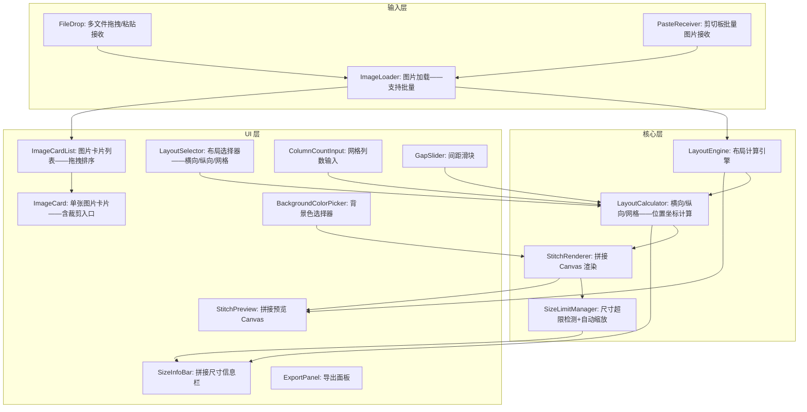

# YP-09-219: 图片拼接工具 — 横向/纵向/网格布局、可调间距与背景色、拖拽排序、导出单张图片

> 需求编号：YP-09-219 · 优先级：P2 · 人天：0.2d · 状态：需求已编写
> 依赖：YP-09-206（图片裁剪工具——共享 Canvas 渲染基类和导出逻辑）

## 背景

### 问题陈述

用户经常需要将多张图片拼接成一张（聊天记录截图拼接、产品展示图拼合、对比图并排）——但当前流程依赖外部工具或手动拼接：

1. **聊天记录拼接需求**：用户截图多段聊天记录——需要纵向拼接成一张长图——但无内置工具
2. **对比图需求**：需要将两张图并排对比（如设计稿 vs 实现效果）——需要手动在 PS 中拼接
3. **多图展示**：产品展示、教程步骤、旅拍拼图——需要网格布局——依赖第三方 App
4. **拼图参数调整困难**：间距太小图片挤在一起——背景颜色不协调——每次调整都需要重新操作
5. **排序不便**：添加图片后发现顺序错了——需要删除重新添加

**核心矛盾**：图片拼接是高频的图片组合需求——但浏览器中没有工具能直接完成。拼接工具提供横向/纵向/网格三种布局——拖拽排序——间距和背景可调——导出为单张图片。

### 影响范围

| # | 影响 | 严重程度 | 典型场景 |
|---|------|----------|----------|
| 1 | 多图拼接依赖外部工具 | 高 | 每次拼接聊天记录/对比图 |
| 2 | 布局切换需重建 | 中 | 从横向切换到纵向——需重新排列 |
| 3 | 间距和背景无法调整 | 中 | 图片挤在一起或间距过大 |
| 4 | 拖动排序不便 | 中 | 图片顺序错误——无法拖拽调整 |

### 挑战

| 挑战 | 说明 |
|------|------|
| 不同尺寸图片的布局计算 | 图片宽高不一——横向/纵向/网格布局需要统一的计算规则 |
| 网格布局的响应式处理 | 列数变化时——图片排列重新计算——保持宽高比 |
| 大图拼接的内存管理 | 多张 4K 图片拼接——Canvas 总尺寸可能超过浏览器限制（~16384px） |
| 拖拽排序的视觉反馈 | 拖拽图片卡片时——需要平滑的动画和占位符 |
| 导出超大拼接图 | 浏览器 Canvas 最大尺寸限制——超出时需要降级方案 |

---

## 一、现状分析

### 1.1 当前图片拼接流程

```
现有拼接方式:
├── 外部工具
│   ├── Photoshop: 新建画布→拖入图片→排列→导出——功能强但繁琐
│   ├── 美图秀秀: 拼图模板——固定模板——不够灵活
│   ├── 在线工具 (photojoiner.net): 上传→排列→下载——隐私风险
│   └── 步骤: 保存所有图片 → 打开工具 → 排列 → 导出 = 5+ 步
├── 浏览器原生能力
│   ├── Canvas API: drawImage 可将多张图片绘制到同一 Canvas
│   └── 无内置拼接 UI
├── YiPet 已有能力
│   ├── YP-09-206 图片裁剪: Canvas 渲染+导出
│   ├── YP-09-157 图片压缩: 尺寸调整+质量控制
│   └── Canvas 导出逻辑可复用

缺失:
├── 多图布局引擎（横向/纵向/网格）          # ❌ 无
├── 图片卡片拖拽排序                        # ❌ 无
├── 间距和背景色配置                        # ❌ 无
├── 布局预览                                # ❌ 无
├── 添加/删除图片管理                       # ❌ 无
└── 拼接图片导出                           # ❌ 无
```

### 1.2 拼接工作流（现状 vs 目标）

```mermaid
graph TD
    subgraph Current["现状：外部工具"]
        C1[保存多张图片] --> C2[打开拼接工具]
        C2 --> C3[导入图片——手动排列]
        C3 --> C4[设置布局参数]
        C4 --> C5[导出]
        C5 --> C6[可能需要调整——重复 C3-C5]
    end

    subgraph Target["目标：YiPet 内置拼接"]
        T1[多选图片/批量拖入] --> T2[选择布局: 横向/纵向/网格]
        T2 --> T3[预览拼接效果——Canvas 实时渲染]
        T3 --> T4[拖拽图片卡片调整顺序]
        T4 --> T5[调整间距/背景色/列数——实时预览]
        T5 --> T6{满意?}
        T6 -->|否| T3
        T6 -->|是| T7[导出拼接图片 PNG/JPEG]
        T7 --> T8[下载/剪切板/发送到聊天]
    end

    style Current fill:#f8d7da,stroke:#dc3545
    style Target fill:#d4edda,stroke:#28a745
```



### 1.3 根因矩阵

| 症状 | 根因 | 触发条件 | 频率 |
|------|------|----------|------|
| 拼接图片需要外部工具 | 无内置拼接功能 | 每次拼接 > 2 张图片 | 高 |
| 布局切换后需重建 | 无布局引擎 | 切换横向到网格时 | 中 |
| 图片顺序调整不便 | 无拖拽排序 | 添加图片顺序错了 | 中 |
| 间距/背景无法预览 | 无实时参数调整 | 调整美观度时 | 低 |

---

## 二、设计决策

### 决策 1：布局计算策略 — 统一缩放 vs 保持原尺寸 vs 自适应填充

| 选项 | 视觉效果 | 计算复杂度 | 适用场景 |
|------|---------|-----------|---------|
| 统一缩放（所有图片缩放到相同宽度/高度） | 整齐 | 低 | 纵向/横向排列 |
| 保持原尺寸（图片不缩放） | 自然 | 最低 | 仅尺寸接近的图片 |
| 自适应填充（短边对齐——长边等比例） | 最优 | 中 | 网格布局 |

**选择：自适应填充。** 横向布局：所有图片缩放到相同高度——宽度等比例。纵向布局：所有图片缩放到相同宽度——高度等比例。网格布局：所有图片缩放到相同尺寸——保持宽高比——使用 contain 填充。此策略在整齐度和自然感之间取得最佳平衡。

### 决策 2：拼接后处理方式 — 直接 Canvas 拼接 vs 先裁剪再拼接 vs 允许图片单独编辑

| 选项 | 灵活性 | 实现复杂度 | 0.2d 可行性 |
|------|--------|-----------|-------------|
| 直接拼接（原始图片） | 低 | 低 | 是 |
| 先裁剪再拼接 | 中 | 中 | 是（复用 YP-09-206 裁剪） |
| 允许每张图片单独编辑 | 高 | 高 | 否 |

**选择：直接拼接 + 可选裁剪。** 默认直接拼接原始图片。每张图片卡片提供 "裁剪" 入口——打开裁剪工具（复用 YP-09-206）——裁剪后返回更新拼接预览。此方式将裁剪作为可选增强——而非强制流程。

### 决策 3：拖拽排序实现 — HTML Drag & Drop vs 排序按钮 vs 触摸手势

| 选项 | 跨平台 | 视觉反馈 | 实现复杂度 |
|------|--------|---------|-----------|
| HTML Drag & Drop API | 好 | 好 | 中 |
| 排序按钮（上移/下移） | 好 | 低 | 低 |
| 触摸手势（移动端） | 仅移动端 | 好 | 高 |

**选择：HTML Drag & Drop API。** 原生 API——支持拖拽卡片到目标位置——视觉反馈（半透明拖动图像+插入指示线）。配合拖拽时的 CSS transition 平滑动画。支持桌面端主流浏览器——移动端降级为排序按钮。

### 决策 4：导出超限处理 — 限制拼接数量 vs 自动缩放 vs 错误提示

| 选项 | 用户体验 | 实现复杂度 |
|------|---------|-----------|
| 限制拼接数量（如最多 9 张 + 总像素 < 8192px） | 中（有时不够用） | 低 |
| 自动缩放（超出时统一缩小到安全尺寸） | 高（始终可用） | 中 |
| 错误提示（超出时提示用户——不给方案） | 低 | 最低 |

**选择：自动缩放。** 计算拼接后的总 Canvas 尺寸——如果超出浏览器限制（单边 > 8192px 或总面积 > 16384x16384）——按比例缩小所有图片直至符合限制。在工具栏中显示当前拼接尺寸和缩放比例——让用户知情。

### 设计决策记录

| 决策 | 选项 A | 选项 B | 选项 C | 选项 D | 选择 | 理由 |
|------|--------|--------|--------|--------|------|------|
| 布局计算 | 统一缩放 | 保持原尺寸 | 自适应填充 | — | **自适应填充** | 整齐+自然 |
| 后处理 | 直接拼接 | 先裁剪再拼接 | 独立编辑 | — | **直接+可选裁剪** | 简单+复用 |
| 拖拽排序 | Drag & Drop | 排序按钮 | 触摸手势 | — | **Drag & Drop** | 直观+反馈好 |
| 导出超限 | 限制数量 | 自动缩放 | 错误提示 | — | **自动缩放** | 用户友好 |

---

## 三、目标架构

### 3.1 拼接工具组件架构



### 3.2 布局计算逻辑

```mermaid
graph TD
    A[获取所有图片尺寸列表] --> B{布局模式?}
    B -->|横向| C[统一缩放：所有图片高度 = maxHeight]
    C --> D[计算每张图片宽度 = 原宽 * maxHeight/原高]
    D --> E[计算总宽度 = sum(宽度) + gap*(n-1) + padding*2]
    E --> F[逐张放置：drawImage at 累积 x 位置]
    
    B -->|纵向| G[统一缩放：所有图片宽度 = maxWidth]
    G --> H[计算每张图片高度 = 原高 * maxWidth/原宽]
    H --> I[计算总高度 = sum(高度) + gap*(n-1) + padding*2]
    I --> J[逐张放置：drawImage at 累积 y 位置]
    
    B -->|网格| K[统一缩放：每格尺寸 = canvasWidth/cols]
    K --> L[计算行数 = ceil(n/cols)]
    L --> M[按行列放置：drawImage at (col*gridW, row*gridH)]
    M --> N[图片在格内居中 contain]
```

### 3.3 性能指标

| 指标 | 目标值 | 说明 |
|------|--------|------|
| 10 张图加载+渲染 | < 200ms | Image.decode() 并行 |
| 布局切换响应 | < 30ms | 重新计算坐标+重绘 |
| 间距/背景调整 | < 16ms | 实时重绘 |
| 拖拽排序响应 | < 5ms | 更新顺序+重绘 |
| 拼接导出 (PNG) | < 500ms | toBlob 异步 |

---

## 四、具体改动

### 4.1 类型定义

```typescript
// src/image-stitch/types.ts (新增)

export type LayoutMode = 'horizontal' | 'vertical' | 'grid';

export interface StitchImage {
  id: string;
  image: HTMLImageElement;
  name: string;           // 文件名
  naturalWidth: number;
  naturalHeight: number;
  croppedWidth?: number;  // 裁剪后尺寸（如已裁剪）
  croppedHeight?: number;
}

export interface LayoutConfig {
  mode: LayoutMode;
  columns: number;        // 网格列数 (2-6)——仅 grid 模式
  gap: number;            // 图片间距 px (0-50)
  padding: number;        // 外边距 px (0-100)
  backgroundColor: string; // 背景色 HEX
  maxDimension: number;   // 最大边长限制 (16384)
}

export interface LayoutResult {
  totalWidth: number;
  totalHeight: number;
  scaleRatio: number;     // 超限时的缩放比例 (1.0 = 无缩放)
  placements: ImagePlacement[];
}

export interface ImagePlacement {
  imageId: string;
  x: number;
  y: number;
  width: number;
  height: number;
}

export const LAYOUT_PRESETS: Array<{ mode: LayoutMode; label: string; icon: string }> = [
  { mode: 'horizontal', label: '横向拼接', icon: '↔️' },
  { mode: 'vertical', label: '纵向拼接', icon: '↕️' },
  { mode: 'grid', label: '网格布局', icon: '⊞' },
];
```

### 4.2 布局计算核心

```typescript
// src/image-stitch/LayoutEngine.ts (新增)

export class LayoutEngine {
  private config: LayoutConfig = {
    mode: 'vertical', columns: 3, gap: 8, padding: 16,
    backgroundColor: '#FFFFFF', maxDimension: 8192
  };

  /** 计算布局——返回每张图片的放置位置和最终 Canvas 尺寸 */
  calculate(images: StitchImage[]): LayoutResult {
    switch (this.config.mode) {
      case 'horizontal': return this.calculateHorizontal(images);
      case 'vertical': return this.calculateVertical(images);
      case 'grid': return this.calculateGrid(images);
    }
  }

  private calculateHorizontal(images: StitchImage[]): LayoutResult {
    // 1. 找到最大高度——所有图片缩放到该高度
    // 2. 每张图宽度 = 原宽 * (maxHeight / 原高)
    // 3. x 位置累加——考虑 gap
    // 4. 计算总宽高——检查是否超限——超限则按比例缩小
  }

  private calculateVertical(images: StitchImage[]): LayoutResult {
    // 类似 horizontal——但使用最大宽度对齐
  }

  private calculateGrid(images: StitchImage[]): LayoutResult {
    const cols = this.config.columns;
    const rows = Math.ceil(images.length / cols);
    // 1. 每格尺寸 = 可用宽度 / cols
    // 2. 图片在格内 contain 缩放
    // 3. 逐格放置
  }

  /** 检查并处理尺寸超限 */
  private checkSizeLimit(width: number, height: number): number {
    const maxDim = this.config.maxDimension;
    const scaleX = width > maxDim ? maxDim / width : 1;
    const scaleY = height > maxDim ? maxDim / height : 1;
    return Math.min(scaleX, scaleY);
  }

  /** 渲染拼接到目标 Canvas */
  render(targetCtx: CanvasRenderingContext2D, images: StitchImage[], layout: LayoutResult): void {
    const { totalWidth, totalHeight, placements, scaleRatio } = layout;
    
    // 设置 Canvas 尺寸
    targetCtx.canvas.width = totalWidth;
    targetCtx.canvas.height = totalHeight;
    
    // 填充背景色
    targetCtx.fillStyle = this.config.backgroundColor;
    targetCtx.fillRect(0, 0, totalWidth, totalHeight);
    
    // 逐张绘制
    for (const placement of placements) {
      const img = images.find(i => i.id === placement.imageId);
      if (!img) continue;
      targetCtx.drawImage(img.image, placement.x, placement.y, placement.width, placement.height);
    }
  }
}
```

### 4.3 文件变更清单

| 文件 | 操作 | 说明 |
|------|------|------|
| `src/image-stitch/types.ts` | 新增 | 拼接工具类型定义+预设 |
| `src/image-stitch/LayoutEngine.ts` | 新增 | 三种布局计算+渲染引擎 |
| `src/image-stitch/SizeLimitManager.ts` | 新增 | 尺寸超限检测+自动缩放 |
| `src/components/StitchTool.vue` | 新增 | 拼接工具主面板 |
| `src/components/ImageCardList.vue` | 新增 | 图片卡片列表+拖拽排序 |
| `src/components/StitchConfigPanel.vue` | 新增 | 布局/间距/背景配置面板 |
| `src/components/StitchPreview.vue` | 新增 | 拼接预览 Canvas |
| `src/composables/useImageStitch.ts` | 新增 | 拼接状态管理 composable |
| `src/popup/App.vue` | 修改 | 添加入口 |

---

## 五、实施步骤

| 步骤 | 操作 | 路径 | 验证 | 人天 |
|------|------|------|------|------|
| 1 | 类型定义+布局预设 | `types.ts` | 3 种布局模式枚举——配置默认值正确 | 0.01 |
| 2 | 横向/纵向布局计算 | `LayoutEngine.ts` | 3 张图横向拼接——宽度相加+间距正确 | 0.03 |
| 3 | 网格布局计算 | `LayoutEngine.ts` | 2x2/3x3 网格——定位坐标正确 | 0.03 |
| 4 | 尺寸超限检测+自动缩放 | `SizeLimitManager.ts` | 10 张 4K 图拼接——自动缩小到安全尺寸 | 0.02 |
| 5 | 图片卡片列表+拖拽排序 | `ImageCardList.vue` | HTML Drag & Drop 拖拽排序——重排后预览更新 | 0.03 |
| 6 | 配置面板——布局/间距/背景 | `StitchConfigPanel.vue` | 参数调整实时反映到预览 | 0.03 |
| 7 | 预览 Canvas+导出 | `StitchPreview.vue` | 完整拼接流程——导出 PNG/JPEG | 0.03 |

**总人天：0.20d**

---

## 六、测试规格

### 场景 1：横向拼接

**GIVEN** 用户打开拼接工具——拖入 3 张不同尺寸的图片（1920x1080, 800x600, 1200x900）
**WHEN** 选择 "横向拼接" 布局
**THEN** Canvas 预览显示 3 张图片从左到右排列——高度统一为最大高度 (1080px)
**AND** 宽度分别等比缩放——图片间有 8px 间距
**AND** 总宽度正确显示在信息栏

### 场景 2：纵向拼接

**GIVEN** 3 张图片——尺寸不一致
**WHEN** 切换到 "纵向拼接"
**THEN** 图片从上到下排列——宽度统一为最大宽度
**AND** 高度等比缩放
**WHEN** 调整间距为 20px
**THEN** 图片间距离增大——总高度相应增加

### 场景 3：网格布局

**GIVEN** 7 张图片
**WHEN** 选择 "网格布局"——列数设为 3
**THEN** 图片排列为 3 行（3+3+1）——每格等大
**WHEN** 调整列数为 2
**THEN** 图片排列为 4 行（2+2+2+1）——格子更大
**WHEN** 调整间距为 4px
**THEN** 格子间距缩小——拼贴更紧凑

### 场景 4：拖拽排序

**GIVEN** 5 张图片——编号 1-5
**WHEN** 将图片 5 拖拽到图片 1 和图片 2 之间
**THEN** 卡片列表顺序变为 1, 5, 2, 3, 4
**AND** 预览 Canvas 实时更新——图片 5 显示在图片 1 之后
**WHEN** 将图片 3 拖到末尾
**THEN** 顺序变为 1, 5, 2, 4, 3

### 场景 5：背景色与间距

**GIVEN** 拼接预览中——默认白色背景
**WHEN** 修改背景色为 #333333（深灰）
**THEN** 图片周围（间距+外边距）变为深灰色
**WHEN** 将间距设为 0——外边距设为 0
**THEN** 图片紧密拼接——无任何间隙

### 场景 6：导出拼接图片

**GIVEN** 拼接完成——横向拼接 3 张图——总尺寸 3000x1080
**WHEN** 点击导出 PNG
**THEN** 导出的 PNG 图片尺寸为 3000x1080——包含所有图片和背景
**WHEN** 选择 JPEG 导出
**THEN** JPEG 图片背景色正确（白色/灰色）——无透明区域
**WHEN** 点击复制到剪切板
**THEN** 剪切板中的图片与预览一致

---

## 七、风险与缓解

| 风险 | 概率 | 影响 | 缓解措施 |
|------|------|------|----------|
| 多张 4K 图拼接超过 Canvas 尺寸限制 | 中 | 高 | 自动缩放——总尺寸控制在 8192px 内——信息栏显示缩放比例 |
| 大图拼接导致内存不足 | 低 | 高 | 限制同时拼接图片数量为 20 张——总像素 < 100MP |
| 不同图片方向不一致——拼接后效果差 | 中 | 低 | 提供每张图片的旋转入口（可复用 YP-09-206 旋转）——可选 |
| 拖拽排序在 Firefox 上行为差异 | 低 | 低 | HTML Drag & Drop 是跨浏览器标准——在 Chrome/Firefox/Edge 上验证 |
| 网格布局中图片比例差异大——格子太空 | 中 | 低 | 网格内使用 contain 模式——多出的空间用背景色填充 |

---

## 八、回滚策略

| 场景 | 回滚操作 | 影响 |
|------|------|------|
| 尺寸超限处理异常（自动缩放过度或不足） | 禁用自动缩放——限制为 5 张 + 总像素 < 窡 | 大图拼接受限 |
| 布局计算错误（图片重叠或越界） | 降级为仅纵向拼接——禁用横向和网格 | 功能退化到最基本 |
| 拖拽排序导致预览状态不一致 | 降级为排序按钮（上移/下移） | 拖拽体验丧失 |
| 完全移除 | 隐藏入口——移除拼接组件 | 功能不可用 |

---

## 九、设计决策记录

### D-01：为什么自适应填充而非所有图片统一尺寸？

如果所有图片强制统一尺寸——16:9 的横图会被拉伸或裁剪成 1:1——破坏内容。自适应填充按比例缩放——横图保持 16:9——方图保持 1:1——仅以最长边对齐——视觉上更自然。

### D-02：为什么最大尺寸设为 8192px 而非浏览器的实际限制 (~16384px)？

浏览器的 Canvas 最大尺寸在不同设备上差异大——低端设备（手机/旧笔记本）可能只有 4096px。8192px 在 95% 的设备上可用——且导出 8192x8192 的 PNG 约 200MB——本身就不适合传输。8192px 作为保守上限平衡了适用性和安全性。

### D-03：为什么网格布局的列数上限为 6？

超过 6 列的网格——在 800px 宽度的面板中——每格宽度 < 130px——图片太小无法辨识。6 列已满足绝大多数拼贴需求（2x3/3x3/3x4 等）。

### D-04：为什么拖拽排序使用 HTML Drag & Drop 而非第三方库（如 sortablejs）？

HTML Drag & Drop 是零依赖的原生 API——在 0.2d 预算内——不需要引入外部库增加 ~30KB 打包体积。对于 20 张以内的图片列表排序——原生 API 完全够用。若后续需要更复杂的动画——可迁移到 sortablejs。

---

## 十、可观测性

### 指标

| 指标 | 类型 | 说明 |
|------|------|------|
| `yipet.stitch.open_total` | Counter | 拼接工具打开次数 |
| `yipet.stitch.layout_used` | Counter (label: horizontal/vertical/grid) | 布局模式使用分布 |
| `yipet.stitch.image_count` | Histogram | 每次拼接图片数量 |
| `yipet.stitch.gap_setting` | Histogram | 间距设置值分布 |
| `yipet.stitch.background_changed` | Counter | 背景色修改次数 |
| `yipet.stitch.reorder_total` | Counter | 拖拽排序次数 |
| `yipet.stitch.export_total` | Counter | 导出次数 |
| `yipet.stitch.final_size` | Histogram | 最终拼接尺寸分布 |

---

## 十一、代码审查检查清单

- [ ] LayoutEngine: 横向布局——图片宽度计算使用 Math.round——避免浮点精度导致 1px 间隙
- [ ] LayoutEngine: 网格布局——最后一行的空列正确处理——不绘制越界
- [ ] SizeLimitManager: 自动缩放比例计算——宽高分别计算缩放比——取更小值——确保两侧都不超限
- [ ] SizeLimitManager: 超限警告信息同时显示原始尺寸和目标尺寸——让用户了解缩放情况
- [ ] ImageCardList: 拖拽时使用 `dragover` 事件计算插入位置——`dataTransfer.effectAllowed = 'move'`
- [ ] ImageCardList: 拖拽结束后释放 `dataTransfer`——清理 drag 状态
- [ ] StitchPreview: Canvas 尺寸变化时——需要先设置 width/height 属性再绘制——否则 Canvas 内容被清除
- [ ] 导出: 导出前确保所有 Image 都已 load——使用 `Promise.all(images.map(i => i.decode()))` 等待解码
- [ ] useImageStitch: 图片列表保持 Image 对象引用——避免重复加载——移除时释放引用

---

## 回归问题预测

| # | 预测问题 | 原因 | 验证方法 |
|---|---------|------|---------|
| 1 | 网格布局最后一行图片左对齐而非居中——视觉效果不佳 | 布局计算只考虑了从左上角开始的简单排列——未处理单行居中 | 7 张图 3 列网格——验证最后一行 1 张图居中排列 |
| 2 | 切换布局模式后——Canvas 尺寸变化——但旧 Canvas 内容未清除 | Canvas width/height 设新值但未重新 fillRect 背景 | 从横向切换到纵向——验证无旧残留图像 |
| 3 | 自动缩放后——图片位置坐标仍使用原始间距——导致图片越界 | 缩放比例仅应用于图片尺寸——未应用于间距和 padding | 拼接 10 张 4K 图——自动缩放触发——验证间距也按比例缩小 |
| 4 | 导出时 JPEG 背景色受有损压缩影响——颜色偏移 | JPEG 压缩可能导致纯色背景出现色块 | 导出 JPEG 后——验证背景色与设置值偏差 < 5% |
| 5 | 拖拽排序后——预览 Canvas 未更新——图片顺序仍为旧顺序 | 拖拽更新了卡片列表顺序——但未触发预览重绘 | 拖拽任意图片——验证预览 Canvas 立即更新 |
| 6 | 图片加载失败（跨域/404）——其余图片仍正常拼接 | 单张图片加载异常不应阻塞整个拼接流程 | 混合有效 URL 和无效 URL——验证有效图片正确拼接——无效图片显示占位符 |

---

## 性能分析

### 各操作耗时

| 操作 | 5 张图 | 10 张图 | 20 张图 | 说明 |
|------|--------|---------|---------|------|
| 图片加载 (并行) | < 200ms | < 400ms | < 800ms | Image.decode() |
| 布局计算 | < 1ms | < 2ms | < 3ms | 纯数学计算 |
| Canvas 渲染 | < 20ms | < 40ms | < 100ms | 10 次 drawImage |
| 拖拽排序→重绘 | < 20ms | < 40ms | < 100ms | 全量重绘 |
| 切换布局模式 | < 20ms | < 40ms | < 100ms | 重计算+重绘 |
| 导出 (PNG, 3000px 宽) | < 200ms | < 400ms | < 800ms | toBlob 异步 |

### 内存预估

| 组件 | 5 张 1920x1080 | 10 张 1920x1080 |
|------|---------------|-----------------|
| 图片 ImageData | ~28MB | ~56MB |
| 主 Canvas | ~16MB | ~32MB |
| 导出 Canvas | ~16MB | ~32MB |
| UI 状态 | ~2KB | ~4KB |
| **总计** | **~60MB** | **~120MB** |

### 代码体积

| 文件 | 大小 |
|------|------|
| types.ts | ~2KB |
| LayoutEngine.ts | ~8KB |
| SizeLimitManager.ts | ~2KB |
| Vue 组件 (4 个) | ~10KB |
| useImageStitch.ts | ~3KB |
| **总计** | **~25KB** |