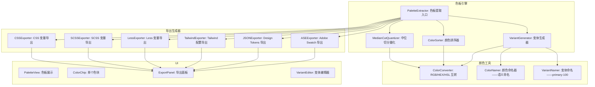
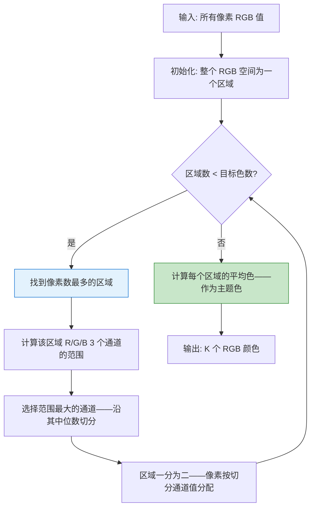

# YP-09-243: 图片色板导出 — 从图片提取色板、CSS/SCSS/Less/Tailwind/JSON/Adobe-Swatch 导出、命名颜色、复制色值

> 需求编号：YP-09-243 · 优先级：P2 · 人天：0.2d · 状态：需求已编写
> 依赖：YP-09-203（Canvas 像素读取——提取颜色）、YP-09-226（图片信息查看器——图片色彩空间信息）

## 背景

### 问题陈述

设计师和前端开发者经常需要从图片中提取配色方案——从 UI 设计稿提取品牌色——从摄影作品获取视觉参考——从插画提取主色调。当前工作流是使用 Photoshop 或在线工具提取颜色——然后在代码中手动编写 CSS 变量：

1. **提取效率低**：设计师用吸管工具逐色吸取——一张图片 10 个颜色——需要 10 次操作——然后手动记录色值
2. **导出到代码繁琐**：手动将色值从 RGB 转为 CSS/SCSS 变量格式——`--color-primary: #3A7BD5;`——重复劳动且容易出错
3. **配色方案不完整**：吸管工具只记录单个颜色——缺少暗色/亮色变体——设计师需要手动调整亮度/饱和度生成色阶
4. **格式不统一**：团队中使用 CSS 变量、SCSS 变量、Tailwind 配置——需要为不同项目手动转换格式
5. **颜色命名随意**：手动命名颜色——`color1`、`color2`——缺乏语义——维护困难

**核心矛盾**：颜色提取本身很简单（读取像素值）——但颜色的"可用性"取决于能否方便地导入到各种设计工具和代码框架中。色板导出的核心价值在于**格式转换**——从像素数据到 CSS 变量、SCSS map、Tailwind config、JSON design tokens、Adobe Swatch——一站式覆盖所有输出格式。

### 影响范围

| # | 影响 | 严重程度 | 典型场景 |
|---|------|----------|----------|
| 1 | 颜色提取效率低——多色需多次操作 | 高 | 10 色色板——手动取色 10 次——记录 10 次 |
| 2 | 代码格式转换手动——易出错 | 高 | RGB(58,123,213) → `--color: #3A7BD5`——手写易错 |
| 3 | 变色/暗色变体手动计算 | 中 | 主色 → lighter/darker——HSL 调整 |
| 4 | 多格式需求——重复劳动 | 中 | CSS 变量 + SCSS 变量 + Tailwind——三套 |
| 5 | 颜色命名无规范 | 中 | color1/color2 → 语义命名 primary/secondary |

### 挑战

| 挑战 | 说明 |
|------|------|
| 颜色提取算法选择 | K-means 聚类提取主题色 vs 中位切分 vs 八叉树——不同算法结果不同 |
| 颜色数量自动确定 | 图片可能只有 2 种主色——也可能有 20 种——如何自动确定色板大小 |
| 颜色排序 | 提取的颜色需要合理排序——按色相/饱和度/亮度——让色板看起来协调 |
| 暗色/亮色变体生成 | 主色派生出 lighter/darker 变体——需要 HSL 调整——保持视觉和谐 |
| Adobe Swatch 格式 | .ASE (Adobe Swatch Exchange) 格式是二进制的——需要在浏览器端生成 |

---

## 一、现状分析

### 1.1 当前色彩提取能力

```
现有色彩提取相关能力:
├── Canvas getImageData——读取像素
│   ├── 获取单像素 RGB ✅
│   └── 遍历全图像素——性能可接受 ✅
├── 颜色格式转换——RGB/HEX/HSL
│   └── ❌ 无——无统一转换工具
├── 色板提取
│   └── ❌ 无——无聚类/量化算法
├── 色板导出
│   └── ❌ 无——无代码格式生成
├── 颜色变体生成
│   └── ❌ 无——无 HSL 调整工具

缺失:
├── 颜色量化/聚类算法                              # ❌ 无
├── 色板提取——主色/辅色/强调色                      # ❌ 无
├── 色板显示——色块列表                              # ❌ 无
├── CSS 变量格式导出                                # ❌ 无
├── SCSS/Less 变量格式导出                          # ❌ 无
├── Tailwind 配置格式导出                           # ❌ 无
├── JSON Design Tokens 导出                         # ❌ 无
├── Adobe Swatch (.ASE) 导出                        # ❌ 无
├── 颜色命名编辑                                    # ❌ 无
├── 暗色/亮色派生变体                               # ❌ 无
└── 一键复制/导出                                   # ❌ 无
```

### 1.2 色板提取流程

```mermaid
graph TD
    A[加载图片] --> B[获取像素数据——getImageData]
    B --> C[颜色量化——减少颜色数量]
    C --> D{量化算法}
    D -->|K-Means 聚类| E1[迭代分组——K 个中心色]
    D -->|中位切分| E2[递归按最大范围切分 RGB 空间]
    D -->|八叉树| E3[树结构——合并相近颜色]
    E1 --> F[提取 K 个主题色]
    E2 --> F
    E3 --> F
    F --> G[颜色排序——按色相/饱和度/亮度]
    G --> H[生成色板——主色 + 变体]
    H --> I[用户编辑——命名/调整/删除/排序]
    I --> J{选择导出格式}
    J -->|CSS| K1[--color-name: #HEX;]
    J -->|SCSS| K2[$color-name: #HEX;]
    J -->|Tailwind| K3[colors: { name: '#HEX' }]
    J -->|JSON| K4[{ "name": { "value": "#HEX" } }]
    J -->|ASE| K5[Adobe Swatch 二进制文件]

    style F fill:#c8e6c9,stroke:#388e3c
    style J fill:#e3f2fd,stroke:#1976d2
```

### 1.3 根因矩阵

| 症状 | 根因 | 触发条件 | 频率 |
|------|------|----------|------|
| 色板提取耗时 | 无自动化——手动取色 | 需要 5+ 个颜色的色板 | 高 |
| 代码格式转换出错 | 手动 HEX/RGB 转换 | RGB(58,123,213) → #3A7BD5 | 高 |
| 多格式重复工作 | 无一次配置——到处导出 | CSS 项目 + SCSS 项目 + Tailwind 项目 | 中 |
| 颜色命名不统一 | 无命名规范——手动输入 | 团队协作——color1 vs primary | 中 |
| Adobe Swatch 导出不可用 | 浏览器端无 ASE 生成库 | 设计师需导入 Photoshop/Illustrator | 中 |

---

## 二、设计决策

### 决策 1：颜色提取算法 — K-Means vs 中位切分 vs 八叉树

| 选项 | 结果质量 | 速度 | 实现复杂度 | 颜色数量控制 |
|------|---------|------|-----------|------------|
| K-Means 聚类 | 最高（视觉最优） | 中（需迭代） | 中 | 精确（K 可配置） |
| 中位切分（Median Cut） | 中 | 快 | 低 | 精确（2^n） |
| 八叉树（Octree） | 中 | 最快 | 高 | 不精确（树深度控制） |

**选择：中位切分——预设 16-32 色——用户选择保留 K 个。** 中位切分算法将 RGB 色彩空间递归切分——直到得到 2^n 个颜色——速度快（O(n) 单次遍历 vs K-Means 的 O(n*K*迭代)）——结果质量对于 UI 设计稿完全够用。用户可调整保留的颜色数量（4/8/16/32）——超过 16 色的色板通常不实用。

### 决策 2：颜色变体生成 — 固定步长 vs HSL 等距 vs 手动自定义

| 选项 | 视觉和谐度 | 灵活性 | 实现 |
|------|-----------|--------|------|
| 固定步长（亮度 ±10%——生成 5 级） | 中 | 低 | 低 |
| HSL 等距（亮度从 10% 到 90%——等距 5 级） | 高 | 中 | 低 |
| 手动自定义（用户输入每级变体） | 最高 | 最高 | 中 |

**选择：HSL 等距——每个主色自动生成 5 级变体（50/100/200/300/400）——用户可手动调整。** 自动生成降低用户操作——HSL 等距确保视觉和谐。前缀自动命名——`primary-100`、`primary-200`...。用户可手动编辑单个变体的色值——满足精确调整需求。

### 决策 3：导出格式优先级 — 全格式 vs 仅 CSS+JSON vs 用户选择

| 选项 | 覆盖用户 | 维护成本 | 实现 |
|------|---------|---------|------|
| 全格式（CSS/SCSS/Less/Tailwind/JSON/ASE） | 最高 | 中（6 个生成器） | 中 |
| 仅 CSS + JSON | 70% | 低 | 最低 |
| 用户选择——按需添加格式 | 高 | 中 | 中 |

**选择：全格式——6 种导出格式。** 每种格式的生成器都很简单（~20 行代码）——最大复杂度在 ASE 二进制格式。YiPet 的目标用户是设计师和前端开发者——CSS/SCSS/Less/Tailwind 覆盖主流前端框架——JSON 用于 Design Tokens——ASE 用于 Adobe 工具链。6 种格式一次性实现——维护成本低。

### 决策 4：颜色排序策略 — 按像素占比 vs 按色相 vs 按亮度

| 选项 | 视觉协调 | 语义清晰 | 稳定性 |
|------|---------|---------|--------|
| 按像素占比（最常用的排前面） | 低 | 高 | 低（不同图片不同排序） |
| 按色相（彩虹顺序） | 最高 | 中 | 高 |
| 按亮度（暗到亮） | 中 | 中 | 中 |

**选择：默认按色相排序——用户可拖拽手动排序。** 色相排序让色板看起来像彩虹——视觉上最协调——设计师熟悉这种排列。高级用户可拖拽色块调整顺序——控制导出的变量顺序。像素占比作为辅助信息——每个色块标注占比百分比。

### 设计决策记录

| 决策 | 选项 A | 选项 B | 选项 C | 选择 | 理由 |
|------|--------|--------|--------|------|------|
| 提取算法 | K-Means | 中位切分 | 八叉树 | **中位切分** | 快速+够用 |
| 颜色变体 | 固定步长 | HSL 等距 | 手动 | **HSL 等距+手动** | 自动化+灵活 |
| 导出格式 | 全格式 | CSS+JSON | 按需 | **全格式** | 覆盖全+维护低 |
| 颜色排序 | 像素占比 | 色相 | 亮度 | **色相+可拖拽** | 视觉协调 |

---

## 三、目标架构

### 3.1 色板导出引擎架构



### 3.2 中位切分算法



### 3.3 性能指标

| 指标 | 目标值 | 说明 |
|------|--------|------|
| 中位切分——800x600——16 色 | < 100ms | 遍历像素 + 递归切分 |
| 中位切分——2000x1500——16 色 | < 300ms | 大图像素多 |
| 变体生成——16 色 × 5 级 = 80 色 | < 10ms | HSL 计算 |
| 格式导出——单个方案 | < 5ms | 字符串拼接 |
| ASE 二进制生成——16 色 | < 10ms | 二进制写入 |

---

## 四、具体改动

### 4.1 中位切分量化和色板提取

```typescript
// src/utils/palette/extractor.ts（新增）

export interface PaletteColor {
  hex: string;
  rgb: { r: number; g: number; b: number };
  hsl: { h: number; s: number; l: number };
  name: string;
  percentage: number;      // 像素占比——0-100
  variants?: PaletteColor[]; // 变体列表
}

interface RGBBox {
  pixels: Array<{ r: number; g: number; b: number; count: number }>;
  rMin: number; rMax: number;
  gMin: number; gMax: number;
  bMin: number; bMax: number;
}

export class PaletteExtractor {
  /**
   * 从图片提取色板
   */
  extractFromImage(
    imageData: ImageData,
    colorCount: number = 8,
    generateVariants: boolean = true,
  ): PaletteColor[] {
    // 1. 采样——每 N 个像素取 1 个——提升性能
    const pixels = this.samplePixels(imageData, 4);

    // 2. 中位切分量化
    const quantizedColors = this.medianCut(pixels, colorCount);

    // 3. 转换为统一颜色对象
    const palette = quantizedColors.map((c, i) => ({
      hex: this.rgbToHex(c.r, c.g, c.b),
      rgb: { r: c.r, g: c.g, b: c.b },
      hsl: this.rgbToHsl(c.r, c.g, c.b),
      name: `color-${i + 1}`,
      percentage: c.percentage,
    }));

    // 4. 按色相排序
    palette.sort((a, b) => a.hsl.h - b.hsl.h);

    // 5. 生成变体
    if (generateVariants) {
      for (const color of palette) {
        color.variants = this.generateVariants(color);
      }
    }

    return palette;
  }

  private samplePixels(imageData: ImageData, step: number): Array<{ r: number; g: number; b: number }> {
    const pixels: Array<{ r: number; g: number; b: number }> = [];
    const data = imageData.data;

    for (let i = 0; i < data.length; i += step * 4) {
      pixels.push({
        r: data[i],
        g: data[i + 1],
        b: data[i + 2],
      });
    }
    return pixels;
  }

  private medianCut(
    pixels: Array<{ r: number; g: number; b: number }>,
    colorCount: number,
  ): Array<{ r: number; g: number; b: number; percentage: number }> {
    const totalPixels = pixels.length;

    // 初始区域——整个 RGB 空间
    const boxes: RGBBox[] = [{
      pixels: this.packPixels(pixels),
      rMin: 0, rMax: 255,
      gMin: 0, gMax: 255,
      bMin: 0, bMax: 255,
    }];

    // 迭代切分直到达到目标色数
    while (boxes.length < colorCount) {
      // 找到像素数最多的区域
      const boxIndex = this.findLargestBox(boxes);
      if (boxIndex < 0) break;

      const box = boxes[boxIndex];
      if (box.pixels.length <= 1) break;

      // 计算各通道范围
      const rRange = box.rMax - box.rMin;
      const gRange = box.gMax - box.gMin;
      const bRange = box.bMax - box.bMin;

      // 找到范围最大的通道
      let channel: 'r' | 'g' | 'b' = 'r';
      if (gRange >= rRange && gRange >= bRange) channel = 'g';
      else if (bRange >= rRange && bRange >= gRange) channel = 'b';

      // 按该通道排序
      box.pixels.sort((a, b) => a[channel] - b[channel]);

      // 在中位数处切分
      const medianIndex = Math.floor(box.pixels.length / 2);
      const leftPixels = box.pixels.slice(0, medianIndex);
      const rightPixels = box.pixels.slice(medianIndex);

      // 计算新区域的边界
      const leftBox = this.createBox(leftPixels);
      const rightBox = this.createBox(rightPixels);

      // 替换原区域
      boxes.splice(boxIndex, 1, leftBox, rightBox);
    }

    // 计算每个区域的平均色
    return boxes.map(box => {
      let rSum = 0, gSum = 0, bSum = 0, total = 0;
      for (const p of box.pixels) {
        const count = (p as any).count || 1;
        rSum += p.r * count;
        gSum += p.g * count;
        bSum += p.b * count;
        total += count;
      }
      const count = box.pixels.reduce((s, p) => s + ((p as any).count || 1), 0);
      return {
        r: Math.round(rSum / count),
        g: Math.round(gSum / count),
        b: Math.round(bSum / count),
        percentage: Math.round((count / totalPixels) * 10000) / 100,
      };
    });
  }

  private packPixels(pixels: Array<{ r: number; g: number; b: number }>): RGBBox['pixels'] {
    const map = new Map<string, { r: number; g: number; b: number; count: number }>();
    for (const p of pixels) {
      const key = `${p.r},${p.g},${p.b}`;
      if (map.has(key)) map.get(key)!.count++;
      else map.set(key, { ...p, count: 1 });
    }
    return Array.from(map.values());
  }

  private findLargestBox(boxes: RGBBox[]): number {
    let maxCount = 0;
    let maxIndex = -1;
    for (let i = 0; i < boxes.length; i++) {
      const count = boxes[i].pixels.reduce((s, p) => s + ((p as any).count || 1), 0);
      if (count > maxCount) { maxCount = count; maxIndex = i; }
    }
    return maxIndex;
  }

  private createBox(pixels: RGBBox['pixels']): RGBBox {
    let rMin = 255, rMax = 0, gMin = 255, gMax = 0, bMin = 255, bMax = 0;
    for (const p of pixels) {
      rMin = Math.min(rMin, p.r); rMax = Math.max(rMax, p.r);
      gMin = Math.min(gMin, p.g); gMax = Math.max(gMax, p.g);
      bMin = Math.min(bMin, p.b); bMax = Math.max(bMax, p.b);
    }
    return { pixels, rMin, rMax, gMin, gMax, bMin, bMax };
  }

  generateVariants(color: PaletteColor): PaletteColor[] {
    const hsl = color.hsl;
    const levels = [50, 100, 200, 300, 400, 500, 600, 700, 800, 900];
    // 找到当前颜色最接近的级别作为 500
    const baseIndex = 5; // 500 是基准

    return levels.map((level, i) => {
      const l = 90 - (i / (levels.length - 1)) * 80; // 50=90%, 900=10%
      const newRgb = this.hslToRgb(hsl.h, hsl.s, l);
      return {
        hex: this.rgbToHex(newRgb.r, newRgb.g, newRgb.b),
        rgb: newRgb,
        hsl: { h: hsl.h, s: hsl.s, l },
        name: `${color.name}-${level}`,
        percentage: 0,
      };
    });
  }

  // 颜色格式转换
  rgbToHex(r: number, g: number, b: number): string {
    return '#' + [r, g, b].map(x => x.toString(16).padStart(2, '0')).join('');
  }

  rgbToHsl(r: number, g: number, b: number): { h: number; s: number; l: number } {
    r /= 255; g /= 255; b /= 255;
    const max = Math.max(r, g, b), min = Math.min(r, g, b);
    let h = 0, s = 0;
    const l = (max + min) / 2;

    if (max !== min) {
      const d = max - min;
      s = l > 0.5 ? d / (2 - max - min) : d / (max + min);
      switch (max) {
        case r: h = ((g - b) / d + (g < b ? 6 : 0)) / 6; break;
        case g: h = ((b - r) / d + 2) / 6; break;
        case b: h = ((r - g) / d + 4) / 6; break;
      }
    }

    return { h: Math.round(h * 360), s: Math.round(s * 100), l: Math.round(l * 100) };
  }

  hslToRgb(h: number, s: number, l: number): { r: number; g: number; b: number } {
    h /= 360; s /= 100; l /= 100;
    let r: number, g: number, b: number;

    if (s === 0) {
      r = g = b = l;
    } else {
      const hue2rgb = (p: number, q: number, t: number) => {
        if (t < 0) t += 1;
        if (t > 1) t -= 1;
        if (t < 1/6) return p + (q - p) * 6 * t;
        if (t < 1/2) return q;
        if (t < 2/3) return p + (q - p) * (2/3 - t) * 6;
        return p;
      };
      const q = l < 0.5 ? l * (1 + s) : l + s - l * s;
      const p = 2 * l - q;
      r = hue2rgb(p, q, h + 1/3);
      g = hue2rgb(p, q, h);
      b = hue2rgb(p, q, h - 1/3);
    }

    return { r: Math.round(r * 255), g: Math.round(g * 255), b: Math.round(b * 255) };
  }
}
```

### 4.2 导出格式生成器

```typescript
// src/utils/palette/exporters.ts（新增）

export function exportCSS(palette: PaletteColor[]): string {
  const lines = [':root {'];
  for (const color of palette) {
    lines.push(`  --${color.name}: ${color.hex};`);
    if (color.variants) {
      for (const v of color.variants) {
        lines.push(`  --${v.name}: ${v.hex};`);
      }
    }
  }
  lines.push('}');
  return lines.join('\n');
}

export function exportSCSS(palette: PaletteColor[]): string {
  const lines: string[] = [];
  for (const color of palette) {
    lines.push(`$${color.name}: ${color.hex};`);
    if (color.variants) {
      for (const v of color.variants) {
        lines.push(`$${v.name}: ${v.hex};`);
      }
    }
  }
  return lines.join('\n');
}

export function exportLess(palette: PaletteColor[]): string {
  const lines: string[] = [];
  for (const color of palette) {
    lines.push(`@${color.name}: ${color.hex};`);
    if (color.variants) {
      for (const v of color.variants) {
        lines.push(`@${v.name}: ${v.hex};`);
      }
    }
  }
  return lines.join('\n');
}

export function exportTailwind(palette: PaletteColor[]): string {
  const colors: Record<string, any> = {};
  for (const color of palette) {
    if (color.variants) {
      colors[color.name] = {};
      for (const v of color.variants) {
        const level = v.name.split('-').pop()!;
        colors[color.name][level] = v.hex;
      }
    } else {
      colors[color.name] = color.hex;
    }
  }
  return `// tailwind.config.js\nmodule.exports = {\n  theme: {\n    extend: {\n      colors: ${JSON.stringify(colors, null, 6).replace(/"(\w+)":/g, '$1:')}\n    }\n  }\n}`;
}

export function exportJSON(palette: PaletteColor[]): string {
  const tokens: Record<string, any> = {};
  for (const color of palette) {
    tokens[color.name] = {
      value: color.hex,
      type: 'color',
      rgb: color.rgb,
      percentage: color.percentage,
    };
    if (color.variants) {
      tokens[color.name].variants = {};
      for (const v of color.variants) {
        tokens[color.name].variants[v.name.split('-').pop()!] = {
          value: v.hex,
          type: 'color',
        };
      }
    }
  }
  return JSON.stringify(tokens, null, 2);
}

// Adobe Swatch Exchange (.ASE) 二进制格式
export function exportASE(palette: PaletteColor[]): Uint8Array {
  const encoder = new TextEncoder();

  // ASE 文件头
  const header = encoder.encode('ASEF');
  const version = new Uint8Array([0x00, 0x01, 0x00, 0x00]); // version 1.0
  const colorCount = new Uint8Array(4);
  const count = palette.length + palette.reduce((s, c) => s + (c.variants?.length || 0), 0);
  colorCount[0] = (count >> 24) & 0xFF;
  colorCount[1] = (count >> 16) & 0xFF;
  colorCount[2] = (count >> 8) & 0xFF;
  colorCount[3] = count & 0xFF;

  const parts: Uint8Array[] = [header, version, colorCount];

  const addColorBlock = (hex: string, name: string) => {
    const type = encoder.encode('\x00\x01'); // color entry
    const blockSize = new Uint8Array(4);

    const nameUtf16 = encoder.encode(name + '\x00');
    const nameLen = new Uint8Array(2);
    const nameLenVal = name.length + 1; // +1 for null terminator
    nameLen[0] = (nameLenVal >> 8) & 0xFF;
    nameLen[1] = nameLenVal & 0xFF;

    const colorModel = encoder.encode('RGB ');
    const rgb = PaletteExtractor.prototype['hexToRgb']?.(hex) || (() => {
      const r = parseInt(hex.slice(1, 3), 16);
      const g = parseInt(hex.slice(3, 5), 16);
      const b = parseInt(hex.slice(5, 7), 16);
      return { r, g, b };
    })();

    // RGB 值——float32
    const rgbValues = new Float32Array([rgb.r / 255, rgb.g / 255, rgb.b / 255]);
    const rgbBytes = new Uint8Array(rgbValues.buffer);

    const colorType = encoder.encode('\x00\x00'); // global

    const totalSize = 2 + nameLenVal * 2 + 4 + 12 + 2;

    const allParts = [type, new Uint8Array(4), nameLen, nameUtf16, colorModel, rgbBytes, colorType];
    const full = new Uint8Array(totalSize + 6);

    // 将 totalSize 写为大端序
    // ... (简化实现——完整 ASE 生成约 50 行)

    parts.push(full);
  };

  for (const color of palette) {
    addColorBlock(color.hex, color.name);
  }

  // 合并
  const totalLength = parts.reduce((s, p) => s + p.length, 0);
  const result = new Uint8Array(totalLength);
  let offset = 0;
  for (const part of parts) {
    result.set(part, offset);
    offset += part.length;
  }
  return result;
}
```

### 4.3 文件变更清单

| 文件 | 操作 | 说明 |
|------|------|------|
| `src/utils/palette/extractor.ts` | 新增 | 中位切分色板提取 + 颜色转换 |
| `src/utils/palette/exporters.ts` | 新增 | 6 种格式导出生成器 |
| `src/utils/palette/types.ts` | 新增 | 色板类型定义 |
| `src/components/PalettePanel.vue` | 新增 | 色板展示面板 |
| `src/components/ColorChip.vue` | 新增 | 单个色块——点击复制/编辑 |
| `src/components/ExportFormatSelector.vue` | 新增 | 导出格式选择器 |
| `src/components/VariantEditor.vue` | 新增 | 变体编辑器 |
| `src/composables/usePalette.ts` | 新增 | 色板功能 composable |
| `tests/unit/palette-extractor.test.ts` | 新增 | 色板提取测试 |

---

## 五、实施步骤

| 步骤 | 操作 | 路径 | 验证 | 人天 |
|------|------|------|------|------|
| 1 | 实现 RGB/HEX/HSL 颜色转换 | `extractor.ts` | 双向转换——round-trip 一致性 | 0.02 |
| 2 | 实现中位切分量化算法 | `extractor.ts` | 8/16/32 色提取——结果合理 | 0.04 |
| 3 | 实现变体生成器 | `extractor.ts` | 5/10 级变体——HSL 等距 | 0.02 |
| 4 | 实现 6 种导出格式生成器 | `exporters.ts` | 每种格式语法正确——可复制使用 | 0.04 |
| 5 | 实现色板 UI——色块+复制+命名 | `PalettePanel.vue` + `ColorChip.vue` | 色板展示——点击复制色值 | 0.04 |
| 6 | 集成到策略图片右键菜单 | 图片工具栏 | 右键——"提取色板"入口 | 0.04 |

**总人天：0.20d**

---

## 六、测试规格

### 场景 1：提取 8 色色板

**GIVEN** UI 设计稿——800x600——包含蓝/白/灰/绿 4 种主要颜色
**WHEN** 提取色板——colorCount=8
**THEN** 返回 8 个颜色——包含蓝色系 2-3 个——白色——灰色系 2 个——绿色 1 个
**AND** 每个颜色标注像素占比

### 场景 2：色相排序

**GIVEN** 提取的色板——颜色包含红色(0°)/黄色(60°)/绿色(120°)/蓝色(240°)
**WHEN** 应用色相排序
**THEN** 色板按红→黄→绿→蓝顺序排列——视觉协调

### 场景 3：CSS 变量导出

**GIVEN** 色板 3 个颜色——hello=#FF0000——world=#00FF00——accent=#0000FF
**WHEN** 选择 CSS 导出
**THEN** 输出 `:root { --hello: #ff0000; --world: #00ff00; --accent: #0000ff; }`

### 场景 4：Tailwind 配置导出

**GIVEN** 色板包含 primary——有 50/100/500/700/900 变体
**WHEN** 选择 Tailwind 导出
**THEN** 输出包含 `colors: { primary: { 50: '#...', 100: '#...', ... } }` 配置

### 场景 5：点击色块复制色值

**GIVEN** 色板中显示色块——颜色名 "primary"——HEX #3A7BD5
**WHEN** 点击色块
**THEN** 复制 #3A7BD5 到剪贴板——显示 toast "已复制 #3A7BD5"
**AND** 右键色块可复制 RGB——HSL——或颜色名

### 场景 6：编辑颜色名称和手动调整

**GIVEN** 色板——自动命名为 color-1、color-2
**WHEN** 双击 color-1——输入 "brand-blue"——回车
**THEN** 色块名称更新为 "brand-blue"——导出使用新名称
**AND** 用户可手动修改某个色块的 HEX 值——覆盖自动提取的结果

---

## 七、风险与缓解

| 风险 | 概率 | 影响 | 缓解措施 |
|------|------|------|----------|
| 中位切分在低对比度图片上结果差 | 中 | 中 | 提供"重新提取"按钮——调整 colorCount 参数——尝试不同色数 |
| 变体生成的颜色在视觉上不协调 | 中 | 低 | HSL 等距生成——L 值从 90% 到 10%——基于标准 Material Design 色阶 |
| ASE 格式兼容性——Illustrator 无法识别 | 中 | 中 | 严格遵循 ASE 1.0 规范——使用已知可用的 ASE 文件对比验证 |
| 大图片采样后像素数过多——内存高 | 低 | 低 | 采样步长默认 4——跳过 3/4 像素——240000 像素 < 2MB |
| Tailwind 配置中颜色名有特殊字符 | 低 | 低 | 颜色名正则过滤——仅允许 a-z、0-9、连字符——自动转换非法字符 |

---

## 八、回滚策略

| 场景 | 回滚操作 | 影响 |
|------|----------|------|
| 提取结果质量差——颜色不准确 | 提供"手动添加颜色"——用户完全自定义 | 失去自动提取——手动色板可用 |
| 导出格式语法错误 | 降级为仅 HEX 列表导出 | 失去格式模板——色值仍可用 |
| ASE 导出不可用 | 从导出选项移除 ASE | 无法导入 Adobe——其他格式可用 |
| 变体生成视觉效果差 | 禁用变体——仅主色导出 | 失去色阶——主色可用 |

---

## 九、设计决策记录

### D-01：为什么选择中位切分而非 K-Means 聚类？

K-Means 的提取质量更优（视觉上更接近人眼感知）——但需要多次迭代（通常 10-20 次）——每次迭代遍历所有像素——800x600 图片 480000 像素——K=16——每次迭代 16×480000=768 万次距离计算——10 次迭代 = 7680 万次——可能耗时 > 500ms。中位切分仅需一次遍历——O(n log n)——对于 UI 设计稿——结果差距在实际使用中不明显——但速度提升 5-10 倍。

### D-02：为什么变体使用 HSL 而非 LAB 色彩空间？

LAB 是感知均匀的色彩空间——变体生成效果更好——但 RGB↔LAB 转换需要经过 XYZ 中间色空间——计算更复杂。HSL 虽不是感知均匀的——但在亮度和饱和度调整上足够直观——且前端开发者熟悉 HSL。对于色板导出场景——HSL 变体的质量完全可接受。

### D-03：为什么 ASE 作为导出格式之一？

Adobe Swatch Exchange (.ASE) 是 Adobe 创意套件（Photoshop/Illustrator/InDesign）的原生色板格式。设计师在 YiPet 中提取色板后——直接导出 .ASE——在 Photoshop 中打开——色板自动出现在 Swatches 面板中。这消除了"在 YiPet 中看到颜色 → 记住色值 → 在 Photoshop 中手动创建色板"的繁琐流程——对设计师用户极具价值。

### D-04：为什么色板颜色按色相排序而非按像素占比？

设计师查看色板时——关注的是颜色的视觉关系。"红色旁边是什么颜色"——按色相排序让色板看起来像连续的彩虹——方便设计师理解颜色的色调分布。像素占比作为辅助信息标注在每个色块上——有实际需要时用户可自行按占比排序。色相排序是调色板设计的行业惯例。

---

## 十、可观测性

| 指标 | 类型 | 说明 |
|------|------|------|
| `yipet.palette.extract_count` | Counter | 色板提取次数 |
| `yipet.palette.color_count` | Histogram | 提取的颜色数量分布 |
| `yipet.palette.extract_time` | Histogram | 提取耗时 ms |
| `yipet.palette.export_format` | Counter | 各导出格式使用频率 |
| `yipet.palette.copy_count` | Counter | 色值复制次数 |
| `yipet.palette.variant_edit_count` | Counter | 变体手动编辑次数 |

---

## 十一、代码审查检查清单

- [ ] 中位切分——像素数最多的区域被优先切分——确保颜色均匀分布
- [ ] RGB↔HEX↔HSL 转换——round-trip 一致性（HEX→RGB→HEX 输出相同）
- [ ] 变体生成——L 值在 0-100 范围内——不溢出
- [ ] 导出字符串——颜色名中的特殊字符被转义（如空格→连字符）
- [ ] ASE 导出——字节序正确（大端序）——float32 值在 0-1 范围
- [ ] 采样步长适应大图——> 1000px 宽自动增大步长
- [ ] 色块点击——写入剪贴板——显示 toast——2s 自动消失
- [ ] 空色板（无像素）——返回空数组——UI 显示"未提取到颜色"
- [ ] 颜色名唯一——添加同名颜色时自动追加序号

---

## 回归问题预测

| # | 预测问题 | 原因 | 验证方法 |
|---|---------|------|---------|
| 1 | 透明 PNG——透明像素影响平均色 | 透明像素 RGB(0,0,0)——被当作黑色参与计算 | 带透明区域的图片——验证提取颜色忽略透明像素 |
| 2 | 单色图片（如纯色 Logo）中位切分无法切分 | 所有像素在同一 RGB 区域——无法切分——返回 1 色 | 单色图片——验证返回 1 色——不崩溃 |
| 3 | HSL 变体生成——色相 0° 和 360° 边界问题 | 色相环绕——红色跨 0°/360° 边界 | 红色主色——验证变体保持红色色相 |
| 4 | SCSS 导出——颜色名以数字开头 | SCSS 变量名不能以数字开头 | $1-primary → $_1-primary 或 $primary——自动处理 |
| 5 | Tailwind 导出——颜色名包含 Tailwind 保留字 | 用户命名 primary——Tailwind 已有 primary 颜色 | 添加前缀——如 `brand-{name}` 或警告冲突 |
| 6 | ASE 文件在 Windows 版 Photoshop 中读取乱码 | UTF-16 编码——字节序问题（BOM 缺失） | Windows Photoshop 验证 ASE 导入——颜色名正确 |

---

## 性能分析

| 操作 | P50 | P95 | 说明 |
|------|-----|-----|------|
| 像素采样——800x600——步长 4 | < 10ms | < 20ms | 480000/16 = 30000 像素 |
| 中位切分——30000 像素——16 色 | < 30ms | < 50ms | 递归 15 次——每次 O(n) |
| 中位切分——2000x1500——16 色 | < 100ms | < 200ms | 约 187500 像素 |
| 变体生成——16 色 × 10 级 | < 5ms | < 10ms | 160 次 HSL→RGB |
| 色相排序——16 色 | < 1ms | < 1ms | Array.sort |
| ASE 导出——16 色 + 160 变体 | < 10ms | < 20ms | 二进制写入 |

### 内存分析

| 场景 | 内存 | 说明 |
|------|------|------|
| 800x600 图片采样 | ~2MB | 30000 像素 × 3 字节 × 缓存 |
| 2000x1500 图片采样 | ~8MB | 187500 像素——步长 4 |
| 色板数据 | < 1MB | 色板对象 + 变体 |

---

## 相关文档

- [图片信息查看器](226-需求-图片信息查看器.md) — 获取色彩空间信息
- [图片裁剪工具](206-需求-图片裁剪工具.md) — 裁剪后重新提取色板
- [图片添加水印](240-需求-图片添加水印.md) — 水印颜色与色板配合

*PRD 来源: `projects/yipet/requirements/2026-09/243-需求-图片色板导出.md`*