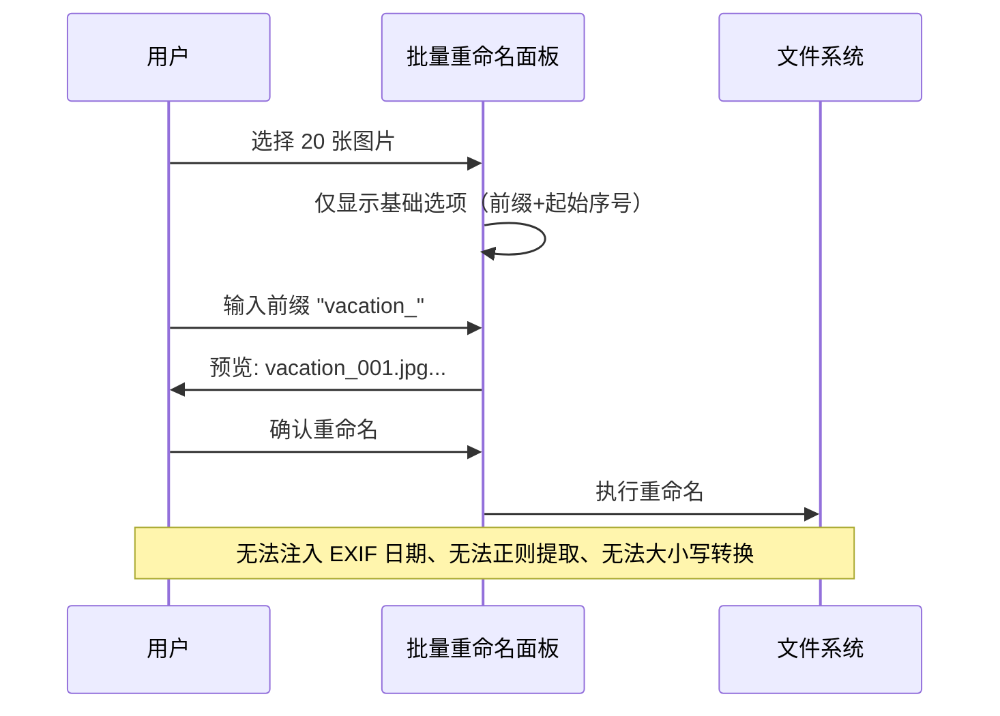
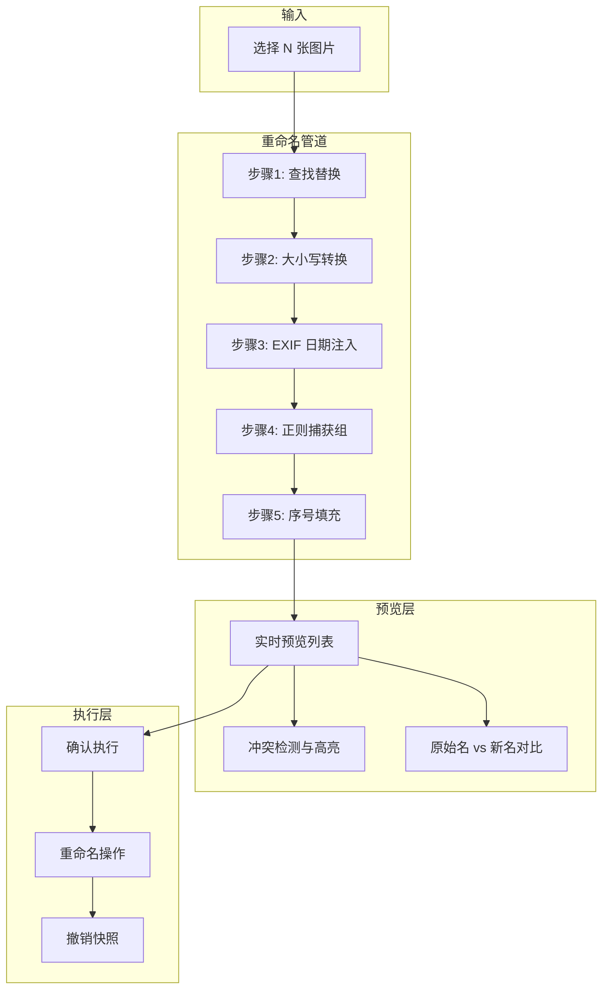

# YP-09-298: 图片批量重命名模式 — 正则捕获组、预设模式、EXIF 日期注入、查找替换、大小写转换

> 需求编号：YP-09-298 · 优先级：P2 · 人天：0.2d · 状态：需求已编写
> 依赖：YP-09-227（图片批量重命名基础）、YP-09-173（图像元数据查看器）

## 背景

### 问题陈述

YiPet 用户在处理大量图片时频繁需要重命名文件。基础的批量重命名（YP-09-227）仅支持序号递增，无法满足以下高级场景：

1. **正则捕获组重命名**：从原文件名中提取部分信息（如日期、编号）并重组为新文件名，例如 `IMG_20240115_001.jpg` 提取日期和序号重组为 `2024-01-15_001.jpg`
2. **EXIF 日期注入**：将照片的拍摄日期自动注入文件名，例如 `photo.jpg` 根据 EXIF `DateTimeOriginal` 变为 `2024-01-15_14-30-22.jpg`
3. **预设模式**：系统预置常用重命名模板（如 `日期_序号`、`项目名_版本号_序号`），用户一键选择而非手动编写规则
4. **查找替换**：批量替换文件名中的特定字符或模式，如将所有空格替换为下划线、移除特定前缀
5. **大小写转换**：批量转换文件名大小写（全大写/全小写/首字母大写/camelCase/kebab-case/snake_case）

**核心矛盾**：用户需要灵活的文件名转换能力 vs 手动逐个重命名的低效率。高级重命名模式将单次重命名操作扩展到批量文件，提供规则引擎驱动的自动化命名。

### 影响范围

| # | 影响 | 严重程度 | 用户感知 |
|---|------|----------|----------|
| 1 | 批量重命名仅支持序号递增 | 高 | "无法按日期整理照片" |
| 2 | EXIF 信息未利用于命名 | 高 | 拍摄日期需要手动输入 |
| 3 | 无重用模板导致重复配置 | 中 | 每次都要重新编写规则 |
| 4 | 大小写格式不统一 | 中 | 文件名风格混乱 |

### 挑战

| 挑战 | 说明 |
|------|------|
| 正则表达式用户友好性 | 非技术用户不熟悉正则语法，需要预设模板和可视化预览 |
| EXIF 读取兼容性 | 不同设备/格式的 EXIF 字段可能缺失或格式不一致 |
| 命名冲突处理 | 批量重命名可能产生重复文件名，需要自动去重策略 |
| 预览一致性 | 预览显示的文件名必须与最终结果完全一致，不允许"预览与实际不符" |
| 撤销能力 | 批量重命名后必须支持撤销，避免不可逆操作 |

---

## 一、现状分析

### 1.1 当前重命名能力

```
现有批量重命名 (YP-09-227):
├── 基础序号递增 ✅（前缀_001, 前缀_002...）
├── 自定义前缀 ✅
├── 正则捕获组重命名 ❌
├── EXIF 日期注入 ❌
├── 预设模板 ❌
├── 查找替换模式 ❌
├── 大小写转换 ❌
└── 重命名撤销 ❌
```

### 1.2 改造前数据流



### 1.3 根因矩阵

| 症状 | 根因 | 触发条件 | 频率 |
|------|------|----------|------|
| 无法按拍摄日期整理 | 无 EXIF 日期提取和注入 | 用户从相机导入照片 | 高 |
| 无法提取文件名片段重组 | 无正则捕获组支持 | 文件名包含结构化信息 | 高 |
| 重复配置重命名规则 | 无模板保存和复用 | 多次执行相似重命名 | 中 |
| 文件名风格不统一 | 无大小写转换 | 跨平台文件混用 | 中 |
| 特殊字符需批量替换 | 无查找替换模式 | 文件名含空格/特殊字符 | 中 |

---

## 二、设计决策

### 决策 1：重命名引擎架构 — 单一正则引擎 vs 管道模式 vs 规则链

| 选项 | 灵活性 | 复杂度 | 可组合性 |
|------|--------|--------|----------|
| 单一正则引擎（一条正则完成所有转换） | 低 | 低 | 差——只能做一种转换 |
| 管道模式（多个步骤串联：查找替换→大小写→EXIF→正则） | 高 | 中 | 最佳——步骤可自由组合 |
| 规则链（类似 Webpack loader 链） | 最高 | 高 | 最佳——但过度设计 |

**选择：管道模式。** 将重命名分解为独立步骤（查找替换 → 大小写转换 → EXIF 注入 → 正则捕获组 → 序号填充），每个步骤有明确的输入输出。用户可以启用/禁用任意步骤，调整步骤顺序。管道模式在灵活性和复杂度之间取得最佳平衡。

### 决策 2：正则表达式输入方式 — 原始正则输入 vs 可视化构建器 vs 预设模板

| 选项 | 学习曲线 | 灵活性 | 开发成本 |
|------|---------|--------|----------|
| 原始正则输入（输入 `/pattern/flags`） | 陡峭 | 最高 | 低 |
| 可视化构建器（拖拽式） | 平缓 | 中 | 高（0.2d 不够） |
| 预设模板 + 原始输入 | 平缓（预设）+ 陡峭（高级） | 高 | 中 |

**选择：预设模板 + 原始输入。** 提供 8-10 个预设模板覆盖 80% 场景（如"提取日期"、"移除前缀"、"IMG_序号→日期_序号"），同时保留原始正则输入给高级用户。可视化构建器在 0.2d 预算内不可行。

### 决策 3：EXIF 日期缺失策略 — 报错停止 vs 使用文件修改时间 vs 跳过错过的文件

| 选项 | 数据完整性 | 用户体验 |
|------|-----------|----------|
| 报错停止（无 EXIF 则中断） | 高 | 差——用户需手动处理 |
| 使用文件修改时间回退 | 中（可能不准确） | 好——自动填充 |
| 跳过错过的文件（仅处理有 EXIF 的） | 中 | 中——部分文件未处理 |

**选择：使用文件修改时间回退 + 标记提示。** 当 EXIF `DateTimeOriginal` 缺失时，依次尝试 `DateTimeDigitized` → `FileModifyDate` → 文件系统 `lastModified`。回退使用的日期在预览中以黄色标记提示用户，让用户知情。

### 决策 4：命名冲突解决策略 — 自动追加序号 vs 用户选择 vs 拒绝执行

| 选项 | 安全性 | 流畅度 |
|------|--------|--------|
| 自动追加序号（`photo.jpg` → `photo(1).jpg`） | 低（可能非用户预期） | 高 |
| 弹窗让用户选择（覆盖/跳过/追加序号/自动重命名） | 最高 | 低（打断流程） |
| 拒绝执行（有冲突则不执行） | 高 | 最低 |

**选择：预览阶段高亮冲突 + 自动追加序号。** 预览列表中冲突的文件名以红色高亮标记，默认自动追加 `_(N)` 后缀。用户可在预览中手动编辑冲突文件名。不弹窗打断用户流程。

### 设计决策汇总

| 决策 | 选项 A | 选项 B | 选项 C | 选择 | 理由 |
|------|--------|--------|--------|------|------|
| 引擎架构 | 单一正则 | 管道模式 | 规则链 | **管道模式** | 灵活性+可控复杂度 |
| 正则输入 | 原始正则 | 可视化构建器 | 预设+原始 | **预设+原始** | 降低入门门槛 |
| EXIF 缺失 | 报错停止 | 文件时间回退 | 跳过 | **文件时间回退+标记** | 自动+透明 |
| 命名冲突 | 自动追加序号 | 用户选择 | 拒绝执行 | **预览高亮+自动追加** | 流畅+可干预 |

---

## 三、目标架构

### 3.1 管道模式重命名架构



### 3.2 预设模板系统

```mermaid
graph LR
    subgraph Templates["预设模板库"]
        T1[日期_序号: {date}_{###}]
        T2[IMG转日期: IMG_{date}_{orig}]
        T3[移除前缀: strip(prefix)_*]
        T4[下划线化: snake_case]
        T5[小写化: lowercase]
        T6[项目_版本_序号: {project}_v{version}_{###}]
        T7[拍摄日期_原始名: {exif_date}_{name}]
        T8[查找替换空格: replace(' ','_')]
    end

    subgraph Custom["自定义模板"]
        U1[用户保存的模板]
        U2[最近使用的规则]
    end

    T1 --> V[用户选择模板]
    T8 --> V
    U1 --> V
    U2 --> V
    V --> W[自动填充管道配置]
```

### 3.3 性能指标

| 指标 | 改造前 | 改造后 |
|------|--------|--------|
| 重命名模式 | 仅序号递增 | 5 种管道步骤 + 8 种预设模板 |
| EXIF 日期利用 | 不支持 | 自动注入 + 回退策略 |
| 预览实时性 | 有 | < 50ms 更新（100 张图片） |
| 撤销支持 | 无 | 快照机制——支持撤销到原始状态 |

---

## 四、具体改动

### 4.1 核心类型定义

```typescript
// src/types/batch-rename.ts

type CaseConversion = 'uppercase' | 'lowercase' | 'capitalize' | 'camelCase' | 'kebab-case' | 'snake_case';

interface FindReplaceRule {
  find: string;           // 查找文本或正则表达式
  replace: string;        // 替换文本（支持 $1, $2 捕获组引用）
  useRegex: boolean;      // 是否作为正则处理
  flags?: string;         // 正则标志 (gi, g, i)
}

interface RegexCaptureRule {
  pattern: string;        // 正则表达式
  flags: string;          // 标志
  template: string;       // 替换模板，引用捕获组 $1, $2...
}

interface ExifDateRule {
  field: 'DateTimeOriginal' | 'DateTimeDigitized' | 'FileModifyDate';
  format: string;         // dayjs 格式，如 'YYYY-MM-DD_HH-mm-ss'
  fallback: 'file_mtime' | 'skip' | 'error';
}

interface SequenceRule {
  start: number;
  step: number;
  digits: number;         // 序号位数（不足补零）
  position: 'prefix' | 'suffix';
  separator: string;
}

interface RenamePipeline {
  id: string;
  name: string;
  steps: RenameStep[];
}

type RenameStep =
  | { type: 'find_replace'; rule: FindReplaceRule }
  | { type: 'case_convert'; rule: CaseConversion }
  | { type: 'exif_date'; rule: ExifDateRule }
  | { type: 'regex_capture'; rule: RegexCaptureRule }
  | { type: 'sequence'; rule: SequenceRule };

interface RenamePreview {
  originalName: string;
  newName: string;
  hasConflict: boolean;
  exifWarning?: string;  // EXIF 回退警告
  error?: string;        // 重命名规则错误
}
```

### 4.2 管道执行引擎

```typescript
// src/services/rename-pipeline.ts

class RenamePipelineEngine {
  private steps: RenameStep[] = [];

  setSteps(steps: RenameStep[]): void {
    this.steps = steps;
  }

  async preview(files: File[], sequence: SequenceRule): Promise<RenamePreview[]> {
    // 读取 EXIF 数据（仅当管道中包含 exif_date 步骤时）
    const exifData = this.hasExifStep()
      ? await this.batchReadExif(files)
      : new Map();

    return files.map((file, index) => {
      let newName = this.stripExtension(file.name);
      const ext = this.getExtension(file.name);

      for (const step of this.steps) {
        newName = this.executeStep(step, newName, {
          index,
          exif: exifData.get(file.name),
          originalName: file.name,
        });
      }

      // 应用序号
      newName = this.applySequence(newName, sequence, index);

      const finalName = newName + ext;
      return {
        originalName: file.name,
        newName: finalName,
        hasConflict: false, // 后续统一检测
        exifWarning: this.getExifWarning(file.name, exifData),
      };
    });
  }

  private executeStep(step: RenameStep, name: string, ctx: StepContext): string {
    switch (step.type) {
      case 'find_replace':
        return this.execFindReplace(name, step.rule);
      case 'case_convert':
        return this.execCaseConvert(name, step.rule);
      case 'exif_date':
        return this.execExifDate(name, step.rule, ctx);
      case 'regex_capture':
        return this.execRegexCapture(name, step.rule);
      default:
        return name;
    }
  }

  private execFindReplace(name: string, rule: FindReplaceRule): string {
    if (rule.useRegex) {
      const regex = new RegExp(rule.find, rule.flags || 'g');
      return name.replace(regex, rule.replace);
    }
    return name.replaceAll(rule.find, rule.replace);
  }

  private execCaseConvert(name: string, conversion: CaseConversion): string {
    switch (conversion) {
      case 'uppercase': return name.toUpperCase();
      case 'lowercase': return name.toLowerCase();
      case 'snake_case':
        return name.replace(/([A-Z])/g, '_$1').toLowerCase().replace(/^_/, '')
                   .replace(/[\s-]+/g, '_');
      case 'kebab-case':
        return name.replace(/([A-Z])/g, '-$1').toLowerCase().replace(/^-/, '')
                   .replace(/[\s_]+/g, '-');
      case 'camelCase':
        return name.replace(/[-_\s]+(.)/g, (_, c) => c.toUpperCase())
                   .replace(/^[A-Z]/, c => c.toLowerCase());
      case 'capitalize':
        return name.replace(/\b\w/g, c => c.toUpperCase());
    }
  }

  private execRegexCapture(name: string, rule: RegexCaptureRule): string {
    const regex = new RegExp(rule.pattern, rule.flags);
    return name.replace(regex, rule.template);
  }

  private execExifDate(name: string, rule: ExifDateRule, ctx: StepContext): string {
    const exif = ctx.exif;
    if (exif && exif[rule.field]) {
      return name.replace(/\{exif_date\}/g, this.formatExifDate(exif[rule.field], rule.format));
    }
    // 回退到文件修改时间
    ctx.warning = `EXIF ${rule.field} 缺失，使用文件修改时间`;
    return name.replace(/\{exif_date\}/g, this.formatExifDate(ctx.fileMtime, rule.format));
  }
}
```

### 4.3 预设模板定义

```typescript
// src/services/rename-presets.ts

export const RENAME_PRESETS: RenamePipeline[] = [
  {
    id: 'date-seq',
    name: '日期_序号',
    steps: [
      { type: 'exif_date', rule: { field: 'DateTimeOriginal', format: 'YYYY-MM-DD', fallback: 'file_mtime' } },
      { type: 'sequence', rule: { start: 1, step: 1, digits: 3, position: 'suffix', separator: '_' } },
    ],
  },
  {
    id: 'img-to-date',
    name: 'IMG_序号 → 日期_原始编号',
    steps: [
      { type: 'regex_capture', rule: { pattern: '^IMG_(\\d{8})_(\\d+)$', flags: '', template: '{date}_$2' } },
      { type: 'exif_date', rule: { field: 'DateTimeOriginal', format: 'YYYY-MM-DD', fallback: 'file_mtime' } },
    ],
  },
  {
    id: 'strip-prefix',
    name: '移除指定前缀',
    steps: [
      { type: 'find_replace', rule: { find: '^(prefix_)', replace: '', useRegex: true, flags: 'i' } },
    ],
  },
  {
    id: 'snake-case',
    name: 'snake_case 命名',
    steps: [
      { type: 'case_convert', rule: 'snake_case' },
    ],
  },
  {
    id: 'lowercase',
    name: '全部小写',
    steps: [
      { type: 'case_convert', rule: 'lowercase' },
    ],
  },
  {
    id: 'replace-space',
    name: '空格替换为下划线',
    steps: [
      { type: 'find_replace', rule: { find: '\\s+', replace: '_', useRegex: true, flags: 'g' } },
    ],
  },
  {
    id: 'replace-special',
    name: '移除特殊字符',
    steps: [
      { type: 'find_replace', rule: { find: '[^a-zA-Z0-9\\u4e00-\\u9fff_.-]', replace: '', useRegex: true, flags: 'g' } },
    ],
  },
  {
    id: 'exif-date-original',
    name: '拍摄日期_原始文件名',
    steps: [
      { type: 'exif_date', rule: { field: 'DateTimeOriginal', format: 'YYYYMMDD_HHmmss', fallback: 'file_mtime' } },
    ],
  },
];
```

### 4.4 文件变更清单

| 文件 | 操作 | 说明 |
|------|------|------|
| `src/types/batch-rename.ts` | 新增 | 重命名管道类型定义 |
| `src/services/rename-pipeline.ts` | 新增 | 管道执行引擎 |
| `src/services/rename-presets.ts` | 新增 | 预设模板库 |
| `src/services/exif-reader.ts` | 修改 | 增强 EXIF 批量读取能力 |
| `src/components/batch-rename-panel.vue` | 修改 | 集成管道步骤配置 UI |
| `src/components/rename-preview-list.vue` | 新增 | 重命名预览列表（含冲突高亮） |
| `src/composables/useRenamePipeline.ts` | 新增 | 管道状态管理 composable |
| `tests/unit/rename-pipeline.test.ts` | 新增 | 管道引擎单元测试 |

---

## 五、实施步骤

| 步骤 | 操作 | 路径 | 验证 | 人天 |
|------|------|------|------|------|
| 1 | 定义管道类型系统 | `src/types/batch-rename.ts` | TypeScript 类型检查通过 | 0.02 |
| 2 | 实现管道执行引擎 | `src/services/rename-pipeline.ts` | 5 种步骤类型各 3 个测试用例 | 0.07 |
| 3 | 实现预设模板库 | `src/services/rename-presets.ts` | 8 个预设全部预览正确 | 0.02 |
| 4 | 实现预览列表组件 | `src/components/rename-preview-list.vue` | 100 张图片预览 < 200ms | 0.03 |
| 5 | 改造批量重命名面板 | `src/components/batch-rename-panel.vue` | 管道步骤可视化配置 | 0.04 |
| 6 | 集成撤销快照 | `src/services/rename-pipeline.ts` | 批量重命名后可完整撤销 | 0.02 |

**总人天：0.2d**

---

## 六、测试规格

### 场景 1：正则捕获组重命名

**GIVEN** 文件名 `IMG_20240115_001.jpg`，正则捕获组规则 `pattern: '^IMG_(\\d{8})_(\\d+)$'`, `template: '$1_photo_$2'`
**WHEN** 管道执行预览
**THEN** 新文件名应为 `20240115_photo_001.jpg`

### 场景 2：EXIF 日期注入

**GIVEN** 文件名 `photo.jpg`，EXIF `DateTimeOriginal` = `2024:01:15 14:30:22`
**WHEN** 管道包含 `exif_date` 步骤——格式 `YYYY-MM-DD_HH-mm-ss`
**THEN** 新文件名应为 `2024-01-15_14-30-22.jpg`

### 场景 3：管道组合（查找替换 + 大小写)

**GIVEN** 文件名 `My Photo (1).JPG`，步骤 1：替换空格为下划线，步骤 2：全部小写
**WHEN** 管道执行
**THEN** 新文件名应为 `my_photo_(1).jpg`

### 场景 4：EXIF 缺失回退

**GIVEN** 文件名 `screenshot.png`，无 EXIF 数据——文件系统时间 2024-06-01T10:00:00
**WHEN** 管道包含 `exif_date` 步骤——回退策略 `file_mtime`
**THEN** 新文件名应包含 `2024-06-01_10-00-00`
**AND** 预览中应标记 "EXIF 缺失，使用文件修改时间"

### 场景 5：冲突检测

**GIVEN** 两张图片 `a.jpg` 和 `b.jpg`——重命名规则均生成 `result.jpg`
**WHEN** 预览生成
**THEN** 第二个 `result.jpg` 应自动追加 `_(1)` 变为 `result_(1).jpg`
**AND** 冲突项在预览列表中红色高亮

### 场景 6：大小写转换边界

**GIVEN** 文件名 `myPhoto_TEST-file.jpg`
**WHEN** 依次应用 6 种大小写转换
**THEN** uppercase → `MYPHOTO_TEST-FILE.jpg`
**AND** lowercase → `myphoto_test-file.jpg`
**AND** snake_case → `my_photo_test_file.jpg`
**AND** kebab-case → `my-photo-test-file.jpg`
**AND** camelCase → `myPhotoTestFile.jpg`
**AND** capitalize → `MyPhoto_TEST-File.jpg`

---

## 七、风险与缓解

| 风险 | 概率 | 影响 | 缓解措施 |
|------|------|------|----------|
| 正则表达式语法错误导致预览失败 | 中 | 中 | 实时语法校验——错误正则标红——显示错误信息 |
| EXIF 批量读取性能瓶颈 | 中 | 中 | 仅管道包含 exif_date 步骤时才读取 EXIF；并行读取 |
| 重命名后文件扩展名丢失 | 低 | 高 | 引擎设计为扩展名始终保持不变——仅处理 stem 部分 |
| 预设模板与用户预期不符 | 中 | 低 | 每个预设提供预览示例；支持用户自定义保存模板 |
| 撤销失败（文件系统权限） | 低 | 高 | 执行前验证文件可访问性；快照保存原始文件名映射 |

---

## 八、回滚策略

| 场景 | 回滚操作 | 影响 |
|------|----------|------|
| 管道引擎严重 bug | 禁用管道模式——回退到基础序号递增 | 高级功能不可用——基础重命名保留 |
| 正则引擎性能问题 | 限制文件数 ≤ 50——超出时警告 | 大批量场景受限 |
| EXIF 读取导致崩溃 | 自动跳过 EXIF 步骤——其余步骤正常 | EXIF 日期注入功能暂时不可用 |
| 预设模板错误 | 禁用受影响预设——保留其他预设 | 单个预设不可用 |

---

## 九、设计决策记录

### D-01：为什么管道步骤顺序可配置？

不同用户的重命名需求不同：有人想先替换再转换大小写，有人想先转换大小写再替换。固定顺序会限制灵活性。管道模式允许用户拖拽调整步骤顺序，预览实时反映顺序变化。默认顺序为：查找替换 → 大小写转换 → EXIF 注入 → 正则捕获组 → 序号填充——这是最自然的处理顺序。

### D-02：为什么扩展名保持不变？

扩展名是文件类型的标识，改变扩展名可能导致文件无法打开。重命名管道仅处理文件名的 stem 部分（不含扩展名）。如果用户确实需要改变扩展名（如 `.jpeg` → `.jpg`），应使用图片格式转换工具——而非重命名工具。

### D-03：为什么预设模板使用硬编码而非用户自定义 DSL？

用户自定义 DSL 需要定义语法、解析器、错误处理——远超 0.2d 范围。预设模板本质上是预配置的管道步骤组合，用户选中模板后仍可修改每个步骤的参数。这比 DSL 更直观——不需要学习新语法。

### D-04：为什么使用文件修改时间作为 EXIF 回退而非跳过？

跳过意味着用户必须手动处理无 EXIF 的图片——在批量操作中这打断了流程。文件修改时间虽然不是准确的拍摄时间，但通常接近（在文件从相机复制到电脑时保持）。黄色警告标记让用户知情选择——如果需要精确日期可手动修正。

---

## 十、可观测性

### 指标

| 指标 | 类型 | 说明 |
|------|------|------|
| `yipet.rename.pipeline_usage` | Counter | 管道模式使用次数 |
| `yipet.rename.preset_selected` | Counter | 各预设模板选择频率 |
| `yipet.rename.steps_avg` | Gauge | 平均管道步骤数 |
| `yipet.rename.preview_time_ms` | Histogram | 预览生成耗时 |
| `yipet.rename.conflict_count` | Counter | 命名冲突发生次数 |
| `yipet.rename.exif_fallback_rate` | Gauge | EXIF 回退比例 |

### 日志

| 事件 | 级别 | 内容 |
|------|------|------|
| 管道执行开始 | DEBUG | 步骤数、文件数、管道 ID |
| 步骤执行完成 | DEBUG | 步骤类型、耗时 |
| EXIF 回退 | WARN | 文件名、回退字段、回退原因 |
| 命名冲突 | WARN | 冲突文件名、自动追加后缀 |
| 预览生成 | INFO | 文件数、总耗时 |

---

## 十一、代码审查检查清单

- [ ] 管道引擎：5 种步骤类型全部实现并可通过配置驱动
- [ ] 管道引擎：步骤顺序正确——前一步输出为后一步输入
- [ ] 查找替换：支持正则和非正则两种模式
- [ ] 查找替换：正则捕获组 `$1` `$2` 正确引用
- [ ] 大小写转换：6 种转换模式正确（含边界：数字、特殊字符）
- [ ] EXIF 注入：三层回退（DateTimeOriginal → DateTimeDigitized → 文件时间）
- [ ] EXIF 注入：日期格式化使用 dayjs——支持自定义格式
- [ ] 序号填充：支持起始值、步长、位数补零
- [ ] 预览：实时更新——管道配置变更后 < 50ms 刷新
- [ ] 冲突检测：O(n) 复杂度——使用 Set 检测重复

---

## 回归问题预测

| # | 预测问题 | 原因 | 验证方法 |
|---|---------|------|---------|
| 1 | 正则捕获组引用 `$1` 在多次替换中引用到错误的分组——文件名中出现 `$1` 字面量而非捕获值 | 正则全局替换的 `replace` 在第二次匹配时 `$1` 含义可能偏移 | 文件名 `IMG_001_IMG_002.jpg` + pattern `IMG_(\\d+)` → 验证两次替换的 `$1` 分别引用各自匹配的分组 |
| 2 | 管道步骤间传递时文件名的扩展名被意外修改——如大小写转换将 `.JPG` 变为 `.jpg` 后又作为 stem 处理 | stem 和 ext 的分离逻辑在管道中被混淆——某步骤返回了完整文件名（含扩展名） | 固定扩展名为 `.JPG`——运行所有预设模板——验证输出扩展名始终为 `.JPG` 不变 |
| 3 | 序号填充在正则捕获组之后执行时——捕获组引用 `$2` 与序号占位符 `{###}` 格式冲突 | 正则模板中的 `$` 和序号模板中的 `{` 可能同时出现在文件名中 | 配置同时使用正则捕获组和序号——验证模板替换顺序正确——无残留占位符 |
| 4 | 大文件（> 20MB）的 EXIF 读取导致管道预览卡顿——用户感知延迟 > 1s | 批量 EXIF 读取在主线程执行——未使用 Web Worker | 选择 50 张 > 10MB 的图片——测量预览生成时间——验证 EXIF 读取使用 Worker 或分片处理 |
| 5 | 用户切换预设模板时——前一个模板的管道步骤未清除——新旧步骤混合执行 | 预设切换逻辑仅追加步骤而非替换步骤数组 | 依次选择 3 个预设模板——验证每次切换后管道步骤列表完全替换——无残留 |
| 6 | 查找替换未限制递归替换——`find='a', replace='aa'` 导致无限循环 | `replaceAll` 在替换结果包含匹配项时会再次替换 | 配置自引用替换规则——验证管道引擎限制最大替换次数或检测循环 |

---

## 性能分析

### 管道执行耗时

| 操作 | 1 张图片 | 50 张图片 | 100 张图片 | 说明 |
|------|---------|----------|-----------|------|
| 查找替换 | < 0.1ms | < 2ms | < 4ms | 字符串操作——非常快 |
| 大小写转换 | < 0.1ms | < 2ms | < 4ms | 字符串操作——非常快 |
| 正则捕获组 | < 0.5ms | < 10ms | < 20ms | 正则编译缓存 |
| EXIF 日期注入 | < 5ms | < 100ms | < 200ms | 二进制解析 + 日期格式化 |
| 序号填充 | < 0.1ms | < 1ms | < 2ms | 简单拼接 |
| 冲突检测 | N/A | < 1ms | < 2ms | Set 去重 |
| **总计（含 EXIF）** | **< 6ms** | **< 120ms** | **< 240ms** | 端到端预览 |

### 内存预估

| 数据 | 大小 | 说明 |
|------|------|------|
| 管道配置对象 | < 2KB | 最多 5 个步骤 |
| 预览列表（100 条） | ~20KB | 原始名 + 新名 + 状态 |
| EXIF 数据缓存（100 条） | ~50KB | 仅关键字段 |
| 撤销快照（100 条） | ~5KB | 原始文件名列表 |
| **总计** | **~80KB** | 轻量级 |

---

## 相关文档

- [图片批量重命名基础](../227-需求-图片批量重命名.md) — 基础序号重命名
- [图像元数据查看器](../173-需求-图像元数据查看器.md) — EXIF 读取基础
- [图片格式转换工厂](../209-需求-图片格式转换工厂.md) — 格式转换与重命名配合
- [图片批量优化建议](../288-需求-图片批量优化建议.md) — 优化后批量重命名

*PRD 来源: `projects/yipet/requirements/2026-09/298-需求-图片批量重命名模式.md`*