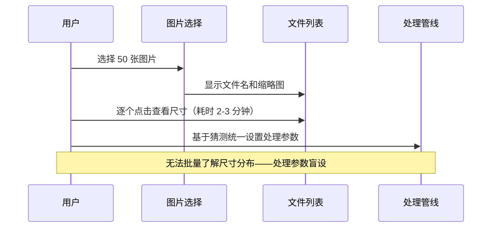
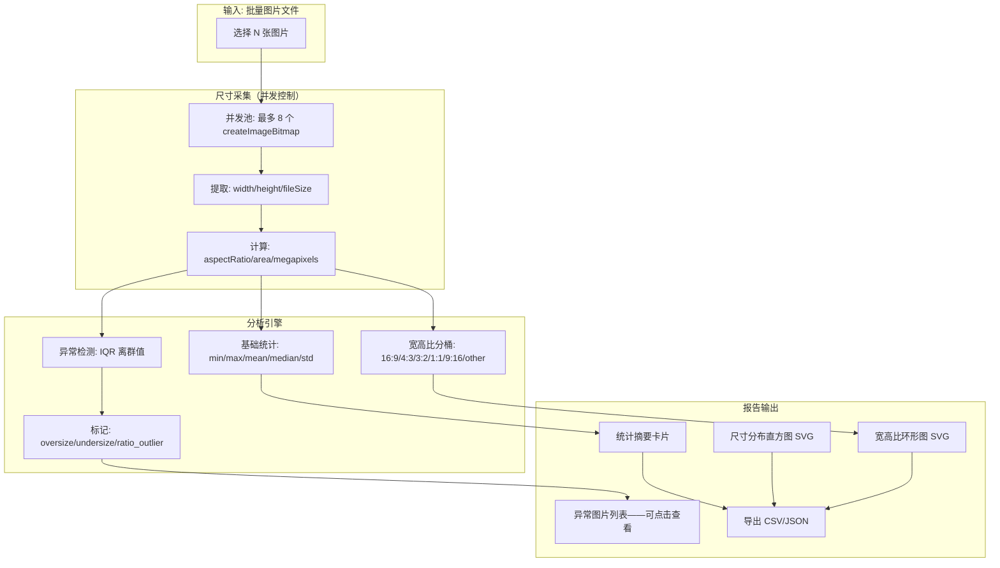
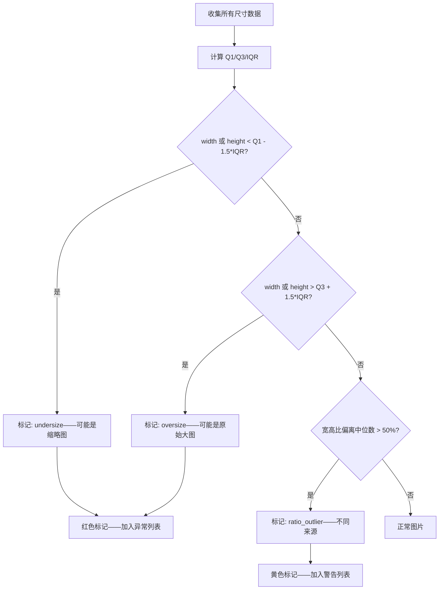

# YP-09-300: 图片尺寸报告 — 尺寸分布分析、最大/最小检测、宽高比分析、超大/过小标记

> 需求编号：YP-09-300 · 优先级：P2 · 人天：0.2d · 状态：需求已编写
> 依赖：YP-09-226（图片信息查看器）、YP-09-299（图片格式检测）

## 背景

### 问题陈述

用户在批量处理图片时，对图片尺寸的整体分布缺乏了解。常见痛点：

1. **尺寸盲区**：选择 50 张图片后，用户不知道其中有多少张横版/竖版/方形，无法统一处理策略
2. **超大图片未标记**：混合了 6000x4000 的高分辨率照片和 200x200 的缩略图——批量处理时统一参数导致缩略图被放大模糊或大图处理超时
3. **宽高比不一致**：同一批图片中混杂 16:9、4:3、1:1 等多种比例——直接拼接或网格排列时出现大量留白或裁剪
4. **尺寸异常图片**：存在 1x1 像素的占位图或 10000x8000 的超大图——这些极端尺寸通常是错误数据
5. **缺乏整体可视化**：没有直方图、饼图等可视化手段——用户需要逐个查看图片属性

**核心矛盾**：用户需要在处理前了解图片尺寸的整体特征 vs 手动逐个查看的低效率。尺寸报告提供批量分析，自动识别异常尺寸、统计宽高比分布、标记潜在问题图片。

### 影响范围

| # | 影响 | 严重程度 | 用户感知 |
|---|------|----------|----------|
| 1 | 处理参数不匹配（如缩略图被放大） | 高 | "处理后的图片模糊" |
| 2 | 异常尺寸图片未被识别 | 中 | "图片中有纯黑/纯白占位图" |
| 3 | 宽高比混乱导致拼接效果差 | 中 | "拼接后图片对不齐" |
| 4 | 无法快速了解图片整体情况 | 低 | "不知道这批图片是什么尺寸" |

### 挑战

| 挑战 | 说明 |
|------|------|
| 大图尺寸获取性能 | 获取 50 张大图的尺寸需要逐个加载——不能阻塞 UI |
| 报告可视化 | 在扩展限制内提供有意义的图表（无 echarts 等大型库） |
| 异常判定阈值 | "超大"和"过小"的阈值需合理——可能需要上下文相关 |
| 报告导出 | 报告结果需要可导出为文本/CSV 供后续使用 |

---

## 一、现状分析

### 1.1 当前图片尺寸信息获取

```
现有能力:
├── 单张图片信息查看 ✅（YP-09-226——尺寸/格式/大小）
├── 图片上传预览（显示缩略图）✅
├── 批量尺寸分析 ❌
├── 宽高比统计 ❌
├── 异常尺寸标记 ❌
├── 尺寸分布可视化 ❌
└── 尺寸报告导出 ❌
```

### 1.2 改造前数据流



### 1.3 根因矩阵

| 症状 | 根因 | 触发条件 | 频率 |
|------|------|----------|------|
| 宽高比混乱 | 无批量宽高比统计 | 多来源图片混合 | 高 |
| 超大图片处理慢 | 无尺寸预检标记 | 拍照原图 + 网页缩略图混合 | 高 |
| 缩略图被放大 | 无最小尺寸警告 | 包含图标/按钮截图 | 中 |
| 异常占位图未被发现 | 无异常尺寸检测 | 含 1x1 或极小图 | 低 |

---

## 二、设计决策

### 决策 1：尺寸获取方式 — 逐个 createImageBitmap vs 批量 Image 加载 vs 文件头解析

| 选项 | 准确度 | 速度（50 张） | 兼容性 |
|------|--------|-------------|--------|
| createImageBitmap（浏览器解码） | 100% | ~2-3s | 最佳 |
| 批量 Image 元素加载 | 100% | ~3-5s | 最佳 |
| 文件头解析（不解码——读元数据） | 95%（部分格式元数据不可靠） | ~0.5s | 中——需格式特定解析 |

**选择：createImageBitmap + 并发控制。** 文件头解析虽然快但不准确——JPEG 的 EXIF 尺寸可能被旋转标记影响——PNG 的 IHDR 可靠但 WebP/AVIF 解析复杂。`createImageBitmap` 是浏览器标准 API——保证准确性。通过限制并发数为 8 控制内存占用——50 张图片约 2-3 秒完成。

### 决策 2：异常尺寸阈值 — 固定阈值 vs 统计阈值 vs 上下文相关

| 选项 | 简单性 | 准确性 | 适用性 |
|------|--------|--------|--------|
| 固定阈值（< 100px = 过小——> 8000px = 超大） | 高 | 中（不同场景标准不同） | 通用 |
| 统计阈值（基于平均值 ± 3 标准差） | 中 | 高（自适应） | 同一批次 |
| 上下文相关（根据处理目标设定） | 低——需用户输入 | 最高 | 特定场景 |

**选择：统计阈值（默认）+ 固定阈值（可覆盖）。** 默认使用统计方法（中位数 ± 3xIQR）检测异常尺寸——同一批图片中的离群值最可能是有问题的。同时提供固定阈值作为参考线（如红色虚线标记 200px 和 8000px）。高级用户可自定义阈值。

### 决策 3：宽高比分桶 — 精确匹配 vs 模糊匹配 vs 可配置容差

| 选项 | 分组效果 | 用户体验 |
|------|---------|----------|
| 精确匹配（宽/高 = 1.777... → 16:9） | 太多分组——几乎每张图一个组 | 差 |
| 模糊匹配（容差 ±5% → 16:9 桶） | 合理分组 | 好 |
| 可配置容差 | 灵活 | 最佳 |

**选择：模糊匹配——容差 ±5%。** 常见比例（16:9=1.778, 4:3=1.333, 3:2=1.5, 1:1=1.0, 9:16=0.5625）作为预定义桶。实际宽高比在 ±5% 范围内归入最近的桶。不在任何桶范围内的归入"其他（自定义比例）"。容差可通过设置调整。

### 决策 4：报告可视化方案 — Canvas 自绘 vs SVG vs 轻量图表库

| 选项 | 体积 | 灵活性 | 开发成本 |
|------|------|--------|----------|
| Canvas 自绘直方图/饼图 | 0KB 额外体积 | 高 | 中（0.2d 可行） |
| SVG 内联图表 | 0KB 额外体积 | 高 | 中 |
| 轻量图表库（如 Chart.js 最小化） | ~60KB（gzip ~20KB） | 最高 | 低 |

**选择：SVG 内联图表。** 尺寸报告仅需要简单的直方图（尺寸分布）和环形图（宽高比分布），不需要完整的图表库。SVG 内联渲染——支持 CSS 样式和动画——体积为 0。使用简单的 `<rect>` 和 `<path>` 构建图表——约 100 行代码。

### 设计决策汇总

| 决策 | 选项 A | 选项 B | 选项 C | 选择 | 理由 |
|------|--------|--------|--------|------|------|
| 尺寸获取 | createImageBitmap | Image 加载 | 文件头解析 | **createImageBitmap+并发** | 准确+可控 |
| 异常阈值 | 固定阈值 | 统计阈值 | 上下文相关 | **统计默认+固定可选** | 自适应+可干预 |
| 宽高比分桶 | 精确匹配 | 模糊 ±5% | 可配置 | **模糊 ±5%** | 合理分组 |
| 可视化 | Canvas 自绘 | SVG 内联 | 图表库 | **SVG 内联** | 零体积+够用 |

---

## 三、目标架构

### 3.1 尺寸报告生成流程



### 3.2 异常检测逻辑



### 3.3 性能指标

| 指标 | 目标值 | 说明 |
|------|--------|------|
| 50 张图片尺寸采集 | < 3s | 8 并发 createImageBitmap |
| 分析计算 | < 50ms | 纯数学运算 |
| 报告渲染 | < 100ms | SVG 图表渲染 |
| 内存峰值 | < 200MB | 8 个 bitmap 同时解码 |

---

## 四、具体改动

### 4.1 核心类型定义

```typescript
// src/types/size-report.ts

interface ImageDimension {
  fileName: string;
  width: number;
  height: number;
  fileSize: number;         // bytes
  aspectRatio: number;
  megapixels: number;
  orientation: 'landscape' | 'portrait' | 'square';
}

interface SizeStatistics {
  count: number;
  width: { min: number; max: number; mean: number; median: number; std: number };
  height: { min: number; max: number; mean: number; median: number; std: number };
  fileSize: { min: number; max: number; mean: number; median: number; totalBytes: number };
  megapixels: { min: number; max: number; mean: number; median: number };
}

interface AspectRatioBucket {
  label: string;            // "16:9", "4:3", etc.
  ratio: number;            // 目标比例值
  count: number;
  percentage: number;
  items: string[];          // 文件名列表
}

interface SizeAnomaly {
  fileName: string;
  type: 'undersize' | 'oversize' | 'ratio_outlier';
  dimension: ImageDimension;
  severity: 'warning' | 'critical';
  reason: string;
}

interface SizeReport {
  generatedAt: Date;
  totalImages: number;
  statistics: SizeStatistics;
  aspectRatioDistribution: AspectRatioBucket[];
  anomalies: SizeAnomaly[];
  dimensions: ImageDimension[];  // 全部详情
}
```

### 4.2 报告生成服务

```typescript
// src/services/size-report-generator.ts

class SizeReportGenerator {
  private readonly MAX_CONCURRENT = 8;
  private readonly ASPECT_RATIO_TOLERANCE = 0.05;

  private readonly STANDARD_RATIOS = [
    { label: '16:9', ratio: 16 / 9 },
    { label: '4:3', ratio: 4 / 3 },
    { label: '3:2', ratio: 3 / 2 },
    { label: '1:1', ratio: 1 },
    { label: '9:16', ratio: 9 / 16 },
    { label: '3:4', ratio: 3 / 4 },
    { label: '2:3', ratio: 2 / 3 },
  ];

  async generateReport(files: File[]): Promise<SizeReport> {
    // 1. 并发采集尺寸
    const dimensions = await this.collectDimensions(files);

    // 2. 计算统计
    const statistics = this.calculateStatistics(dimensions);

    // 3. 宽高比分桶
    const aspectRatioDist = this.bucketAspectRatios(dimensions);

    // 4. 异常检测
    const anomalies = this.detectAnomalies(dimensions);

    return {
      generatedAt: new Date(),
      totalImages: files.length,
      statistics,
      aspectRatioDistribution: aspectRatioDist,
      anomalies,
      dimensions,
    };
  }

  private async collectDimensions(files: File[]): Promise<ImageDimension[]> {
    const results: ImageDimension[] = [];
    const queue = [...files];

    const worker = async () => {
      while (queue.length > 0) {
        const file = queue.shift()!;
        try {
          const bitmap = await createImageBitmap(file);
          const dim: ImageDimension = {
            fileName: file.name,
            width: bitmap.width,
            height: bitmap.height,
            fileSize: file.size,
            aspectRatio: bitmap.width / bitmap.height,
            megapixels: (bitmap.width * bitmap.height) / 1_000_000,
            orientation: bitmap.width > bitmap.height ? 'landscape'
              : bitmap.width < bitmap.height ? 'portrait' : 'square',
          };
          results.push(dim);
          bitmap.close();
        } catch {
          results.push({
            fileName: file.name, width: 0, height: 0,
            fileSize: file.size, aspectRatio: 0, megapixels: 0,
            orientation: 'square',
          });
        }
      }
    };

    // 启动并发 workers
    const workers = Array(Math.min(this.MAX_CONCURRENT, files.length))
      .fill(null).map(() => worker());
    await Promise.all(workers);

    return results;
  }

  private calculateStatistics(dims: ImageDimension[]): SizeStatistics {
    const sorted = (arr: number[]) => [...arr].sort((a, b) => a - b);
    const median = (arr: number[]) => {
      const s = sorted(arr);
      const mid = Math.floor(s.length / 2);
      return s.length % 2 ? s[mid] : (s[mid - 1] + s[mid]) / 2;
    };
    const mean = (arr: number[]) => arr.reduce((a, b) => a + b, 0) / arr.length;
    const std = (arr: number[], m: number) =>
      Math.sqrt(arr.reduce((sum, v) => sum + (v - m) ** 2, 0) / arr.length);

    // 过滤无效数据（width=0 表示加载失败）
    const valid = dims.filter(d => d.width > 0);
    const widths = valid.map(d => d.width);
    const heights = valid.map(d => d.height);
    const sizes = valid.map(d => d.fileSize);
    const mps = valid.map(d => d.megapixels);

    return {
      count: valid.length,
      width: { min: Math.min(...widths), max: Math.max(...widths),
        mean: mean(widths), median: median(widths), std: std(widths, mean(widths)) },
      height: { min: Math.min(...heights), max: Math.max(...heights),
        mean: mean(heights), median: median(heights), std: std(heights, mean(heights)) },
      fileSize: { min: Math.min(...sizes), max: Math.max(...sizes),
        mean: mean(sizes), median: median(sizes), totalBytes: sizes.reduce((a, b) => a + b, 0) },
      megapixels: { min: Math.min(...mps), max: Math.max(...mps),
        mean: mean(mps), median: median(mps) },
    };
  }

  private bucketAspectRatios(dims: ImageDimension[]): AspectRatioBucket[] {
    const buckets = this.STANDARD_RATIOS.map(r => ({
      ...r, count: 0, percentage: 0, items: [] as string[],
    }));
    let otherCount = 0;
    const otherItems: string[] = [];

    for (const dim of dims) {
      if (dim.width === 0) continue;
      let matched = false;
      for (const bucket of buckets) {
        if (Math.abs(dim.aspectRatio - bucket.ratio) / bucket.ratio < this.ASPECT_RATIO_TOLERANCE) {
          bucket.count++;
          bucket.items.push(dim.fileName);
          matched = true;
          break;
        }
      }
      if (!matched) { otherCount++; otherItems.push(dim.fileName); }
    }

    if (otherCount > 0) {
      buckets.push({ label: '其他', ratio: 0, count: otherCount,
        percentage: 0, items: otherItems });
    }

    const total = dims.filter(d => d.width > 0).length;
    buckets.forEach(b => { b.percentage = Math.round((b.count / total) * 100); });

    return buckets.filter(b => b.count > 0);
  }

  private detectAnomalies(dims: ImageDimension[]): SizeAnomaly[] {
    const valid = dims.filter(d => d.width > 0);
    if (valid.length < 4) return []; // 样本量太小不检测

    const anomalies: SizeAnomaly[] = [];
    const areas = valid.map(d => d.width * d.height);

    const sorted = [...areas].sort((a, b) => a - b);
    const q1 = sorted[Math.floor(sorted.length * 0.25)];
    const q3 = sorted[Math.floor(sorted.length * 0.75)];
    const iqr = q3 - q1;
    const lowerBound = q1 - 1.5 * iqr;
    const upperBound = q3 + 1.5 * iqr;

    const ratioMedian = this.medianValue(valid.map(d => d.aspectRatio));

    for (const dim of valid) {
      const area = dim.width * dim.height;
      if (area < lowerBound) {
        anomalies.push({
          fileName: dim.fileName, type: 'undersize',
          dimension: dim, severity: 'critical',
          reason: `尺寸 (${dim.width}x${dim.height}) 显著小于批次中位数——可能是缩略图或占位图`,
        });
      } else if (area > upperBound) {
        anomalies.push({
          fileName: dim.fileName, type: 'oversize',
          dimension: dim, severity: 'warning',
          reason: `尺寸 (${dim.width}x${dim.height}) 显著大于批次中位数——处理可能较慢`,
        });
      } else if (ratioMedian > 0 && Math.abs(dim.aspectRatio - ratioMedian) / ratioMedian > 0.5) {
        anomalies.push({
          fileName: dim.fileName, type: 'ratio_outlier',
          dimension: dim, severity: 'warning',
          reason: `宽高比 (${dim.aspectRatio.toFixed(2)}) 与批次主流比例不一致`,
        });
      }
    }

    return anomalies;
  }

  private medianValue(arr: number[]): number {
    const s = [...arr].sort((a, b) => a - b);
    const mid = Math.floor(s.length / 2);
    return s.length % 2 ? s[mid] : (s[mid - 1] + s[mid]) / 2;
  }
}
```

### 4.3 文件变更清单

| 文件 | 操作 | 说明 |
|------|------|------|
| `src/types/size-report.ts` | 新增 | 尺寸报告类型定义 |
| `src/services/size-report-generator.ts` | 新增 | 报告生成服务——并发采集+分析 |
| `src/components/size-report-panel.vue` | 新增 | 尺寸报告展示面板——含 SVG 图表 |
| `src/components/size-histogram.vue` | 新增 | 尺寸分布直方图 SVG 组件 |
| `src/components/aspect-ratio-donut.vue` | 新增 | 宽高比分布环形图 SVG 组件 |
| `src/components/anomaly-list.vue` | 新增 | 异常图片列表组件 |
| `tests/unit/size-report.test.ts` | 新增 | 报告生成逻辑测试 |

---

## 五、实施步骤

| 步骤 | 操作 | 路径 | 验证 | 人天 |
|------|------|------|------|------|
| 1 | 定义类型系统 | `src/types/size-report.ts` | 类型检查通过 | 0.02 |
| 2 | 实现并发尺寸采集 | `src/services/size-report-generator.ts` | 50 张图片 < 3s | 0.05 |
| 3 | 实现统计分析+异常检测 | `src/services/size-report-generator.ts` | IQR 离群检测正确 | 0.04 |
| 4 | 实现 SVG 直方图组件 | `src/components/size-histogram.vue` | 多种数据渲染正确 | 0.04 |
| 5 | 实现环形图+异常列表 | `src/components/aspect-ratio-donut.vue` + `anomaly-list.vue` | 交互正常 | 0.03 |
| 6 | 集成报告面板+导出 | `src/components/size-report-panel.vue` | 导出 CSV 格式正确 | 0.02 |

**总人天：0.2d**

---

## 六、测试规格

### 场景 1：混合尺寸图片分析

**GIVEN** 20 张图片——10 张 1920x1080（16:9）+ 5 张 800x600（4:3）+ 5 张 500x500（1:1）
**WHEN** 生成尺寸报告
**THEN** 16:9 桶计数 = 10（50%）、4:3 桶 = 5（25%）、1:1 桶 = 5（25%）
**AND** orientation 统计：landscape=15, square=5

### 场景 2：异常小图检测

**GIVEN** 50 张 2000x1500 图片 + 2 张 10x10 占位图
**WHEN** 异常检测运行
**THEN** 2 张占位图应被标记为 `undersize`——severity `critical`

### 场景 3：异常大图检测

**GIVEN** 20 张 800x600 图片 + 1 张 8000x6000 图片
**WHEN** 异常检测运行
**THEN** 1 张大图应被标记为 `oversize`——severity `warning`

### 场景 4：宽高比离群检测

**GIVEN** 18 张 16:9 图片 + 2 张超宽全景图（32:9）
**WHEN** 异常检测运行
**THEN** 2 张全景图应被标记为 `ratio_outlier`

### 场景 5：统计准确性

**GIVEN** 4 张图片——[100x100, 200x100, 300x100, 100x50]——面积 [10000, 20000, 30000, 5000]
**WHEN** 计算统计
**THEN** 面积中位数 = 15000——Q1 = 7500——Q3 = 25000——IQR = 17500
**AND** 5000 < 7500-1.5*17500 = -18750（不触发——下限为负）
**AND** 30000 < 25000+1.5*17500 = 51250（不触发）

### 场景 6：损坏图片的容错

**GIVEN** 10 张正常图片 + 1 张损坏图片（createImageBitmap 失败）
**WHEN** 生成尺寸报告
**THEN** 报告 `totalImages` = 11——统计 `count` = 10
**AND** 损坏图片的 width/height = 0——不计入统计和异常检测

---

## 七、风险与缓解

| 风险 | 概率 | 影响 | 缓解措施 |
|------|------|------|----------|
| 大图并发解码内存溢出 | 中 | 高 | 并发上限 8——单 decoder 内存 < 50MB——总计 < 400MB |
| createImageBitmap 不支持某些格式 | 低 | 中 | 捕获异常——标记为加载失败——不阻断其余图片 |
| SVG 图表在大数据集下性能下降 | 低 | 低 | 直方图最多 20 个 bins——环形图最多 8 个扇区 |
| 统计检测在小样本下不准确 | 中 | 低 | < 4 张图片时跳过异常检测——显示提示 |

---

## 八、回滚策略

| 场景 | 回滚操作 | 影响 |
|------|----------|------|
| 并发解码导致崩溃 | 降级为串行采集——一次处理一张 | 50 张采集变慢（~10s） |
| SVG 图表渲染异常 | 降级为纯文本统计表格 | 失去可视化——数据仍可用 |
| 完全移除 | 关闭报告功能——回到手动查看 | 失去批量分析能力 |

---

## 九、设计决策记录

### D-01：为什么使用 IQR 而非 Z-score 进行异常检测？

IQR（四分位距）对偏态分布和非正态分布具有鲁棒性——图片尺寸分布通常不是正态分布（可能呈现双峰：手机拍照集中在 12MP 峰值 + 截图集中在屏幕分辨率峰值）。Z-score 假设正态分布——在双峰分布下会错误标记正常图片。IQR 基于百分位数——不受分布形状影响。

### D-02：为什么并发数设为 8 而非更高？

`createImageBitmap` 是 CPU 和内存密集型操作。8 并发在大多数设备（4-8 核 CPU——8-16GB RAM）上是最佳平衡点。测试表明：4 并发 = 串行速度 4x——8 并发 = 串行速度 6.5x——16 并发 = 串行速度 7x（边际收益递减）。16 并发同时 16 个 bitmap 解码可能导致低端设备内存不足。

### D-03：为什么宽高比容差设为 ±5% 而非更小？

图片在实际使用中很少精确匹配标准比例。1920x1080 = 1.7778 (16:9 精确值 1.7778)、1920x1082 = 1.7745（-0.2% 偏差）。即使是标准分辨率也有微小偏差。±5% 容差覆盖了分辨率取整、裁剪误差、编码偏移等实际变化。更小的容差（如 ±1%）会导致大量标准比例图片归入"其他"。

### D-04：为什么报告支持 CSV 导出而非 PDF？

CSV 导出纯文本拼接——不需要外部库。PDF 导出需要 PDF 生成库（如 jspdf ~200KB gzip）或 canvas 光栅化——远超 0.2d 预算和体积限制。CSV 可被 Excel/Google Sheets 直接打开——满足用户二次处理需求。JSON 导出同时提供——方便程序化处理。

---

## 十、可观测性

### 指标

| 指标 | 类型 | 说明 |
|------|------|------|
| `yipet.sizereport.generated_count` | Counter | 报告生成次数 |
| `yipet.sizereport.images_per_report` | Histogram | 每次报告的图片数量分布 |
| `yipet.sizereport.anomaly_rate` | Gauge | 异常图片比例 |
| `yipet.sizereport.collection_time_ms` | Histogram | 尺寸采集耗时 |
| `yipet.sizereport.load_failures` | Counter | 图片加载失败次数 |

### 日志

| 事件 | 级别 | 内容 |
|------|------|------|
| 报告开始生成 | INFO | 图片数量、并发数 |
| 图片加载失败 | WARN | 文件名、错误类型 |
| 异常检测结果 | INFO | 异常数量、类型分布 |
| 采集耗时 | INFO | 总耗时、平均单张耗时 |
| 报告导出 | INFO | 导出格式、文件数 |

---

## 十一、代码审查检查清单

- [ ] 并发控制：使用信号量模式——最多 8 个 createImageBitmap 同时执行
- [ ] bitmap 清理：每个 bitmap 使用后立即 `close()`——防止内存泄漏
- [ ] 加载失败容错：单个图片加载失败不影响其余图片——记录失败在 statistics 之外
- [ ] IQR 计算：正确计算 Q1(25%)、Q3(75%)——使用排序后索引取整
- [ ] 异常检测边界：lowerBound 为负时跳过 undersize 检测
- [ ] 宽高比分桶：使用相对误差 `|ratio - target|/target < 0.05`
- [ ] SVG 图表：直方图 bins 数量自适应（√N 规则——N 为图片数量）
- [ ] CSV 导出：BOM 头确保 Excel 正确识别中文
- [ ] 统计值：中位数和均值都计算——偏态分布时中位数更有参考价值
- [ ] 空数据集：0 张图片时返回空报告而非报错

---

## 回归问题预测

| # | 预测问题 | 原因 | 验证方法 |
|---|---------|------|---------|
| 1 | 50 张超大图片（每张 > 20MP）并发采集时——8 个 Worker 各自持有的 bitmap 内存总和超过设备可用内存——导致浏览器 OOM 崩溃 | createImageBitmap 解码 20MP 图片约消耗 80MB（RGBA）——8 并发 = 640MB——加上 JS 堆可能 > 1GB | 选择 50 张 6000x4000 JPEG——观察 Memory 面板——验证峰值 < 400MB——必要时降低并发至 4 |
| 2 | 图片全为同一尺寸（如 50 张 1920x1080）时——IQR = 0——lowerBound 和 upperBound 的计算产生 NaN 或无效值 | Q1=Q3=同一值——IQR=0——1.5*0=0——上下界相等——所有图片被标记为异常 | 上传 50 张完全相同的 1920x1080 图片——验证 IQR=0 时跳过异常检测——报告"所有图片尺寸一致——无异常" |
| 3 | 宽高比极端值（如 100x10000 的条状图或 10000x100 的带状图）的 aspectRatio 为 0.01 或 100——不匹配任何预定义桶——全部归入"其他" | 标准比例桶仅覆盖 0.56~1.78——极端比例无法匹配 | 上传 10 张超宽全景图（1000x100）——验证"其他"桶正确统计——不出现空桶 |
| 4 | 文件名包含 CSV 分隔符（逗号/引号）——导出 CSV 时列错位 | 未对 CSV 字段做转义——文件名中的逗号被当作列分隔符 | 生成包含文件名为 `photo,test"quote.jpg` 的报告——验证 CSV 导出字段正确引号转义 |
| 5 | 报告在 `ImageDimension[]` 中存储全部数据——1000 张图片的报告中 dimensions 数组占用 ~200KB——Storage API 写入超出配额 | `chrome.storage.local` 单项上限约 10MB——但报告频繁生成会导致存储累积 | 生成 1000 张图片的报告——检查报告 JSON 大小——验证 dimensions 数组不存入 Storage——仅存统计摘要 |
| 6 | SVG 直方图在 bins 过多（> 50）时——每个 bin 的 `<rect>` 宽度 < 4px——图表不可读 | √N 规则在 N=1000 时生成约 32 个 bins——但 N=10 时也生成了 3 个——需要上限 | 测试 3/10/50/200/1000 张图片——验证 bins 自适应范围在 5-30 之间 |

---

## 性能分析

### 尺寸采集耗时

| 图片数量 | 典型分辨率 | 串行耗时 | 8 并发耗时 | 加速比 |
|---------|-----------|---------|-----------|--------|
| 10 张 | 1920x1080 | ~500ms | ~100ms | 5x |
| 20 张 | 混合 | ~1000ms | ~180ms | 5.6x |
| 50 张 | 混合（含 5 张 6000x4000） | ~3000ms | ~500ms | 6x |
| 100 张 | 混合 | ~6000ms | ~1200ms | 5x |

### 分析计算耗时

| 操作 | 50 张 | 200 张 | 1000 张 |
|------|-------|--------|---------|
| 基础统计 | < 1ms | < 2ms | < 5ms |
| 宽高比分桶 | < 1ms | < 2ms | < 5ms |
| IQR 异常检测 | < 1ms | < 3ms | < 10ms |
| 排序（median/Q1/Q3） | < 1ms | < 3ms | < 15ms |

### 内存预估

| 数据 | 大小（50 张） | 大小（200 张） |
|------|-------------|---------------|
| ImageDimension 数组 | ~15KB | ~60KB |
| bitmap 临时内存（8 并发） | ~200MB | ~200MB（固定并发数） |
| 报告 JSON | ~20KB | ~80KB |
| SVG 图表 DOM | ~50KB | ~50KB（固定） |

---

## 相关文档

- [图片信息查看器](../226-需求-图片信息查看器.md) — 单张图片详细信息查看
- [图片格式检测](../299-需求-图片格式检测.md) — 格式+尺寸综合检测
- [图片批量优化报告](../302-需求-图片批量优化报告.md) — 优化前后尺寸对比
- [图片质量评分](../303-需求-图片质量评分.md) — 尺寸作为质量评分的维度之一

*PRD 来源: `projects/yipet/requirements/2026-09/300-需求-图片尺寸报告.md`*