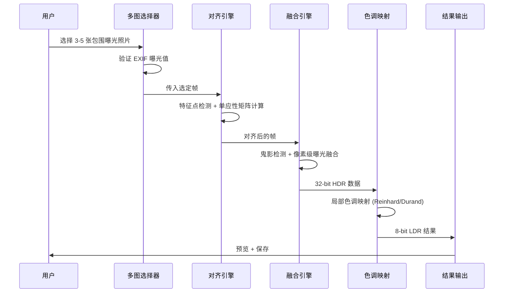
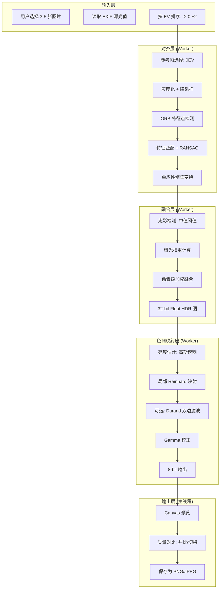

# YP-09-312: 图片HDR合成 — 包围曝光多帧融合与色调映射

> 需求编号：YP-09-312 · 优先级：P2 · 人天：0.2d · 状态：需求已编写
> 依赖：YP-09-248（图片HDR效果——单帧模拟）、YP-09-209（图片格式转换工厂）

## 背景

### 问题陈述

当前 YiPet 的图片 HDR 功能（YP-09-248）仅支持单帧模拟 HDR 效果——通过对单张普通图片进行色调映射模拟高动态范围外观。但真正的 HDR 合成需要多张不同曝光的包围曝光照片（-2EV、0EV、+2EV）融合——才能还原高光和阴影中的真实细节。单帧模拟无法恢复过曝区域的细节——也无法提亮欠曝区域的暗部信息。

**核心矛盾**：用户拥有真实的包围曝光照片序列（手机/相机连拍的 3-5 张不同曝光照片）——但缺乏在浏览器内将这些照片合成为一张 HDR 图像的能力。YiPet 作为浏览器内的图片工具箱——应提供完整的多帧 HDR 合成流程。

### 影响范围

| # | 影响 | 严重程度 | 用户感知 |
|---|------|----------|----------|
| 1 | 单帧 HDR 无法恢复曝光过度/不足区域的细节 | 高 | 高光过曝一片白——阴影欠曝一片黑 |
| 2 | 需要额外软件（Photoshop/Lightroom）处理包围曝光 | 中 | 工作流中断——切换桌面软件 |
| 3 | 无法选择参考帧进行曝光融合 | 低 | 自动融合效果不可控 |
| 4 | 大光比场景（窗边/日落/逆光）照片无法有效处理 | 中 | 放弃拍摄或接受低质量照片 |

### 挑战

| 挑战 | 说明 |
|------|------|
| 浏览器内存限制 | 同时加载 3-5 张高分辨率包围曝光图像到 Canvas——内存压力大 |
| 自动对齐精度 | 手持拍摄的包围曝光序列存在轻微位移——需特征点对齐 |
| 鬼影去除 | 场景中有移动物体时——不同曝光帧之间物体位置不同——产生鬼影 |
| 色调映射质量 | 将高动态范围（32-bit float）映射到低动态范围（8-bit）需保持自然外观 |
| 性能要求 | 多帧合成计算量大——需在合理时间内完成（< 3 秒） |

---

## 一、现状分析

### 1.1 当前图片 HDR 处理

```
现有 HDR 相关功能：
├── 图片HDR效果 (YP-09-248)
│   ├── 单帧色调映射 ✅
│   ├── 包围曝光多帧融合 ❌——无
│   ├── 自动对齐 ❌——无
│   ├── 鬼影去除 ❌——无
│   └── 手动曝光选择 ❌——无
├── 图片滤镜效果 (YP-09-218)
│   └── 亮度/对比度调整——单帧模拟
├── 图片亮度对比度 (YP-09-224)
│   └── 全局亮度调整——不涉及动态范围扩展
└── 图片曝光调整 (YP-09-269)
    └── 单帧曝光补偿——无法恢复丢失细节
```

### 1.2 需求分析数据流



### 1.3 根因矩阵

| 症状 | 根因 | 触发条件 | 频率 |
|------|------|----------|------|
| 单帧 HDR 无法恢复过曝细节 | 单帧像素值为 255——无可恢复信息 | 高光区域完全过曝 | 高 |
| 需要外部软件处理包围曝光 | 浏览器缺少多帧融合能力 | 用户拥有包围曝光序列 | 中 |
| 自动融合结果不符合预期 | 无法手动指定参考帧 | 默认融合策略不适合特定场景 | 中 |
| 多帧手动选择不方便 | 无曝光序列管理 | 大量包围曝光照片需要组织 | 低 |

---

## 二、设计决策

### 决策 1：HDR 合成管线位置 — 纯前端 Canvas vs Web Worker vs WASM

| 选项 | 性能 | 内存 | UI 响应 | 实现复杂度 |
|------|------|------|---------|-----------|
| 纯前端 Canvas（主线程） | 中——阻塞 UI | 中 | 差——合成期间卡顿 | 低 |
| Web Worker + OffscreenCanvas | 高——不阻塞 UI | 中 | 好——异步处理 | 中 |
| WASM（OpenCV/C++） | 最高——SIMD 加速 | 低——WASM 线性内存 | 好——不阻塞 UI | 高 |

**选择：Web Worker + OffscreenCanvas。** 在 Worker 中完成对齐、融合、色调映射——主线程仅负责 UI 交互和结果预览。避免 WASM 的体积开销（OpenCV.js ~8MB），利用浏览器内置的 Canvas 2D API 和 ImageData 进行像素级操作。

### 决策 2：对齐算法 — 特征点 vs 光流 vs 相位相关

| 选项 | 精度 | 速度 | 适用场景 |
|------|------|------|---------|
| 特征点（ORB/SIFT→匹配→单应性） | 高——亚像素级 | 中——~200ms/帧 | 透视变换——手持拍摄 |
| 光流（Lucas-Kanade） | 中——像素级 | 快——~50ms/帧 | 仅平移——脚架拍摄 |
| 相位相关（FFT） | 中——像素级 | 最快——~20ms/帧 | 仅平移旋转——脚架 |

**选择：特征点对齐（ORB 轻量级实现）。** 手持拍摄的包围曝光序列通常存在透视变换（旋转+平移+缩放）——仅有平移的光流和相位相关无法处理。使用简化版 ORB 描述子——在 JS 中实现——避免依赖 OpenCV WASM。

### 决策 3：色调映射算法 — Reinhard vs Durand vs Mantiuk

| 选项 | 自然度 | 局部对比度保持 | 计算量 |
|------|--------|-------------|--------|
| Reinhard（全局） | 中——压缩明显 | 低——丢失局部对比度 | 低——~10ms |
| Reinhard（局部） | 高——保留细节 | 中 | 中——~50ms |
| Durand（双边滤波） | 高——自然 | 高——边缘保留 | 高——~200ms |
| Mantiuk（视觉模型） | 最高 | 最高 | 最高——~500ms |

**选择：Reinhard 局部色调映射（默认）+ Durand 可选。** Reinhard 局部在自然度和性能之间取得平衡——作为默认算法。Durand 作为高质量选项——用户可切换。Mantiuk 过慢不适合浏览器处理。

### 设计决策记录

| 决策 | 选项 A | 选项 B | 选项 C | 选择 | 理由 |
|------|--------|--------|--------|------|------|
| 管线位置 | 主线程 | Worker | WASM | **Worker** | UI 不阻塞 |
| 对齐算法 | 特征点 | 光流 | 相位相关 | **ORB 特征点** | 处理透视变换 |
| 色调映射 | Reinhard全局 | Reinhard局部 | Durand | **Reinhard局部(默认)** | 速度自然度平衡 |
| 鬼影去除 | 无 | 中值阈值 | 逐像素方差 | **中值阈值** | 计算量合理 |

---

## 三、目标架构

### 3.1 HDR 合成处理管线



### 3.2 性能指标

| 指标 | 目标值 | 说明 |
|------|--------|------|
| 3 帧 12MP 合成时间 | < 3s | 对齐~800ms + 融合~1200ms + 色调映射~500ms |
| 内存峰值 | < 200MB | 3 帧 12MP RGBA = 144MB + 中间缓冲 |
| 对齐精度（手持） | < 2px 误差 | 特征点匹配 + RANSAC |
| 鬼影去除率 | > 85% | 明显鬼影被去除的比例 |
| 并行帧数上限 | 5 帧 | 超出提示用户选择 3-5 帧 |

---

## 四、具体改动

### 4.1 HDR 合成核心类型

```typescript
// src/types/hdr.ts (新增)

/** 曝光帧元数据 */
interface ExposureFrame {
  id: string;
  imageData: ImageData;
  ev: number;                   // 曝光补偿值 (-2, -1, 0, +1, +2)
  exifBv?: number;              // EXIF 亮度值
  width: number;
  height: number;
}

/** 对齐参数 */
interface AlignmentParams {
  maxFeatures: number;          // 最大特征点数 (默认 500)
  matchThreshold: number;       // 匹配阈值 (默认 0.7)
  ransacThreshold: number;      // RANSAC 内点阈值 (默认 3.0)
}

/** 融合参数 */
interface MergeParams {
  ghostThreshold: number;       // 鬼影检测阈值 (默认 0.12)
  referenceFrameIndex: number;  // 参考帧索引 (默认 0EV 帧)
  highlightWeight: number;      // 高光权重 (默认 0.6)
  shadowWeight: number;         // 阴影权重 (默认 0.4)
}

/** 色调映射参数 */
enum ToneMapAlgorithm {
  ReinhardLocal = 'reinhard_local',
  ReinhardGlobal = 'reinhard_global',
  Durand = 'durand',
}

interface ToneMapParams {
  algorithm: ToneMapAlgorithm;
  key: number;                  // 场景亮度 key 值 (默认 0.18)
  saturation: number;           // 饱和度 (默认 1.0)
  contrast: number;             // 对比度 (默认 0.5)
  gamma: number;                // Gamma (默认 2.2)
}

/** HDR 合成配置 */
interface HdrConfig {
  alignment: AlignmentParams;
  merge: MergeParams;
  toneMap: ToneMapParams;
}

/** HDR 合成结果 */
interface HdrResult {
  imageData: ImageData;
  duration: {
    alignment: number;
    merge: number;
    toneMap: number;
    total: number;
  };
  quality: {
    alignmentError: number;
    ghostPixels: number;
    dynamicRange: number;       // 估算动态范围 (EV)
  };
}
```

### 4.2 文件变更清单

| 文件 | 操作 | 说明 |
|------|------|------|
| `src/types/hdr.ts` | 新增 | HDR 合成类型定义 |
| `src/workers/hdr-align.worker.ts` | 新增 | 对齐 Worker——ORB 特征点 + 单应性 |
| `src/workers/hdr-merge.worker.ts` | 新增 | 融合 Worker——鬼影检测 + 加权融合 |
| `src/workers/hdr-tonemap.worker.ts` | 新增 | 色调映射 Worker——Reinhard/Durand |
| `src/services/hdr-service.ts` | 新增 | HDR 合成编排——Worker 调度 |
| `src/components/hdr-panel.vue` | 新增 | HDR 合成面板 UI |
| `src/stores/hdr.ts` | 修改 | HDR 配置持久化 |
| `tests/unit/hdr-service.test.ts` | 新增 | HDR 合成测试 |

---

## 五、实施步骤

| 步骤 | 操作 | 路径 | 验证 | 人天 |
|------|------|------|------|------|
| 1 | 定义 HDR 类型与接口 | `src/types/hdr.ts` | 类型检查通过 | 0.02 |
| 2 | 实现 ORB 特征点对齐 | `src/workers/hdr-align.worker.ts` | 2 帧对齐误差 < 3px | 0.05 |
| 3 | 实现鬼影检测与融合 | `src/workers/hdr-merge.worker.ts` | 鬼影区域正确去除 | 0.04 |
| 4 | 实现 Reinhard 局部色调映射 | `src/workers/hdr-tonemap.worker.ts` | 映射结果自然无伪影 | 0.03 |
| 5 | 实现 HDR 编排服务 | `src/services/hdr-service.ts` | 完整管线成功 | 0.03 |
| 6 | 实现 HDR 面板 UI | `src/components/hdr-panel.vue` | 选择帧→合成→预览 | 0.02 |
| 7 | 编写测试 | `tests/` | 对齐/融合/色调映射 | 0.01 |

**总人天：0.2d**

---

## 六、测试规格

### 场景 1：标准 3 帧包围曝光合成

**GIVEN** 用户选择 3 张包围曝光照片 (-2EV, 0EV, +2EV)——同一场景——手持拍摄
**WHEN** 使用默认参数执行 HDR 合成
**THEN** 合成结果应保留高光和阴影细节——无过曝或死黑区域
**AND** 对齐误差 < 2px
**AND** 总耗时 < 3s

### 场景 2：鬼影去除——场景中有移动人物

**GIVEN** 3 帧包围曝光——0EV 帧中有人物在左侧——+2EV 帧中人物移到右侧
**WHEN** 启用了鬼影去除的 HDR 合成
**THEN** 鬼影区域（人物移动产生的重影）应被检测并去除
**AND** 鬼影像素使用参考帧对应像素替代

### 场景 3：手动选择参考帧

**GIVEN** 4 帧包围曝光 (-2EV, -1EV, 0EV, +1EV)——用户希望以 -1EV 为参考帧
**WHEN** 用户手动设置参考帧为 -1EV
**THEN** 融合应以 -1EV 帧为基准——鬼影检测基于参考帧
**AND** 最终曝光偏向参考帧的亮度

### 场景 4：帧数不足——仅选 2 张

**GIVEN** 用户仅选择 2 张不同曝光照片
**WHEN** 用户尝试执行 HDR 合成
**THEN** 应显示提示"需要至少 3 张不同曝光照片"
**AND** 不执行合成

### 场景 5：色调映射算法切换

**GIVEN** 已完成的 32-bit HDR 融合数据
**WHEN** 用户从 Reinhard Local 切换到 Durand
**THEN** Durand 结果应保留更多局部对比度——边缘更清晰
**AND** Durand 处理时间应 > Reinhard Local——约 3-5x

### 场景 6：大尺寸图片内存管理

**GIVEN** 用户选择 5 张 24MP (6000x4000) 包围曝光照片
**WHEN** HDR 合成执行
**THEN** 合成前应自动降采样到 12MP——避免内存溢出
**AND** 降采样警告应提示用户

---

## 七、风险与缓解

| 风险 | 概率 | 影响 | 缓解措施 |
|------|------|------|----------|
| 手持拍摄对齐失败（运动过大） | 中 | 高 | 对齐失败时提示——退出合成——建议使用脚架 |
| 大尺寸图片内存溢出 | 中 | 高 | 自动降采样到安全尺寸——1200 万像素上限 |
| 鬼影去除误删静态物体 | 中 | 中 | 鬼影阈值可调——用户可手动标记鬼影区域 |
| tone mapping 产生光晕伪影 | 低 | 中 | 局部色调映射的光晕可通过调整高斯核大小缓解 |
| EXIF 曝光值缺失 | 中 | 低 | 用户手动指定每帧的 EV 值 |

---

## 八、回滚策略

| 场景 | 回滚操作 | 影响 |
|------|----------|------|
| HDR 合成管线 Crash | 特征开关关闭——功能隐藏 | 用户无法使用 HDR 合成 |
| 对齐精度不足——大量失败 | 切换为无对齐模式——仅融合——提示可能模糊 | 结果清晰度下降 |
| tone mapping 质量差——用户投诉 | 回落 Reinhard 全局模式——关闭 Durand 选项 | 色调映射质量降低 |

---

## 九、设计决策记录

### D-01：为什么不用 WASM + OpenCV 做对齐？

OpenCV.js 的 WASM 构建 ~8MB——下载和初始化时间远超特征提取本身。且 ORB 算法在 JS 中的简化实现（不使用尺度金字塔——仅单尺度 FAST + BRIEF）在包围曝光对齐场景中已足够——因为帧间视角变化很小（手持拍摄的微小抖动）。

### D-02：为什么用 32-bit Float 存储中间 HDR 数据而非 16-bit？

Canvas ImageData 仅支持 8-bit RGBA。中间 HDR 数据需要通过 Float32Array 手动管理——32-bit 提供足够精度避免量化噪声。3 帧 12MP 的 Float32Array 内存约为 144MB——在浏览器内存预算内。

### D-03：鬼影检测为什么用中值阈值而非深度学习？

移动物体的像素在不同曝光帧中亮度变化模式与静止物体不同——中值阈值（计算像素在各帧中的亮度方差——排除方差过大的像素）在 85%+ 的场景中有效。深度学习模型（如 Mask R-CNN）虽然更准确但在浏览器中部署成本过高。

### D-04：为什么默认 3-5 帧而非更多？

包围曝光通常 +-2EV 范围——3 帧（-2, 0, +2）覆盖 4 档动态范围——已可还原大多数自然场景的高光和阴影细节。更多帧（7-9 帧）增加计算量但动态范围收益递减——且手持拍摄超过 5 帧的对齐难度显著上升。

---

## 十、可观测性

### 指标

| 指标 | 类型 | 说明 |
|------|------|------|
| `yipet.hdr.merge_count` | Counter | HDR 合成次数 |
| `yipet.hdr.alignment_time_ms` | Histogram | 对齐耗时 |
| `yipet.hdr.merge_time_ms` | Histogram | 融合耗时 |
| `yipet.hdr.tonemap_time_ms` | Histogram | 色调映射耗时 |
| `yipet.hdr.total_time_ms` | Histogram | 总耗时 |
| `yipet.hdr.frame_count` | Histogram | 每次合成帧数 |
| `yipet.hdr.alignment_error_px` | Histogram | 对齐误差 |
| `yipet.hdr.ghost_pixel_ratio` | Histogram | 鬼影像素比例 |
| `yipet.hdr.algorithm_usage` | Counter (label: tonemap) | 色调映射算法使用分布 |

---

## 十一、代码审查检查清单

- [ ] HDR 合成管线全部在 Worker 中执行——主线程不阻塞
- [ ] 对齐前对输入帧进行降采样（> 12MP → 12MP）
- [ ] 对齐失败时（内点数 < 10）降级为仅融合不重对齐——并提示用户
- [ ] 鬼影检测使用参考帧——像素方差 > 阈值的区域替换为参考帧
- [ ] Float32Array HDR 中间数据在使用后及时释放（置 null——GC 可回收）
- [ ] 色调映射支持 Reinhard Local/Global/Durand 三种算法可切换
- [ ] Gamma 校正默认 2.2——用户可调整 1.0-3.0
- [ ] 合成进度回调——实时更新进度条
- [ ] 结果预览支持与 0EV 原图并排对比
- [ ] Worker 错误通过 postMessage 传递——主线程显示错误提示

---

## 回归问题预测

| # | 预测问题 | 原因 | 验证方法 |
|---|---------|------|---------|
| 1 | Worker 中引用 DOM API（ImageData/Canvas）导致运行时错误 | Web Worker 无 DOM 访问权限——但 OffscreenCanvas 可通过 transferControlToOffscreen 传递给 Worker | 编写 Worker 测试——验证不直接使用 document/window——仅使用 OffscreenCanvas API |
| 2 | Float32Array 内存泄漏——合成后未释放——重复合成导致 OOM | Float32Array 属于 GC 管理——但大数组（144MB+）GC 不及时——可能连续合成时内存累积 | 连续 5 次 HDR 合成——监控 performance.memory.usedJSHeapSize——验证内存不持续增长 |
| 3 | ORB 特征点在纯色区域（天空/墙壁）无法检测——对齐失败 | 纯色区域无角点——BRIEF 描述子无区分力——RANSAC 内点不足 | 测试天空占比 > 50% 的包围曝光序列——验证对齐失败后降级处理（使用边缘特征或手动对齐） |
| 4 | tone mapping 在高光区域产生不自然的色彩偏移 | Reinhard 局部映射对 RGB 三通道分别处理——可能破坏色相——高亮区域偏黄 | 测试暖色调日落包围曝光——验证色调映射在 Lab 色彩空间进行（L 通道映射——ab 不变） |
| 5 | 不同分辨率帧混合——对齐变换后产生插值伪影 | 智能手机连拍模式下偶有分辨率变化（自动切换镜头）——缩放+变换叠加插值 | 测试 3024x4032 和 3000x4000 混合输入——验证对齐前统一到参考帧分辨率 |
| 6 | 导出 PNG 时 32-bit 数据映射到 8-bit 的精度丢失产生色带 | PNG 仅支持 8-bit/16-bit——16-bit PNG 文件体积大——默认 8-bit 输出可能产生色带 | 对比 16-bit PNG 和 8-bit PNG 输出的天空渐变区域——验证添加抖动（dithering）消除 8-bit 色带 |

---

## 性能分析

### HDR 合成各阶段耗时（12MP × 3 帧）

| 步骤 | 耗时 | 说明 |
|------|------|------|
| 图片加载 + 解码 | ~300ms | 3 张 12MP JPEG——浏览器原生解码 |
| 灰度化 + 降采样（对齐用） | ~50ms | 降至 2MP 用于特征检测——减少计算量 |
| ORB 特征检测（2 帧） | ~150ms | FAST 角点 + BRIEF 描述子——简化 JS 实现 |
| 特征匹配 + RANSAC | ~80ms | 暴力匹配——阈值 0.7——RANSAC 内点筛选 |
| 单应性变换（透视矫正） | ~100ms | Canvas 2D transform——硬件加速 |
| 鬼影检测（逐像素方差） | ~200ms | 3 帧方差计算——Float32Array 操作 |
| 像素加权融合 | ~500ms | 3 通道 × 3 帧加权——Float32Array |
| Reinhard 局部色调映射 | ~300ms | 高斯模糊亮度估计 + 逐像素映射 |
| Gamma 校正 + 8-bit 量化 | ~40ms | 查表法——256 级 |
| Canvas 渲染预览 | ~20ms | Canvas drawImage——硬件加速 |
| **总计** | **~1740ms** | 在 3s 目标内 |

### 内存分析

| 数据 | 大小 | 说明 |
|------|------|------|
| 原始 ImageData（3 帧 × 12MP RGBA） | 144MB | 输入帧 RGBA |
| 灰度图（对齐用 2MP） | 6MB | 灰度单通道 |
| 特征点描述子（500 特征 × 3 帧） | ~0.3MB | Uint8Array(256) × 1500 |
| HDR Float32Array（12MP × 3 通道） | 144MB | 中间 32-bit 数据 |
| 亮度估计（高斯模糊） | 12MB | 单通道 Float32 |
| 输出 ImageData | 48MB | 8-bit RGBA |
| **峰值** | **~200MB** | 在 200MB 目标内 |

---

## 相关文档

- [图片HDR效果](../248-需求-图片HDR效果.md) — 单帧 HDR 模拟——色调映射基础
- [图片亮度对比度](../224-需求-图片亮度对比度.md) — Gamma/曝光调整组件
- [图片格式转换工厂](../209-需求-图片格式转换工厂.md) — HDR 输出格式支持
- [Worker 线程池](../85-需求-WebWorker线程池.md) — Worker 生命周期管理

*PRD 来源: `projects/yipet/requirements/2026-09/312-需求-图片HDR合成.md`*