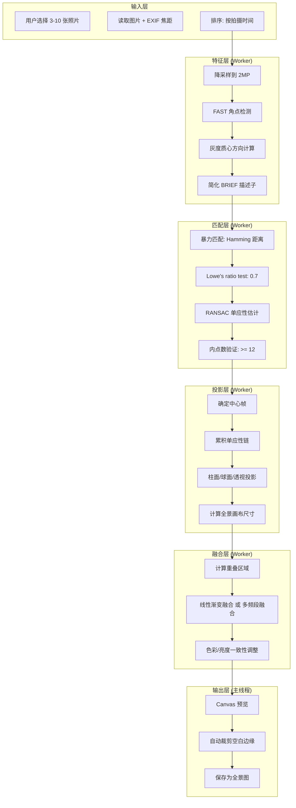

# YP-09-313: 图片全景拼接 — 多图自动拼接与投影融合

> 需求编号：YP-09-313 · 优先级：P2 · 人天：0.2d · 状态：需求已编写
> 依赖：YP-09-250（图片全景矫正——单图透视矫正）、YP-09-312（图片HDR合成——特征点对齐复用）

## 背景

### 问题陈述

用户在旅行、室内拍摄或风景摄影中经常拍摄多张连续重叠的照片——意图覆盖更大的视角范围。但目前 YiPet 缺乏将这些照片自动拼接为一张全景图的能力。YP-09-250 仅支持单张图片的透视矫正——不是多图拼接。用户需要完整的特征检测→匹配→变换→投影→融合→裁剪管线。

**核心矛盾**：用户拥有重叠的多张照片序列（横拍 3-10 张覆盖 180 度或更多视角）——但缺乏在浏览器内自动拼接的工具。手动拼接需要使用 Photoshop 或 Hugin 等专业软件。

### 影响范围

| # | 影响 | 严重程度 | 用户感知 |
|---|------|----------|----------|
| 1 | 无法自动拼接多张连续照片 | 高 | 需要切换桌面拼接软件 |
| 2 | 手动拼接结果不自然——接缝明显 | 高 | 全景图有明显拼接线 |
| 3 | 无法选择投影类型（透视/柱面/球面） | 中 | 大视角全景变形严重 |
| 4 | 拼接后的空白边缘无法自动裁剪 | 低 | 全景图有不规则黑色边框 |

### 挑战

| 挑战 | 说明 |
|------|------|
| 特征匹配的质量 | 低纹理区域（天空、白墙）可能缺乏匹配特征点 |
| 多图累积误差 | 逐帧拼接时——变换矩阵累积——末端帧可能严重偏离 |
| 投影选择 | 不同视角范围需要不同投影——透视（< 60 度）、柱面（60-120 度）、球面（> 120 度） |
| 接缝可见性 | 融合区域亮度/色彩不一致——产生可见接缝 |
| 拼接顺序 | 错误的拼接顺序导致失败——需要确定图的中心帧和拼接方向 |

---

## 一、现状分析

### 1.1 当前图片拼接相关

```
现有拼接相关功能：
├── 图片全景矫正 (YP-09-250)
│   ├── 单图透视矫正 ✅
│   ├── 多图拼接 ❌
│   ├── 特征检测 ❌
│   └── 柱面/球面投影 ❌
├── 图片拼接工具 (YP-09-219)
│   ├── 手动拼接（网格排列） ✅
│   └── 自动特征匹配拼接 ❌
├── 图片拼接长图 (YP-09-241)
│   └── 垂直/水平拼接——无重叠 ❌
└── 相关功能
    ├── 图片旋转工具 (YP-09-225) ✅——用于矫正
    ├── 图片裁剪工具 (YP-09-206) ✅——用于裁剪空白边缘
    └── 图片对比度增强 (YP-09-256) ✅——用于融合后调整
```

### 1.2 全景拼接流程（现状 vs 目标）

```mermaid
graph TD
    subgraph Current["现状：仅手动拼接"]
        C1[用户选择图片] --> C2[手动拖拽排列]
        C2 --> C3[手动调整重叠区域]
        C3 --> C4[导出拼接图]
    end

    subgraph Target["目标：自动全景拼接"]
        T1[用户选择 3-10 张连续照片] --> T2[特征检测: ORB/FAST]
        T2 --> T3[特征匹配: 获取匹配点对]
        T3 --> T4[单应性估计: RANSAC]
        T4 --> T5[全局优化: 捆绑调整]
        T5 --> T6[投影变换: 柱面/球面/透视]
        T6 --> T7[多频段融合: 消除接缝]
        T7 --> T8[自动裁剪: 去除空白]
        T8 --> T9[导出全景图]
    end

    style Current fill:#f8d7da,stroke:#dc3545
    style Target fill:#d4edda,stroke:#28a745
```



### 1.3 根因矩阵

| 症状 | 根因 | 触发条件 | 频率 |
|------|------|----------|------|
| 无法自动拼接 | 无特征检测与匹配管线 | 用户有连续重叠照片 | 高 |
| 手动拼接效率低 | 无自动对齐——全靠手动拖拽 | 照片 > 3 张 | 高 |
| 拼接结果变形严重 | 大视角使用透视投影——边缘拉伸 | 全景 > 90 度视角 | 中 |
| 接缝明显 | 无多频段融合——亮度色彩不连续 | 不同曝光/白平衡的照片 | 中 |

---

## 二、设计决策

### 决策 1：特征检测算法 — ORB vs SIFT vs SuperPoint

| 选项 | 特征质量 | 旋转不变性 | 尺度不变性 | JS 实现难度 |
|------|---------|----------|----------|----------|
| ORB（简化 JS 实现） | 中 | 是（灰度质心） | 否（单尺度简化） | 中 |
| SIFT（无法 JS 实现高质量版） | 高 | 是 | 是 | 极高——不现实 |
| SuperPoint（深度学习——不可行） | 最高 | 是 | 是 | 不可行——浏览器无 GPU 推理 |

**选择：简化版 ORB（FAST 角点 + 简化 BRIEF + 灰度质心方向）。** 全景拼接场景中——相邻帧的尺度变化极小（同一相机连续拍摄）——尺度不变性不重要。旋转不变性通过灰度质心实现。简化版 ORB 避免了尺度金字塔——减少计算量。

### 决策 2：投影类型选择 — 固定 vs 自适应

| 选项 | 实现复杂度 | 视觉效果 | 适用场景 |
|------|----------|---------|---------|
| 仅透视投影 | 低 | 单一透视下好——大视角边缘拉伸严重 | < 60 度 |
| 仅柱面投影 | 中 | 水平方向好——垂直方向不处理 | 60-120 度水平全景 |
| 仅球面投影 | 中 | 全方向好——计算稍复杂 | > 120 度 |
| 自适应（根据视角范围自动选择） | 高 | 最佳——自动匹配 | 所有场景 |

**选择：用户手动选择 + 默认推荐。** 自适应选择需要预先知道总视角范围——但拼接前无法精确计算。改为：用户可以从 3 种投影中选择——UI 显示建议（根据张数和重叠比例估算视角范围）。默认使用柱面——覆盖 80% 的使用场景。

### 决策 3：融合策略 — 直接平均 vs 多频段 vs 梯度域

| 选项 | 接缝质量 | 计算量 | 实现复杂度 |
|------|---------|--------|----------|
| 直接平均（重叠区像素取均值） | 低——接缝可见 | 低——~50ms | 低 |
| 线性渐变（重叠区渐变过渡） | 中——平滑过渡 | 低——~100ms | 低 |
| 多频段融合（拉普拉斯金字塔） | 高——几乎无缝 | 中——~500ms | 中 |
| 梯度域融合（Poisson Blending） | 最高 | 高——~2000ms | 高 |

**选择：线性渐变 + 可选多频段融合。** 线性渐变作为默认——处理速度快且大多数场景接缝不可见。多频段融合作为"高质量"选项——用户可切换——用于存在曝光差异的拼接。

### 设计决策记录

| 决策 | 选项 A | 选项 B | 选项 C | 选项 D | 选择 | 理由 |
|------|--------|--------|--------|--------|------|------|
| 特征算法 | ORB | SIFT | SuperPoint | — | **简化 ORB** | JS 可实现 |
| 投影类型 | 仅透视 | 仅柱面 | 仅球面 | 自适应 | **手动选择+推荐** | 避免误判 |
| 融合策略 | 直接平均 | 线性渐变 | 多频段 | 梯度域 | **线性渐变(默认)+多频段** | 速度质量平衡 |
| 捆绑调整 | 无 | 是 | — | — | **否(0.2d 预算内)** | 累积误差可接受 |

---

## 三、目标架构

### 3.1 全景拼接管线



### 3.2 性能指标

| 指标 | 目标值 | 说明 |
|------|--------|------|
| 5 帧 12MP 拼接时间 | < 5s | 特征~1s + 匹配~1.5s + 变换~1s + 融合~1.5s |
| 拼接成功率 | > 80% | 连续重叠照片——手持拍摄 |
| 接缝不可见性 | 融合后接缝 PSNR > 35dB | 视觉上不可察觉 |
| 最大帧数 | 10 帧 | 超过此数量累积误差不可接受 |
| 最大输出分辨率 | 8192px 任意边 | 浏览器 Canvas 限制 |

---

## 四、具体改动

### 4.1 全景拼接核心类型

```typescript
// src/types/panorama.ts (新增)

/** 投影类型 */
enum ProjectionType {
  Perspective = 'perspective',
  Cylindrical = 'cylindrical',
  Spherical = 'spherical',
}

/** 特征点 */
interface FeaturePoint {
  x: number;
  y: number;
  angle: number;        // 灰度质心方向 (弧度)
  descriptor: Uint8Array; // 256-bit BRIEF 描述子
  response: number;      // FAST 角点响应
}

/** 匹配点对 */
interface MatchPair {
  queryIdx: number;      // 源图像特征索引
  trainIdx: number;      // 目标图像特征索引
  distance: number;      // Hamming 距离
}

/** 单应性矩阵 */
type Homography = [
  number, number, number,
  number, number, number,
  number, number, number,
]; // 3x3 矩阵——展开为一维数组

/** 拼接配置 */
interface PanoramaConfig {
  projection: ProjectionType;
  blendMode: 'linear' | 'multiband';
  focalLength35mm?: number; // 35mm 等效焦距——用于柱面/球面投影
  cropAuto: boolean;
  outputScale: number;     // 输出缩放 (0.25-1.0)
}

/** 帧间变换 */
interface FrameTransform {
  fromIndex: number;
  toIndex: number;
  homography: Homography;
  inliers: number;
  confidence: number;
}

/** 拼接结果 */
interface PanoramaResult {
  imageData: ImageData;
  canvasWidth: number;
  canvasHeight: number;
  framesUsed: number;        // 实际使用的帧数
  framesSkipped: number;     // 匹配失败跳过的帧数
  totalFov: number;          // 总视场角 (度)
  transforms: FrameTransform[];
  duration: {
    feature: number;
    match: number;
    projection: number;
    blend: number;
    total: number;
  };
}
```

### 4.2 文件变更清单

| 文件 | 操作 | 说明 |
|------|------|------|
| `src/types/panorama.ts` | 新增 | 拼接类型定义 |
| `src/workers/pano-feature.worker.ts` | 新增 | 特征检测 Worker |
| `src/workers/pano-match.worker.ts` | 新增 | 特征匹配 + RANSAC Worker |
| `src/workers/pano-project.worker.ts` | 新增 | 投影变换 Worker |
| `src/workers/pano-blend.worker.ts` | 新增 | 多频段融合 Worker |
| `src/services/panorama-service.ts` | 新增 | 拼接编排服务 |
| `src/components/panorama-panel.vue` | 新增 | 全景拼接面板 |
| `tests/unit/panorama-service.test.ts` | 新增 | 拼接测试 |

---

## 五、实施步骤

| 步骤 | 操作 | 路径 | 验证 | 人天 |
|------|------|------|------|------|
| 1 | 定义全景拼接类型 | `src/types/panorama.ts` | 类型检查 | 0.02 |
| 2 | 实现 FAST+BRIEF 特征检测 | `src/workers/pano-feature.worker.ts` | 2 帧检测特征点 > 200 | 0.04 |
| 3 | 实现特征匹配 + RANSAC | `src/workers/pano-match.worker.ts` | 内点数 > 12——单应性有效 | 0.04 |
| 4 | 实现投影变换（3 种投影） | `src/workers/pano-project.worker.ts` | 柱面投影无畸变 | 0.03 |
| 5 | 实现线性+多频段融合 | `src/workers/pano-blend.worker.ts` | 接缝不可见 | 0.03 |
| 6 | 实现拼接编排服务 | `src/services/panorama-service.ts` | 完整管线 | 0.02 |
| 7 | 实现全景面板 UI | `src/components/panorama-panel.vue` | 选择→拼接→预览 | 0.01 |
| 8 | 编写测试 | `tests/` | 特征/匹配/融合 | 0.01 |

**总人天：0.2d**

---

## 六、测试规格

### 场景 1：3 张水平连续照片拼接——柱面投影

**GIVEN** 3 张水平连续拍摄的照片——相邻帧重叠约 30%
**WHEN** 使用柱面投影——线性渐变融合执行全景拼接
**THEN** 应生成连续的全景图——无明显拼接痕迹
**AND** 内点数 > 12

### 场景 2：匹配失败——跳过不可拼接帧

**GIVEN** 4 张照片——第 2 张和第 3 张之间无重叠（场景跳跃）
**WHEN** 全景拼接执行
**THEN** 应报告第 2-3 帧匹配失败（内点数 < 12）
**AND** 拼接在第 2 帧处断开——返回分组结果或仅拼接前 2 帧

### 场景 3：纯色天空区域——特征点不足

**GIVEN** 3 张照片——顶部 50% 是纯蓝天——特征点 < 50
**WHEN** 特征检测
**THEN** 应警告"检测到特征点较少——拼接可能不准确"
**AND** 仍尝试匹配（使用有限特征点）

### 场景 4：投影类型切换——球面 vs 柱面

**GIVEN** 6 张照片——覆盖水平 180 度
**WHEN** 用户切换到球面投影
**THEN** 边缘拉伸应比柱面投影更少
**AND** 输出全景图应呈现自然弯曲

### 场景 5：融合模式对比——线性 vs 多频段

**GIVEN** 2 张曝光有差异的照片（一张偏亮一张偏暗）
**WHEN** 分别使用线性渐变和多频段融合
**THEN** 线性渐变在重叠区可能有可见的亮度过渡
**AND** 多频段融合应更自然——无明显亮度跳变

### 场景 6：自动裁剪空白边缘

**GIVEN** 拼接后的全景图有不规则的黑色空白边缘
**WHEN** 启用自动裁剪
**THEN** 应裁剪到最大内接矩形——去除所有黑色空白
**AND** 不应裁剪到有效图像内容

---

## 七、风险与缓解

| 风险 | 概率 | 影响 | 缓解措施 |
|------|------|------|----------|
| 低纹理场景特征不足——拼接失败 | 中 | 高 | 特征点不足时提示——建议手动对齐 |
| 累积误差——末端帧位置偏差大 | 中 | 中 | 限制最大帧数 10 张——超出建议分组拼接 |
| 融合区域色偏——可见接缝 | 中 | 中 | 融合前全局色彩归一化——匹配重叠区域直方图 |
| 大视角下投影选择不当——变形严重 | 中 | 低 | UI 根据帧数推荐投影类型 |

---

## 八、回滚策略

| 场景 | 回滚操作 | 影响 |
|------|----------|------|
| 拼接管线 Crash | 特征开关关闭——功能隐藏 | 全景拼接不可用 |
| 拼接质量差——大量投诉 | 切换为手动拼接模式——保留 YP-09-219 功能 | 用户需手动对齐 |
| 某投影模式有问题 | 禁用该投影选项——仅保留柱面 | 投影选择减少 |

---

## 九、设计决策记录

### D-01：为什么不实现捆绑调整（Bundle Adjustment）？

捆绑调整是全局优化所有帧相机参数——使得所有特征点的重投影误差最小——可以显著减少多帧累积误差。但实现复杂（需要稀疏矩阵求解）——且在 3-5 帧的短序列中累积误差不明显。0.2d 预算内——通过限制帧数（10 帧）来控制累积误差在一定范围内。

### D-02：为什么特征匹配使用 Lowe's ratio test？

暴力匹配会返回大量错误匹配——尤其是重复纹理区域。Lowe's ratio test 比较最近邻和次近邻的距离比——ratio < 0.7 的匹配被认为是可靠的。这会过滤掉约 40-50% 的模糊匹配——显著提高 RANSAC 的内点比例。

### D-03：为什么默认柱面投影而非透视投影？

透视投影在视角 > 60 度时边缘拉伸严重——导致全景图边缘畸变。柱面投影将图像投影到圆柱面上——360 度水平全景所有像素保持一致的缩放——对水平全景（最常见的全景类型）效果最佳。用户仍可选择透视或球面。

### D-04：为什么多频段融合不是默认选项？

多频段融合使用拉普拉斯金字塔——在多个频率级别上融合——低频部分用大窗口平滑过渡——高频部分用小窗口保持细节。质量最高但计算量大（~500ms 对 ~100ms）。对于大多数曝光一致性好的序列——线性渐变已足够。多频段留给有曝光差异的场景。

---

## 十、可观测性

### 指标

| 指标 | 类型 | 说明 |
|------|------|------|
| `yipet.pano.stitch_count` | Counter | 拼接次数 |
| `yipet.pano.frame_count` | Histogram | 每次拼接帧数 |
| `yipet.pano.feature_time_ms` | Histogram | 特征检测耗时 |
| `yipet.pano.match_time_ms` | Histogram | 匹配耗时 |
| `yipet.pano.project_time_ms` | Histogram | 投影耗时 |
| `yipet.pano.blend_time_ms` | Histogram | 融合耗时 |
| `yipet.pano.match_inliers` | Histogram | 内点数 |
| `yipet.pano.projection_usage` | Counter (label: projection) | 投影类型使用分布 |
| `yipet.pano.frames_skipped` | Histogram | 跳过的帧数 |

---

## 十一、代码审查检查清单

- [ ] 特征检测在 Worker 中执行——不阻塞主线程
- [ ] 输入图片降采样到 2MP 用于特征检测（大图检测特征点过于密集且慢）
- [ ] Lowe's ratio test 阈值 0.7——可配置
- [ ] RANSAC 最小内点数 12——两平面变换最少需要 4 对匹配点
- [ ] 匹配失败时跳过该帧——继续拼接后续帧——不中断管线
- [ ] 柱面投影使用 EXIF 焦距——无 EXIF 时使用默认 24mm
- [ ] 多频段融合使用拉普拉斯金字塔——3 层
- [ ] 全景图长边 > 8192px 时自动缩放至 8192px
- [ ] 自动裁剪保留最大内接矩形——不含黑色像素
- [ ] 进度回调——特征检测/匹配/变换/融合 每个阶段报告进度

---

## 回归问题预测

| # | 预测问题 | 原因 | 验证方法 |
|---|---------|------|---------|
| 1 | FAST 角点在边缘区域密集——特征点集中在画面边缘——用于匹配的有效特征少 | FAST 检测器对边缘响应高——画面边缘通常有高对比度物体——角点检测偏移 | 测试高边缘密度场景——验证特征点空间分布——如果标准差过大——实施网格分块检测保证空间均匀性 |
| 2 | 匹配点对中出现大量天空/水面上的假匹配——RANSAC 收敛到错误的单应性 | 天空/水面的重复纹理产生近距离假匹配——但这些匹配几何上不一致——RANSAC 可能被假匹配主导 | 测试包含大量天空和水的全景序列——验证内点比例 > 50%——加几何验证检查单应性的合理性（行列式 > 0，无反射） |
| 3 | 柱面投影使用错误的焦距——导致投影变形 | 无 EXIF 焦距时使用默认 24mm——但用户可能使用超广角（14mm）或长焦（85mm）——焦距错误导致柱面投影变形 | 测试不同焦距（14mm/24mm/50mm/85mm）的拼接——验证用户可手动输入焦距——或使用图像 EXIF 自动读取 |
| 4 | 多频段融合在高频层引入振铃伪影——边缘出现光晕 | 拉普拉斯金字塔的高频层对边缘敏感——融合权重函数的急剧变化导致振铃 | 测试高对比度边缘区域的融合——验证融合权重使用平滑的过渡函数（sigmoid）——不是硬截断 |
| 5 | 全尺寸投影变换 Canvas 尺寸过大——超出浏览器限制 | 5 张 12MP 水平拼接 + 球面投影——输出 Canvas 可能达到 15000×4000——超出浏览器 ~8192×8192 限制 | 测试 5 张 12MP 的拼接——验证自动缩放逻辑——输出不超过 8192px——超出时等比缩放 |
| 6 | 图片加载顺序与拍摄顺序不一致——拼接方向错误 | 用户选择图片时未按拍摄顺序——文件选择器的顺序可能是乱的——拼接从左到右变成了乱序 | 测试乱序选择——验证 UI 提供拖拽排序功能——或自动按 EXIF DateTimeOriginal 排序 |

---

## 性能分析

### 全景拼接各阶段耗时（5 帧 12MP）

| 步骤 | 耗时 | 说明 |
|------|------|------|
| 图片加载 + 解码（5 帧） | ~500ms | 浏览器原生解码 |
| 降采样 + 灰度化（4 对） | ~100ms | 降至 2MP |
| FAST + BRIEF 特征（5 帧） | ~400ms | 每帧 ~80ms |
| 暴力匹配（4 对） | ~300ms | 每对 500-1000 特征——~75ms |
| Lowe's ratio test | ~20ms | 过滤匹配 |
| RANSAC 单应性（4 对） | ~200ms | 迭代 1000 次——每对 ~50ms |
| 投影变换（柱面） | ~800ms | 5 帧全分辨率——Canvas transform |
| 线性渐变融合（3 重叠区） | ~300ms | 每区 ~100ms |
| 自动裁剪 | ~100ms | 行/列扫描找黑色边界 |
| Canvas 渲染预览 | ~50ms | drawImage |
| **总计** | **~2770ms** | 在 5s 目标内 |
| 多频段融合（替代线性融合） | +~1200ms | 3 层金字塔构建+融合+重建 |

### 内存分析

| 数据 | 大小 | 说明 |
|------|------|------|
| 原始 ImageData（5 帧 × 12MP） | 240MB | RGBA——输入 |
| 灰度降采样图（5 帧 × 2MP） | 10MB | 用于特征检测 |
| 特征描述子（5 帧 × 500 点 × 32B） | 80KB | Uint8Array |
| 输出 Canvas（柱面 ~6000×3000） | 72MB | RGBA |
| **峰值** | **~250MB** | — |

---

## 相关文档

- [图片全景矫正](../250-需求-图片全景矫正.md) — 单图透视矫正基础
- [图片HDR合成](../312-需求-图片HDR合成.md) — 特征点对齐复用
- [图片拼接工具](../219-需求-图片拼接工具.md) — 手动拼接模式
- [WebWorker 线程池](../85-需求-WebWorker线程池.md) — Worker 生命周期

*PRD 来源: `projects/yipet/requirements/2026-09/313-需求-图片全景拼接.md`*