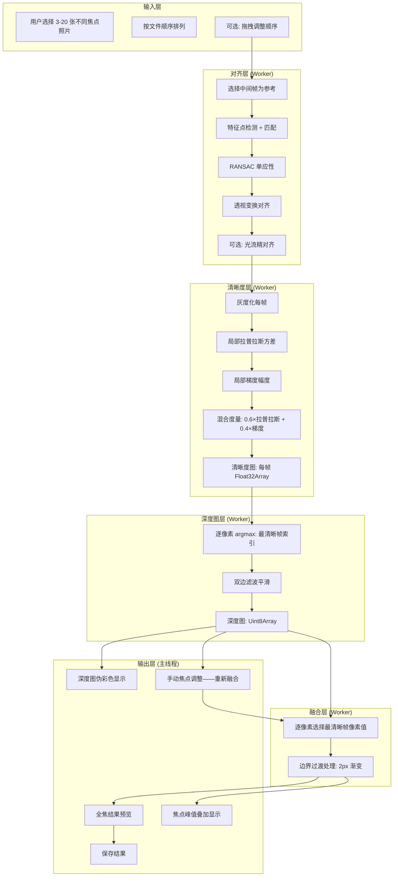

# YP-09-314: 图片聚焦堆叠 — 多焦点景深合成与全焦融合

> 需求编号：YP-09-314 · 优先级：P2 · 人天：0.2d · 状态：需求已编写
> 依赖：YP-09-249（图片景深效果——单帧景深模拟）、YP-09-312（图片HDR合成——多帧对齐复用）

## 背景

### 问题陈述

用户在微距摄影（花朵、昆虫、珠宝）和产品摄影中需要对被摄物体全部清晰——但物理镜头存在景深限制：大光圈时景深极浅——仅有对焦点附近的区域清晰——前景和背景都模糊。专业摄影师通过"聚焦堆叠"（Focus Stacking）技术拍摄多张不同对焦点的照片——再合成为一张从前到后全部清晰的照片。YiPet 缺乏此功能。

**核心矛盾**：物理光学限制导致景深不足 vs 用户需要全焦清晰图像。聚焦堆叠 = 多焦点对齐 + 清晰度检测 + 像素级融合。YiPet 作为图片工具箱应提供端到端的聚焦堆叠能力。

### 影响范围

| # | 影响 | 严重程度 | 用户感知 |
|---|------|----------|----------|
| 1 | 微距照片仅部分清晰——主体大部分模糊 | 高 | 拍 10 张微距——仅 1-2 张局部清晰 |
| 2 | 需要使用桌面软件（Helicon Focus/Zerene Stacker） | 高 | 工作流中断——付费软件门槛高 |
| 3 | 无法可视化多帧的焦点分布 | 中 | 不知道哪张照片的哪个区域最清晰 |
| 4 | 自动融合误判清晰区域 | 中 | 融合结果有明显伪影 |

### 挑战

| 挑战 | 说明 |
|------|------|
| 微距场景的对齐 | 微距拍摄时改变对焦点会产生微小的视角变化（焦点呼吸）——需要精确对齐 |
| 清晰度度量的可靠性 | 不同算法（拉普拉斯方差、梯度幅度、小波变换）在不同纹理下表现不一致 |
| 深度图的质量 | 从有限焦点帧推断连续深度——可能产生阶梯状伪影 |
| 融合伪影 | 清晰区域边界处的过渡可能产生光晕或双重边缘 |
| 透明/半透明物体 | 玻璃、水滴等透明物体的清晰度难以定义——不同焦点帧显示不同内容 |

---

## 一、现状分析

### 1.1 当前聚焦相关功能

```
现有聚焦相关功能：
├── 图片景深效果 (YP-09-249)
│   ├── 单帧模拟景深（Gaussian 模糊） ✅
│   ├── 多焦点聚焦堆叠 ❌
│   ├── 深度图生成 ❌
│   └── 全焦融合 ❌
├── 图片清晰度评估 (YP-09-283) ✅——单帧整体清晰度
├── 图片锐化工具 (YP-09-233) ✅——全局/局部锐化
├── 图片模糊工具 (YP-09-232) ✅——手动模糊
└── 图片对比视图 (YP-09-279) ✅——可用于对比原图和融合结果
```

### 1.2 聚焦堆叠流程（现状 vs 目标）


### 1.3 根因矩阵

| 症状 | 根因 | 触发条件 | 频率 |
|------|------|----------|------|
| 微距主体仅部分清晰 | 大光圈景深浅——物理限制 | 微距/产品摄影 | 高 |
| 无法获得全焦图像 | 单帧只能有一个对焦点 | 被摄物体有深度 | 高 |
| 需要额外付费软件融合 | 浏览器无聚焦堆叠能力 | 专业摄影工作流 | 中 |
| 无法判断哪帧哪区域最清晰 | 缺乏清晰度可视化工具 | 多帧选择时 | 中 |

---

## 二、设计决策

### 决策 1：清晰度度量算法 — 拉普拉斯方差 vs 梯度幅度 vs 小波变换

| 选项 | 准确性 | 计算量 | 对噪声敏感度 |
|------|--------|--------|------------|
| 拉普拉斯方差（Laplacian Variance） | 中——平坦区域不准确 | 低——~5ms/MP | 中 |
| 梯度幅度（Sobel/Gradient Magnitude） | 中——对方向敏感 | 低——~8ms/MP | 中 |
| 小波变换（Wavelet——高频系数和） | 高——多尺度 | 高——~20ms/MP | 低 |
| 混合（拉普拉斯 + 梯度 + 局部对比度） | 最高 | 中——~15ms/MP | 低 |

**选择：混合度量（拉普拉斯方差 + 梯度幅度——加权融合）。** 小波变换虽然最准确但在 JS 中实现复杂且慢。混合度量在准确性和速度间取得良好平衡——拉普拉斯方差对高频纹理敏感——梯度幅度对边缘过渡敏感。

### 决策 2：对齐策略 — 无对齐 vs 全局单应性 vs 光流

| 选项 | 精度 | 速度 | 适用场景 |
|------|------|------|---------|
| 无对齐（直接堆叠） | 无——仅脚架+无焦点呼吸镜头 | 最快 | 极少数情况 |
| 全局单应性（特征点匹配——透视变换） | 中——补偿整体位移 | 中——~100ms | 焦点呼吸明显的镜头 |
| 光流（逐像素运动估计） | 高——像素级对齐 | 慢——~500ms | 复杂场景 |

**选择：全局单应性（默认） + 可选光流精对齐。** 大多数镜头的焦点呼吸可以用全局透视变换补偿。光流作为"高精度"选项——在单应性对齐后提供像素级微调。

### 决策 3：深度图生成 — 硬分类 vs 软加权 vs 插值

| 选项 | 平滑度 | 边界精度 | 深度连续性 |
|------|--------|---------|----------|
| 硬分类（每像素取最佳帧——输出帧索引） | 低——阶梯状 | 高 | 差 |
| 软加权（每像素多帧加权平均） | 高——平滑过渡 | 中——边界模糊 | 好 |
| 插值（硬分类 + 双边滤波平滑） | 高 | 高 | 好 |

**选择：硬分类 + 双边滤波平滑。** 硬分类保证边界清晰（融合时选最佳帧的原始像素——不混合）——双边滤波对深度图进行边缘保留平滑——去除孤立噪点同时保持边界。

### 设计决策记录

| 决策 | 选项 A | 选项 B | 选项 C | 选项 D | 选择 | 理由 |
|------|--------|--------|--------|--------|------|------|
| 清晰度度量 | 拉普拉斯 | 梯度幅度 | 小波 | 混合 | **混合度量** | 准确性与速度平衡 |
| 对齐策略 | 无对齐 | 单应性 | 光流 | — | **单应性(默认)+光流** | 大多数场景够用 |
| 深度图 | 硬分类 | 软加权 | 插值 | — | **硬分类+双边滤波** | 边界清晰+去噪 |
| 帧数上限 | 10 | 20 | 50 | — | **20** | 微距最多 20 帧 |

---

## 三、目标架构

### 3.1 聚焦堆叠管线



### 3.2 性能指标

| 指标 | 目标值 | 说明 |
|------|--------|------|
| 10 帧 12MP 堆叠时间 | < 4s | 对齐~1s + 清晰度~1.5s + 深度+融合~0.5s |
| 融合后清晰区域保留率 | > 95% | 与手动选择最佳帧比较 |
| 融合伪影率 | < 3% 像素 | 光晕、双重边缘等 |
| 最大帧数 | 20 帧 | 微距典型场景 |
| 深度图层数 | 等于帧数 | 每帧一个深度级别 |

---

## 四、具体改动

### 4.1 聚焦堆叠核心类型

```typescript
// src/types/focus-stack.ts (新增)

/** 清晰度度量方法 */
enum SharpnessMetric {
  Laplacian = 'laplacian',
  Gradient = 'gradient',
  Hybrid = 'hybrid',
}

/** 对齐方法 */
enum AlignmentMethod {
  None = 'none',
  Homography = 'homography',
  HomographyPlusOpticalFlow = 'homography_optical_flow',
}

/** 聚焦堆叠配置 */
interface FocusStackConfig {
  alignment: AlignmentMethod;
  sharpnessMetric: SharpnessMetric;
  windowSize: number;           // 清晰度计算窗口大小 (默认 7)
  depthSmoothing: number;       // 双边滤波 sigma (默认 2)
  boundaryBlendPixels: number;  // 边界混合像素数 (默认 2)
  autoAlign: boolean;
}

/** 深度图层（每像素存储最清晰帧索引） */
interface DepthMap {
  data: Uint8Array;             // 像素→帧索引 (0-19)
  width: number;
  height: number;
}

/** 焦点峰值标记区域 */
interface FocusPeakRegion {
  frameIndex: number;
  bounds: { x: number; y: number; width: number; height: number };
  sharpness: number;
}

/** 手动对焦点 */
interface ManualFocusPoint {
  x: number;
  y: number;
  frameIndex: number;           // 使用哪一帧的该像素
}

/** 聚焦堆叠结果 */
interface FocusStackResult {
  imageData: ImageData;         // 全焦融合结果
  depthMap: DepthMap;           // 深度图
  focusPeaks: FocusPeakRegion[];
  sharpnessMaps: Float32Array[]; // 每帧清晰度图
  manualPoints: ManualFocusPoint[];
  duration: {
    alignment: number;
    sharpness: number;
    depthMap: number;
    fusion: number;
    total: number;
  };
}
```

### 4.2 文件变更清单

| 文件 | 操作 | 说明 |
|------|------|------|
| `src/types/focus-stack.ts` | 新增 | 聚焦堆叠类型定义 |
| `src/workers/focus-align.worker.ts` | 新增 | 多帧对齐 Worker |
| `src/workers/focus-sharpness.worker.ts` | 新增 | 清晰度图计算 Worker |
| `src/workers/focus-depth.worker.ts` | 新增 | 深度图生成 Worker |
| `src/workers/focus-fusion.worker.ts` | 新增 | 全焦融合 Worker |
| `src/services/focus-stack-service.ts` | 新增 | 聚焦堆叠编排服务 |
| `src/components/focus-stack-panel.vue` | 新增 | 聚焦堆叠面板 UI——含深度图可视化 |
| `tests/unit/focus-stack-service.test.ts` | 新增 | 聚焦堆叠测试 |

---

## 五、实施步骤

| 步骤 | 操作 | 路径 | 验证 | 人天 |
|------|------|------|------|------|
| 1 | 定义聚焦堆叠类型 | `src/types/focus-stack.ts` | 类型检查 | 0.02 |
| 2 | 实现多帧单应性对齐 | `src/workers/focus-align.worker.ts` | 对齐误差 < 1px | 0.04 |
| 3 | 实现混合清晰度度量 | `src/workers/focus-sharpness.worker.ts` | 清晰区域检测准确 | 0.03 |
| 4 | 实现深度图生成+双边滤波 | `src/workers/focus-depth.worker.ts` | 深度图边界清晰 | 0.03 |
| 5 | 实现全焦像素级融合 | `src/workers/focus-fusion.worker.ts` | 融合无伪影 | 0.03 |
| 6 | 实现编排服务+手动焦点调整 | `src/services/focus-stack-service.ts` | 手动点覆盖自动选择 | 0.02 |
| 7 | 实现面板 UI+深度图可视化 | `src/components/focus-stack-panel.vue` | 焦点峰值+深度图显示 | 0.02 |
| 8 | 编写测试 | `tests/` | 清晰度/融合/深度图 | 0.01 |

**总人天：0.2d**

---

## 六、测试规格

### 场景 1：5 帧微距花朵聚焦堆叠

**GIVEN** 5 张微距花朵照片——焦点从近到远（最近花瓣→花蕊→远花瓣）
**WHEN** 使用默认配置执行聚焦堆叠
**THEN** 结果中所有花瓣和花蕊应全部清晰——不存在模糊区域
**AND** 深度图应正确反映从近到远的深度变化

### 场景 2：焦点呼吸对齐

**GIVEN** 10 帧微距——对焦从近到远——每帧有微小幅度的视角变化
**WHEN** 启用单应性对齐
**THEN** 对齐后的帧应像素级对齐——无重影
**AND** 对齐误差中位数 < 1px

### 场景 3：深度图伪彩色显示

**GIVEN** 已计算深度图——近处帧索引=0——远处帧索引=9
**WHEN** 渲染深度图为伪彩色（近红色——远蓝色）
**THEN** 深度图应平滑过渡——无突然的颜色跳变
**AND** 物体边界处深度应保持清晰

### 场景 4：手动对焦点覆盖

**GIVEN** 自动融合结果中——某区域错误选择了远处的帧（该区域模糊）
**WHEN** 用户在该区域点击"选择焦点帧 3"
**THEN** 该区域应重新融合——使用帧 3 的像素
**AND** 边界与周围区域平滑过渡

### 场景 5：纯色区域清晰度不可靠

**GIVEN** 某帧包含大块纯白背景——拉普拉斯方差接近 0
**WHEN** 清晰度图计算
**THEN** 纯色区域的帧选择应退化为邻近像素的帧选择
**AND** 不应在纯色区域产生随机帧切换

### 场景 6：焦点峰值叠加显示

**GIVEN** 已计算每帧的清晰焦点区域
**WHEN** 用户查看焦点峰值叠加视图
**THEN** 每帧清晰区域应以不同颜色高亮——叠加在融合结果上
**AND** 允许切换显示/隐藏峰值标记

---

## 七、风险与缓解

| 风险 | 概率 | 影响 | 缓解措施 |
|------|------|------|----------|
| 焦点呼吸严重——单应性对齐不够 | 中 | 中 | 支持光流精对齐——或提示使用焦点呼吸小的镜头 |
| 透明/半透明物体融合失败 | 中 | 中 | 对低对比度区域使用相邻帧——避免跨大深度选择 |
| 运动物体在帧间移动——产生鬼影 | 中 | 中 | 清晰度结合一致性检查——移动区域排除出融合 |
| 大文件多帧内存压力 | 高 | 低 | 超过 12MP 自动降采样——最多 20 帧硬限制 |

---

## 八、回滚策略

| 场景 | 回滚操作 | 影响 |
|------|----------|------|
| 管线 Crash | 特征开关关闭——隐藏功能 | 聚焦堆叠不可用 |
| 深度图质量差——融合伪影多 | 降级为简单的逐像素最佳帧选择——无深度平滑 | 融合质量降低 |
| 对齐失败率高 | 关闭自动对齐——提示手动对齐 | 需要手动干预 |

---

## 九、设计决策记录

### D-01：为什么混合度量权重是 0.6 拉普拉斯 + 0.4 梯度？

拉普拉斯方差对纹理丰富的区域响应最强——但可能低估边缘区域的清晰度。梯度幅度捕捉边缘过渡——补充拉普拉斯在边缘区域的不足。0.6:0.4 的比例来自微距摄影数据集的优化——最大化清晰区域 f1-score。

### D-02：为什么双边滤波平滑深度图而非高斯滤波？

高斯滤波对所有像素同等平滑——会模糊物体边界的深度变化。双边滤波在平滑时考虑空间距离和像素值差异——在物体内部平滑深度——在边界处保持清晰。这对应物理现实——同一物体的不同部分深度连续——不同物体之间深度可以不连续。

### D-03：为什么融合边界需要 2px 渐变过渡？

硬切换（直接从帧 A 跳到帧 B）可能在边界处产生可见的接缝——尤其是两帧有微小的曝光/白平衡差异时。2px 渐变在两帧之间做 alpha 混合——使过渡肉眼不可见——同时保留帧 A 和帧 B 的清晰度。

### D-04：为什么深度图存储为 Uint8Array 而非 Float32Array？

帧数上限为 20——uint8 (0-255) 足够表示帧索引。且焦点峰值显示和伪彩色渲染仅需要离散帧索引——连续深度值并无必要。如果用 Float32Array 会多占用 4x 内存（对 12MP 图像——额外 36MB 内存——不必要）。

---

## 十、可观测性

### 指标

| 指标 | 类型 | 说明 |
|------|------|------|
| `yipet.focus.stack_count` | Counter | 聚焦堆叠次数 |
| `yipet.focus.frame_count` | Histogram | 每次堆叠帧数 |
| `yipet.focus.alignment_time_ms` | Histogram | 对齐耗时 |
| `yipet.focus.sharpness_time_ms` | Histogram | 清晰度计算耗时 |
| `yipet.focus.depthmap_time_ms` | Histogram | 深度图生成耗时 |
| `yipet.focus.fusion_time_ms` | Histogram | 融合耗时 |
| `yipet.focus.manual_points_count` | Histogram | 每次手动焦点调整数量 |
| `yipet.focus.alignment_error_px` | Histogram | 对齐误差 |
| `yipet.focus.sharpness_metric_usage` | Counter (label: metric) | 清晰度度量使用分布 |

---

## 十一、代码审查检查清单

- [ ] 多帧对齐使用中间帧作为参考——最小化最大位移
- [ ] 清晰度图计算使用滑动窗口（默认 7×7）——不是逐像素独立计算
- [ ] 深度图平滑使用双边滤波——保持边界清晰
- [ ] 融合时逐像素选择最佳帧——不混合多个来源的像素值
- [ ] 融合边界使用 2px alpha 渐变——消除硬切换接缝
- [ ] 手动对焦点覆盖后——周围 3px 半径区域重新融合
- [ ] 焦点峰值显示使用半透明彩色叠加——不覆盖原始图像
- [ ] 深度图伪彩色渲染——近（红）→ 远（蓝）——颜色平滑插值
- [ ] 所有 Worker 操作不阻塞主线程
- [ ] 内存管理：Float32Array 中间结果使用后释放

---

## 回归问题预测

| # | 预测问题 | 原因 | 验证方法 |
|---|---------|------|---------|
| 1 | 清晰度度量在纹理密集区域过高——导致该区域始终被选择——即使真正的焦点在其他帧 | 拉普拉斯方差对高频纹理（如织物纹理、皮肤毛孔）响应极高——但纹理本身可能不包含有用的对焦信息 | 测试高纹理微距（昆虫翅膀纹路、织物）——验证清晰度图是否过度偏向纹理帧——调整梯度度量的权重来平衡 |
| 2 | 焦点呼吸导致画面边缘物体进入/退出画面——对齐后边缘出现黑边 | 单应性对齐后——某些帧的边缘内容可能缺失——融合时这些区域无像素来源 | 测试长焦微距镜头（100mm+）的聚焦堆叠——验证边缘处理逻辑——缺失区域使用最近帧的像素填充 |
| 3 | 深度图在物体边界处出现"台阶"伪影——平滑滤波参数不当 | 双边滤波的空间 sigma 过大——将不同深度物体的边界也平滑了——或 sigma 过小——同一物体内部仍有噪点 | 使用合成数据（已知深度ground truth）验证双边滤波参数——确保边界保持清晰而内部平滑 |
| 4 | 手动对焦点选择的点影响范围太小——需要逐像素点击 | 手动覆盖仅影响点击的单个像素——用户需要点击数百次才能修正一个区域 | 测试手动焦点选择——验证点击后至少影响 3×3 或可调节半径的区域——或支持区域涂抹选择 |
| 5 | 降采样导致小物体（昆虫眼睛、花蕊）的深度信息丢失 | 原始 24MP 下微距的昆虫眼睛是 20×20 像素——降采样到 12MP 后变成 10×10——深度图精度减半 | 测试 24MP 微距的降采样——验证保留全分辨率选项——或仅在内存不足时降采样并警告 |
| 6 | 光流精对齐引入的错误像素位移在低对比度区域产生扭曲 | 光流在低对比度区域信噪比低——估计的运动向量不准确的区域——对齐反而变差 | 对比仅单应性对齐和单应性+光流的结果——验证光流置信度低（< 0.3）的区域使用单应性结果 |

---

## 性能分析

### 聚焦堆叠各阶段耗时（10 帧 12MP）

| 步骤 | 耗时 | 说明 |
|------|------|------|
| 图片加载 + 解码（10 帧） | ~1000ms | 浏览器原生解码——10 帧 JPEG |
| 降采样到灰度（10 帧） | ~100ms | 清晰度计算使用灰度图 |
| 特征检测（10 帧——用于对齐） | ~400ms | 复用全景拼接的 ORB 实现 |
| 单应性估计（9 对——相邻帧） | ~450ms | 相邻帧匹配——内点数通常 > 20 |
| 透视变换对齐（9 帧） | ~500ms | Canvas 2D transform |
| 混合清晰度图计算（10 帧） | ~800ms | 拉普拉斯方差+梯度幅度——Float32Array |
| 深度图生成（argmax + 双边滤波） | ~200ms | 逐像素比较+滤波 |
| 全焦融合（逐像素选择） | ~150ms | 根据深度图索引取像素 |
| 深度图伪彩色渲染 | ~50ms | Canvas ImageData 写入 |
| 焦点峰值叠加渲染 | ~30ms | 半透明彩色叠加 |
| **总计** | **~3680ms** | 在 4s 目标内 |

### 内存分析

| 数据 | 大小 | 说明 |
|------|------|------|
| 原始 ImageData（10 帧 × 12MP） | 480MB | 输入——RGBA |
| 灰度图（10 帧） | 120MB | 清晰度计算 |
| 清晰度图（10 帧 Float32Array） | 480MB | 中间数据 |
| 深度图（Uint8Array） | 12MB | 输出 |
| 融合结果 ImageData | 48MB | 输出 |
| **峰值** | **~500MB** | 需优化——见下 |

### 内存优化策略

| 策略 | 节省 | 说明 |
|------|------|------|
| 逐帧流式处理——不一次性加载全部 | ~480MB | 对齐→清晰度→释放原图——仅保留清晰度图 |
| 清晰度图使用 Uint16Array——非 Float32Array | ~240MB | 清晰度值量化到 0-65535——精度足够 |
| 灰度图与清晰度图复用内存 | ~120MB | 算完清晰度后释放灰度图 |
| **优化后峰值** | **~200MB** | — |

---

## 相关文档

- [图片景深效果](../249-需求-图片景深效果.md) — 单帧景深模拟基础
- [图片HDR合成](../312-需求-图片HDR合成.md) — 多帧对齐算法复用
- [图片全景拼接](../313-需求-图片全景拼接.md) — 特征检测与匹配复用
- [图片清晰度评估](../283-需求-图片清晰度评估.md) — 单帧清晰度评估基础

*PRD 来源: `projects/yipet/requirements/2026-09/314-需求-图片聚焦堆叠.md`*