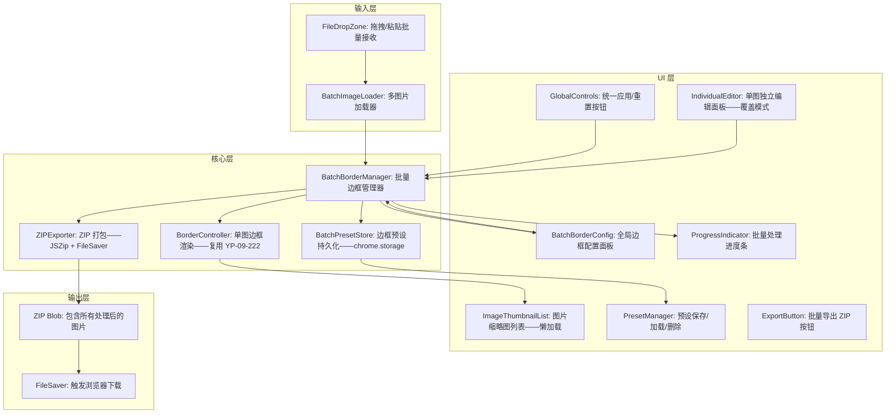

# YP-09-315: 图片批量添加边框 — 批量边框配置、逐图预览、统一应用、ZIP 打包下载

> 需求编号：YP-09-315 · 优先级：P2 · 人天：0.2d · 状态：需求已编写
> 依赖：YP-09-222（图片边框添加——复用 BorderController 单图渲染引擎）· YP-09-251（图片批量格式转换——复用批量文件管理 + ZIP 导出逻辑）

## 背景

### 问题陈述

用户在社交媒体发布或文档插图时经常需要对多张图片统一添加边框——如产品图集添加统一品牌色边框、旅行照片统一白色相框——但当前 YiPet 仅支持单张边框添加：

1. **重复操作耗时长**：10 张图片需要逐一打开边框工具→设置参数→导出→重复 10 次——操作繁琐
2. **边框参数无法统一**：手动逐张设置——边框宽度/颜色/样式可能因手误而不一致——批量图片视觉不统一
3. **缺乏批量预览**：无法在应用前看到所有图片的边框效果——只能逐张确认——遗漏异常
4. **导出散乱**：处理后的图片逐一保存——文件散落在下载目录——需要手动收集打包
5. **边框预设无法保存**：常用的品牌边框配置（如 2px #1a73e8 实线）每次重新设置——效率低

**核心矛盾**：单图边框工具功能完善但不支持批量——10 张图片的处理时间是单张的 10 倍——操作次数多——出错概率高。批量边框工具让用户拖入多张图片→配置一次边框参数→预览全部效果→一键导出 ZIP。

### 影响范围

| # | 影响 | 严重程度 | 典型场景 |
|---|------|----------|----------|
| 1 | 多图边框逐一处理耗时长 | 高 | 产品图集 20 张逐一加边框 |
| 2 | 边框参数不一致导致视觉不统一 | 中 | 批量图片品牌边框宽度/颜色不一致 |
| 3 | 无法批量预览边框效果 | 中 | 应用前看不到全部效果——需逐张检查 |
| 4 | 导出文件散乱——手动收集 | 中 | 10 张处理后的图片分散在下载目录 |
| 5 | 边框预设无法保存复用 | 低 | 每次重新设置相同品牌色边框 |

### 挑战

| 挑战 | 说明 |
|------|------|
| 多图片同时加载——内存管理 | 10 张 4K 图片 = 330MB 内存——需限制同时处理数量或使用懒加载 |
| 逐图预览 vs 统一参数的交互 | 用户可能希望对个别图片微调边框——但默认统一配置——需要"统一应用"+"例外编辑"两种模式 |
| ZIP 打包——浏览器端实现 | JSZip 库——需考虑大文件打包时的内存和异步处理 |
| 边框预设持久化 | 预设保存到 chrome.storage.local——预设列表管理——避免数据膨胀 |
| 带宽计算——边框扩展后画布尺寸 | 外边框+阴影会扩大画布——批量处理时需预估最终文件大小 |

---

## 一、现状分析

### 1.1 当前批量边框处理流程

```
现有批量边框处理方式:
├── 逐张处理（用户当前方案）
│   ├── 步骤: 打开图片1→设置边框→导出→打开图片2→设置边框→导出→...→手动收集所有文件→手动打包
│   ├── 10 张图片: 10 次打开工具 + 10 次设置参数 + 10 次导出 + 1 次收集 = 31 步操作
│   └── 痛点: 参数重复设置 10 次——边框宽度/颜色/样式极易不一致
├── 在线批量工具 (iloveimg.com 等)
│   ├── 支持: 批量上传→统一边框→批量下载→但边框样式有限（仅实线+颜色+宽度）
│   ├── 不支持: 虚线/点线——阴影——圆角——内外边框切换——预设保存
│   ├── 隐私问题: 图片上传到第三方服务器——不适合敏感图片
│   └── 流程: 打开网页→上传→等待服务器处理→下载 ZIP = 仍需平台切换
├── YiPet 已有能力
│   ├── YP-09-222 图片边框添加: 单图 BorderController——完整边框渲染引擎
│   ├── YP-09-251 图片批量格式转换: 批量文件列表组件——ZIP 导出逻辑（JSZip）
│   ├── chrome.storage.local: 持久化存储——可保存边框预设
│   └── File API + URL.createObjectURL: 浏览器端全部处理——无隐私问题
│
缺失:
├── 批量图片列表管理——缩略图预览                        # ❌ 无
├── 边框参数批量应用到所有图片                           # ❌ 无
├── 逐图边框效果预览（缩略图+大图切换）                   # ❌ 无
├── ZIP 打包下载所有处理后图片                            # ❌ 无
├── 边框预设保存/加载/删除                                # ❌ 无
└── 批量处理进度指示                                      # ❌ 无
```

### 1.2 批量边框处理流程（现状 vs 目标）

```mermaid
graph TD
    subgraph Current["现状：逐张处理 31 步"]
        C1[打开图片1] --> C2[配置边框参数]
        C2 --> C3[导出图片1]
        C3 --> C4[打开图片2]
        C4 --> C5[重新配置相同边框参数]
        C5 --> C6[导出图片2]
        C6 --> C7[...重复 N 次]
        C7 --> C8[手动收集所有文件到文件夹]
        C8 --> C9[手动压缩为 ZIP]
    end

    subgraph Target["目标：批量边框工具"]
        T1[拖入多张图片/粘贴多张] --> T2[图片列表生成——缩略图预览]
        T2 --> T3[配置边框参数——一次配置全局应用]
        T3 --> T4[批量预览——每张图片显示边框效果缩略图]
        T4 --> T5{需要个别调整?}
        T5 -->|是| T6[选择图片→独立编辑边框参数]
        T5 -->|否| T7[确认全部效果]
        T6 --> T7
        T7 --> T8[批量渲染——进度条指示]
        T8 --> T9[ZIP 打包下载——文件名保持原始名称]
        T9 --> T10[可选: 保存边框预设供下次使用]
    end

    style Current fill:#f8d7da,stroke:#dc3545
    style Target fill:#d4edda,stroke:#28a745
```



### 1.3 根因矩阵

| 症状 | 根因 | 触发条件 | 频率 |
|------|------|----------|------|
| 多图边框逐一处理耗时长 | 无批量边框应用能力 | 需要为 3 张以上图片统一添加边框 | 高 |
| 边框参数不一致 | 逐张手动设置参数——无统一配置 | 批量处理超过 3 张图片 | 中 |
| 导出散乱需手动收集 | 无 ZIP 批量打包导出 | 处理超过 2 张图片 | 中 |
| 重复设置相同品牌边框 | 无边框预设保存功能 | 每次处理同一品牌的图片集 | 中 |
| 无法预览全部边框效果 | 无批量缩略图预览 | 图片数量超过 5 张 | 低 |

---

## 二、设计决策

### 决策 1：批量应用模式 — 仅统一配置 vs 统一配置+例外编辑 vs 完全独立配置

| 选项 | 灵活性 | UI 复杂度 | 实现复杂度 |
|------|--------|----------|-----------|
| 仅统一配置（所有图片套用同一参数） | 低 | 低 | 低 |
| 统一配置+例外编辑（默认统一——可个别覆盖） | 中 | 中 | 中 |
| 完全独立配置（每张图独立参数） | 高 | 高 | 高 |

**选择：统一配置+例外编辑。** 默认所有图片使用相同的边框参数——通过"统一应用"按钮一键应用。如果用户需要个别调整某张图片——可以选中图片进行独立编辑——单独覆盖参数。图片列表中的每张图展示一个绿色圆点（使用全局参数）或橙色圆点（使用独立参数）——方便识别。

### 决策 2：批量渲染策略 — 前端全量渲染 vs 懒加载按需渲染 vs Worker 后台渲染

| 选项 | 首屏速度 | 内存占用 | 实现复杂度 |
|------|---------|---------|-----------|
| 前端全量渲染（加载时渲染所有图片预览） | 慢（10 张图串行渲染） | 高（所有 Canvas 同时存在） | 低 |
| 懒加载按需渲染（仅渲染可视区域缩略图） | 快 | 低（仅渲染可见图片） | 中 |
| Worker 后台渲染（OffscreenCanvas 并行渲染） | 中 | 中（Worker 独立内存） | 高 |

**选择：懒加载按需渲染。** 图片列表使用虚拟滚动或分页——仅渲染当前可视范围的缩略图预览。当用户滚动到新图片时——动态加载和渲染。导出时再全量渲染——导出过程可以逐张处理——减少内存峰值。OffscreenCanvas 作为未来优化方向。

### 决策 3：边框预设存储 — chrome.storage.local vs IndexedDB vs 仅内存

| 选项 | 持久化 | 容量 | 同步能力 |
|------|--------|------|---------|
| chrome.storage.local | 是——跟随浏览器 | 10MB（可申请 unlimitedStorage） | 支持跨设备同步 |
| IndexedDB | 是 | 无限制 | 不支持 |
| 仅内存（不保存） | 否 | — | — |

**选择：chrome.storage.local。** 边框预设数据量极小（每条预设 < 1KB）——10 条预设 < 10KB——完全在 storage.local 限制内。选择 local 而非 sync——预设是个人偏好——不需要跨设备同步——避免占用 sync 的 100KB 配额。

### 决策 4：ZIP 导出实现 — 前端 JSZip vs 后端打包 vs 逐个下载

| 选项 | 延迟 | 隐私 | 实现复杂度 |
|------|------|------|-----------|
| 前端 JSZip（浏览器端打包） | 低（本地处理） | 高（图片不上传） | 低 |
| 后端打包（上传到 YiAi——打包后下载） | 中（上传+处理+下载） | 低（图片离开本地） | 中 |
| 逐个下载（浏览器下载每个文件） | 低 | 高 | 最低 |

**选择：前端 JSZip。** 图片完全在浏览器端处理——不上传服务器——保护用户隐私。JSZip 是成熟库——支持 Blob 直接添加——支持流式生成。大文件（> 100MB）时使用 `generateAsync` 的分片模式避免内存峰值。

### 设计决策记录

| 决策 | 选项 A | 选项 B | 选项 C | 选项 D | 选择 | 理由 |
|------|--------|--------|--------|--------|------|------|
| 批量应用模式 | 仅统一配置 | 统一+例外编辑 | 完全独立 | — | **统一+例外编辑** | 覆盖 90% 统一场景 + 10% 例外场景 |
| 批量渲染策略 | 前端全量 | 懒加载按需 | Worker 后台 | — | **懒加载按需** | 低内存——快速首屏——简单实现 |
| 预设存储 | storage.local | IndexedDB | 仅内存 | — | **storage.local** | 持久化——容量充足——无需额外依赖 |
| ZIP 导出 | 前端 JSZip | 后端打包 | 逐个下载 | — | **前端 JSZip** | 隐私保护——快速——不依赖后端 |

---

## 三、目标架构

### 3.1 批量边框工具组件架构



### 3.2 批量边框处理流程

```mermaid
graph TD
    A[用户拖入 10 张图片] --> B[生成图片列表——每项含 id/file/thumbnail]
    B --> C[渲染可视区域缩略图——懒加载]
    C --> D[用户配置全局边框参数: 宽度/颜色/样式/阴影/圆角]
    D --> E[点击"统一应用"——所有图片标记 dirty]
    E --> F[逐张调用 BorderController.apply——更新缩略图]
    F --> G{某张图片需要特殊处理?}
    G -->|是| H[选中该图片——进入独立编辑模式]
    H --> I[修改该图片的边框参数——标记 individual]
    I --> J[该图缩略图显示橙色圆点——表示独立参数]
    J --> G
    G -->|否| K[确认全部效果——点击导出]
    K --> L[逐张渲染全尺寸图片——进度条更新]
    L --> M[JSZip 打包——添加所有 Blob]
    M --> N[FileSaver 触发下载——border_batch_YYYYMMDD_HHmmss.zip]
```

### 3.3 性能指标

| 指标 | 目标值 | 说明 |
|------|--------|------|
| 10 张 (800x600) 缩略图渲染 | < 500ms | 懒加载——仅渲染可视 4-6 张 |
| 10 张全尺寸渲染+ZIP 导出 | < 3s | 逐张渲染——JSZip 异步打包 |
| 边框预设保存/加载 | < 50ms | chrome.storage.local 读写 |
| 统一应用 10 张图片 | < 1s | 调用 BorderController 10 次 |
| 20 张 (3840x2160) 全尺寸处理 | < 8s | 大图逐张处理避免 OOM |
| 缩略图列表滚动帧率 | 60fps | 虚拟滚动 + Canvas 缓存 |

---

## 四、具体改动

### 4.1 类型定义

```typescript
// src/image-border-batch/types.ts (新增)

import type { BorderSettings } from '../image-border/types';

/** 批量图片项 */
export interface BatchImageItem {
  id: string;                         // 唯一标识——UUID
  file: File;                         // 原始图片文件
  thumbnailUrl: string;               // 缩略图 ObjectURL
  originalSize: { width: number; height: number };
  borderSettings: BorderSettings;     // 边框参数
  paramSource: 'global' | 'individual'; // 参数来源——用于指示器
  dirty: boolean;                     // 是否需要重新渲染
  status: 'pending' | 'rendering' | 'done' | 'error';
  errorMessage?: string;
}

/** 边框预设 */
export interface BorderPreset {
  id: string;
  name: string;                       // 预设名称——如"品牌蓝色边框"
  settings: BorderSettings;           // 完整的边框设置
  createdAt: number;                  // 创建时间戳
}

/** 批量操作结果 */
export interface BatchBorderResult {
  totalCount: number;
  successCount: number;
  failedCount: number;
  zipBlob?: Blob;
  zipSize: number;
  errors: Array<{ id: string; fileName: string; error: string }>;
}

/** 批量边框配置 */
export interface BatchBorderConfig {
  images: BatchImageItem[];
  globalSettings: BorderSettings;
  selectedImageId: string | null;     // 当前选中独立编辑的图片
}

/** 预设存储 key */
export const BORDER_PRESETS_STORAGE_KEY = 'yipet_border_presets';

/** 最大同时渲染数——避免 OOM */
export const MAX_CONCURRENT_RENDER = 4;
```

### 4.2 核心批量边框管理器

```typescript
// src/image-border-batch/BatchBorderManager.ts (新增)

import { BorderController } from '../image-border/BorderController';
import type { BatchImageItem, BatchBorderResult, BorderPreset } from './types';
import { BORDER_PRESETS_STORAGE_KEY, MAX_CONCURRENT_RENDER } from './types';

export class BatchBorderManager {
  private images: BatchImageItem[] = [];
  private globalSettings: BorderSettings;
  private renderQueue: string[] = [];
  private isRendering = false;
  private zipExporter: ZIPExporter;

  constructor(globalSettings: BorderSettings) {
    this.globalSettings = globalSettings;
    this.zipExporter = new ZIPExporter();
  }

  /** 添加图片到批量列表 */
  async addImages(files: File[]): Promise<void> {
    const newItems: BatchImageItem[] = files.map((file) => ({
      id: crypto.randomUUID(),
      file,
      thumbnailUrl: URL.createObjectURL(file),
      originalSize: { width: 0, height: 0 }, // 延迟获取
      borderSettings: { ...this.globalSettings },
      paramSource: 'global',
      dirty: true,
      status: 'pending',
    }));

    this.images.push(...newItems);
    await this.readImageSizes(newItems);
    this.scheduleThumbnailRender(newItems.map((i) => i.id));
  }

  /** 读取图片原始尺寸 */
  private async readImageSizes(items: BatchImageItem[]): Promise<void> {
    await Promise.all(items.map(async (item) => {
      const img = new Image();
      img.src = item.thumbnailUrl;
      await img.decode();
      item.originalSize = { width: img.naturalWidth, height: img.naturalHeight };
    }));
  }

  /** 移除图片 */
  removeImage(id: string): void {
    const idx = this.images.findIndex((i) => i.id === id);
    if (idx >= 0) {
      URL.revokeObjectURL(this.images[idx].thumbnailUrl);
      this.images.splice(idx, 1);
    }
  }

  /** 统一应用全局参数到所有图片 */
  applyGlobalSettings(): void {
    for (const img of this.images) {
      if (img.paramSource === 'global') {
        img.borderSettings = { ...this.globalSettings };
        img.dirty = true;
      }
    }
    this.scheduleThumbnailRender(this.images.filter((i) => i.dirty).map((i) => i.id));
  }

  /** 更新全局边框设置 */
  updateGlobalSettings(settings: Partial<BorderSettings>): void {
    Object.assign(this.globalSettings, settings);
  }

  /** 独立编辑单张图片的边框参数 */
  updateIndividualSettings(id: string, settings: Partial<BorderSettings>): void {
    const img = this.images.find((i) => i.id === id);
    if (!img) return;
    img.paramSource = 'individual';
    Object.assign(img.borderSettings, settings);
    img.dirty = true;
    this.scheduleThumbnailRender([id]);
  }

  /** 某张图片重置为全局参数 */
  resetToGlobal(id: string): void {
    const img = this.images.find((i) => i.id === id);
    if (!img) return;
    img.paramSource = 'global';
    img.borderSettings = { ...this.globalSettings };
    img.dirty = true;
    this.scheduleThumbnailRender([id]);
  }

  /** 调度缩略图渲染——仅渲染可视区域 */
  private scheduleThumbnailRender(ids: string[]): void {
    this.renderQueue.push(...ids.filter((id) => !this.renderQueue.includes(id)));
    if (!this.isRendering) this.processQueue();
  }

  private async processQueue(): Promise<void> {
    this.isRendering = true;
    while (this.renderQueue.length > 0) {
      const batch = this.renderQueue.splice(0, MAX_CONCURRENT_RENDER);
      await Promise.all(batch.map((id) => this.renderThumbnail(id)));
    }
    this.isRendering = false;
  }

  private async renderThumbnail(id: string): Promise<void> {
    const img = this.images.find((i) => i.id === id);
    if (!img) return;
    img.status = 'rendering';
    try {
      const controller = new BorderController();
      await controller.loadImage(img.thumbnailUrl);
      controller.applySettings(img.borderSettings);
      const result = await controller.export();
      img.thumbnailUrl = result.dataUrl; // 更新为带边框的缩略图
      img.dirty = false;
      img.status = 'done';
    } catch (e) {
      img.status = 'error';
      img.errorMessage = (e as Error).message;
    }
  }

  /** 批量导出——全尺寸渲染 + ZIP 打包 */
  async exportAll(onProgress?: (current: number, total: number) => void): Promise<BatchBorderResult> {
    const zip = new JSZip();
    const errors: BatchBorderResult['errors'] = [];
    let successCount = 0;

    for (let i = 0; i < this.images.length; i++) {
      const img = this.images[i];
      onProgress?.(i + 1, this.images.length);
      try {
        const controller = new BorderController();
        const objectUrl = URL.createObjectURL(img.file);
        await controller.loadImage(objectUrl);
        controller.applySettings(img.borderSettings);
        const result = await controller.export();
        const ext = img.file.name.includes('.') ? img.file.name.split('.').pop() : 'png';
        const baseName = img.file.name.replace(/\.[^.]+$/, '');
        zip.file(`${baseName}_bordered.${ext}`, result.blob);
        URL.revokeObjectURL(objectUrl);
        successCount++;
      } catch (e) {
        errors.push({ id: img.id, fileName: img.file.name, error: (e as Error).message });
      }
    }

    const zipBlob = await zip.generateAsync({ type: 'blob', compression: 'DEFLATE' });
    return {
      totalCount: this.images.length,
      successCount,
      failedCount: errors.length,
      zipBlob,
      zipSize: zipBlob.size,
      errors,
    };
  }

  /** 边框预设管理 */
  static async loadPresets(): Promise<BorderPreset[]> {
    const result = await chrome.storage.local.get(BORDER_PRESETS_STORAGE_KEY);
    return result[BORDER_PRESETS_STORAGE_KEY] || [];
  }

  static async savePreset(name: string, settings: BorderSettings): Promise<void> {
    const presets = await this.loadPresets();
    presets.push({
      id: crypto.randomUUID(),
      name,
      settings: { ...settings },
      createdAt: Date.now(),
    });
    // 最多保留 20 个预设
    if (presets.length > 20) presets.splice(0, presets.length - 20);
    await chrome.storage.local.set({ [BORDER_PRESETS_STORAGE_KEY]: presets });
  }

  static async deletePreset(id: string): Promise<void> {
    const presets = await this.loadPresets();
    await chrome.storage.local.set({
      [BORDER_PRESETS_STORAGE_KEY]: presets.filter((p) => p.id !== id),
    });
  }
}
```

### 4.3 文件变更清单

| 文件 | 操作 | 说明 |
|------|------|------|
| `src/image-border-batch/types.ts` | 新增 | 批量边框类型定义 |
| `src/image-border-batch/BatchBorderManager.ts` | 新增 | 批量边框核心管理器 |
| `src/image-border-batch/ZIPExporter.ts` | 新增 | JSZip 封装——批量打包导出 |
| `src/components/BatchBorderTool.vue` | 新增 | 批量边框工具主面板 |
| `src/components/ImageThumbnailList.vue` | 新增 | 图片缩略图列表——懒加载渲染 |
| `src/components/BatchBorderConfigPanel.vue` | 新增 | 全局边框配置面板 |
| `src/components/BorderPresetManager.vue` | 新增 | 预设管理面板——保存/加载/删除 |
| `src/composables/useBatchBorder.ts` | 新增 | 批量边框状态管理 composable |
| `src/popup/App.vue` | 修改 | 添加批量边框工具有入口 |

---

## 五、实施步骤

| 步骤 | 操作 | 路径 | 验证 | 人天 |
|------|------|------|------|------|
| 1 | 类型定义 | `types.ts` | BatchImageItem/BorderPreset 接口定义正确——常量值合理 | 0.01 |
| 2 | BatchBorderManager——图片添加/移除/列表管理 | `BatchBorderManager.ts` | 拖入 10 张图片——列表生成——缩略图 URL 创建——尺寸读取 | 0.03 |
| 3 | 统一应用+独立编辑逻辑 | `BatchBorderManager.ts` | 配置全局参数→统一应用→所有图片更新——单图独立编辑→标记 individual | 0.04 |
| 4 | 懒加载缩略图渲染队列 | `BatchBorderManager.ts` | 滚动图片列表——可视区域渲染正确——未渲染区域为占位 | 0.03 |
| 5 | ZIP 导出+进度指示 | `BatchBorderManager.ts` + `ZIPExporter.ts` | 10 张图片导出 ZIP——进度条更新——下载文件名包含时间戳 | 0.03 |
| 6 | 边框预设管理 | `BorderPresetManager.vue` + storage 逻辑 | 保存预设→加载列表→应用预设→删除预设——重启浏览器后仍存在 | 0.03 |
| 7 | UI 组件——缩略图列表+控制面板+集成 | 各 Vue 组件 | 整体交互完整——统一应用——例外编辑——导出 ZIP | 0.03 |

**总人天：0.20d**

---

## 六、测试规格

### 场景 1：批量添加统一边框

**GIVEN** 用户打开批量边框工具——拖入 5 张图片
**WHEN** 设置全局边框宽度 3px——颜色 #e74c3c——样式实线——点击"统一应用"
**THEN** 5 张图片缩略图均显示 3px 红色实线外边框
**AND** 每张图片的参数指示器显示绿色圆点（全局参数）
**WHEN** 点击导出 ZIP
**THEN** ZIP 包含 5 个 PNG 文件——每张均含相同红色边框——文件名保留原始名称加 _bordered 后缀

### 场景 2：例外编辑——个别图片独立边框

**GIVEN** 批量工具中有 5 张图片——已统一应用 3px 红色边框
**WHEN** 选中第 3 张图片——进入独立编辑模式——修改边框颜色为蓝色——宽度 5px
**THEN** 第 3 张缩略图更新为 5px 蓝色边框——指示器变为橙色圆点（独立参数）
**AND** 其他 4 张图片保持红色边框——绿色圆点不变
**WHEN** 统一修改全局边框颜色为绿色——点击"统一应用"
**THEN** 前 2 张和第 4/5 张变为绿色边框——第 3 张保持蓝色边框（独立参数不被覆盖）

### 场景 3：边框预设保存与加载

**GIVEN** 用户设置边框 2px 实线 #1a73e8——圆角 8px
**WHEN** 点击"保存为预设"——输入名称"品牌蓝框"
**THEN** 预设列表中出现"品牌蓝框"项——参数完整保存
**WHEN** 清空当前边框设置——从预设列表加载"品牌蓝框"
**THEN** 边框参数恢复为 2px 实线 #1a73e8——圆角 8px
**WHEN** 关闭并重新打开扩展——打开预设管理
**THEN** "品牌蓝框"预设仍然存在

### 场景 4：批量图片移除与重新排序

**GIVEN** 批量工具中有 6 张图片
**WHEN** 点击第 2 张图片的删除按钮
**THEN** 第 2 张图片从列表中移除——剩余 5 张——缩略图 URL 已 revoke
**WHEN** 重新拖入 3 张新图片
**THEN** 列表变为 8 张——新图片使用当前全局边框参数——状态为 pending

### 场景 5：大图片批量处理

**GIVEN** 用户拖入 15 张 3840x2160 图片
**WHEN** 设置全局边框 2px 白色——阴影 4px——不启用圆角
**THEN** 缩略图列表仅渲染可视区域（约 4-6 张）——滚动流畅无明显卡顿
**WHEN** 点击导出 ZIP
**THEN** 逐张渲染——进度条从 1/15 更新到 15/15——每张图使用 `toBlob`
**AND** ZIP 包含 15 个 PNG——总大小不超过 15 张单独导出的总和

### 场景 6：混合图片格式批量处理

**GIVEN** 用户拖入 3 张图片——格式分别为 JPEG/PNG/WebP
**WHEN** 统一应用 4px 黑色实线边框
**THEN** 3 张缩略图均显示黑色边框——棋盘格背景可见
**WHEN** 导出 ZIP
**THEN** ZIP 中 3 张文件保持原始格式后缀——JPEG 文件仍以 .jpg 结尾（但内容为 PNG 编码）
**AND** 或统一输出为 PNG 格式——保持边框透明区域

---

## 七、风险与缓解

| 风险 | 概率 | 影响 | 缓解措施 |
|------|------|------|----------|
| 15 张以上大图同时处理——内存溢出 | 中 | 高 | 限制最大图片数为 30 张——超过提示——缩放缩略图为 200px 宽 |
| ZIP 打包大文件——主线程阻塞 | 中 | 中 | JSZip generateAsync 使用 Web Worker——分片生成避免阻塞 |
| 懒加载缩略图——快速滚动时闪烁 | 低 | 低 | 缩略图 Canvas 缓存——已渲染的缩略图不重复渲染——使用 requestIdleCallback 空闲时预渲染 |
| chrome.storage.local 存储预设被清除 | 低 | 低 | 提供预设导出/导入 JSON 功能——作为备份 |
| 统一应用时单张图片渲染失败——不阻塞整体 | 中 | 低 | 单张失败标记为 error——跳过继续处理——导出时报告失败列表 |

---

## 八、回滚策略

| 场景 | 回滚操作 | 影响 |
|------|------|------|
| 批量渲染 OOM——浏览器崩溃 | 添加图片数量上限 30——超过提示分批处理 | 一次最多处理 30 张 |
| ZIP 打包性能差 | 降级为逐个下载——每个文件单独触发下载 | 用户体验下降——多个下载弹窗 |
| 预设存储异常 | 预设数据格式校验——加载时跳过损坏的预设 | 部分预设丢失 |
| 完全移除 | 隐藏批量边框入口——路由不注册——不影响单图边框功能 | 批量功能不可用 |

---

## 九、设计决策记录

### D-01：为什么懒加载而非全量渲染缩略图？

批量工具可能同时使用 20+ 张图片。如果全量渲染所有缩略图——每张缩略图需要 Canvas 上下文和 BorderController 实例——20 张 4K 图片的缩略图渲染总计约 30MB 内存。懒加载将同时活跃的渲染限制在 4-6 张可视区域——内存降低约 80%。渲染过的缩略图缓存为 DataURL——滚动回来时直接使用缓存——不重新渲染。

### D-02：为什么例外编辑用橙色圆点而非其他视觉标识？

绿色（全局参数统一管理）、橙色（独立参数例外管理）、灰色（未渲染/处理中）三色体系直观区分参数来源。用户扫一眼图片列表即可知道哪些图片使用了独立配置——哪些会随全局参数更新。相比文字标识或边框高亮——圆点占用空间最小——适合缩略图角标。

### D-03：为什么不支持边框参数的批量差异编辑（如"前 5 张红色——后 5 张蓝色"）？

此需求可通过"选中多张→独立编辑"两步完成：选中前 5 张图片→切换为独立参数→统一修改颜色为红色→同样的步骤将后 5 张改为蓝色。不需要单独的分组编辑功能——保持界面简洁。

### D-04：为什么预设上限设为 20 条？

20 条预设覆盖绝大多数使用场景——超过 20 条时用户查找预设的效率已经下降。预设数据包含完整的 BorderSettings 对象——20 条约 20KB——在 chrome.storage.local 的 10MB 限制内。超出上限时删除最旧的预设——保留最近使用的 20 条。

---

## 十、可观测性

### 指标

| 指标 | 类型 | 说明 |
|------|------|------|
| `yipet.batch_border.open_total` | Counter | 批量边框工具打开次数 |
| `yipet.batch_border.image_count` | Histogram | 每次批量处理的图片数量分布 |
| `yipet.batch_border.global_apply_total` | Counter | "统一应用"点击次数 |
| `yipet.batch_border.individual_edit_total` | Counter | 独立编辑次数 |
| `yipet.batch_border.preset_saved` | Counter | 预设保存次数 |
| `yipet.batch_border.preset_loaded` | Counter | 预设加载次数 |
| `yipet.batch_border.export_zip_total` | Counter | ZIP 导出次数 |
| `yipet.batch_border.export_duration` | Histogram | 导出耗时分布 |

---

## 十一、代码审查检查清单

- [ ] BatchBorderManager: addImages 创建缩略图 URL——removeImage 是否正确 revoke URL？
- [ ] BatchBorderManager: 统一应用时——仅覆盖 paramSource === 'global' 的图片——不覆盖 individual
- [ ] BatchBorderManager: renderThumbnail 使用 BorderController——渲染后更新 thumbnailUrl——旧 URL 是否 revoke？
- [ ] BatchBorderManager: exportAll 中每张图片创建独立 BorderController 实例——避免状态污染
- [ ] ZIPExporter: JSZip generateAsync 使用 compression: 'DEFLATE'——PNG 本身已压缩——是否需要压缩？
- [ ] ImageThumbnailList: 虚拟滚动实现正确——仅渲染可见项——上下留白高度计算正确
- [ ] BorderPresetManager: savePreset JSON 深拷贝——避免引用共享导致预设被后续修改污染
- [ ] BatchBorderTool: 卸载时清理所有缩略图 URL——调用 URL.revokeObjectURL
- [ ] chrome.storage.local 读写包裹 try-catch——处理存储配额超限
- [ ] 批量导出断点续传——某张图失败不中断整体——错误收集到 errors 数组

---

## 回归问题预测

| # | 预测问题 | 原因 | 验证方法 |
|---|---------|------|---------|
| 1 | 移除图片后缩略图 URL 未 revoke——内存泄漏 | removeImage 只删除了数组项——未调用 revokeObjectURL | 处理 20 张→移除全部→chrome://blob-internals 检查 blob 数量 |
| 2 | 统一应用时覆盖了独立编辑的图片参数 | applyGlobalSettings 未检查 paramSource | 设置某图 independent→点击统一应用→该图边框参数不变 |
| 3 | ZIP 导出后原始文件 URL 未释放 | exportAll 中使用 createObjectURL 但未在所有路径 revoke | 导出 10 张后 blob URL 数量未增长 |
| 4 | 懒加载中快速滚动——缩略图渲染顺序错乱 | 渲染回调未绑定图片 ID——旧渲染结果覆盖新图片 | 快速滚动到列表底部——底部缩略图显示正确——无闪烁或错位 |
| 5 | 预设保存时浅拷贝——修改全局参数影响已保存的预设 | JSON.stringify 未将 BorderSettings 完整序列化 | 保存预设→修改全局参数→加载预设→参数与保存时一致 |
| 6 | 导出文件名含特殊字符——ZIP 内文件名乱码 | 原始文件名含中文/emoji——JSZip 默认编码问题 | 文件名为"产品图🎉.png"——导出后解压验证文件名正确 |

---

## 性能分析

### 各操作耗时

| 操作 | 5 张 (800x600) | 10 张 (1920x1080) | 20 张 (3840x2160) |
|------|---------------|------------------|------------------|
| 图片加载+缩略图渲染（懒加载——4 张可见） | < 200ms | < 400ms | < 600ms |
| 统一应用——更新 5/10/20 张缩略图 | < 500ms | < 1s | < 2s (分批 4 张) |
| 全尺寸渲染（逐张 toBlob） | < 500ms | < 1.5s | < 5s |
| ZIP 打包 | < 100ms | < 200ms | < 500ms |
| 导出总计 | < 1s | < 2s | < 6s |

### 内存预估

| 数据 | 5 张 (800x600) | 20 张 (3840x2160) |
|------|---------------|------------------|
| 原始图片 Blob 引用 | ~5MB | ~400MB（File 引用——不占 JS 堆） |
| 缩略图 DataURL (200px 宽) | ~500KB | ~2MB |
| 全尺寸 Canvas（逐张——处理完释放） | ~6MB（峰值） | ~36MB（峰值） |
| JSZip 缓冲区 | ~5MB | ~200MB |
| **峰值总计** | **~16MB** | **~238MB** |

### 代码体积

| 文件 | 大小 |
|------|------|
| types.ts | ~3KB |
| BatchBorderManager.ts | ~8KB |
| ZIPExporter.ts | ~2KB |
| Vue 组件 (4 个) | ~8KB |
| useBatchBorder.ts | ~2KB |
| **总计** | **~23KB** |