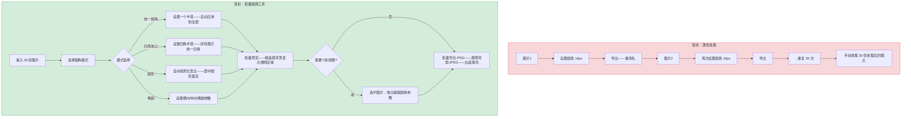
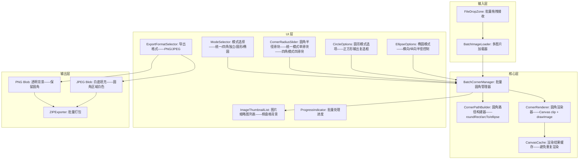

# YP-09-316: 图片批量圆角处理 — 独立/统一圆角半径、圆形/椭圆模式、透明背景、批量下载

> 需求编号：YP-09-316 · 优先级：P2 · 人天：0.2d · 状态：需求已编写
> 依赖：YP-09-220（图片圆角工具——复用 roundRect 路径裁剪 + 圆角计算逻辑）· YP-09-315（图片批量添加边框——复用批量文件管理 + 缩略图列表 + ZIP 导出）

## 背景

### 问题陈述

用户在产品展示/头像制作/社交媒体配图时经常需要对多张图片进行圆角处理——如产品图集统一圆角 16px、批量处理用户头像为圆形——但当前 YiPet 仅支持单张圆角：

1. **圆形头像批量制作**：团队入职——需要将 30 张照片统一裁剪为圆形——逐一处理耗时巨大
2. **圆角半径无法统一**：多张图片逐一设置圆角——手工设置半径不一致——视觉不统一
3. **四角独立控制无法批量**：某些设计场景需要仅左上/右上圆角——其他角为直角——逐张调整极易出错
4. **椭圆模式缺失**：某些场景需要横向/纵向椭圆裁剪（如横幅头图）——仅圆形无法满足
5. **批量预览+Rename 缺失**：无法在应用前看到所有图片的圆角效果——导出文件名混乱

**核心矛盾**：圆角是最基础但最常用的图片处理操作之一——单张处理在批量场景下效率极低。批量圆角工具让用户一次拖入图片→选择圆角模式→统一/独立控制半径→实时全览效果→一键导出。

### 影响范围

| # | 影响 | 严重程度 | 典型场景 |
|---|------|----------|----------|
| 1 | 多张圆角逐一处理时间 N 倍增长 | 高 | 30 张头像批量转圆形——逐张 30 次操作 |
| 2 | 圆角半径不一致——多图视觉不统一 | 中 | 产品图片集圆角半径 12/14/16px 混用 |
| 3 | 四角独立控制批量操作极易出错 | 中 | 仅左上右上圆角——视觉设计需求 |
| 4 | 缺少椭圆/Circle 一键模式 | 中 | 圆形头像——需手动计算等宽高裁剪区 |
| 5 | 无法批量预览圆角效果——需逐张确认 | 低 | 应用前看不到全部效果——遗漏切边异常 |

### 挑战

| 挑战 | 说明 |
|------|------|
| 统一 vs 独立半径的参数模型 | 统一模式：全部图片同一半径——独立模式：每张图片可设不同半径——需两种模式切换 |
| 圆形/椭圆裁剪的智能检测 | 圆形需识别图片长宽比——自动使用 min(width,height)/2 作为半径——横图变椭圆 |
| 四角独立圆角+批量预览的性能 | 每张图 4 个角各不同半径——roundRect 路径绘制复杂度增加——但仍在可接受范围 |
| 透明背景的棋盘格预览 | 圆角区域外的像素需要透明——PNG 导出保持透明——棋盘格辅助预览 |
| 批量圆角的尺寸保持策略 | 圆角裁剪不改变画布尺寸——但圆形模式下用户可能期望缩小到正方形画布 |

---

## 一、现状分析

### 1.1 当前批量圆角处理流程

```
现有批量圆角处理方式:
├── 逐张处理（用户当前方案）
│   ├── Photoshop 批量动作: 录制圆角动作→批处理——需要 PS——启动慢——操作门槛高
│   ├── 在线工具 (round-corner.imageonline.co): 单张处理——无批量模式
│   ├── Figma 批量圆角: 选中多张→右侧面板统一设置——但仅设计阶段——不能导出
│   └── 步骤: 图片1→设置圆角→导出→图片2→设置相同圆角→导出→...→手动收集
├── 命令行工具 (ImageMagick convert)
│   ├── `convert input.jpg -alpha set -background none ( +clone -alpha extract -draw 'roundrectangle 0,0 %w,%h,16,16' ) -alpha off -compose CopyOpacity -composite output.png`
│   ├── 优点: 批量处理——脚本化
│   ├── 缺点: 需安装——命令行操作——无预览——对普通用户门槛极高
│   └── 无四角独立控制——无圆形检测
├── YiPet 已有能力
│   ├── YP-09-220 图片圆角工具: roundRect 路径裁剪——单个/四角统一/四角独立圆角——ClipPath
│   ├── YP-09-315 批量边框: 图片列表——缩略图预览——懒加载渲染——ZIP 导出
│   └── Canvas API: ctx.clip + roundRect——clip 后 drawImage——完美保留原始分辨率
│
缺失:
├── 批量圆角半径统一应用——一次配置全局生效                # ❌ 无
├── 单图独立圆角编辑——覆盖全局参数                          # ❌ 无
├── 圆形模式——自动计算等宽高裁剪半径                         # ❌ 无
├── 椭圆模式——横向/纵向椭圆裁剪                              # ❌ 无
├── 四角批量独立控制（左上/右上/右下/左下不同半径）           # ❌ 无
├── 棋盘格背景——批量缩略图透明预览                           # ❌ 无
└── 导出格式选择——PNG（保留透明）或 JPEG（白底填充）          # ❌ 无
```

### 1.2 批量圆角处理流程（现状 vs 目标）



### 1.3 根因矩阵

| 症状 | 根因 | 触发条件 | 频率 |
|------|------|----------|------|
| 多图圆角逐一处理耗时长 | 无批量圆角能力——需单张处理 | 需要 3 张以上图片统一圆角 | 高 |
| 圆角半径不一致 | 逐张手动设置——无统一参数 | 批量处理超过 3 张 | 中 |
| 圆形头像需手动计算裁剪区 | 无圆形自动检测——无快捷模式 | 制作圆形头像/图标 | 中 |
| 四角独立批量操作易错 | 手动逐个角设置——重复操作 | 仅左上右上圆角的需求 | 中 |
| 批量圆角后透明区域无法预览 | 无棋盘格背景——缩略图白色背景 | 圆角导出为 PNG 透明 | 低 |

---

## 二、设计决策

### 决策 1：圆角模式 — 仅统一半径 vs 统一/独立切换 vs 四种模式平铺

| 选项 | 灵活性 | 实现复杂度 | 用户理解成本 |
|------|--------|-----------|------------|
| 仅统一半径——所有图片同半径 | 低 | 低 | 低 |
| 统一/四角独立（全局切换） | 中 | 中 | 中 |
| 四种模式平铺（统一/四角独立/圆形/椭圆） | 高 | 中 | 低（视觉图标辅助） |

**选择：四种模式平铺。** 四个模式图标平铺在工具栏顶部——用户一键切换。统一模式：一个半径滑块——应用到全部图片的所有角。四角独立模式：四个滑块——分别控制左上/右上/右下/左下——所有图片统一。圆形模式：自动计算——不足正方形时居中裁剪。椭圆模式：横向/纵向半径滑块——自动适应图片长宽比。

### 决策 2：圆形模式裁剪策略 — 保持原始尺寸 vs 裁剪到正方形 vs 用户选择

| 选项 | 输出尺寸 | 实现复杂度 | 适用场景 |
|------|---------|-----------|---------|
| 保持原始尺寸（圆形区域外透明） | 保持——四周透明填充 | 低 | 非头像场景——保留原始布局 |
| 裁剪到正方形（输出为正方形画布） | 缩小到 min(w,h) | 中 | 头像——社交平台自动裁剪 |
| 用户选择——提供复选框 | 动态 | 中 | 覆盖两种场景 |

**选择：提供复选框——"输出正方形画布"。** 默认圆形区域外透明——保持原始尺寸——适用于图片内嵌圆形效果。勾选"输出正方形"后——画布裁剪到 min(w,h) 正方形——适用于头像制作——直接上传到社交平台。

### 决策 3：批量导出格式 — 仅 PNG vs PNG/JPEG 选择 vs 智能推荐

| 选项 | 透明度 | 文件体积 | 实现复杂度 |
|------|--------|---------|-----------|
| 仅 PNG——保留透明区域 | 是 | 大（圆角区域透明仍占存储） | 低 |
| PNG/JPEG 用户选择 | 可选 | JPEG 小——但无透明 | 中 |
| 智能推荐（检测透明区域→推荐 PNG） | 自动 | 优化 | 高 |

**选择：PNG/JPEG 用户选择。** 默认 PNG——保留圆角区域的透明背景。JPEG 选项用于不需要透明的场景（圆角区域用白色填充——适合在白色背景网页中使用）。导出时 `toBlob('image/png')` 或 `toBlob('image/jpeg', 0.92)`。JPEG 时需要在 Canvas 上先填充白色背景——再绘制圆角图片——否则透明区域变黑色。

### 决策 4：四角独立半径的批量子应用 — 全局统一 vs 全局统一+例外 vs 完全独立

| 选项 | 复杂度 | 覆盖场景 |
|------|--------|---------|
| 全局统一（所有图片同一四角参数） | 低 | 90% 场景 |
| 全局统一+例外编辑 | 中 | 95% 场景 |
| 每张图完全独立的四角参数 | 高 | 100% 场景 |

**选择：全局统一+例外编辑。** 与批量边框工具保持一致的交互模式。默认全局四角参数应用到所有图片——单张图片可进入独立编辑模式——覆盖全局参数。四角独立模式下——独立编辑也支持四个角各自设置。

### 设计决策记录

| 决策 | 选项 A | 选项 B | 选项 C | 选项 D | 选择 | 理由 |
|------|--------|--------|--------|--------|------|------|
| 圆角模式 | 仅统一 | 统一/独立切换 | 四种模式平铺 | — | **四种模式平铺** | 视觉图标降低理解成本 |
| 圆形裁剪 | 保持尺寸 | 裁剪正方形 | 用户选择 | — | **用户选择复选框** | 覆盖头像和插图两种场景 |
| 导出格式 | 仅 PNG | PNG/JPEG 选择 | 智能推荐 | — | **PNG/JPEG 选择** | 简单——覆盖有/无透明需求 |
| 四角独立批量应用 | 全局统一 | 统一+例外 | 完全独立 | — | **统一+例外** | 与批量边框交互一致 |

---

## 三、目标架构

### 3.1 批量圆角工具组件架构



### 3.2 四种圆角模式渲染流程

```mermaid
graph TD
    A[加载图片] --> B{圆角模式}
    B -->|统一圆角| C1[一个半径 R——应用到四角]
    B -->|四角独立| C2[四个半径 TL/TR/BR/BL——各自应用]
    B -->|圆形| C3[计算圆心和半径——使用椭圆裁剪]
    B -->|椭圆| C4[横向半径 Rx + 纵向半径 Ry]

    C1 --> D[构建 Path2D 裁剪路径]
    C2 --> D
    C3 --> D
    C4 --> D

    D --> E{正方形输出?}
    E -->|是| F[画布 resize 到 min(w,h)——居中绘制圆形]
    E -->|否| G[保持原始画布——圆形外透明]

    F --> H[ctx.clip + ctx.drawImage]
    G --> H
    H --> I[渲染到棋盘格预览]
```

### 3.3 性能指标

| 指标 | 目标值 | 说明 |
|------|--------|------|
| 20 张缩略图（200px）渲染 | < 800ms | 懒加载——仅渲染可视 6 张 |
| 单张 4K 图片圆角渲染 | < 100ms | Canvas clip + drawImage |
| 30 张全尺寸批量导出 PNG | < 5s | 逐张渲染+ZIP 打包 |
| 模式切换重构路径 | < 10ms | 仅重建 Path2D——不重新 drawImage |
| 圆形模式自动检测半径 | < 1ms | `Math.min(w, h) / 2` |
| 四角滑块拖动实时预览 | 60fps | Path2D 缓存——仅重绘裁剪区域 |

---

## 四、具体改动

### 4.1 类型定义

```typescript
// src/image-corner-batch/types.ts (新增)

export type CornerMode = 'uniform' | 'independent' | 'circle' | 'ellipse';

/** 统一圆角——一个半径应用于所有角 */
export interface UniformCornerConfig {
  mode: 'uniform';
  radius: number; // 0-200px
}

/** 四角独立圆角 */
export interface IndependentCornerConfig {
  mode: 'independent';
  topLeft: number;
  topRight: number;
  bottomRight: number;
  bottomLeft: number;
}

/** 圆形裁剪 */
export interface CircleCornerConfig {
  mode: 'circle';
  cropToSquare: boolean; // 是否裁剪为正方形输出
}

/** 椭圆裁剪 */
export interface EllipseCornerConfig {
  mode: 'ellipse';
  radiusX: number; // 横向半径——百分比或 px
  radiusY: number; // 纵向半径
  cropToEllipse: boolean; // 裁剪到椭圆边界
}

export type CornerSettings = UniformCornerConfig | IndependentCornerConfig | CircleCornerConfig | EllipseCornerConfig;

export interface BatchCornerImage {
  id: string;
  file: File;
  thumbnailUrl: string;
  originalSize: { width: number; height: number };
  cornerSettings: CornerSettings;
  paramSource: 'global' | 'individual';
  dirty: boolean;
  status: 'pending' | 'rendering' | 'done' | 'error';
  errorMessage?: string;
}

export const DEFAULT_UNIFORM_CONFIG: UniformCornerConfig = { mode: 'uniform', radius: 16 };
export const DEFAULT_INDEPENDENT_CONFIG: IndependentCornerConfig = { mode: 'independent', topLeft: 16, topRight: 16, bottomRight: 0, bottomLeft: 0 };
export const DEFAULT_CIRCLE_CONFIG: CircleCornerConfig = { mode: 'circle', cropToSquare: true };
export const DEFAULT_ELLIPSE_CONFIG: EllipseCornerConfig = { mode: 'ellipse', radiusX: 50, radiusY: 30, cropToEllipse: false };

export type ExportFormat = 'png' | 'jpeg';
```

### 4.2 核心圆角渲染器

```typescript
// src/image-corner-batch/CornerRenderer.ts (新增)

import type { CornerSettings, UniformCornerConfig, IndependentCornerConfig, CircleCornerConfig, EllipseCornerConfig } from './types';

export class CornerRenderer {
  private canvas: HTMLCanvasElement;
  private ctx: CanvasRenderingContext2D;

  constructor() {
    this.canvas = document.createElement('canvas');
    this.ctx = this.canvas.getContext('2d')!;
  }

  /** 渲染圆角图片 */
  async render(
    source: ImageBitmap | HTMLImageElement,
    settings: CornerSettings,
    outputFormat: 'png' | 'jpeg' = 'png'
  ): Promise<Blob> {
    const { w, h } = this.calculateCanvasSize(source.width, source.height, settings);
    this.canvas.width = w;
    this.canvas.height = h;

    this.ctx.clearRect(0, 0, w, h);

    // JPEG 需要先填充白底
    if (outputFormat === 'jpeg') {
      this.ctx.fillStyle = '#FFFFFF';
      this.ctx.fillRect(0, 0, w, h);
    }

    this.ctx.save();

    const path = this.buildCornerPath(0, 0, w, h, settings, source.width, source.height);
    this.ctx.clip(path);

    // 计算图片绘制区域
    const { dx, dy, dw, dh } = this.calculateDrawRect(source, settings, w, h);
    this.ctx.drawImage(source, dx, dy, dw, dh);

    this.ctx.restore();

    return new Promise((resolve) =>
      this.canvas.toBlob((b) => resolve(b!), `image/${outputFormat}`, outputFormat === 'jpeg' ? 0.92 : undefined)
    );
  }

  /** 构建圆角裁剪路径 */
  private buildCornerPath(
    x: number, y: number, w: number, h: number,
    settings: CornerSettings,
    imgW: number, imgH: number
  ): Path2D {
    const path = new Path2D();

    switch (settings.mode) {
      case 'uniform': this.buildUniformPath(path, x, y, w, h, settings.radius); break;
      case 'independent': this.buildIndependentPath(path, x, y, w, h, settings); break;
      case 'circle': this.buildCirclePath(path, w, h, settings.cropToSquare); break;
      case 'ellipse': this.buildEllipsePath(path, x, y, w, h, settings.radiusX, settings.radiusY); break;
    }

    return path;
  }

  private buildUniformPath(path: Path2D, x: number, y: number, w: number, h: number, r: number): void {
    const maxR = Math.min(w, h) / 2;
    const cr = Math.min(r, maxR);
    if (typeof Path2D.prototype.roundRect === 'function') {
      path.roundRect(x, y, w, h, cr);
    } else {
      // arcTo fallback
      path.moveTo(x + cr, y);
      path.lineTo(x + w - cr, y);
      path.arcTo(x + w, y, x + w, y + cr, cr);
      path.lineTo(x + w, y + h - cr);
      path.arcTo(x + w, y + h, x + w - cr, y + h, cr);
      path.lineTo(x + cr, y + h);
      path.arcTo(x, y + h, x, y + h - cr, cr);
      path.lineTo(x, y + cr);
      path.arcTo(x, y, x + cr, y, cr);
      path.closePath();
    }
  }

  private buildIndependentPath(path: Path2D, x: number, y: number, w: number, h: number, cfg: IndependentCornerConfig): void {
    const maxR = Math.min(w, h) / 2;
    const tl = Math.min(cfg.topLeft, maxR);
    const tr = Math.min(cfg.topRight, maxR);
    const br = Math.min(cfg.bottomRight, maxR);
    const bl = Math.min(cfg.bottomLeft, maxR);

    path.moveTo(x + tl, y);
    path.lineTo(x + w - tr, y);
    path.arcTo(x + w, y, x + w, y + tr, tr);
    path.lineTo(x + w, y + h - br);
    path.arcTo(x + w, y + h, x + w - br, y + h, br);
    path.lineTo(x + bl, y + h);
    path.arcTo(x, y + h, x, y + h - bl, bl);
    path.lineTo(x, y + tl);
    path.arcTo(x, y, x + tl, y, tl);
    path.closePath();
  }

  private buildCirclePath(path: Path2D, w: number, h: number, cropToSquare: boolean): void {
    if (cropToSquare) {
      const size = Math.min(w, h);
      const cx = size / 2;
      const cy = size / 2;
      path.arc(cx, cy, cx, 0, Math.PI * 2);
    } else {
      const cx = w / 2;
      const cy = h / 2;
      const r = Math.min(w, h) / 2;
      path.arc(cx, cy, r, 0, Math.PI * 2);
    }
  }

  private buildEllipsePath(path: Path2D, x: number, y: number, w: number, h: number, rx: number, ry: number): void {
    path.ellipse(w / 2, h / 2, Math.min(rx, w / 2), Math.min(ry, h / 2), 0, 0, Math.PI * 2);
  }

  /** 计算画布尺寸 */
  private calculateCanvasSize(imgW: number, imgH: number, settings: CornerSettings): { w: number; h: number } {
    if (settings.mode === 'circle' && settings.cropToSquare) {
      const size = Math.min(imgW, imgH);
      return { w: size, h: size };
    }
    return { w: imgW, h: imgH };
  }

  /** 计算图片在画布上的绘制区域 */
  private calculateDrawRect(
    source: ImageBitmap | HTMLImageElement,
    settings: CornerSettings,
    canvasW: number, canvasH: number
  ): { dx: number; dy: number; dw: number; dh: number } {
    if (settings.mode === 'circle' && settings.cropToSquare) {
      const size = Math.min(source.width, source.height);
      const sx = (source.width - size) / 2;
      const sy = (source.height - size) / 2;
      return { dx: -sx, dy: -sy, dw: source.width, dh: source.height };
    }
    return { dx: 0, dy: 0, dw: source.width, dh: source.height };
  }
}
```

### 4.3 文件变更清单

| 文件 | 操作 | 说明 |
|------|------|------|
| `src/image-corner-batch/types.ts` | 新增 | 批量圆角类型定义——四种模式配置 |
| `src/image-corner-batch/CornerRenderer.ts` | 新增 | 圆角渲染器——四种路径构建+Canvas Clip |
| `src/image-corner-batch/BatchCornerManager.ts` | 新增 | 批量圆角管理器——统一/独立/懒加载/导出 |
| `src/components/BatchCornerTool.vue` | 新增 | 批量圆角工具主面板 |
| `src/components/CornerModeSelector.vue` | 新增 | 四种模式选择器+图标按钮 |
| `src/components/CornerRadiusControls.vue` | 新增 | 圆角半径控制——统一单滑块/四角四滑块 |
| `src/composables/useBatchCorner.ts` | 新增 | 批量圆角状态管理 composable |
| `src/popup/App.vue` | 修改 | 添加批量圆角工具入口 |

---

## 五、实施步骤

| 步骤 | 操作 | 路径 | 验证 | 人天 |
|------|------|------|------|------|
| 1 | 类型定义——四种 CornerSettings 联合类型 | `types.ts` | 类型区分检测——模式切换类型安全 | 0.01 |
| 2 | CornerRenderer——统一+四角独立路径 | `CornerRenderer.ts` | roundRect + arcTo fallback——四角不同半径正确 | 0.04 |
| 3 | CornerRenderer——圆形+椭圆路径 | `CornerRenderer.ts` | arc 圆形——ellipse 椭圆——正方形裁剪居中 | 0.03 |
| 4 | BatchCornerManager——批量管理+懒加载渲染 | `BatchCornerManager.ts` | 拖入 20 张——缩略图懒加载——模式切换重新渲染 | 0.04 |
| 5 | 模式选择器+半径控制 UI | `CornerModeSelector.vue` + `CornerRadiusControls.vue` | 四种模式切换——半径滑块实时预览 | 0.03 |
| 6 | 导出格式选择+ZIP 导出 | `BatchCornerTool.vue` | PNG 透明导出——JPEG 白底导出 | 0.03 |
| 7 | 集成+棋盘格预览 | 主子组件整合 | 完整交互——拖入→设置→预览→导出 | 0.02 |

**总人天：0.20d**

---

## 六、测试规格

### 场景 1：统一圆角批量处理

**GIVEN** 用户打开批量圆角工具——拖入 5 张图片
**WHEN** 选择"统一圆角"模式——设置半径 24px——点击统一应用
**THEN** 5 张缩略图均显示 24px 圆角——棋盘格背景可见圆角外透明区域
**WHEN** 导出 PNG 格式 ZIP
**THEN** ZIP 中包含 5 个 PNG 文件——每个都有 24px 统一圆角和透明背景

### 场景 2：四角独立圆角——仅顶部圆角

**GIVEN** 用户加载 3 张横幅图片（1920x600）
**WHEN** 选择"四角独立"模式——左上 30px——右上 30px——右下 0px——左下 0px
**THEN** 图片仅顶部两角圆角——底部两角保持直角
**WHEN** 某张图片切入独立编辑——修改右上角为 50px
**THEN** 该图片仅右上角变为 50px——其他图片保持四角 30/30/0/0

### 场景 3：圆形模式批量制作头像

**GIVEN** 用户拖入 10 张不同尺寸的人物照片（横图和竖图混合）
**WHEN** 选择"圆形"模式——勾选"输出正方形画布"
**THEN** 每张图片自动居中裁剪为圆形——画布缩小为 min(w,h) 正方形
**AND** 竖图顶部和底部被裁剪——圆形居中于人物面部区域
**WHEN** 导出 PNG 格式
**THEN** 10 个正方形 PNG——圆形区域内有图片——四角透明

### 场景 4：椭圆模式

**GIVEN** 用户加载横幅图片 1920x600
**WHEN** 选择"椭圆"模式——设置横向半径 200px——纵向半径 80px
**THEN** 图片显示为横向椭圆裁剪——上下边缘被裁剪——左右边缘较完整
**WHEN** 切换为纵向半径 300px——横向 100px
**THEN** 图片显示为纵向椭圆——左右边缘被裁剪更多

### 场景 5：导出格式切换——PNG vs JPEG

**GIVEN** 用户已处理 3 张图片——统一圆角 20px
**WHEN** 选择导出格式 PNG——点击导出
**THEN** ZIP 中 3 个 PNG 文件——圆角外区域透明
**WHEN** 切换为 JPEG 格式——再次导出
**THEN** ZIP 中 3 个 JPEG 文件——圆角外区域为白色填充——文件体积明显小于 PNG

### 场景 6：圆形模式——不裁剪正方形

**GIVEN** 用户加载横图 1600x900
**WHEN** 选择"圆形"模式——不勾选"输出正方形"
**THEN** 画布保持 1600x900——圆形裁剪区域半径 450px（基于高度）——位于画布中央
**AND** 圆形外左右两侧为透明区域——棋盘格背景下可见

---

## 七、风险与缓解

| 风险 | 概率 | 影响 | 缓解措施 |
|------|------|------|----------|
| 四角独立半径组合不合法（相邻半径之和超过边长） | 低 | 低 | 自动 clamp 到 maxR——不提示——静默修正 |
| 圆形模式自动裁剪——人物头部被切 | 中 | 中 | 提供预览——用户可以切换回统一模式手动调整——圆的位置不可拖拽 |
| JPEG 导出忘记填充白底——透明区变黑 | 中 | 中 | JPEG 导出前强制 fillRect 白色——渲染层逻辑确保 |
| 椭圆的 clip 后图片比例与椭圆不匹配——变形 | 低 | 低 | ellipse 裁剪不改变图片 drawImage 参数——仅裁剪可见区域 |
| 大量图片 (50+) 加载——内存超限 | 低 | 高 | 限制 30 张——超过提示分批处理——缩略图使用 createImageBitmap 而非全尺寸 Image |

---

## 八、回滚策略

| 场景 | 回滚操作 | 影响 |
|------|------|------|
| 圆形模式裁剪位置不准确 | 关闭圆形模式——仅保留统一/四角独立两种模式 | 圆形头像功能不可用 |
| JPEG 导出透明区变黑——用户体验差 | 默认并强制 PNG 导出——移除 JPEG 选项 | 无 JPEG 导出 |
| 四角独立导致渲染异常崩溃 | 降级为仅统一圆角——隐藏四角独立模式 | 四角独立不可用 |
| 完全移除 | 隐藏批量圆角入口——不影响单图圆角工具 | 批量功能不可用 |

---

## 九、设计决策记录

### D-01：为什么圆形模式默认居中裁剪？

人物照片的主体（面部）通常位于画面中央——居中裁剪在多数情况下能正确捕获面部。不提供拖拽调整圆形位置——0.2d 预算内不考虑高级交互。如果居中效果不理想——用户可以切换到统一模式——手动计算圆角半径。

### D-02：为什么椭圆模式的半径单位是像素而非百分比？

Canvas ellipse 的半径参数必须为像素值——百分比需要先计算图片尺寸。在 UI 中提供百分比辅助显示（如"200px / 12.5%"）——但实际存储和渲染使用像素值。扩缩图片时百分比语义更稳定——但批量场景下所有图片通常尺寸接近——像素值也可接受。

### D-03：为什么不支持混合模式——不同图片使用不同圆角模式？

批量圆角的核心场景是统一处理——所有图片期望输出一致的效果。不同图片使用不同模式（如图 1 圆形、图 2 椭圆）属于极少数场景——可通过分两批处理完成。保持界面简洁——模式选择器是全局的。

### D-04：为什么 JPEG 导出的白底填充在 CornerRenderer 而非导出器中？

CornerRenderer 是唯一直接操作 Canvas 的模块——在渲染时就根据 outputFormat 决定是否填充白底——避免导出器需要了解渲染细节。这种内聚性使得 CornerRenderer 可独立测试——无论调用方是谁——JPEG 导出总是正确填充白底。

---

## 十、可观测性

### 指标

| 指标 | 类型 | 说明 |
|------|------|------|
| `yipet.batch_corner.open_total` | Counter | 批量圆角工具打开次数 |
| `yipet.batch_corner.mode_used` | Counter (label: mode) | 四种模式使用分布 |
| `yipet.batch_corner.image_count` | Histogram | 每次处理图片数量分布 |
| `yipet.batch_corner.circle_square_checked` | Counter | 圆形"正方形输出"勾选比例 |
| `yipet.batch_corner.export_png_total` | Counter | PNG 导出次数 |
| `yipet.batch_corner.export_jpeg_total` | Counter | JPEG 导出次数 |
| `yipet.batch_corner.render_duration` | Histogram | 单张渲染耗时 |

---

## 十一、代码审查检查清单

- [ ] CornerRenderer: 统一模式和四角独立模式的最大半径 clamp——不超过 min(w,h)/2
- [ ] CornerRenderer: roundRect fallback 的 arcTo 参数——首段和末段路径连接正确
- [ ] CornerRenderer: 圆形模式 cropToSquare 时——drawImage 的 sx/sy 计算居中偏移
- [ ] CornerRenderer: JPEG 导出前 ctx.fillStyle = '#FFFFFF' + fillRect 在 clip 之前执行
- [ ] BatchCornerManager: 模式切换时——所有图片标记 dirty——重新渲染缩略图
- [ ] BatchCornerManager: 独立编辑——不覆盖 paramSource === 'global' 的图片
- [ ] CornerModeSelector: 模式切换时更新 CornerRadiusControls 的滑块数量和标签
- [ ] BatchCornerTool: 缩略图容器 CSS 设置棋盘格背景——`background-image: conic-gradient(...)`
- [ ] ZIP 导出: PNG 和 JPEG 不能混合在同一 ZIP 中——导出格式是全局选项
- [ ] createImageBitmap 用于缩略图——异步解码——避免主线程阻塞

---

## 回归问题预测

| # | 预测问题 | 原因 | 验证方法 |
|---|---------|------|---------|
| 1 | 正方形裁剪模式下 drawImage sx/sy 计算错误——图片偏移或空白 | sx 或 sy 负值未正确处理 | 竖图 800x1200→正方形 800x800——验证图片顶部和底部被均等裁剪 |
| 2 | JPEG 导出前 fillRect 在 clip 后执行——白底被 clip 裁剪 | 代码顺序错误 | JPEG 导出 20px 圆角图片——圆角外区域为白色而非黑色 |
| 3 | 四角独立路径——相邻角半径之和超过边长——arcTo 绘制异常 | 缺少 clamp——arcTo 参数越界 | 600x400 图片——左上+右上 = 400+400 > 600——验证渲染无异常 |
| 4 | 模式切换时缩略图未重新渲染——旧圆角效果残留 | 模式切换未设置 dirty 标志 | 统一→圆形→缩略图显示为圆形裁剪而非之前的统一圆角 |
| 5 | 椭圆模式 ellipse 参数为 0——路径退化为线段——clip 无效 | radiusX 或 radiusY 为 0 时 ellipse 退化 | 椭圆半径为 0→应自动 clamp 到 1px——避免数学异常 |
| 6 | createImageBitmap 在部分浏览器不支持——缩略图加载失败 | 使用 Image 回退——但未处理 | Safari/Firefox 旧版本——测试 createImageBitmap 可用性——fallback 到 Image |

---

## 性能分析

### 各操作耗时

| 操作 | 5 张 (800x600) | 20 张 (1920x1080) | 30 张 (3840x2160) |
|------|---------------|------------------|------------------|
| 缩略图懒加载渲染（可视角 6 张） | < 150ms | < 300ms | < 500ms |
| 模式切换——重建路径+缩略图渲染 | < 100ms | < 200ms | < 400ms |
| 单张全尺寸圆角渲染 (PNG) | < 30ms | < 60ms | < 150ms |
| 单张全尺寸圆角渲染 (JPEG+白底) | < 35ms | < 70ms | < 160ms |
| 批量导出 20 张 ZIP | < 1s | < 2s | < 5s |

### 内存预估

| 数据 | 5 张 (800x600) | 30 张 (3840x2160) |
|------|---------------|------------------|
| 缩略图 DataURL (200px 宽) | ~300KB | ~2MB |
| 全尺寸 Canvas（逐张——峰值） | ~6MB | ~36MB |
| Path2D 缓存（每张图） | ~0.5KB | ~15KB |
| JSZip 缓冲区 | ~3MB | ~250MB |
| **峰值总计** | **~10MB** | **~290MB** |

### 代码体积

| 文件 | 大小 |
|------|------|
| types.ts | ~3KB |
| CornerRenderer.ts | ~5KB |
| BatchCornerManager.ts | ~6KB |
| Vue 组件 (3 个) | ~6KB |
| useBatchCorner.ts | ~2KB |
| **总计** | **~22KB** |