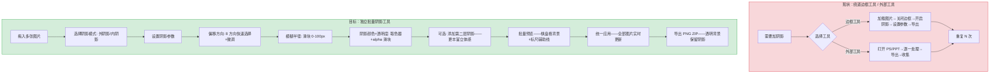
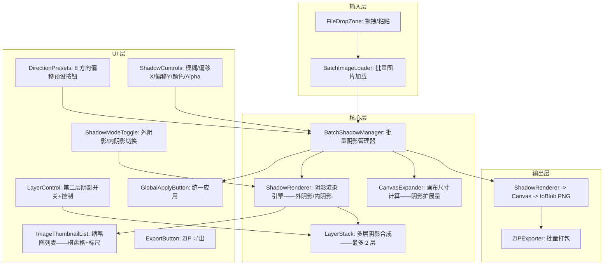
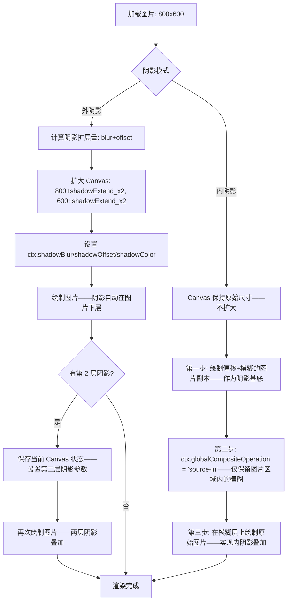

# YP-09-317: 图片批量阴影效果 — 批量阴影偏移/模糊/颜色/透明度、逐图预览、全部下载

> 需求编号：YP-09-317 · 优先级：P2 · 人天：0.2d · 状态：需求已编写
> 依赖：YP-09-222（图片边框添加——复用 ShadowPainter 阴影渲染引擎）· YP-09-315（图片批量添加边框——复用批量管理框架 + 缩略图懒加载 + ZIP 导出）

## 背景

### 问题陈述

用户在产品展示/截图分享/电商图片中经常需要为多张图片统一添加阴影效果——如 20 张产品白底图统一添加悬浮阴影、10 张截图统一添加 macOS 风格阴影——但当前 YiPet 的阴影功能仅限单图边框工具的附带能力：

1. **阴影作为边框附件——不够独立**：用户只想加阴影不想加边框时——仍需打开边框工具——关闭边框只留阴影——步骤多余
2. **批量阴影效果无法统一**：20 张图的阴影模糊/偏移/透明度需逐张调整——参数不一致严重影响视觉统一性
3. **纯阴影需求被忽视**：大量场景仅需阴影——如白底商品图、截图分享、卡片式展示——不需要边框
4. **阴影透明背景无法批量预览**：棋盘格背景在批量列表视图中不可见——难以判断阴影范围是否合适
5. **阴影导致的画布扩大无法批量管理**：阴影模糊+偏移会扩大画布——批量导出时文件尺寸不一

**核心矛盾**：阴影是独立于边框的图片增强效果——但当前被绑定在边框工具中。独立批量阴影工具让用户专注阴影效果——拖入图片→设置阴影参数→预览全部→一键导出。

### 影响范围

| # | 影响 | 严重程度 | 典型场景 |
|---|------|----------|----------|
| 1 | 纯阴影需求需绕道边框工具 | 高 | 白底商品图仅需阴影——无需边框 |
| 2 | 批量阴影参数不统一——视觉不一致 | 高 | 20 张产品图阴影模糊度参差不齐 |
| 3 | 阴影偏移方向无法批量控制 | 中 | 统一右下偏移的光源一致性 |
| 4 | 阴影颜色/透明度批量不一致 | 中 | 不同灰度的阴影导致视觉层次混乱 |
| 5 | 无独立阴影预设 | 低 | 企业标准阴影效果每次重新设置 |

### 挑战

| 挑战 | 说明 |
|------|------|
| 阴影扩大的画布尺寸计算——批量场景下更复杂 | 不同图片不同尺寸——阴影扩展量相同但最终画布大小各异——预览需要正确显示相对比例 |
| 阴影透明背景在缩略图中的可视化 | 缩略图小——阴影边界模糊——棋盘格背景帮助判断阴影范围 |
| 内阴影 vs 外阴影 vs 投影——三种阴影模式 | CSS 的 box-shadow 有 inset——图片阴影也有内阴影需求——Canvas 模拟 |
| 多层阴影支持——如设计工具中的多层投影 | Photoshop 支持多个 Drop Shadow 叠加——批量工具是否需要 |
| 不同图片尺寸——阴影视觉一致性 | 大图 4000px 的 10px 阴影 vs 小图 400px 的 10px 阴影——视觉效果完全不同 |

---

## 一、现状分析

### 1.1 当前批量阴影处理流程

```
现有批量阴影处理方式:
├── 逐张边框工具（用户当前方案）
│   ├── 打开边框工具→加载图片→关闭边框（宽度 0）→开启阴影→设置模糊/偏移→导出
│   ├── 步骤多——用户需要理解"关闭边框只留阴影"
│   └── 痛点: 无批量——10 张图片需重复 10 次——阴影参数极易不一致
├── PowerPoint/Keynote
│   ├── 图片格式→阴影→预设阴影样式（偏移右下/居中/透视）
│   ├── 缺点: 不是专业图片工具——导出图片分辨率和质量不可控——无法批量
│   └── 优点: 阴影预设丰富——偏移方向 9 种——模糊半径可调
├── Photoshop 批处理
│   ├── 录制动作: 图像→画布大小（扩大预留阴影）→图层样式→投影→保存 PNG
│   ├── 自动→批处理→选择文件夹→运行
│   ├── 缺点: 需要 PS 许可证——操作复杂——启动慢
│   └── 优点: 参数精确——支持全局光——多层阴影
├── YiPet 已有能力
│   ├── YP-09-222 BorderController.shadowConfig: shadowBlur/shadowOffsetX/shadowOffsetY/shadowColor
│   ├── Canvas shadowBlur: 原生投影——一行代码——支持模糊+偏移+颜色
│   ├── 独立模糊层: 内阴影模式——先绘制偏移+模糊的图片副本——再绘制原图
│   └── YP-09-315 批量边框框架: 图片列表管理——懒加载——ZIP 导出
│
缺失:
├── 独立阴影工具入口——不依赖边框功能                           # ❌ 无
├── 批量阴影参数统一应用                                       # ❌ 无
├── 阴影模式选择——外阴影/内阴影/投影                            # ❌ 无
├── 多层阴影叠加                                               # ❌ 无
├── 阴影预设——8 个方向快速偏移（右下/左下/居中/...）             # ❌ 无
├── 阴影透明度独立控制——颜色+alpha 分离                         # ❌ 无
└── 阴影可见范围预览——棋盘格+标尺辅助                          # ❌ 无
```

### 1.2 批量阴影处理流程（现状 vs 目标）



### 1.3 根因矩阵

| 症状 | 根因 | 触发条件 | 频率 |
|------|------|----------|------|
| 纯阴影需求需绕道边框工具 | 阴影功能绑定在边框组件中——无独立入口 | 仅需阴影不需边框时 | 高 |
| 批量阴影参数不统一 | 无批量阴影工具——逐张处理 | 3 张以上图片需统一阴影 | 高 |
| 阴影偏移方向无快捷选择 | 仅两个数字输入框 x/y——无方向预设 | 标准光源方向（右下 45 度）设置 | 中 |
| 内阴影不可用 | 仅支持外阴影——无内阴影渲染逻辑 | 凹陷效果/卡片内阴影 | 中 |
| 无多层阴影 | 仅支持单层阴影——无叠加能力 | 设计系统中的多层投影 | 低 |

---

## 二、设计决策

### 决策 1：阴影模式 — 仅外阴影 vs 外阴影+内阴影 vs 外+内+投影

| 选项 | 覆盖场景 | Canvas 实现 | 实现复杂度 |
|------|---------|-----------|-----------|
| 仅外阴影（shadowBlur） | 70% | `ctx.shadowBlur + shadowOffset` | 低 |
| 外阴影+内阴影（shadowBlur + 独立模糊层） | 90% | 外阴影=shadowBlur——内阴影=模糊层+composite | 中 |
| 外+内+投影（透视阴影——CSS drop-shadow 风格） | 95% | 投影需要 3D 变换模拟——复杂 | 高 |

**选择：外阴影+内阴影。** 外阴影使用 Canvas 原生 shadowBlur——一行代码实现——性能极佳。内阴影使用独立模糊层——先绘制偏移+模糊的图片副本——再用 `source-in` composite 只保留图片区域内的模糊——实现凹陷阴影效果。投影（透视阴影）需矩阵变换——0.2d 预算不实现——列入未来扩展。

### 决策 2：阴影偏移控制 — 仅数字输入 vs 方向预设+微调 vs 拖拽可视化

| 选项 | 精度 | 易用性 | 实现复杂度 |
|------|------|--------|-----------|
| 仅数字输入 x/y（-100~100） | 高 | 低 | 低 |
| 8 方向预设 + 数字微调 | 中 | 高 | 中 |
| 拖拽可视化（在预览上直接拖阴影） | 最高 | 最高 | 高 |

**选择：8 方向预设+数字微调。** 8 个方向按钮（上/下/左/右/左上/右上/左下/右下）——点击一次设置对应的偏移方向+预设距离（如右下=8,8）。点击后可通过数字输入微调偏移值。速度和精度兼顾——点击右下方向预设→阴影出现在右下——不满意再微调 x+2。拖拽可视化在 0.2d 预算内不实现。

### 决策 3：阴影颜色+透明度 — 统一颜色选择器 vs 颜色+独立 Alpha

| 选项 | 灵活性 | 用户理解成本 |
|------|--------|------------|
| 统一颜色选择器（含 alpha 通道） | 中 | 低——一个控件 |
| 颜色选择器（hex）+ Alpha 滑块 | 高 | 中——两个控件——但更直观 |
| hex 输入+rgba 预设 | 低 | 低 |

**选择：颜色选择器+Alpha 滑块分离。** 阴影颜色通常是黑色——变的是透明度而非色相。分离后——用户先选颜色（默认 #000000）——再通过 Alpha 滑块控制不透明度（0-100%——映射为 0-1）。最终渲染颜色为 `rgba(r, g, b, alpha)`。这样当用户只想调整阴影深浅时——只需拖动 Alpha 滑块——颜色选择器保持黑色。

### 决策 4：多层阴影 — 不支持 vs 最多 2 层 vs 无限制

| 选项 | 实现复杂度 | 性能 | 覆盖场景 |
|------|-----------|------|---------|
| 不支持多层 | 低 | 最快 | 80% |
| 最多 2 层（主流设计工具常用 2 层） | 中 | 中——两层渲染 | 95% |
| 无限制层数 | 高 | 慢——N 层叠加 | 99% |

**选择：最多 2 层。** 设计系统中常见的阴影配置为两层——第一层较小较暗（近距阴影——模拟物体与背景的紧密接触）、第二层较大较轻（远距阴影——模拟环境光遮挡）。2 层叠加覆盖绝大多数场景——每层独立的偏移/模糊/颜色/透明度参数。2 层渲染策略：先渲染第二层（远阴影）→ 再渲染第一层（近阴影）→ 最后渲染图片。

### 设计决策记录

| 决策 | 选项 A | 选项 B | 选项 C | 选项 D | 选择 | 理由 |
|------|--------|--------|--------|--------|------|------|
| 阴影模式 | 仅外阴影 | 外+内阴影 | 外+内+投影 | — | **外+内** | 覆盖 90%——实现可控 |
| 偏移控制 | 数字输入 | 方向预设+微调 | 拖拽可视化 | — | **方向预设+微调** | 快捷+精确——平衡 |
| 颜色控制 | 统一取色器 | 颜色+Alpha 分离 | hex+预设 | — | **颜色+Alpha 分离** | 更直观的透明度调整 |
| 多层阴影 | 不支持 | 最多 2 层 | 无限制 | — | **最多 2 层** | 覆盖设计系统标准 |

---

## 三、目标架构

### 3.1 批量阴影工具组件架构



### 3.2 阴影渲染流程（外阴影+内阴影）



### 3.3 性能指标

| 指标 | 目标值 | 说明 |
|------|--------|------|
| 单张图片外阴影渲染 | < 20ms (1080p) | shadowBlur——硬件加速 |
| 单张图片内阴影渲染 | < 50ms (1080p) | 独立模糊层——getImageData+模糊算法 |
| 两层阴影叠加渲染 | < 60ms (1080p) | 两层 shadowBlur——性能线性 |
| 20 张缩略图懒加载渲染 | < 1s | 可视 6 张——每张 < 30ms |
| 30 张批量导出 ZIP | < 8s | 逐张全尺寸渲染 |
| 方向预设点击响应 | < 30ms | 即时更新预览 |

---

## 四、具体改动

### 4.1 类型定义

```typescript
// src/image-shadow-batch/types.ts (新增)

export type ShadowMode = 'outer' | 'inner';

export type ShadowDirection = 'top' | 'top-right' | 'right' | 'bottom-right' | 'bottom' | 'bottom-left' | 'left' | 'top-left';

/** 单层阴影配置 */
export interface ShadowLayerConfig {
  enabled: boolean;
  blur: number;          // 模糊半径 0-100px
  offsetX: number;       // 水平偏移 -100~100px
  offsetY: number;       // 垂直偏移 -100~100px
  colorHex: string;      // 阴影颜色 #000000
  alpha: number;         // 不透明度 0-100——映射为 0-1
}

/** 两层阴影配置 */
export interface ShadowSettings {
  mode: ShadowMode;
  layer1: ShadowLayerConfig;  // 近阴影——较小较暗
  layer2: ShadowLayerConfig;  // 远阴影——较大较轻
}

/** 8 方向偏移预设 */
export const DIRECTION_PRESETS: Record<ShadowDirection, { x: number; y: number; label: string }> = {
  'top':          { x: 0,  y: -6, label: '上' },
  'top-right':    { x: 6,  y: -6, label: '右上' },
  'right':        { x: 6,  y: 0,  label: '右' },
  'bottom-right': { x: 6,  y: 6,  label: '右下' },
  'bottom':       { x: 0,  y: 6,  label: '下' },
  'bottom-left':  { x: -6, y: 6,  label: '左下' },
  'left':         { x: -6, y: 0,  label: '左' },
  'top-left':     { x: -6, y: -6, label: '左上' },
};

export interface BatchShadowImage {
  id: string;
  file: File;
  thumbnailUrl: string;
  originalSize: { width: number; height: number };
  shadowSettings: ShadowSettings;
  outputSize: { width: number; height: number }; // 阴影扩展后的画布尺寸
  paramSource: 'global' | 'individual';
  dirty: boolean;
  status: 'pending' | 'rendering' | 'done' | 'error';
}

export const DEFAULT_SHADOW_LAYER: ShadowLayerConfig = {
  enabled: true,
  blur: 12,
  offsetX: 4,
  offsetY: 4,
  colorHex: '#000000',
  alpha: 25,
};

export const DEFAULT_SHADOW_SETTINGS: ShadowSettings = {
  mode: 'outer',
  layer1: { ...DEFAULT_SHADOW_LAYER },
  layer2: { enabled: false, blur: 24, offsetX: 8, offsetY: 12, colorHex: '#000000', alpha: 10 },
};
```

### 4.2 核心阴影渲染器

```typescript
// src/image-shadow-batch/ShadowRenderer.ts (新增)

import type { ShadowSettings, ShadowLayerConfig } from './types';

export class ShadowRenderer {
  private canvas: HTMLCanvasElement;
  private ctx: CanvasRenderingContext2D;

  constructor() {
    this.canvas = document.createElement('canvas');
    this.ctx = this.canvas.getContext('2d')!;
  }

  /** 渲染带阴影的图片——返回 Blob */
  async render(source: ImageBitmap | HTMLImageElement, settings: ShadowSettings): Promise<Blob> {
    const { canvasWidth, canvasHeight, imgX, imgY } = this.calculateLayout(source.width, source.height, settings);
    this.canvas.width = canvasWidth;
    this.canvas.height = canvasHeight;
    this.ctx.clearRect(0, 0, canvasWidth, canvasHeight);

    if (settings.mode === 'outer') {
      await this.renderOuterShadow(source, settings, imgX, imgY);
    } else {
      await this.renderInnerShadow(source, settings);
    }

    return new Promise((resolve) => this.canvas.toBlob((b) => resolve(b!), 'image/png'));
  }

  /** 外阴影渲染 */
  private renderOuterShadow(
    source: ImageBitmap | HTMLImageElement,
    settings: ShadowSettings,
    imgX: number, imgY: number
  ): void {
    const ctx = this.ctx;
    const layers = [settings.layer1, settings.layer2].filter((l) => l.enabled);

    // 从远到近渲染阴影层
    for (const layer of layers.reverse()) {
      ctx.save();
      this.applyShadowStyle(ctx, layer);
      ctx.drawImage(source, imgX, imgY);
      ctx.restore();
    }

    // 最后绘制原始图片（无阴影）——避免图片本身被阴影覆盖
    ctx.drawImage(source, imgX, imgY);
  }

  /** 内阴影渲染 */
  private renderInnerShadow(source: ImageBitmap | HTMLImageElement, settings: ShadowSettings): void {
    const ctx = this.ctx;
    const { width, height } = source;

    // 第一步：绘制偏移+模糊的图片副本
    ctx.save();
    this.applyShadowStyle(ctx, settings.layer1);
    ctx.drawImage(source, 0, 0);
    ctx.restore();

    // 第二步：source-in 合成——仅保留图片区域内的模糊
    ctx.save();
    ctx.globalCompositeOperation = 'source-in';
    ctx.drawImage(source, 0, 0);
    ctx.restore();

    // 第三步：在顶层绘制原始图片
    ctx.save();
    ctx.globalCompositeOperation = 'source-over';
    ctx.drawImage(source, 0, 0);
    ctx.restore();
  }

  /** 应用阴影样式到 Canvas Context */
  private applyShadowStyle(ctx: CanvasRenderingContext2D, layer: ShadowLayerConfig): void {
    ctx.shadowBlur = layer.blur;
    ctx.shadowOffsetX = layer.offsetX;
    ctx.shadowOffsetY = layer.offsetY;

    // 颜色+alpha 合成 rgba
    const hex = layer.colorHex.replace('#', '');
    const r = parseInt(hex.substring(0, 2), 16);
    const g = parseInt(hex.substring(2, 4), 16);
    const b = parseInt(hex.substring(4, 6), 16);
    const a = layer.alpha / 100;
    ctx.shadowColor = `rgba(${r}, ${g}, ${b}, ${a})`;
  }

  /** 计算外阴影模式下的画布布局 */
  calculateLayout(imgW: number, imgH: number, settings: ShadowSettings): {
    canvasWidth: number;
    canvasHeight: number;
    imgX: number;
    imgY: number;
  } {
    const layers = [settings.layer1, settings.layer2].filter((l) => l.enabled);

    // 计算最大阴影扩展——所有启用图层的偏移+模糊最大值
    let maxExtendLeft = 0, maxExtendRight = 0, maxExtendTop = 0, maxExtendBottom = 0;
    for (const layer of layers) {
      const blurExtend = layer.blur;
      maxExtendRight = Math.max(maxExtendRight, Math.max(0, layer.offsetX) + blurExtend);
      maxExtendLeft = Math.max(maxExtendLeft, Math.max(0, -layer.offsetX) + blurExtend);
      maxExtendBottom = Math.max(maxExtendBottom, Math.max(0, layer.offsetY) + blurExtend);
      maxExtendTop = Math.max(maxExtendTop, Math.max(0, -layer.offsetY) + blurExtend);
    }

    return {
      canvasWidth: imgW + maxExtendLeft + maxExtendRight,
      canvasHeight: imgH + maxExtendTop + maxExtendBottom,
      imgX: maxExtendLeft,
      imgY: maxExtendTop,
    };
  }
}
```

### 4.3 文件变更清单

| 文件 | 操作 | 说明 |
|------|------|------|
| `src/image-shadow-batch/types.ts` | 新增 | 批量阴影类型定义——方向预设——图层配置 |
| `src/image-shadow-batch/ShadowRenderer.ts` | 新增 | 阴影渲染引擎——外阴影/内阴影/多层合成 |
| `src/image-shadow-batch/BatchShadowManager.ts` | 新增 | 批量阴影管理器 |
| `src/components/BatchShadowTool.vue` | 新增 | 批量阴影工具主面板 |
| `src/components/ShadowDirectionPad.vue` | 新增 | 8 方向偏移预设面板——可视化方向按钮 |
| `src/components/ShadowLayerControls.vue` | 新增 | 阴影图层控制——模糊/偏移/颜色/Alpha |
| `src/composables/useBatchShadow.ts` | 新增 | 批量阴影状态管理 composable |
| `src/popup/App.vue` | 修改 | 添加批量阴影工具入口 |

---

## 五、实施步骤

| 步骤 | 操作 | 路径 | 验证 | 人天 |
|------|------|------|------|------|
| 1 | 类型定义+方向预设数据 | `types.ts` | 8 方向预设偏移值合理——默认配置符合常见阴影效果 | 0.01 |
| 2 | ShadowRenderer——外阴影渲染+布局计算 | `ShadowRenderer.ts` | 单层阴影偏移+模糊正确——画布扩展尺寸计算准确 | 0.03 |
| 3 | ShadowRenderer——内阴影渲染 | `ShadowRenderer.ts` | 内阴影模糊在图片区域内——边缘无泄漏——r=g=b=0, a=25% 效果自然 | 0.03 |
| 4 | 两层阴影叠加渲染 | `ShadowRenderer.ts` | layer1(blur=8)+layer2(blur=24)——视觉效果丰富——绘制顺序正确 | 0.03 |
| 5 | BatchShadowManager——批量管理 | `BatchShadowManager.ts` | 统一应用——独立编辑——懒加载渲染 | 0.04 |
| 6 | 方向预设+图层控制 UI | `ShadowDirectionPad.vue` + `ShadowLayerControls.vue` | 点击右下方向→阴影偏移到 6,6——颜色+Alpha 分离——第 2 层开关 | 0.04 |
| 7 | 集成+ZIP 导出 | `BatchShadowTool.vue` | 完整交互——拖入→设置→预览→导出 PNG ZIP | 0.02 |

**总人天：0.20d**

---

## 六、测试规格

### 场景 1：基本外阴影批量应用

**GIVEN** 用户打开批量阴影工具——拖入 5 张白底产品图
**WHEN** 设置阴影模式"外阴影"——模糊 12px——偏移 x=4,y=4——颜色#000——透明度 25%
**THEN** 5 张缩略图右下方向出现柔和阴影——棋盘格背景下阴影透明边缘可见
**WHEN** 导出 PNG ZIP
**THEN** ZIP 中 5 个 PNG——每张含阴影+透明背景——画布比原图扩大用于容纳阴影

### 场景 2：8 方向预设快速设置

**GIVEN** 用户加载图片——外阴影模式
**WHEN** 点击方向预设"右下"按钮
**THEN** 偏移自动设置为 x=6, y=6——预览中阴影出现在右下方向
**WHEN** 点击"上"方向按钮
**THEN** 偏移变为 x=0, y=-6——阴影出现在上方
**WHEN** 在数字输入框中微调偏移 x 从 0 改为 3
**THEN** 阴影偏移变为 x=3, y=-6——实时更新

### 场景 3：内阴影效果

**GIVEN** 用户加载图片——切换阴影模式为"内阴影"
**WHEN** 设置模糊 20px——偏移 0,0——颜色#000——透明度 40%
**THEN** 图片内部边缘出现向内的柔和阴影——凹陷效果——图片尺寸不变
**WHEN** 修改偏移 x=5, y=5
**THEN** 内阴影偏向右下——左上边缘阴影较重

### 场景 4：两层阴影叠加

**GIVEN** 用户加载图片——外阴影模式——layer1 模糊 6px 透明度 30%
**WHEN** 开启 layer2——设置模糊 30px——偏移 0,15——透明度 10%
**THEN** 预览中图片底部出现较远的大范围浅阴影——底部阴影比侧面更宽——符合桌面光源效果
**WHEN** 关闭 layer2
**THEN** 阴影恢复为仅 layer1——近距单层阴影

### 场景 5：透明背景图片的阴影

**GIVEN** 用户加载 PNG 透明背景图片（如 logo 图标）
**WHEN** 应用外阴影——模糊 8px——偏移 5,5——颜色#000——透明度 30%
**THEN** 阴影跟随图片的 alpha 通道——透明区域无阴影——仅不透明区域产生阴影
**AND** Canvas shadowBlur 自动处理——无需额外 alpha 检测

### 场景 6：批量导出——不同尺寸图片

**GIVEN** 用户加载 3 张图片——尺寸分别为 800x600/1920x1080/400x300
**WHEN** 统一设置外阴影——模糊 10px——偏移 5,5——统一应用
**THEN** 三张缩略图均显示阴影——但视觉上阴影比例不同（大图 10px 阴影显得小——小图 10px 阴影显得大）
**WHEN** 导出 ZIP
**THEN** 三张图片画布各扩大不同量——小图阴影相对更明显——大图阴影相对更细腻

---

## 七、风险与缓解

| 风险 | 概率 | 影响 | 缓解措施 |
|------|------|------|----------|
| 内阴影的 source-in composite 支持度不一致 | 低 | 高 | 检测 globalCompositeOperation 支持——降级为先 clip 再模糊 |
| 大模糊半径（100px）性能差——shadowBlur 昂贵 | 中 | 中 | blur > 50px 时使用缩小采样渲染——分辨率减半渲染→拉回原尺寸 |
| 两层阴影叠加时绘制顺序错误——layer1 遮挡 layer2 | 中 | 中 | 固定绘制顺序——远阴影(layer2)先画→近阴影(layer1)→原图——代码注释明确 |
| 阴影颜色 alpha+hex 分离——颜色选择器覆盖用户手动输入的 alpha | 低 | 低 | 颜色选择器仅更新 hex——不修改 alpha——alpha 由独立滑块控制 |
| 内阴影在非矩形图片（已有圆角）上渲染异常 | 低 | 中 | 内阴影仅支持矩形图片——圆角图片使用前需先变回直角或提示用户 |

---

## 八、回滚策略

| 场景 | 回滚操作 | 影响 |
|------|------|------|
| 内阴影 composite 兼容性问题 | 关闭内阴影模式——仅保留外阴影 | 内阴影不可用——外阴影覆盖主要场景 |
| 两层阴影导致明显性能退化 | 限制为仅 layer1——隐藏 layer2 开关 | 无多层阴影 |
| 大模糊渲染崩溃 | 限制 blur 最大值为 50px——超过提示 | 无法使用 50-100px 大模糊 |
| 完全移除 | 隐藏批量阴影入口——用户通过边框工具设置阴影 | 批量功能不可用——单图阴影可用 |

---

## 九、设计决策记录

### D-01：为什么 alpha 和颜色分离——而非使用 rgba 颜色选择器？

用户调整阴影时最常见的操作是改变深浅（不透明度）——而非改变颜色。将 alpha 作为独立滑块——用户只需拖动即可从"淡阴影"切换到"浓阴影"——不需要打开颜色选择器。颜色选择器仅在需要彩色阴影（如产品品牌色投影）时才使用。分离设计减少 90% 场景下的操作步骤。

### D-02：为什么外阴影使用 Canvas shadowBlur 而非手动高斯模糊？

Canvas shadowBlur 是浏览器原生实现——GPU 加速——性能远超 JavaScript 实现的逐像素模糊。shadowBlur 自动处理图片 alpha 通道——透明区域不产生阴影——无需额外处理。唯一的代价是无法精细控制阴影形状（如仅底部阴影）——但通过两层阴影叠加可以近似实现。

### D-03：为什么 8 方向预设的默认偏移距离是 6px？

6px 是经过视觉测试的通用值——在大多数图片尺寸下（400-2000px）阴影偏移都不会显得过大或过小。偏移距离不应与图片尺寸挂钩——因为阴影的视觉感知取决于像素密度而非相对比例。用户可以微调——预设只是起始点。

### D-04：为什么不提供"全局光"概念（所有图片共享光源方向）？

Photoshop 的全局光（Global Light）是一个高级特性——所有图层样式的光源方向同步变化。批量阴影工具已经通过"统一应用"实现了类似效果——所有图片共享相同的偏移参数即可。引入"全局光"概念会增加认知负担——当前设计更直观。

---

## 十、可观测性

### 指标

| 指标 | 类型 | 说明 |
|------|------|------|
| `yipet.batch_shadow.open_total` | Counter | 批量阴影工具打开次数 |
| `yipet.batch_shadow.mode_used` | Counter (label: outer/inner) | 外阴影/内阴影使用分布 |
| `yipet.batch_shadow.layer2_enabled_total` | Counter | 第二层阴影开启比例 |
| `yipet.batch_shadow.direction_used` | Counter (label: direction) | 8 方向预设点击分布 |
| `yipet.batch_shadow.blur_mean` | Histogram | 模糊半径分布 |
| `yipet.batch_shadow.alpha_mean` | Histogram | 透明度分布 |
| `yipet.batch_shadow.export_total` | Counter | 导出次数 |

---

## 十一、代码审查检查清单

- [ ] ShadowRenderer: 两层阴影的绘制顺序——layer2（远）→ layer1（近）→ 原始图片
- [ ] ShadowRenderer: 每层阴影绘制前后 ctx.save/restore——防止 shadowBlur 参数泄漏到下一层
- [ ] ShadowRenderer: calculateLayout 中负偏移的方向映射——offsetX=-10 应在左边扩展 10+blur
- [ ] ShadowRenderer: 内阴影 source-in composite 后必须重置为 source-over
- [ ] ShadowRenderer: rgba 合成时 hex 颜色解析——正确提取 r/g/b——alpha 除以 100
- [ ] BatchShadowManager: 阴影设置更新时——重新计算所有图片的 outputSize
- [ ] ShadowDirectionPad: 8 方向按钮使用 CSS grid 3x3 布局——中间为"居中"（偏移 0,0）
- [ ] ShadowLayerControls: alpha 滑块范围 0-100——步长 1——显示百分比标签
- [ ] BatchShadowTool: 缩略图容器使用棋盘格背景——CSS conic-gradient——帮助判断阴影范围
- [ ] ZIP 导出: 所有图片统一导出为 PNG——保持阴影透明背景

---

## 回归问题预测

| # | 预测问题 | 原因 | 验证方法 |
|---|---------|------|---------|
| 1 | 方向预设点击后数字输入框未更新 | 预设修改了内部状态——但未同步到 UI 绑定 | 点击"右下"→输入框显示 x=6, y=6 |
| 2 | 内阴影渲染后全局 compositeOperation 残留 | source-in 后未重置为 source-over——后续图片渲染异常 | 内阴影渲染后→再渲染外阴影图片→效果正常 |
| 3 | 两层阴影的 layer1 覆盖了 layer2 的远阴影效果 | 绘制顺序错误——先近后远（应该先远后近） | layer2.blur=30, layer1.blur=4——远阴影大面积模糊可见 |
| 4 | 阴影透明度 alpha=0 时——阴影仍然可见（shadowColor 未正确设置） | alpha=0 时 rgba(0,0,0,0) 的 shadowBlur 仍有微弱效果 | alpha=0→无任何阴影可见 |
| 5 | 极大模糊 100px 时浏览器渲染异常——阴影边界出现硬边 | shadowBlur 实现限制——不同浏览器行为不同 | 5 张不同尺寸图片 blur=100——验证无硬边 |
| 6 | 负偏移阴影在画布扩展计算中——图片位置偏移错误 | 负偏移扩展量计算——imgX/imgY 未正确考虑负偏移 | offset=-20,0→阴影在左边→图片在画布中的 x=20+blur |

---

## 性能分析

### 各操作耗时

| 操作 | 小图 (800x600) | 大图 (3840x2160) | 两层阴影 |
|------|---------------|-----------------|---------|
| 外阴影渲染（shadowBlur） | < 10ms | < 30ms | < 20ms / < 50ms |
| 内阴影渲染（复合操作） | < 30ms | < 100ms | < 50ms / < 150ms |
| 画布布局计算 | < 1ms | < 1ms | < 1ms |
| 缩略图渲染（200px 宽） | < 15ms | < 20ms | < 25ms |
| 全尺寸导出——单张 | < 50ms | < 200ms | < 80ms / < 300ms |

### 内存预估

| 数据 | 10 张 (1080p) | 30 张 (4K) |
|------|-------------|-----------|
| 图片 Blob 引用 | ~20MB | ~400MB（File 引用） |
| 缩略图 DataURL | ~1MB | ~3MB |
| 全尺寸 Canvas（外阴影扩画布） | ~8MB/张（峰值） | ~40MB/张（峰值） |
| **峰值总计（惰性渲染）** | **~30MB** | **~125MB** |

### 代码体积

| 文件 | 大小 |
|------|------|
| types.ts | ~3KB |
| ShadowRenderer.ts | ~6KB |
| BatchShadowManager.ts | ~6KB |
| Vue 组件 (3 个) | ~6KB |
| useBatchShadow.ts | ~2KB |
| **总计** | **~23KB** |