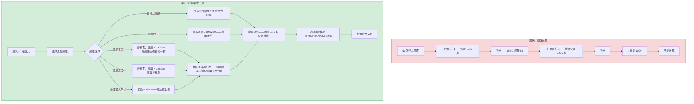
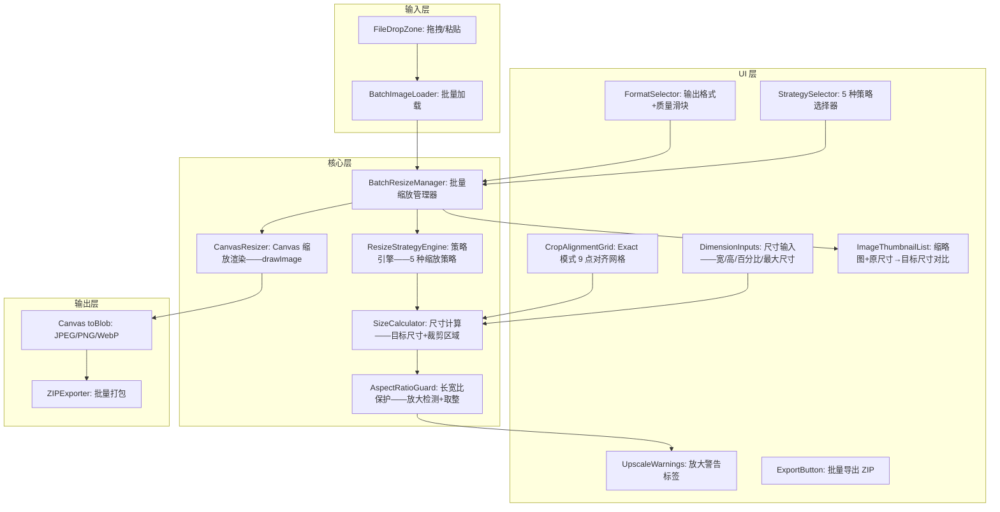

# YP-09-318: 图片批量调整大小 — 批量适配宽度/高度/最大尺寸、百分比缩放、保持长宽比、输出格式选择

> 需求编号：YP-09-318 · 优先级：P2 · 人天：0.2d · 状态：需求已编写
> 依赖：YP-09-210（图片尺寸调整——复用单图 resize 渲染逻辑）· YP-09-251（图片批量格式转换——复用批量框架+格式选择+ZIP 导出）· YP-09-295（图片批量缩放——复用缩放比例计算）

## 背景

### 问题陈述

用户在上传图片到网站/社交媒体/邮件时经常需要批量调整图片尺寸——如将 50 张相机原图（6000x4000）批量缩小为适合网页的 1920px 宽——或将产品图统一调整为 800x800 正方形——但当前 YiPet 的尺寸调整功能仅支持单图：

1. **批量缩放到统一尺寸——逐张操作不可行**：50 张图逐一打开调整工具→设置 1920 宽→导出→重复 50 次
2. **横向/纵向混合图片——智能适配缺失**：批量中包含横图和竖图——按宽度缩放横图正常、竖图被拉宽——需智能检测长宽比
3. **保持长宽比与固定尺寸的矛盾**：社交媒体要求 1080x1080 正方形——但原图是 3:2 横图——直接缩放会变形——需裁剪填充策略
4. **输出格式批量转换**：缩放后需要统一输出格式（如原始 HEIC 转 JPEG）——当前需额外步骤
5. **质量与文件大小平衡**：批量缩放时需统一 JPEG 质量——确保体积和画质的最佳平衡

**核心矛盾**：尺寸调整是最基础的图片处理操作——但批量场景下"统一宽度"和"保持比例"之间存在天然矛盾。批量缩放工具需多种智能适配模式——拖入图片→选择适配策略→批量预览→一键导出。

### 影响范围

| # | 影响 | 严重程度 | 典型场景 |
|---|------|----------|----------|
| 1 | 批量缩放逐一操作时间长 | 高 | 50 张相机原图批量缩放到网页尺寸 |
| 2 | 横竖混合图片缩放结果不一致 | 高 | 横图按宽度缩放好——竖图被错误拉伸 |
| 3 | 固定尺寸要求与保持比例冲突 | 中 | 社交媒体 1080x1080——原图 3:2 需裁剪 |
| 4 | 无法批量控制输出质量 | 中 | JPEG 质量 100% 体积巨大——60% 画质损失 |
| 5 | 输出格式不统一 | 低 | 原始 WebP/HEIC/PNG 混合——输出格式需统一 |

### 挑战

| 挑战 | 说明 |
|------|------|
| 多种适配策略的语义精确性 | fit-width/fit-height/fit-max/percentage/exact 五种策略——每种对横竖图的行为不同 |
| Exact 模式下裁剪策略 | 固定 800x800——3:2 横图需裁剪——居中裁剪顶部/底部——还是手动调整裁剪区 |
| 放大 vs 缩小的安全策略 | 用户可能误操作将 400px 小图放大到 4000px——需警告或限制放大倍数 |
| 保持宽高比的取整问题 | 按宽度缩放高度 = width * (origH / origW)——奇数像素需取整——避免子像素偏移 |
| 批量预览——尺寸变化可视化 | 缩略图列表中——显示缩放后的尺寸对比——原始：6000x4000 → 目标：1920x1280 |

---

## 一、现状分析

### 1.1 当前批量缩放处理流程

```
现有批量缩放处理方式:
├── 逐张调整（用户当前方案）
│   ├── YiPet 图片尺寸调整工具——单张
│   │   ├── 设置目标宽度/高度/百分比——导出
│   │   └── 痛点: 50 张图——打开→设置→导出→关闭→重复 = 200 次操作
│   ├── macOS 预览——调整大小
│   │   ├── 工具→调整大小→拟合到 1920→导出→下一张
│   │   └── 不支持真正的批量——每一张都需要确认
│   └── 在线批量工具 (bulkresizephotos.com)
│       ├── 批量上传→设置尺寸→服务器处理→下载
│       ├── 缺点: 图片上传到第三方——隐私问题——大图片上传+下载耗时
│       └── 优点: 支持多种适配模式——横竖图自动处理
├── 命令行工具 (ImageMagick mogrify / sips)
│   ├── `mogrify -resize 1920x1920\> *.jpg`——批量缩放到 1920 内
│   ├── `sips -Z 1920 *.jpg`——macOS 原生批量缩放
│   ├── 缺点: 无预览——命令行——不可逆——普通用户门槛高
│   └── 优点: 非常快——批量处理——多种适配策略
├── YiPet 已有能力
│   ├── YP-09-210 图片尺寸调整: Canvas drawImage 缩放——单图 resize
│   ├── YP-09-251 批量格式转换: 图片列表——格式选择——ZIP 导出
│   ├── YP-09-295 图片批量缩放: 百分比/固定宽度——按比例缩放的逻辑
│   └── Canvas API: ctx.drawImage(img, 0, 0, targetW, targetH)——高质量缩放
│
缺失:
├── 五种适配策略统一选择                                     # ❌ 无
├── 横竖图混合智能处理                                       # ❌ 无
├── Exact 模式的裁剪策略——居中/顶部对齐/底部对齐               # ❌ 无
├── 放大保护——限制最大放大倍数                                # ❌ 无
├── 批量预览——原尺寸 vs 目标尺寸对比                          # ❌ 无
├── 输出格式+质量批量控制                                     # ❌ 无
└── 文件大小预估——导出前预览预计文件大小                       # ❌ 无
```

### 1.2 批量缩放处理流程（现状 vs 目标）



### 1.3 根因矩阵

| 症状 | 根因 | 触发条件 | 频率 |
|------|------|----------|------|
| 批量缩放逐一操作 | 无批量 resize 能力 | 3 张以上图片需统一缩放 | 高 |
| 竖图按宽度缩放被拉伸 | 适配宽度时未区分横竖图——竖图宽<目标宽则放大 | 混合横竖图片批量处理 | 中 |
| 固定尺寸裁剪缺乏控制 | Exact 模式无裁剪对齐选项 | 社交媒体正方形图片需求 | 中 |
| 小图被放大到极大尺寸——模糊 | 无放大保护——未限制放大倍数 | 用户输入 4000px 宽——原始 400px 图 | 中 |
| 输出格式混合不统一 | 无输出格式选项——保持原始格式 | WebP/HEIC/PNG/JPEG 混合 | 低 |

---

## 二、设计决策

### 决策 1：适配策略 — 3 种基础 vs 5 种完整 vs 自由组合

| 选项 | 覆盖场景 | UI 复杂度 | 实现复杂度 |
|------|---------|----------|-----------|
| 3 种：适配宽度/适配高度/百分比 | 80% | 低 | 低 |
| 5 种：+适应最大尺寸+精确尺寸 | 95% | 中 | 中 |
| 自由组合（如宽度=1920 AND 高度≤1080） | 99% | 高 | 高 |

**选择：5 种策略。** 适配宽度（Fit Width）：所有图片宽度=目标值——高度=width*(origH/origW)。适配高度（Fit Height）：对称。适应最大尺寸（Fit Max）：长边=目标值——短边等比——ImageMagick 的 `-resize 1920x1920\>` 行为。百分比（Percentage）：所有图片缩放为原始尺寸的 N%。精确尺寸（Exact）：所有图片缩放到目标宽高后再居中裁剪（不拉伸——先等比缩放至完全覆盖目标尺寸——再裁剪多余部分）。

### 决策 2：Exact 模式的裁剪对齐 — 仅居中 vs 9 点对齐 vs 居中+智能人脸

| 选项 | 适用场景 | 实现复杂度 |
|------|---------|-----------|
| 仅居中裁剪 | 80% | 低 |
| 9 点对齐（左上/上/右上/左/中/右/左下/下/右下） | 95% | 中 |
| 居中+智能人脸检测（自动对齐到面部） | 99% | 高 |

**选择：9 点对齐。** 在 Exact 模式下提供 3x3 网格对齐选项——默认居中。用户点击网格的任意一格——裁剪区向该方向偏移。例如：图片顶部有重要内容——点击"顶部居中"——裁剪区上移。实现方式：先等比缩放至完全覆盖目标尺寸——CropRect=(sx,sy,targetW,targetH)——sx/sy 由对齐点决定。

### 决策 3：放大保护 — 不允许放大 vs 允许但警告 vs 静默允许

| 选项 | 安全性 | 用户体验 |
|------|--------|---------|
| 不允许放大——超过原始尺寸自动 clamp | 高——不会产生模糊图片 | 中——用户意图被阻止 |
| 允许放大——但显示清晰警告 | 中 | 高——用户知情决策 |
| 静默允许——不做任何限制 | 低——容易误操作 | 低——无反馈 |

**选择：允许放大但显示清晰警告。** 当目标尺寸 > 原始尺寸时——缩放预览区显示橙色警告标签"⚠ 图片将被放大 2.5x——可能模糊"。不阻止用户操作——但确保用户知晓风险。在数量列表中——放大的图片缩略图角标显示放大倍数。

### 决策 4：输出格式+质量控制 — 统一格式 vs 保持原始 vs 智能推荐

| 选项 | 简单度 | 文件大小优化 |
|------|--------|------------|
| 统一输出格式——所有图片转为同一格式 | 高 | 中 |
| 保持原始格式——仅缩放不转格式 | 最高 | 低 |
| JPEG/PNG/WebP 选择+质量滑块 | 中 | 高 |

**选择：统一输出格式+质量滑块。** 批量缩放的典型场景是"为网页准备图片"——输出格式应该统一（通常是 JPEG 质量 85 或 WebP 质量 80）。提供 JPEG/PNG/WebP 三种输出格式——JPEG 和 WebP 显示质量滑块（0-100）——PNG 无损无质量选项。原始格式保留信息——但批量场景下统一格式更有价值。

### 设计决策记录

| 决策 | 选项 A | 选项 B | 选项 C | 选项 D | 选择 | 理由 |
|------|--------|--------|--------|--------|------|------|
| 适配策略 | 3 种 | 5 种 | 自由组合 | — | **5 种** | 覆盖 95%——UI 清晰 |
| Exact 裁剪对齐 | 仅居中 | 9 点对齐 | 人脸检测 | — | **9 点对齐** | 精细控制——简单实现 |
| 放大保护 | 不允许 | 允许+警告 | 静默允许 | — | **允许+警告** | 用户知情——决策自主 |
| 输出格式 | 统一格式 | 保持原始 | 格式+质量选择 | — | **格式+质量滑块** | 批量场景核心需求 |

---

## 三、目标架构

### 3.1 批量缩放工具组件架构



### 3.2 五种缩放策略计算流程

```mermaid
graph TD
    A[原始尺寸: origW x origH] --> B{策略}

    B -->|Fit Width| C1[targetW = 用户输入宽度]
    C1 --> C2[targetH = targetW * origH / origW——向下取整]
    C2 --> C3[最终: targetW x targetH——保持原始比例]

    B -->|Fit Height| D1[targetH = 用户输入高度]
    D1 --> D2[targetW = targetH * origW / origH——向下取整]
    D2 --> C3

    B -->|Fit Max| E1[maxDim = 用户输入最大尺寸]
    E1 --> E2{origW > origH?}
    E2 -->|是 横图| E3[targetW = maxDim——targetH = maxDim * origH / origW]
    E2 -->|否 竖图| E4[targetH = maxDim——targetW = maxDim * origW / origH]
    E3 --> C3
    E4 --> C3

    B -->|Percentage| F1[percent = 用户输入百分比/100]
    F1 --> F2[targetW = origW * percent——取整]
    F2 --> F3[targetH = origH * percent——取整]
    F3 --> C3

    B -->|Exact| G1[targetW = 用户输入宽——targetH = 用户输入高]
    G1 --> G2[scale = max(targetW/origW, targetH/origH)]
    G2 --> G3[scaledW = origW * scale——scaledH = origH * scale]
    G3 --> G4[计算裁剪偏移 sx/sy——由 9 点对齐决定]
    G4 --> G5[Canvas 先绘制缩放后图片——再 clip 到 targetW x targetH]
    G5 --> C3
```

### 3.3 性能指标

| 指标 | 目标值 | 说明 |
|------|--------|------|
| 50 张缩略图懒加载渲染 | < 1.5s | 可视 6 张——缩略图 200px 宽 |
| 单张 6000x4000 resize 到 1920px | < 100ms | Canvas drawImage 缩放 |
| 50 张全尺寸批量导出 | < 8s | 逐张渲染+ZIP |
| 策略切换后 50 张尺寸重算 | < 5ms | 纯数学计算——无渲染 |
| 放大警告检测 | < 1ms | 比较 target vs original |

---

## 四、具体改动

### 4.1 类型定义

```typescript
// src/image-resize-batch/types.ts (新增)

export type ResizeStrategy = 'fit-width' | 'fit-height' | 'fit-max' | 'percentage' | 'exact';

export type CropAlignment = 'top-left' | 'top' | 'top-right' | 'left' | 'center' | 'right' | 'bottom-left' | 'bottom' | 'bottom-right';

export type OutputFormat = 'jpeg' | 'png' | 'webp';

/** 缩放配置 */
export interface ResizeConfig {
  strategy: ResizeStrategy;
  /** Fit Width/Height/Max: 目标像素值 */
  targetDimension: number;
  /** Percentage: 缩放百分比 (1-200) */
  percentage: number;
  /** Exact: 目标尺寸 */
  exactWidth: number;
  exactHeight: number;
  /** Exact: 裁剪对齐 */
  cropAlignment: CropAlignment;
}

/** 单张图片缩放结果 */
export interface ResizeResult {
  id: string;
  originalSize: { width: number; height: number };
  targetSize: { width: number; height: number };
  scale: number;              // 缩放倍数 (0.01 - 2.0)
  isUpscale: boolean;         // 是否放大
  cropInfo?: {                // Exact 模式的裁剪信息
    sx: number;
    sy: number;
    sWidth: number;
    sHeight: number;
  };
  estimatedFileSize: number;  // 预估输出文件大小字节
}

export interface BatchResizeImage {
  id: string;
  file: File;
  thumbnailUrl: string;
  originalSize: { width: number; height: number };
  resizeConfig: ResizeConfig;
  paramSource: 'global' | 'individual';
  resizeResult?: ResizeResult;
  dirty: boolean;
  status: 'pending' | 'calculating' | 'rendering' | 'done' | 'error';
}

export const CROP_ALIGNMENT_LABELS: Record<CropAlignment, string> = {
  'top-left':     '↖',
  'top':          '↑',
  'top-right':    '↗',
  'left':         '←',
  'center':       '⊙',
  'right':        '→',
  'bottom-left':  '↙',
  'bottom':       '↓',
  'bottom-right': '↘',
};

export const DEFAULT_RESIZE_CONFIG: ResizeConfig = {
  strategy: 'fit-width',
  targetDimension: 1920,
  percentage: 50,
  exactWidth: 800,
  exactHeight: 800,
  cropAlignment: 'center',
};
```

### 4.2 核心策略引擎

```typescript
// src/image-resize-batch/ResizeStrategyEngine.ts (新增)

import type { ResizeConfig, ResizeResult, CropAlignment } from './types';

export class ResizeStrategyEngine {

  /** 计算单张图片的目标尺寸 */
  calculate(origW: number, origH: number, config: ResizeConfig): ResizeResult {
    let targetW: number, targetH: number;
    let cropInfo: ResizeResult['cropInfo'];

    switch (config.strategy) {
      case 'fit-width':
        targetW = config.targetDimension;
        targetH = Math.round(targetW * origH / origW);
        break;

      case 'fit-height':
        targetH = config.targetDimension;
        targetW = Math.round(targetH * origW / origH);
        break;

      case 'fit-max': {
        const maxDim = config.targetDimension;
        if (origW >= origH) {
          targetW = maxDim;
          targetH = Math.round(maxDim * origH / origW);
        } else {
          targetH = maxDim;
          targetW = Math.round(maxDim * origW / origH);
        }
        break;
      }

      case 'percentage': {
        const pct = config.percentage / 100;
        targetW = Math.round(origW * pct);
        targetH = Math.round(origH * pct);
        targetW = Math.max(1, targetW);
        targetH = Math.max(1, targetH);
        break;
      }

      case 'exact': {
        targetW = config.exactWidth;
        targetH = config.exactHeight;
        const scale = Math.max(targetW / origW, targetH / origH);
        const scaledW = Math.round(origW * scale);
        const scaledH = Math.round(origH * scale);
        cropInfo = this.calculateCrop(scaledW, scaledH, targetW, targetH, config.cropAlignment);
        break;
      }

      default:
        targetW = origW;
        targetH = origH;
    }

    const scale = Math.max(targetW / origW, targetH / origH);
    const isUpscale = scale > 1.0;

    return {
      id: '',
      originalSize: { width: origW, height: origH },
      targetSize: { width: targetW!, height: targetH! },
      scale,
      isUpscale,
      cropInfo,
      estimatedFileSize: this.estimateFileSize(targetW!, targetH!),
    };
  }

  /** 计算 Exact 模式的裁剪区域 */
  private calculateCrop(scaledW: number, scaledH: number, targetW: number, targetH: number, alignment: CropAlignment) {
    const alignX = alignment.includes('left') ? 0 : alignment.includes('right') ? 1 : 0.5;
    const alignY = alignment.includes('top') ? 0 : alignment.includes('bottom') ? 1 : 0.5;

    const sx = (scaledW - targetW) * alignX;
    const sy = (scaledH - targetH) * alignY;

    return {
      sx: Math.round(sx),
      sy: Math.round(sy),
      sWidth: targetW,
      sHeight: targetH,
    };
  }

  /** 预估输出文件大小 */
  private estimateFileSize(w: number, h: number): number {
    const pixels = w * h;
    // JPEG 质量 85: ~0.5 bit/pixel
    // PNG: ~2 bit/pixel (取决于内容)
    // WebP 质量 80: ~0.4 bit/pixel
    return Math.round(pixels * 0.5 / 8);
  }
}
```

### 4.3 文件变更清单

| 文件 | 操作 | 说明 |
|------|------|------|
| `src/image-resize-batch/types.ts` | 新增 | 批量缩放类型定义——5 种策略——9 点对齐 |
| `src/image-resize-batch/ResizeStrategyEngine.ts` | 新增 | 策略引擎——尺寸计算+裁剪区域 |
| `src/image-resize-batch/CanvasResizer.ts` | 新增 | Canvas 缩放渲染——支持 Exact 裁剪 |
| `src/image-resize-batch/BatchResizeManager.ts` | 新增 | 批量缩放管理器 |
| `src/components/BatchResizeTool.vue` | 新增 | 批量缩放主面板 |
| `src/components/ResizeStrategyPanel.vue` | 新增 | 策略选择+参数输入面板 |
| `src/components/CropAlignmentGrid.vue` | 新增 | Exact 模式 3x3 对齐网格 |
| `src/components/SizeComparisonList.vue` | 新增 | 原始 vs 目标尺寸对比列表 |
| `src/composables/useBatchResize.ts` | 新增 | 批量缩放状态管理 |
| `src/popup/App.vue` | 修改 | 添加批量缩放工具入口 |

---

## 五、实施步骤

| 步骤 | 操作 | 路径 | 验证 | 人天 |
|------|------|------|------|------|
| 1 | 类型定义+策略枚举 | `types.ts` | 5 种策略联合类型——9 点对齐映射 | 0.01 |
| 2 | ResizeStrategyEngine——5 种策略尺寸计算 | `ResizeStrategyEngine.ts` | 每种策略测试 3 组输入（横图/竖图/方图） | 0.04 |
| 3 | CanvasResizer——缩放渲染+Exact 裁剪 | `CanvasResizer.ts` | drawImage 缩放——Exact 模式下 clip+crop 正确 | 0.03 |
| 4 | 放大保护逻辑+预估文件大小 | `ResizeStrategyEngine.ts` | 小图放大检测——橙色警告标签——预估体积与实测误差 < 30% | 0.02 |
| 5 | BatchResizeManager——批量管理 | `BatchResizeManager.ts` | 统一配置——独立编辑——懒加载——格式转换 | 0.04 |
| 6 | UI 组件——策略选择+对齐网格+尺寸对比 | 各 Vue 组件 | 策略切换→参数输入自动切换——9 点网格点击——对比列表显示原/目标尺寸 | 0.04 |
| 7 | 集成+ZIP 导出 | `BatchResizeTool.vue` | 完整交互——统一格式输出——质量可控 | 0.02 |

**总人天：0.20d**

---

## 六、测试规格

### 场景 1：适配宽度——横竖混合图

**GIVEN** 用户拖入 5 张图片——3 张横图（6000x4000/1920x1080/1600x900）——2 张竖图（4000x6000/1080x1920）
**WHEN** 选择"适配宽度"——设置目标宽度 1920px——点击统一应用
**THEN** 横图：1920x1280/1920x1080/1920x1080——竖图：1920x2880/1920x3413
**AND** 竖图因宽度放大（竖图原始宽=1080 < 目标 1920）——缩略图显示橙色"⚠ 放大 1.78x"标签
**WHEN** 导出 JPEG 质量 85
**THEN** 输出 5 张统一宽度 1920 的 JPEG

### 场景 2：适应最大尺寸——长边限制

**GIVEN** 用户加载混合图片
**WHEN** 选择"适应最大尺寸"——最大尺寸 1200px
**THEN** 横图 6000x4000 → 1200x800（长边=宽=6000→缩放到 1200）
**AND** 竖图 4000x6000 → 800x1200（长边=高=6000→缩放到 1200）
**AND** 所有图片长边 ≤ 1200——无放大

### 场景 3：Exact 模式——正方形裁剪

**GIVEN** 用户加载横图 1920x1080
**WHEN** 选择"精确尺寸"——800x800——对齐方式"居中"
**THEN** 先等比缩放到 1422x800（scale=800/1080=0.74——覆盖目标尺寸的最小缩放）
**AND** 居中裁剪——sx=(1422-800)/2=311——最终输出 800x800 居中区域
**WHEN** 切换对齐为"顶部居中"
**THEN** 裁剪区域上移——sx=311——sy=0——输出图片上部被保留——下部被裁剪

### 场景 4：百分比缩放

**GIVEN** 用户加载 10 张不同尺寸图片
**WHEN** 选择"百分比"——设置 50%
**THEN** 6000x4000→3000x2000——1920x1080→960x540——400x300→200x150
**WHEN** 设置 200%（放大 2 倍）
**THEN** 所有图片显示放大警告——400x300→800x600——可能出现模糊

### 场景 5：输出格式统一

**GIVEN** 用户处理完 5 张图片（原始格式混合 PNG/JPEG/WebP）
**WHEN** 选择输出格式 WebP——质量 80
**THEN** 导出 ZIP 中 5 个 WebP 文件——质量参数 0.80
**WHEN** 切换为 JPEG 质量 60
**THEN** 导出 5 个 JPEG——文件体积更小——质量更低
**WHEN** 切换为 PNG（无损）
**THEN** 质量滑块隐藏——输出无压缩 PNG

### 场景 6：小图放大保护警告

**GIVEN** 用户加载 400x300 小图——选择"适配宽度"——目标 3840px
**THEN** 放大倍数 9.6x——缩略图显示醒目橙色警告带"⚠ 放大 9.6x——结果将严重模糊"
**WHEN** 选中该图——独立编辑模式——将策略改为"不缩放"（Percentage 100%）
**THEN** 警告消失——该图保持 400x300
**WHEN** 导出
**THEN** 其他 4 张按 3840 宽缩放——仅该张保持原始尺寸

---

## 七、风险与缓解

| 风险 | 概率 | 影响 | 缓解措施 |
|------|------|------|----------|
| Exact 模式裁剪了用户关键内容 | 中 | 中 | 提供 9 点对齐——默认居中——缩略图预览标记裁剪区域 |
| 大图缩放 Canvas 内存峰值 | 低 | 中 | 缩放时使用小尺寸中间 Canvas——不创建原始全尺寸 Canvas |
| Fit Max/Fit Width 对竖图的放大 | 中 | 低 | 计算 isUpscale——显示明确的橙色警告标签 |
| JPEG 质量过低——画质不可用 | 低 | 中 | 默认质量 85——低于 50 时显示警告"低质量可能导致明显色块" |
| WebP 格式浏览器兼容性 | 低 | 低 | WebP 选项旁注明"Chrome/Firefox/Edge 支持"——Safari 旧版本可能不支持 |

---

## 八、回滚策略

| 场景 | 回滚操作 | 影响 |
|------|------|------|
| Exact 模式裁剪计算错误 | 降级 Exact 为 Fit Max+手动裁剪提示——关闭 Exact 选项 | Exact 不可用 |
| 输出格式 WebP 兼容性问题 | 默认输出格式降级为 JPEG——移除 WebP 选项 | WebP 不可用 |
| 放大保护逻辑错误——正常缩放也被阻止 | 移除放大保护——仅保留百分比警告 | 无放大警告 |
| 完全移除 | 隐藏批量缩放入口——用户使用单图工具逐张处理 | 批量功能不可用 |

---

## 九、设计决策记录

### D-01：为什么 Exact 模式使用"等比缩放至覆盖+裁剪"而非"拉伸填充"？

拉伸填充（直接将 1920x1080→800x800）会扭曲图片比例——人脸/产品严重变形——这在绝大多数场景下不可接受。"等比缩放至覆盖+裁剪"保持原始比例——通过裁剪牺牲部分内容换取正确的比例——效果类似于 CSS background-size: cover + background-position。Exact 模式不提供"拉伸"选项——因为其等同于破坏了图片内容。

### D-02：为什么放大倍数不自动 clamp——而是警告？

用户上传 Web 小尺寸截图（400x300）——但需要打印版（3000x2250）——放大是故意的。自动 clamp 会阻止合法的放大需求。警告确保用户知道在做什么——但保留操作自由。这在批量工具中尤其重要——因为用户可能只注意到其中一张被放大——警告让用户有机会调整策略。

### D-03：为什么 Fit Max 限制长边而非短边？

Fit Max 的语义是"确保图片不超过某个尺寸上限"——长边是限制的关键。如果限制短边——横图 6000x4000 短边=4000——限制短边 1200——宽边=1800——这会导致横图宽边也比 1920 小。而限制长边 1200——宽=1200——更符合"最大 1200"的直觉。ImageMagick 的 `-resize 1920x1920\>` 也是这个行为。

### D-04：为什么预估文件大小而非精确预览？

精确预览需要实际渲染图片并调用 toBlob——这会消耗与导出相同的计算资源。预估公式（像素数 * 比特率/8）在 JPEG 质量 85 时的误差通常在 20% 以内——足以帮助用户判断"这个 ZIP 大约 15MB"。精确预览可作为设置项——默认关闭——仅在大致预估不满足需求时开启。

---

## 十、可观测性

### 指标

| 指标 | 类型 | 说明 |
|------|------|------|
| `yipet.batch_resize.open_total` | Counter | 批量缩放工具打开次数 |
| `yipet.batch_resize.strategy_used` | Counter (label: strategy) | 五种策略使用分布 |
| `yipet.batch_resize.target_width_mean` | Histogram | 目标宽度分布 |
| `yipet.batch_resize.upscale_warning_shown` | Counter | 放大警告展示次数 |
| `yipet.batch_resize.output_format_used` | Counter (label: jpeg/png/webp) | 输出格式分布 |
| `yipet.batch_resize.jpeg_quality_mean` | Histogram | JPEG 质量分布 |
| `yipet.batch_resize.image_count` | Histogram | 每批图片数量 |

---

## 十一、代码审查检查清单

- [ ] ResizeStrategyEngine: Fit Width——竖图 targetW > origW 时 isUpscale=true
- [ ] ResizeStrategyEngine: Percentage 的百分比边界——1%（最小）到 200%（最大）
- [ ] ResizeStrategyEngine: Exact 模式的 scale 计算公式——`Math.max(targetW/origW, targetH/origH)`——确保覆盖
- [ ] ResizeStrategyEngine: 裁剪偏移计算——对齐点在边缘时 sx/sy 可能为分数——Math.round 取整
- [ ] CanvasResizer: Exact 模式——先 drawImage 缩放后的大图——再 clip 到目标尺寸——绘制顺序正确
- [ ] CanvasResizer: 目标尺寸为 1x1 极端值时——Canvas 创建正常——渲染无异常
- [ ] BatchResizeManager: 策略切换时——所有图片重新计算 ResizeResult——标记 dirty
- [ ] SizeComparisonList: 原尺寸→目标尺寸显示箭头——放大时箭头旁橙色标签
- [ ] FormatSelector: JPEG 和 WebP 显示质量滑块——PNG 隐藏——切换格式时更新文件大小预估
- [ ] BatchResizeTool: 导出 ZIP 时——根据 outputFormat 调用 toBlob('image/jpeg', quality/100)

---

## 回归问题预测

| # | 预测问题 | 原因 | 验证方法 |
|---|---------|------|---------|
| 1 | Fit Width 竖图缩放——高度超过 Canvas 最大尺寸限制 | 竖图宽度=1080→目标=3840——高度=6827——超出部分浏览器 Canvas 限制 | 竖图+Fit Width 3840——验证 Canvas 创建成功 |
| 2 | Exact 模式 scale 计算——正方形原图 800x800 目标 800x800——scale=1 仍裁剪 | scale=1 时 scaledW==targetW——sx=0——不应裁剪——但代码可能引入浮点误差 | 800x800→Exact 800x800——输出图片与原始完全一致 |
| 3 | 百分比 100% 时的取整——奇数像素图片缩放后可能变偶数 | Math.round(origW * 1.0) = origW——但浮点 origW*1.0 可能有精度误差 | 奇数宽 799px——100%→输出仍为 799px |
| 4 | 文件大小预估与实际差异过大——JPEG 压缩率因图片内容而异 | 预估使用固定比特率——实际压缩取决于图片复杂度 | 10 张不同类型图片——预估与实际误差 < 30% |
| 5 | Exact 模式裁剪后——WebP 透明背景丢失 | 裁剪不改变像素数据——但 WebP toBlob 可能默认无 alpha | Exact 800x800→输出 WebP——验证透明区域保留 |
| 6 | 放大倍数 > 10x 时 Canvas drawImage 使用低质量缩放 | 浏览器 drawImage 缩放使用线性插值——大倍数质量差——可考虑 imageSmoothingQuality | 验证 imageSmoothingQuality='high' 在放大场景的效果 |

---

## 性能分析

### 各操作耗时

| 操作 | 10 张 (6000x4000→1920) | 50 张 (混合尺寸) |
|------|------------------------|------------------|
| 策略计算——50 张尺寸+裁剪 | < 5ms | < 10ms |
| 缩略图懒加载渲染 | < 300ms | < 1.5s |
| 单张全尺寸缩放 (→1920px) | < 80ms | < 80ms |
| Exact 单张 (→800x800 裁剪) | < 100ms | < 100ms |
| 批量全尺寸导出 50 张 ZIP | < 4s | < 15s |

### 内存预估

| 数据 | 10 张 (6000x4000→1920) | 50 张 (混合) |
|------|------------------------|-------------|
| 原始 File 引用 | ~200MB | ~600MB（File 不占 JS 堆） |
| 缩略图 DataURL (200px) | ~1MB | ~5MB |
| 缩放后 Canvas (峰值单张) | ~15MB | ~15MB |
| JSZip 缓冲区 | ~5MB | ~30MB |
| **峰值总计** | **~22MB** | **~50MB** |

### 代码体积

| 文件 | 大小 |
|------|------|
| types.ts | ~4KB |
| ResizeStrategyEngine.ts | ~5KB |
| CanvasResizer.ts | ~3KB |
| BatchResizeManager.ts | ~6KB |
| Vue 组件 (4 个) | ~8KB |
| useBatchResize.ts | ~2KB |
| **总计** | **~28KB** |