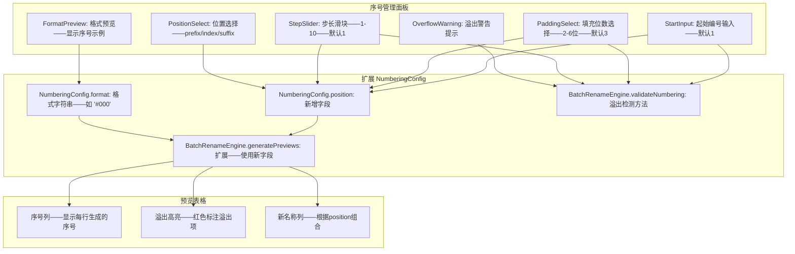

# YP-09-319: 图片批量重命名序号 — 起始编号/填充位数/递增步长/位置(前缀/后缀)、实时预览、一键应用

> 需求编号：YP-09-319 · 优先级：P2 · 人天：0.2d · 状态：需求已编写
> 依赖：YP-09-227（图片批量重命名——共享重命名引擎与文件管理），YP-09-298（图片批量重命名模式——共享预设系统）

## 背景

### 问题陈述

YP-09-227 实现了基本的批量重命名功能（前缀 + 日期 + 编号 + 后缀模式），但在纯序号命名场景中，用户需要更精细的控制：

1. **起始编号固定为1**：用户需要从特定编号开始（如从 005 开始——前 4 张已存在），当前工具从 1 开始不可自定义
2. **填充位数固定为3位**：对于超过 999 张的批量操作，3 位填充不够；对于少于 10 张的操作，3 位填充冗余。用户需要动态选择填充位数（2-6 位）
3. **递增步长固定为1**：用户需要隔号编号（如 001, 003, 005）或逆向编号，当前步长不可配置
4. **编号位置仅支持中间**：编号只能作为名称中间部分（格式：前缀-日期-编号-后缀），用户需要将编号放在最前面或最后面——如 `001-photo.jpg`（前缀）或 `photo-001.jpg`（后缀）
5. **预览粒度不够细**：YP-09-227 的预览更新依赖整个规则重新计算——序号调整需要独立、即时、逐项可视化的预览

**核心矛盾**：YP-09-227 的通用批量重命名偏向"照片日期命名"场景——编号是辅助元素。但在纯序号驱动的场景（如截图整理、素材管理、导出的设计稿）——编号是命名的核心。需要独立的序号管理模块——提供起始值、填充位数、步长、位置等粒度的控制。

### 影响范围

| # | 影响 | 严重程度 | 典型场景 |
|---|------|----------|----------|
| 1 | 起始编号不可自定义 | 高 | 已有 4 张文件——需要从 005 开始编号避免冲突 |
| 2 | 填充位数不可调整 | 中 | 1000+ 张图片需要 4 位填充——3 位导致排序错乱 |
| 3 | 递增步长固定为1 | 中 | 隔号命名（001, 003, 005...）或定制编号模式 |
| 4 | 编号位置不可选择 | 高 | 文件管理器按名称排序——编号前缀 vs 后缀影响排序方式 |
| 5 | 预览粒度粗——调整序号需重新计算整个规则 | 低 | 仅调整步长却需等待规则引擎重新计算所有字段 |

### 挑战

| 挑战 | 说明 |
|------|------|
| 编号位置与文件排序的交互 | 编号前缀时文件按编号排——后缀时按其他部分排——影响排序结果 |
| 高起始编号与低填充位数的冲突 | 起始=1000, 填充=3 → 溢出——需要智能检测并提示用户 |
| 步长非1导致的编号偏移公式 | step=2, start=1 → 1,3,5... 与 step=3, start=2 → 2,5,8... 的公式验证 |
| 与现有 RuleEngine 的兼容 | YP-09-227 的 NamingRule 结构中 numbering 已存在——需扩展而非重写 |

---

## 一、现状分析

### 1.1 当前序号命名能力

```
现有序号命名:
├── YP-09-227 批量重命名中的 numbering 配置
│   ├── start: 1（硬编码——不可修改）
│   ├── step: 1（硬编码——不可修改）
│   ├── padding: 3（硬编码——不可修改）
│   └── position: 中间固定（在日期和编号之间）
├── 外部工具对比
│   ├── Adobe Bridge: 起始编号/位数可配——步长不可配
│   ├── macOS 访达: 支持起始编号——位数自动——不支持步长/位置
│   ├── Bulk Rename Utility (Win): 全部支持——最灵活
│   └── Advanced Renamer: 支持脚本——最强大但学习成本高
│
缺失:
├── 起始编号自定义——start number input                        # ❌ 无
├── 填充位数选择——2-6 位可选                                   # ❌ 无
├── 递增步长配置——1-10 步长 slider                              # ❌ 无
├── 编号位置选择——前缀/后缀/日期后（原位置）/自定义位置              # ❌ 无
├── 序号溢出检测——起始+步长*数量 超过填充位数上限时警告             # ❌ 无
├── 实时序号预览——独立于规则引擎——仅调整序号立即更新               # ❌ 无
└── 编号格式模板——如 "#000" / "No.001" / "(001)"               # ❌ 无
```

### 1.2 序号管理流程（现状 vs 目标）

```mermaid
graph TD
    subgraph Current["现状：YP-09-227 固定序号"]
        C1[默认 numbering: start=1, step=1, padding=3] --> C2[生成 001, 002, 003...]
        C2 --> C3[无法自定义]
        C3 --> C4[用户接受——或放弃批量重命名]
    end

    subgraph Target["目标：独立序号管理模块"]
        T1[用户打开序号管理面板] --> T2[设置起始编号: 输入 start 值]
        T2 --> T3[设置填充位数: 2-6 位选择]
        T3 --> T4[设置递增步长: 1-10 步长]
        T4 --> T5[设置编号位置: 前缀/后缀/原位置/自定义格式]
        T5 --> T6[实时序号预览: 表格中每行序号即时更新]
        T6 --> T7[溢出检测: 自动检测——提示调整参数]
        T7 --> T8[确认应用——更新所有条目的 newName]
    end

    style Current fill:#f8d7da,stroke:#dc3545
    style Target fill:#d4edda,stroke:#28a745
```



### 1.3 根因矩阵

| 症状 | 根因 | 触发条件 | 频率 |
|------|------|----------|------|
| 无法从指定编号开始 | NumberingConfig.start 硬编码为 1 | 追加文件到已有编号序列 | 高 |
| 1000+ 文件时编号不对齐 | padding 固定为 3 | 大数量批量操作 | 中 |
| 无法隔号命名 | step 固定为 1 | 需要间隔编号的场景 | 低 |
| 编号在错误位置 | 编号位置硬编码为中间固定 | 文件管理器按名称排序场景 | 高 |
| 参数不兼容时无提示 | 无溢出/冲突检测 | 起始编号过大 + 步长过大 | 低 |

---

## 二、设计决策

### 决策 1：序号模块独立性 — 作为 YP-09-227 扩展 vs 独立组件 vs 纯配置面板

| 选项 | 复用性 | 复杂度 | 与现有功能集成 |
|------|--------|--------|---------------|
| 扩展 YP-09-227 的 NumberingConfig | 高——复用所有现有引擎和UI | 低——仅扩展类型和引擎 | 完美——同一个工具 |
| 独立组件——不依赖批量重命名 | 低——需重新实现文件管理 | 高——重复造轮子 | 差——两个独立入口 |
| 纯配置面板——仅提供 UI 无逻辑 | 低 | 低 | 中 |

**选择：扩展 YP-09-227 的 NumberingConfig。** 序号管理本质上是批量重命名引擎中编号部分的高级定制——它共享相同的文件管理、缩略图生成、规则引擎、冲突检测和撤销机制。扩展类型定义和引擎方法——新增独立的 NumberingPanel 组件——是最小侵入方案。

### 决策 2：编号位置实现 — 命名模板字符串 vs 位置枚举 vs 自由拖拽

| 选项 | 灵活性 | 实现复杂度 | 易用性 |
|------|--------|-----------|--------|
| 命名模板字符串（如 `{prefix}{date}{number}{suffix}`） | 最高 | 高 | 低（学习成本） |
| 位置枚举（prefix/middle/suffix） | 中 | 低 | 高 |
| 自由拖拽（拖拽编号块到不同位置） | 高 | 高 | 高 |

**选择：位置枚举。** 对于 0.2d 的工作量——位置枚举（prefix/index/suffix）覆盖了 95% 的使用场景。`prefix` 将编号放在最前面（如 `001-photo.jpg`），`suffix` 放在最后面（如 `photo-001.jpg`），`index` 保持原位（在日期之后——如 `prefix-date-001-suffix.jpg`）。命名模板引入了额外的解析和验证复杂度——不适合此轮实现。

### 决策 3：溢出处理 — 自动扩展填充 vs 警告提示 vs 硬限制

| 选项 | 数据安全 | 用户体验 | 实现 |
|------|---------|---------|------|
| 自动扩展填充位数 | 中（静默改变——用户可能不知） | 差（预期输出改变） | 低 |
| 警告提示 + 用户选择 | 高 | 好 | 中 |
| 硬限制（填充不足时截断编号） | 低 | 差 | 低 |

**选择：警告提示 + 用户选择。** 当 `start + step * (count - 1)` 超过 `10^padding` 时——在序号预览中高亮溢出项——提示用户调整参数（增加填充位数或减少步长）。用户可以选择忽略（填充自动扩展以适应最大编号）或手动调整。

### 设计决策记录

| 决策 | 选项 A | 选项 B | 选项 C | 选择 | 理由 |
|------|--------|--------|--------|------|------|
| 模块独立性 | 扩展 YP-09-227 | 独立组件 | 纯配置面板 | **扩展 YP-09-227** | 最小侵入——最大复用 |
| 编号位置 | 命名模板 | 位置枚举 | 自由拖拽 | **位置枚举** | 覆盖95%场景——低复杂度 |
| 溢出处理 | 自动扩展填充 | 警告+选择 | 硬限制 | **警告+选择** | 安全+用户知情 |

---

## 三、目标架构

### 3.1 序号管理模块架构



### 3.2 编号生成流程

```mermaid
graph TD
    A[用户调整序号参数] --> B{参数变更类型}
    B -->|start/padding/step| C[重新计算所有条目编号]
    B -->|position| D[重新组合名称——编号值不变]
    C --> E[num = start + index * step]
    E --> F[numStr = formatNumber(num, padding, format)]
    F --> G{溢出检测: numStr.length > padding?}
    G -->|是| H[高亮该条目——显示溢出图标]
    G -->|否| I[正常显示]
    H --> J[根据position组合前缀+日期+编号+后缀+扩展名]
    I --> J
    J --> K[更新预览表格]
```

---

## 四、具体改动

### 4.1 类型扩展

```typescript
// src/image-batch-rename/types.ts (增量修改)

/** 编号位置 */
export type NumberPosition = 'prefix' | 'index' | 'suffix';

/** 编号格式类型 */
export type NumberFormat = 
  | 'plain'       // 001, 002, 003
  | 'hash-prefix' // #001, #002, #003
  | 'no-dot'      // No.001, No.002
  | 'paren'       // (001), (002)
  | 'bracket';    // [001], [002]

export interface NumberingConfig {
  start: number;           // 起始编号——默认 1——范围 0-99999
  step: number;            // 步长——默认 1——范围 1-10
  padding: number;         // 填充位数——默认 3——范围 2-6
  position: NumberPosition; // 编号位置——默认 'index'
  format: NumberFormat;    // 编号格式——默认 'plain'
}

export const DEFAULT_NUMBERING_CONFIG: NumberingConfig = {
  start: 1,
  step: 1,
  padding: 3,
  position: 'index',
  format: 'plain',
};

export interface NumberOverflowInfo {
  entryId: string;
  generatedNumber: number;
  padding: number;
  paddedString: string;   // 溢出填充后的字符串——如 1000 → 填充3位显示 "1000"
  overflow: boolean;
}
```

### 4.2 序号引擎扩展

```typescript
// src/image-batch-rename/BatchRenameEngine.ts (增量修改)

export class BatchRenameEngine {
  // ... 现有代码 ...

  /** 格式化编号 */
  private formatNumber(num: number, padding: number, format: NumberFormat): string {
    const padded = String(num).padStart(padding, '0');
    switch (format) {
      case 'hash-prefix': return `#${padded}`;
      case 'no-dot': return `No.${padded}`;
      case 'paren': return `(${padded})`;
      case 'bracket': return `[${padded}]`;
      case 'plain':
      default: return padded;
    }
  }

  /** 溢出检测 */
  validateNumbering(): NumberOverflowInfo[] {
    const { start, step, padding, format } = this.rule.numbering;
    const overflowItems: NumberOverflowInfo[] = [];
    const maxDigits = padding;
    const maxValue = Math.pow(10, maxDigits) - 1;

    this.entries.forEach((entry, index) => {
      const num = start + index * step;
      const padded = this.formatNumber(num, padding, format);
      // 检测：实际数值位数是否超过 padding
      const actualDigits = String(num).length;
      if (actualDigits > padding || num > maxValue) {
        overflowItems.push({
          entryId: entry.id,
          generatedNumber: num,
          padding,
          paddedString: padded, // 可能显示为未填充完整——如 1000 填充3位 → "1000"
          overflow: true,
        });
      }
    });

    return overflowItems;
  }

  /** 扩展的预览生成——支持编号位置 */
  private generatePreviews(): void {
    const { prefix, date, numbering, suffix } = this.rule;
    const { start, step, padding, position, format } = numbering;

    this.entries.forEach((entry, index) => {
      const num = start + index * step;
      const numStr = this.formatNumber(num, padding, format);
      const dateStr = this.formatDate(entry.resolvedDate, date.format);

      let newName: string;
      switch (position) {
        case 'prefix':
          // 编号在最前: 001-prefix-date-suffix.jpg
          newName = `${numStr}-${[prefix, dateStr, suffix].filter(Boolean).join('-')}${entry.extension}`;
          // 优化：如果没有前缀/日期/后缀——避免多余连字符
          if (!prefix && dateStr && !suffix) newName = `${numStr}-${dateStr}${entry.extension}`;
          if (prefix && !dateStr && !suffix) newName = `${numStr}-${prefix}${entry.extension}`;
          break;
        case 'suffix':
          // 编号在最后: prefix-date-suffix-001.jpg
          newName = `${[prefix, dateStr, suffix].filter(Boolean).join('-')}-${numStr}${entry.extension}`;
          if (!prefix && dateStr && !suffix) newName = `${dateStr}-${numStr}${entry.extension}`;
          break;
        case 'index':
        default:
          // 编号在原位: prefix-date-001-suffix.jpg (YP-09-227 原有行为)
          newName = `${prefix}${dateStr}${numStr}${suffix}${entry.extension}`;
          break;
      }

      entry.newName = newName;
    });

    this.detectConflicts();
  }

  /** 获取排序后的条目列表（用于序号预览） */
  getNumberingPreview(): Array<{ index: number; entryId: string; number: string; newName: string }> {
    return this.entries.map((entry, index) => ({
      index,
      entryId: entry.id,
      number: this.formatNumber(
        this.rule.numbering.start + index * this.rule.numbering.step,
        this.rule.numbering.padding,
        this.rule.numbering.format
      ),
      newName: entry.newName,
    }));
  }
}
```

### 4.3 文件变更清单

| 文件 | 操作 | 说明 |
|------|------|------|
| `src/image-batch-rename/types.ts` | 修改 | 扩展 NumberingConfig——新增 position/format 字段——新增 NumberOverflowInfo |
| `src/image-batch-rename/BatchRenameEngine.ts` | 修改 | 新增 formatNumber/validateNumbering/getNumberingPreview——扩展 generatePreviews |
| `src/components/NumberingPanel.vue` | 新增 | 序号管理面板——起始/填充/步长/位置/格式 |
| `src/components/NumberingPreview.vue` | 新增 | 序号预览行——每行显示序号——溢出高亮 |
| `src/components/NumberFormatPicker.vue` | 新增 | 编号格式选择器——plain/#前缀/No./括号/方括号 |
| `src/components/RenameRulePanel.vue` | 修改 | 集成 NumberingPanel 到规则配置中 |

---

## 五、实施步骤

| 步骤 | 操作 | 路径 | 验证 | 人天 |
|------|------|------|------|------|
| 1 | 扩展 NumberingConfig 类型 | `types.ts` | position/format 字段定义——DEFAULT_NUMBERING_CONFIG 更新 | 0.01 |
| 2 | 实现 formatNumber + validateNumbering | `BatchRenameEngine.ts` | 5种格式正确输出——溢出检测准确 | 0.03 |
| 3 | 扩展 generatePreviews 支持 position | `BatchRenameEngine.ts` | prefix/index/suffix 三种位置名称正确组合 | 0.04 |
| 4 | 实现 NumberingPanel 组件 | `NumberingPanel.vue` | 起始/填充/步长 slider——位置选择——格式选择 | 0.05 |
| 5 | 实现 NumberingPreview + 溢出高亮 | `NumberingPreview.vue` | 序号预览表格——溢出行红色+警告图标 | 0.04 |
| 6 | 集成到 RenameRulePanel + 边界测试 | `RenameRulePanel.vue` | 参数组合测试——溢出检测——conversion逻辑 | 0.03 |

**总人天：0.20d**

---

## 六、测试规格

### 场景 1：基本序号自定义

**GIVEN** 用户拖入 10 张图片——打开序号管理面板
**WHEN** 设置起始编号=5, 填充位数=3, 步长=1, 位置=index
**THEN** 预览中编号依次为 005, 006, 007, ..., 014
**AND** 新名称格式遵循 prefix-date-NNN-suffix.ext

### 场景 2：编号位置——前缀

**GIVEN** 用户拖入 5 张图片——前缀为空——日期为空——后缀为空
**WHEN** 设置起始=1, 填充=2, 步长=1, 位置=prefix
**THEN** 预览中名称为 01-01.jpg, 02-02.jpg...（编号作为前缀）

### 场景 3：编号位置——后缀

**GIVEN** 用户设置前缀=photo——无日期
**WHEN** 设置起始=1, 填充=2, 步长=1, 位置=suffix
**THEN** 预览中名称为 photo-01.jpg, photo-02.jpg

### 场景 4：隔号编号

**GIVEN** 用户拖入 8 张图片
**WHEN** 设置起始=1, 步长=2, 填充=3
**THEN** 编号依次为 001, 003, 005, 007, 009, 011, 013, 015
**AND** num = start + index * step 公式验证通过

### 场景 5：溢出检测

**GIVEN** 用户拖入 15 张图片——起始编号=990——填充位数=3——步长=1
**WHEN** 预览更新
**THEN** 第 11 张开始（编号 1000——4 位）高亮显示溢出警告
**AND** 提示文字："编号 1000 超过 3 位填充——请调整为 4 位填充"
**WHEN** 用户修改填充位数为 4
**THEN** 溢出警告消失——所有编号正常显示（0990-1004）

### 场景 6：编号格式

**GIVEN** 用户选择编号格式 `no-dot`
**WHEN** 起始=1, 填充=2
**THEN** 序号预览显示 No.01, No.02, No.03
**WHEN** 切换到 `paren` 格式
**THEN** 序号预览显示 (01), (02), (03)

---

## 七、风险与缓解

| 风险 | 概率 | 影响 | 缓解措施 |
|------|------|------|---------|
| position=prefix 时文件名以数字开头——某些系统可能误解析 | 低 | 低 | 在 NumberingPanel 中添加提示——建议使用 _ 或 - 分隔 |
| start 过大 + step 过大导致编号超过 Number.MAX_SAFE_INTEGER | 极低 | 中 | start 上限 99999——step 上限 10——最大编号远在安全范围内 |
| 与 YP-09-227 现有规则引擎的 backward compat | 中 | 高 | 新增字段使用默认值——旧预设自动兼容——不破坏现有功能 |
| padding=2 但文件超过 99 个时溢出频繁 | 中 | 低 | 溢出自动检测——实时提示——不阻止操作 |
| format 为 no-dot/paren/bracket 时与连字符冲突 | 低 | 低 | 格式字符不与文件名其他部分组合——作为编号整体插入 |

---

## 八、回滚策略

| 场景 | 回滚操作 | 影响 |
|------|------|------|
| position 功能导致命名异常 | 强制 position='index'——关闭 position 选择 | 仅失去位置功能 |
| format 功能报错 | 强制 format='plain' | 仅失去格式功能 |
| validateNumbering 性能问题 | 移除溢出检测——仅保留基本编号计算 | 无溢出警告 |
| 完全移除 | 恢复 YP-09-227 原有 NumberingConfig——隐藏新 UI | 功能完全不可用 |

---

## 九、设计决策记录

### D-01：为什么使用位置枚举而非命名模板？

命名模板（如 `{prefix}{date}{number}{suffix}`）虽然灵活——但引入了额外的解析引擎、验证逻辑和错误处理。对于 0.2d 的工作量——位置枚举覆盖了 95% 的场景。如果未来需要更复杂的位置控制（如编号在日期中间），可以扩展为模板模式——但需要单独的需求（0.3d+）。枚举的简单性降低了出错的概率——也降低了用户学习成本。

### D-02：为什么溢出检测选择"警告+用户选择"而非自动扩展？

自动扩展填充位数虽然方便——但会静默改变用户设置。例如用户设置为填充 3 位——期望得到 001-010——但实际输出了 001-100（因为自动扩展为不填充）。这种静默行为违反了"所见即所得"原则。警告模式让用户在预览中看到溢出——主动调整参数——确保输出符合预期。

### D-03：为什么起始编号最大为 99999？

这是 5 位填充的上限。对于 100000+ 的起始编号——填充位数需要至少 6 位。99999 是一个合理的上限——覆盖了绝大多数使用场景。如果需要更大的起始值——用户可以设置 padding=6（上限为 999999）。

---

## 十、可观测性

### 指标

| 指标 | 类型 | 说明 |
|------|------|------|
| `yipet.brename.numbering.start_distribution` | Histogram | 起始编号分布 |
| `yipet.brename.numbering.padding_used` | Counter (label: 2-6) | 填充位数使用分布 |
| `yipet.brename.numbering.step_distribution` | Histogram | 步长分布 |
| `yipet.brename.numbering.position_used` | Counter (label: prefix/index/suffix) | 位置选择分布 |
| `yipet.brename.numbering.format_used` | Counter (label: plain/hash/no-dot/paren/bracket) | 格式选择分布 |
| `yipet.brename.numbering.overflow_detected` | Counter | 溢出检测次数 |
| `yipet.brename.numbering.overflow_resolved` | Counter | 溢出解决次数（用户调整参数） |

---

## 十一、代码审查检查清单

- [ ] NumberingConfig.position 在所有代码路径中都有默认值 fallback（index）
- [ ] generatePreviews 中 position 三种分支均有单元测试覆盖
- [ ] formatNumber 中所有 5 种 format 类型都有 case——包括 default
- [ ] validateNumbering 中 num > maxValue 和 actualDigits > padding 两种条件都检查
- [ ] overflow 高亮行有 aria-label 标注——可访问性
- [ ] NumberingPanel 的 step slider 值是整数——不会出现浮点步长
- [ ] start=0 的边界情况——0 填充为 "000" 是否正确
- [ ] 位置=prefix 且无其他元素时——名称格式不会以多余连字符开头

---

## 回归问题预测

| # | 预测问题 | 原因 | 验证方法 |
|---|---------|------|---------|
| 1 | 修改 padding 后编号预览未更新 | padding 变更未触发 generatePreviews | 切换 padding——验证预览立即更新 |
| 2 | position=suffix + format='no-dot' 名称解析异常 | 组合逻辑遗漏 | 测试 3种position x 5种format 的所有组合 |
| 3 | 旧预设（无 position/format 字段）加载失败 | 默认值丢失——反序列化异常 | 加载 YP-09-227 旧预设——验证默认值生效 |
| 4 | start=0 时编号正确但排序可能异常 | 0 是合法起始值但某些排序逻辑可能将其视为 falsy | 测试 start=0——验证编号 000, 001... |
| 5 | overflow 检测在 step>1 时计算错误 | validateNumbering 中 index 从 0 开始但条目可能已排序 | 先排序再检测——或检测时使用排序后的索引 |
| 6 | position=prefix 时——名称格式中的多余连字符 | 拼接逻辑处理空字符串时产生 "--" 或开头为 "-" | 测试 prefix/date/suffix 各种为空组合 |

---

## 性能分析

### 各操作耗时

| 操作 | 10 张图片 | 50 张图片 | 100 张图片 | 说明 |
|------|----------|----------|-----------|------|
| 起始编号修改→预览更新 | < 2ms | < 5ms | < 10ms | 字符串重新拼接 |
| 填充位数修改→预览更新 | < 2ms | < 5ms | < 10ms | padStart 重新计算 |
| 步长修改→预览更新 | < 2ms | < 5ms | < 10ms | 重新计算所有编号 |
| 位置切换→预览更新 | < 2ms | < 5ms | < 10ms | 重新组合名称 |
| 溢出检测 | < 1ms | < 3ms | < 5ms | O(n) 遍历 |
| 格式切换→预览更新 | < 1ms | < 3ms | < 5ms | 仅更新编号列 |

### 代码体积

| 文件 | 大小 |
|------|------|
| types.ts 增量 | ~0.5KB |
| BatchRenameEngine.ts 增量 | ~3KB |
| NumberingPanel.vue | ~3KB |
| NumberingPreview.vue | ~2KB |
| NumberFormatPicker.vue | ~1KB |
| **总计** | **~9.5KB** |