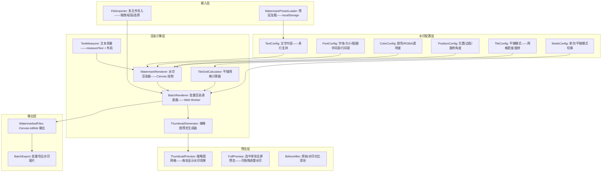
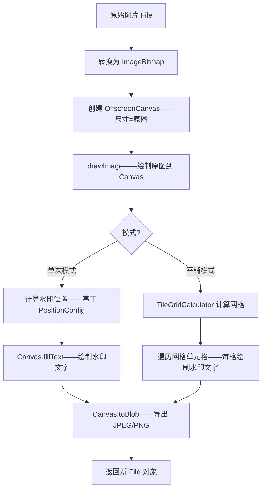

# YP-09-320: 图片批量添加文字水印 — 文字/字体/大小/颜色/透明度/位置、平铺/单次模式、批量预览、一键应用

> 需求编号：YP-09-320 · 优先级：P2 · 人天：0.2d · 状态：需求已编写
> 依赖：YP-09-157（图片压缩与优化——共享 Canvas 绘制管线）、YP-09-190（文本水印工具——共享水印渲染组件）

## 背景

### 问题陈述

用户在分享图片前需要添加水印——以防止未授权使用或标记版权。当前 YiPet 有基础的单张文字水印功能（YP-09-190）——但批量场景完全缺失：

1. **单张处理效率低**：YP-09-190 仅支持单张图片水印——用户有 20 张图片时需要重复操作 20 次——每次都需要重新设置水印参数
2. **无批量预览**：无法在批量应用前预览所有图片的水印效果——可能导致参数不合适——需要撤销重做
3. **位置不够灵活**：YP-09-190 仅支持固定 9 宫格位置（左上/中上/右上等）——不支持像素级微调和边距设置
4. **无平铺模式**：单次水印容易被裁剪掉——平铺模式（全图重复水印）防御性更强——但未实现
5. **字体选择有限**：仅支持系统默认字体——无字体粗细、字间距、行间距等排版控制

**核心矛盾**：单张水印工具的体验在批量场景中完全不可接受——20 张图片需要 20 次操作——每次 10 秒 = 200 秒（3.3 分钟）。批量水印应该是一次配置——一键应用到所有选中图片——30 秒内完成。

### 影响范围

| # | 影响 | 严重程度 | 典型场景 |
|---|------|----------|----------|
| 1 | 单张处理效率极低 | 高 | 摄影师分享 50 张样片——需逐个添加版权水印 |
| 2 | 水印参数需反复调整 | 高 | 不同尺寸图片需要不同水印大小——单张试错 | 
| 3 | 水印裁剪脆弱 | 中 | 单次水印在图片角落——裁剪后可移除 |
| 4 | 无批量预览——无法确认所有图片效果 | 中 | 确认后发现某些图片水印不可见——需重新处理 |
| 5 | 字体排版受限 | 低 | 多行水印、字间距、行间距——无控制 |

### 挑战

| 挑战 | 说明 |
|------|------|
| Canvas 水印渲染性能 | 50 张 2MB 图片——每张需重新绘制并编码——内存和 CPU 峰值 |
| 水印大小自适应 | 不同尺寸图片需要水印按比例缩放——固定像素大小不合适 |
| 平铺模式计算 | 需要计算平铺网格——旋转角度——覆盖整个图片——且边缘处理 |
| 文本测量 | 浏览器 Canvas measureText 精度——多行文本布局计算 |
| 批量预览内存管理 | 生成缩略图预览 vs 全尺寸预览——内存占用 vs 精度权衡 |

---

## 一、现状分析

### 1.1 当前水印能力

```
当前水印能力:
├── YP-09-190 文本水印工具（单张）
│   ├── 文字输入——单行文本
│   ├── 基础位置——9 宫格选择
│   ├── 颜色选择——RGBA 颜色拾取器
│   ├── 透明度——0-100% slider
│   ├── 字体大小——12-72px
│   └── 单张预览+应用
├── YP-09-217 图片添加文字（单张）
│   ├── 基础文字叠加——非水印用途
│   └── 仅单张——无批量
├── YP-09-240 图片添加水印（单张图片水印）
│   ├── 叠加其他图片作为水印
│   └── PNG 透明水印图
├── YP-09-267 图片批量水印（仅基础框架）
│   ├── 批量入口框架
│   └── 功能未完全实现
│
缺失:
├── 批量水印——一次配置→一键应用所有图片              # ❌ 无
├── 平铺模式——整图重复水印图案                          # ❌ 无
├── 水印边距控制——像素级微调                             # ❌ 无
├── 水印旋转角度——对角线水印                             # ❌ 无
├── 多行文本水印——换行支持                               # ❌ 无
├── 字间距/行间距控制                                    # ❌ 无
├── 批量缩略图预览——所有图片小图+水印效果                 # ❌ 无
└── 水印模板保存/加载                                    # ❌ 无
```

### 1.2 批量水印流程（现状 vs 目标）

```mermaid
graph TD
    subgraph Current["现状：单张水印——逐张处理"]
        C1[选择图片1] --> C2[打开水印工具]
        C2 --> C3[设置水印参数]
        C3 --> C4[预览——调整]
        C4 --> C5[应用水印]
        C5 --> C6[导出/下载]
        C6 --> C7{还有图片?}
        C7 -->|是——每张重复| C1
        C7 -->|否| C8[完成——耗时 N x 30秒]
    end

    subgraph Target["目标：批量水印——一次配置"]
        T1[拖入/选择多张图片] --> T2[批量图片列表加载——缩略图]
        T2 --> T3[配置水印参数]
        T3 --> T4[每张缩略图实时显示水印效果]
        T4 --> T5{效果满意?}
        T5 -->|否| T3
        T5 -->|是| T6[一键批量应用——渲染所有图片水印]
        T6 --> T7[批量导出/下载所有水印图]
        T7 --> T8[完成——总耗时 ~30 秒]
    end

    style Current fill:#f8d7da,stroke:#dc3545
    style Target fill:#d4edda,stroke:#28a745
```



### 1.3 根因矩阵

| 症状 | 根因 | 触发条件 | 频率 |
|------|------|----------|------|
| 批量处理需逐张操作 | 无批量水印管线 | 多张图片需统一水印 | 高 |
| 水印被裁剪移除 | 单次水印在角落——非平铺 | 图片被裁剪后分享 | 中 |
| 水印大小不统一 | 固定像素大小——不按图片尺寸自适应 | 混合横版/竖版图片 | 中 |
| 预览效果与实际不一致 | 缩略图预览与全尺寸渲染差异 | 预览缩略图——应用全图 | 低 |
| 水印不可见 | 透明度太高/颜色与背景融合 | 深色图片+深色水印 | 低 |

---

## 二、设计决策

### 决策 1：水印渲染引擎 — 全图 Canvas 重绘 vs CSS overlay vs 两者结合

| 选项 | 输出文件质量 | 水印不可移除性 | 性能（批量） | 实现复杂度 |
|------|-------------|---------------|-------------|-----------|
| Canvas 全图重绘（水印烘焙到像素中） | 高——与原始图片合并 | 高——无法用工具移除 | 中——逐张渲染 | 中 |
| CSS overlay（仅 visual——不影响文件） | N/A——不生成新文件 | 低——仅视觉叠加 | 高——仅 CSS | 低 |
| Canvas 绘制——导出 PNG/JPEG | 高——输出独立文件 | 高 | 中 | 中 |

**选择：Canvas 全图重绘并导出为 JPEG/PNG。** 水印的核心价值在于"不可移除性"——CSS overlay 可以通过修改 DOM 移除——不满足版权保护需求。Canvas 将水印文字烘焙到像素中——生成的图片文件包含水印——无法简单移除。批量渲染使用 Web Worker 进行并行 Canvas 操作以优化性能。

### 决策 2：水印大小策略 — 固定像素 vs 百分比自适应 vs 混合策略

| 选项 | 横竖版统一 | 多尺寸图片一致效果 | 复杂度 |
|------|-----------|-------------------|--------|
| 固定像素（如 48px 字号） | 否——小图上字号相对大 | 否 | 低 |
| 百分比自适应（图片宽度的 5%） | 是 | 是——视觉比例一致 | 中 |
| 混合（默认百分比——可选固定） | 是 | 是 | 中 |

**选择：混合策略——默认百分比自适应，可选固定像素。** 对于混合了横版（1920x1080）和竖版（1080x1920）图片的批量操作——百分比自适应确保水印视觉比例一致（如文字宽度占图片宽度的 15%）。但对于所有图片都是同一尺寸的场景——固定像素提供了精确控制。默认使用短边百分比（`min(width, height) * ratio`）——可选固定像素。

### 决策 3：平铺模式实现 — 计算网格 vs Canvas Pattern vs 逐行绘制

| 选项 | 灵活性 | 边缘控制 | 性能 | 内存 |
|------|--------|---------|------|------|
| 计算网格——每格单独绘制文字 | 高——可旋转/间距调整 | 好——边缘裁剪可控 | 中 | 中 |
| Canvas.createPattern 填充 | 低——Pattern 对齐固定 | 差 | 高 | 低 |
| 逐行绘制——行内重复 | 高 | 好 | 低（重复绘制多）| 中 |

**选择：计算网格——每格单独绘制。** 虽然性能中等——但计算网格提供了最大的灵活性：每个水印格可以独立旋转（对角线水印）、调整间距（密集/稀疏）、控制边缘处理。对于 20-50 张图片的批量操作——Canvas 绘制本身很快——网格计算开销可忽略。逐行绘制在大量图片时重复绘制过多——不适合批量场景。

### 设计决策记录

| 决策 | 选项 A | 选项 B | 选项 C | 选择 | 理由 |
|------|--------|--------|--------|------|------|
| 渲染引擎 | Canvas 全图重绘 | CSS overlay | 两者结合 | **Canvas 全图重绘** | 水印不可移除 |
| 水印大小 | 固定像素 | 百分比自适应 | 混合策略 | **混合策略** | 兼顾统一性和精确性 |
| 平铺模式 | 计算网格 | Canvas Pattern | 逐行绘制 | **计算网格** | 灵活性最高 |

---

## 三、目标架构

### 3.1 批量水印系统架构



### 3.2 水印渲染管线



---

## 四、具体改动

### 4.1 类型定义

```typescript
// src/image-batch-watermark/types.ts (新增)

export type WatermarkMode = 'single' | 'tile';

export type WatermarkPosition = 
  | 'top-left' | 'top-center' | 'top-right'
  | 'middle-left' | 'center' | 'middle-right'
  | 'bottom-left' | 'bottom-center' | 'bottom-right'
  | 'custom';

export type SizeMode = 'percentage' | 'pixel';

export interface FontConfig {
  family: string;          // 字体——如 'Arial, sans-serif'
  size: number;            // 字号
  sizeMode: SizeMode;      // 百分比 or 像素
  weight: number;          // 100-900
  italic: boolean;         // 斜体
  letterSpacing: number;   // 字间距 px
  lineHeight: number;      // 行高倍数——默认 1.5
  textAlign: 'left' | 'center' | 'right';
}

export interface ColorConfig {
  color: string;           // hex 颜色——如 '#FFFFFF'
  opacity: number;         // 0-100
}

export interface PositionConfig {
  position: WatermarkPosition;
  marginX: number;         // 水平边距 px
  marginY: number;         // 垂直边距 px
  rotation: number;        // 旋转角度——0-360
  customX?: number;        // 自定义 X 百分比（position=custom 时）
  customY?: number;        // 自定义 Y 百分比（position=custom 时）
}

export interface TileConfig {
  density: 'sparse' | 'normal' | 'dense'; // 网格密度
  customSpacingX?: number;  // 自定义水平间距 px
  customSpacingY?: number;  // 自定义垂直间距 px
  tileRotation: number;     // 平铺水印旋转角度——通常 30-45 度对角线
  offsetRows: boolean;      // 奇偶行偏移——更自然的水印分布
}

export interface WatermarkConfig {
  text: string;              // 水印文字——支持 \n 多行
  font: FontConfig;
  color: ColorConfig;
  position: PositionConfig;
  tile: TileConfig;
  mode: WatermarkMode;
  outputFormat: 'jpeg' | 'png';
  outputQuality: number;     // JPEG 质量——0.3-1.0
}

export interface WatermarkFileEntry {
  id: string;
  originalFile: File;
  originalName: string;
  thumbnail: string;         // 原始缩略图 dataURL
  watermarkedThumbnail: string; // 水印缩略图 dataURL
  width: number;
  height: number;
  status: 'pending' | 'processing' | 'done' | 'error';
  watermarkedFile?: File;    // 渲染完成的水印文件
  error?: string;
}

export const DEFAULT_WATERMARK_CONFIG: WatermarkConfig = {
  text: 'Confidential',
  font: {
    family: 'Arial, sans-serif',
    size: 5,
    sizeMode: 'percentage',
    weight: 400,
    italic: false,
    letterSpacing: 2,
    lineHeight: 1.5,
    textAlign: 'center',
  },
  color: { color: '#FFFFFF', opacity: 30 },
  position: { position: 'center', marginX: 20, marginY: 20, rotation: 0 },
  tile: { density: 'normal', tileRotation: 30, offsetRows: true },
  mode: 'single',
  outputFormat: 'jpeg',
  outputQuality: 0.85,
};
```

### 4.2 核心水印渲染器

```typescript
// src/image-batch-watermark/WatermarkRenderer.ts (新增)

export class WatermarkRenderer {
  /** 在 Canvas 上绘制水印 */
  static async renderWatermark(
    file: File,
    config: WatermarkConfig
  ): Promise<Blob> {
    const bitmap = await createImageBitmap(file);
    const canvas = new OffscreenCanvas(bitmap.width, bitmap.height);
    const ctx = canvas.getContext('2d')!;

    // 绘制原图
    ctx.drawImage(bitmap, 0, 0);

    // 设置水印样式
    const fontSize = config.font.sizeMode === 'percentage'
      ? Math.min(bitmap.width, bitmap.height) * (config.font.size / 100)
      : config.font.size;

    ctx.font = `${config.font.italic ? 'italic ' : ''}${config.font.weight} ${fontSize}px ${config.font.family}`;
    ctx.fillStyle = `${config.color.color}${Math.round(config.color.opacity * 2.55).toString(16).padStart(2, '0')}`;
    ctx.textAlign = config.font.textAlign;
    ctx.textBaseline = 'middle';

    if (config.mode === 'tile') {
      this.drawTilePattern(ctx, bitmap.width, bitmap.height, config);
    } else {
      this.drawSingle(ctx, bitmap.width, bitmap.height, config);
    }

    const mimeType = config.outputFormat === 'png' ? 'image/png' : 'image/jpeg';
    return await canvas.convertToBlob({ type: mimeType, quality: config.outputQuality });
  }

  /** 单次水印位置计算 */
  private static getPosition(
    canvasW: number, canvasH: number,
    textW: number, textH: number,
    config: PositionConfig
  ): { x: number; y: number } {
    const { position, marginX, marginY, customX, customY } = config;

    if (position === 'custom' && customX !== undefined && customY !== undefined) {
      return { x: canvasW * customX / 100, y: canvasH * customY / 100 };
    }

    const hPos = position.includes('left') ? marginX + textW / 2
      : position.includes('right') ? canvasW - marginX - textW / 2
      : canvasW / 2;

    const vPos = position.includes('top') ? marginY + textH / 2
      : position.includes('bottom') ? canvasH - marginY - textH / 2
      : canvasH / 2;

    return { x: hPos, y: vPos };
  }

  /** 绘制平铺水印 */
  private static drawTilePattern(
    ctx: OffscreenCanvasRenderingContext2D,
    width: number, height: number,
    config: WatermarkConfig
  ): void {
    const lines = config.text.split('\n');
    const spacing = { sparse: 300, normal: 200, dense: 120 }[config.tile.density];
    const spX = config.tile.customSpacingX || spacing;
    const spY = config.tile.customSpacingY || spacing;

    ctx.save();
    const angle = (config.tile.tileRotation * Math.PI) / 180;

    for (let y = -spY; y < height + spY; y += spY) {
      const rowOffset = config.tile.offsetRows ? (Math.floor(y / spY) % 2 === 0 ? 0 : spX / 2) : 0;

      for (let x = -spX + rowOffset; x < width + spX; x += spX) {
        ctx.save();
        ctx.translate(x, y);
        ctx.rotate(angle);

        lines.forEach((line, i) => {
          const lineY = i * config.font.size * config.font.lineHeight;
          ctx.fillText(line, 0, lineY);
        });

        ctx.restore();
      }
    }

    ctx.restore();
  }

  /** 绘制单次水印 */
  private static drawSingle(
    ctx: OffscreenCanvasRenderingContext2D,
    width: number, height: number,
    config: WatermarkConfig
  ): void {
    const lines = config.text.split('\n');
    const lineHeight = config.font.size * config.font.lineHeight;
    const totalHeight = lines.length * lineHeight;

    // 计算文字尺寸
    const metrics = ctx.measureText(lines[0]);
    const textWidth = metrics.width;

    const pos = this.getPosition(width, height, textWidth, totalHeight, config.position);

    ctx.save();
    ctx.translate(pos.x, pos.y);

    if (config.position.rotation) {
      ctx.rotate((config.position.rotation * Math.PI) / 180);
    }

    lines.forEach((line, i) => {
      const yOffset = i * lineHeight - totalHeight / 2 + lineHeight / 2;
      ctx.fillText(line, 0, yOffset);
    });

    ctx.restore();
  }
}
```

### 4.3 文件变更清单

| 文件 | 操作 | 说明 |
|------|------|------|
| `src/image-batch-watermark/types.ts` | 新增 | 水印类型定义——Config/Entry/Preset |
| `src/image-batch-watermark/WatermarkRenderer.ts` | 新增 | 水印渲染引擎——Canvas 绘制——单次/平铺 |
| `src/image-batch-watermark/BatchWatermarkEngine.ts` | 新增 | 批量水印引擎——文件管理+渲染调度+进度 |
| `src/image-batch-watermark/WatermarkWorker.ts` | 新增 | Web Worker——并行渲染水印 |
| `src/components/BatchWatermarkTool.vue` | 新增 | 批量水印主面板——图片列表+配置+预览 |
| `src/components/WatermarkConfigPanel.vue` | 新增 | 水印配置面板——文字/字体/颜色/位置/平铺 |
| `src/components/WatermarkThumbnailGrid.vue` | 新增 | 缩略图网格——每张显示水印效果 |
| `src/components/WatermarkPresets.vue` | 新增 | 水印预设保存/加载 |

---

## 五、实施步骤

| 步骤 | 操作 | 路径 | 验证 | 人天 |
|------|------|------|------|------|
| 1 | 类型定义——WatermarkConfig/Entry/Preset | `types.ts` | 所有类型编译通过——默认值合理 | 0.01 |
| 2 | WatermarkRenderer 单次水印模式 | `WatermarkRenderer.ts` | 9宫格位置+自定义位置+旋转——输出水印图 | 0.04 |
| 3 | WatermarkRenderer 平铺模式+网格计算 | `WatermarkRenderer.ts` | 3种密度——奇偶行偏移——旋转——覆盖全图 | 0.04 |
| 4 | BatchWatermarkEngine 文件管理+Worker调度 | `BatchWatermarkEngine.ts` + `WatermarkWorker.ts` | 批量添加——并行渲染——进度回调 | 0.04 |
| 5 | 缩略图预览网格 | `WatermarkThumbnailGrid.vue` | 缩略图网格——每张实时预览水印效果 | 0.03 |
| 6 | 配置面板+预设+集成入口 | `WatermarkConfigPanel.vue` + `WatermarkPresets.vue` | 全参数配置——预设保存/加载——一键批量应用 | 0.04 |

**总人天：0.20d**

---

## 六、测试规格

### 场景 1：基本单次水印

**GIVEN** 用户拖入 5 张 JPEG 图片——打开批量水印工具
**WHEN** 输入水印文字 "Copyright 2026"——设置位置=bottom-right——透明度=50%
**THEN** 每张缩略图右下角显示半透明文字水印
**WHEN** 点击"批量应用"
**THEN** 5 张图片全部渲染完成——右下角包含水印——原图未被修改

### 场景 2：平铺模式全图水印

**GIVEN** 用户拖入 3 张图片——设置文字="仅限内部使用"
**WHEN** 切换到平铺模式——密度=normal——旋转=30度
**THEN** 缩略图显示斜向重复水印——覆盖率约60%——不干扰主要内容
**WHEN** 切换密度=dense
**THEN** 水印间距变小——覆盖率约90%

### 场景 3：多行水印+自定义位置

**GIVEN** 用户输入水印文字 "CONFIDENTIAL\nDO NOT DISTRIBUTE"
**WHEN** 设置位置=custom——X=50%——Y=50%——字重=bold
**THEN** 两行文字居中显示——粗体——间距为行高倍数

### 场景 4：不同尺寸图片的自适应

**GIVEN** 用户拖入 1920x1080（横版）+ 1080x1920（竖版）混合
**WHEN** 水印大小模式=percentage——5%
**THEN** 横版图水印文字约96px——竖版图水印文字约54px
**AND** 两者视觉比例一致——水印占图片短边的5%

### 场景 5：进度条反馈

**GIVEN** 用户拖入 30 张图片——点击批量应用
**WHEN** 渲染过程中
**THEN** 显示进度条 "已处理 15/30"——每完成一张更新进度
**AND** 渲染完成的缩略图边框变绿——表示已完成
**WHEN** 全部完成
**THEN** 显示 "30 张水印已生成"——导出按钮可用

### 场景 6：水印预设

**GIVEN** 用户配置了 'Copyright 2026' + bottom-right + 30% opacity
**WHEN** 保存预设——命名 "标准版权"
**THEN** 预设列表显示 "标准版权"
**WHEN** 重新打开工具——加载 "标准版权" 预设
**THEN** 所有配置恢复——预览重新生成

---

## 七、风险与缓解

| 风险 | 概率 | 影响 | 缓解措施 |
|------|------|------|---------|
| 50 张图片 Canvas 渲染内存峰值~1GB | 中 | 高 | Web Worker 并发数限制为 4——使用 OffscreenCanvas——渲染完释放 |
| Canvas.toBlob JPEG 质量不可控 | 低 | 中 | 统一使用 0.85 质量——PNG 作为无损备选 |
| 平铺模式+旋转的边界处理——角落可能空白 | 中 | 低 | Grid 计算从 -spacing 开始——覆盖负坐标区域 |
| Web Worker 内不支持 Image()——需 ImageBitmap | 低 | 中 | 使用 createImageBitmap——所有主流浏览器支持 |
| measureText 在特殊字体下不准确 | 低 | 低 | 使用 textAlign center 缓解——接受 ±5px 误差 |

---

## 八、回滚策略

| 场景 | 回滚操作 | 影响 |
|------|------|------|
| Web Worker 渲染崩溃 | 降级为主线程同步渲染——并发数=1 | 性能下降——UI 可能短暂卡顿 |
| 平铺模式性能问题 | 限制平铺仅对 <20 张图片使用——超过提示 | 大批量图片无法平铺 |
| Canvas 内存溢出 | 限制 >50 张图片时提示——不分批渲染 | 超大批量不支持 |
| 完全移除 | 隐藏批量水印入口 | 功能不可用 |

---

## 九、设计决策记录

### D-01：为什么使用 OffscreenCanvas 而非普通 Canvas？

OffscreenCanvas 在 Web Worker 中可用——不需要 DOM 访问。批量水印是 CPU 密集型操作——在主线程渲染会导致 UI 卡顿。OffscreenCanvas + Web Worker 将渲染移到独立线程——保持 UI 流畅。支持度：Chrome 69+、Edge 79+、Firefox 105+——YiPet 目标浏览器全部支持。

### D-02：为什么平铺水印使用计算网格而非 Canvas Pattern？

Canvas.createPattern 虽然性能好——但局限性大：不支持旋转的 Pattern 填充（旋转的是整个 Canvas——不是每个 Pattern 实例）、不支持奇偶行偏移（更自然的水印分布）、不支持间距动态调整。计算网格每个格独立绘制——虽然代码量多——但提供了完整的排版控制。

### D-03：为什么水印大小默认百分比而非固定像素？

批量水印中最常见的场景是混合尺寸图片。摄影师可能同时有横版（6000x4000）和竖版（4000x6000）照片。固定 48px 水印在 6000px 宽图片上太小——在 800px 宽图片上太大。百分比自适应（基于短边）确保在 不同尺寸上视觉比例一致。

---

## 十、可观测性

### 指标

| 指标 | 类型 | 说明 |
|------|------|------|
| `yipet.watermark.open_total` | Counter | 批量水印工具打开次数 |
| `yipet.watermark.files_count` | Histogram | 每次操作的文件数量分布 |
| `yipet.watermark.mode_used` | Counter (label: single/tile) | 单次/平铺模式使用分布 |
| `yipet.watermark.render_duration_ms` | Histogram | 单张水印渲染耗时分布 |
| `yipet.watermark.batch_duration_ms` | Histogram | 批量渲染总耗时 |
| `yipet.watermark.position_used` | Counter (按位置标签) | 位置选择分布 |
| `yipet.watermark.worker_errors` | Counter | Web Worker 渲染错误次数 |
| `yipet.watermark.preset_used` | Counter (按预设名称) | 预设使用分布 |

---

## 十一、代码审查检查清单

- [ ] WatermarkRenderer.getPosition——9 种位置 + custom 全部有测试覆盖
- [ ] drawTilePattern——sparse/normal/dense 三种间距——offsetRows=true/false
- [ ] WatermarkRenderer 中 canvas.convertToBlob 支持 JPEG 和 PNG 两种 mimeType
- [ ] ColorConfig.opacity 范围检查——0-100——转换到 hex alpha 时正确取整
- [ ] Web Worker 中 createImageBitmap 使用 transfer 优化——减少内存复制
- [ ] 批量渲染进度回调使用 requestAnimationFrame throttling——10fps
- [ ] 水印缩略图使用缩小后的 Canvas——避免全尺寸渲染用于预览
- [ ] 水印文字包含 \n 时——多行绘制基线正确

---

## 回归问题预测

| # | 预测问题 | 原因 | 验证方法 |
|---|---------|------|---------|
| 1 | Canvas.toBlob 在 JPEG 模式下透明背景变黑 | JPEG 不支持透明——alpha 通道丢失 | 检查 JPEG 水印图背景色——确保白色/图片背景 |
| 2 | Worker 内 ImageBitmap.release() 未调用——内存泄漏 | GC 不自动释放 ImageBitmap | Chrome DevTools Memory 快照——检查 ImageBitmap 对象 |
| 3 | measureText 宽度在不同字号下不一致——水印偏移 | 浏览器字体渲染差异 | 不同字号/字体测试——水印 alpha 验证位置 |
| 4 | 平铺模式旋转后水印超出画布——部分水印不可见 | canvas clip 边界 | 调整 grid 起始坐标为负值——覆盖边界 |
| 5 | 横竖版混合时 percentage 计算基于错误维度 | 使用 width 而非 min(width,height) | 横版1080宽百分比4%=43px vs 竖版1080宽=相同——验证一致性 |
| 6 | JPEG 质量=1 时文件比原图大 | Canvas 输出未复用原 JPEG 编码 | 质量预警——>0.95 时提示文件可能变大 |

---

## 性能分析

### 各操作耗时

| 操作 | 5 张 (2MB/张) | 20 张 (2MB/张) | 50 张 (2MB/张) | 说明 |
|------|--------------|---------------|---------------|------|
| ImageBitmap 创建 | < 50ms/张 | < 50ms/张 | < 50ms/张 | 并行——Worker 池 |
| 单次水印渲染 | < 30ms/张 | < 30ms/张 | < 30ms/张 | Canvas 绘制+toBlob |
| 平铺水印渲染 | < 80ms/张 | < 80ms/张 | < 80ms/张 | 额外网格计算+多绘制调用 |
| 4-Worker 并行 20 张 | — | < 400ms | — | 20张÷4Worker×80ms |
| 4-Worker 并行 50 张 | — | — | < 1s | 50张÷4Worker×80ms≈1s |
| 缩略图预览生成 | < 10ms/张 | < 10ms/张 | < 10ms/张 | 缩小到 200px——轻量绘制 |

### 内存预估

| 数据 | 10 张 (2MB) | 20 张 (2MB) | 50 张 (2MB) |
|------|------------|------------|------------|
| ImageBitmap (4 Workers) | ~8MB | ~8MB | ~8MB |
| Canvas 渲染中 (4 Workers) | ~32MB | ~32MB | ~32MB |
| 输出 File/Blob | ~20MB | ~40MB | ~100MB |
| 缩略图 | ~200KB | ~400KB | ~1MB |
| **峰值** | **~60MB** | **~80MB** | **~141MB** |

### 代码体积

| 文件 | 大小 |
|------|------|
| types.ts | ~3KB |
| WatermarkRenderer.ts | ~5KB |
| BatchWatermarkEngine.ts | ~4KB |
| WatermarkWorker.ts | ~2KB |
| Vue 组件 (4 个) | ~10KB |
| **总计** | **~24KB** |