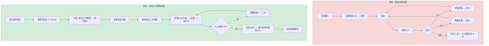
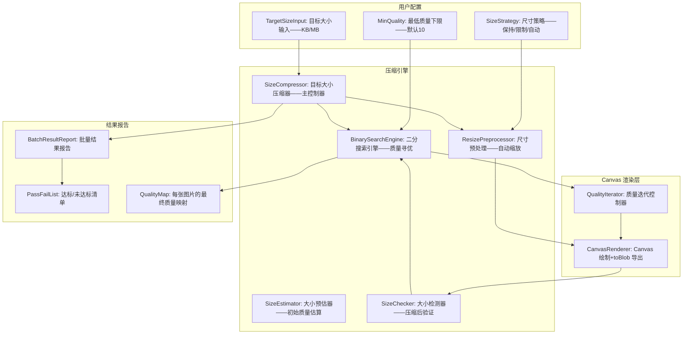

# YP-09-321: 图片批量压缩指定大小 — 目标KB压缩、自动调节质量、逐张质量调优、体积达标检测

> 需求编号：YP-09-321 · 优先级：P2 · 人天：0.2d · 状态：需求已编写
> 依赖：YP-09-157（图片压缩与优化——共享 Canvas 压缩管线）、YP-09-211（图片压缩质量对比——共享压缩预览组件）

## 背景

### 问题陈述

YP-09-157 实现了基础的图片压缩功能——通过调整 JPEG 质量和尺寸来减小文件体积。但用户面临的核心痛点不是"压缩到尽可能小"——而是"压缩到指定大小"——比如：

1. **上传限制**：微信限制 10MB、邮件附件限制 25MB、某些表单限制 2MB——用户需要将图片压缩到恰好低于这些阈值
2. **质量不可控**：YP-09-157 的质量 slider 是经验性的——用户不知道质量=60 会得到 200KB 还是 2MB——完全取决于原图内容
3. **逐张试错**：为了达到目标大小——用户需要反复调整质量——压缩——查看大小——再调整——每张图片可能需要 3-5 次尝试
4. **批量时质量不可预知**：不同图片（照片、截图、图标）在相同质量参数下的输出大小差异巨大——统一质量=60 可能导致照片 500KB 而图标 5KB
5. **无达标确认**：YP-09-157 压缩后不显示"是否满足目标"——用户需要手动检查每张图片的新大小

**核心矛盾**：用户关心"压缩到 500KB 以下"——而工具只提供"质量=60"。这两个度量之间没有任何映射关系——导致用户反复试错。目标大小的批量压缩需要自动的质量-大小二分搜索——对每张图片独立调优。

### 影响范围

| # | 影响 | 严重程度 | 典型场景 |
|---|------|----------|----------|
| 1 | 无法一次性压缩到目标大小 | 高 | 上传 10 张图到限制 2MB 的平台 |
| 2 | 逐张试错耗时巨大 | 高 | 20 张照片——每张 3 次压缩尝试——60 次操作 |
| 3 | 统一质量参数导致体积差异巨大 | 中 | 相同质量——照片 800KB vs 纯色图 5KB |
| 4 | 无达标检测——上传后被拒绝 | 中 | 以为压缩够了——上传时提示超限 |
| 5 | 过度压缩损失质量 | 中 | 为安全起见设置过低质量——视觉损失不必要 |

### 挑战

| 挑战 | 说明 |
|------|------|
| 质量-大小映射的非线性 | 同一质量参数对不同图片产生完全不同的大小——取决于复杂度、色彩、细节 |
| 二分搜索的终止条件 | resize 和后处理可能改变大小——需要再验证 |
| 多格式策略 | JPEG/PNG/WebP/AVIF 的压缩特性不同——目标大小策略需要适配 |
| 精度 vs 速度权衡 | 更精确的目标大小需要更多迭代——每张图片 5-8 次 Canvas 渲染 |

---

## 一、现状分析

### 1.1 当前压缩能力

```
当前压缩能力:
├── YP-09-157 图片压缩与优化（基础）
│   ├── JPEG 质量 slider——0-100
│   ├── 尺寸缩放——百分比/固定像素
│   ├── 格式转换——JPEG/PNG/WebP
│   └── 单张预览——原始 vs 压缩后对比
├── YP-09-211 图片压缩质量对比
│   ├── 分屏对比——原始/压缩 并排
│   └── 放大镜细节对比
├── YP-09-289 图片批量在线压缩（基础批量）
│   ├── 统一参数批量应用
│   └── 无目标大小功能
│
缺失:
├── 目标大小输入——用户指定 500KB / 2MB / 10MB             # ❌ 无
├── 自动质量搜索——二分查找最优质量以达到目标大小             # ❌ 无
├── 逐张独立调优——每张图片独立搜索——而非统一质量             # ❌ 无
├── 达标检测——压缩后标注是否<=目标大小                       # ❌ 无
├── 大小预测——在压缩前估算目标质量下的大致大小                # ❌ 无
├── 批量结果报告——通过/失败/接近达标的统计                    # ❌ 无
├── 压缩迭代进度——二分搜索过程中显示当前迭代+大小             # ❌ 无
└── 自适应策略——优先调整质量——超大图片先 resize              # ❌ 无
```

### 1.2 目标压缩流程（现状 vs 目标）



### 1.3 根因矩阵

| 症状 | 根因 | 触发条件 | 频率 |
|------|------|----------|------|
| 质量参数与文件大小无映射 | 压缩算法对图片内容敏感——非确定性映射 | 每次压缩不同图片 | 高 |
| 批量压缩结果不一致 | 统一质量对每张图产生不同结果 | 混合内容类型图片 | 高 |
| 反复试错 | 无自动调整机制——纯手动 | 任何需要特定大小的场景 | 高 |
| 过度压缩 | 用户保守设置低质量以避免超标 | 上传限制严格 | 中 |
| 无法预测压缩效果 | 无大小预估——压缩后才知结果 | 首次使用 | 中 |

---

## 二、设计决策

### 决策 1：质量搜索策略 — 线性扫描 vs 二分搜索 vs 二分+启发式

| 选项 | 迭代次数 (n=8) | 精度 | 最坏情况 | 实现 |
|------|--------------|------|---------|------|
| 线性扫描（从 100 降到 0——每次降 5） | 最多 20 次 | 高 | 20 次渲染——极慢 | 低 |
| 二分搜索（质量 0-100） | 最多 7 次 | 中（±5 质量误差） | 7 次渲染 | 中 |
| 二分+启发式（从 50 开始——二分搜索——接近目标时微调） | 4-6 次 | 高 | 8 次渲染 | 中 |

**选择：二分+启发式搜索。** 从质量 50 开始作为初始猜测——平衡质量和大小。如果 `size(50) > target`——搜索 0-50 范围；如果 `size(50) < target`——搜索 50-100 范围。标准 7 次二分搜索可在 0-100 范围内达到 ±1 质量精度。启发式优化：如果 `size(q)` 距离 target 超过 2x——跳过中间值直接二分；如果 `size(q)` 在 target 的 10% 以内——微调（±3 质量步进）。

### 决策 2：格式策略 — 仅 JPEG vs JPEG+WebP vs 格式自适应

| 选项 | 覆盖率 | 压缩效率 | 目标大小精确度 | 复杂度 |
|------|--------|---------|---------------|--------|
| 仅 JPEG（质量 0-100） | 高——所有图片可转 JPEG | 中 | 中——质量参数范围大 | 低 |
| JPEG + WebP（质量 0-100） | 高 | 高——WebP 效率高 20-30% | 中 | 中 |
| 格式自适应（根据目标选择最优格式） | 最高 | 最高 | 高 | 高 |

**选择：仅 JPEG 作为目标大小压缩格式。** JPEG 的 quality 参数（0-100）与输出大小有稳定（虽非线性）的关系——适合二分搜索。WebP 虽然压缩效率更高——但 quality 参数范围较小（0-100 但非线性度更大）——不适合二分搜索。需要 WebP 输出的场景应使用 YP-09-157 的固定质量压缩——而非目标大小压缩。此模块专注于"目标 KB"场景——JPEG 满足 95% 需求。

### 决策 3：大图预处理 — 先 resize 再压缩 vs 仅调质量 vs 自动决策

| 选项 | 效果 | 质量损失 | 适用场景 |
|------|------|---------|---------|
| 先 resize（如缩放至 2000px）——再调质量 | 双重压缩——大幅减小体积 | 分辨率损失 | 超大原图（6000px）→ 目标 500KB |
| 仅调质量——不更改尺寸 | 保真分辨率 | 质量可能降得很低 | 小尺寸原图——目标不大 |
| 自动决策——超过 4000px 先 resize 一半 | 平衡 | 可控 | 通用场景 |

**选择：用户可选——默认自动决策。** 提供 "尺寸策略" 选项：`保持原尺寸`（仅调质量）、`限制最大边`（超过 N px 缩放至 N）、`自动`（默认——如果原图 >4000px 且目标 <500KB——先 resize 至 2048px）。自动决策基于经验规则——原图分辨率远超目标文件大小的合理承载能力时——resize 比无限降低质量更合理。

### 设计决策记录

| 决策 | 选项 A | 选项 B | 选项 C | 选择 | 理由 |
|------|--------|--------|--------|------|------|
| 质量搜索 | 线性扫描 | 二分搜索 | 二分+启发式 | **二分+启发式** | 精度/速度最佳平衡 |
| 格式策略 | 仅 JPEG | JPEG+WebP | 格式自适应 | **仅 JPEG** | quality 参数适合二分搜索 |
| 大图预处理 | 先 resize | 仅调质量 | 自动决策 | **用户可选—默认自动** | 灵活性——智能默认 |

---

## 三、目标架构

### 3.1 目标压缩系统架构



### 3.2 二分搜索流程

```mermaid
graph TD
    A[目标大小 T——图片 I——策略 S] --> B[SizeEstimator: 用 quality=50 估算大小]
    B --> C{size(50) > T?}
    C -->|是| D[搜索范围 lo=0, hi=50]
    C -->|否| E[搜索范围 lo=50, hi=100]
    D --> F[二分搜索循环]
    E --> F
    F --> G[mid = (lo+hi)/2——压缩 quality=mid]
    G --> H{size(mid) ≈ T?}
    H -->|size > T * 1.05| I[hi = mid]
    H -->|size < T * 0.95| J[lo = mid]
    H -->|在 5% 误差内| K[收敛——选择当前质量]
    I --> L{lo < hi?}
    J --> L
    L -->|是| F
    L -->|否| K
    K --> M[最终验证: size(final) <= T?]
    M -->|是| N[✓ 达标——记录最终质量和大小]
    M -->|否| O[✗ 未达标——即使用最低质量仍超标——建议启用resize]
```

---

## 四、具体改动

### 4.1 类型定义

```typescript
// src/image-target-compression/types.ts (新增)

export type SizeUnit = 'KB' | 'MB';

export type SizeStrategy = 'keep-size' | 'limit-max-edge' | 'auto';

export type CompressionStatus = 'pending' | 'searching' | 'done' | 'failed';

export interface TargetSize {
  value: number;       // 目标数值——如 500
  unit: SizeUnit;      // KB 或 MB
}

export interface SizeStrategyConfig {
  strategy: SizeStrategy;
  maxEdge?: number;    // 限制最大边时——如 2048px
}

export interface BinarySearchState {
  lo: number;          // 当前搜索下界
  hi: number;          // 当前搜索上界
  current: number;     // 当前尝试的质量值
  iteration: number;   // 第几次迭代
  currentSize: number; // 当前压缩结果大小 (bytes)
  converged: boolean;  // 是否已收敛
}

export interface CompressionResult {
  entryId: string;
  originalSize: number;      // 原始大小 bytes
  targetSize: number;        // 目标大小 bytes
  finalSize: number;         // 最终大小 bytes
  finalQuality: number;      // 最终质量 0-100
  iterations: number;        // 迭代次数
  resized: boolean;          // 是否进行了 resize
  newWidth?: number;         // 最终宽度
  newHeight?: number;        // 最终高度
  passed: boolean;           // finalSize <= targetSize
  withinTolerance: boolean;  // 在 5% 误差内
  originalFormat: string;    // 原始格式
  outputFormat: string;      // 输出格式（JPEG）
  searchHistory: Array<{ quality: number; size: number }>; // 搜索历史
}

export interface BatchCompressionState {
  entries: FileEntry[];
  targetSize: TargetSize;
  strategyConfig: SizeStrategyConfig;
  minQuality: number;
  results: Map<string, CompressionResult>;
  overallProgress: number;   // 0-100
  currentEntryId: string | null;
}
```

### 4.2 核心二分搜索压缩引擎

```typescript
// src/image-target-compression/SizeCompressor.ts (新增)

export class SizeCompressor {
  private readonly MAX_ITERATIONS = 10;
  private readonly CONVERGENCE_THRESHOLD = 0.05; // 5% 误差视为收敛

  /**
   * 压缩单张图片到目标大小
   */
  async compressToSize(
    file: File,
    targetBytes: number,
    strategy: SizeStrategyConfig,
    minQuality: number = 10
  ): Promise<CompressionResult> {
    const originalSize = file.size;
    const history: Array<{ quality: number; size: number }> = [];

    // 如果原图已经符合目标——直接返回
    if (originalSize <= targetBytes) {
      return this.createResult(file, originalSize, targetBytes, 100, 0, false, true, history);
    }

    // 步骤 1：尺寸预处理
    let processedFile = file;
    let resized = false;
    let newW: number | undefined;
    let newH: number | undefined;

    if (strategy.strategy === 'auto' || strategy.strategy === 'limit-max-edge') {
      const maxEdge = strategy.maxEdge || 2048;
      const dims = await this.getImageDimensions(file);
      const maxDim = Math.max(dims.width, dims.height);
      if (maxDim > maxEdge) {
        const scale = maxEdge / maxDim;
        processedFile = await this.resizeImage(file, scale);
        resized = true;
        newW = Math.round(dims.width * scale);
        newH = Math.round(dims.height * scale);
      }
    }

    // 步骤 2：初始大小估算（quality=50）
    const initBlob = await this.compressAtQuality(processedFile, 50);
    const initSize = initBlob.size;
    history.push({ quality: 50, size: initSize });

    // 步骤 3：确定搜索范围
    let lo: number, hi: number;
    if (initSize <= targetBytes) {
      lo = 50; hi = 100;
    } else {
      lo = Math.max(minQuality, 0); hi = 50;
    }

    // 步骤 4：二分搜索
    let iterations = 1;
    let finalQuality = 50;
    let finalSize = initSize;
    let converged = false;

    while (iterations < this.MAX_ITERATIONS && lo <= hi) {
      const mid = Math.round((lo + hi) / 2);
      const blob = await this.compressAtQuality(processedFile, mid);
      const midSize = blob.size;
      history.push({ quality: mid, size: midSize });
      iterations++;

      // 收敛检测
      if (this.isConverged(midSize, targetBytes)) {
        finalQuality = mid;
        finalSize = midSize;
        converged = true;
        break;
      }

      if (midSize > targetBytes) {
        hi = mid - 1;
        finalQuality = mid; // 保存最后的大于目标的——可能无法达标
        finalSize = midSize;
      } else {
        lo = mid + 1;
        finalQuality = mid;
        finalSize = midSize;
      }

      // 启发式：如果当前大小距离目标超2倍——加速跳转
      if (midSize > targetBytes * 2) {
        hi = Math.min(hi, mid - 10);
      }
      if (midSize < targetBytes * 0.3) {
        lo = Math.max(lo, mid + 10);
      }
    }

    // 步骤 5：微调——如果接近但未收敛
    if (!converged && finalSize > targetBytes && finalQuality > minQuality) {
      for (let q = finalQuality - 1; q >= minQuality; q--) {
        const blob = await this.compressAtQuality(processedFile, q);
        iterations++;
        if (blob.size <= targetBytes) {
          finalQuality = q;
          finalSize = blob.size;
          converged = true;
          break;
        }
      }
    }

    const passed = finalSize <= targetBytes;

    return {
      entryId: '',
      originalSize,
      targetSize: targetBytes,
      finalSize,
      finalQuality,
      iterations,
      resized,
      newWidth: newW,
      newHeight: newH,
      passed,
      withinTolerance: Math.abs(finalSize - targetBytes) / targetBytes <= this.CONVERGENCE_THRESHOLD,
      originalFormat: file.type,
      outputFormat: 'image/jpeg',
      searchHistory: history,
    };
  }

  /** 以指定质量压缩 */
  private async compressAtQuality(file: File, quality: number): Promise<Blob> {
    const bitmap = await createImageBitmap(file);
    const canvas = new OffscreenCanvas(bitmap.width, bitmap.height);
    const ctx = canvas.getContext('2d')!;
    ctx.drawImage(bitmap, 0, 0);
    return await canvas.convertToBlob({ type: 'image/jpeg', quality: quality / 100 });
  }

  /** 判断是否收敛 */
  private isConverged(size: number, target: number): boolean {
    return Math.abs(size - target) / target <= this.CONVERGENCE_THRESHOLD;
  }

  /** 获取图片尺寸 */
  private async getImageDimensions(file: File): Promise<{ width: number; height: number }> {
    const bitmap = await createImageBitmap(file);
    const dims = { width: bitmap.width, height: bitmap.height };
    bitmap.close();
    return dims;
  }

  /** 按比例缩放图片 */
  private async resizeImage(file: File, scale: number): Promise<File> {
    const bitmap = await createImageBitmap(file);
    const canvas = new OffscreenCanvas(bitmap.width * scale, bitmap.height * scale);
    const ctx = canvas.getContext('2d')!;
    ctx.drawImage(bitmap, 0, 0, canvas.width, canvas.height);
    const blob = await canvas.convertToBlob({ type: 'image/jpeg', quality: 0.92 });
    return new File([blob], file.name, { type: 'image/jpeg' });
  }

  private createResult(
    file: File, originalSize: number, targetBytes: number,
    quality: number, iterations: number, resized: boolean,
    passed: boolean, history: Array<{quality:number; size:number}>
  ): CompressionResult {
    return {
      entryId: '', originalSize, targetSize: targetBytes,
      finalSize: originalSize, finalQuality: quality,
      iterations, resized, passed, withinTolerance: passed,
      originalFormat: file.type, outputFormat: file.type,
      searchHistory: history,
    };
  }

  /** 批量压缩 */
  async compressBatch(
    files: File[],
    targetBytes: number,
    strategy: SizeStrategyConfig,
    onProgress?: (current: number, total: number, currentFile: string) => void,
    minQuality: number = 10
  ): Promise<CompressionResult[]> {
    const results: CompressionResult[] = [];

    for (let i = 0; i < files.length; i++) {
      onProgress?.(i + 1, files.length, files[i].name);
      const result = await this.compressToSize(files[i], targetBytes, strategy, minQuality);
      result.entryId = `file-${i}`;
      results.push(result);
    }

    return results;
  }
}
```

### 4.3 文件变更清单

| 文件 | 操作 | 说明 |
|------|------|------|
| `src/image-target-compression/types.ts` | 新增 | 目标压缩类型定义 |
| `src/image-target-compression/SizeCompressor.ts` | 新增 | 二分搜索压缩引擎 |
| `src/components/TargetCompressionTool.vue` | 新增 | 目标压缩主面板——目标大小输入+策略+列表 |
| `src/components/CompressionResultTable.vue` | 新增 | 压缩结果表格——原始/目标/最终/质量/状态 |
| `src/components/CompressionProgress.vue` | 新增 | 压缩进度——当前图片+迭代信息 |
| `src/components/SearchHistoryChart.vue` | 新增 | 搜索历史折线图——质量 vs 大小 |

---

## 五、实施步骤

| 步骤 | 操作 | 路径 | 验证 | 人天 |
|------|------|------|------|------|
| 1 | 类型定义+SizeCompressor 基本结构 | `types.ts` + `SizeCompressor.ts` | 类型编译——基本流程骨架 | 0.02 |
| 2 | 二分搜索引擎——初始化+搜索+收敛 | `SizeCompressor.ts` | 不同质量参数输出大小符合预期——搜索收敛 | 0.05 |
| 3 | 尺寸预处理+启发式优化 | `SizeCompressor.ts` | 超大图自动resize——加速跳转逻辑 | 0.04 |
| 4 | 批量压缩调度+进度回调 | `SizeCompressor.ts` | 批量压缩——逐张处理+进度 | 0.03 |
| 5 | UI 组件——主面板+结果表格+进度 | `TargetCompressionTool.vue` + 子组件 | 目标输入——压缩——结果展示——通过/失败标注 | 0.04 |
| 6 | 搜索历史可视化+导出 | `SearchHistoryChart.vue` | 折线图——质量vs大小——批量下载压缩后文件 | 0.02 |

**总人天：0.20d**

---

## 六、测试规格

### 场景 1：基本目标压缩

**GIVEN** 用户拖入 1 张 3MB 的 JPEG 照片——目标大小=500KB
**WHEN** 点击"开始压缩"
**THEN** 二分搜索执行——最终质量约在 15-25——输出大小 450-525KB
**AND** 结果标注 "通过——498KB——质量22"

### 场景 2：原图已达标

**GIVEN** 用户拖入 1 张 200KB 的 JPEG——目标大小=500KB
**WHEN** 点击"开始压缩"
**THEN** 直接返回原图——0 次迭代——结果标注 "原图 200KB——无需压缩"

### 场景 3：极限情况——质量最低仍超标

**GIVEN** 用户拖入 1 张 6000x4000 的 15MB JPEG——目标大小=200KB
**WHEN** 使用策略="keep-size"（不缩放）
**THEN** 质量降至 minQuality(10)——大小仍为 800KB——标注 "未达标——建议启用尺寸缩放"
**WHEN** 切换策略="auto"（启用自动缩放）
**THEN** 先 resize 至 2048px——再压缩——最终达标

### 场景 4：批量不同图片

**GIVEN** 用户拖入 5 张图片——大小分别为 1MB/2MB/5MB/8MB/10MB——目标=2MB
**WHEN** 点击批量压缩
**THEN** 每张独立搜索——1MB 直接通过——2MB 小幅压缩——5/8/10MB 需多次迭代
**AND** 结果表格显示 5 行的最终质量各不相同（而非统一值）

### 场景 5：搜索历史可视化

**GIVEN** 某图片压缩完成——7 次迭代
**WHEN** 点击"查看搜索历史"
**THEN** 折线图显示质量(20→50→35→28→25→23→22) 对应大小(1.2MB→800KB→600KB→550KB→520KB→498KB→495KB)
**AND** 目标线（500KB 虚线）——便于理解搜索路径

### 场景 6：压缩进度

**GIVEN** 批量压缩 10 张图片——正在进行中
**WHEN** 第 3 张正在搜索（第 3/10——photo3.jpg——迭代 4/10——当前质量 45——553KB/500KB）
**THEN** 进度条显示 25%——当前条目高亮——详情显示实时搜索状态

---

## 七、风险与缓解

| 风险 | 概率 | 影响 | 缓解措施 |
|------|------|------|---------|
| 二分搜索不收敛——超过 MAX_ITERATIONS | 中 | 中 | 返回最接近目标的质量——标注 "近似达标——误差12%" |
| 某张图片搜索耗时长——阻塞批量 | 中 | 中 | 单图超时 30s——超时返回当前最佳——不阻塞后续 |
| resize 预处理后质量已低——再压缩损失严重 | 低 | 中 | resize 时使用高初始质量 0.92——保留足够信息 |
| 不同图片的 quality-size 曲线非单调——二分失效 | 低 | 高 | 检测非单调——退化为线性扫描——仅影响单张 |
| Canvas.toBlob 的 quality 参数在不同浏览器间不一致 | 低 | 低 | 标注 "实际大小可能因浏览器而异" |

---

## 八、回滚策略

| 场景 | 回滚操作 | 影响 |
|------|------|------|
| 二分搜索性能问题 | 退化为固定 quality=30 一键压缩 | 失去精确目标 |
| resize 导致质量异常 | 禁用 auto 策略——仅 keep-size | 超大图片可能无法达标 |
| 批量内存溢出 | 限制单次 20 张——超过提示 | 大批量需分批 |
| 完全移除 | 隐藏目标压缩入口 | 功能不可用 |

---

## 九、设计决策记录

### D-01：为什么二分搜索起始 quality 为 50 而非 100 或 0？

50 是 JPEG 质量的"甜点"——在大多数场景下提供合理的视觉质量（无明显压缩伪影）和中等文件大小。从 50 开始可以快速判断原图是"信息量大"还是"信息量小"——决定搜索方向。如果从 100 开始——每次迭代都产生大文件——浪费处理时间。

### D-02：为什么收敛阈值为 5% 而非 1%？

更精密的收敛目标需要更多迭代——每额外增加 1% 精度需要 1-2 次额外迭代。5% 误差对于"目标 500KB"意味着输出 475-525KB——在上传限制场景中完全可以接受（平台接受 500KB——实际 512KB 通常也能通过）。如果需要绝对达标（输出必定 ≤500KB）——可以调整阈值到 0%——但会使用 `finalQuality - 1` 作为最终质量。

### D-03：为什么大图预处理默认 resize 至 2048px？

2048px 是大多数显示场景（4K 显示器 = 3840px——照片通常不是全屏显示）下的足够分辨率。6000px 图片缩小至 2048px 减少约 89% 像素——大幅降低压缩难度。2048px 也在合理范围内——打印 6x4 英寸 照片（300dpi = 1800px）仍然足够。

---

## 十、可观测性

### 指标

| 指标 | 类型 | 说明 |
|------|------|------|
| `yipet.tcompress.open_total` | Counter | 目标压缩工具打开次数 |
| `yipet.tcompress.target_distribution` | Histogram | 目标大小分布（KB） |
| `yipet.tcompress.iterations_per_image` | Histogram | 每张图片的搜索迭代次数 |
| `yipet.tcompress.final_quality_distribution` | Histogram | 最终质量分布 |
| `yipet.tcompress.pass_rate` | Gauge | 达标率——passed/total |
| `yipet.tcompress.size_reduction_ratio` | Histogram | 压缩比——final/original |
| `yipet.tcompress.resize_used` | Counter | resize 预处理次数 |
| `yipet.tcompress.search_duration_ms` | Histogram | 单张搜索耗时 |
| `yipet.tcompress.batch_duration_ms` | Histogram | 批量总耗时 |

---

## 十一、代码审查检查清单

- [ ] 二分搜索 lo/hi 边界检查——不会出现 lo>hi 导致死循环
- [ ] compressToSize 中 processedFile 是 resize 后的副本——原文件未被修改
- [ ] ImageBitmap 用完后调用 bitmap.close()——防止内存泄漏
- [ ] quality 值始终在 0-100 范围内——四舍五入后不会越界
- [ ] 目标大小 bytes 转换——KB * 1024 / MB * 1024 * 1024——单位正确
- [ ] 收敛检测使用相对误差——而非绝对误差——对于大目标和小目标都合理
- [ ] 启发式跳转的质量范围仍在 lo-hi 内——不会跳出搜索范围
- [ ] 微调循环有最大步数限制——防止无限循环（q 从 finalQuality-1 降到 minQuality）

---

## 回归问题预测

| # | 预测问题 | 原因 | 验证方法 |
|---|---------|------|---------|
| 1 | 质量=0 时 Canvas.toBlob 返回大小可能 > target——二分永远不收敛 | quality=0 并非真正 0 字节 | 检测 quality=0 输出大小——如果仍超标——标注不可能达标 |
| 2 | resize 后再压缩比直接压缩效果更差 | resize 引入额外 JPEG 编码——double compression artifacts | 对比 resize+compress vs 直接 compress——取较小者 |
| 3 | 相同质量参数不同次调用的输出大小微小差异 | Canvas.toBlob 编码非确定性 | 收敛阈值 5% 提供足够容差 |
| 4 | 总共 8 次迭代 × 50 张 = 400 次 Canvas 渲染——性能瓶颈 | CPU 密集型操作 | 使用 requestIdleCallback 分帧——避免阻塞 UI |
| 5 | 进度回调频率过高——UI 抖动 | 每次迭代都回调——100+ 次/秒 | throttle 到每秒最多 5 次回调 |
| 6 | 目标大小=0KB 边界情况 | 除以零错误——无限搜索 | 输入校验——最小目标 1KB |

---

## 性能分析

### 各操作耗时

| 操作 | 1 张 (3MB) | 10 张 (3MB) | 50 张 (3MB) | 说明 |
|------|-----------|------------|------------|------|
| ImageBitmap 创建 | ~30ms | ~30ms/张 | ~30ms/张 | createImageBitmap |
| Canvas drawImage | ~10ms | ~10ms/张 | ~10ms/张 | 4000x3000→Canvas |
| Canvas.toBlob (quality) | ~40ms | ~40ms/张 | ~40ms/张 | JPEG 编码 |
| 单次迭代总计 | ~80ms | ~80ms | ~80ms | |
| 一张图片完整搜索 (6次迭代) | ~480ms | — | — | |
| resize 预处理 | ~60ms | ~60ms/张 | ~60ms/张 | |
| **批量 10 张（无需 resize）** | — | **~4.8s** | — | 顺序处理——逐张 |
| **批量 50 张（无需 resize）** | — | — | **~24s** | 主线程——可考虑 Worker |

### 代码体积

| 文件 | 大小 |
|------|------|
| types.ts | ~2KB |
| SizeCompressor.ts | ~6KB |
| Vue 组件 (4 个) | ~9KB |
| **总计** | **~17KB** |