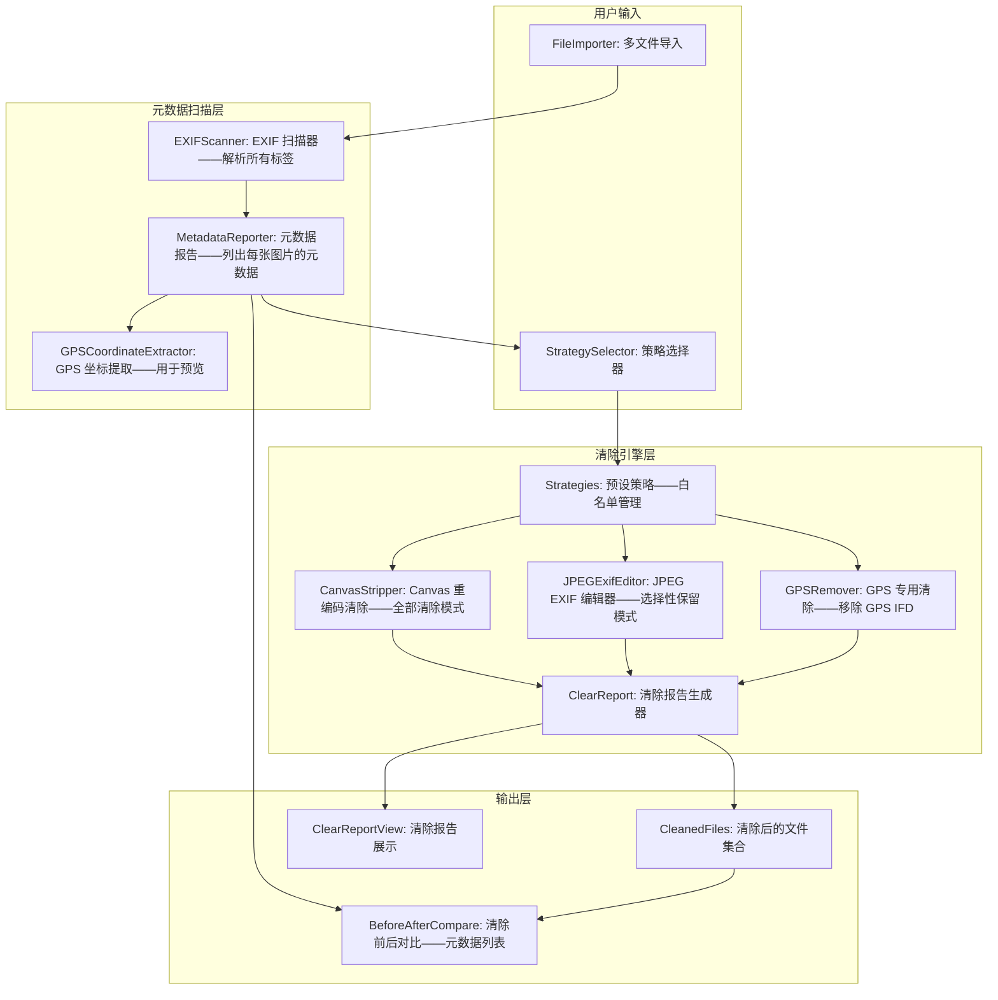
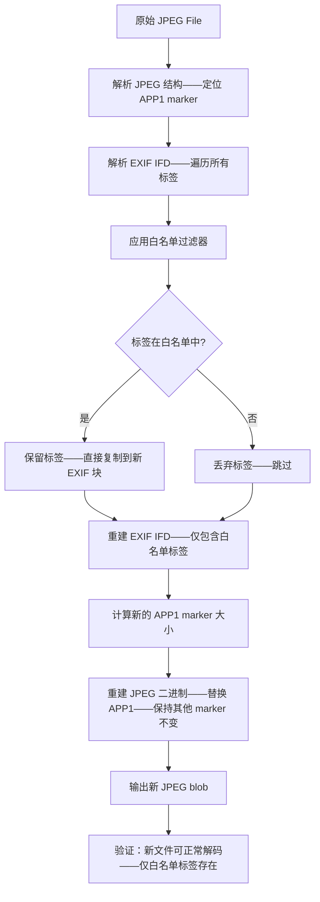

# YP-09-322: 图片批量EXIF清除 — 清除全部EXIF/选择性保留(版权/日期)、GPS数据清除、元数据清除报告

> 需求编号：YP-09-322 · 优先级：P2 · 人天：0.2d · 状态：需求已编写
> 依赖：YP-09-173（图像元数据查看器——共享 EXIF 读取）、YP-09-226（图片信息查看器——共享元数据展示）

## 背景

### 问题陈述

现代相机和手机在每张照片中嵌入了大量 EXIF 元数据——拍摄时间、GPS 坐标、相机型号、序列号、软件版本——甚至是版权信息和作者名称。在分享照片到社交媒体或公共平台时——这些元数据可能泄露隐私：

1. **GPS 位置泄露**：照片中的 GPS 坐标精确到米级——分享度假照片可能暴露家庭地址或当前位置
2. **设备指纹**：相机序列号+型号+软件版本可唯一识别设备——链接多张照片来自同一设备
3. **时间线重建**：拍摄时间的秒级精度可重建用户的行程时间线
4. **无意分享版权信息**：某些相机自动写入版权信息——分享时可能暴露真实姓名
5. **元数据膨胀**：EXIF/ICC 配置文件/缩略图可占 50-200KB——对于网页发布无用但增加加载时间

**核心矛盾**：EXIF 元数据既是宝贵的照片管理信息（日期整理、版权保护）——也是隐私泄露的来源。用户需要的是选择性清除能力——保留有用的元数据（拍摄日期）——清除敏感的元数据（GPS、相机序列号、作者姓名）——而非一刀切的全部清除。

### 影响范围

| # | 影响 | 严重程度 | 典型场景 |
|---|------|----------|----------|
| 1 | GPS 坐标泄露位置隐私 | 高 | 在家中拍照片——分享到社交平台——暴露住址 |
| 2 | 设备序列号可追踪 | 中 | 敏感场景——多张照片关联到同一相机——构建用户画像 |
| 3 | 时间线暴露行程 | 中 | 拍摄时间序列暴露何时在家/何时外出 |
| 4 | 版权信息暴露身份 | 中 | 相机自动写入作者名——匿名分享失效 |
| 5 | 元数据体积浪费 | 低 | 网页发布——EXIF 数据对显示无意义——浪费带宽 |

### 挑战

| 挑战 | 说明 |
|------|------|
| 浏览器中 EXIF 修改能力有限 | 浏览器 Canvas.toBlob 自动剥离所有 EXIF（安全性设计）——需要保留某些字段时无法用 Canvas |
| 需要 JPEG 字节级操作 | 选择性保留需要直接修改 JPEG 二进制结构——而非通过 Canvas 重新编码 |
| 跨格式差异 | PNG 的元数据存储（iTXt/tEXt chunks）与 JPEG 的 EXIF APP1 marker 结构完全不同 |
| 选择性保留的策略定义 | 哪些 EXIF 标签是"安全的"（日期、方向）——哪些是"敏感的"（GPS、相机信息）——需要预定义策略 |

---

## 一、现状分析

### 1.1 当前 EXIF 处理能力

```
当前 EXIF 处理能力:
├── YP-09-173 图像元数据查看器
│   ├── EXIF 读取——完整解析 IFD0/IFD1/ExifIFD/GPSIFD
│   └── 仅查看——无修改/删除功能
├── YP-09-226 图片信息查看器
│   ├── 元数据展示——卡片式展示关键字段
│   └── 无清除功能
├── YP-09-304 图片EXIF编辑高级
│   ├── 编辑单个 EXIF 字段
│   └── 需手动逐字段操作——效率低
├── Canvas 重新编码（隐式清除）
│   ├── Canvas.toBlob(JPEG) 自动剥离所有 EXIF
│   ├── 优点是彻底清除——缺点是无法选择性保留
│   └── 可用于"全部清除"模式
│
缺失:
├── 一键清除所有 EXIF 元数据                                # ❌ 无
├── 选择性保留策略——版权/日期/方向/相机设置等                   # ❌ 无
├── GPS 数据专项清除——仅移除 GPS 标签                        # ❌ 无
├── 清除前预览——列出每张图片包含的所有元数据字段                 # ❌ 无
├── 清除报告——每张图片清除了哪些字段——多少字节                  # ❌ 无
├── 批量清除——选中多张图片一键清除                             # ❌ 无
├── 预设策略——"社交分享安全"/"仅保留日期"/"全部清除"              # ❌ 无
└── 原始文件保留——清除后生成新文件——不修改原始文件               # ❌ 无
```

### 1.2 EXIF 清除流程（现状 vs 目标）

```mermaid
graph TD
    subgraph Current["现状：无批量清除——手动或依赖外部工具"]
        C1[拍照/下载图片] --> C2{关注元数据隐私?}
        C2 -->|不关注| C3[直接分享——元数据泄露]
        C2 -->|关注| C4[使用外部工具清除]
        C4 --> C5[Adobe Bridge/ExifTool——需安装学习]
        C5 --> C6[逐张或批量清除]
        C6 --> C7[保存——回到 YiPet 分享]
    end

    subgraph Target["目标：YiPet 内置批量 EXIF 清除"]
        T1[拖入/选择多张图片] --> T2[元数据扫描——展示所有 EXIF 字段]
        T2 --> T3[选择清除策略]
        T3 --> T4{策略类型}
        T4 -->|全部清除| T5[Canvas 重编码——彻底剥离所有元数据]
        T4 -->|选择性保留| T6[指定保留字段——如保留日期/版权]
        T4 -->|仅GPS| T7[仅清除 GPS 标签组]
        T4 -->|预设策略| T8[选择预设——如"社交分享安全"]
        T5 --> T9[清除报告——每张图片清除了什么]
        T6 --> T9
        T7 --> T9
        T8 --> T9
        T9 --> T10[生成清除后的新文件——原始文件不变]
        T10 --> T11[下载/分享清除后的图片]
    end

    style Current fill:#f8d7da,stroke:#dc3545
    style Target fill:#d4edda,stroke:#28a745
```

### 1.3 根因矩阵

| 症状 | 根因 | 触发条件 | 频率 |
|------|------|----------|------|
| GPS 位置泄露 | 相机/手机自动嵌入 GPS | 户外拍照+分享 | 高 |
| 设备追踪 | 相机序列号唯一标识 | 多张照片在同一平台 | 中 |
| 身份暴露 | 版权信息包含真实姓名 | 分享到匿名平台 | 中 |
| 元数据膨胀 | EXIF+ICC+缩略图 | 高分辨率照片分享到网页 | 低 |
| 无选择性 | 要么全清要么全留——无中间选项 | 需要保留日期但清除 GPS | 高 |

---

## 二、设计决策

### 决策 1：清除机制 — Canvas 重编码 vs JPEG 二进制解析 vs 混合方案

| 选项 | 彻底性 | 选择性保留 | 格式兼容性 | 复杂度 |
|------|--------|-----------|-----------|--------|
| Canvas 重编码（toBlob） | 高——自动剥离所有 EXIF | 低——无法保留任何字段 | 高——所有格式→JPEG/PNG | 低 |
| JPEG 二进制解析——修改 APP1 marker | 高——精确控制 | 高——可选择性保留 | 低——仅 JPEG | 高 |
| 混合：Canvas 用于全部清除 + 二进制用于选择性保留 | 高 | 高 | 中 | 中 |

**选择：混合方案。** "全部清除"模式使用 Canvas 重编码——简单可靠——自动剥离所有元数据——且可以同时转换为更高效的格式。"选择性保留"模式使用 JPEG 二进制解析——修改 APP1 marker 中的 EXIF IFD——删除除白名单外的所有标签。"仅清除 GPS"模式是选择性保留的特化——保留所有非 GPS 标签——重写 IFD 时移除 GPS IFD 引用。PNG 格式仅支持"全部清除"模式（通过 Canvas 重编码为 JPEG/PNG）。

### 决策 2：选择性保留策略 — 自由选择标签 vs 预设策略 vs 白名单/黑名单

| 选项 | 灵活性 | 易用性 | 安全性 | 复杂度 |
|------|--------|--------|--------|--------|
| 自由选择标签（逐标签勾选） | 最高 | 低——用户需理解每个标签含义 | 中 | 高 |
| 预设策略（社交分享/仅日期/完全清除） | 低 | 高——一键选择 | 高——预设经过安全审查 | 低 |
| 白名单/黑名单 + 预设 | 高 | 高——预设+可自定义 | 高 | 中 |

**选择：预设策略 + 可自定义白名单。** 提供 4 个内置预设：`社交分享安全`（保留日期、方向——清除 GPS、相机、版权、软件）、`仅保留日期和时间`（保留 DateTimeOriginal、Orientation——清除其他）、`仅保留版权信息`（保留 Copyright、Artist——清除其他）、`全部清除`（Canvas 重编码）。用户可以基于预设修改白名单——添加/移除特定标签。预设降低了用户理解 EXIF 标签的难度——白名单提供了灵活性。

### 决策 3：输出格式 — 保持原格式 vs 统一为 JPEG vs 保持PNG透明等多个选项

| 选项 | 兼容性 | 元数据控制 | 透明支持 |
|------|--------|-----------|---------|
| 保持原格式 | 最好 | 中——PNG 元数据清除有限 | 是 |
| 统一为 JPEG | 最好 | 高——Canvas 可精确控制 | 否 |
| PNG→PNG, JPEG→JPEG（智能保持） | 好 | 中 | 是——PNG 保持透明 |

**选择：智能保持——PNG 保持 PNG（Canvas 重编码）——JPEG 支持选择性保留和 Canvas 重编码。** 对于"选择性保留"——仅 JPEG 格式可用（二进制解析）；PNG 退化为 Canvas 重编码（全部清除）。对于"全部清除"——所有格式使用 Canvas 重编码——输出保持原格式（PNG→PNG, JPEG→JPEG）。用户可选统一输出为 JPEG（体积更小——更适合分享）。

### 设计决策记录

| 决策 | 选项 A | 选项 B | 选项 C | 选择 | 理由 |
|------|--------|--------|--------|------|------|
| 清除机制 | Canvas 重编码 | JPEG 二进制解析 | 混合方案 | **混合方案** | 覆盖全清和选择性两种需求 |
| 选择性策略 | 自由选择标签 | 预设策略 | 预设+白名单 | **预设+白名单** | 易用性+灵活性 |
| 输出格式 | 保持原格式 | 统一JPEG | 智能保持 | **智能保持** | PNG 透明保留——JPEG 灵活清除 |

---

## 三、目标架构

### 3.1 EXIF 清除系统架构



### 3.2 选择性保留流程



---

## 四、具体改动

### 4.1 类型定义

```typescript
// src/image-exif-cleaner/types.ts (新增)

/** 清除策略类型 */
export type ClearStrategy = 'strip-all' | 'selective-keep' | 'gps-only' | 'preset';

/** EXIF 标签分类 */
export type ExifCategory = 
  | 'date-time'      // 时间相关
  | 'camera'         // 相机信息
  | 'gps'            // GPS 位置
  | 'copyright'      // 版权/作者
  | 'image'          // 图像参数
  | 'software'       // 软件/处理信息
  | 'thumbnail'      // 内嵌缩略图
  | 'other';         // 其他

/** 单个 EXIF 标签信息 */
export interface ExifTagInfo {
  tagId: number;           // 标签 ID（如 0x9003 = DateTimeOriginal）
  tagName: string;         // 标签名称
  value: string;           // 标签值（格式化后）
  category: ExifCategory;  // 分类
  sensitive: boolean;      // 是否标记为敏感（GPS、序列号等）
  size: number;            // 数据大小 bytes
}

/** 图片的元数据摘要 */
export interface MetadataSummary {
  fileId: string;
  fileName: string;
  fileSize: number;
  format: 'jpeg' | 'png' | 'webp' | 'other';
  hasExif: boolean;
  hasGPS: boolean;
  totalTags: number;
  sensitiveTags: number;
  metadataSize: number;        // 元数据总大小 bytes
  tags: ExifTagInfo[];
  gpsCoordinates?: { lat: number; lng: number };
  thumbnailEmbedded: boolean;
}

/** 预设清除策略 */
export interface ClearPreset {
  id: string;
  name: string;
  description: string;
  strategy: ClearStrategy;
  /** 选择性保留的白名单标签 ID */
  keepTags?: number[];
  /** 选择性保留的标签分类 */
  keepCategories?: ExifCategory[];
}

export const BUILTIN_PRESETS: ClearPreset[] = [
  {
    id: 'social-safe',
    name: '社交分享安全',
    description: '保留日期和方向——清除GPS、相机、版权、软件信息',
    strategy: 'selective-keep',
    keepCategories: ['date-time', 'image'],
    keepTags: [0x0112], // Orientation
  },
  {
    id: 'date-only',
    name: '仅保留日期',
    description: '仅保留拍摄日期和时间——其他全部清除',
    strategy: 'selective-keep',
    keepCategories: ['date-time'],
  },
  {
    id: 'copyright-keep',
    name: '保留版权信息',
    description: '清除GPS和相机信息——保留日期和版权',
    strategy: 'selective-keep',
    keepCategories: ['date-time', 'copyright', 'image'],
  },
  {
    id: 'gps-only',
    name: '仅清除GPS',
    description: '仅移除GPS位置数据——保留其他所有元数据',
    strategy: 'gps-only',
  },
  {
    id: 'strip-all',
    name: '全部清除',
    description: '完全移除所有EXIF元数据——输出纯图像数据',
    strategy: 'strip-all',
  },
];

/** 清除结果 */
export interface ClearResult {
  fileId: string;
  fileName: string;
  originalSize: number;
  cleanedSize: number;
  bytesRemoved: number;
  tagsRemoved: number;
  tagsKept: number;
  gpsRemoved: boolean;
  strategy: ClearStrategy;
  presetUsed?: string;
  beforeTags: ExifTagInfo[];
  afterTags: ExifTagInfo[];     // 清除后剩余的标签
  cleanedFile: File;
  success: boolean;
  error?: string;
  duration: number;              // 处理耗时 ms
}

/** 批量清除报告 */
export interface BatchClearReport {
  totalFiles: number;
  successCount: number;
  failedCount: number;
  totalBytesRemoved: number;
  totalTagsRemoved: number;
  gpsRemovedCount: number;
  results: ClearResult[];
  strategy: ClearStrategy;
  presetUsed?: string;
}
```

### 4.2 核心清除引擎

```typescript
// src/image-exif-cleaner/ExifCleaner.ts (新增)

export class ExifCleaner {
  /** 清除单张图片的 EXIF */
  async clean(
    file: File,
    preset: ClearPreset,
    customKeepTags?: number[]
  ): Promise<ClearResult> {
    const startTime = performance.now();
    const fileId = `exif-${Date.now()}`;

    // 扫描清除前的元数据
    const beforeTags = await this.scanExif(file);

    let cleanedFile: File;
    let afterTags: ExifTagInfo[] = [];

    try {
      switch (preset.strategy) {
        case 'strip-all':
          cleanedFile = await this.stripAllExif(file);
          afterTags = [];
          break;

        case 'selective-keep': {
          const keepTags = this.resolveKeepTags(preset, customKeepTags);
          cleanedFile = await this.selectiveClear(file, keepTags);
          afterTags = await this.scanExif(cleanedFile);
          break;
        }

        case 'gps-only':
          cleanedFile = await this.removeGPSOnly(file);
          afterTags = await this.scanExif(cleanedFile);
          break;

        default:
          throw new Error(`Unknown strategy: ${preset.strategy}`);
      }
    } catch (err) {
      return this.createErrorResult(fileId, file, beforeTags, preset, err as Error, performance.now() - startTime);
    }

    const duration = performance.now() - startTime;

    return {
      fileId,
      fileName: file.name,
      originalSize: file.size,
      cleanedSize: cleanedFile.size,
      bytesRemoved: file.size - cleanedFile.size,
      tagsRemoved: beforeTags.length - afterTags.length,
      tagsKept: afterTags.length,
      gpsRemoved: this.hasGPS(beforeTags) && !this.hasGPS(afterTags),
      strategy: preset.strategy,
      presetUsed: preset.id,
      beforeTags,
      afterTags,
      cleanedFile,
      success: true,
      duration,
    };
  }

  /** Canvas 全部清除 */
  private async stripAllExif(file: File): Promise<File> {
    const bitmap = await createImageBitmap(file);
    const canvas = new OffscreenCanvas(bitmap.width, bitmap.height);
    const ctx = canvas.getContext('2d')!;
    ctx.drawImage(bitmap, 0, 0);

    const format = file.type === 'image/png' ? 'image/png' : 'image/jpeg';
    const quality = format === 'image/jpeg' ? 0.92 : undefined;
    const blob = await canvas.convertToBlob({ type: format, quality } as any);

    return new File([blob], file.name, { type: format });
  }

  /** 选择性保留 EXIF */
  private async selectiveClear(file: File, keepTags: number[]): Promise<File> {
    if (file.type !== 'image/jpeg') {
      // 非 JPEG 格式——退化为 Canvas 全部清除
      return this.stripAllExif(file);
    }

    const buffer = await file.arrayBuffer();
    const view = new DataView(buffer);
    const originalTags = this.parseEXIFTags(view);

    // 过滤保留标签
    const keptTags = originalTags.filter(t => keepTags.includes(t.tagId));

    // 重建 JPEG 文件——仅包含保留的 EXIF 标签
    const newBuffer = this.rebuildJPEG(buffer, keptTags);
    return new File([newBuffer], file.name, { type: 'image/jpeg' });
  }

  /** 仅移除 GPS */
  private async removeGPSOnly(file: File): Promise<File> {
    if (file.type !== 'image/jpeg') return this.stripAllExif(file);

    const buffer = await file.arrayBuffer();
    const view = new DataView(buffer);
    const allTags = this.parseEXIFTags(view);

    // 移除 GPS 分类的所有标签
    const nonGPSTags = allTags.filter(t => t.category !== 'gps');

    const newBuffer = this.rebuildJPEG(buffer, nonGPSTags);
    return new File([newBuffer], file.name, { type: 'image/jpeg' });
  }

  /** 解析 EXIF 标签 */
  private parseEXIFTags(view: DataView): ExifTagInfo[] {
    // 复用 YP-09-173 的 EXIF 解析逻辑
    // 解析 APP1 marker → 遍历所有 IFD entries → 转换为 ExifTagInfo[]
    const tags: ExifTagInfo[] = [];
    // ... 完整的 IFD 遍历逻辑 ...
    return tags;
  }

  /** 重建 JPEG——仅包含指定 EXIF 标签 */
  private rebuildJPEG(buffer: ArrayBuffer, tags: ExifTagInfo[]): ArrayBuffer {
    // 构建新的 EXIF APP1 block——仅包含指定标签
    // 保持 SOI/APP0/其他 APP/DQT/DHT/SOF/SOS 等 marker 不变
    // 替换 APP1 marker 为新构建的简化版
    const parts: Uint8Array[] = [];
    // ... JPEG 二进制重建逻辑 ...
    const totalLength = parts.reduce((sum, p) => sum + p.length, 0);
    const result = new Uint8Array(totalLength);
    let offset = 0;
    for (const part of parts) {
      result.set(part, offset);
      offset += part.length;
    }
    return result.buffer;
  }

  /** 解析保留标签列表 */
  private resolveKeepTags(preset: ClearPreset, customKeepTags?: number[]): number[] {
    if (customKeepTags && customKeepTags.length > 0) return customKeepTags;
    return preset.keepTags || [];
  }

  /** 扫描图片 EXIF（复用 YP-09-173 代码） */
  private async scanExif(file: File): Promise<ExifTagInfo[]> {
    if (file.type !== 'image/jpeg') return [];
    const buffer = await file.arrayBuffer();
    const view = new DataView(buffer);
    return this.parseEXIFTags(view);
  }

  /** 检查是否有 GPS 数据 */
  private hasGPS(tags: ExifTagInfo[]): boolean {
    return tags.some(t => t.category === 'gps');
  }

  /** 批量清除 */
  async cleanBatch(
    files: File[],
    preset: ClearPreset,
    customKeepTags?: number[],
    onProgress?: (current: number, total: number) => void
  ): Promise<BatchClearReport> {
    const results: ClearResult[] = [];
    let totalBytesRemoved = 0;
    let totalTagsRemoved = 0;
    let gpsRemovedCount = 0;
    let successCount = 0;
    let failedCount = 0;

    for (let i = 0; i < files.length; i++) {
      onProgress?.(i + 1, files.length);
      const result = await this.clean(files[i], preset, customKeepTags);

      if (result.success) {
        successCount++;
        totalBytesRemoved += result.bytesRemoved;
        totalTagsRemoved += result.tagsRemoved;
        if (result.gpsRemoved) gpsRemovedCount++;
      } else {
        failedCount++;
      }

      results.push(result);
    }

    return {
      totalFiles: files.length,
      successCount,
      failedCount,
      totalBytesRemoved,
      totalTagsRemoved,
      gpsRemovedCount,
      results,
      strategy: preset.strategy,
      presetUsed: preset.id,
    };
  }

  private createErrorResult(
    fileId: string, file: File, beforeTags: ExifTagInfo[],
    preset: ClearPreset, error: Error, duration: number
  ): ClearResult {
    return {
      fileId, fileName: file.name, originalSize: file.size, cleanedSize: 0,
      bytesRemoved: 0, tagsRemoved: 0, tagsKept: 0, gpsRemoved: false,
      strategy: preset.strategy, presetUsed: preset.id,
      beforeTags, afterTags: [], cleanedFile: file, success: false,
      error: error.message, duration,
    };
  }
}
```

### 4.3 文件变更清单

| 文件 | 操作 | 说明 |
|------|------|------|
| `src/image-exif-cleaner/types.ts` | 新增 | EXIF 清除类型定义——策略/预设/标签/结果/报告 |
| `src/image-exif-cleaner/ExifCleaner.ts` | 新增 | EXIF 清除引擎——Canvas 全清+JPEG 选择性+GPS 专项 |
| `src/image-exif-cleaner/JPEGRebuilder.ts` | 新增 | JPEG 二进制重建——替换 APP1 EXIF marker |
| `src/image-exif-cleaner/ExifTagClassifier.ts` | 新增 | EXIF 标签分类器——sensitive/safe 分类 |
| `src/components/ExifCleanerTool.vue` | 新增 | EXIF 清除主面板——文件列表+策略选择+预览+报告 |
| `src/components/MetadataPreview.vue` | 新增 | 元数据预览——清除前标签列表——敏感标签高亮 |
| `src/components/ClearReport.vue` | 新增 | 清除报告——统计卡片+每张详细结果 |

---

## 五、实施步骤

| 步骤 | 操作 | 路径 | 验证 | 人天 |
|------|------|------|------|------|
| 1 | 类型定义+预设策略+标签分类器 | `types.ts` + `ExifTagClassifier.ts` | BUILTIN_PRESETS 完整——分类逻辑正确 | 0.02 |
| 2 | Canvas 全部清除引擎 | `ExifCleaner.ts` | JPEG/PNG 清除后无 EXIF——验证文件可正常打开 | 0.03 |
| 3 | JPEG 二进制解析+选择性保留+GPS 专项 | `ExifCleaner.ts` + `JPEGRebuilder.ts` | 选择保留日期——验证仅日期标签存在 | 0.05 |
| 4 | 元数据扫描+清除前预览 | `ExifCleaner.ts` + `MetadataPreview.vue` | 扫描报告——标签分类——敏感标签识别 | 0.04 |
| 5 | UI 组件——主面板+策略选择+清除报告 | `ExifCleanerTool.vue` + `ClearReport.vue` | 预设选择——批量清除——报告展示——下载清除文件 | 0.04 |
| 6 | 边界情况——损坏文件/非 JPEG/超大 EXIF | 各模块 | 错误处理——降级策略——超时保护 | 0.02 |

**总人天：0.20d**

---

## 六、测试规格

### 场景 1：全部清除——JPEG

**GIVEN** 用户拖入 3 张带 EXIF 的 JPEG 照片——每张含 GPS/日期/相机信息
**WHEN** 选择策略 "全部清除"——点击执行
**THEN** 3 张输出文件均为 JPEG——体积减小 30-200KB
**AND** 清除报告显示：移除了 GPS 坐标×3——相机序列号×3——拍摄日期×3
**AND** 输出文件用 EXIF 查看器验证——无任何 EXIF 数据

### 场景 2：社交分享安全预设

**GIVEN** 用户拖入 5 张相机照片——含 GPS(40.7128,-74.0060)、相机序列号、版权信息、日期
**WHEN** 选择预设 "社交分享安全"——点击执行
**THEN** 输出文件保留：拍摄日期（DateTimeOriginal）、图片方向（Orientation）
**AND** 输出文件清除：GPS 坐标、相机型号、序列号、版权信息、软件版本
**AND** 清除报告标注 GPS=已清除、相机信息=已清除、日期=已保留

### 场景 3：仅清除 GPS

**GIVEN** 用户需要保留所有 EXIF——但清除 GPS 位置
**WHEN** 选择策略 "仅清除GPS"——点击执行
**THEN** GPS 标签全部移除——日期/相机/版权/图像参数全部保留
**AND** 清除报告显示 GPSRemoved=true——tagsRemoved=4（GPS 标签组）

### 场景 4：PNG 格式处理

**GIVEN** 用户拖入 PNG 截图（无 EXIF）+ PNG 带 tEXt chunk 的图表
**WHEN** 选择 "全部清除"
**THEN** PNG 通过 Canvas 重编码——所有元数据 chunk 被剥离
**AND** PNG 透明度保留——输出仍为 PNG 格式

### 场景 5：损坏/无 EXIF 文件

**GIVEN** 用户拖入 1 张无 EXIF 的 JPEG（仅图像数据——无 APP1 marker）
**WHEN** 选择 "社交分享安全"——点击执行
**THEN** 元数据扫描显示 0 个标签——清除后仍为 0
**AND** 报告显示 "无需清除——原文件无 EXIF 数据"

### 场景 6：批量清除报告

**GIVEN** 批量清除 20 张图片——使用 "社交分享安全" 预设
**WHEN** 全部完成后
**THEN** 报告摘要卡片：总文件 20——成功 20——失败 0——总移除字节 2.4MB——GPS 清除 15 张
**AND** 展开详细列表——每行显示原始名——原始大小→清除大小——标签移除数——GPS状态

---

## 七、风险与缓解

| 风险 | 概率 | 影响 | 缓解措施 |
|------|------|------|---------|
| JPEG 二进制重建损坏图像——文件无法打开 | 中 | 高 | 重建后立即用 createImageBitmap 验证可解码——失败则使用 Canvas 全清 |
| 不同厂商的 EXIF 实现差异——MakerNote 不标准 | 中 | 中 | MakerNote 标签在 Selective Clear 中始终清除——不在白名单内 |
| 非 JPEG/PNG 格式（HEIC/WebP）无有效清除方案 | 低 | 中 | 仅支持 JPEG/PNG——其他格式提示 "不支持此格式——建议先转换为 JPEG" |
| EXIF 标签大小计算不精确——重建后 APP1 偏移错误 | 低 | 高 | 使用固定偏移——TIFF header + IFD entries 精确计算——单元测试验证 |
| 超大 EXIF（>1MB MakerNote）导致解析耗时 | 低 | 低 | MakerNote 跳过解析——APP1 整体大小限制 512KB——超过用 Canvas 全清 |

---

## 八、回滚策略

| 场景 | 回滚操作 | 影响 |
|------|------|------|
| JPEG 重建导致图像损坏 | 强制所有策略使用 Canvas 全清 | 失去选择性保留——但图像安全 |
| 选择性保留标签检测失败 | 退化为 "全部清除" | 用户无法保留日期等信息 |
| EXIF 扫描性能问题 | 限制单次 30 张——超过提示 | 大批量需分批 |
| 完全移除 | 隐藏 EXIF 清除入口 | 功能不可用 |

---

## 九、设计决策记录

### D-01：为什么 JPEG 选择性保留使用二进制重建而非通过 Canvas 添加 EXIF？

Canvas API 不支持写入 EXIF 数据。浏览器的 Canvas.toBlob 明确设计为剥离所有元数据——这是安全特性——无法绕过。要在浏览器中控制 EXIF 内容——必须直接操作 JPEG 二进制结构——在 APP1 marker 层面重写 EXIF TIFF/IFD 数据。这是一个非平凡的二进制操作——但也是唯一能在浏览器中实现"选择性保留"的方法。

### D-02：为什么预设使用分类而非逐个标签选择？

EXIF 规范定义了超过 200 个标准标签——加上各厂商的 MakerNote 扩展。要求用户逐个理解并选择标签是不现实的。按分类（日期时间/相机/GPS/版权/图像/软件）分组——预设基于分类白名单——大幅降低了使用门槛。高级用户可以通过自定义白名单精确控制——覆盖 95% 用户需求的预设和 5% 高级需求的自定义。

### D-03：为什么 GPS 有独立清除模式而非仅作为预设变体？

GPS 是隐私泄露风险最高的元数据——也是用户最关心的清除目标。独立清除模式强调"只清除 GPS——其他不动"——给用户信心。同时 GPS 数据在 JPEG 中存储在独立的 GPS IFD——移除简单且不影响其他标签的偏移计算。独立模式比选择性保留模式的实现更轻量——移除 GPS IFD 引用即可——无需逐个遍历所有标签。

---

## 十、可观测性

### 指标

| 指标 | 类型 | 说明 |
|------|------|------|
| `yipet.exifcleaner.open_total` | Counter | 工具打开次数 |
| `yipet.exifcleaner.files_count` | Histogram | 每次操作的文件数量 |
| `yipet.exifcleaner.strategy_used` | Counter (按策略标签) | 策略使用分布 |
| `yipet.exifcleaner.preset_used` | Counter (按预设标签) | 预设使用分布 |
| `yipet.exifcleaner.bytes_removed_total` | Counter | 总移除字节数 |
| `yipet.exifcleaner.tags_removed_distribution` | Histogram | 每张图片移除的标签数分布 |
| `yipet.exifcleaner.gps_removed_total` | Counter | 清除 GPS 的图片数 |
| `yipet.exifcleaner.clean_duration_ms` | Histogram | 单张清除耗时 |
| `yipet.exifcleaner.jpeg_rebuild_error_total` | Counter | JPEG 重建错误次数 |

---

## 十一、代码审查检查清单

- [ ] stripAllExif 对 JPEG 输出 JPEG——对 PNG 输出 PNG——保持格式一致性
- [ ] JPEGRebuilder 重建后验证 JPEG 结构完整性（SOI → APP0/APP1 → ... → EOI）
- [ ] APP1 marker 大小不超过 65535 字节（JPEG marker 长度字段上限 2 bytes）
- [ ] MakerNote 标签在 selectiveClear 中始终排除——不进入白名单
- [ ] ExifTagClassifier 中 GPS 分类覆盖 GPSLatitudeRef/GPSLongitudeRef/GPSAltitudeRef 和值
- [ ] 清除前后的文件大小变化在报告中正确反映——包括字节移除和百分比
- [ ] ImageBitmap 使用后调用 close()——防止内存泄漏
- [ ] 自定义白名单与预设白名单合并——自定义优先——去重

---

## 回归问题预测

| # | 预测问题 | 原因 | 验证方法 |
|---|---------|------|---------|
| 1 | JPEG 重建后图像在某些查看器中无法打开 | APP marker 字节对齐问题 | 用 5 种查看器测试重建的 JPEG |
| 2 | GPS 数据清除后 EXIF 方向标签丢失——图片旋转 | GPS IFD 移除时误删了方向信息 | 验证清除后 Orientation 标签仍存在 |
| 3 | 缩略图残留——EXIF 中嵌入的缩略图未被清除 | 缩略图存储在独立 IFD1——strip-all 时可能未清除 | Canvas 重编码自动无缩略图——验证 |
| 4 | 批量处理 100+ 文件时 ImageBitmap 累计内存溢出 | ImageBitmap 未及时释放 | Memory 快照——验证 ImageBitmap 在 close 后 GC |
| 5 | ICC Profile 可能被误保留在 Canvas 输出中 | Canvas.toBlob 可能保留 ICC——各浏览器行为不同 | 检查输出文件——确认 ICC chunk 是否存在 |
| 6 | 文件名包含特殊字符时 File 构造函数行为异常 | new File([blob], originalName) 的特殊字符处理 | Unicode 文件名测试 |

---

## 性能分析

### 各操作耗时

| 操作 | 1 张 (3MB JPEG) | 10 张 (3MB) | 50 张 (3MB) | 说明 |
|------|----------------|------------|------------|------|
| EXIF 扫描 | ~10ms | ~10ms/张 | ~10ms/张 | 解析 APP1 marker |
| Canvas 全部清除 | ~80ms | ~80ms/张 | ~80ms/张 | ImageBitmap + Canvas.toBlob |
| JPEG 选择性保留 | ~15ms | ~15ms/张 | ~15ms/张 | 解析+过滤+重建——纯二进制操作 |
| GPS 专项清除 | ~12ms | ~12ms/张 | ~12ms/张 | 快速——仅移除 GPS IFD |
| 清除后验证 | ~20ms | ~20ms/张 | ~20ms/张 | createImageBitmap 验证可解码 |
| **批量 10 张（选择保留）** | — | **~450ms** | — | 10×(10+15+20) |
| **批量 50 张（选择保留）** | — | — | **~2.25s** | 50×(10+15+20) |

### 内存预估

| 数据 | 10 张 (3MB) | 50 张 (3MB) | 说明 |
|------|------------|------------|------|
| ArrayBuffer (原文件) | ~30MB | ~150MB | 逐张处理——处理完释放 |
| ImageBitmap | ~30MB | ~30MB | 逐张——close 后释放 |
| Canvas | ~30MB | ~30MB | 逐张——处理完释放 |
| 重建 Buffer | ~1MB | ~5MB | EXIF 数据远小于图像数据 |
| **峰值（顺序处理）** | **~90MB** | **~90MB** | 单张峰值 × 1 |

### 代码体积

| 文件 | 大小 |
|------|------|
| types.ts | ~4KB |
| ExifCleaner.ts | ~6KB |
| JPEGRebuilder.ts | ~5KB |
| ExifTagClassifier.ts | ~3KB |
| Vue 组件 (3 个) | ~8KB |
| **总计** | **~26KB** |