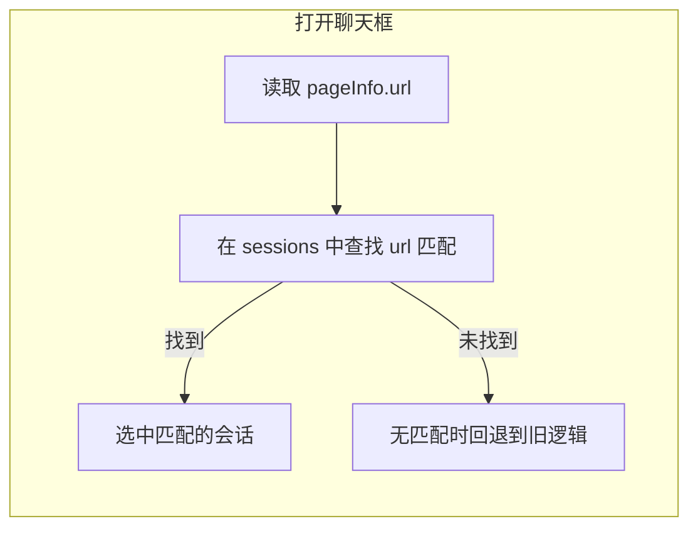

# YP-09-232: 聊天框打开时默认选中 URL 对应会话 — 页面感知的会话自动选择

> **文档职责**：本文档定义**要做什么、为什么做、做到什么程度算完成**（WHAT / WHY），不含实现方案与测试用例。

> 需求编号：YP-09-232 · 优先级：P1 · 人天：0.25d · 状态：已完成
> 依赖：无

实现方案见[开发方案](../../devs/2026-09/232-prd-task-聊天框默认选中url会话.md)，验证方式见[测试用例](../../tests/2026-09/232-prd-test-聊天框默认选中url会话.md)。

---

## 背景

### 业务背景

用户在浏览器中打开某个网页（如 YiVad 管理后台的某个 Bug 详情页），按下快捷键打开 YiPet 聊天框时，期望看到的是**之前在该页面上的对话**，而不是最近一次在其他页面上的对话。当前实现总是选中最后活跃的会话（通过 localStorage 的 `activeSessionKey` 记录），导致用户每次都需要手动从侧边栏切换到对应页面的会话。

### 核心挑战

| 挑战 | 影响 | 说明 |
|------|------|------|
| 会话与 URL 的对应关系 | 用户切换页面后打开聊天框，选中的不是当前页面的会话 | 每个会话有 `url` 字段，但未被充分利用于自动选择 |
| 打开时机不刷新页面信息 | `pageInfo` 仅在 `mount()` 时读取一次 | SPA 内导航后 pageInfo 可能过期 |

---

## 一、现状与目标

### 1.1 改造前

当前会话选择逻辑（`_loadSessions` 中）的优先级为：

1. localStorage 中保存的 `activeSessionKey`（上次活跃的会话）
2. 第一个有消息的会话
3. 第一个会话

**不检查当前页面 URL**，导致用户每次在新的页面打开聊天框时，都要手动从侧边栏找到对应页面的会话。

### 1.2 改造后能力全景

| 能力 | 载体 | 作用点 |
|------|------|--------|
| URL 优先匹配 | `chatStore._loadSessions()` | 首次加载会话列表时 |
| 打开时刷新匹配 | `chatStore.open()` | 每次打开聊天框时 |

### 1.3 能力边界

- **不覆盖**：用户手动切换会话后，关闭再打开仍会切换回 URL 对应的会话（这是预期行为）
- **不覆盖**：SPA 内页面切换时不自动切换会话（仅打开聊天框时触发）
- **MV3 限制**：无——此功能仅涉及 store 内部逻辑

---

## 二、需求范围

### 2.1 范围内

| 编号 | 需求项 |
|------|--------|
| R-01 | 首次加载会话列表时，优先选中 URL 匹配的会话 |
| R-02 | 每次打开聊天框时，刷新 pageInfo 并尝试匹配 URL 对应的会话 |
| R-03 | URL 无匹配时，保持原有回退逻辑（localStorage → 有消息的会话 → 首个会话）|

### 2.2 范围外

| 不做的事 | 原因 | 归属 |
|---------|------|------|
| SPA 页面切换时自动切换会话 | 可能打断用户正在进行的对话 | 未来按需 |
| 根据 URL 自动创建会话 | 会话创建仍由发送消息触发 | 已有 `_findOrCreateSession` |

---

## 三、功能需求

### FR-01 首次加载 URL 优先匹配

| 项 | 要求 |
|----|------|
| 触发时机 | `_loadSessions()` 完成，`currentSessionId` 为空时 |
| 匹配规则 | `session.url === state.pageInfo.url` 精确匹配 |
| 选中行为 | 调用 `selectSession()` 加载该会话的消息和历史 |
| 回退策略 | 无匹配时 → localStorage 的 activeSessionKey → 有消息的会话 → 首个会话 |

### FR-02 打开时刷新匹配

| 项 | 要求 |
|----|------|
| 触发时机 | `open()` 被调用时（用户按快捷键或点击宠物）|
| 刷新 pageInfo | 调用 `readPageInfo()` 重新读取当前页面的 URL/标题 |
| 匹配行为 | 如果当前会话的 URL 与页面 URL 不一致，切换到匹配的会话 |
| 性能约束 | 不重新请求会话列表（`sessions` 已在内存中）|

---

## 四、非功能需求

### 4.1 安全需求

无新增安全需求——此功能仅涉及前端 store 内部逻辑，无新增 API 调用或数据存储。

### 4.2 性能需求

| 指标 | 目标 | 说明 |
|------|------|------|
| `open()` 额外耗时 | < 1ms | `readPageInfo()` + `Array.find()` 均为 O(1)/O(n) 同步操作 |

### 4.3 MV3 兼容性

无影响——不涉及 Service Worker、Content Script 注入或 chrome.storage。

---

## 五、设计决策

| 决策 | 选项 A | 选项 B | 选择 | 理由 |
|------|--------|--------|------|------|
| 匹配优先级 | URL 优先于 localStorage | localStorage 优先于 URL | **URL 优先** | URL 匹配更精确反映用户当前上下文 |
| 打开时行为 | 仅首次加载时匹配 | 每次 `open()` 都匹配 | **每次 open()** | 用户可能在页面间导航后重新打开聊天框 |

---

## 六、验收标准

- [ ] **AC-01** 用户打开某页面 → 首次打开聊天框 → 自动选中该页面对应的会话
- [ ] **AC-02** 页面无对应会话时，回退到原有逻辑（localStorage → 有消息的会话 → 首个）
- [ ] **AC-03** 用户在页面 A 打开聊天框（选中会话 A）→ 关闭 → 导航到页面 B → 打开聊天框 → 自动切换到会话 B
- [ ] **AC-04** `vue-tsc --noEmit` 与 `npm run build` 通过
- [ ] **AC-05** `npm test` 全量通过

---

## 七、风险与缓解

| 风险 | 概率 | 影响 | 等级 | 缓解措施 |
|------|------|------|------|---------|
| `pageInfo.url` 为空 | 低 | 低 | **低** | 已有 `if (!url) return` 守卫 |
| 大量会话时 `find()` 性能 | 低 | 低 | **低** | O(n) 线性扫描，200 个会话 < 1ms |

---

## 八、回滚策略

| 回滚场景 | 回滚方式 | 影响范围 |
|----------|----------|----------|
| URL 匹配导致非预期会话切换 | 恢复原有 `_loadSessions` 逻辑并重新构建 | 全部用户 |

---

## 九、关联需求

- 开发方案：[232-prd-task-聊天框默认选中url会话.md](../../devs/2026-09/232-prd-task-聊天框默认选中url会话.md)
- 测试用例：[232-prd-test-聊天框默认选中url会话.md](../../tests/2026-09/232-prd-test-聊天框默认选中url会话.md)