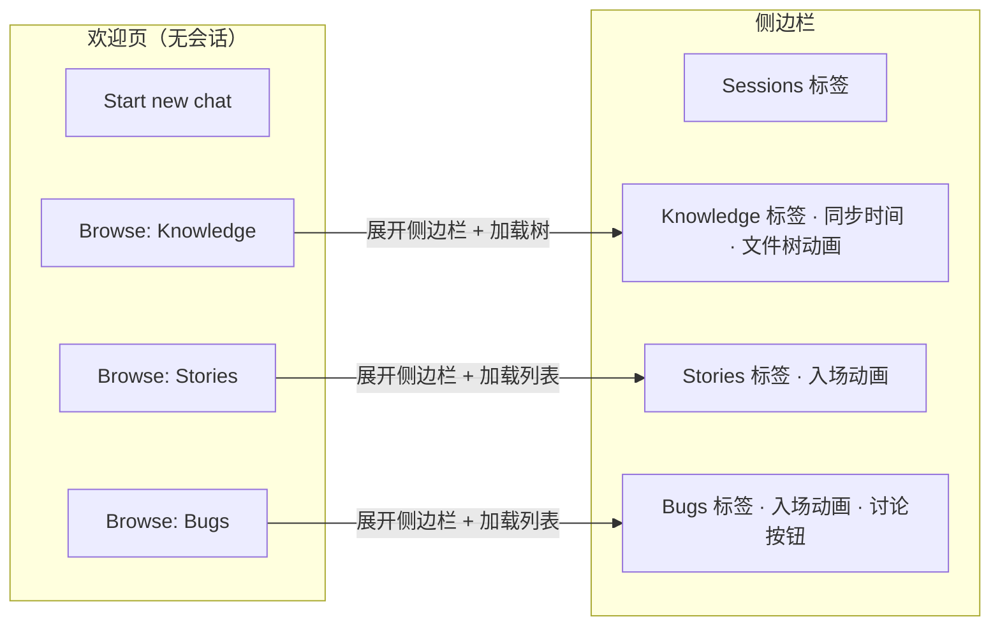

# YP-09-234: 聊天弹框 Knowledge/Stories/Bugs 交互增强 — 侧边栏多标签浏览与快速入口

> **文档职责**：本文档定义**要做什么、为什么做、做到什么程度算完成**（WHAT / WHY），不含实现方案与测试用例。

> 需求编号：YP-09-234 · 优先级：P1 · 人天：0.5d · 状态：已完成
> 依赖：YP-09-232（URL 会话匹配）、YP-09-233（上下文文件自动加载）

实现方案见[开发方案](../../devs/2026-09/234-prd-task-聊天弹框knowledge-stories-bugs交互增强.md)，验证方式见[测试用例](../../tests/2026-09/234-prd-test-聊天弹框knowledge-stories-bugs交互增强.md)。

---

## 背景

### 业务背景

YiPet 聊天弹框的侧边栏已具备 4 个标签页（Sessions / Knowledge / Stories / Bugs），但存在以下体验问题：

1. **入口不可见**：侧边栏默认折叠（`sidebarCollapsed: true`），用户无法快速发现 Knowledge/Stories/Bugs 功能
2. **欢迎页入口单一**："Browse knowledge" 按钮只切换标签页但不打开侧边栏，点击后无反馈
3. **缺少 Stories/Bugs 入口**：欢迎页只有 Knowledge 入口，没有 Stories 和 Bugs 的快速访问
4. **交互效果不足**：列表项无动画过渡，hover 效果简单，缺乏点击反馈
5. **Knowledge 同步时间不可见**：用户不知道上次同步元数据的时间

### 核心挑战

| 挑战 | 影响 | 说明 |
|------|------|------|
| 侧边栏默认折叠 | 用户不知道 Knowledge/Stories/Bugs 功能存在 | `sidebarCollapsed: true` 初始值 |
| 标签切换不展开侧边栏 | `setSidebarView` 只切标签不展开 | 点击"Browse"后无可见变化 |
| 交互效果缺失 | 浏览体验呆板 | 无 hover 动画、入场动画、点击反馈 |

---

## 一、现状与目标

### 1.1 改造前

- 侧边栏默认折叠，切换标签页时保持折叠状态
- 欢迎页只有一个"Browse knowledge"按钮，点击无效果
- 列表项 hover 仅有背景色变化
- 无同步时间显示

### 1.2 改造后能力全景

---

## 二、用户故事

### US-1：从欢迎页快速浏览知识库

> 作为用户，打开 YiPet 聊天框后的欢迎页上，可以看到 Knowledge / Stories / Bugs 三个浏览入口，点击任一入口直接展开侧边栏并加载对应内容。

**验收标准**：
- [ ] 欢迎页显示三个浏览按钮：📚 Knowledge、📖 Stories、🐛 Bugs
- [ ] 点击任一按钮展开侧边栏并切换到对应标签页
- [ ] Knowledge 标签页自动加载文件树（如未加载）
- [ ] Stories 标签页自动加载故事列表（如未加载）
- [ ] Bugs 标签页自动加载缺陷列表（如未加载）

### US-2：Knowledge 标签页交互增强

> 作为用户，在 Knowledge 标签页中可以看到上次同步时间、文件类型信息，hover 文件时有滑动动画反馈。

**验收标准**：
- [ ] 同步按钮的 tooltip 显示上次同步时间（相对时间格式）
- [ ] 文件项 hover 时向右滑动 2px，有过渡动画
- [ ] 文件夹项有折叠/展开图标切换
- [ ] 搜索框实时过滤文件列表

### US-3：Stories 标签页交互增强

> 作为用户，Stories 列表有入场动画，hover 时有左侧边框高亮和滑动效果。

**验收标准**：
- [ ] 列表项有 staggered 入场动画（逐项延迟淡入）
- [ ] hover 时左侧出现主题色边框 + 右移 2px
- [ ] 点击 story 创建对应会话
- [ ] 搜索框实时过滤

### US-4：Bugs 标签页交互增强

> 作为用户，Bugs 列表有入场动画，hover 时"讨论"按钮平滑出现。

**验收标准**：
- [ ] 列表项有 staggered 入场动画
- [ ] hover 时左侧出现红色边框 + 右移 2px
- [ ] hover 时"💬 Discuss"按钮从 scale(0.9) 弹性缩放到 scale(1)
- [ ] 搜索框实时过滤

---

## 三、成功标准

| 维度 | 指标 | 验证方式 |
|------|------|---------|
| 可发现性 | 用户在欢迎页一眼看到 3 个浏览入口 | 打开聊天框，无会话时 |
| 操作可达性 | 点击任一浏览入口 → 侧边栏展开 + 标签切换 + 数据加载在 2s 内完成 | 手动测试 |
| 动画流畅度 | 列表入场动画在 0.5s 内完成，hover 过渡在 0.15s 内完成 | 目测无卡顿 |
| 同步信息可见 | 同步按钮 tooltip 显示精确到分钟的相对时间 | hover 同步按钮 |

---

## 四、非目标

- 不改变侧边栏的布局结构（仍为左侧面板）
- 不修改 Knowledge 树的数据加载逻辑（仍通过 KnowledgeService）
- 不添加新的 API 端点
- 不修改 YiVad 的 ai-chat 页面