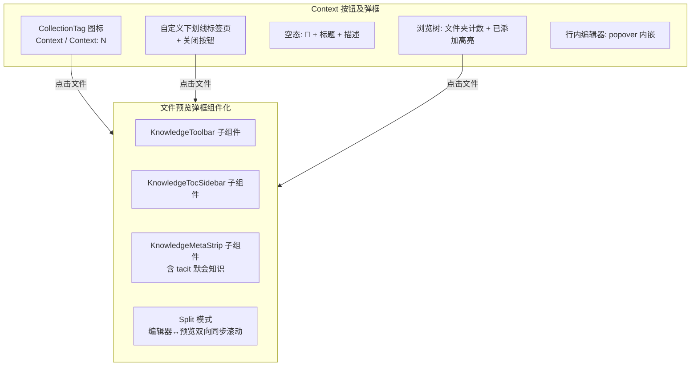

# YP-09-235: Context 按钮与文件预览弹框样式对齐

> **文档职责**：本文档定义**要做什么、为什么做、做到什么程度算完成**（WHAT / WHY），不含实现方案与测试用例。

> 需求编号：YP-09-235 · 优先级：P1 · 人天：1.0d · 状态：已完成

实现方案见[开发方案](../../devs/2026-09/235-prd-task-context按钮与文件预览弹框样式对齐.md)，验证方式见[测试用例](../../tests/2026-09/235-prd-test-context按钮与文件预览弹框样式对齐.md)。

---

## 一、背景与动机

YiPet 聊天弹框的 Context 按钮和文件预览弹框（KnowledgePreviewDialog）独立演进，与 YiVad aiChat (`http://localhost:8848/#/ai-chat`) 的对应组件在视觉语言和交互模式上存在显著差异：

| # | 差异点 | 影响 |
|---|--------|------|
| 1 | Context 按钮使用 `Folder` 图标 + 独立计数徽章 + 绿色激活点 | 用户跨 YiPet/YiVad 时产生认知摩擦 |
| 2 | Context 弹框使用 Element Plus `el-tabs`，无关闭按钮 | 与 YiVad 自定义下划线标签页风格不一致 |
| 3 | Context 弹框空态仅一行斜体文字 | 与 YiVad 的图标+标题+描述空态差异大 |
| 4 | 浏览树无文件夹计数、无已添加文件高亮 | 与 YiVad 的交互反馈不一致 |
| 5 | 点击文件路径弹出 `ElMessageBox.alert` 纯文本 | YiVad 使用 KnowledgePreviewDialog 完整预览 |
| 6 | 行内编辑器使用独立 `el-dialog` | YiVad 使用 popover 内联编辑区 |
| 7 | 文件预览弹框工具栏/元数据/TOC/预览面板排版参数与 YiVad 多处不一致 | 细节不统一降低专业感 |
| 8 | 以上改动缺少 PRD/Dev/Test 文档覆盖 | 无需求-实现-验证追溯链路 |

**设计原则**：YiPet Context 按钮及关联弹框的视觉语言和交互模式应**完全对齐** YiVad aiChat 对应组件，实现跨项目一致的体验。

---

## 二、现状与目标

### 1.1 改造前

- Context 按钮：`Folder` 图标 + 独立计数徽章 + 绿色激活点
- Context 弹框：`el-tabs` 组件，无关闭按钮，空态仅一行文字
- 文件点击：`ElMessageBox.alert` 纯文本弹框
- 文件预览弹框：工具栏/元数据/TOC 样式参数与 YiVad 不一致

### 1.2 改造后

---

## 三、用户故事

### US-1：作为用户，我希望 Context 按钮样式与 YiVad 一致

**作为** 同时使用 YiPet 和 YiVad 的用户
**我想要** Context 按钮在视觉上与 YiVad aiChat 的 ContextPopover 保持一致的药丸样式
**以便于** 在两个产品间切换时不产生认知摩擦

**验收标准（Given/When/Then）：**
- **Given** 聊天弹框已打开，会话有 3 个 context 文件
- **When** 我查看工具栏
- **Then** Context 按钮显示 `CollectionTag` 图标 + `Context: 3` 标签，整体为 28px 药丸样式

### US-2：作为用户，我希望 Context 弹框与 YiVad 风格一致

**作为** 使用 context 文件管理功能的用户
**我想要** Context 弹框的标签页、空态、DnD 交互与 YiVad 保持一致
**以便于** 获得统一的交互体验

**验收标准：**
- **Given** 聊天弹框已打开
- **When** 我点击 Context 按钮
- **Then** 弹框显示自定义下划线标签页（非 el-tabs）
- **And** 右上角有关闭 X 按钮
- **And** 无文件时显示 📄 图标 + 标题 + 描述空态
- **And** 浏览树文件夹显示子项计数徽章

### US-3：作为用户，我希望点击 context 文件时打开专业预览弹框

**作为** 需要查看 context 文件内容的用户
**我想要** 点击文件路径时打开完整的 KnowledgePreviewDialog 预览弹框
**以便于** 查看文件的 markdown 渲染结果和元数据信息

**验收标准：**
- **Given** context 弹框中有文件列表
- **When** 我点击某个文件的路径
- **Then** 关闭 context 弹框，打开 KnowledgePreviewDialog
- **And** 弹框显示 markdown 渲染内容 + frontmatter 元数据 + 目录侧边栏
- **And** 工具栏支持 Edit/Split/Preview 模式切换

### US-4：作为用户，我希望文件预览弹框与 YiVad 完全一致

**作为** 需要预览和编辑知识文件的用户
**我想要** KnowledgePreviewDialog 的样式和功能与 YiVad 对应组件完全一致
**以便于** 统一的工具使用体验

**验收标准：**
- **Given** KnowledgePreviewDialog 已打开
- **When** 我查看弹框布局
- **Then** 工具栏显示返回/路径/模式切换/文档统计/操作按钮
- **And** 元数据展示 benefit/tacit/badges/roles/tags/related/criteria
- **And** TOC 侧边栏支持 200px↔36px 折叠
- **And** Split 模式下编辑器与预览左右并排 + 双向同步滚动

---

## 四、改造范围

### 2.1 Context 按钮及弹框（ContextFilesButton）

| 属性 | 改造前 | 改造后 |
|------|--------|--------|
| 图标 | `Folder` | `CollectionTag` |
| 标签格式 | `Context` + 独立 `.ct-ctx-count` 徽章 + `.ct-ctx-dot` 绿点 | `Context`（无文件）/ `Context: N`（有文件）内联 |
| 弹框标签页 | `el-tabs` + `el-tab-pane` | 自定义 `.ct-pop-tabs` + `.ct-pop-tab` 下划线样式 |
| 关闭按钮 | 无 | `.ct-pop-close` 右上角 X |
| 弹框宽度 | 360px | 420px |
| Context 空态 | 一行斜体文字 `No context files yet...` | 图标(📄) + 标题 + 描述的多行居中空态 |
| DnD 提示 | `Drop knowledge files here...` | `Drag files from Browse tab or type @ in chat` |
| 浏览树文件夹 | 仅显示名称 | 名称 + 子项计数徽章（`.ct-browse-folder-count`） |
| 浏览树文件 | 无高亮 | `.is-in-context` 绿色背景高亮 |
| 文件点击行为 | `ElMessageBox.alert` 纯文本弹框 | `store.openKnowledgePreview()` 完整预览 |
| 行内编辑器 | 独立 `el-dialog` 模态框 | popover 内嵌 `.ct-edit-section` 编辑区 |
| 加载状态 | 有 spinner | 有 spinner + 文字说明 |

### 2.2 文件预览弹框（KnowledgePreviewDialog）— 组件化重构 + 功能增强

#### 2.2.1 子组件提取（对齐 YiVad 架构）

| 子组件 | 来源 | 职责 |
|--------|------|------|
| `KnowledgeToolbar.vue` | 提取自 KnowledgePreviewDialog 内联模板 | 工具栏：返回/路径、模式切换 (Edit/Split/Preview)、操作按钮 |
| `KnowledgeTocSidebar.vue` | 提取自 KnowledgePreviewDialog 内联模板 | 目录侧边栏：H2/H3 标题列表、折叠/展开、首字母缩写 |
| `KnowledgeMetaStrip.vue` | 提取自 KnowledgePreviewDialog 内联元数据区 | 元数据：benefit、tacit 默会知识、badges、roles/tags、related 链接、criteria |

#### 2.2.2 Split 模式（新增）

| 属性 | 说明 |
|------|------|
| 模式切换 | Edit / Split / Preview 三态 Radio 组 |
| 编辑器 | `<el-input type="textarea">` 左侧面板 |
| 预览面板 | 右侧面板，实时渲染编辑内容 |
| 同步滚动 | 编辑器 ↔ 预览面板双向同步滚动（`requestAnimationFrame` 防抖） |
| 模式入口 | 工具栏 `el-radio-group` → `Edit \| Split \| Preview` |

#### 2.2.3 样式参数对齐

| 属性 | 改造前 | 改造后 |
|------|--------|--------|
| 工具栏操作间距 | `gap: 2px` | `gap: 4px` |
| 文件路径最大宽度 | `max-width: 55vw` | `max-width: 30vw` |
| 分类面包屑结构 | `<template v-for>` 循环 | `` 包裹每段 |
| 元数据展示 | 内联 computed + 模板 | `KnowledgeMetaStrip` 独立组件（含 tacit 默会知识） |
| TOC 组件 | 内联模板 | `KnowledgeTocSidebar` 独立组件 |
| TOC 折叠宽度 | 36px | 36px + 首字母缩写 |
| 预览面板内边距 | `20px 24px` | `16px` |
| H1 字号 | `1.6em` | `1.5em` |
| H2 字号 | `1.35em` | `1.3em` |
| 代码块内边距 | `14px 16px` | `12px 14px` |
| 引用块内边距 | `8px 16px` | `6px 14px` |
| 表格单元格内边距 | `8px 12px` | `6px 12px` |
| 列表缩进 | `24px` | `20px` |
| 滚动条 | 默认 | `4px` 宽 + `2px` 圆角 |

#### 2.2.4 默会知识（tacit）支持（新增）

- `KnowledgeMetaStrip` 支持 `tacit` 字段展示
- 当 `meta.tacit === true` 时显示 `tacit: yes` 警告色徽章
- 当 `meta.tacit` 为字符串时显示警告色左边框条 + 斜体文字

### 2.3 范围外

- 不涉及后端 API 变更
- 不涉及 RAG/知识库功能变更
- 不添加 YiVad 专属功能（源页面导航、阅读列表、嵌入聊天面板）

---

## 五、功能需求

### FR-01: Context 按钮药丸样式
- 图标：`CollectionTag`（替换 `Folder`）
- 标签：无文件 `Context`，有文件 `Context: N`
- 移除独立计数徽章和绿色激活点
- `contextFileCount > 0` 时保持 `.on` 激活态

### FR-02: Context 弹框自定义标签页
- 使用 `.ct-pop-tabs` 容器 + `.ct-pop-tab` 按钮
- 激活标签页底部 `2px solid var(--el-color-primary)` 下划线
- 字号 12px，字重 600，居中
- Context 标签显示 `Context (N)` 计数
- Browse 标签保留知识健康徽章
- Browse 标签右侧有 `padding-right: 28px` 为关闭按钮留空间

### FR-03: Context 弹框关闭按钮
- popover 右上角 28×28px X 按钮
- hover 时变红

### FR-04: Context 弹框空态
- 居中显示 📄 图标（32px）+ "No context files" 标题（14px/600）+ 描述文字
- 描述引导用户前往 Browse 标签

### FR-05: 行内编辑器
- 在 popover 内嵌编辑区（非独立 dialog）
- 编辑区顶部有分隔线 + 文件路径 + "Editing context content for this session" 提示
- Cancel / Save 按钮右对齐

### FR-06: DnD 提示文本
- 拖拽中：📄 + "Release to add"
- 默认：`Drag files from Browse tab or type @ in chat`（`@` 使用 `<code>` 样式）

### FR-07: 浏览树文件夹计数
- 文件夹行显示子项数徽章（灰色圆角）

### FR-08: 浏览树已添加文件高亮
- 已在 context 中的文件显示 `.is-in-context` 绿色背景
- `+` 按钮替换为 `✓` 禁用按钮

### FR-09: 文件预览行为
- 点击 context 文件路径 → 打开 KnowledgePreviewDialog（非 ElMessageBox.alert）
- 点击 Browse 文件名称 → 打开 KnowledgePreviewDialog 预览
- 关闭 context popover 后再打开预览

### FR-10: 文件预览弹框工具栏
- 左：返回按钮 + 文件路径 | 中：Edit/Split/Preview 三态切换 | 右：统计(n ch · n w · nm read) + 操作按钮
- 编辑/Split 模式：统计替换为 Cancel/Save

### FR-11: 文件预览弹框分类面包屑
- `.kpd-cl-seg` 包裹每段，`/` 分隔

### FR-12: 文件预览弹框元数据徽章
- 药丸样式 + success/warning/info 三色调

### FR-13: 文件预览弹框 TOC 侧边栏
- 默认 200px，折叠 36px，首字母缩写显示

### FR-14: 文件预览弹框预览面板
- padding: 16px，H1 1.5em，H2 1.3em，H3 1.15em

### FR-15: 子组件提取（专业化架构）
- `KnowledgeToolbar.vue` — 工具栏独立组件，含 Props/Emits 接口
- `KnowledgeTocSidebar.vue` — 目录侧边栏独立组件
- `KnowledgeMetaStrip.vue` — 元数据展示独立组件（含 tacit 默会知识展示）

### FR-16: Split 编辑模式
- 工具栏添加 Split 按钮，与其他模式并列为 Edit/Split/Preview
- Split 模式下编辑器与预览面板左右并排（`flex: 1` 平分）
- 编辑器 ↔ 预览面板双向同步滚动
- 模式切换时 Seed 编辑器内容、attach/detach 滚动监听
- `onBeforeUnmount` 时自动 detach 滚动监听

---

## 六、非功能需求

| ID | 要求 |
|----|------|
| NFR-01 | `vue-tsc --noEmit` 通过，无类型错误 |
| NFR-02 | 4 个 Rsbuild 入口全部构建成功 |
| NFR-03 | Context 按钮外观与 YiVad aiChat ContextPopover 视觉一致 |
| NFR-04 | KnowledgePreviewDialog 外观与 YiVad 对应组件视觉一致 |
| NFR-05 | 不引入未使用的导入（`ElMessageBox` 已移除） |

---

## 七、验收标准

| AC | 描述 |
|----|------|
| AC-01 | Context 按钮图标为 `CollectionTag` |
| AC-02 | 无文件时显示 "Context"，有 N 个文件时显示 "Context: N" |
| AC-03 | Context 弹框使用自定义下划线标签页 |
| AC-04 | 激活标签页有 2px 主色下划线，右侧预留关闭按钮空间 |
| AC-05 | Context 标签显示 "Context (N)" 计数 |
| AC-06 | popover 右上角有关闭 X 按钮 |
| AC-07 | 空态显示 📄 图标 + 标题 + 描述 |
| AC-08 | DnD 提示包含 `@` 提及引导 |
| AC-09 | 浏览树文件夹显示子项计数徽章 |
| AC-10 | 已在 context 的文件有绿色背景高亮 |
| AC-11 | 点击文件路径打开 KnowledgePreviewDialog |
| AC-12 | 行内编辑器在 popover 内嵌显示 |
| AC-13 | 文件预览弹框工具栏参数对齐 YiVad |
| AC-14 | 分类面包屑使用 `.kpd-cl-seg` 包裹 |
| AC-15 | 元数据徽章支持三色调 |
| AC-16 | TOC 折叠后显示首字母缩写，宽度 36px |
| AC-17 | 预览面板 padding 为 16px |
| AC-18 | TypeScript 类型检查通过 |
| AC-19 | 构建 4/4 入口成功 |
| AC-20 | KnowledgeToolbar/KnowledgeTocSidebar/KnowledgeMetaStrip 三个子组件正确渲染 |
| AC-21 | Split 模式下编辑器与预览左右并排 |
| AC-22 | Split 模式下编辑器与预览双向同步滚动 |
| AC-23 | 元数据展示支持 tacit 默会知识字段 |
| AC-24 | 各子组件 Props/Emits 类型正确无 any |

---

## 八、涉及文件

| 文件 | 改动类型 | 说明 |
|------|----------|------|
| `src/chat/components/ChatToolbar/ContextFilesButton.vue` | 重构 | 模板 + 样式完全重写 |
| `src/chat/components/ChatToolbar/useContextFiles.ts` | 修改 | 文件点击改用 KnowledgePreviewDialog |
| `src/chat/components/KnowledgePreviewDialog/KnowledgePreviewDialog.vue` | 重构 | 提取子组件 + 新增 split 模式 + 双向同步滚动 + 使用 KnowledgeMetaStrip |
| `src/chat/components/KnowledgePreviewDialog/KnowledgeToolbar.vue` | **新增** | 工具栏独立组件（返回/模式切换/操作按钮） |
| `src/chat/components/KnowledgePreviewDialog/KnowledgeTocSidebar.vue` | **新增** | 目录侧边栏独立组件 |
| `src/chat/components/KnowledgePreviewDialog/KnowledgeMetaStrip.vue` | **新增** | 元数据展示组件（含 tacit 默会知识） |
| `src/chat/components/KnowledgePreviewDialog/styles/dialog.scss` | 重构 | 样式参数对齐 YiVad + split 模式布局 + 移除内联元数据样式（已迁移至 KnowledgeMetaStrip） |

---

## 九、风险与缓解

| 风险 | 概率 | 缓解 |
|------|------|------|
| `store.openKnowledgePreview` 不可用 | 低 | store 已有该 action（验证通过） |
| 自定义标签页可访问性降低 | 低 | `div` + `@click` + `cursor:pointer`，语义清晰 |
| Split 模式滚动监听性能 | 低 | `passive: true` + `requestAnimationFrame` 防抖 + guard flag 防递归 |
| Split 模式切换时编辑器 seed 时机 | 低 | `watch(mode)` + `old === 'preview'` 条件 + `editContent = content` |
| 子组件 Props/Emits 接口不匹配 | 低 | TypeScript strict 模式编译期检查 |

---

## 十、关联需求

- [YP-09-232: 聊天框默认选中 URL 会话](../232-体验优化-聊天框打开默认选中url对应会话.md)
- [YP-09-233: 会话上下文文件自动加载](../233-体验优化-会话上下文文件自动加载.md)
- [YP-09-234: 聊天弹框 Knowledge/Stories/Bugs 交互增强](../234-体验优化-聊天弹框knowledge-stories-bugs交互增强.md)