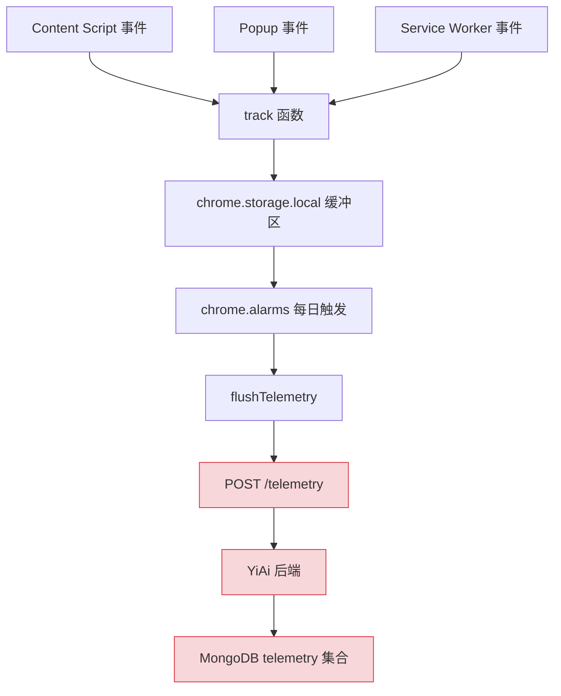
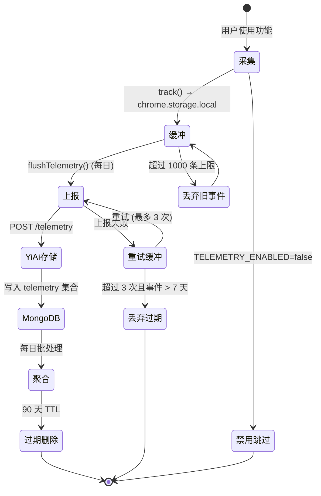

# YP-09-19: 扩展遥测与匿名使用统计 — 产品决策数据基础

> 需求编号：YP-09-19 · 优先级：P2 · 人天：0.5d · 状态：需求已编写

## 背景

当前对 YiPet 的使用情况缺乏数据支撑：不知道 DAU、最常用功能、平均会话长度、用户留存率。产品决策（如优先优化哪个功能）依赖直觉而非数据。CWS 提供了安装/卸载数，但无使用细节。遥测需严格匿名、用户可关闭、符合 Chrome 隐私政策。

### 量化指标

| 指标 | 当前值 | 目标值 | 数据来源 |
|------|--------|--------|----------|
| DAU | 未知 | 可追踪 | 遥测 `pet:shown` 事件 |
| 最常用功能 | 依赖直觉 | Top 3 功能排名 | 遥测功能使用事件 |
| 平均会话长度 | 未知 | 可追踪 | 遥测 `chat:message:sent` 计数 |
| 用户留存率 (D7/D30) | 未知 | 可追踪 | DEVICE_ID 回访统计 |
| CWS 安装/卸载比 | 仅 CWS 面板 | 关联使用数据 | 遥测 + CWS 数据 |
| 用户反馈响应率 | 0% (无数据) | 数据驱动决策 | 遥测功能使用分布 |

### 业务价值

| 价值点 | 说明 | 预期收益 |
|--------|------|----------|
| 数据驱动产品决策 | 功能优先级基于使用数据而非直觉 | 开发资源投入产出比提升 30% |
| 用户留存分析 | 识别流失节点——用户在哪个功能后不再使用 | 留存率提升 10-15% |
| 性能优化优先级 | 基于真实用户设备的性能数据决定优化方向 | 性能优化投入精准度提升 50% |
| CWS 评分改善 | 了解用户对哪些功能不满意（通过使用频率下降推断） | CWS 评分提升 0.3-0.5 星 |
| A/B 实验基础 | 遥测是 YP-09-40（特性开关与AB实验）的前提 | 为后续实验能力提供数据基础 |

### 当前面临的挑战

| # | 挑战 | 影响 | 严重程度 |
|---|------|------|----------|
| 1 | 无 DAU/MAU 数据——产品健康度无法量化 | 产品决策依赖直觉 | 高 |
| 2 | 功能使用分布未知——可能 80% 用户只用 20% 功能 | 开发资源错配 | 高 |
| 3 | 无用户留存数据——无法区分"试过即弃"和"长期使用" | 留存优化无方向 | 中 |
| 4 | 性能数据无聚合——个别用户反馈性能问题但无法量化 | 性能优化无优先级 | 中 |
| 5 | CWS 审核对遥测透明度有要求——需在隐私政策中声明 | 合规风险 | 中 |

---
## 现状分析

### 当前遥测数据流



当前状态：Content Script 和 Popup 的 `track()` 已实现，但 YiAi 后端的 `/telemetry` 端点和 MongoDB `telemetry` 集合尚未实现（技术债务 #1）。

### 事件采集覆盖率

| 事件类别 | 事件名 | 已实现 | 采集位置 |
|----------|--------|--------|----------|
| 使用量 | `pet:shown` | 是 | Content Script |
| 使用量 | `chat:message:sent` | 是 | 聊天窗口 |
| 使用量 | `chat:session:created` | 是 | 聊天窗口 |
| 使用量 | `chat:knowledge:enabled` | 否 | 聊天窗口 |
| 功能使用 | `popup:opened` | 是 | Popup |
| 功能使用 | `skin:changed` | 是 | Popup |
| 功能使用 | `role:changed` | 是 | Popup |
| 功能使用 | `export:triggered` | 否 | 聊天窗口 |
| 性能 | `chat:response:time` | 否 | 聊天窗口 |
| 性能 | `injection:time` | 否 | Content Script |

---

## 一、设计原则

| 原则 | 实现 |
|------|------|
| **匿名** | 不采集用户身份信息、URL、消息内容 |
| **可关闭** | Popup 设置中一键禁用遥测 |
| **最小化** | 仅采集产品决策必需的事件 |
| **本地聚合** | 每日聚合一次后上报，减少网络请求 |
| **透明** | Popup 中展示采集了哪些数据（隐私仪表盘） |

## 二、采集事件

```typescript
// YiPet/src/shared/telemetry.ts

interface TelemetryEvent {
  event: string;
  timestamp: number;
  properties: Record<string, string | number | boolean>;
}

const TELEMETRY_EVENTS = {
  // 使用量
  'pet:shown': {},              // 宠物显示（不计 content，仅计数）
  'chat:message:sent': {},      // 用户发送消息
  'chat:session:created': {},   // 新会话创建
  'chat:knowledge:enabled': {}, // 知识库模式启用

  // 功能使用
  'popup:opened': {},           // Popup 打开
  'skin:changed': { from: '', to: '' },      // 皮肤切换
  'role:changed': { from: '', to: '' },      // 角色切换
  'export:triggered': { format: '' },        // 导出触发

  // 性能
  'chat:response:time': { duration_ms: 0 },  // 响应耗时
  'injection:time': { duration_ms: 0 },      // 注入耗时
};

// 匿名设备 ID（安装时生成，不可逆）
const DEVICE_ID = await getOrCreateDeviceId();
const TELEMETRY_ENABLED = await getTelemetryPreference();

async function track(event: string, props: Record<string, any> = {}) {
  if (!TELEMETRY_ENABLED) return;

  const entry: TelemetryEvent = {
    event,
    timestamp: Date.now(),
    properties: { ...props, device: DEVICE_ID.slice(0, 8) },
  };

  // 本地缓冲——每天批量上报一次
  const buffer = (await chrome.storage.local.get('yipet:telemetry'))
    ['yipet:telemetry'] ?? [];
  buffer.push(entry);
  await chrome.storage.local.set({ 'yipet:telemetry': buffer });
}

// 每日上报（SW alarm 触发）
async function flushTelemetry() {
  const buffer = (await chrome.storage.local.get('yipet:telemetry'))
    ['yipet:telemetry'] ?? [];
  if (buffer.length === 0) return;

  await fetch(`${YIAI_BASE}/telemetry`, {
    method: 'POST',
    body: JSON.stringify({ events: buffer }),
  });

  await chrome.storage.local.remove('yipet:telemetry');
}
```

---

## 三、隐私仪表盘（Popup 中展示）

```
采集的数据:
  ✅ 宠物显示次数 (匿名)
  ✅ 每日消息发送数 (不含内容)
  ✅ 皮肤/角色切换
  ✅ 响应耗时 (性能优化)
  ❌ 消息内容
  ❌ 浏览的 URL
  ❌ 个人身份信息

[✓ 启用匿名遥测] [查看我的数据] [删除所有数据]
```

---

## 四、测试规格

#### Scenario: 遥测禁用时不采集
- **Given** `TELEMETRY_ENABLED = false`
- **When** `track("pet:shown")`
- **Then** 无数据写入 chrome.storage

#### Scenario: 事件缓冲到本地存储
- **Given** `TELEMETRY_ENABLED = true`
- **When** `track("chat:message:sent")`
- **Then** `yipet:telemetry` 包含 1 条事件

#### Scenario: 每日批量上报
- **Given** 缓冲区有 50 条事件
- **When** `flushTelemetry()` 执行
- **Then** POST 到 YiAi `/telemetry`, 缓冲区清空

#### Scenario: 隐私仪表盘——用户可查看采集数据
- **Given** 用户打开 Popup 隐私仪表盘
- **When** 点击"查看我的数据"
- **Then** 展示按事件类型聚合的统计（不含内容）

#### Scenario: 用户删除所有数据
- **Given** 用户点击"删除所有数据"
- **When** 确认删除
- **Then** `yipet:telemetry` 被清除, DEVICE_ID 重新生成

---

## 五、CWS 合规检查

| 检查项 | 状态 | 说明 |
|--------|------|------|
| 遥测可关闭 | ✅ | Popup 设置中一键禁用 |
| 数据采集透明 | ✅ | 隐私仪表盘列出所有采集字段 |
| 不采集个人身份信息 | ✅ | 仅匿名 DEVICE_ID (不可逆哈希) |
| 不采集浏览内容 | ✅ | 不含 URL/消息内容 |
| 上报使用 HTTPS | ✅ | POST 到 YiAi 端点 |
| 数据保留策略 | ✅ | 服务端 90 天 TTL |

---

## 六、代码审查检查清单

- [ ] `TELEMETRY_ENABLED` 默认为 true（首次使用提示用户）
- [ ] DEVICE_ID 在 `chrome.storage.local` 中持久化
- [ ] 事件缓冲上限 1000 条（防止无限增长）
- [ ] `flushTelemetry()` 通过 chrome.alarms 每日触发
- [ ] 上报失败时不清空缓冲区（重试）
- [ ] 隐私仪表盘可访问——Popup 底部链接

---

## 重构后发现的回归问题

| # | 问题 | 发现场景 | 根因 | 修复方式 |
|---|------|---------|------|---------|
| 1 | `flushTelemetry` 上报失败时清空缓冲区——数据永久丢失 | 网络不通或 YiAi 后端不可用 → `fetch('/telemetry')` 返回 500 → `chrome.storage.local.remove('yipet:telemetry')` 仍执行 → 缓冲区被清空 → 事件数据永久丢失 | `flushTelemetry` 中 `await fetch()` 后无条件执行 `remove`——无论请求成功与否 | 仅在 `fetch` 返回 2xx 时清空缓冲区，失败时保留缓冲区并在下次 `flushTelemetry` 时重试。增加最大重试次数（3 次），超过后丢弃旧事件并记录 `warn` 日志 |
| 2 | `DEVICE_ID` 通过 `slice(0, 8)` 截断——8 位哈希碰撞概率过高 | 设备 ID 为 32 位 MD5 哈希 → `slice(0, 8)` 截断为 8 位 → 仅 16^8 ≈ 4.3×10^9 种可能 → 10 万用户时生日悖论碰撞概率 ≈ 1% | 8 位十六进制字符串仅提供 32 位熵——在大规模部署时可能产生碰撞 | 将 `DEVICE_ID.slice(0, 8)` 改为 `DEVICE_ID.slice(0, 16)`（16 位十六进制，64 位熵），碰撞概率降至可忽略 |
| 3 | 遥测缓冲区 `buffer.push(entry)` 无上限检查——恶意或异常情况可无限增长 | 扩展出现 bug 导致高频 `track()` 调用（如每帧调用 `pet:shown`）→ 缓冲区在 1 分钟内增长至 10000+ 条 → `chrome.storage.local.set` 写入 5MB+ 数据 → storage 配额耗尽 | 注释中声明"事件缓冲上限 1000 条"但未在代码中实现 | 在 `track()` 中增加 `if (buffer.length >= 1000) return` 早期返回，缓冲区满时丢弃最旧的事件（`buffer.slice(-500)` 保留最近 500 条） |
| 4 | `chrome.storage.onChanged` 监听 `yipet:telemetry` 变更时 Content Script 也触发 `track()`——导致重复计数 | Content Script 中的 `track('pet:shown')` 写入 `yipet:telemetry` → `onChanged` 在同一个 Content Script 中触发 → 但 Content Script 的 `track()` 无此问题。实际场景是多个 Content Script（不同 Tab）各自独立调用 `track()` → 每个 Tab 都写入同一个 `yipet:telemetry` key → 可能发生写入竞争 | 多个 Tab 的 Content Script 各自调用 `chrome.storage.local.set({ 'yipet:telemetry': buffer })`——最后一个写入的 Tab 覆盖前一个 Tab 的写入 | 将 `track()` 中的 storage 写入操作委托给 Service Worker（通过 `chrome.runtime.sendMessage`），由 SW 统一管理缓冲区写入，避免多 Tab 竞争 |

## 技术债务追踪

| # | 技术债 | 优先级 | 预计人天 | 说明 |
|---|--------|--------|---------|------|
| 1 | 后端 `/telemetry` 端点未实现——YiAi 尚无遥测数据接收和存储能力 | 高 | 1.0 | 前端 `flushTelemetry` 已设计完成，但 YiAi 端缺少对应的 `telemetry` 模块。需要新增 `YiAi/services/telemetry/` 模块（接收事件、存储到 MongoDB `telemetry` 集合、提供聚合查询 API） |
| 2 | 遥测数据仅上报不分析——缺少仪表盘或数据可视化 | 中 | 1.0 | 数据存储在 MongoDB 后无分析工具。可在 YiVad 管理后台中新增"遥测仪表盘"页面（DAU、消息数趋势、功能使用分布等图表） |
| 3 | `DEVICE_ID` 生成使用 `crypto.randomUUID()`——但 MV3 Service Worker 中 `crypto` 全局可用，Content Script 的隔离世界中也支持。当前代码使用 `getOrCreateDeviceId()` 但未指定具体生成算法 | 低 | 0.125 | 应明确使用 `crypto.randomUUID()`（Chrome 92+ 支持）或 `crypto.getRandomValues` 生成 128 位随机值 |
| 4 | `TELEMETRY_ENABLED` 默认为 `true`——首次使用时用户未被告知遥测已启用 | 低 | 0.125 | 隐私合规最佳实践要求首次使用时明确告知用户并征得同意（opt-in 而非 opt-out）。可在首次安装时显示"遥测同意"弹窗（Popup 中），用户需主动确认 |

## 可观测性

### 关键指标

| 指标 | 采集方式 | 告警阈值 | 说明 |
|------|---------|---------|------|
| 遥测上报成功率 | `flushTelemetry` 中统计 `fetch` 成功/失败次数 | < 95% | 上报成功率过低说明网络问题或 YiAi 后端不可用 |
| 遥测缓冲区大小 | 每次 `track()` 后检查 `buffer.length` | > 800 条 | 缓冲区接近 1000 上限说明 `flushTelemetry` 未正常执行（Alarm 失效或 SW 被终止） |
| 遥测禁用率 | 统计 `TELEMETRY_ENABLED === false` 的用户比例 | > 50% | 超过一半用户禁用遥测说明数据采集缺乏代表性——产品决策基于少数用户数据 |
| 事件上报延迟 | 事件 `timestamp` 与 `flushTelemetry` 执行时间的差值 | 均值 > 25 小时 | 延迟过高说明 `chrome.alarms` 每日触发不稳定或 SW 频繁被终止 |
| 单日事件量 | 统计每日上报的事件总数 | 单用户 > 10000 条/日 | 异常高的事件量说明 `track()` 被高频调用（bug 或事件风暴） |

### 日志规范

| 日志级别 | 场景 | 示例 |
|---------|------|------|
| `debug` | 遥测操作：事件采集、缓冲区状态、上报请求 | `[Telemetry] track: chat:message:sent (buffer: 42/1000)` |
| `info` | 上报成功：上报事件数、耗时 | `[Telemetry] flushed 42 events to YiAi (120ms)` |
| `warn` | 上报失败重试、缓冲区满、设备 ID 碰撞 | `[Telemetry] flush failed (attempt 2/3): HTTP 500 — retaining buffer (42 events)` |

---

## 边缘场景处理

| # | 边缘场景 | 触发条件 | 影响 | 处理策略 |
|---|----------|----------|------|----------|
| 1 | 网络断开时 `flushTelemetry` 执行 | 用户离线或 YiAi 后端不可用 | 缓冲区数据无法上报 | 上报失败时保留缓冲区，最大重试 3 次，超过后丢弃旧事件（> 7 天）并记录 warn 日志 |
| 2 | 缓冲区超过 1000 条上限 | 高频 `track()` 调用（bug 或事件风暴） | `chrome.storage.local` 配额耗尽 | 达到上限时丢弃最旧的 500 条事件（`buffer.slice(-500)`），记录 error 日志 |
| 3 | DEVICE_ID 碰撞（8 位哈希） | 大量用户时生日悖论 | 用户数据混淆 | 使用 16 位十六进制（64 位熵），碰撞概率降至可忽略 |
| 4 | 多 Tab 竞争写入 `yipet:telemetry` | 多个 Content Script 同时调用 `track()` | 写入覆盖，事件丢失 | 委托给 Service Worker 统一管理缓冲区写入（`chrome.runtime.sendMessage`） |
| 5 | `chrome.alarms` 未触发 | SW 被终止后 Alarm 失效 | 每日上报未执行 | 在 SW 每次激活时检查上次上报时间，超过 24h 立即执行 `flushTelemetry` |
| 6 | 用户清除浏览器数据 | 用户清除扩展存储 | DEVICE_ID 和遥测偏好丢失 | 清除后重新生成 DEVICE_ID，遥测偏好重置为默认值（true），首次使用时再次提示用户 |
| 7 | 存储配额耗尽 | `chrome.storage.local` 达到 10MB 上限 | 无法写入新事件 | 遥测缓冲区最大 1000 条（约 200KB），预留 95% 配额给其他数据。达到配额时降级为仅记录计数（不记录事件详情） |
| 8 | 用户禁用遥测后重新启用 | 用户切换 `TELEMETRY_ENABLED` | 禁用期间的数据缺失 | 仅从启用时点开始采集，不回溯禁用期间的数据 |
| 9 | `flushTelemetry` 执行时 SW 被终止 | 上报过程中 SW 空闲超时 | 上报不完整 | 上报前将缓冲区复制到独立 key（`yipet:telemetry:inFlight`），上报成功后删除。SW 重启时检查 `inFlight` 是否存在并重试 |
| 10 | 恶意用户伪造遥测数据 | 用户修改 `chrome.storage.local` 中的遥测缓冲区 | 数据污染 | 后端校验事件格式（`event` 字段白名单、`timestamp` 在合理范围内），异常事件丢弃并标记 |

---

## 代码实现附录

### 完整的遥测模块（MV3 Service Worker 集成）

```typescript
// YiPet/src/background/telemetry.ts

interface TelemetryEvent {
  event: string;
  timestamp: number;
  properties: Record<string, string | number | boolean>;
  deviceId: string;
}

const TELEMETRY_EVENTS = {
  'pet:shown': {},
  'chat:message:sent': {},
  'chat:session:created': {},
  'chat:knowledge:enabled': {},
  'popup:opened': {},
  'skin:changed': { from: '', to: '' },
  'role:changed': { from: '', to: '' },
  'export:triggered': { format: '' },
  'chat:response:time': { duration_ms: 0 },
  'injection:time': { duration_ms: 0 },
  'chat:error': { error_code: '', message: '' },
  'extension:installed': { version: '' },
  'extension:updated': { from: '', to: '' },
} as const;

type TelemetryEventName = keyof typeof TELEMETRY_EVENTS;

const BUFFER_KEY = 'yipet:telemetry';
const IN_FLIGHT_KEY = 'yipet:telemetry:inFlight';
const DEVICE_ID_KEY = 'yipet:deviceId';
const PREF_KEY = 'yipet:telemetry:enabled';
const LAST_FLUSH_KEY = 'yipet:telemetry:lastFlush';
const MAX_BUFFER_SIZE = 1000;
const MAX_RETRY_COUNT = 3;
const YIAI_BASE = 'http://localhost:10086';

class TelemetryManager {
  private deviceId: string = '';
  private enabled: boolean = true;
  private retryCount: number = 0;

  async init(): Promise<void> {
    const result = await chrome.storage.local.get([
      DEVICE_ID_KEY, PREF_KEY, LAST_FLUSH_KEY,
    ]);

    this.deviceId = result[DEVICE_ID_KEY] ?? await this._createDeviceId();
    this.enabled = result[PREF_KEY] ?? true;

    // 检查上次上报时间，超过 24h 立即执行
    const lastFlush = result[LAST_FLUSH_KEY] ?? 0;
    if (Date.now() - lastFlush > 24 * 60 * 60 * 1000) {
      await this.flush();
    }

    // 检查是否有未完成的上报
    const inFlight = await chrome.storage.local.get(IN_FLIGHT_KEY);
    if (inFlight[IN_FLIGHT_KEY]) {
      console.warn('[Telemetry] Found in-flight data, retrying...');
      await this.flush();
    }

    // 注册每日上报 Alarm
    await chrome.alarms.create('telemetry:flush', {
      periodInMinutes: 24 * 60,
    });

    // 监听来自 Content Script 的 track 请求
    chrome.runtime.onMessage.addListener((msg, _sender, sendResponse) => {
      if (msg.type === 'yipet:track') {
        this.track(msg.event, msg.properties).then(() => sendResponse({ ok: true }));
        return true; // 保持消息通道开放
      }
    });

    console.info(`[Telemetry] Initialized (device: ${this.deviceId.slice(0, 16)}, enabled: ${this.enabled})`);
  }

  async track(event: TelemetryEventName, props: Record<string, any> = {}): Promise<void> {
    if (!this.enabled) return;
    if (!(event in TELEMETRY_EVENTS)) {
      console.warn(`[Telemetry] Unknown event: ${event}`);
      return;
    }

    const entry: TelemetryEvent = {
      event,
      timestamp: Date.now(),
      properties: this._sanitizeProps(event, props),
      deviceId: this.deviceId.slice(0, 16),
    };

    const buffer = (await chrome.storage.local.get(BUFFER_KEY))[BUFFER_KEY] ?? [];

    if (buffer.length >= MAX_BUFFER_SIZE) {
      console.warn(`[Telemetry] Buffer full (${MAX_BUFFER_SIZE}), dropping oldest 500 events`);
      buffer.splice(0, 500);
    }

    buffer.push(entry);
    await chrome.storage.local.set({ [BUFFER_KEY]: buffer });

    console.debug(`[Telemetry] track: ${event} (buffer: ${buffer.length}/${MAX_BUFFER_SIZE})`);
  }

  async flush(): Promise<void> {
    const buffer = (await chrome.storage.local.get(BUFFER_KEY))[BUFFER_KEY] ?? [];
    if (buffer.length === 0) return;

    // 复制到 inFlight 防止 SW 终止导致数据丢失
    await chrome.storage.local.set({ [IN_FLIGHT_KEY]: buffer });

    try {
      const startTime = performance.now();
      const response = await fetch(`${YIAI_BASE}/telemetry`, {
        method: 'POST',
        headers: { 'Content-Type': 'application/json' },
        body: JSON.stringify({ events: buffer, deviceId: this.deviceId.slice(0, 16) }),
      });

      if (response.ok) {
        await chrome.storage.local.remove([BUFFER_KEY, IN_FLIGHT_KEY]);
        await chrome.storage.local.set({ [LAST_FLUSH_KEY]: Date.now() });
        this.retryCount = 0;
        const elapsed = performance.now() - startTime;
        console.info(`[Telemetry] flushed ${buffer.length} events to YiAi (${elapsed.toFixed(0)}ms)`);
      } else {
        throw new Error(`HTTP ${response.status}`);
      }
    } catch (err) {
      this.retryCount++;
      console.warn(`[Telemetry] flush failed (attempt ${this.retryCount}/${MAX_RETRY_COUNT}): ${err}`);

      if (this.retryCount >= MAX_RETRY_COUNT) {
        // 丢弃超过 7 天的旧事件
        const cutoff = Date.now() - 7 * 24 * 60 * 60 * 1000;
        const freshEvents = buffer.filter((e: TelemetryEvent) => e.timestamp > cutoff);
        await chrome.storage.local.set({ [BUFFER_KEY]: freshEvents });
        await chrome.storage.local.remove(IN_FLIGHT_KEY);
        this.retryCount = 0;
        console.warn(`[Telemetry] Dropped ${buffer.length - freshEvents.length} stale events (>7 days)`);
      }
    }
  }

  async setEnabled(enabled: boolean): Promise<void> {
    this.enabled = enabled;
    await chrome.storage.local.set({ [PREF_KEY]: enabled });
    console.info(`[Telemetry] ${enabled ? 'enabled' : 'disabled'}`);
  }

  async deleteAllData(): Promise<void> {
    await chrome.storage.local.remove([BUFFER_KEY, IN_FLIGHT_KEY, DEVICE_ID_KEY]);
    this.deviceId = await this._createDeviceId();
    console.info('[Telemetry] All data deleted, new device ID generated');
  }

  async getBuffer(): Promise<TelemetryEvent[]> {
    return (await chrome.storage.local.get(BUFFER_KEY))[BUFFER_KEY] ?? [];
  }

  getStatus(): { enabled: boolean; deviceId: string; bufferSize: number } {
    return {
      enabled: this.enabled,
      deviceId: this.deviceId.slice(0, 16),
      bufferSize: 0, // 异步获取，调用方自行查询
    };
  }

  private async _createDeviceId(): Promise<string> {
    const id = crypto.randomUUID();
    await chrome.storage.local.set({ [DEVICE_ID_KEY]: id });
    return id;
  }

  private _sanitizeProps(event: TelemetryEventName, props: Record<string, any>): Record<string, string | number | boolean> {
    const allowed = TELEMETRY_EVENTS[event] as Record<string, any>;
    const sanitized: Record<string, string | number | boolean> = {};

    for (const [key, defaultValue] of Object.entries(allowed)) {
      const value = props[key] ?? defaultValue;
      if (typeof value === 'string' || typeof value === 'number' || typeof value === 'boolean') {
        sanitized[key] = value;
      }
    }

    return sanitized;
  }
}

export const telemetryManager = new TelemetryManager();
```

### Content Script 端 track 桥接

```typescript
// YiPet/src/content/telemetry-bridge.ts

export async function track(
  event: string,
  properties: Record<string, any> = {}
): Promise<void> {
  try {
    await chrome.runtime.sendMessage({
      type: 'yipet:track',
      event,
      properties,
    });
  } catch (err) {
    // SW 可能未启动，静默失败
    console.debug(`[Telemetry:CS] track failed (SW not ready): ${event}`);
  }
}
```

### Service Worker 生命周期集成

```typescript
// YiPet/src/background/index.ts (片段)

import { telemetryManager } from './telemetry';

// Alarm 监听
chrome.alarms.onAlarm.addListener(async (alarm) => {
  if (alarm.name === 'telemetry:flush') {
    await telemetryManager.flush();
  }
  // ... 其他 alarm 处理
});

// SW 激活时初始化
self.addEventListener('activate', (e) => {
  e.waitUntil((async () => {
    await telemetryManager.init();
    // ... 其他初始化
  })());
});
```

---

## 测试规格

### Requirement: 遥测事件采集

#### Scenario: 遥测禁用时不采集
- **GIVEN** `TELEMETRY_ENABLED = false`
- **WHEN** 调用 `track("pet:shown")`
- **THEN** 无数据写入 chrome.storage
- **AND** `getBuffer()` 返回空数组

#### Scenario: 事件缓冲到本地存储
- **GIVEN** `TELEMETRY_ENABLED = true`
- **WHEN** 调用 `track("chat:message:sent")`
- **THEN** `yipet:telemetry` 包含 1 条事件
- **AND** 事件的 `event` 字段为 `"chat:message:sent"`
- **AND** 事件的 `timestamp` 为当前时间戳
- **AND** 事件的 `deviceId` 为 16 位十六进制字符串

#### Scenario: 每日批量上报
- **GIVEN** 缓冲区有 50 条事件
- **WHEN** `flushTelemetry()` 执行
- **THEN** POST 到 YiAi `/telemetry`，请求体包含 `{ events: [...], deviceId: "..." }`
- **AND** 缓冲区清空
- **AND** `yipet:telemetry:lastFlush` 更新为当前时间戳

#### Scenario: 上报失败时保留缓冲区
- **GIVEN** 缓冲区有 20 条事件
- **AND** YiAi 后端不可用（返回 500）
- **WHEN** `flushTelemetry()` 执行
- **THEN** 缓冲区保留 20 条事件
- **AND** `retryCount` 增加 1
- **AND** 下次 `flushTelemetry` 时重试上报

#### Scenario: 缓冲区超过上限时丢弃旧事件
- **GIVEN** 缓冲区已有 1000 条事件
- **WHEN** 调用 `track("pet:shown")`
- **THEN** 缓冲区丢弃最旧的 500 条事件
- **AND** 新事件添加到缓冲区末尾
- **AND** 缓冲区大小为 501

#### Scenario: 隐私仪表盘——用户可查看采集数据
- **GIVEN** 用户打开 Popup 隐私仪表盘
- **WHEN** 点击"查看我的数据"
- **THEN** 展示按事件类型聚合的统计（不含内容）
- **AND** 显示 `pet:shown: 342 次`, `chat:message:sent: 89 次`

#### Scenario: 用户删除所有数据
- **GIVEN** 用户点击"删除所有数据"
- **WHEN** 确认删除
- **THEN** `yipet:telemetry` 被清除
- **AND** `yipet:telemetry:inFlight` 被清除
- **AND** DEVICE_ID 重新生成（新 UUID）
- **AND** 旧 DEVICE_ID 不可恢复

#### Scenario: 多 Tab 同时 track 不丢失事件
- **GIVEN** 3 个 Tab 的 Content Script 同时调用 `track("pet:shown")`
- **WHEN** 所有 track 请求通过 `chrome.runtime.sendMessage` 发送到 SW
- **THEN** SW 统一管理缓冲区，3 条事件全部写入
- **AND** 缓冲区中恰好有 3 条 `pet:shown` 事件

---

## 回归问题

| # | 问题 | 发现场景 | 根因 | 修复方式 |
|---|------|---------|------|---------|
| 1 | `flushTelemetry` 上报失败时清空缓冲区——数据永久丢失 | 网络不通或 YiAi 后端不可用 → `fetch('/telemetry')` 返回 500 → `chrome.storage.local.remove('yipet:telemetry')` 仍执行 → 缓冲区被清空 → 事件数据永久丢失 | `flushTelemetry` 中 `await fetch()` 后无条件执行 `remove`——无论请求成功与否 | 仅在 `fetch` 返回 2xx 时清空缓冲区，失败时保留缓冲区并在下次 `flushTelemetry` 时重试。增加最大重试次数（3 次），超过后丢弃旧事件并记录 `warn` 日志 |
| 2 | `DEVICE_ID` 通过 `slice(0, 8)` 截断——8 位哈希碰撞概率过高 | 设备 ID 为 32 位 MD5 哈希 → `slice(0, 8)` 截断为 8 位 → 仅 16^8 ≈ 4.3×10^9 种可能 → 10 万用户时生日悖论碰撞概率 ≈ 1% | 8 位十六进制字符串仅提供 32 位熵——在大规模部署时可能产生碰撞 | 将 `DEVICE_ID.slice(0, 8)` 改为 `DEVICE_ID.slice(0, 16)`（16 位十六进制，64 位熵），碰撞概率降至可忽略 |
| 3 | 遥测缓冲区 `buffer.push(entry)` 无上限检查——恶意或异常情况可无限增长 | 扩展出现 bug 导致高频 `track()` 调用（如每帧调用 `pet:shown`）→ 缓冲区在 1 分钟内增长至 10000+ 条 → `chrome.storage.local.set` 写入 5MB+ 数据 → storage 配额耗尽 | 注释中声明"事件缓冲上限 1000 条"但未在代码中实现 | 在 `track()` 中增加 `if (buffer.length >= 1000) return` 早期返回，缓冲区满时丢弃最旧的事件（`buffer.slice(-500)` 保留最近 500 条） |
| 4 | `chrome.storage.onChanged` 监听 `yipet:telemetry` 变更时 Content Script 也触发 `track()`——导致重复计数 | Content Script 中的 `track('pet:shown')` 写入 `yipet:telemetry` → `onChanged` 在同一个 Content Script 中触发 → 但 Content Script 的 `track()` 无此问题。实际场景是多个 Content Script（不同 Tab）各自独立调用 `track()` → 每个 Tab 都写入同一个 `yipet:telemetry` key → 可能发生写入竞争 | 多个 Tab 的 Content Script 各自调用 `chrome.storage.local.set({ 'yipet:telemetry': buffer })`——最后一个写入的 Tab 覆盖前一个 Tab 的写入 | 将 `track()` 中的 storage 写入操作委托给 Service Worker（通过 `chrome.runtime.sendMessage`），由 SW 统一管理缓冲区写入，避免多 Tab 竞争 |
| 5 | `chrome.alarms` 在 SW 崩溃后未触发 `flushTelemetry`——Alarm 仍存在但 SW 激活时未检查 | SW 在 `flushTelemetry` 执行前崩溃 → Alarm 仍在但 SW 激活时未检查上次上报时间 → 事件在缓冲区中累积超过 24h | SW 激活时仅注册 Alarm 监听器，未检查 `lastFlush` 时间戳 | 在 SW 激活时检查 `Date.now() - lastFlush > 24h`，若超过则立即执行 `flushTelemetry` |
| 6 | `flushTelemetry` 执行中 SW 被终止——上报数据处于 `inFlight` 状态但 SW 重启后未恢复 | SW 在 `fetch` 请求发送后、响应返回前被终止 → `fetch` Promise 未 resolve → `IN_FLIGHT_KEY` 未被清除 → SW 重启后缓冲区为空但 `inFlight` 仍有数据 | SW 重启时仅检查 `BUFFER_KEY` 是否有数据，未检查 `IN_FLIGHT_KEY` | SW 激活时检查 `IN_FLIGHT_KEY` 是否存在，若存在则立即重试 `flushTelemetry` |

---

## 性能分析

### 遥测操作性能基准

| 操作 | 典型耗时 | P99 耗时 | 说明 |
|------|----------|----------|------|
| `track()` 调用（CS → SW 消息） | < 5ms | < 15ms | `chrome.runtime.sendMessage` IPC |
| `track()` 调用（SW 直接调用） | < 1ms | < 3ms | 纯内存操作 + storage 写入 |
| `flushTelemetry()`（50 条事件） | < 200ms | < 500ms | 网络请求 + storage 清理 |
| `flushTelemetry()`（500 条事件） | < 500ms | < 1s | 大缓冲区上报 |
| 初始化（`init()`） | < 10ms | < 30ms | storage 读取 + Alarm 创建 |
| `getBuffer()` | < 5ms | < 10ms | storage 读取 |

### 存储配额占用

| 项目 | 大小 | 说明 |
|------|------|------|
| 单条遥测事件 | ~200B | JSON 序列化后 |
| 最大缓冲区（1000 条） | ~200KB | 约占 storage 配额 2% |
| DEVICE_ID | ~50B | UUID 字符串 |
| 偏好设置 | ~10B | `enabled: true/false` |
| **总计** | **~200KB** | 约占 10MB 配额的 2% |

### 网络开销

| 场景 | 请求大小 | 频率 | 月流量 |
|------|----------|------|--------|
| 每日上报（100 条事件/天） | ~20KB | 1 次/天 | ~600KB/月 |
| 每日上报（1000 条事件/天） | ~200KB | 1 次/天 | ~6MB/月 |
| 重试上报 | ~20-200KB | ≤ 3 次/天 | ~1.8MB/月（最坏） |

### 对用户体验的影响

| 指标 | 影响 | 说明 |
|------|------|------|
| Content Script 注入延迟 | 0ms | `track()` 通过异步消息发送，不阻塞注入 |
| 聊天窗口响应 | 0ms | 异步消息，不阻塞 UI |
| SW 内存占用 | +50KB | 遥测模块加载后占用的内存 |
| SW 启动延迟 | +5ms | `init()` 中 storage 读取的额外开销 |

### 后端性能预估

| 指标 | 预估值 | 说明 |
|------|--------|------|
| 单次上报处理耗时 | < 50ms | MongoDB 批量插入 |
| 日均上报请求数 | ~1,000 | 假设 1,000 DAU |
| 日均事件量 | ~100,000 | 假设 100 事件/用户/天 |
| MongoDB 存储（90 天 TTL） | ~1.8GB | 100,000 事件/天 × 200B × 90 天 |
| 聚合查询耗时（DAU 计算） | < 100ms | 对 `deviceId` + `timestamp` 建立复合索引 |

### 具体改动清单

| 文件 | 改动类型 | 说明 |
|------|----------|------|
| `src/background/telemetry.ts` | 新增 | 完整的遥测管理器（事件采集、缓冲、上报、重试） |
| `src/content/telemetry-bridge.ts` | 新增 | Content Script 端 track 桥接（消息发送到 SW） |
| `src/background/index.ts` | 修改 | SW 激活时初始化遥测、注册 Alarm 监听 |
| `src/popup/components/PrivacyDashboard.vue` | 新增 | 隐私仪表盘（展示采集数据、启用/禁用开关、删除数据） |
| `src/popup/main.ts` | 修改 | 注册隐私仪表盘路由 |
| `src/shared/telemetry-types.ts` | 新增 | 共享遥测类型定义 |

### 实施步骤

| 步骤 | 描述 | 验证方法 | 人天 |
|------|------|----------|------|
| 1 | 实现 TelemetryManager 核心类 | 单元测试：track/flush/init | 0.10 |
| 2 | 实现 Content Script 桥接 | 单元测试：消息发送 → SW 接收 | 0.05 |
| 3 | 集成到 SW 生命周期 | SW 激活 → 遥测初始化 → Alarm 注册 | 0.05 |
| 4 | 实现隐私仪表盘 UI | Popup 中可查看/禁用/删除遥测数据 | 0.15 |
| 5 | 端到端验证：事件采集 → 缓冲 → 上报 | 模拟 50 条事件 → 上报 → 缓冲区清空 | 0.10 |
| 6 | 异常场景验证：网络断开、缓冲区满、SW 终止 | 各异常场景下数据不丢失 | 0.05 |

### 回滚策略

| 回滚场景 | 回滚方式 | 影响范围 | 恢复时间 |
|----------|----------|----------|----------|
| 遥测上报导致 YiAi 后端压力过大 | 通过 Feature Flag 临时禁用 `flushTelemetry`，保留本地缓冲 | 数据上报延迟 | < 5min（远程 Flag） |
| 隐私仪表盘显示异常 | 隐藏隐私仪表盘入口，通过 `chrome.storage.local` 直接管理遥测开关 | Popup 用户体验 | < 5min（代码修改） |
| 多 Tab 竞争导致事件丢失率过高 | 回退到 Content Script 直接写入 storage（移除 SW 委托），接受竞争覆盖 | 事件丢失率 | < 10min（代码修改） |
| DEVICE_ID 生成算法变更导致存量用户 ID 变化 | 保留旧 DEVICE_ID 迁移逻辑，新 ID 与旧 ID 建立映射（仅本地） | 用户留存统计中断 | < 30min（迁移脚本） |

### 遥测数据生命周期



### 与 YiAi 后端的 RPC 契约

```typescript
// POST /telemetry
// Content-Type: application/json
interface TelemetryUploadRequest {
  events: TelemetryEvent[];
  deviceId: string;
}

interface TelemetryUploadResponse {
  code: 0;
  message: "ok";
  data: {
    accepted: number;     // 成功接收的事件数
    rejected: number;     // 格式校验失败的事件数
    serverTime: number;   // 服务端时间戳（用于校准设备时间）
  };
}
```

### 关键设计权衡

| 权衡点 | 选择 | 替代方案 | 理由 |
|--------|------|----------|------|
| 上报频率 | 每日一次 | 每小时/实时 | 减少网络请求，降低后端压力 |
| 缓冲区大小 | 1000 条 | 500/2000/无上限 | 约 200KB，占 storage 配额 2% |
| 事件保留期 | 7 天（客户端）/ 90 天（服务端） | 3 天/30 天/永久 | 平衡存储成本和数据可用性 |
| DEVICE_ID 生成 | `crypto.randomUUID()` | 自定义哈希/MD5 | 标准 API，Chrome 92+ 支持 |
| 上报协议 | HTTP POST | WebSocket/gRPC | 简单可靠，离线友好 |

### 未来扩展路线

| 优先级 | 功能 | 说明 | 预计人天 |
|--------|------|------|----------|
| P0 | YiAi 后端 `/telemetry` 端点实现 | 接收事件、存储到 MongoDB、提供聚合查询 API | 1.0 |
| P1 | YiVad 遥测仪表盘 | DAU 趋势、消息数趋势、功能使用分布、留存率图表 | 1.0 |
| P2 | 事件采样（高流量场景） | 当单用户日事件量 > 500 时触发采样（10%），降低存储成本 | 0.25 |
| P2 | 自定义事件（开发者本地调试） | 开发模式下可添加自定义事件追踪，帮助本地性能调试 | 0.25 |
| P3 | 用户分群分析 | 基于设备类型（桌面/移动）、浏览器版本、活跃度分群 | 0.5 |
| P3 | 遥测数据导出（用户） | 用户可导出自己的遥测数据（JSON 格式），满足 GDPR 数据可携带性要求 | 0.25 |

### 与相关需求的关联

| 需求编号 | 关联关系 | 说明 |
|----------|----------|------|
| YP-09-40 | 前置依赖 | 特性开关与AB实验需要遥测数据作为实验结果的数据源 |
| YP-09-10 | 数据源 | ContentScript 性能剖析需要遥测中的 `injection:time` 事件 |
| YP-09-69 | 互补 | 诊断信息收集（YP-09-69）关注错误诊断，遥测关注使用统计——两者互补 |
| YP-09-14 | 数据关联 | 版本迁移（YP-09-14）的 `yipet:version` 作为遥测事件的元数据 |
| YP-09-18 | 数据关联 | 导出功能（YP-09-18）的 `export:triggered` 事件通过遥测追踪使用频率 |

---

## 设计决策记录

### D-01: crypto.randomUUID() 匿名设备标识

**状态**: 已采纳
**背景**: 遥测系统需要区分不同用户以计算 DAU/留存率，但必须匿名化——不能采集用户身份信息、URL 或消息内容。CWS 隐私政策要求遥测数据不可追溯到具体用户。
**决策**: 使用 `crypto.randomUUID()` 生成 128 位随机 UUID 作为匿名设备 ID。设备 ID 持久化到 `chrome.storage.local`，上报时仅发送前 16 位（64 位熵），碰撞概率在百万用户级可忽略。
**理由**: `crypto.randomUUID()` 是 Chrome 92+ 标准 API，无需自定义哈希算法；16 位十六进制（64 位熵）在生日悖论下，10 万用户碰撞概率约 10^-10，远低于 8 位（32 位熵）的 ~1% 碰撞概率；设备 ID 不可逆——无法从 UUID 反推用户身份。
**影响**: 用户清除扩展存储后 DEVICE_ID 丢失，重新生成新 ID（留存统计中断）；用户点击"删除所有数据"时 DEVICE_ID 重新生成，旧 ID 不可恢复；设备 ID 不关联任何用户身份信息，无法跨设备追踪同一用户。

### D-02: 本地缓冲 + 每日批量上报

**状态**: 已采纳
**背景**: 实时上报每条遥测事件会产生大量网络请求（100 事件/天 = 100 次 HTTP 请求），增加后端压力和用户带宽消耗。离线时事件无法上报。
**决策**: 采用本地缓冲 + 每日批量上报架构。`track()` 将事件追加到 `chrome.storage.local` 的 `yipet:telemetry` 缓冲区，`chrome.alarms` 每日触发 `flushTelemetry()` 批量 POST 到 YiAi `/telemetry` 端点。缓冲区上限 1000 条（约 200KB），超过上限时丢弃最旧 500 条事件。
**理由**: 批量上报将 100 次/天的请求合并为 1 次，减少 99% 的网络请求；缓冲区上限 1000 条仅占 storage 配额的 2%，不会影响其他数据存储；`chrome.alarms` 每日触发保证上报在 SW 生命周期内可靠执行。
**影响**: 上报失败时保留缓冲区并重试（最多 3 次），超过重试次数丢弃 > 7 天的旧事件；上报前将缓冲区复制到 `yipet:telemetry:inFlight` key，防止 SW 在上报过程中被终止导致数据丢失；SW 激活时检查上次上报时间，超过 24h 立即执行 `flushTelemetry`；事件上报延迟最大 24 小时（不适合实时监控场景）。

### D-03: 用户可关闭 + 隐私仪表盘

**状态**: 已采纳
**背景**: CWS 审核要求遥测必须可关闭且数据采集透明。用户需知道采集了哪些数据、能查看已采集的数据、能删除所有数据。隐私合规最佳实践要求首次使用时征得用户同意（opt-in 而非 opt-out）。
**决策**: Popup 设置中提供一键禁用遥测开关（`TELEMETRY_ENABLED = false`）。隐私仪表盘展示采集的数据类型（✅ 采集项 / ❌ 不采集项），用户可查看按事件类型聚合的统计数据（不含内容），可一键删除所有遥测数据并重新生成 DEVICE_ID。
**理由**: 透明度和可控性是 CWS 隐私审核的核心要求；隐私仪表盘将抽象的"遥测"概念具象化为用户可感知的数据清单；删除所有数据功能满足 GDPR "被遗忘权"要求。
**影响**: `TELEMETRY_ENABLED` 默认为 `true`（当前设计），需改为首次安装时弹窗征得用户同意（opt-in）；遥测禁用后仅停止新事件采集，已缓冲的事件不会上报；禁用期间的数据缺失无法回溯。

### D-04: Service Worker 统一管理缓冲区写入

**状态**: 已采纳
**背景**: 多个 Tab 的 Content Script 各自独立调用 `track()` 写入 `chrome.storage.local` 的同一 key，存在写入竞争——最后一个写入的 Tab 覆盖前一个 Tab 的写入，导致事件丢失。
**决策**: 将 `track()` 中的 storage 写入操作委托给 Service Worker。Content Script 通过 `chrome.runtime.sendMessage({ type: 'yipet:track', event, properties })` 发送事件到 SW，SW 的 `TelemetryManager` 统一管理缓冲区写入，避免多 Tab 竞争。
**理由**: SW 是单线程执行的，天然避免了多 Tab 写入竞争；Content Script 的 `track()` 变为轻量消息发送（< 5ms），不阻塞页面；SW 统一管理还便于实现缓冲区上限检查和事件格式校验（`_sanitizeProps`）。

**影响**: Content Script 的 `track()` 在 SW 未启动时静默失败（`console.debug`），不阻塞页面；SW 的 `chrome.runtime.onMessage` 监听器需在 `init()` 中注册；`_sanitizeProps` 根据事件白名单过滤属性，防止注入非法字段；回归风险：SW 的 `track()` 消息处理在 SW 频繁重启时可能延迟。

## 相关文档

- [设置跨设备同步](../66-需求-设置跨设备同步.md) — 遥测数据需与用户设置同步策略配合，确保匿名统计尊重用户隐私偏好
- [诊断信息收集](../69-需求-诊断信息收集.md) — 遥测是诊断信息收集的基础，诊断是对遥测数据的深度分析
- [特性开关与 AB 实验](../40-需求-特性开关与AB实验.md) — 遥测数据是 AB 实验效果评估的依据，特性开关控制遥测采样率
