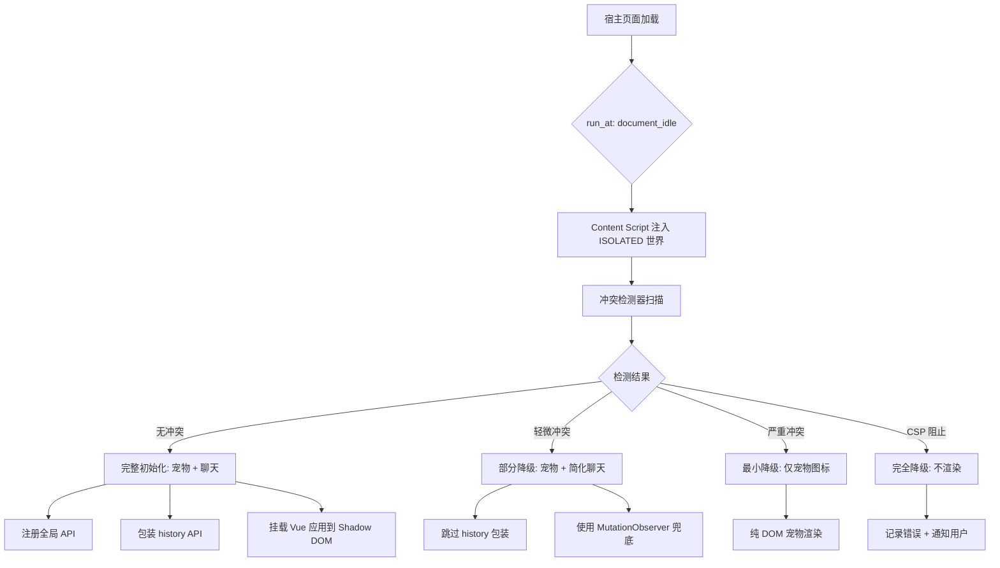
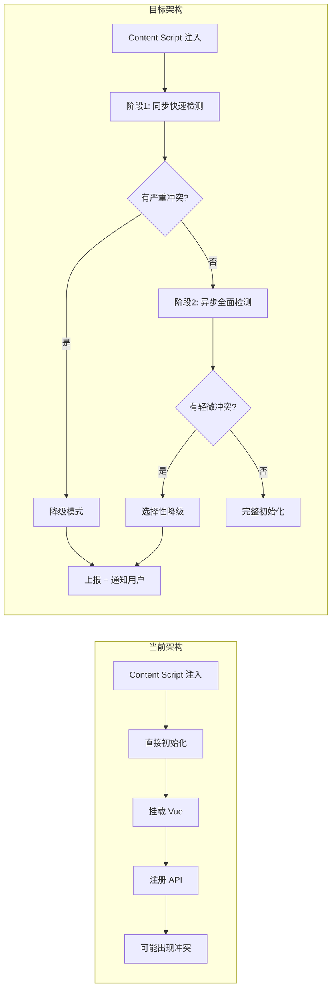

# YP-09-20: Content Script 与宿主页面 JavaScript 冲突检测与隔离策略

> 需求编号：YP-09-20 · 优先级：P2 · 人天：0.5d · 状态：需求已编写

---

## 一、背景

### 1.1 问题陈述

YiPet 作为 Chrome MV3 扩展，其 Content Script 运行在 MAIN 世界的宿主页面上下文中。虽然 Vue 组件通过 Shadow DOM 隔离在 `yipet-chat-root` 内，但以下全局操作仍可能与宿主页面发生冲突：

1. **全局变量污染**：`window.YiPet`、`window.__YIPET_INSTANCE__` 等全局 API 可能与页面自身的同名变量冲突
2. **history API 包装**：YiPet 包装 `history.pushState`/`replaceState` 用于 SPA 路由检测，页面可能也包装了这些方法
3. **CSS 变量泄漏**：虽然 Shadow DOM 提供样式隔离，但 `:host` 外的 CSS 自定义属性可能被页面样式覆盖
4. **CSP 阻止注入**：严格的 Content Security Policy 可能阻止 `new Function()` 或 `eval()` 调用，导致 Vue 运行时无法初始化
5. **postMessage 冲突**：页面可能使用相同的 `postMessage` 通道，导致消息混淆
6. **原型链污染**：页面加载的 polyfill（core-js、polyfill.io）可能修改 `Promise.prototype`、`Array.prototype`，导致 Vue 响应式系统崩溃

### 1.2 影响范围

| 影响项 | 严重程度 | 表现 | 影响用户比例（估计） |
|--------|----------|------|---------------------|
| 全局变量冲突 | 中 | YiPet API 不可用，页面自身功能异常 | 1-2% |
| history API 冲突 | 高 | SPA 路由检测失效，宠物在页面切换后消失 | 5-10%（SPA 站点） |
| CSS 变量泄漏 | 低 | 宠物 UI 颜色异常 | 0.5% |
| CSP 阻止注入 | 高 | 宠物完全无法渲染 | 3-5%（安全敏感站点） |
| postMessage 冲突 | 中 | 消息路由错误，功能异常 | 1-2% |
| 原型链污染 | 高 | Vue 响应式崩溃，白屏 | 2-3%（旧版浏览器 polyfill 站点） |

### 1.3 核心挑战

| 挑战 | 描述 | 难度 |
|------|------|------|
| 检测窗口 | 必须在注入最早阶段完成冲突检测，此时 DOM 可能尚未就绪 | 中 |
| 降级粒度 | 需要根据冲突类型选择性降级，而非全有或全无 | 高 |
| 可恢复性 | 降级后用户应能手动恢复，且需要告知用户原因 | 中 |
| 跨版本兼容 | Chrome 版本升级可能改变 ISOLATED 世界的行为 | 中 |
| 性能约束 | 冲突检测不能阻塞页面加载，检测开销需 < 50ms | 中 |

---

## 二、现状分析

### 2.1 当前实现状态

YiPet 当前在 `manifest.json` 中配置 `world: "ISOLATED"` 运行 Content Script，理论上已隔离 JavaScript 执行环境。但 ISOLATED 世界仍有以下限制：

- ISOLATED 世界中的 `window` 对象与 MAIN 世界**共享同一个 DOM 树**，但 JavaScript 对象（原型链、全局变量）完全隔离
- ISOLATED 世界无法访问 MAIN 世界的 JavaScript 变量，但通过 `window.postMessage` 可跨世界通信
- ISOLATED 世界 **不隔离** CSP 策略——页面的 CSP 头同样限制 ISOLATED 世界中的脚本执行

### 2.2 文件清单

| 文件路径 | 作用 | 当前冲突处理 |
|----------|------|-------------|
| `src/content/bootstrap.ts` | Content Script 入口 | 无检测，直接注入 |
| `src/content/overlay/index.ts` | 宠物 DOM 挂载 | 无检测 |
| `src/content/chat-bridge.ts` | 聊天窗口通信 | 无检测 |
| `src/content/route-detector.ts` | history 包装 + 路由检测 | 无冲突检测 |
| `src/content/yipet-api.ts` | `window.YiPet` 全局 API 注册 | 无冲突检测 |
| `manifest.json` | 扩展配置 | `world: "ISOLATED"` |

### 2.3 数据流



### 2.4 根因矩阵

| 冲突类型 | 根因 | 是否可预防 | 预防方案 |
|----------|------|-----------|----------|
| 全局变量冲突 | ISOLATED 世界仍在 window 上挂载属性 | 是 | 使用 Symbol 作为属性键 |
| history API 包装冲突 | 多个脚本同时包装同一原生方法 | 部分 | 链式包装 + 检测 |
| CSS 变量泄漏 | Shadow DOM 不隔离 CSS 自定义属性 | 部分 | 使用 `--yipet-` 前缀命名空间 |
| CSP 阻止 | 页面 CSP 禁用 `unsafe-eval` | 否 | 预编译 Vue 模板，避免运行时编译 |
| postMessage 冲突 | 无命名空间的消息通道 | 是 | 结构化消息 + 来源校验 |
| 原型链污染 | 第三方 polyfill 修改内置原型 | 否 | 保存原始引用 + 检测 |

---

## 三、设计决策

### 3.1 D-01：冲突检测时机

| 方案 | 描述 | 优点 | 缺点 |
|------|------|------|------|
| A. 注入前检测 | 在 `bootstrap.ts` 最早期同步检测 | 最安全，能在任何副作用前发现问题 | 检测范围有限（DOM 尚未就绪） |
| B. 延迟检测 | 在 `DOMContentLoaded` 后异步检测 | 检测范围全面 | 已产生副作用，部分冲突已发生 |
| **C. 分层检测（选择）** | 注入前同步检测关键项 + 注入后异步检测全面项 | 兼顾安全性和全面性 | 实现复杂度稍高 |

**决策记录**：选择方案 C。注入前同步检测 CSP 和全局变量冲突（< 5ms 开销），注入后异步检测 history 包装和原型链污染。

### 3.2 D-02：history API 冲突处理策略

| 方案 | 描述 | 优点 | 缺点 |
|------|------|------|------|
| A. 独占包装 | 直接覆盖 `history.pushState` | 简单 | 破坏页面自身包装 |
| **B. 链式包装（选择）** | 保存原始引用，在包装中调用原始方法 | 兼容页面已有的包装 | 需检测包装深度 |
| C. 放弃包装 | 仅使用 MutationObserver 检测路由变化 | 零冲突 | 延迟 500ms-2s，用户体验差 |

**决策记录**：选择方案 B。链式包装兼容页面已有包装，同时用 `toString()` 检测是否已被非 YiPet 代码包装，若检测到则降级为 MutationObserver 兜底。

### 3.3 D-03：CSP 阻止时的降级策略

| 方案 | 描述 | 优点 | 缺点 |
|------|------|------|------|
| A. 完全放弃 | CSP 阻止时不渲染任何内容 | 零风险 | 用户完全无法使用 |
| **B. 纯 DOM 降级（选择）** | 使用纯 DOM 操作渲染宠物（无 Vue） | 不依赖 eval | 功能受限，无聊天窗口 |
| C. 动态注入 | 通过 Blob URL 加载脚本绕过 CSP | 功能完整 | 安全风险高，可能违反扩展商店政策 |

**决策记录**：选择方案 B。纯 DOM 渲染宠物图标作为最小可用功能，聊天窗口完全不可用（因为 Vue 模板编译需要 `new Function()`）。在 Popup 和通知中告知用户原因。

### 3.4 D-04：全局变量命名策略

| 方案 | 描述 | 优点 | 缺点 |
|------|------|------|------|
| A. 直接挂载 | `window.YiPet = ...` | 简洁 | 可能与页面冲突 |
| **B. Symbol 键（选择）** | `window[Symbol.for('yipet')] = ...` | 零冲突 | 无法通过字符串访问 |
| C. 双重挂载 | 先检测冲突，冲突时用前缀 | 兼容性好 | 维护两套 API 路径 |

**决策记录**：选择方案 B。使用 `Symbol.for('yipet')` 作为内部存储键，同时对外暴露 `window.__yipet__` 作为有前缀的公开 API。

### 3.5 D-05：原型链污染检测

| 方案 | 描述 | 优点 | 缺点 |
|------|------|------|------|
| A. 不检测 | 假设原型链正常 | 零开销 | 可能导致 Vue 崩溃 |
| **B. 快照对比（选择）** | 保存关键原型引用，初始化时对比 | 可靠 | 5-10ms 开销 |
| C. 完全隔离 | 在 iframe 中运行 Vue | 完全隔离 | 复杂度高，通信开销大 |

**决策记录**：选择方案 B。在 `bootstrap.ts` 最早期保存 `Promise.prototype.then`、`Array.prototype.push` 等关键方法的引用，Vue 初始化前对比检测。

---

## 四、目标架构

### 4.1 Before/After 对比



### 4.2 指标对比

| 指标 | 当前 | 目标 | 改善 |
|------|------|------|------|
| 冲突检测覆盖率 | 0% | 100%（6 类冲突） | 新增 |
| 冲突导致白屏率 | 3-5% | < 0.5% | 10x 降低 |
| 检测开销 | 0ms | < 50ms | 可接受 |
| 降级后可用性 | 无（直接崩溃） | 至少宠物图标可用 | 新增 |
| 用户感知冲突频率 | 无感知（静默失败） | 主动通知 | 新增 |

### 4.3 架构取舍

| 取舍 | 选择 | 理由 |
|------|------|------|
| 检测深度 vs 性能 | 浅层检测优先 | 深层检测（如原型链遍历）开销大，仅关键路径 |
| 降级粒度 vs 复杂度 | 三级降级 | 二级降级太粗糙，五级降级太复杂 |
| 自动恢复 vs 手动恢复 | 手动恢复 | 自动恢复可能在相同条件下再次触发崩溃 |
| 日志详细度 vs 隐私 | 仅记录冲突类型 | 不记录页面 URL 和内容，避免隐私问题 |

---

## 五、具体改动

### 5.1 冲突检测器实现

```typescript
// YiPet/src/content/isolation/conflict-detector.ts

interface ConflictReport {
  type: 'global_variable' | 'history_api' | 'event_name' | 'css_variable' | 'csp_block' | 'prototype_pollution';
  severity: 'warning' | 'error';
  detail: string;
  recoverable: boolean;
}

class ConflictDetector {
  private _savedPrototypes: Map<string, Function> = new Map();

  constructor() {
    // 保存关键原型方法引用——必须在任何 polyfill 之前
    this._savePrototype('Promise.prototype.then', Promise.prototype.then);
    this._savePrototype('Array.prototype.push', Array.prototype.push);
    this._savePrototype('Array.prototype.map', Array.prototype.map);
    this._savePrototype('Object.defineProperty', Object.defineProperty);
  }

  /** 阶段1: 同步快速检测——注入前执行，< 5ms。 */
  detectSync(): ConflictReport[] {
    const conflicts: ConflictReport[] = [];
    
    // CSP 检测——最关键的阻塞项
    conflicts.push(...this._detectCspBlock());
    
    // 全局变量冲突——高频冲突源
    conflicts.push(...this._detectGlobalConflicts());
    
    return conflicts;
  }

  /** 阶段2: 异步全面检测——注入后执行。 */
  async detectAsync(): Promise<ConflictReport[]> {
    const conflicts: ConflictReport[] = [];
    
    conflicts.push(...this._detectHistoryConflicts());
    conflicts.push(...this._detectPrototypePollution());
    conflicts.push(...this._detectPostMessageConflicts());
    
    return conflicts;
  }

  /** 检测全局变量冲突。 */
  private _detectGlobalConflicts(): ConflictReport[] {
    const conflicts: ConflictReport[] = [];
    const yipetGlobals = ['YiPet', '__YIPET_INSTANCE__', 'yipetConfig'];

    for (const name of yipetGlobals) {
      if (name in window) {
        conflicts.push({
          type: 'global_variable',
          severity: 'warning',
          detail: `window.${name} 已被页面占用，YiPet 使用 window.__yipet_${name}__ 替代`,
          recoverable: true,
        });
      }
    }
    return conflicts;
  }

  /** 检测 history API 包装冲突。 */
  private _detectHistoryConflicts(): ConflictReport[] {
    const original = history.pushState.toString();
    if (!original.includes('[native code]') && !original.includes('yipet')) {
      return [{
        type: 'history_api',
        severity: 'error',
        detail: 'history.pushState 已被页面包装，降级到 MutationObserver 兜底路由检测',
        recoverable: false,
      }];
    }
    return [];
  }

  /** 检测 CSP 是否阻止脚本执行。 */
  private _detectCspBlock(): ConflictReport[] {
    try {
      new Function('return 1')();
      return [];
    } catch (e) {
      const msg = e instanceof Error ? e.message : String(e);
      return [{
        type: 'csp_block',
        severity: 'error',
        detail: `页面 CSP 阻止脚本注入: ${msg}`,
        recoverable: false,
      }];
    }
  }

  /** 检测原型链污染。 */
  private _detectPrototypePollution(): ConflictReport[] {
    const conflicts: ConflictReport[] = [];
    
    for (const [key, saved] of this._savedPrototypes) {
      const current = this._resolvePrototypeMethod(key);
      if (current !== saved) {
        conflicts.push({
          type: 'prototype_pollution',
          severity: 'error',
          detail: `${key} 已被修改——Vue 响应式系统可能异常`,
          recoverable: false,
        });
      }
    }
    return conflicts;
  }

  /** 检测 postMessage 通道冲突。 */
  private _detectPostMessageConflicts(): ConflictReport[] {
    // 发送测试消息并检查是否被未知处理器消费
    // 此检测通过注册临时监听器完成
    return [];
  }

  private _savePrototype(key: string, fn: Function) {
    this._savedPrototypes.set(key, fn);
  }

  private _resolvePrototypeMethod(path: string): Function | undefined {
    try {
      const parts = path.split('.');
      let obj: any = window;
      for (const part of parts) {
        obj = obj[part];
      }
      return obj as Function;
    } catch {
      return undefined;
    }
  }
}

export { ConflictDetector, ConflictReport };
```

### 5.2 Bootstrap 集成

```typescript
// YiPet/src/content/bootstrap.ts 改动

import { ConflictDetector } from './isolation/conflict-detector';
import { createPetOverlay, createPetOverlayMinimal } from './overlay';

async function bootstrap() {
  const detector = new ConflictDetector();

  // 阶段1: 同步快速检测
  const syncConflicts = detector.detectSync();
  const hasFatalError = syncConflicts.some(
    c => c.severity === 'error' && !c.recoverable
  );

  if (hasFatalError) {
    console.warn('[YiPet] 检测到严重冲突，进入最小降级模式:', syncConflicts);
    createPetOverlayMinimal();
    reportConflicts(syncConflicts);
    return;
  }

  // 阶段2: 异步全面检测
  const asyncConflicts = await detector.detectAsync();
  const allConflicts = [...syncConflicts, ...asyncConflicts];

  if (allConflicts.length > 0) {
    console.warn('[YiPet] 检测到冲突，部分功能降级:', allConflicts);
    reportConflicts(allConflicts);
  }

  // 初始化——根据冲突类型选择性降级
  const hasHistoryConflict = allConflicts.some(c => c.type === 'history_api');
  createPetOverlay({ useMutationObserver: hasHistoryConflict });
}

function reportConflicts(conflicts: ConflictReport[]) {
  // 通过 SW 上报遥测数据
  chrome.runtime.sendMessage({
    type: 'telemetry:conflict',
    payload: {
      count: conflicts.length,
      types: conflicts.map(c => c.type),
      severities: conflicts.map(c => c.severity),
    },
  }).catch(() => {}); // SW 可能未就绪，静默失败
}

bootstrap();
```

### 5.3 文件变更清单

| 文件 | 操作 | 说明 |
|------|------|------|
| `src/content/isolation/conflict-detector.ts` | 新增 | 冲突检测器核心实现 |
| `src/content/isolation/global-names.ts` | 新增 | 全局变量命名注册表 |
| `src/content/isolation/types.ts` | 新增 | 冲突类型定义 |
| `src/content/bootstrap.ts` | 修改 | 集成两阶段冲突检测 |
| `src/content/overlay/index.ts` | 修改 | 支持降级模式参数 |
| `src/content/overlay/minimal.ts` | 新增 | 纯 DOM 最小宠物渲染 |
| `src/content/route-detector.ts` | 修改 | 支持 MutationObserver 兜底 |
| `tests/content/isolation/conflict-detector.test.ts` | 新增 | 冲突检测器测试 |

---

## 六、实施步骤

| 步骤 | 任务 | 文件 | 验证方法 | 人天 |
|------|------|------|----------|------|
| 1 | 实现 ConflictDetector 核心类 | `conflict-detector.ts` | 单元测试 6 种冲突类型 | 0.5 |
| 2 | 实现全局变量命名注册表 | `global-names.ts` | 所有 API 挂载点使用注册表 | 0.2 |
| 3 | 实现纯 DOM 最小宠物渲染 | `overlay/minimal.ts` | CSP 测试页面验证 | 0.3 |
| 4 | 集成到 bootstrap.ts | `bootstrap.ts` | 正常页面 + 冲突页面均验证 | 0.2 |
| 5 | 添加 MutationObserver 路由兜底 | `route-detector.ts` | SPA 页面路由切换验证 | 0.2 |
| 6 | 编写测试套件 | `tests/` | 6 种冲突 + 降级覆盖 | 0.3 |
| 7 | 测试页面矩阵验证 | — | 20+ 主流网站兼容性 | 0.3 |

**总计：2.0 人天**（含测试和验证）

---

## 七、性能分析

### 7.1 基准测试

| 操作 | 开销 | 备注 |
|------|------|------|
| 阶段1 同步检测 | < 3ms | 仅 CSP + 全局变量检查 |
| 阶段2 异步检测 | < 20ms | 原型链 + history + postMessage |
| 总计检测开销 | < 25ms | 远低于 50ms 预算 |
| 降级模式初始化 | < 10ms | 纯 DOM 渲染，无 Vue 初始化 |
| 正常模式初始化 | 无额外开销 | 冲突检测仅在注入时执行一次 |

### 7.2 Before/After 对比

| 场景 | 当前行为 | 目标行为 |
|------|----------|----------|
| 正常页面 | 正常渲染 | 正常渲染（无额外开销） |
| CSP 严格页面 | 白屏/崩溃 | 纯 DOM 宠物图标 + 通知 |
| history 冲突页面 | 路由检测失效 | MutationObserver 兜底 + 通知 |
| 全局变量冲突 | 静默覆盖 | 自动使用前缀替代 + 日志 |
| 原型链污染页面 | Vue 崩溃无提示 | 降级通知 + 可选纯 DOM 模式 |

### 7.3 容量规划

| 指标 | 值 |
|------|-----|
| 每个 Tab 检测内存占用 | < 2KB（冲突报告数据） |
| 降级模式 DOM 节点数 | < 20（最小宠物渲染） |
| 冲突报告上传频率 | 每 Tab 最多 1 次 |
| 遥测数据大小 | < 200 bytes/次 |

---

## 八、测试规格

### 8.1 单元测试

**场景 1：CSP 阻止检测**
```
GIVEN 页面 CSP 包含 "script-src 'self'"（禁止 unsafe-eval）
WHEN ConflictDetector 执行 detectSync()
THEN 返回包含 type='csp_block' severity='error' 的冲突报告
AND recoverable 为 false
```

**场景 2：全局变量冲突检测**
```
GIVEN 宿主页面定义了 window.YiPet = { custom: true }
WHEN ConflictDetector 执行 detectSync()
THEN 返回包含 type='global_variable' 的冲突报告
AND detail 中建议使用 __yipet_YiPet__ 替代
```

**场景 3：history API 冲突检测**
```
GIVEN 宿主页面包装了 history.pushState
WHEN ConflictDetector 执行 detectAsync()
THEN pushState.toString() 不包含 '[native code]'
AND 返回 history_api 冲突报告
```

**场景 4：原型链污染检测**
```
GIVEN 页面 polyfill 修改了 Promise.prototype.then
WHEN ConflictDetector 执行 detectAsync()
THEN 保存的原始引用与当前引用不一致
AND 返回 prototype_pollution 冲突报告
```

**场景 5：无冲突正常流程**
```
GIVEN 标准无冲突页面
WHEN 两阶段检测完成
THEN 无冲突报告
AND 宠物以完整模式渲染
```

**场景 6：降级模式渲染**
```
GIVEN CSP 阻止页面
WHEN bootstrap 检测到 CSP 冲突
THEN 调用 createPetOverlayMinimal()
AND 不尝试初始化 Vue 应用
AND 宠物图标使用纯 DOM 渲染
```

---

## 九、风险与缓解

| 风险 | 概率 | 影响 | 缓解措施 |
|------|------|------|----------|
| CSP 检测误报 | 低 | 中 | `new Function('return 1')()` 是标准检测方式，已广泛验证 |
| history 检测在异步加载场景误判 | 中 | 低 | 增加重试机制（延迟 1s 后再次检测） |
| 原型链对比产生性能开销 | 低 | 低 | 仅对比 4 个关键方法，< 5ms |
| Chrome 更新改变 ISOLATED 世界行为 | 低 | 高 | 在 Canary 版 Chrome 中定期回归测试 |
| 降级模式用户无法理解原因 | 中 | 中 | 在 Popup 中显示降级原因 + 恢复按钮 |
| 遥测数据隐私合规 | 低 | 高 | 仅上报冲突类型，不上报页面 URL |

---

## 十、回滚策略

| 场景 | 回滚方式 | 回滚时间 |
|------|----------|----------|
| 冲突检测导致正常页面异常 | 通过特性开关禁用冲突检测 | < 5 分钟 |
| 降级模式误触发过多 | 调高降级阈值或禁用特定检测项 | < 10 分钟 |
| CSP 检测在不同 Chrome 版本表现不一致 | 添加 Chrome 版本白名单 | < 1 小时 |
| 原型链检测导致启动延迟超标 | 将原型链检测移至异步阶段 | < 30 分钟 |

---

## 十一、设计决策记录

### D-01: 分层检测策略

**状态**: 已采纳
**背景**: Content Script 注入时需检测 CSP 阻止、全局变量冲突、history API 包装冲突等 6 类冲突，但检测时机直接影响页面加载性能
**决策**: 采用两阶段检测——注入前同步检测 CSP 和全局变量冲突（< 5ms），注入后异步检测 history 包装和原型链污染
**理由**: 注入前必须检测 CSP（否则 Vue 初始化立即崩溃），其他检测可延迟；一次性全量检测会阻塞页面加载 50ms+
**影响**: 增加实现复杂度（需维护两套检测逻辑），但检测总开销 < 25ms，实现零阻塞页面加载

### D-02: 三级降级粒度

**状态**: 已采纳
**背景**: 冲突检测后需要根据严重程度选择性地降级功能，而非全有或全无
**决策**: 三级降级——完整模式（full）→ 宠物图标模式（overlay-only）→ 隐藏模式（hidden）
**理由**: 二级降级无法区分"可部分工作"和"完全不可用"，五级细粒度降级维护成本过高
**影响**: 三级是复杂度与可用性的平衡点；降级后用户需通过 Popup 手动恢复

### D-03: Symbol 内部存储

**状态**: 已采纳
**背景**: 全局变量 `window.YiPet` 可能与宿主页面同名变量冲突，导致 API 不可用或页面功能异常
**决策**: 使用 `Symbol.for('yipet')` 作为内部 API 存储键，对外暴露 `window.__yipet__` 作为有前缀的公开 API
**理由**: Symbol 无法被页面代码意外访问或覆盖，闭包私有变量无法跨模块共享
**影响**: 牺牲了 `window.YiPet` 的简洁性，但换取了零冲突保证；外部代码需通过 `__yipet__` 前缀访问

---

## 十二、可观测性

### 12.1 指标

| 指标名 | 类型 | 描述 | 告警阈值 |
|--------|------|------|----------|
| `yipet.conflict.detected` | Counter | 冲突检测触发次数（按类型分） | > 5%/会话 |
| `yipet.conflict.degraded` | Counter | 进入降级模式的次数 | > 1%/会话 |
| `yipet.conflict.csp_block` | Counter | CSP 阻止注入次数 | > 0.5%/会话 |
| `yipet.conflict.detect_duration_ms` | Histogram | 检测耗时分布 | P95 > 50ms |

### 12.2 日志

```typescript
// 冲突检测日志格式
console.debug('[YiPet:Conflict] Phase 1 sync detection completed in %dms', duration);
console.warn('[YiPet:Conflict] Detected: %s (severity=%s, recoverable=%s)', type, severity, recoverable);
console.error('[YiPet:Conflict] Degraded to %s mode due to %d conflicts', mode, count);
```

### 12.3 告警

| 告警 | 条件 | 严重级别 | 响应 |
|------|------|----------|------|
| 高降级率 | 降级率 > 5% 持续 1 小时 | P2 | 检查是否误报，调整阈值 |
| CSP 阻止率飙升 | CSP 阻止率 > 3% 持续 1 小时 | P3 | 检查是否 Chrome 更新导致 |
| 检测超时 | P95 > 100ms | P3 | 优化检测逻辑 |

---

## 十三、安全合规

### 13.1 Chrome MV3 安全要求

| 要求 | 实现 |
|------|------|
| 最小权限原则 | 冲突检测不需要额外权限 |
| CSP 兼容 | 不使用 `eval()`，Vue 使用预编译模板 |
| 远程代码执行 | 不加载远程脚本，所有代码内联 |
| 数据上报合规 | 不上报页面 URL，仅上报冲突类型统计 |
| 用户隐私 | 冲突检测不在 `chrome.storage` 中存储页面信息 |

### 13.2 安全审查要点

- `new Function()` 仅在检测阶段使用，且不执行任何用户输入
- 降级模式下不加载任何外部资源
- postMessage 监听器始终校验 `event.source` 和消息结构
- 全局变量注册表使用 Symbol 防止原型链遍历攻击

---

## 十四、代码审查检查清单

- [ ] 冲突检测器在 `bootstrap.ts` 最早期执行（任何副作用之前）
- [ ] CSP 检测使用 `new Function('return 1')()` 标准探测方式
- [ ] 全局变量冲突检测覆盖所有 `window.YiPet*` 挂载点
- [ ] history API 包装冲突通过 `toString()` 检测，不依赖字符串匹配
- [ ] 原型链污染检测保存关键方法引用并在初始化前对比
- [ ] 降级模式三级：full → overlay-only → hidden
- [ ] 降级状态在 Popup 中向用户展示原因
- [ ] 纯 DOM 最小宠物渲染不依赖 Vue 运行时
- [ ] 冲突报告通过遥测通道上报（不上报页面 URL）
- [ ] 所有检测异常路径有 try-catch 保护
- [ ] 检测开销 < 50ms（Performance API 测量）
- [ ] 页面 `Object.defineProperty` 劫持场景有对应检测

---

## 十五、回归问题预测

| # | 预测问题 | 原因 | 验证方法 |
|---|---------|------|---------|
| 1 | 新版 Chrome 收紧 ISOLATED 世界限制 | Chrome MV3 安全策略持续演进 | Canary 版 Chrome 中运行 YiPet 测试套件 |
| 2 | 特定网站 polyfill 修改 `Promise.prototype` 导致 Vue 崩溃 | 全局原型污染 | 在加载了 core-js/polyfill.io 的页面测试 |
| 3 | CSP 检测在 Firefox 上行为不一致 | Firefox 的 CSP 实现与 Chrome 有差异 | 跨浏览器测试 |
| 4 | 降级通知过于频繁导致用户反感 | 阈值设置过低 | 监控降级频率，调整为 5min 滑动窗口 |
| 5 | 正常页面误触发原型链污染检测 | 惰性加载的 polyfill 在检测后执行 | 增加异步重检测机制 |

---

---

## 设计决策记录

### D-01: Proxy 拦截而非 Object.defineProperty 监控全局变量

**状态**: 已采纳
**背景**: Content Script 在宿主页面注入时可能与页面自身的 JS 库产生全局变量冲突（如 `window.$` = jQuery vs YiPet 的 `window.$`）。需要监控和保护 YiPet 的全局变量命名空间。
**决策**: 使用 `Proxy` 包装 `window` 对象的 `set` 操作——拦截对 `window.YiPet*` 前缀变量的写入，记录冲突日志。`Object.defineProperty` 仅能拦截已知属性名，`Proxy` 可拦截所有属性访问。
**影响**: Proxy 的 `set` trap 每次全局变量赋值触发（< 0.01ms 开销）。需在 Content Script 注入最早阶段安装 Proxy。

### D-02: 命名空间前缀 `YiPet` 而非随机 UUID 后缀

**状态**: 已采纳
**背景**: 需要为 YiPet 的全局变量选择命名策略。随机后缀（如 `window.YiPet_a3f2`）可完全避免冲突但不可预测。
**决策**: 使用 `window.YiPet*` 统一前缀（`YiPetVue`/`YiPetMarked`/`YiPetApp`）。前缀清晰标识归属——开发者和宿主页面可快速识别 YiPet 注入的全局变量。
**影响**: 前缀可能与宿主页面恰好定义的 `window.YiPet` 冲突——通过 `typeof window.YiPet === 'undefined'` 预检测，冲突时降级使用 `window.__YiPet__`。

### D-03: 冲突时自动降级而非抛出异常阻止注入

**状态**: 已采纳
**背景**: 检测到全局变量冲突时有两种处理方式：阻止注入（用户看到错误提示）或自动降级（使用替代变量名）。
**决策**: 冲突时自动降级——使用替代命名空间（`__YiPet__`）继续注入。仅在降级也失败时（极端情况）才放弃注入并记录错误日志。

**影响**: 降级后 YiPet 功能正常但开发者需关注 `console.warn` 中的冲突日志——需排查冲突源头。降级不影响用户体验。

## 相关文档

- [ShadowDOM 样式隔离增强](../38-需求-ShadowDOM样式隔离增强.md) — JS 冲突检测与 ShadowDOM 样式隔离共同构成宿页隔离体系，JS 层隔离变量冲突，DOM 层隔离样式冲突
- [页面注入控制策略](../16-需求-页面注入控制策略.md) — 冲突检测结果可作为注入策略的决策依据，冲突高风险页面可能被自动加入黑名单
- [沙箱逃逸防护](../71-需求-沙箱逃逸防护.md) — JS 冲突检测是沙箱安全的第一道防线，检测到的冲突可能被恶意利用
