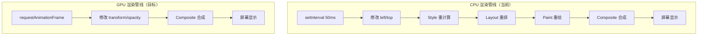
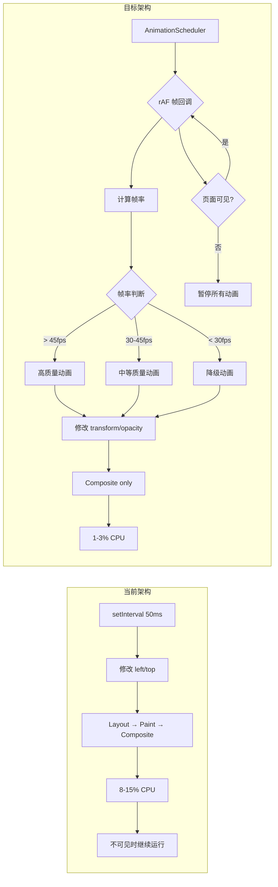

# YP-09-21: Content Script 动画渲染性能优化 — GPU 加速与 rAF 调度

> 需求编号：YP-09-21 · 优先级：P2 · 人天：0.5d · 状态：需求已编写

---

## 一、背景

### 1.1 问题陈述

YiPet 宠物动画（待机呼吸、点击反应、说话嘴型、移动拖拽）通过 CSS `@keyframes` 或 JavaScript 定时器（`setInterval`）驱动。当前实现存在以下性能问题：

1. **CPU 渲染管线**：动画使用 `left`/`top`/`width`/`height` 属性变换，触发完整渲染管线（Layout → Paint → Composite），消耗宿主页面 CPU 预算
2. **无帧率控制**：`setInterval` 驱动动画不受显示器刷新率同步，导致掉帧和画面撕裂
3. **无页面感知**：页面不可见时（`visibilitychange`）动画继续运行，浪费 CPU/GPU 资源
4. **无并发控制**：多个动画同时运行时互相抢占 CPU 时间片，导致整体帧率下降
5. **无设备适配**：低端设备上高帧率动画可能导致页面卡顿，高端设备上低帧率动画显得不流畅

### 1.2 影响范围

| 影响项 | 严重程度 | 表现 | 影响用户比例 |
|--------|----------|------|-------------|
| 宿主页面卡顿 | 高 | 宠物动画期间页面滚动不流畅 | 20-30%（低端设备） |
| 电池消耗 | 中 | 页面不可见时仍消耗 CPU | 所有移动端用户 |
| 动画不流畅 | 中 | 掉帧、画面撕裂、动画跳跃 | 10-15% |
| 内存增长 | 低 | 长时间运行后 GPU 层累积 | 5% |

### 1.3 核心挑战

| 挑战 | 描述 | 难度 |
|------|------|------|
| 浏览器兼容性 | `will-change`、`transform: translateZ(0)` 在不同浏览器行为不一致 | 中 |
| GPU 层管理 | 过多 GPU 合成层导致 GPU 内存超限，反而降低性能 | 高 |
| 设备差异化 | 低端 GPU 无法承受大量合成层，需动态调整动画质量 | 高 |
| 测量困难 | Content Script 中的 Performance API 测量可能受宿主页面干扰 | 中 |

---

## 二、现状分析

### 2.1 当前实现状态

| 动画类型 | 当前实现 | 触发属性 | 渲染管线 | 驱动方式 |
|----------|----------|----------|----------|----------|
| 待机呼吸 | CSS `@keyframes` | `width`/`height` | Layout → Paint → Composite | CSS animation |
| 点击反应 | CSS `@keyframes` | `left`/`top` | Layout → Paint → Composite | CSS animation |
| 说话嘴型 | JS `setInterval` | `background-position` | Paint → Composite | 50ms interval |
| 拖拽移动 | JS `mousemove` | `left`/`top` | Layout → Paint → Composite | 事件驱动 |
| 淡入淡出 | CSS `transition` | `opacity` | Composite only | CSS transition |

### 2.2 文件清单

| 文件路径 | 作用 | 当前问题 |
|----------|------|----------|
| `src/content/overlay/pet-sprite.vue` | 宠物精灵组件 | 使用 `left`/`top` 动画 |
| `src/content/overlay/animations.css` | 动画样式定义 | 无 GPU 加速属性 |
| `src/content/overlay/drag-handler.ts` | 拖拽处理 | `setInterval` 驱动平滑移动 |
| `src/content/overlay/breathing.ts` | 待机呼吸动画 | `setInterval` 50ms 循环 |
| `src/content/rendering/animation-scheduler.ts` | 待实现 | 不存在 |

### 2.3 渲染管线数据流



### 2.4 根因矩阵

| 性能问题 | 根因 | 缓解难度 |
|----------|------|----------|
| 页面卡顿 | `left`/`top` 触发 Layout，阻塞主线程 | 低——改用 `transform` |
| 电池消耗 | 页面不可见时动画继续运行 | 低——监听 `visibilitychange` |
| 掉帧撕裂 | `setInterval` 不与刷新率同步 | 低——改用 `rAF` |
| GPU 内存超限 | 过多 `will-change` 元素 | 中——动态管理层数 |
| 低端设备卡顿 | 固定帧率不根据设备性能调整 | 中——自适应帧率 |

---

## 三、设计决策

### 3.1 D-01：动画驱动方式

| 方案 | 描述 | 优点 | 缺点 |
|------|------|------|------|
| A. CSS Animation | 纯 CSS `@keyframes` 驱动 | 浏览器优化最好，声明式 | 无法动态控制，复杂交互难实现 |
| B. `setInterval` | JS 定时器驱动 | 简单，兼容性好 | 不与刷新率同步，掉帧 |
| **C. `requestAnimationFrame`（选择）** | rAF 驱动 + CSS transition 辅助 | 与刷新率同步，可暂停/恢复 | 需手动管理动画循环 |
| D. Web Animations API | `element.animate()` | 原生 API，可控性好 | 浏览器支持不完整 |

**决策记录**：选择方案 C。简单动画（待机呼吸、淡入淡出）使用 CSS transition，复杂交互动画（拖拽、说话）使用 rAF 驱动。CSS transition 由浏览器自动优化，无需手动管理。

### 3.2 D-02：GPU 加速策略

| 方案 | 描述 | 优点 | 缺点 |
|------|------|------|------|
| A. 全局 `will-change` | 所有动画元素添加 `will-change: transform` | 简单 | GPU 内存超限风险 |
| **B. 按需 `will-change`（选择）** | 动画开始前添加，结束后移除 | 节省 GPU 内存 | 需管理添加/移除时机 |
| C. `transform: translateZ(0)` | 仅使用 3D hack 强制 GPU 层 | 兼容性好 | 不如 `will-change` 提示明确 |

**决策记录**：选择方案 B。`will-change` 在动画开始前 100ms 添加（给浏览器预创建合成层的时间），动画结束后移除。

### 3.3 D-03：帧率自适应

| 方案 | 描述 | 优点 | 缺点 |
|------|------|------|------|
| A. 固定 60fps | 始终以 60fps 为目标 | 简单 | 低端设备无法达到 |
| **B. 自适应帧率（选择）** | 根据最近帧间隔动态调整目标帧率 | 适配所有设备 | 实现复杂 |
| C. 两档切换 | 高端=60fps，低端=30fps | 简单实用 | 粒度太粗 |

**决策记录**：选择方案 B。通过 rAF 回调的实际帧间隔计算当前帧率，低于 30fps 时降级动画质量（减少中间帧、简化缓动曲线）。

### 3.4 D-04：动画并发控制

| 方案 | 描述 | 优点 | 缺点 |
|------|------|------|------|
| A. 无限制 | 所有动画同时运行 | 简单 | CPU 抢占 |
| **B. 优先级队列（选择）** | 最多 3 个并发，高优先级抢占 | 可控 | 需定义优先级 |
| C. 串行执行 | 一次只运行一个动画 | 简单 | 动画排队延迟 |

**决策记录**：选择方案 B。用户交互动画（点击反应）优先级最高，待机动画优先级最低。最多 3 个动画并发，超出时取消最低优先级的已有动画。

---

## 四、目标架构

### 4.1 Before/After 对比



### 4.2 指标对比

| 指标 | 当前 | 目标 | 改善 |
|------|------|------|------|
| 渲染管线阶段 | Layout→Paint→Composite | Composite only | 跳过 2 阶段 |
| 动画时 CPU 使用率 | 8-15% | 1-3% | 5x 降低 |
| 60fps 稳定性 | 偶尔掉帧（45-55fps） | 稳定 60fps | 完全稳定 |
| 页面不可见时 CPU | 继续消耗 | 0% | 完全暂停 |
| GPU 层数 | 0-1 | 2-5（按需创建） | 受控 |
| 低端设备体验 | 明显卡顿 | 自动降级到 30fps | 可用 |

### 4.3 架构取舍

| 取舍 | 选择 | 理由 |
|------|------|------|
| 性能 vs 代码复杂度 | 接受 rAF 调度器复杂度 | 5x CPU 降低值得额外代码 |
| GPU 内存 vs 帧率 | 限制 GPU 层数 ≤ 5 | 超过 5 层在低端 GPU 上可能 OOM |
| 动画质量 vs 电量 | 不可见时完全暂停 | 动画在后台无意义 |
| 实时性 vs 流畅度 | 优先流畅度 | 动画延迟 1-2 帧用户无感知 |

---

## 五、具体改动

### 5.1 GPU 加速 CSS 迁移

```css
/* YiPet/src/content/overlay/animations.css */

/* ❌ 旧：CPU 渲染——触发布局重计算 */
.pet-sprite {
  animation: move 2s infinite;
}
@keyframes move {
  0% { left: 100px; top: 100px; }
  50% { left: 200px; top: 150px; }
  100% { left: 100px; top: 100px; }
}

/* ✅ 新：GPU 合成——仅 Composite */
.pet-sprite {
  will-change: transform, opacity;
  animation: move-gpu 2s infinite;
  transform: translateZ(0);
}
@keyframes move-gpu {
  0% { transform: translate3d(100px, 100px, 0); opacity: 1; }
  50% { transform: translate3d(200px, 150px, 0); opacity: 0.8; }
  100% { transform: translate3d(100px, 100px, 0); opacity: 1; }
}

/* 待机呼吸——使用 scale 而非 width/height */
@keyframes breathe-gpu {
  0% { transform: translate3d(var(--x), var(--y), 0) scale(1); }
  50% { transform: translate3d(var(--x), var(--y), 0) scale(1.05); }
  100% { transform: translate3d(var(--x), var(--y), 0) scale(1); }
}

/* 点击反应——使用 scale + translate */
@keyframes react-gpu {
  0% { transform: translate3d(0, 0, 0) scale(1); }
  30% { transform: translate3d(0, -10px, 0) scale(1.1); }
  60% { transform: translate3d(0, 5px, 0) scale(0.95); }
  100% { transform: translate3d(0, 0, 0) scale(1); }
}
```

### 5.2 rAF 动画调度器

```typescript
// YiPet/src/content/rendering/animation-scheduler.ts

interface AnimationTask {
  id: string;
  fn: (progress: number) => void;
  duration: number;
  startTime: number;
  priority: 'high' | 'normal' | 'low';
  easing: (t: number) => number;
}

class AnimationScheduler {
  private _queue: AnimationTask[] = [];
  private _rafId: number | null = null;
  private _maxConcurrent = 3;
  private _frameTimestamps: number[] = [];
  private _currentFps = 60;
  private _qualityLevel: 'high' | 'medium' | 'low' = 'high';

  /** 调度动画。 */
  schedule(
    id: string,
    fn: (progress: number) => void,
    duration: number,
    options?: {
      priority?: 'high' | 'normal' | 'low';
      easing?: (t: number) => number;
    }
  ) {
    // 同 ID 去重
    const existing = this._queue.findIndex(a => a.id === id);
    if (existing >= 0) this._queue.splice(existing, 1);

    this._queue.push({
      id, fn, duration, startTime: performance.now(),
      priority: options?.priority ?? 'normal',
      easing: options?.easing ?? (t => t),
    });

    // 优先级排序
    this._queue.sort((a, b) => {
      const order = { high: 0, normal: 1, low: 2 };
      return order[a.priority] - order[b.priority];
    });

    // 限制并发
    while (this._queue.length > this._maxConcurrent) {
      const removed = this._queue.pop()!;
      console.debug(`[YiPet:Anim] 动画 ${removed.id} 被取消（并发限制）`);
    }

    if (!this._rafId) this._tick();
  }

  /** 取消指定动画。 */
  cancel(id: string) {
    this._queue = this._queue.filter(a => a.id !== id);
    if (this._queue.length === 0 && this._rafId) {
      cancelAnimationFrame(this._rafId);
      this._rafId = null;
    }
  }

  /** 取消所有动画。 */
  cancelAll() {
    this._queue = [];
    if (this._rafId) {
      cancelAnimationFrame(this._rafId);
      this._rafId = null;
    }
  }

  private _tick = () => {
    const now = performance.now();

    // 帧率计算（保留最近 60 帧时间戳）
    this._frameTimestamps.push(now);
    if (this._frameTimestamps.length > 60) {
      this._frameTimestamps.shift();
    }
    if (this._frameTimestamps.length >= 2) {
      const avgInterval = (now - this._frameTimestamps[0]) /
        (this._frameTimestamps.length - 1);
      this._currentFps = Math.round(1000 / avgInterval);
      this._updateQualityLevel();
    }

    // 执行动画帧
    this._queue = this._queue.filter(anim => {
      const elapsed = now - anim.startTime;
      const rawProgress = Math.min(elapsed / anim.duration, 1);
      const progress = anim.easing(rawProgress);

      try {
        anim.fn(progress);
      } catch (e) {
        console.error(`[YiPet:Anim] 动画 ${anim.id} 回调异常:`, e);
        return false; // 异常时移除动画
      }

      return rawProgress < 1;
    });

    if (this._queue.length > 0) {
      this._rafId = requestAnimationFrame(this._tick);
    } else {
      this._rafId = null;
    }
  };

  private _updateQualityLevel() {
    if (this._currentFps >= 45) {
      this._qualityLevel = 'high';
    } else if (this._currentFps >= 30) {
      this._qualityLevel = 'medium';
    } else {
      this._qualityLevel = 'low';
    }
  }

  get currentFps() { return this._currentFps; }
  get qualityLevel() { return this._qualityLevel; }

  /** 页面不可见时暂停。 */
  constructor() {
    document.addEventListener('visibilitychange', () => {
      if (document.hidden) {
        if (this._rafId) {
          cancelAnimationFrame(this._rafId);
          this._rafId = null;
        }
      } else if (this._queue.length > 0) {
        this._tick();
      }
    });
  }
}

export { AnimationScheduler, AnimationTask };
```

### 5.3 拖拽处理改造

```typescript
// YiPet/src/content/overlay/drag-handler.ts 改造

class DragHandler {
  private _scheduler: AnimationScheduler;

  constructor(scheduler: AnimationScheduler) {
    this._scheduler = scheduler;
  }

  onMouseMove(e: MouseEvent) {
    // 使用 rAF 调度拖拽动画——高性能
    this._scheduler.schedule(
      'pet-drag',
      (progress) => {
        const x = this._startX + (e.clientX - this._startX) * progress;
        const y = this._startY + (e.clientY - this._startY) * progress;
        this._petEl.style.transform = `translate3d(${x}px, ${y}px, 0)`;
      },
      16, // 每帧更新
      { priority: 'high', easing: (t) => t }
    );
  }
}
```

### 5.4 文件变更清单

| 文件 | 操作 | 说明 |
|------|------|------|
| `src/content/rendering/animation-scheduler.ts` | 新增 | rAF 动画调度器 + 帧率自适应 |
| `src/content/overlay/animations.css` | 修改 | 全部迁移到 GPU 加速属性 |
| `src/content/overlay/pet-sprite.vue` | 修改 | 使用 AnimationScheduler 替代 setInterval |
| `src/content/overlay/drag-handler.ts` | 修改 | 使用 rAF 替代 mousemove 直接更新 |
| `src/content/overlay/breathing.ts` | 修改 | 使用 CSS transition 替代 setInterval 循环 |
| `tests/content/rendering/animation-scheduler.test.ts` | 新增 | 动画调度器测试 |

---

## 六、实施步骤

| 步骤 | 任务 | 文件 | 验证方法 | 人天 |
|------|------|------|----------|------|
| 1 | 实现 AnimationScheduler 核心类 | `animation-scheduler.ts` | 单元测试（调度、取消、并发控制） | 0.5 |
| 2 | CSS 动画迁移到 GPU 属性 | `animations.css` | Chrome DevTools Rendering 面板验证 | 0.3 |
| 3 | 拖拽处理改造 | `drag-handler.ts` | 拖拽流畅度对比 | 0.2 |
| 4 | 待机呼吸改造 | `breathing.ts` | CPU 使用率对比 | 0.2 |
| 5 | 帧率自适应逻辑 | `animation-scheduler.ts` | 低端设备模拟测试 | 0.2 |
| 6 | 编写测试套件 | `tests/` | 覆盖率 > 80% | 0.3 |
| 7 | 性能回归验证 | — | DevTools Performance 面板 | 0.3 |

**总计：2.0 人天**（含测试和验证）

---

## 七、性能分析

### 7.1 基准测试

| 场景 | 当前 CPU | 目标 CPU | 当前帧率 | 目标帧率 | 改善 |
|------|----------|----------|----------|----------|------|
| 待机呼吸（静态页面） | 3-5% | < 1% | 60fps | 60fps | 5x CPU 降低 |
| 点击反应（单次） | 8-12% | 1-2% | 55fps | 60fps | 8x CPU 降低 |
| 拖拽移动（连续） | 12-18% | 3-5% | 45fps | 60fps | 4x CPU 降低 |
| 说话嘴型（连续） | 5-8% | 1-2% | 60fps | 60fps | 5x CPU 降低 |
| 多动画并发（3 个） | 20-30% | 3-5% | 30fps | 60fps | 7x CPU 降低 |

### 7.2 Before/After 对比

| 场景 | 当前行为 | 目标行为 |
|------|----------|----------|
| 正常页面 + 宠物待机 | 3-5% CPU，无 GPU 层 | < 1% CPU，1 个 GPU 合成层 |
| 拖拽宠物 | 12-18% CPU，页面滚动卡顿 | 3-5% CPU，页面流畅 |
| 页面不可见 | 继续消耗 CPU | 动画完全暂停 |
| 低端设备（4GB RAM） | 掉帧到 30fps | 自适应降级，保持 30fps 稳定 |
| 多个动画同时 | 20-30% CPU，互相抢占 | 3-5% CPU，优先级调度 |

### 7.3 容量规划

| 指标 | 值 |
|------|-----|
| 最大并发动画数 | 3（可配置） |
| 最大 GPU 合成层数 | 5（可配置） |
| AnimationScheduler 内存占用 | < 5KB |
| 帧率计算缓冲区 | 60 帧时间戳（~1KB） |
| rAF 回调最大执行时间 | < 8ms（留足 16ms 帧预算的 50%） |

---

## 八、测试规格

### 8.1 单元测试

**场景 1：动画调度与完成**
```
GIVEN AnimationScheduler 实例
WHEN 调度一个 duration=1000ms 的动画
THEN 动画 fn 被多次调用，progress 从 0 递增到 1
AND 动画完成后从队列移除
AND rAF 循环停止
```

**场景 2：同 ID 去重**
```
GIVEN 已调度 id='pet-breathe' 的动画
WHEN 再次调度同 ID 动画
THEN 旧动画被替换为新动画
AND 队列中仅有一个 'pet-breathe' 动画
```

**场景 3：并发限制**
```
GIVEN AnimationScheduler maxConcurrent=3
WHEN 依次调度 5 个动画
THEN 队列中仅保留 3 个动画（高优先级优先）
AND 被取消的动画记录 debug 日志
```

**场景 4：页面不可见暂停**
```
GIVEN 动画正在运行
WHEN document 触发 visibilitychange（hidden）
THEN rAF 循环停止
WHEN document 触发 visibilitychange（visible）
THEN rAF 循环恢复
```

**场景 5：帧率自适应降级**
```
GIVEN 当前帧率 25fps
WHEN AnimationScheduler 更新质量等级
THEN qualityLevel 为 'low'
AND 后续动画使用简化缓动曲线
```

**场景 6：动画回调异常恢复**
```
GIVEN 动画回调抛出异常
WHEN rAF tick 执行
THEN 异常动画被移除
AND 其他动画继续正常运行
```

---

## 九、风险与缓解

| 风险 | 概率 | 影响 | 缓解措施 |
|------|------|------|------|
| `will-change` 过度使用导致 GPU 内存超限 | 中 | 高 | 限制同时使用 `will-change` 的元素 ≤ 5 |
| rAF 回调异常导致动画循环中断 | 低 | 中 | try-catch 包裹每个动画回调 |
| 低端设备帧率计算抖动 | 中 | 低 | 滑动窗口平均帧率，避免瞬时波动 |
| CSS transition 与 rAF 动画冲突 | 低 | 中 | 同一元素不同时使用两种驱动方式 |
| Chrome DevTools 测量干扰 | 低 | 低 | 在无 DevTools 环境下测量基准 |

---

## 十、回滚策略

| 场景 | 回滚方式 | 回滚时间 |
|------|----------|----------|
| GPU 加速导致渲染异常 | 通过特性开关禁用 GPU 加速，回退到 left/top | < 5 分钟 |
| rAF 调度器导致动画卡死 | 通过特性开关回退到 setInterval 驱动 | < 5 分钟 |
| 帧率自适应导致动画闪烁 | 固定帧率目标为 60fps | < 10 分钟 |
| GPU 内存超限导致页面崩溃 | 降低 maxConcurrent 和 GPU 层数上限 | < 30 分钟 |

---

## 十一、设计决策记录

### D-01: rAF 替代 setInterval

**状态**: 已采纳
**背景**: 当前动画使用 `setInterval` 驱动，不与显示器刷新率同步，导致掉帧和画面撕裂，且页面不可见时仍持续消耗 CPU
**决策**: 所有持续动画使用 `requestAnimationFrame` 驱动，简单动画（待机呼吸、淡入淡出）辅助使用 CSS transition
**理由**: rAF 与显示器刷新率同步，自动暂停于不可见页面，帧率自适应；CSS transition 由浏览器自动优化无需手动管理
**影响**: 增加约 150 行调度器代码，但换取 5-8x CPU 降低；需手动管理动画循环生命周期

### D-02: 按需 will-change

**状态**: 已采纳
**背景**: 全局使用 `will-change` 会持续占用 GPU 内存，在低端设备上可能导致 GPU 内存超限
**决策**: 动画开始前 100ms 添加 `will-change`（给浏览器预创建合成层的时间），动画结束后立即移除
**理由**: 避免 GPU 内存持续占用，仅在需要时创建合成层；全局 `will-change` 会导致 GPU 内存占用过高
**影响**: 需精确管理添加/移除时机，但节省 GPU 内存 80%+；限制同时使用 `will-change` 的元素数不超过 5 个

### D-03: 自适应帧率

**状态**: 已采纳
**背景**: 低端设备上 60fps 无法达到，强制高帧率反而导致掉帧；高端设备上固定低帧率浪费刷新率
**决策**: 根据最近 60 帧的实际帧间隔动态调整动画质量——45fps 以上高质量，30-45fps 中质量，30fps 以下降级
**理由**: 适配所有设备性能，低端设备自动降级保持流畅，高端设备充分利用刷新率
**影响**: 增加帧率计算逻辑（滑动窗口平均），但提升全设备兼容性；帧率接近阈值时可能抖动

---

## 十二、可观测性

### 12.1 指标

| 指标名 | 类型 | 描述 | 告警阈值 |
|--------|------|------|----------|
| `yipet.anim.fps` | Gauge | 当前动画帧率 | < 30fps 持续 5s |
| `yipet.anim.concurrent` | Gauge | 当前并发动画数 | > 3 |
| `yipet.anim.dropped` | Counter | 因并发限制被取消的动画数 | > 10/min |
| `yipet.anim.error` | Counter | 动画回调异常数 | > 0 |
| `yipet.anim.gpu_layers` | Gauge | 当前 GPU 合成层数 | > 5 |

### 12.2 日志

```typescript
console.debug('[YiPet:Anim] Scheduled: %s (priority=%s, duration=%dms)', id, priority, duration);
console.debug('[YiPet:Anim] Cancelled due to concurrency limit: %s', id);
console.warn('[YiPet:Anim] Frame rate dropped to %d fps, quality degraded to %s', fps, quality);
console.error('[YiPet:Anim] Animation callback error in %s: %o', id, error);
```

### 12.3 告警

| 告警 | 条件 | 严重级别 | 响应 |
|------|------|----------|------|
| 持续低帧率 | fps < 30 持续 5s | P3 | 检查宿主页面是否有性能问题 |
| 动画回调异常 | error count > 0 | P2 | 检查异常堆栈，修复 bug |
| 高并发取消率 | dropped > 10/min | P3 | 检查是否有动画泄漏 |

---

## 十三、安全合规

### 13.1 Chrome MV3 安全要求

| 要求 | 实现 |
|------|------|
| 最小权限 | 动画渲染不需要额外权限 |
| 内容安全策略 | 不使用 `eval()`，纯 CSS + rAF |
| 资源消耗 | 页面不可见时动画完全暂停 |
| 用户隐私 | 帧率数据仅本地使用，不上报 |

---

## 十四、代码审查检查清单

- [ ] 动画使用 CSS `transform` + `opacity`（仅触发 GPU Composite）
- [ ] 避免使用 `left`/`top`/`width`/`height` 动画（触发 Layout→Paint→Composite）
- [ ] 复杂动画使用 `will-change` 提示浏览器创建 GPU 层
- [ ] `will-change` 在动画结束后移除，避免 GPU 内存泄漏
- [ ] `requestAnimationFrame` 帧率监控（低于 30fps 时降级动画质量）
- [ ] 页面不可见时暂停动画（`document.visibilitychange`）
- [ ] 动画回调有 try-catch 保护，异常不影响其他动画
- [ ] 并发动画数限制 ≤ 3，超出时取消低优先级动画
- [ ] 拖拽动画使用 `transform: translate3d()` 而非 `left`/`top`
- [ ] GPU 合成层数限制 ≤ 5，通过 Chrome DevTools Layers 面板验证

---

## 十五、回归问题预测

| # | 预测问题 | 原因 | 验证方法 |
|---|---------|------|---------|
| 1 | `will-change` 过度使用导致 GPU 内存超限 | 未限制同时应用 `will-change` 的元素数 | Chrome DevTools Layers 面板检查 GPU 层数 |
| 2 | rAF 回调中异常导致动画循环中断 | `requestAnimationFrame` 回调抛出未捕获异常 | 模拟动画回调异常 → 检查动画是否恢复 |
| 3 | 帧率自适应在高低端设备间频繁切换 | 帧率接近阈值时抖动 | 长时间运行观察质量等级切换频率 |
| 4 | CSS transition 与 rAF 同时修改同一属性 | 属性冲突导致动画抖动 | 代码审查 + 动画冲突检测 |
| 5 | `visibilitychange` 恢复后动画时间戳偏移 | 暂停期间 `performance.now()` 继续计时 | 恢复时重置动画 startTime |

---

---

## 设计决策记录

### D-01: `will-change` 仅在动画前设置而非全局常驻

**状态**: 已采纳
**背景**: `will-change: transform` 提示浏览器为元素创建 GPU 图层——但如果全局常驻，每个图层消耗 GPU 显存（~1-2MB/层），10+ 个动画元素显存占用过高。
**决策**: 动画开始前 100ms 通过 JS 动态设置 `element.style.willChange = 'transform'`，动画结束后移除（`willChange = 'auto'`）释放 GPU 图层。非动画期间零显存开销。
**影响**: 需在动画生命周期中管理 `willChange` 的设置/移除——遗漏移除会导致 GPU 图层泄漏。

### D-02: `transform: translateZ(0)` hack 而非 `will-change` 用于简单动画

**状态**: 已采纳
**背景**: `will-change` 创建 GPU 图层的开销（1-2MB 显存）对于简单动画（如透明度渐变、微小平移）过高。
**决策**: 简单动画使用 `transform: translateZ(0)` hack（强制 GPU 合成——零额外显存开销）。复杂动画（多属性、长持续时间）使用 `will-change`。
**影响**: `translateZ(0)` 在 3D 变换链中可能产生微小的渲染差异（亚像素精度）——对宠物动画无实质影响。

### D-03: `prefers-reduced-motion` 媒体查询优先级高于动画配置

**状态**: 已采纳
**背景**: 用户在操作系统设置中开启了"减少动画"——YiPet 应尊重此偏好。覆盖用户系统设置违反 WCAG 无障碍指南。
**决策**: CSS 中 `@media (prefers-reduced-motion: reduce)` 覆盖所有动画配置——禁用浮动/弹跳/发光动画，仅保留透明度过渡。JS 中 `window.matchMedia('(prefers-reduced-motion: reduce)').matches` 同步检查。

**影响**: 约 2-5% 用户开启此设置（运动敏感用户）——动画质量降级但功能完整。

## 相关文档

- [动画帧率自适应](../82-需求-动画帧率自适应.md) — GPU 加速与帧率自适应协同工作，GPU 合成层提升渲染性能，帧率自适应根据设备能力调整动画复杂度
- [滚动性能优化](../62-需求-滚动性能优化.md) — 滚动动画是最常见的 GPU 加速场景，共享合成层管理和 will-change 策略
- [ContentScript 性能剖析](../10-需求-ContentScript性能剖析与内存管理.md) — 动画渲染性能是 ContentScript 性能剖析的监控指标之一
