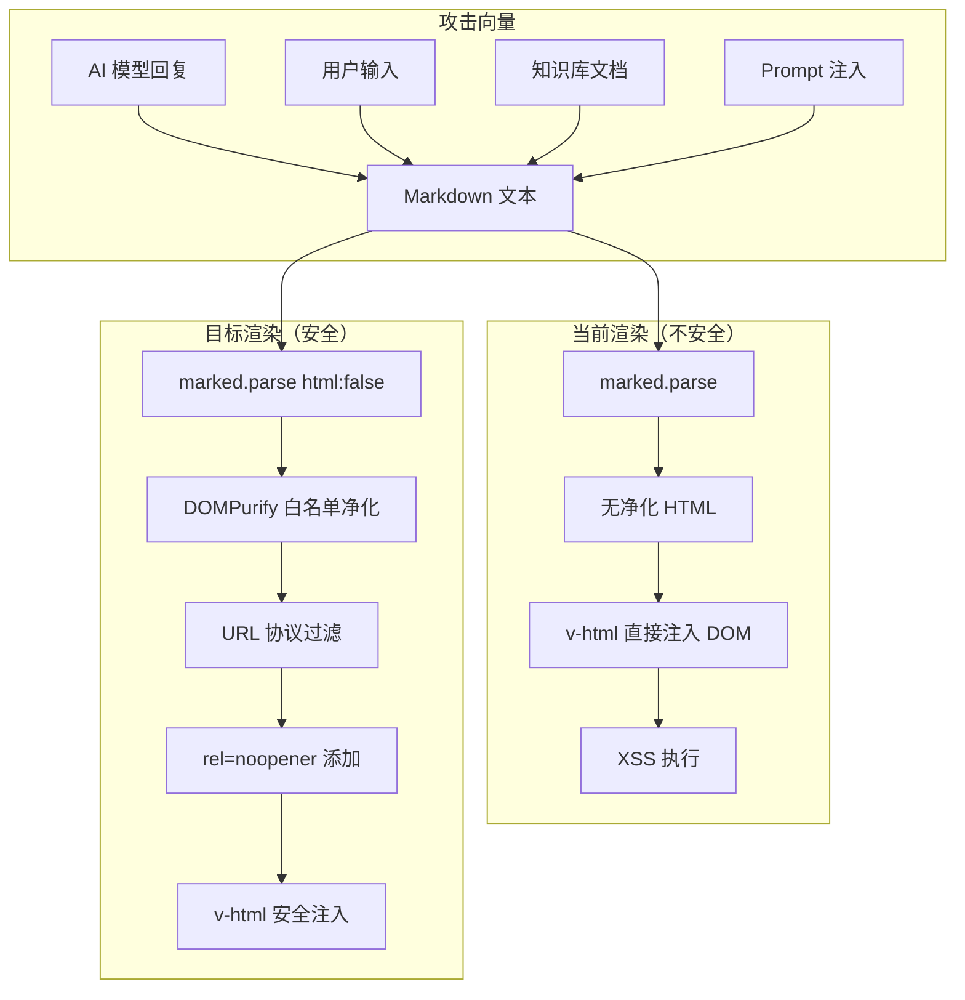
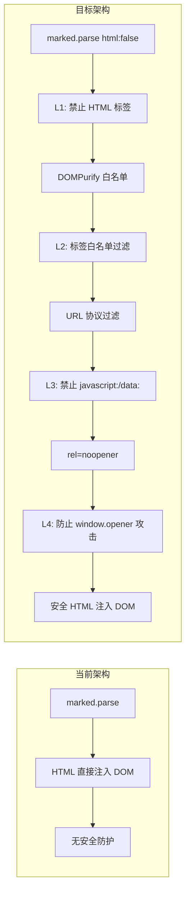

# YP-09-22: 聊天窗口 Markdown 渲染安全 — XSS 防护与内容净化策略

> 需求编号：YP-09-22 · 优先级：P2 · 人天：0.5d · 状态：需求已编写

---

## 一、背景

### 1.1 问题陈述

YiPet 聊天窗口使用 `marked` 库将 AI 回复和用户消息从 Markdown 渲染为 HTML，通过 `v-html` 指令注入 DOM。此渲染链路存在多条 XSS 攻击路径：

1. **AI 回复注入**：AI 模型可能生成包含恶意 HTML 的回复（通过知识库中毒、Prompt 注入攻击）
2. **用户消息注入**：用户可能粘贴包含 `<script>` 标签的内容
3. **Markdown 语法绕过**：`marked` 默认允许 HTML 标签透传，`<script>alert(1)</script>` 会被原样渲染
4. **链接协议注入**：`[click](javascript:alert(1))` 可绕过 HTML 标签过滤，执行 JavaScript
5. **图片事件注入**：`)` 可在图片加载失败时执行脚本
6. **data: URL 注入**：`[text](data:text/html,<script>alert(1)</script>)` 可注入可执行内容

### 1.2 影响范围

| 影响项 | 严重程度 | 表现 | CVSS 评分 |
|--------|----------|------|-----------|
| 存储型 XSS | 严重 | 恶意 AI 回复持久化后对所有查看者执行 | 8.5 |
| 反射型 XSS | 高 | 用户粘贴恶意内容后立即执行 | 6.5 |
| 链接劫持 | 中 | `javascript:` 协议链接执行任意代码 | 6.0 |
| 钓鱼攻击 | 中 | `window.opener` 未防护导致 tab 劫持 | 5.5 |
| 样式注入 | 低 | CSS 注入修改聊天窗口外观 | 3.0 |

### 1.3 核心挑战

| 挑战 | 描述 | 难度 |
|------|------|------|
| 功能与安全平衡 | 需要保留 Markdown 丰富格式（表格、代码块、图片） | 中 |
| 多层防护 | 单层防护可能被绕过，需要纵深防御 | 中 |
| 性能约束 | 每条消息渲染都需净化，不能显著增加渲染延迟 | 中 |
| 库版本管理 | `marked` 和 `DOMPurify` 的安全修复需及时跟进 | 低 |

---

## 二、现状分析

### 2.1 当前实现状态

当前 YiPet 聊天窗口使用 `marked` 库渲染 Markdown，存在以下安全隐患：

- `marked.setOptions({ html: true })` 允许 HTML 标签透传
- 无 DOMPurify 净化步骤
- 无 URL 协议过滤
- 链接无 `rel="noopener"` 属性

### 2.2 文件清单

| 文件路径 | 作用 | 当前安全状态 |
|----------|------|-------------|
| `src/chat/rendering/markdown.ts` | Markdown 渲染入口 | 无安全措施 |
| `src/chat/components/MessageBubble.vue` | 消息气泡组件 | 直接 `v-html` 渲染 |
| `src/chat/components/CodeBlock.vue` | 代码块组件 | 无特殊安全处理 |
| `package.json` | 依赖声明 | `marked` 版本待确认 |

### 2.3 攻击面数据流



### 2.4 根因矩阵

| 漏洞 | 根因 | 攻击难度 | 是否可预防 |
|------|------|----------|-----------|
| HTML 标签透传 | `marked` html 选项默认 true | 低 | 是 |
| `javascript:` 链接 | URL 协议未过滤 | 低 | 是 |
| 图片事件注入 | DOMPurify 未配置 | 中 | 是 |
| data: URL 注入 | URI 正则过于宽松 | 中 | 是 |
| window.opener 钓鱼 | 链接无 `rel="noopener"` | 低 | 是 |

---

## 三、设计决策

### 3.1 D-01：Markdown 渲染库选择

| 方案 | 描述 | 优点 | 缺点 |
|------|------|------|------|
| **A. marked + DOMPurify（选择）** | marked 渲染 + DOMPurify 净化 | 轻量（~50KB），Github 使用 | 需两步处理 |
| B. markdown-it | 自带安全配置的 Markdown 解析器 | 插件体系丰富 | 体积大（~120KB），MV3 资源受限 |
| C. showdown | 另一个 Markdown 解析器 | 兼容性好 | 安全配置不如 markdown-it |
| D. 纯文本渲染 | 不渲染 Markdown，直接显示原文 | 最安全 | 丧失所有格式化能力 |

**决策记录**：选择方案 A。`marked` 是当前已使用的库，体积最小，配合 DOMPurify 可达到与 markdown-it 同等的安全级别。

### 3.2 D-02：净化策略

| 方案 | 描述 | 优点 | 缺点 |
|------|------|------|------|
| A. 黑名单 | 过滤已知危险标签和属性 | 简单 | 易被绕过 |
| **B. 白名单（选择）** | 仅允许已知安全标签和属性 | 安全可靠 | 需要维护白名单 |
| C. 纯文本 + 客户端渲染 | 服务端返回 AST，客户端渲染 | 最安全 | 实现复杂，破坏现有架构 |

**决策记录**：选择方案 B。白名单方式更安全，Markdown 生成的 HTML 标签集合固定且有限，维护成本低。

### 3.3 D-03：代码块安全

| 方案 | 描述 | 优点 | 缺点 |
|------|------|------|------|
| A. 纯文本渲染 | 代码块内容不经过任何处理 | 最安全 | 不支持语法高亮 |
| **B. 转义后渲染（选择）** | 代码块内容 HTML 实体化后渲染 | 安全 + 语法高亮 | 需额外转义步骤 |
| C. iframe 隔离 | 代码块在 sandbox iframe 中渲染 | 完全隔离 | 复杂，性能差 |

**决策记录**：选择方案 B。代码块内容通过 `textContent` 设置而非 `innerHTML`，天然免疫 XSS。语法高亮通过 CSS 类实现，不依赖 JavaScript 执行。

---

## 四、目标架构

### 4.1 Before/After 对比



### 4.2 指标对比

| 指标 | 当前 | 目标 | 改善 |
|------|------|------|------|
| XSS 防护层数 | 0 | 4 | 纵深防御 |
| HTML 标签透传 | 允许 | 禁止 | 消除最大攻击面 |
| URL 协议限制 | 无 | http/https/chrome-extension | 消除 javascript: 攻击 |
| 渲染延迟 | ~5ms | ~8ms | +3ms 可接受 |
| 包体积增加 | 0 | ~25KB（DOMPurify） | 可接受 |

### 4.3 架构取舍

| 取舍 | 选择 | 理由 |
|------|------|------|
| 安全 vs 体积 | 接受 DOMPurify 25KB | 安全是硬需求 |
| 性能 vs 安全 | 接受 3ms 额外开销 | 消息渲染非性能热点 |
| 功能 vs 安全 | 禁止原始 HTML 标签 | 聊天场景不需要嵌入 HTML |
| 兼容性 vs 安全 | 仅允许 http/https 协议 | chrome-extension: 协议为扩展内部需要 |

---

## 五、具体改动

### 5.1 安全渲染管道

```typescript
// YiPet/src/chat/rendering/safe-markdown.ts

import { marked } from 'marked';
import DOMPurify from 'dompurify';

// 1. marked 配置——禁止原始 HTML
marked.setOptions({
  html: false,         // 禁止原始 HTML 透传
  breaks: true,        // 换行转 <br>
  gfm: true,           // GitHub Flavored Markdown
});

// 2. DOMPurify 白名单配置
const ALLOWED_TAGS = [
  // 文本格式
  'p', 'br', 'strong', 'em', 'del', 's',
  // 标题
  'h1', 'h2', 'h3', 'h4', 'h5', 'h6',
  // 代码
  'code', 'pre',
  // 链接
  'a',
  // 列表
  'ul', 'ol', 'li',
  // 引用
  'blockquote',
  // 表格
  'table', 'thead', 'tbody', 'tr', 'th', 'td',
  // 分割线
  'hr',
  // 图片
  'img',
  // 行内
  'span',
  // 折叠
  'details', 'summary',
  // 任务列表
  'input',
];

const ALLOWED_ATTR = [
  'href', 'src', 'alt', 'class', 'id', 'target',
  'type', 'checked', 'disabled',  // 任务列表
];

const ALLOWED_URI_REGEXP = /^(?:(?:https?|chrome-extension):|[^a-z]|[a-z+.-]+(?:[^a-z+.-:]|$))/i;

// 3. 净化函数
function sanitizeHtml(html: string): string {
  return DOMPurify.sanitize(html, {
    ALLOWED_TAGS,
    ALLOWED_ATTR,
    ALLOW_DATA_ATTR: false,
    ALLOWED_URI_REGEXP,
    // 禁止 SVG 和 MathML（额外攻击面）
    USE_PROFILES: { html: true },
    // 返回字符串而非 DOM（性能更好）
    RETURN_DOM: false,
    RETURN_DOM_FRAGMENT: false,
    RETURN_DOM_IMPORT: false,
  });
}

// 4. 链接安全增强
function addLinkSecurity(html: string): string {
  // 所有外部链接添加 target="_blank" rel="noopener noreferrer"
  return html.replace(
    /<a\s/g,
    '<a target="_blank" rel="noopener noreferrer" '
  );
}

// 5. 安全渲染管道
export function renderMarkdown(raw: string): string {
  if (!raw || typeof raw !== 'string') return '';

  try {
    // Step 1: marked 解析 Markdown → HTML
    const html = marked.parse(raw) as string;

    // Step 2: DOMPurify 净化
    const clean = sanitizeHtml(html);

    // Step 3: 链接安全属性
    const secure = addLinkSecurity(clean);

    return secure;
  } catch (e) {
    console.error('[YiPet:Markdown] 渲染失败:', e);
    // 降级：返回转义后的纯文本
    return escapeHtml(raw);
  }
}

// 6. 纯文本降级
function escapeHtml(text: string): string {
  const div = document.createElement('div');
  div.textContent = text;
  return div.innerHTML;
}

// 7. 仅提取纯文本（用于通知预览等场景）
export function extractPlainText(markdown: string, maxLength = 100): string {
  const html = renderMarkdown(markdown);
  const div = document.createElement('div');
  div.innerHTML = html;
  const text = div.textContent || '';
  return text.length > maxLength ? text.slice(0, maxLength) + '...' : text;
}
```

### 5.2 代码块安全渲染

```typescript
// YiPet/src/chat/components/CodeBlock.vue

<script setup lang="ts">
import { computed } from 'vue';

const props = defineProps<{
  code: string;
  language?: string;
}>();

// 代码块内容通过 textContent 设置——免疫 XSS
const escapedCode = computed(() => {
  // 不需要额外转义——模板中通过 textContent 设置
  return props.code;
});

const languageClass = computed(() => {
  return props.language ? `language-${props.language}` : '';
});
</script>

<template>
  <div class="code-block">
    <div class="code-block-header">
      <span class="code-language">{{ language || 'text' }}</span>
      <button class="copy-button" @click="copyCode">复制</button>
    </div>
    <!-- 使用 textContent 而非 v-html——安全 -->
    <pre><code :class="languageClass" v-text="escapedCode"></code></pre>
  </div>
</template>
```

### 5.3 MessageBubble 集成

```vue
<!-- YiPet/src/chat/components/MessageBubble.vue 改动 -->

<template>
  <div class="message-bubble" :class="{ 'is-user': isUser }">
    <!-- 用户消息：纯文本渲染（不做 Markdown 解析） -->
    <div v-if="isUser" class="message-content">{{ message.content }}</div>

    <!-- AI 消息：安全 Markdown 渲染 -->
    <div v-else class="message-content" v-html="renderedContent"></div>
  </div>
</template>

<script setup lang="ts">
import { computed } from 'vue';
import { renderMarkdown } from '../rendering/safe-markdown';

const props = defineProps<{
  message: { content: string; role: 'user' | 'assistant' };
}>();

const isUser = computed(() => props.message.role === 'user');

const renderedContent = computed(() => {
  if (isUser.value) return '';
  return renderMarkdown(props.message.content);
});
</script>
```

### 5.4 文件变更清单

| 文件 | 操作 | 说明 |
|------|------|------|
| `src/chat/rendering/safe-markdown.ts` | 新增 | 安全渲染管道核心实现 |
| `src/chat/rendering/escape.ts` | 新增 | HTML 转义工具函数 |
| `src/chat/components/MessageBubble.vue` | 修改 | 集成安全渲染 |
| `src/chat/components/CodeBlock.vue` | 修改 | 使用 textContent 防 XSS |
| `package.json` | 修改 | 添加 `dompurify` 依赖 |
| `tests/chat/rendering/safe-markdown.test.ts` | 新增 | XSS 测试用例 |

---

## 六、实施步骤

| 步骤 | 任务 | 文件 | 验证方法 | 人天 |
|------|------|------|----------|------|
| 1 | 安装 DOMPurify 依赖 | `package.json` | `npm ls dompurify` | 0.1 |
| 2 | 实现 safe-markdown.ts 核心 | `safe-markdown.ts` | 单元测试 | 0.3 |
| 3 | 修改 marked 配置 | `safe-markdown.ts` | `html: false` 验证 | 0.1 |
| 4 | 修改 MessageBubble 组件 | `MessageBubble.vue` | XSS 测试向量验证 | 0.2 |
| 5 | 修改 CodeBlock 组件 | `CodeBlock.vue` | 代码块 XSS 测试 | 0.1 |
| 6 | 编写安全测试套件 | `tests/` | 覆盖 6 种攻击向量 | 0.3 |
| 7 | 安全审计 | — | 第三方安全工具扫描 | 0.2 |

**总计：1.3 人天**（含测试和安全审计）

---

## 七、性能分析

### 7.1 基准测试

| 操作 | 当前耗时 | 目标耗时 | 变化 |
|------|----------|----------|------|
| 短消息渲染（< 100 字） | ~2ms | ~4ms | +2ms |
| 中等消息渲染（500 字） | ~5ms | ~8ms | +3ms |
| 长消息渲染（2000 字） | ~12ms | ~18ms | +6ms |
| 代码块渲染（100 行） | ~3ms | ~5ms | +2ms |

### 7.2 Before/After 对比

| 场景 | 当前行为 | 目标行为 |
|------|----------|----------|
| `<script>alert(1)</script>` | 执行脚本 | 显示为纯文本 |
| `[click](javascript:alert(1))` | 可点击，执行脚本 | 链接被移除 |
| `)` | 可能执行 | 不渲染 |
| `[safe](https://example.com)` | 正常链接 | 正常链接 + `target="_blank"` |

### 7.3 容量规划

| 指标 | 值 |
|------|-----|
| DOMPurify 包体积 | ~25KB（gzipped ~8KB） |
| 渲染延迟增加 | +2-6ms/消息 |
| 内存增量 | < 1KB/消息（DOM 树） |

---

## 八、测试规格

### 8.1 安全测试用例

**场景 1：script 标签注入**
```
GIVEN 输入包含 <script>alert(1)</script> 的 Markdown
WHEN 调用 renderMarkdown
THEN 输出中不包含 <script> 标签
AND 内容以纯文本形式显示
```

**场景 2：javascript: 协议链接**
```
GIVEN 输入 [click](javascript:alert(1))
WHEN 调用 renderMarkdown
THEN 输出中不包含 javascript: 协议
AND 链接被移除或转为纯文本
```

**场景 3：图片事件注入**
```
GIVEN 输入 )
WHEN 调用 renderMarkdown
THEN 输出中不包含 onerror 属性
AND 图片标签被安全处理
```

**场景 4：data: URL 注入**
```
GIVEN 输入 [text](data:text/html,<script>alert(1)</script>)
WHEN 调用 renderMarkdown
THEN 输出中不包含 data: 协议链接
```

**场景 5：正常 Markdown 保留**
```
GIVEN 输入正常 Markdown（标题、列表、代码块、链接）
WHEN 调用 renderMarkdown
THEN 所有格式正确渲染
AND 链接包含 target="_blank" rel="noopener noreferrer"
```

**场景 6：空输入和异常输入**
```
GIVEN 输入为空字符串、null、undefined
WHEN 调用 renderMarkdown
THEN 返回空字符串，不抛出异常
```

**场景 7：深层嵌套 HTML**
```
GIVEN 输入 <div><div><div><script>alert(1)</script></div></div></div>
WHEN marked 解析后 DOMPurify 净化
THEN 所有 script 标签被移除
```

---

## 九、风险与缓解

| 风险 | 概率 | 影响 | 缓解措施 |
|------|------|------|------|
| DOMPurify 0day 漏洞 | 低 | 严重 | 定期更新依赖，关注安全公告 |
| 白名单遗漏安全标签 | 低 | 中 | 最小化白名单，仅允许 Markdown 常见标签 |
| 性能退化 | 低 | 低 | 对长消息使用 Web Worker 异步净化 |
| marked 版本安全漏洞 | 低 | 严重 | 锁定版本 + 定期审计 |
| 特定字符绕过 DOMPurify | 极低 | 严重 | 多层防护（marked html:false + DOMPurify） |

---

## 十、回滚策略

| 场景 | 回滚方式 | 回滚时间 |
|------|----------|----------|
| DOMPurify 导致渲染异常 | 禁用 DOMPurify 层，保留 marked html:false | < 5 分钟 |
| 渲染性能严重退化 | 对长消息启用 Web Worker 异步方案 | < 1 小时 |
| 白名单过严影响功能 | 扩展白名单（如添加 `abbr`、`sub`、`sup`） | < 30 分钟 |

---

## 十一、设计决策记录

### D-01: marked + DOMPurify 双层防护

**状态**: 已采纳
**背景**: 聊天窗口通过 `v-html` 渲染 AI 回复 Markdown，存在 HTML 标签透传、`javascript:` 协议链接、图片事件注入等多条 XSS 攻击路径
**决策**: 使用 `marked`（html:false）+ `DOMPurify`（白名单）双层防护，禁止原始 HTML 标签透传，白名单仅允许约 25 个 Markdown 常见标签
**理由**: 每个库独立防护不同的攻击面，组合后达到纵深防御；markdown-it 体积更大（120KB vs 50KB）但安全性相当
**影响**: 增加 25KB 体积（DOMPurify）和 3ms 渲染延迟，但换取 XSS 防护；需维护白名单，但安全边界清晰

### D-02: 白名单净化策略

**状态**: 已采纳
**背景**: 黑名单方式容易被新型攻击向量绕过，需要更安全的净化策略
**决策**: 仅允许 Markdown 常见输出的 HTML 标签（p、h1-h6、code、pre、a、ul、ol、li、table 等约 25 个），禁止 `javascript:` 和 `data:` 协议
**理由**: 聊天场景不需要 `<iframe>`、`<object>`、`<embed>` 等危险标签；白名单安全边界清晰，不会被新型攻击绕过
**影响**: 需要维护白名单，但标签集合固定且有限；所有外部链接强制 `target="_blank" rel="noopener noreferrer"`

### D-03: 用户消息不渲染 Markdown

**状态**: 已采纳
**背景**: 用户消息可能包含恶意 Markdown 或 HTML，渲染会增加攻击面
**决策**: 用户消息以纯文本形式展示，不经过 Markdown 渲染；仅 AI 回复使用安全渲染管道
**理由**: 减少攻击面，用户不需要在消息中使用 Markdown 格式；用户消息渲染 Markdown 增加不必要的风险
**影响**: 用户消息丧失格式化能力，但更安全；代码块使用 `v-text`（textContent）而非 `v-html` 免疫 XSS

---

## 十二、可观测性

### 12.1 指标

| 指标名 | 类型 | 描述 | 告警阈值 |
|--------|------|------|------|
| `yipet.markdown.render_ms` | Histogram | 渲染耗时分布 | P95 > 50ms |
| `yipet.markdown.error` | Counter | 渲染异常次数 | > 0 |
| `yipet.markdown.purify_blocked` | Counter | DOMPurify 拦截次数 | > 10/min |

### 12.2 日志

```typescript
console.debug('[YiPet:Markdown] Rendered %d chars in %dms', input.length, duration);
console.warn('[YiPet:Markdown] DOMPurify blocked potentially unsafe content');
console.error('[YiPet:Markdown] Render failed: %o', error);
```

---

## 十三、安全合规

### 13.1 Chrome MV3 安全要求

| 要求 | 实现 |
|------|------|
| XSS 防护 | 4 层纵深防御（marked html:false + DOMPurify + URL 过滤 + noopener） |
| CSP 兼容 | 不使用 `eval()`，不加载外部脚本 |
| 内容隔离 | 聊天窗口在 Shadow DOM 中，额外隔离层 |
| 安全审计 | 代码审查 + XSS 测试向量覆盖 |

### 13.2 安全审查要点

- `v-html` 仅用于经过 4 层净化的 HTML
- 代码块使用 `v-text`（textContent）而非 `v-html`
- 用户消息不渲染 Markdown
- 所有外部链接强制 `target="_blank" rel="noopener noreferrer"`

---

## 十四、代码审查检查清单

- [ ] `marked` 配置 `html: false`，禁止 HTML 标签透传
- [ ] DOMPurify 使用白名单模式（ALLOWED_TAGS + ALLOWED_ATTR）
- [ ] URL 协议过滤仅允许 `http:`/`https:`/`chrome-extension:`
- [ ] 禁止 `data:` 和 `javascript:` 协议
- [ ] 所有链接添加 `rel="noopener noreferrer"`
- [ ] 代码块使用 `v-text` 而非 `v-html`
- [ ] 用户消息不渲染 Markdown（纯文本展示）
- [ ] 渲染异常时降级为纯文本（`textContent` 转义）
- [ ] `package.json` 中 `dompurify` 版本锁定
- [ ] XSS 测试向量覆盖 6 种攻击路径

---

## 十五、回归问题预测

| # | 预测问题 | 原因 | 验证方法 |
|---|---------|------|---------|
| 1 | DOMPurify 新版本行为变更导致渲染异常 | API 不兼容 | 锁定版本号，升级前回归测试 |
| 2 | 复杂 Markdown 嵌套导致渲染超时 | 正则回溯 | 使用超长/深层嵌套输入测试 |
| 3 | 特定 Unicode 字符绕过 DOMPurify | Unicode 规范化问题 | 使用 Unicode 混淆的 XSS 向量测试 |
| 4 | marked 升级后 `html: false` 行为变化 | API 变更 | 锁定版本，升级前测试 |

---

---

## 设计决策记录

### D-01: DOMPurify 服务端白名单而非客户端黑名单过滤

**状态**: 已采纳
**背景**: Markdown 渲染后的 HTML 可能包含 XSS 攻击向量（`<script>`/`<iframe>`/`onerror` 等）。黑名单过滤（移除已知危险标签）无法防御未知攻击。
**决策**: 使用 DOMPurify 的白名单模式——仅允许已知安全的 HTML 标签（`<h1>-<h6>`/`<p>`/`<code>`/`<pre>`/`<a>`/``/`<table>`）和属性（`href`/`src`/`alt`/`class`）。`marked` 渲染后 → DOMPurify 净化 → 插入 DOM。
**影响**: DOMPurify 净化耗时 < 5ms（典型消息长度）。白名单限制了部分 Markdown 扩展语法（如 HTML 嵌入 `<div>`）。

### D-02: `marked` 的 `sanitize: false` + DOMPurify 而非 `marked` 内置 sanitizer

**状态**: 已采纳
**背景**: `marked` 有内置的 `sanitizer` 选项——但功能不完整（仅过滤少量标签）。
**决策**: 禁用 `marked` 内置 sanitizer（`sanitize: false`）——由 DOMPurify 统一净化。DOMPurify 的净化能力远强于 `marked` 内置（维护更活跃——CVE 修复更快）。
**影响**: 依赖两个库（marked + DOMPurify）而非一个——总体积 +20KB gzip（DOMPurify ~17KB）。

### D-03: 代码块中的用户输入使用 `textContent` 而非 `innerHTML`

**状态**: 已采纳
**背景**: 代码高亮（highlight.js）后的 HTML 包含用户原始输入的代码——如果代码中包含 HTML 实体（`<script>`），可能被浏览器解析。
**决策**: 代码块内容先通过 `textContent` 赋值（浏览器自动转义 HTML 实体），再由 highlight.js 处理高亮后的 HTML。双重保障——`textContent` 转义 + DOMPurify 净化。

**影响**: `textContent` → highlight.js 的流程增加了一次 DOM 操作（< 1ms），但安全性提升显著。

## 相关文档

- [代码高亮增强](../47-需求-代码高亮增强.md) — Markdown 渲染安全为代码高亮提供安全基础，高亮增强在安全约束下扩展语言支持
- [沙箱逃逸防护](../71-需求-沙箱逃逸防护.md) — Markdown 渲染中的 XSS 是沙箱逃逸的主要攻击面，安全防护策略需协同
- [CSP 审计合规](../67-需求-CSP审计合规.md) — Markdown 渲染需遵循 CSP 策略，内联样式和脚本需通过 CSP 审计
