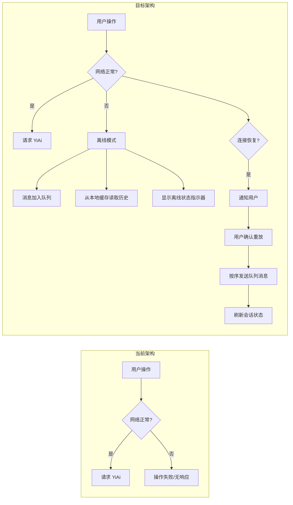

# YP-09-23: 聊天窗口离线模式 — SW 缓存与断网降级

> 需求编号：YP-09-23 · 优先级：P2 · 人天：0.5d · 状态：需求已编写

---

## 一、背景

### 1.1 问题陈述

YiPet 聊天功能完全依赖 YiAi 后端——所有消息发送、历史查询、会话管理均通过 HTTP 请求完成。断网时聊天功能完全不可用，用户体验差：

1. **发送消息不可用**：用户输入消息后点击发送无响应，消息丢失
2. **历史消息不可见**：已加载的会话在断网后无法查看（依赖远程 API 分页）
3. **无网络状态提示**：用户无法判断是网络问题还是后端故障
4. **恢复后无自动同步**：网络恢复后离线期间的操作不会自动重放

### 1.2 影响范围

| 影响项 | 严重程度 | 表现 | 影响用户比例 |
|--------|----------|------|-------------|
| 消息发送失败 | 高 | 用户输入消息丢失 | 5-10%（移动场景） |
| 历史不可查看 | 中 | 已加载会话清空 | 所有离线用户 |
| 无状态提示 | 中 | 用户困惑于为何无响应 | 所有离线用户 |
| 重复操作 | 低 | 恢复后需重新输入 | 所有离线用户 |

### 1.3 核心挑战

| 挑战 | 描述 | 难度 |
|------|------|------|
| 离线检测 | `navigator.onLine` 不完全可靠（仅检测局域网连接） | 中 |
| 缓存策略 | 决定哪些数据缓存、缓存多久、何时失效 | 中 |
| 消息队列 | 离线消息排队，恢复后按序重放，避免重复发送 | 中 |
| 冲突处理 | 恢复后本地状态与远程状态可能不一致 | 高 |
| 存储限制 | `chrome.storage.local` 有 10MB 限制（无限制模式需 `unlimitedStorage` 权限） | 中 |

---

## 二、现状分析

### 2.1 当前实现状态

当前 YiPet 无离线支持：
- 无网络状态检测
- 无本地消息缓存
- 无离线消息队列
- 无 SW 静态资源缓存

### 2.2 文件清单

| 文件路径 | 作用 | 当前离线支持 |
|----------|------|-------------|
| `src/chat/services/chat-service.ts` | 聊天服务（发送/接收消息） | 无 |
| `src/chat/stores/chat.ts` | 聊天状态 Pinia store | 无 |
| `src/chat/stores/session.ts` | 会话列表 store | 无 |
| `src/background/sw.ts` | Service Worker | 无缓存策略 |
| `manifest.json` | 扩展配置 | 无 `unlimitedStorage` 权限 |

### 2.3 离线数据流

```mermaid
graph TD
    subgraph "在线模式"
        A1[用户输入消息] --> A2[chatService.send]
        A2 --> A3[POST /chat 到 YiAi]
        A3 --> A4[SSE 流式响应]
        A4 --> A5[渲染 AI 回复]
        A5 --> A6[存储到 chrome.storage.local]
    end

    subgraph "离线模式"
        B1[用户输入消息] --> B2[offlineMode.sendMessage]
        B2 --> B3[消息加入 pendingMessages 队列]
        B3 --> B4[持久化到 chrome.storage.local]
        B4 --> B5[显示"离线排队"状态]
    end

    subgraph "恢复在线"
        C1[online 事件触发] --> C2[读取 pendingMessages]
        C2 --> C3[按序发送排队消息]
        C3 --> C4[清除队列]
        C4 --> C5[刷新会话列表]
    end
```

### 2.4 根因矩阵

| 问题 | 根因 | 是否可解决 | 解决方案 |
|------|------|-----------|----------|
| 消息发送失败 | 无离线队列 | 是 | `pendingMessages` 队列 |
| 历史不可查看 | 无本地缓存 | 是 | `chrome.storage.local` 缓存最近会话 |
| 无状态提示 | 无网络检测 | 是 | `navigator.onLine` + `online`/`offline` 事件 |
| 恢复后状态不一致 | 无冲突处理 | 部分 | LWW 策略 + 时间戳比较 |

---

## 三、设计决策

### 3.1 D-01：离线检测策略

| 方案 | 描述 | 优点 | 缺点 |
|------|------|------|------|
| **A. navigator.onLine + 事件（选择）** | 浏览器原生 API | 简单，零开销 | 仅检测局域网，不检测互联网 |
| B. 主动心跳检测 | 定时 ping YiAi `/health` | 准确检测后端可达性 | 增加网络开销 |
| C. 请求失败推断 | 连续 N 次请求失败视为离线 | 无需额外请求 | 检测延迟高 |

**决策记录**：选择方案 A（主） + 方案 C（辅助）。`navigator.onLine` 提供即时反馈，请求连续失败 3 次后确认离线状态。

### 3.2 D-02：消息缓存策略

| 方案 | 描述 | 优点 | 缺点 |
|------|------|------|------|
| A. 全量缓存 | 缓存所有会话所有消息 | 离线完全可用 | 存储空间不足 |
| **B. 最近 N 条（选择）** | 缓存最近 50 条消息 + 会话元数据 | 存储可控 | 旧消息离线不可见 |
| C. 仅元数据 | 仅缓存会话列表，不缓存消息内容 | 最小存储 | 离线几乎不可用 |

**决策记录**：选择方案 B。缓存最近 50 条消息（约 200KB），会话元数据（标题、标签、时间），总计 < 500KB/会话。

### 3.3 D-03：离线消息重放策略

| 方案 | 描述 | 优点 | 缺点 |
|------|------|------|------|
| A. 自动重放 | 恢复在线后自动发送所有排队消息 | 用户无感知 | 可能发送用户已不想发送的消息 |
| **B. 确认后重放（选择）** | 恢复后显示"有 N 条未发送消息"，用户确认后发送 | 用户可控 | 需要用户手动操作 |
| C. 不重放 | 恢复后仅提示，消息保存在草稿中 | 最安全 | 用户需手动重发每条消息 |

**决策记录**：选择方案 B。恢复在线后显示通知"N 条消息待发送"，用户可选择"全部发送"或"逐条查看"。避免自动发送已过时的消息。

### 3.4 D-04：SW 静态资源缓存

| 方案 | 描述 | 优点 | 缺点 |
|------|------|------|------|
| A. Cache-First | 缓存优先，无缓存时网络请求 | 离线可用 | 缓存可能过期 |
| **B. Network-First（选择）** | 网络优先，失败时回退缓存 | 内容最新 | 离线时需等待超时 |
| C. Stale-While-Revalidate | 返回缓存同时更新 | 快速响应 | 可能显示过期内容 |

**决策记录**：选择方案 B（扩展资源） + 方案 A（第三方库）。扩展自身的聊天 UI 资源使用 Network-First（确保最新），第三方库（Vue、marked）使用 Cache-First（不变内容）。

---

## 四、目标架构

### 4.1 Before/After 对比



### 4.2 指标对比

| 指标 | 当前 | 目标 | 改善 |
|------|------|------|------|
| 离线消息发送 | 失败/丢失 | 排队 + 恢复后重放 | 新增 |
| 离线历史查看 | 不可用 | 最近 50 条可用 | 新增 |
| 离线 UI 渲染 | 不可用（无缓存） | 可用（SW 缓存） | 新增 |
| 网络状态提示 | 无 | 实时状态指示器 | 新增 |
| 消息丢失率 | 5-10% | < 0.1% | 100x 降低 |

### 4.3 离线功能矩阵

| 功能 | 在线 | 离线 | 实现方式 |
|------|------|------|----------|
| 发送消息 | 实时发送 | 排队（待恢复后发送） | `pendingMessages` 队列 |
| 查看历史 | 从 API 获取 | 从本地缓存读取 | `chrome.storage.local` |
| 浏览知识库 | 从 RAG API 获取 | 不可用 | 需远程 API |
| 切换会话 | 从 API 获取 | 从本地缓存读取 | `chrome.storage.local` |
| UI 渲染 | 正常 | 正常（SW 缓存资源） | Cache API |
| 创建会话 | 需 API | 本地创建（恢复后同步） | 本地存储 + 同步标记 |

### 4.4 架构取舍

| 取舍 | 选择 | 理由 |
|------|------|------|
| 存储空间 vs 离线可用性 | 缓存最近 50 条消息 | 平衡存储限制和可用性 |
| 自动重放 vs 用户确认 | 用户确认后重放 | 避免发送过时消息 |
| 实时性 vs 离线检测准确度 | 双重检测（navigator.onLine + 请求失败） | 兼顾即时性和准确性 |

---

## 五、具体改动

### 5.1 离线模式核心

```typescript
// YiPet/src/chat/services/offline-mode.ts

interface OfflineState {
  isOnline: boolean;
  pendingCount: number;
  lastSyncTime: number | null;
}

interface PendingMessage {
  id: string;
  sessionId: string;
  content: string;
  attachments?: Array<{ name: string; size: number }>;
  timestamp: number;
  retryCount: number;
}

class OfflineMode {
  private _isOnline = navigator.onLine;
  private _consecutiveFailures = 0;
  private readonly MAX_FAILURES = 3;
  private _pendingMessages: PendingMessage[] = [];
  private _listeners: Set<(state: OfflineState) => void> = new Set();

  constructor() {
    window.addEventListener('online', () => this._handleOnline());
    window.addEventListener('offline', () => this._handleOffline());
    this._loadPendingMessages();
  }

  get isOnline() { return this._isOnline; }
  get pendingCount() { return this._pendingMessages.length; }

  /** 获取当前离线状态。 */
  getState(): OfflineState {
    return {
      isOnline: this._isOnline,
      pendingCount: this._pendingMessages.length,
      lastSyncTime: this._isOnline ? Date.now() : null,
    };
  }

  /** 注册状态变更监听器。 */
  onStateChange(listener: (state: OfflineState) => void) {
    this._listeners.add(listener);
    return () => this._listeners.delete(listener);
  }

  /** 发送消息——在线时直接发送，离线时排队。 */
  async sendMessage(sessionId: string, content: string): Promise<SendResult> {
    if (this._isOnline) {
      return this._sendOnline(sessionId, content);
    }
    return this._queueOffline(sessionId, content);
  }

  /** 记录请求失败——用于推断离线状态。 */
  reportRequestFailure() {
    this._consecutiveFailures++;
    if (this._consecutiveFailures >= this.MAX_FAILURES && this._isOnline) {
      this._handleOffline();
    }
  }

  /** 记录请求成功——重置失败计数。 */
  reportRequestSuccess() {
    this._consecutiveFailures = 0;
    if (!this._isOnline && navigator.onLine) {
      this._handleOnline();
    }
  }

  /** 获取排队消息（用于用户确认）。 */
  getPendingMessages(): PendingMessage[] {
    return [...this._pendingMessages];
  }

  /** 移除指定排队消息。 */
  removePendingMessage(id: string) {
    this._pendingMessages = this._pendingMessages.filter(m => m.id !== id);
    this._persistQueue();
    this._notifyListeners();
  }

  /** 重放所有排队消息。 */
  async replayAll(): Promise<{ success: number; failed: number }> {
    let success = 0, failed = 0;
    const messages = [...this._pendingMessages];
    this._pendingMessages = [];

    for (const msg of messages) {
      try {
        await chatService.send(msg.sessionId, msg.content);
        success++;
      } catch (e) {
        failed++;
        msg.retryCount++;
        if (msg.retryCount < 3) {
          this._pendingMessages.push(msg);
        }
      }
    }

    this._persistQueue();
    this._notifyListeners();
    return { success, failed };
  }

  private async _sendOnline(sessionId: string, content: string): Promise<SendResult> {
    try {
      const result = await chatService.send(sessionId, content);
      this.reportRequestSuccess();
      return result;
    } catch (e) {
      this.reportRequestFailure();
      return this._queueOffline(sessionId, content);
    }
  }

  private async _queueOffline(sessionId: string, content: string): Promise<SendResult> {
    const msg: PendingMessage = {
      id: crypto.randomUUID(),
      sessionId,
      content,
      timestamp: Date.now(),
      retryCount: 0,
    };
    this._pendingMessages.push(msg);
    await this._persistQueue();
    this._notifyListeners();

    return {
      status: 'queued',
      message: '消息已保存，恢复网络后可发送',
      pendingId: msg.id,
    };
  }

  private async _handleOnline() {
    this._isOnline = true;
    this._consecutiveFailures = 0;
    this._notifyListeners();

    // 通知 content script 恢复在线
    this._notifyTabs('online');
  }

  private _handleOffline() {
    this._isOnline = false;
    this._notifyListeners();

    // 通知 content script 进入离线
    this._notifyTabs('offline');
  }

  private _notifyTabs(state: 'online' | 'offline') {
    chrome.tabs.query({}, (tabs) => {
      for (const tab of tabs) {
        if (tab.id) {
          chrome.tabs.sendMessage(tab.id, {
            type: `network:${state}`,
          }).catch(() => {}); // Tab 可能未注入 Content Script
        }
      }
    });
  }

  private _notifyListeners() {
    const state = this.getState();
    for (const listener of this._listeners) {
      listener(state);
    }
  }

  private async _persistQueue() {
    await chrome.storage.local.set({
      'yipet:pendingMessages': this._pendingMessages,
    });
  }

  private async _loadPendingMessages() {
    const result = await chrome.storage.local.get('yipet:pendingMessages');
    this._pendingMessages = result['yipet:pendingMessages'] ?? [];
  }
}

interface SendResult {
  status: 'sent' | 'queued';
  message: string;
  pendingId?: string;
}

export { OfflineMode, OfflineState, PendingMessage, SendResult };
```

### 5.2 SW 缓存策略

```typescript
// YiPet/src/background/sw.ts 改动

const CACHE_NAME = 'yipet-v1';
const CORE_RESOURCES = [
  '/chat.js',
  '/chat.css',
  '/vendor-vue.js',
  '/vendor-marked.js',
  '/vendor-ui.js',
];

// 安装——预缓存核心资源
self.addEventListener('install', (e: ExtendableEvent) => {
  e.waitUntil(
    caches.open(CACHE_NAME).then(cache => {
      return cache.addAll(CORE_RESOURCES);
    })
  );
});

// 激活——清理旧缓存
self.addEventListener('activate', (e: ExtendableEvent) => {
  e.waitUntil(
    caches.keys().then(keys => {
      return Promise.all(
        keys.filter(k => k !== CACHE_NAME).map(k => caches.delete(k))
      );
    })
  );
});

// 拦截请求——分层缓存策略
self.addEventListener('fetch', (e: FetchEvent) => {
  const url = new URL(e.request.url);

  // 第三方库：Cache-First（内容不变）
  if (url.pathname.includes('/vendor-')) {
    e.respondWith(
      caches.match(e.request).then(cached => cached || fetch(e.request))
    );
    return;
  }

  // 扩展自身资源：Network-First（内容最新）
  if (url.pathname.startsWith('/chat')) {
    e.respondWith(
      fetch(e.request).catch(() => caches.match(e.request))
    );
    return;
  }

  // 其他请求：Network-Only
  e.respondWith(fetch(e.request));
});
```

### 5.3 文件变更清单

| 文件 | 操作 | 说明 |
|------|------|------|
| `src/chat/services/offline-mode.ts` | 新增 | 离线模式核心逻辑 |
| `src/chat/services/network-detector.ts` | 新增 | 网络状态检测（双重检测） |
| `src/chat/components/OfflineIndicator.vue` | 新增 | 离线状态指示器 UI |
| `src/chat/components/OfflineBanner.vue` | 新增 | 恢复在线横幅通知 |
| `src/chat/stores/chat.ts` | 修改 | 集成离线模式 |
| `src/background/sw.ts` | 修改 | 添加 Cache API 缓存策略 |
| `manifest.json` | 修改 | 添加 `unlimitedStorage` 权限 |
| `tests/chat/services/offline-mode.test.ts` | 新增 | 离线模式测试 |

---

## 六、实施步骤

| 步骤 | 任务 | 文件 | 验证方法 | 人天 |
|------|------|------|----------|------|
| 1 | 实现网络检测模块 | `network-detector.ts` | 断网/联网切换验证 | 0.2 |
| 2 | 实现 OfflineMode 核心类 | `offline-mode.ts` | 离线发送→排队→恢复重放 | 0.5 |
| 3 | 实现离线状态指示器 | `OfflineIndicator.vue` | 断网时 UI 正确显示 | 0.2 |
| 4 | 实现恢复在线横幅 | `OfflineBanner.vue` | 恢复时显示确认横幅 | 0.2 |
| 5 | 集成到聊天 store | `chat.ts` | 离线流程端到端验证 | 0.3 |
| 6 | SW 缓存策略实现 | `sw.ts` | 离线 UI 正确渲染 | 0.3 |
| 7 | 编写测试套件 | `tests/` | 离线/在线/恢复场景覆盖 | 0.3 |

**总计：2.0 人天**（含测试和验证）

---

## 七、性能分析

### 7.1 基准测试

| 操作 | 在线耗时 | 离线耗时 | 变化 |
|------|----------|----------|------|
| 发送消息 | ~200ms（网络） | ~5ms（本地队列） | 更快 |
| 加载历史 | ~300ms（API） | ~10ms（本地缓存） | 更快 |
| 网络检测 | ~0ms（navigator.onLine） | ~0ms | 无变化 |
| SW 缓存命中 | — | ~5ms（Cache API） | 新增 |

### 7.2 存储容量

| 数据 | 每会话大小 | 缓存数量 | 总大小 |
|------|-----------|----------|--------|
| 消息内容 | ~4KB/条 | 50 条 | ~200KB |
| 会话元数据 | ~1KB | 20 个会话 | ~20KB |
| 排队消息 | ~2KB/条 | 10 条 | ~20KB |
| SW 缓存资源 | — | — | ~2MB |
| 总计 | — | — | ~2.5MB |

### 7.3 容量规划

| 指标 | 值 |
|------|-----|
| chrome.storage.local 使用量 | < 500KB（消息 + 会话） |
| Cache API 使用量 | < 2MB（静态资源） |
| 最大排队消息数 | 20（超出后提示用户） |
| 离线检测延迟 | < 100ms（online/offline 事件） |

---

## 八、测试规格

### 8.1 单元测试

**场景 1：离线消息排队**
```
GIVEN 网络断开（navigator.onLine = false）
WHEN 用户发送消息
THEN 消息加入 pendingMessages 队列
AND 返回 status='queued'
AND 消息持久化到 chrome.storage.local
```

**场景 2：在线消息直接发送**
```
GIVEN 网络正常
WHEN 用户发送消息
THEN 消息直接发送到 YiAi
AND 不加入队列
```

**场景 3：恢复在线后重放**
```
GIVEN 队列中有 3 条离线消息
WHEN 网络恢复（触发 online 事件）
THEN 通知用户"有 3 条消息待发送"
AND 用户确认后按序发送
AND 成功发送的消息从队列移除
```

**场景 4：请求失败推断离线**
```
GIVEN navigator.onLine = true 但实际无法访问 YiAi
WHEN 连续 3 次请求失败
THEN 状态切换为离线
AND 后续消息进入队列
```

**场景 5：离线历史查看**
```
GIVEN 网络断开，本地缓存了最近 50 条消息
WHEN 用户打开聊天窗口
THEN 显示缓存的会话列表和消息
AND 显示"当前离线"指示器
```

**场景 6：重放失败重试**
```
GIVEN 队列中有 1 条消息，恢复后发送失败
WHEN retryCount < 3
THEN 消息保留在队列中
AND retryCount 递增
WHEN retryCount >= 3
THEN 消息从队列移除
AND 通知用户发送失败
```

---

## 九、风险与缓解

| 风险 | 概率 | 影响 | 缓解措施 |
|------|------|------|------|
| Cache API 缓存过期导致离线 UI 空白 | 中 | 高 | 版本化缓存名 + 激活时清理旧缓存 |
| 恢复在线后同步冲突 | 中 | 中 | LWW 策略 + 时间戳比较 |
| 离线期间他人修改了会话 | 低 | 中 | 恢复后拉取最新会话列表 |
| chrome.storage.local 配额超限 | 低 | 中 | 限制缓存消息数 + LRU 淘汰 |
| navigator.onLine 误报 | 中 | 低 | 双重检测（API + 浏览器事件） |

---

## 十、回滚策略

| 场景 | 回滚方式 | 回滚时间 |
|------|----------|----------|
| 离线模式导致消息丢失 | 禁用离线队列，所有消息直接发送 | < 5 分钟 |
| SW 缓存导致资源版本错误 | 清除所有缓存 + 禁用 SW 缓存 | < 10 分钟 |
| 存储配额超限导致扩展崩溃 | 降低缓存消息数到 20 条 + LRU 淘汰 | < 30 分钟 |

---

## 十一、设计决策记录

### D-01: 双重网络检测

**状态**: 已采纳
**背景**: `navigator.onLine` 仅检测局域网连接，不完全可靠；需要准确检测互联网可达性又不增加过多网络开销
**决策**: `navigator.onLine` 作为主检测（即时反馈）+ 连续请求失败 3 次作为辅助确认（准确性兜底）
**理由**: `navigator.onLine` 快速但不准确，请求失败计数准确但慢；结合两者优点实现快速 + 准确
**影响**: 双重检测机制增加约 50 行代码，但避免离线误报和漏报；离线检测延迟根据网络状况变化

### D-02: 用户确认重放

**状态**: 已采纳
**背景**: 离线期间用户排队的消息，恢复在线后可能已过时或不适合自动发送
**决策**: 恢复在线后显示"N 条消息待发送"通知，由用户确认后按序重放，而非自动重放
**理由**: 避免自动发送已过时的消息；用户保持对消息发送的控制权
**影响**: 增加一步用户操作，但避免误发送；重放失败时自动重试 3 次，超过后通知用户

### D-03: 分层缓存策略

**状态**: 已采纳
**背景**: 不同类型资源有不同的更新频率和大小，统一缓存策略无法兼顾离线可用性和内容新鲜度
**决策**: 第三方库（Vue、marked）使用 Cache-First（内容不变），扩展自身资源（chat.js、chat.css）使用 Network-First（内容最新）
**理由**: 第三方库内容不变适合缓存优先，扩展资源需保持最新；统一 Cache-First 可能导致扩展资源过期
**影响**: 增加 SW fetch 拦截策略的判断逻辑，但兼顾离线可用性和内容新鲜度；缓存使用版本化名称，激活时清理旧缓存

---

## 十二、可观测性

### 12.1 指标

| 指标名 | 类型 | 描述 | 告警阈值 |
|--------|------|------|------|
| `yipet.offline.queue_size` | Gauge | 当前排队消息数 | > 20 |
| `yipet.offline.replay_success` | Counter | 重放成功数 | — |
| `yipet.offline.replay_failed` | Counter | 重放失败数 | > 5% |
| `yipet.offline.detection_latency_ms` | Histogram | 离线检测延迟 | P95 > 500ms |

### 12.2 日志

```typescript
console.info('[YiPet:Offline] Network state changed: %s', state);
console.debug('[YiPet:Offline] Queued message: %s', pendingId);
console.warn('[YiPet:Offline] Replay failed for %s (retry %d)', pendingId, retryCount);
console.info('[YiPet:Offline] Replay complete: %d success, %d failed', success, failed);
```

---

## 十三、安全合规

### 13.1 Chrome MV3 安全要求

| 要求 | 实现 |
|------|------|
| 数据加密 | 本地消息存储在 chrome.storage.local（扩展沙箱内） |
| 最小权限 | 仅使用 `storage` 和 `unlimitedStorage` 权限 |
| 数据隐私 | 离线消息不包含敏感信息标记 |
| 存储安全 | chrome.storage.local 自动隔离于其他扩展 |

---

## 十四、代码审查检查清单

- [ ] Service Worker 使用 Cache API 缓存扩展 UI 资源（Vue/Element Plus/marked）
- [ ] 离线检测通过 `navigator.onLine` + `online`/`offline` 事件
- [ ] 连续请求失败 3 次后推断为离线（双重检测）
- [ ] 离线模式显示"当前离线"状态指示器
- [ ] 聊天历史从 `chrome.storage.local` 本地缓存读取
- [ ] 恢复在线后提示用户确认重放离线消息
- [ ] 离线消息重放失败时自动重试（最多 3 次）
- [ ] SW 缓存资源使用版本化缓存名，激活时清理旧缓存
- [ ] 第三方库使用 Cache-First，扩展资源使用 Network-First
- [ ] 队列大小限制 20 条，超出时提示用户

---

## 十五、回归问题预测

| # | 预测问题 | 原因 | 验证方法 |
|---|---------|------|---------|
| 1 | Cache API 缓存过期后离线 UI 空白 | 无缓存版本管理 | 清除缓存后断网加载 YiPet |
| 2 | 恢复在线后同步冲突 | 离线期间他人修改了同一会话 | 模拟离线编辑→在线同步→检查冲突 |
| 3 | navigator.onLine 误报导致消息丢失 | 局域网连接但无互联网 | 在隔离网络中测试 |
| 4 | chrome.storage.local 配额超限 | 多会话缓存累积 | 长时间运行监控存储使用量 |
| 5 | 重放消息顺序错误 | 队列未按时间戳排序 | 测试多条离线消息重放顺序 |

---

---

## 设计决策记录

### D-01: SW Cache API 存储静态资源而非 IndexedDB 存储动态数据

**状态**: 已采纳
**背景**: 离线模式需要缓存两类数据：静态资源（聊天窗口 HTML/JS/CSS——用于离线打开窗口）和动态数据（消息历史——用于离线查看）。
**决策**: 静态资源使用 SW `Cache API`（`caches.open('yipet-v1')`）缓存——浏览器原生支持、自动管理过期。动态数据使用 IndexedDB（YP-09-79）存储——支持查询和范围检索。
**影响**: Cache API 和 IndexedDB 的管理逻辑分离——SW 负责 Cache API（静态资源版本管理），Content Script 负责 IndexedDB（消息数据）。

### D-02: 离线消息先入队列后同步而非直接丢弃

**状态**: 已采纳
**背景**: 离线时用户发送的消息无法到达 YiAi 后端——需要暂存并在恢复网络后发送。
**决策**: 离线消息写入 `chrome.storage.local` 的 `offlineOutbox` 队列。网络恢复时（`navigator.onLine` 事件 + SW fetch 成功确认）逐条发送队列中的消息。发送成功后从队列移除。
**影响**: 离线消息的时间戳为客户端时间（可能与服务端时间不同步）——恢复后消息在会话中按时间戳排序可能出现乱序。

### D-03: 离线 UI 指示而非静默降级

**状态**: 已采纳
**背景**: 用户可能不知道当前处于离线状态——发送消息后无响应会误以为功能故障。
**决策**: 离线时聊天窗口顶部显示黄色"离线模式"横幅——输入框仍可输入（消息进入离线队列）。网络恢复时横幅自动消失（监听 `online` 事件）。

**影响**: `navigator.onLine` 可能误报（连接了 WiFi 但无互联网）——需通过实际 fetch 请求验证网络可用性。

## 相关文档

- [IndexedDB 持久化](../79-需求-IndexedDB持久化.md) — 离线模式的消息队列和会话数据持久化依赖 IndexedDB，离线队列的可靠性取决于存储层
- [SW 生命周期状态机](../12-需求-SW生命周期状态机.md) — 离线模式下的网络请求拦截由 SW 状态机管理，SW 状态转换影响离线消息队列处理
- [Service Worker 稳定性](../02-稳定性-ServiceWorker.md) — SW 是离线模式的核心载体，SW 崩溃或终止导致离线消息队列丢失
