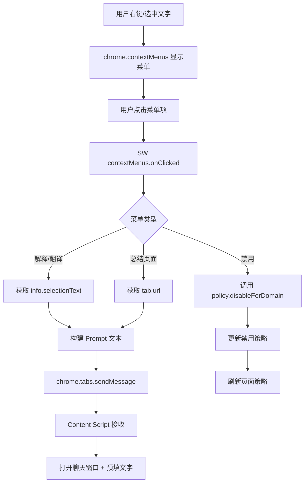

# YP-09-24: Context Menu 右键菜单集成 — 快速操作入口与页面感知

> 需求编号：YP-09-24 · 优先级：P2 · 人天：0.5d · 状态：需求已编写

---

## 一、背景

### 1.1 问题陈述

YiPet 当前操作入口仅两种：Popup 面板和快捷键。用户在日常浏览中遇到以下场景时无法快速触发 AI 操作：

1. **选中文字解释**：阅读技术文档时遇到不懂的术语，需要手动复制→打开 Popup→粘贴→发送
2. **页面内容总结**：阅读长文章时需要 AI 总结，当前流程繁琐
3. **选中文字翻译**：阅读外文内容时快速翻译
4. **快速禁用/启用**：在特定网站上临时禁用 YiPet

`chrome.contextMenus` API 允许在浏览器右键菜单中添加自定义菜单项，可实现页面感知的快速操作入口。

### 1.2 影响范围

| 影响项 | 严重程度 | 表现 | 影响用户比例 |
|--------|----------|------|-------------|
| 操作效率低 | 中 | 需要 4-5 步才能触发 AI 操作 | 80% 活跃用户 |
| 功能可发现性差 | 中 | 用户不知道可以选中文字触发 AI | 60% 新用户 |
| 上下文切换成本高 | 低 | 需要从页面切换到 Popup | 所有用户 |

### 1.3 核心挑战

| 挑战 | 描述 | 难度 |
|------|------|------|
| 菜单项动态管理 | 根据页面状态和用户设置动态显示/隐藏菜单项 | 中 |
| 选中文字获取 | `info.selectionText` 在不同上下文中可用性不一致 | 低 |
| 页面限制 | 部分页面（chrome://、extension pages）不支持 contextMenus | 低 |
| 国际化 | 菜单项标题需要支持多语言 | 中 |

---

## 二、现状分析

### 2.1 当前实现状态

当前 YiPet 无右键菜单集成：
- Service Worker 中无 `chrome.contextMenus` 调用
- 无选中文字传递到聊天窗口的通道
- 无页面级快速操作入口

### 2.2 文件清单

| 文件路径 | 作用 | 当前右键菜单支持 |
|----------|------|-----------------|
| `src/background/sw.ts` | Service Worker 入口 | 无 |
| `src/background/context-menus.ts` | 待实现 | 不存在 |
| `src/content/chat-bridge.ts` | Content Script 与 SW 通信 | 无菜单相关消息 |
| `src/chat/components/ChatInput.vue` | 聊天输入框 | 无预填文字支持 |
| `manifest.json` | 扩展配置 | 无 `contextMenus` 权限 |

### 2.3 数据流



### 2.4 根因矩阵

| 问题 | 根因 | 是否可解决 | 解决方案 |
|------|------|-----------|----------|
| 无右键菜单 | 未实现 `chrome.contextMenus` | 是 | 实现菜单创建 + 事件处理 |
| 无选中文字传递 | 无 Content Script 消息通道 | 是 | `chrome.tabs.sendMessage` |
| 无页面感知 | 未获取 tab 信息 | 是 | `info.pageUrl` + `tab.url` |

---

## 三、设计决策

### 3.1 D-01：菜单创建时机

| 方案 | 描述 | 优点 | 缺点 |
|------|------|------|------|
| **A. onInstalled 创建（选择）** | SW 启动时通过 `chrome.runtime.onInstalled` 创建 | 简单可靠，自动处理更新 | 无法动态增删 |
| B. 按需创建 | 用户首次右键时创建 | 资源高效 | 首次右键可能有延迟 |
| C. 动态重建 | 每次页面变化时更新菜单 | 灵活 | 复杂，性能开销大 |

**决策记录**：选择方案 A。菜单项是静态定义（解释、翻译、总结、禁用），在 `onInstalled` 时创建一次即可。Chrome 会自动处理菜单持久化。

### 3.2 D-02：菜单项粒度

| 方案 | 描述 | 优点 | 缺点 |
|------|------|------|------|
| A. 最小集（3-4 项） | 仅核心操作 | 简洁，低认知负担 | 功能有限 |
| **B. 适度集（5-6 项）（选择）** | 核心 + 常用操作 | 覆盖主要场景 | 略微增加菜单长度 |
| C. 完整集（10+ 项） | 所有 AI 操作 | 功能全面 | 菜单过长，用户难以选择 |

**决策记录**：选择方案 B。包含解释、翻译、总结、搜索、禁用 5 项核心操作，后续可通过设置自定义。

### 3.3 D-03：选中文字长度限制

| 方案 | 描述 | 优点 | 缺点 |
|------|------|------|------|
| A. 无限制 | 任意长度选中文字 | 灵活 | 超长文字可能截断 |
| **B. 500 字符限制（选择）** | 选中文字超过 500 字符时截断 | 控制 Prompt 长度 | 可能丢失上下文 |
| C. 动态限制 | 根据模型上下文窗口调整 | 最大化利用 | 实现复杂 |

**决策记录**：选择方案 B。500 字符适合大多数场景（术语解释、段落翻译），同时避免 Prompt 过长。

---

## 四、目标架构

### 4.1 Before/After 对比

```mermaid
graph LR
    subgraph Before["当前"]
        A1[用户选中文字] --> A2[手动复制]
        A2 --> A3[打开 Popup]
        A3 --> A4[粘贴文字]
        A4 --> A5[发送]
    end

    subgraph After["目标"]
        B1[用户选中文字] --> B2[右键菜单]
        B2 --> B3[点击"解释"]
        B3 --> B4[自动打开聊天窗口]
        B4 --> B5[预填文字 + 自动发送]
    end
```

### 4.2 指标对比

| 指标 | 当前 | 目标 | 改善 |
|------|------|------|------|
| 操作步骤 | 4-5 步 | 2 步（选中→右键→点击） | 2.5x 减少 |
| 操作时间 | 8-15 秒 | 2-3 秒 | 4x 加速 |
| 功能可发现性 | 需阅读文档 | 右键菜单直接可见 | 显著提升 |

### 4.3 架构取舍

| 取舍 | 选择 | 理由 |
|------|------|------|
| 菜单数量 vs 简洁性 | 5 项 | 覆盖主要场景，不增加认知负担 |
| 静态 vs 动态菜单 | 静态创建 | 菜单项固定，无需动态管理 |
| 同步 vs 异步发送 | 异步（sendMessage） | 不阻塞菜单响应 |

---

## 五、具体改动

### 5.1 菜单创建与事件处理

```typescript
// YiPet/src/background/context-menus.ts

interface MenuItemConfig {
  id: string;
  title: string;
  contexts: chrome.contextMenus.ContextType[];
  enabled?: boolean;
}

const MENU_ITEMS: MenuItemConfig[] = [
  {
    id: 'yipet-explain',
    title: 'YiPet: 解释选中文字',
    contexts: ['selection'],
  },
  {
    id: 'yipet-translate',
    title: 'YiPet: 翻译选中文字',
    contexts: ['selection'],
  },
  {
    id: 'yipet-summarize',
    title: 'YiPet: 总结页面内容',
    contexts: ['page'],
  },
  {
    id: 'yipet-search',
    title: 'YiPet: 搜索选中文字',
    contexts: ['selection'],
  },
  {
    id: 'yipet-disable-here',
    title: 'YiPet: 在此网站禁用',
    contexts: ['page'],
  },
];

// SW 启动时创建菜单（幂等——chrome 自动去重）
export function initContextMenus() {
  chrome.runtime.onInstalled.addListener(() => {
    for (const item of MENU_ITEMS) {
      chrome.contextMenus.create({
        id: item.id,
        title: item.title,
        contexts: item.contexts,
        enabled: item.enabled ?? true,
      });
    }
  });
}

// 菜单点击处理
export function handleContextMenuClick(
  info: chrome.contextMenus.OnClickData,
  tab?: chrome.tabs.Tab
) {
  if (!tab?.id) return;

  switch (info.menuItemId) {
    case 'yipet-explain':
      handleExplain(info, tab);
      break;
    case 'yipet-translate':
      handleTranslate(info, tab);
      break;
    case 'yipet-summarize':
      handleSummarize(info, tab);
      break;
    case 'yipet-search':
      handleSearch(info, tab);
      break;
    case 'yipet-disable-here':
      handleDisable(tab);
      break;
  }
}

function handleExplain(info: chrome.contextMenus.OnClickData, tab: chrome.tabs.Tab) {
  const text = truncateSelection(info.selectionText);
  const prompt = `解释以下内容:\n\n${text}`;
  openChatWithPrompt(tab.id!, prompt);
}

function handleTranslate(info: chrome.contextMenus.OnClickData, tab: chrome.tabs.Tab) {
  const text = truncateSelection(info.selectionText);
  const prompt = `将以下内容翻译为中文:\n\n${text}`;
  openChatWithPrompt(tab.id!, prompt);
}

function handleSummarize(info: chrome.contextMenus.OnClickData, tab: chrome.tabs.Tab) {
  const prompt = `请总结当前页面 (${tab.url}) 的主要内容`;
  openChatWithPrompt(tab.id!, prompt);
}

function handleSearch(info: chrome.contextMenus.OnClickData, tab: chrome.tabs.Tab) {
  const text = truncateSelection(info.selectionText);
  const prompt = `搜索以下内容的更多信息:\n\n${text}`;
  openChatWithPrompt(tab.id!, prompt);
}

async function handleDisable(tab: chrome.tabs.Tab) {
  if (!tab.url) return;
  try {
    const hostname = new URL(tab.url).hostname;
    await policy.disableForDomain(hostname);
    // 通知 content script 更新状态
    chrome.tabs.sendMessage(tab.id!, {
      type: 'policy:updated',
      domain: hostname,
      enabled: false,
    }).catch(() => {});
  } catch (e) {
    console.error('[YiPet:ContextMenu] 禁用域名失败:', e);
  }
}

async function openChatWithPrompt(tabId: number, prompt: string) {
  try {
    await chrome.tabs.sendMessage(tabId, {
      type: 'chat:open-with-prompt',
      prompt,
    });
  } catch (e) {
    // Content Script 可能未注入——先注入再重试
    console.warn('[YiPet:ContextMenu] 发送消息失败，尝试注入:', e);
    try {
      await chrome.scripting.executeScript({
        target: { tabId },
        files: ['content.js'],
      });
      // 重试发送
      await chrome.tabs.sendMessage(tabId, {
        type: 'chat:open-with-prompt',
        prompt,
      });
    } catch (e2) {
      console.error('[YiPet:ContextMenu] 重试失败:', e2);
    }
  }
}

function truncateSelection(text: string | undefined, maxLength = 500): string {
  if (!text) return '';
  return text.length > maxLength ? text.slice(0, maxLength) + '...' : text;
}

// 注册事件监听器
export function registerContextMenuListeners() {
  chrome.contextMenus.onClicked.addListener(handleContextMenuClick);
}
```

### 5.2 Content Script 接收处理

```typescript
// YiPet/src/content/chat-bridge.ts 改动

chrome.runtime.onMessage.addListener((message, sender, sendResponse) => {
  switch (message.type) {
    case 'chat:open-with-prompt':
      handleOpenChatWithPrompt(message.prompt);
      sendResponse({ success: true });
      break;
    case 'policy:updated':
      handlePolicyUpdated(message.domain, message.enabled);
      sendResponse({ success: true });
      break;
  }
  return true; // 保持消息通道开放
});

function handleOpenChatWithPrompt(prompt: string) {
  // 打开聊天窗口
  chatWindow.open();
  // 预填文字到输入框
  chatWindow.setInputText(prompt);
  // 可选：自动发送（通过设置控制）
  chrome.storage.local.get('yipet:autoSendContextMenu', (result) => {
    if (result['yipet:autoSendContextMenu']) {
      chatWindow.sendMessage();
    }
  });
}
```

### 5.3 SW 集成

```typescript
// YiPet/src/background/sw.ts 改动

import { initContextMenus, registerContextMenuListeners } from './context-menus';

// SW 启动时初始化
initContextMenus();
registerContextMenuListeners();
```

### 5.4 文件变更清单

| 文件 | 操作 | 说明 |
|------|------|------|
| `src/background/context-menus.ts` | 新增 | 右键菜单创建 + 事件处理 |
| `src/background/sw.ts` | 修改 | 集成菜单初始化 |
| `src/content/chat-bridge.ts` | 修改 | 添加 `chat:open-with-prompt` 消息处理 |
| `src/chat/components/ChatInput.vue` | 修改 | 支持预填文字 + 自动发送 |
| `manifest.json` | 修改 | 添加 `contextMenus` 权限 |
| `tests/background/context-menus.test.ts` | 新增 | 菜单事件处理测试 |

---

## 六、实施步骤

| 步骤 | 任务 | 文件 | 验证方法 | 人天 |
|------|------|------|----------|------|
| 1 | 添加 `contextMenus` 权限 | `manifest.json` | 权限声明正确 | 0.1 |
| 2 | 实现菜单创建逻辑 | `context-menus.ts` | 右键菜单正确显示 | 0.2 |
| 3 | 实现菜单点击处理 | `context-menus.ts` | 各菜单项正确触发 | 0.3 |
| 4 | 实现 Content Script 消息处理 | `chat-bridge.ts` | 聊天窗口预填文字 | 0.2 |
| 5 | ChatInput 预填文字支持 | `ChatInput.vue` | 输入框正确填充 | 0.2 |
| 6 | 集成到 SW | `sw.ts` | 端到端流程验证 | 0.1 |
| 7 | 编写测试 | `tests/` | 菜单事件覆盖 | 0.2 |

**总计：1.3 人天**（含测试）

---

## 七、性能分析

### 7.1 基准测试

| 操作 | 耗时 | 备注 |
|------|------|------|
| 菜单创建（onInstalled） | < 5ms | 5 个菜单项，一次性创建 |
| 菜单点击 → 消息发送 | < 50ms | SW 异步处理 |
| 聊天窗口打开 | ~200ms | Vue 组件挂载 |
| 预填文字 | < 5ms | 直接修改 textarea value |

### 7.2 容量规划

| 指标 | 值 |
|------|-----|
| 菜单项数量 | 5 项（可配置） |
| 选中文字最大长度 | 500 字符 |
| 菜单创建内存占用 | < 1KB（菜单配置） |

---

## 八、测试规格

### 8.1 功能测试

**场景 1：选中文字解释**
```
GIVEN 用户在页面中选中一段文字
AND 右键打开上下文菜单
WHEN 点击"YiPet: 解释选中文字"
THEN 聊天窗口打开
AND 输入框预填"解释以下内容: {选中文字}"
```

**场景 2：页面总结**
```
GIVEN 用户在任意页面右键
WHEN 点击"YiPet: 总结页面内容"
THEN 聊天窗口打开
AND 输入框预填"请总结当前页面的主要内容"
```

**场景 3：选中文字翻译**
```
GIVEN 用户选中一段英文文字
WHEN 点击"YiPet: 翻译选中文字"
THEN 聊天窗口打开
AND 输入框预填"将以下内容翻译为中文: {选中文字}"
```

**场景 4：禁用网站**
```
GIVEN 用户在 example.com 上右键
WHEN 点击"YiPet: 在此网站禁用"
THEN example.com 加入禁用列表
AND 当前页面宠物隐藏
AND 策略持久化到 chrome.storage
```

**场景 5：超长选中文字截断**
```
GIVEN 用户选中 1000 字符的文字
WHEN 点击"解释"
THEN 预填文字截断为 500 字符 + "..."
```

**场景 6：受限页面不显示菜单**
```
GIVEN 用户在 chrome://extensions 页面右键
THEN YiPet 菜单项不显示
AND 无错误日志
```

---

## 九、风险与缓解

| 风险 | 概率 | 影响 | 缓解措施 |
|------|------|------|------|
| contextMenus 权限被用户拒绝 | 低 | 中 | 安装时请求权限，拒绝时提供替代方案（Popup 入口） |
| 菜单项过多导致右键菜单过长 | 低 | 低 | 限制 5 项，后续通过设置自定义 |
| 部分页面不支持 contextMenus | 低 | 低 | 检测受限页面，不显示菜单 |
| 选中文字包含特殊字符导致 Prompt 异常 | 低 | 中 | 对选中文字进行转义处理 |

---

## 十、回滚策略

| 场景 | 回滚方式 | 回滚时间 |
|------|----------|----------|
| 菜单项导致右键菜单异常 | 通过特性开关禁用 contextMenus 功能 | < 5 分钟 |
| 某个菜单项行为异常 | 通过 `chrome.contextMenus.update` 禁用单个菜单项 | < 5 分钟 |
| 权限问题导致扩展加载失败 | 移除 `contextMenus` 权限声明 | < 10 分钟 |

---

## 十一、设计决策记录

### D-01: 静态菜单创建

**状态**: 已采纳
**背景**: 右键菜单项为固定集合（解释、翻译、总结、搜索、禁用），需要决定创建时机以平衡响应速度和维护复杂度
**决策**: 在 `chrome.runtime.onInstalled` 时一次性创建所有菜单项，Chrome 自动持久化，无需每次右键时动态创建
**理由**: 菜单项固定无需动态管理，`onInstalled` 创建是 Chrome 推荐做法；按需创建会导致首次右键有延迟
**影响**: 简单可靠，但无法动态增删菜单项；可通过 `chrome.contextMenus.update` 启用/禁用单个菜单项

### D-02: 500 字符截断

**状态**: 已采纳
**背景**: 用户可能选中超长文本触发右键菜单，需要限制 Prompt 长度以适配模型上下文窗口
**决策**: 选中文字超过 500 字符时截断并添加省略号"..."
**理由**: 500 字符适合大多数场景（术语解释、段落翻译），同时避免 Prompt 过长导致 Token 超限
**影响**: 长文本可能丢失上下文，但适合大多数场景；无限制方案可能导致 Token 超限

### D-03: 可选的自动发送

**状态**: 已采纳
**背景**: 右键菜单触发后，用户可能希望直接发送或修改 Prompt 后再发送
**决策**: 默认仅预填文字到输入框，用户可通过设置开启自动发送
**理由**: 给用户修改 Prompt 的机会，避免误发送；直接自动发送会减少步骤但用户失去控制
**影响**: 增加一次点击操作，但用户保有控制权；设置持久化到 `chrome.storage.local`

---

## 十二、可观测性

### 12.1 指标

| 指标名 | 类型 | 描述 | 告警阈值 |
|--------|------|------|------|
| `yipet.contextmenu.click` | Counter | 菜单点击次数（按 action 分） | — |
| `yipet.contextmenu.error` | Counter | 菜单处理异常次数 | > 0 |
| `yipet.contextmenu.open_chat_ms` | Histogram | 打开聊天窗口耗时 | P95 > 500ms |

### 12.2 日志

```typescript
console.debug('[YiPet:ContextMenu] Created %d menu items', items.length);
console.debug('[YiPet:ContextMenu] Clicked: %s (tab=%d)', menuItemId, tabId);
console.error('[YiPet:ContextMenu] Failed to open chat: %o', error);
```

---

## 十三、安全合规

### 13.1 Chrome MV3 安全要求

| 要求 | 实现 |
|------|------|
| 最小权限 | 仅使用 `contextMenus` 权限 |
| 内容安全 | 菜单项标题为静态文本，不包含用户数据 |
| 数据隐私 | 选中文字不存储，仅用于构建 Prompt |
| 页面限制 | 在 chrome:// 和 extension pages 上不显示菜单 |

---

## 十四、代码审查检查清单

- [ ] 菜单项在 `chrome.runtime.onInstalled` 中创建（幂等）
- [ ] 菜单上下文正确（`selection` 用于文字操作，`page` 用于页面操作）
- [ ] 选中文字通过 `info.selectionText` 获取
- [ ] 超长文字（> 500 字符）自动截断
- [ ] `chrome.tabs.sendMessage` 发送前检查 tab.id 存在
- [ ] Content Script 接收消息后有 `sendResponse` 确认
- [ ] 受限页面（chrome://, extension pages）不显示菜单
- [ ] 菜单项标题支持国际化（i18n）
- [ ] `manifest.json` 中声明 `contextMenus` 权限

---

## 十五、回归问题预测

| # | 预测问题 | 原因 | 验证方法 |
|---|---------|------|---------|
| 1 | 菜单项在扩展更新后重复 | `onInstalled` 多次触发 | 更新扩展后检查菜单项数量 |
| 2 | 选中文字在 iframe 中不可用 | contextMenus 在跨域 iframe 中受限 | 在包含 iframe 的页面测试 |
| 3 | Content Script 未注入时消息发送失败 | 用户禁用了该页面的注入 | 测试禁用页面上的右键菜单行为 |
| 4 | 特殊字符选中文字导致 Prompt 构建异常 | Unicode 字符未正确处理 | 使用多种语言/特殊字符测试 |

---

---

## 设计决策记录

### D-01: `chrome.contextMenus.create` 在 SW 启动时静态注册而非动态创建

**状态**: 已采纳
**背景**: `chrome.contextMenus` 的菜单项需要在用户右键前就绪——如果每次右键时才创建（动态注册），`onClicked` 回调可能未绑定。
**决策**: 所有菜单项在 SW `install` 事件中通过 `chrome.contextMenus.create` 静态注册——包括父菜单（`parentId`）和子菜单（`id`）。菜单项的 `visible`/`enabled` 状态通过 `chrome.contextMenus.update` 动态控制。
**影响**: 菜单项注册后始终存在（即使不可见）——每个菜单项消耗 ~200B 内存。菜单项数量限制在 20 以内。

### D-02: `contexts: ['selection']` 仅在文本选中时显示而非始终显示

**状态**: 已采纳
**背景**: 右键菜单在所有页面始终显示会干扰用户正常操作——用户右键空白区域的目的不是使用 YiPet。
**决策**: 使用 `contexts: ['selection']` 限制菜单仅在用户选中文本时显示。页面感知菜单项（"分析此页面"）使用 `contexts: ['page']`。
**影响**: 部分操作（如"切换宠物可见性"）不依赖页面内容——应始终显示。此类操作通过 Popup 而非右键菜单提供。

### D-03: 菜单项在 SW 中处理而非转发到 Content Script 处理

**状态**: 已采纳
**背景**: `chrome.contextMenus.onClicked` 的回调在 SW 中执行——可以直接调用 `chrome.tabs.sendMessage` 转发操作。无需 Content Script 注册 `onClicked` 监听器。
**决策**: SW 处理所有菜单点击事件——解析 `info.menuItemId` 确定操作类型（`analyze-selection`/`explain-code`），通过 `chrome.tabs.sendMessage` 发送到 Content Script 执行实际逻辑。

**影响**: SW 空闲 30s 终止后，`onClicked` 触发时 Chrome 自动唤醒 SW——首次点击延迟 +50-200ms（冷启动）。

## 相关文档

- [上下文感知菜单](../42-需求-上下文感知菜单.md) — 右键菜单与上下文感知菜单互补，右键菜单提供全局操作入口，上下文感知菜单提供页面内联操作
- [快捷键系统](../29-需求-快捷键系统.md) — 右键菜单操作可通过快捷键触发，快捷键注册与菜单项 ID 需保持一致
- [通知提醒系统](../25-需求-通知提醒系统.md) — 右键菜单触发长耗时操作时，通过通知提醒系统反馈操作结果
