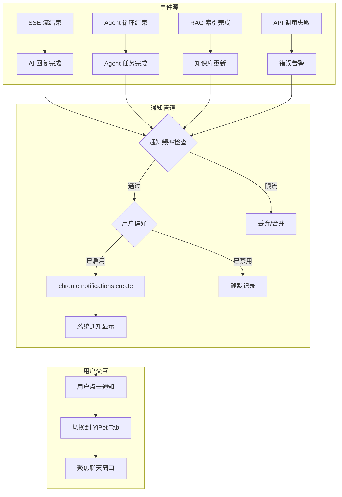
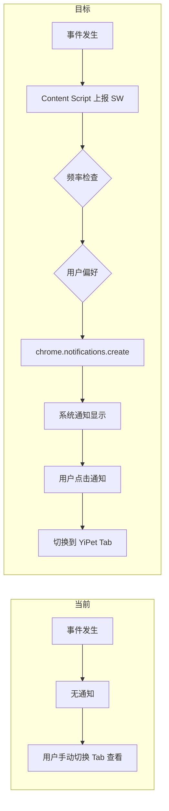

# YP-09-25: 聊天窗口通知与提醒系统 — chrome.notifications 集成

> 需求编号：YP-09-25 · 优先级：P2 · 人天：0.5d · 状态：需求已编写

---

## 一、背景

### 1.1 问题陈述

YiPet 聊天过程中，用户切换到其他 Tab 后无法感知以下关键事件：

1. **AI 回复完成**：用户发送消息后切换到其他 Tab，不知道 AI 何时回复完成
2. **Agent 任务完成**：Agent 循环执行耗时较长（数秒到数分钟），用户无法感知完成状态
3. **知识库索引更新**：RAG 索引重建完成后无通知
4. **错误告警**：API 调用失败、SSE 连接中断等异常无及时通知
5. **长时间无响应**：AI 服务超时或卡住时用户无感知

### 1.2 影响范围

| 影响项 | 严重程度 | 表现 | 影响用户比例 |
|--------|----------|------|-------------|
| 回复等待焦虑 | 中 | 用户频繁切换 Tab 查看回复 | 60% 活跃用户 |
| Agent 任务超时不知 | 中 | 等待数分钟不知任务状态 | 30%（使用 Agent 功能） |
| 错误无感知 | 高 | 消息发送失败用户不知 | 10-15% |
| 知识库更新无感知 | 低 | 索引更新后用户仍使用旧知识 | 5% |

### 1.3 核心挑战

| 挑战 | 描述 | 难度 |
|------|------|------|
| 通知频率控制 | 高频通知导致用户反感并关闭通知权限 | 中 |
| 跨平台兼容 | macOS Focus 模式、Windows 通知中心、Linux 通知行为不一致 | 中 |
| 通知优先级 | 不同事件需要不同的通知优先级和展示方式 | 低 |
| 通知持久化 | 用户未看到通知时如何处理 | 中 |

---

## 二、现状分析

### 2.1 当前实现状态

当前 YiPet 无通知系统：
- 无 `chrome.notifications` API 调用
- 无通知权限请求
- 用户只能通过手动切换 Tab 查看状态
- 错误信息仅显示在控制台

### 2.2 文件清单

| 文件路径 | 作用 | 当前通知支持 |
|----------|------|-------------|
| `src/background/sw.ts` | Service Worker 入口 | 无 |
| `src/background/notifications.ts` | 待实现 | 不存在 |
| `src/chat/services/chat-service.ts` | 聊天服务 | 无完成通知 |
| `src/chat/services/agent-loop.ts` | Agent 循环 | 无完成通知 |
| `src/content/chat-bridge.ts` | 消息通道 | 无通知相关消息 |
| `manifest.json` | 扩展配置 | 无 `notifications` 权限 |

### 2.3 通知数据流



### 2.4 根因矩阵

| 问题 | 根因 | 是否可解决 | 解决方案 |
|------|------|-----------|----------|
| 无事件通知 | 未实现通知系统 | 是 | `chrome.notifications` API |
| 无频率控制 | 无限流机制 | 是 | 滑动窗口限流 |
| 无用户偏好 | 无通知设置 | 是 | 通知偏好存储 + 设置页面 |

---

## 三、设计决策

### 3.1 D-01：通知触发方式

| 方案 | 描述 | 优点 | 缺点 |
|------|------|------|------|
| **A. SW 主动推送（选择）** | SW 监听事件并通过 `chrome.notifications` 推送 | 即使 Tab 不可见也能通知 | 需 SW 与 Content Script 通信 |
| B. Content Script 触发 | Content Script 直接调用 `chrome.notifications` | 简单 | Tab 不可见时可能无法触发 |
| C. 轮询检测 | Content Script 定时检查状态 | 简单 | 延迟高，资源浪费 |

**决策记录**：选择方案 A。SW 持续运行，即使所有 Tab 关闭也能发送通知。Content Script 通过消息通道将事件上报给 SW。

### 3.2 D-02：通知频率控制

| 方案 | 描述 | 优点 | 缺点 |
|------|------|------|------|
| A. 无限制 | 每个事件都发送通知 | 实时 | 高频骚扰 |
| **B. 滑动窗口限流（选择）** | 每类通知每分钟最多 1 条 | 控制频率 | 可能丢失部分通知 |
| C. 合并通知 | 多条同类通知合并为 1 条 | 最简洁 | 延迟高，信息密度大 |

**决策记录**：选择方案 B。每类通知独立限流（1 条/分钟），使用 `chrome.notifications` 的 `priority` 字段区分紧急程度。

### 3.3 D-03：通知优先级

| 优先级 | 事件类型 | 展示方式 | 是否需要用户交互 |
|--------|----------|----------|-----------------|
| 2（高） | 错误告警、Agent 任务完成 | 系统通知 + 声音 | 是（点击查看详情） |
| 1（中） | AI 回复完成 | 系统通知 | 否（点击聚焦聊天） |
| 0（低） | 知识库更新、连接状态变更 | 系统通知（静默） | 否 |

### 3.4 D-04：用户偏好设置

| 设置项 | 默认值 | 选项 |
|--------|--------|------|
| 通知开关 | 开启 | 开启 / 关闭 |
| AI 回复通知 | 开启 | 开启 / 关闭 |
| Agent 任务通知 | 开启 | 开启 / 关闭 |
| 错误通知 | 开启 | 开启 / 关闭 |
| 知识库通知 | 关闭 | 开启 / 关闭 |
| 通知声音 | 开启 | 开启 / 关闭 |

---

## 四、目标架构

### 4.1 Before/After 对比



### 4.2 指标对比

| 指标 | 当前 | 目标 | 改善 |
|------|------|------|------|
| 事件通知覆盖率 | 0% | 100%（4 类事件） | 新增 |
| 回复等待感知 | 需手动切换 Tab | 系统通知提示 | 显著提升 |
| 错误发现时间 | 数分钟（手动检查） | < 5 秒（通知） | 60x 加速 |
| 通知骚扰率 | N/A | < 1 条/分钟 | 受控 |

### 4.3 架构取舍

| 取舍 | 选择 | 理由 |
|------|------|------|
| 实时性 vs 骚扰 | 每分钟限流 1 条 | 高频通知导致用户关闭权限 |
| 所有事件 vs 选择性通知 | 用户可配置每类事件 | 不同用户需求不同 |
| SW 推送 vs CS 触发 | SW 推送 | Tab 不可见时仍需通知 |

---

## 五、具体改动

### 5.1 通知管理器

```typescript
// YiPet/src/background/notifications.ts

type NotificationType = 'ai_response' | 'agent_task' | 'rag_index' | 'error';

interface NotificationConfig {
  type: NotificationType;
  title: string;
  message: string;
  priority: 0 | 1 | 2;
  requireInteraction: boolean;
  icon?: string;
}

class NotificationManager {
  private _enabled = true;
  private _preferences: Record<NotificationType, boolean> = {
    ai_response: true,
    agent_task: true,
    rag_index: false,
    error: true,
  };
  // 频率控制：每类通知的最近发送时间
  private _lastSentTimes: Map<NotificationType, number> = new Map();
  private readonly THROTTLE_MS = 60_000; // 1 分钟

  async init() {
    const result = await chrome.storage.local.get([
      'yipet:notifications:enabled',
      'yipet:notifications:preferences',
    ]);
    this._enabled = result['yipet:notifications:enabled'] ?? true;
    if (result['yipet:notifications:preferences']) {
      this._preferences = {
        ...this._preferences,
        ...result['yipet:notifications:preferences'],
      };
    }
  }

  /** 发送通知——带频率控制和偏好检查。 */
  async notify(
    type: NotificationType,
    title: string,
    message: string,
    options?: {
      priority?: 0 | 1 | 2;
      requireInteraction?: boolean;
    }
  ): Promise<boolean> {
    // 全局开关
    if (!this._enabled) return false;

    // 类型偏好
    if (!this._preferences[type]) return false;

    // 频率控制
    const lastSent = this._lastSentTimes.get(type) ?? 0;
    if (Date.now() - lastSent < this.THROTTLE_MS) {
      console.debug(`[YiPet:Notify] ${type} 通知已限流`);
      return false;
    }

    this._lastSentTimes.set(type, Date.now());

    return new Promise((resolve) => {
      chrome.notifications.create({
        type: 'basic',
        iconUrl: options?.icon || 'icons/icon128.png',
        title,
        message,
        priority: options?.priority ?? 1,
        requireInteraction: options?.requireInteraction ?? false,
        silent: options?.priority === 0,
      }, (notificationId) => {
        if (chrome.runtime.lastError) {
          console.error('[YiPet:Notify] 创建通知失败:', chrome.runtime.lastError);
          resolve(false);
        } else {
          console.debug(`[YiPet:Notify] 通知已创建: ${notificationId} (${type})`);
          resolve(true);
        }
      });
    });
  }

  /** AI 回复完成通知。 */
  async onAiResponseComplete(sessionTitle: string, preview: string) {
    return this.notify(
      'ai_response',
      'YiPet 回复完成',
      `[${sessionTitle}] ${preview.slice(0, 100)}...`,
      { priority: 1 }
    );
  }

  /** Agent 任务完成通知。 */
  async onAgentTaskComplete(sessionTitle: string, iterations: number, duration: number) {
    return this.notify(
      'agent_task',
      'Agent 任务完成',
      `[${sessionTitle}] ${iterations} 轮迭代完成 (${(duration / 1000).toFixed(1)}s)`,
      { priority: 2, requireInteraction: false }
    );
  }

  /** 知识库索引更新通知。 */
  async onRagIndexUpdated(docCount: number, duration: number) {
    return this.notify(
      'rag_index',
      '知识库索引更新',
      `${docCount} 个文档已索引 (${(duration / 1000).toFixed(1)}s)`,
      { priority: 0 }
    );
  }

  /** 错误告警通知。 */
  async onError(errorType: string, detail: string) {
    return this.notify(
      'error',
      `YiPet 错误: ${errorType}`,
      detail.slice(0, 200),
      { priority: 2, requireInteraction: true }
    );
  }

  /** 更新用户偏好。 */
  async updatePreferences(prefs: Partial<Record<NotificationType, boolean>>) {
    this._preferences = { ...this._preferences, ...prefs };
    await chrome.storage.local.set({
      'yipet:notifications:preferences': this._preferences,
    });
  }

  /** 启用/禁用所有通知。 */
  async setEnabled(enabled: boolean) {
    this._enabled = enabled;
    await chrome.storage.local.set({
      'yipet:notifications:enabled': enabled,
    });
  }

  get enabled() { return this._enabled; }
  get preferences() { return { ...this._preferences }; }
}

// 通知点击处理——切换到 YiPet Tab
function handleNotificationClick(notificationId: string) {
  chrome.tabs.query({ active: true, currentWindow: true }, ([tab]) => {
    if (tab?.id) {
      chrome.tabs.sendMessage(tab.id, { type: 'chat:focus' }).catch(() => {});
    }
  });
}

// 注册事件监听器
function registerNotificationListeners() {
  chrome.notifications.onClicked.addListener(handleNotificationClick);
}

export { NotificationManager, registerNotificationListeners, NotificationType };
```

### 5.2 Content Script 事件上报

```typescript
// YiPet/src/content/chat-bridge.ts 改动

// 在 SSE 流结束时上报 SW
function onStreamComplete(sessionTitle: string, preview: string) {
  chrome.runtime.sendMessage({
    type: 'notification:ai_response',
    payload: { sessionTitle, preview },
  }).catch(() => {});
}

// 在 Agent 循环结束时上报
function onAgentComplete(sessionTitle: string, iterations: number, duration: number) {
  chrome.runtime.sendMessage({
    type: 'notification:agent_task',
    payload: { sessionTitle, iterations, duration },
  }).catch(() => {});
}

// 在 API 错误时上报
function onApiError(errorType: string, detail: string) {
  chrome.runtime.sendMessage({
    type: 'notification:error',
    payload: { errorType, detail },
  }).catch(() => {});
}
```

### 5.3 SW 消息处理

```typescript
// YiPet/src/background/sw.ts 改动

const notificationManager = new NotificationManager();

chrome.runtime.onMessage.addListener((message, sender, sendResponse) => {
  switch (message.type) {
    case 'notification:ai_response':
      notificationManager.onAiResponseComplete(
        message.payload.sessionTitle,
        message.payload.preview
      );
      break;
    case 'notification:agent_task':
      notificationManager.onAgentTaskComplete(
        message.payload.sessionTitle,
        message.payload.iterations,
        message.payload.duration
      );
      break;
    case 'notification:error':
      notificationManager.onError(
        message.payload.errorType,
        message.payload.detail
      );
      break;
    case 'notification:update_preferences':
      notificationManager.updatePreferences(message.payload);
      break;
  }
  sendResponse({ success: true });
  return true;
});
```

### 5.4 文件变更清单

| 文件 | 操作 | 说明 |
|------|------|------|
| `src/background/notifications.ts` | 新增 | 通知管理器核心实现 |
| `src/background/sw.ts` | 修改 | 集成通知管理器和消息处理 |
| `src/content/chat-bridge.ts` | 修改 | 添加事件上报逻辑 |
| `src/chat/services/chat-service.ts` | 修改 | SSE 流结束时触发通知 |
| `src/chat/services/agent-loop.ts` | 修改 | Agent 循环结束时触发通知 |
| `src/popup/components/NotificationSettings.vue` | 新增 | 通知偏好设置页面 |
| `manifest.json` | 修改 | 添加 `notifications` 权限 |
| `tests/background/notifications.test.ts` | 新增 | 通知管理器测试 |

---

## 六、实施步骤

| 步骤 | 任务 | 文件 | 验证方法 | 人天 |
|------|------|------|----------|------|
| 1 | 添加 `notifications` 权限 | `manifest.json` | 权限声明正确 | 0.1 |
| 2 | 实现 NotificationManager 核心 | `notifications.ts` | 单元测试（限流、偏好） | 0.3 |
| 3 | 实现消息通道 | `sw.ts` + `chat-bridge.ts` | 端到端通知发送 | 0.2 |
| 4 | SSE 流结束事件触发 | `chat-service.ts` | AI 回复完成通知 | 0.2 |
| 5 | Agent 循环结束事件触发 | `agent-loop.ts` | Agent 任务完成通知 | 0.1 |
| 6 | 实现通知设置页面 | `NotificationSettings.vue` | UI 正确显示和保存 | 0.2 |
| 7 | 编写测试 | `tests/` | 覆盖所有通知类型 | 0.2 |

**总计：1.3 人天**（含测试）

---

## 七、性能分析

### 7.1 基准测试

| 操作 | 耗时 | 备注 |
|------|------|------|
| 通知创建 | < 5ms | `chrome.notifications.create` 异步 |
| 频率检查 | < 1ms | Map 查找 |
| 偏好读取 | < 5ms | `chrome.storage.local.get` |
| 消息上报（CS → SW） | < 10ms | `chrome.runtime.sendMessage` |

### 7.2 容量规划

| 指标 | 值 |
|------|-----|
| 最大通知频率 | 1 条/分钟/类型 |
| 通知图标大小 | < 10KB |
| 通知消息最大长度 | 200 字符 |
| 偏好存储大小 | < 200 bytes |

---

## 八、测试规格

### 8.1 功能测试

**场景 1：AI 回复完成通知**
```
GIVEN 用户发送消息后切换到其他 Tab
AND 通知偏好中 ai_response 已开启
WHEN SSE 流结束（AI 回复完成）
THEN 系统显示通知"YiPet 回复完成"
AND 通知包含会话标题和回复预览
AND 点击通知后切换到 YiPet Tab
```

**场景 2：频率限流**
```
GIVEN 用户在 1 分钟内收到 3 条 AI 回复
WHEN 第 1 条通知发送成功
AND 第 2、3 条在 1 分钟窗口内
THEN 第 2、3 条通知被限流
AND 日志记录限流信息
```

**场景 3：用户偏好过滤**
```
GIVEN 用户在设置中关闭了 AI 回复通知
WHEN AI 回复完成
THEN 不发送通知
AND 日志不记录错误
```

**场景 4：错误告警通知**
```
GIVEN API 调用失败
AND 通知偏好中 error 已开启
WHEN 错误发生
THEN 系统显示通知"YiPet 错误: {错误类型}"
AND 通知优先级为 2（高）
AND requireInteraction 为 true
```

**场景 5：全局通知开关**
```
GIVEN 用户在设置中关闭了所有通知
WHEN 任何事件触发
THEN 不发送任何通知
```

**场景 6：Agent 任务完成通知**
```
GIVEN Agent 循环执行了 5 轮迭代
WHEN Agent 循环结束
THEN 通知显示"5 轮迭代完成"
AND 显示总耗时
```

---

## 九、风险与缓解

| 风险 | 概率 | 影响 | 缓解措施 |
|------|------|------|------|
| macOS Focus 模式拦截通知 | 中 | 中 | 使用 `requireInteraction: true` 提升优先级 |
| 高频通知导致用户关闭权限 | 中 | 高 | 每分钟限流 1 条 + 用户可配置 |
| `chrome.notifications` 权限被拒绝 | 低 | 中 | 安装时请求，拒绝时静默降级 |
| 通知在 Linux 上不显示 | 低 | 低 | 降级为 console 日志 |

---

## 十、回滚策略

| 场景 | 回滚方式 | 回滚时间 |
|------|----------|----------|
| 通知导致用户投诉 | 通过设置关闭默认通知，改为用户主动开启 | < 5 分钟 |
| 通知频率过高 | 提高限流阈值到 1 条/5 分钟 | < 10 分钟 |
| 通知权限问题 | 移除 `notifications` 权限声明 | < 10 分钟 |

---

## 十一、设计决策记录

### D-01: SW 推送模式

**状态**: 已采纳
**背景**: 通知需要在 Tab 不可见时也能发送，Content Script 在 Tab 关闭后无法执行
**决策**: Service Worker 作为通知发送的唯一入口，Content Script 通过消息通道将事件上报给 SW
**理由**: SW 在 Tab 不可见甚至关闭时仍持续运行，Content Script 可能被销毁；Content Script 直接发送无法保证通知可靠性
**影响**: 增加 CS → SW 通信开销（< 10ms），但保证通知可靠性；需维护 SW 中的通知管理器和消息路由

### D-02: 滑动窗口限流

**状态**: 已采纳
**背景**: 高频通知是用户关闭通知权限的首要原因，需要控制通知频率
**决策**: 每类通知（AI 回复、Agent 任务、知识库、错误）独立限流，每分钟最多 1 条
**理由**: 无限制通知会导致用户投诉并关闭权限；不同类型的通知有不同的紧急程度，需独立限流
**影响**: 可能丢失部分通知，但保护用户体验；使用 `priority` 字段区分紧急程度（2=高/1=中/0=低）

### D-03: 用户可配置偏好

**状态**: 已采纳
**背景**: 不同用户对通知的需求不同，全局开关粒度太粗
**决策**: 每类通知独立开关（AI 回复/Agent 任务/知识库/错误）+ 全局开关，用户可自定义
**理由**: 用户可能只想接收错误通知但不需要 AI 回复通知；全局开关无法满足差异化需求
**影响**: 增加设置 UI 复杂度，但提升用户满意度；偏好持久化到 `chrome.storage.local`

---

## 十二、可观测性

### 12.1 指标

| 指标名 | 类型 | 描述 | 告警阈值 |
|--------|------|------|------|
| `yipet.notification.sent` | Counter | 通知发送次数（按类型分） | — |
| `yipet.notification.throttled` | Counter | 通知被限流次数 | > 10/min |
| `yipet.notification.error` | Counter | 通知创建失败次数 | > 0 |
| `yipet.notification.clicked` | Counter | 通知被点击次数 | — |

### 12.2 日志

```typescript
console.debug('[YiPet:Notify] Created: %s (%s)', notificationId, type);
console.debug('[YiPet:Notify] Throttled: %s (last sent %dms ago)', type, elapsed);
console.error('[YiPet:Notify] Failed to create: %s', chrome.runtime.lastError?.message);
```

---

## 十三、安全合规

### 13.1 Chrome MV3 安全要求

| 要求 | 实现 |
|------|------|
| 最小权限 | 仅使用 `notifications` 权限 |
| 数据隐私 | 通知内容不包含敏感信息 |
| 用户控制 | 所有通知类型可独立开关 |
| 平台兼容 | 通知在受限平台上静默降级 |

---

## 十四、代码审查检查清单

- [ ] 通知通过 `chrome.notifications` API 创建（系统级通知）
- [ ] 通知类型：AI 回复完成 / Agent 任务完成 / 知识库更新 / 错误告警
- [ ] 通知点击回调查看详情（跳转到聊天窗口）
- [ ] 通知优先级分级：2（高）/ 1（中）/ 0（低）
- [ ] 通知频率限制：每类通知最多 1 条/分钟
- [ ] 用户偏好：每类通知独立开关 + 全局开关
- [ ] 通知设置持久化到 `chrome.storage.local`
- [ ] 通知权限被拒绝时静默降级
- [ ] `manifest.json` 中声明 `notifications` 权限

---

## 十五、回归问题预测

| # | 预测问题 | 原因 | 验证方法 |
|---|---------|------|---------|
| 1 | macOS Focus 模式下通知被系统拦截 | 系统级通知设置覆盖扩展权限 | macOS 开启 Focus → 检查通知是否出现 |
| 2 | 高频通知导致用户关闭通知权限 | 无频率限制的聊天通知 | 连续发送 10 条消息 → 检查通知是否被限流 |
| 3 | 通知在 Linux 上不显示 | 缺少通知守护进程 | 在无 DE 的 Linux 环境测试 |
| 4 | 通知点击后无法定位 Tab | Tab 已被关闭 | 关闭 Tab 后点击通知检查行为 |

---

---

## 设计决策记录

### D-01: SW 代理推送而非 Content Script 直接调用 `chrome.notifications`

**状态**: 已采纳
**背景**: `chrome.notifications.create` 在 Content Script 中可用但受宿主页面焦点限制——页面不可见时通知可能被抑制。
**决策**: Content Script 通过 `chrome.runtime.sendMessage` 将通知请求发送到 SW——SW 调用 `chrome.notifications.create`。SW 不受页面焦点限制——通知始终送达。
**影响**: 增加的 IPC 往返延迟 < 10ms——对通知延迟无感知影响。

### D-02: 滑动窗口限流而非固定间隔限流

**状态**: 已采纳
**背景**: AI 快速连续回复时可能触发多条通知——需限制通知频率避免骚扰用户。
**决策**: 滑动窗口算法——每 60s 最多 3 条通知。超出限制的通知合并为摘要通知（"3 条新消息"）。
**影响**: 60s/3条的阈值需根据用户反馈调整——过于宽松骚扰用户，过于严格遗漏重要通知。

### D-03: 免打扰模式基于 Tab 活跃状态自动切换而非手动开关

**状态**: 已采纳
**背景**: 用户在当前 Tab 活跃聊天时不需要通知——消息已在屏幕上可见。
**决策**: 检测当前 Tab 是否为 YiPet 活跃 Tab（`document.visibilityState === 'visible'` + 聊天窗口打开）。活跃 Tab 中自动启用免打扰（不弹通知），非活跃 Tab 中恢复通知。
**影响**: 跨 Tab 场景——用户可能在 Tab A 编辑文档、Tab B 等待 AI 回复——Tab B 的通知应正常发送（免打扰仅限活跃 Tab）。